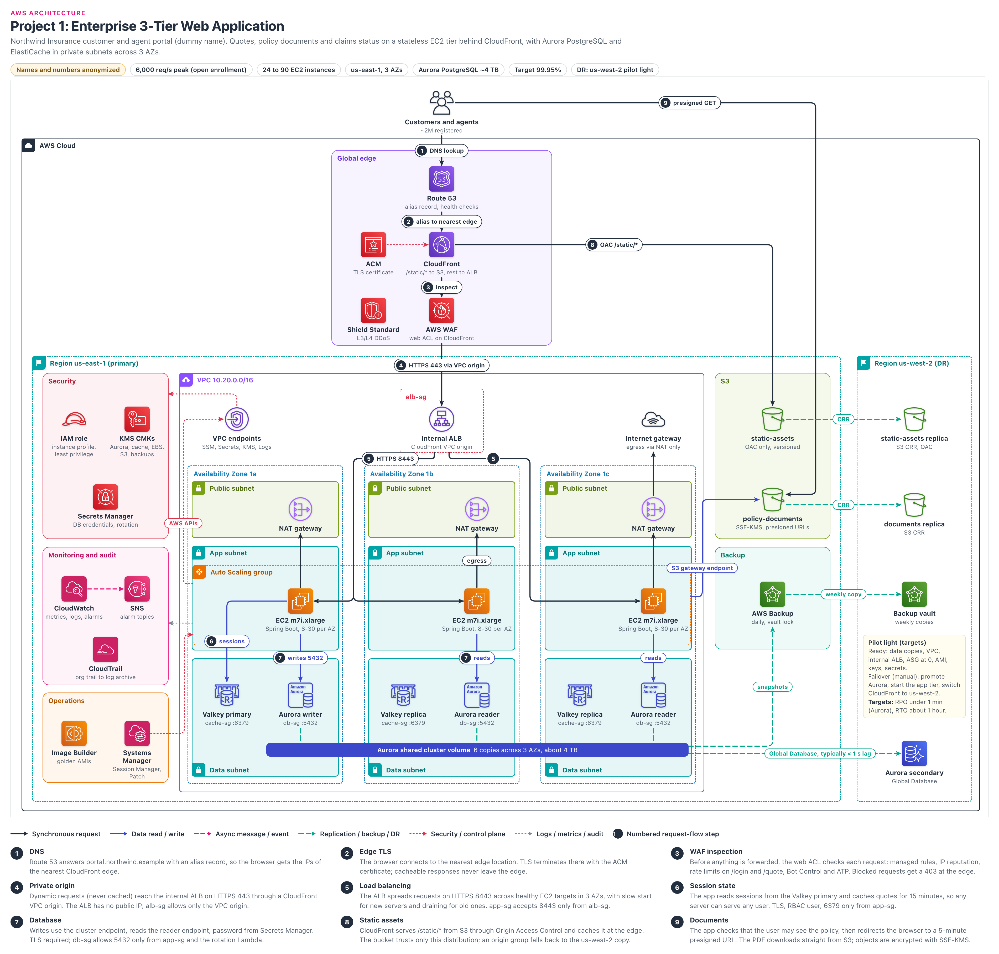

# Enterprise 3-Tier Web Application

> **Confidentiality note:** Company names, domain names, IDs and all numbers in this document are dummy values. The architecture, the decisions and the trade-offs are what this document shares.
> Key figures (dummy values): about 2M users, 6,000 req/s at peak (3 times normal), 24 to 90 EC2 servers, 3 AZs in us-east-1, Aurora PostgreSQL of about 4 TB, availability target 99.95%, pilot light DR in us-west-2 (RPO under 1 minute, RTO about 1 hour). AWS limits and prices change over time, so treat all of these as approximate.

## Contents

- [Architecture diagram](#architecture-diagram)
- [1. Project name](#1-project-name)
- [2. Business problem](#2-business-problem)
- [3. Architecture overview](#3-architecture-overview)
- [4. Request flow](#4-request-flow)
- [5. Why each AWS service](#5-why-each-aws-service)
  - Services: [Amazon Route 53](#amazon-route-53) · [Amazon CloudFront](#amazon-cloudfront) · [AWS WAF](#aws-waf) · [AWS Shield Standard](#aws-shield-standard) · [AWS Certificate Manager (ACM)](#aws-certificate-manager-acm) · [Amazon VPC](#amazon-vpc) · [Internet Gateway](#internet-gateway) · [NAT Gateway](#nat-gateway) · [VPC endpoints](#vpc-endpoints) · [Application Load Balancer (internal)](#application-load-balancer-internal) · [Amazon EC2 and EC2 Auto Scaling](#amazon-ec2-and-ec2-auto-scaling) · [EC2 Image Builder](#ec2-image-builder) · [Amazon ElastiCache for Valkey](#amazon-elasticache-for-valkey) · [Amazon Aurora PostgreSQL (RDS family)](#amazon-aurora-postgresql-rds-family) · [Aurora Global Database (us-west-2 secondary)](#aurora-global-database-us-west-2-secondary) · [Amazon S3](#amazon-s3) · [AWS IAM](#aws-iam) · [AWS KMS (customer managed keys)](#aws-kms-customer-managed-keys) · [AWS Secrets Manager](#aws-secrets-manager) · [AWS Systems Manager](#aws-systems-manager) · [Amazon CloudWatch](#amazon-cloudwatch) · [Amazon SNS](#amazon-sns) · [AWS CloudTrail](#aws-cloudtrail) · [AWS Backup](#aws-backup)
  - [Key decisions](#key-decisions)
- [5A. Key topics](#5a-key-topics)
  - [Why EC2 instead of containers (and the later path to ECS)](#why-ec2-instead-of-containers-and-the-later-path-to-ecs)
  - [Why CloudFront in front of the ALB (and how the origin is locked)](#why-cloudfront-in-front-of-the-alb-and-how-the-origin-is-locked)
  - [Public vs private subnets and why NAT Gateway](#public-vs-private-subnets-and-why-nat-gateway)
  - [Stateless app tier and zero-downtime deploys (instance refresh)](#stateless-app-tier-and-zero-downtime-deploys-instance-refresh)
  - [Aurora vs RDS PostgreSQL (why we chose Aurora)](#aurora-vs-rds-postgresql-why-we-chose-aurora)
- [6. High availability](#6-high-availability)
- [7. Security](#7-security)
- [8. Monitoring](#8-monitoring)
- [9. Disaster recovery](#9-disaster-recovery)
- [10. Scaling (when traffic grows 10x)](#10-scaling-when-traffic-grows-10x)
- [11. Failure scenarios](#11-failure-scenarios)
  - [Failure 1: EC2 instance failure or JVM crash](#failure-1-ec2-instance-failure-or-jvm-crash)
  - [Failure 2: A whole AZ is lost (for example, us-east-1a)](#failure-2-a-whole-az-is-lost-for-example-us-east-1a)
  - [Failure 3: Aurora writer failure](#failure-3-aurora-writer-failure)
  - [Failure 4: ElastiCache Valkey primary failure](#failure-4-elasticache-valkey-primary-failure)
  - [Failure 5: Bad deployment (a bug in the new version)](#failure-5-bad-deployment-a-bug-in-the-new-version)
  - [Failure 6: Credential stuffing / bot attack on /login, /quote](#failure-6-credential-stuffing--bot-attack-on-login-quote)
  - [Failure 7: Partner rating API becomes slow / egress problem](#failure-7-partner-rating-api-becomes-slow--egress-problem)
  - [Failure 8: DB connections fail after secret rotation](#failure-8-db-connections-fail-after-secret-rotation)
  - [Failure 9: Region failure (a big us-east-1 outage)](#failure-9-region-failure-a-big-us-east-1-outage)
- [12. Cost optimization](#12-cost-optimization)
- [13. Two-minute project walkthrough](#13-two-minute-project-walkthrough)
- [14. Deep-dive questions and answers](#14-deep-dive-questions-and-answers)
  - [Q1. Why did you run this on EC2 instead of containers?](#q1-why-did-you-run-this-on-ec2-instead-of-containers)
  - [Q2. Most of your traffic is dynamic. Why put CloudFront in front of the ALB at all?](#q2-most-of-your-traffic-is-dynamic-why-put-cloudfront-in-front-of-the-alb-at-all)
  - [Q3. How do you make sure nobody bypasses CloudFront and hits the ALB directly?](#q3-how-do-you-make-sure-nobody-bypasses-cloudfront-and-hits-the-alb-directly)
  - [Q4. Why Aurora PostgreSQL instead of RDS for PostgreSQL?](#q4-why-aurora-postgresql-instead-of-rds-for-postgresql)
  - [Q5. Why not DynamoDB? It scales better.](#q5-why-not-dynamodb-it-scales-better)
  - [Q6. Walk me through exactly what happens when the Aurora writer fails.](#q6-walk-me-through-exactly-what-happens-when-the-aurora-writer-fails)
  - [Q7. How do you deploy to EC2 with zero downtime?](#q7-how-do-you-deploy-to-ec2-with-zero-downtime)
  - [Q8. Why one NAT Gateway per AZ? Isn't one enough and cheaper?](#q8-why-one-nat-gateway-per-az-isnt-one-enough-and-cheaper)
  - [Q9. Security Groups already block traffic. Why do you still need private subnets?](#q9-security-groups-already-block-traffic-why-do-you-still-need-private-subnets)
  - [Q10. Why ElastiCache for sessions instead of ALB sticky sessions? What if ElastiCache fails?](#q10-why-elasticache-for-sessions-instead-of-alb-sticky-sessions-what-if-elasticache-fails)
  - [Q11. How does the app get database credentials, and how does rotation not break it?](#q11-how-does-the-app-get-database-credentials-and-how-does-rotation-not-break-it)
  - [Q12. Walk me through a region failover. How do you really hit an RTO of one hour?](#q12-walk-me-through-a-region-failover-how-do-you-really-hit-an-rto-of-one-hour)
  - [Q13. Traffic goes up 10x overnight. What breaks first?](#q13-traffic-goes-up-10x-overnight-what-breaks-first)
  - [Q14. How do engineers get into servers without SSH or a bastion?](#q14-how-do-engineers-get-into-servers-without-ssh-or-a-bastion)
  - [Q15. How do you protect login and quote endpoints from bots and credential stuffing?](#q15-how-do-you-protect-login-and-quote-endpoints-from-bots-and-credential-stuffing)
  - [Q16. How do presigned URLs work here, and what can go wrong?](#q16-how-do-presigned-urls-work-here-and-what-can-go-wrong)
  - [Q17. You see intermittent 502 errors. How do you debug them?](#q17-you-see-intermittent-502-errors-how-do-you-debug-them)
  - [Q18. Which metric do you scale the Auto Scaling group on, and why?](#q18-which-metric-do-you-scale-the-auto-scaling-group-on-and-why)
  - [Q19. Someone ran a bad migration that deleted policy rows. How do you recover?](#q19-someone-ran-a-bad-migration-that-deleted-policy-rows-how-do-you-recover)
  - [Q20. For the container phase, why ECS and not EKS?](#q20-for-the-container-phase-why-ecs-and-not-eks)
- [Glossary](#glossary)

## Architecture diagram

### How to read the diagram
- **Center, top to bottom:** this is the main request path. Users → Route 53 → CloudFront → WAF → internal ALB → EC2 in 3 AZs → Valkey and Aurora at the bottom.
- **Numbers 1 to 9:** these are the steps from Section 4, in the same order. Step 8 (static files) and step 9 (document download) go to S3 on the right side.
- **Left side panels:** Security (IAM, KMS, Secrets Manager), Monitoring (CloudWatch, SNS, CloudTrail), and Operations (Image Builder and Systems Manager, used to build the server image and run the servers).
- **Right side:** the S3 buckets that hold files, and AWS Backup, which takes backups. On the far right is the us-west-2 DR region: the Aurora secondary, a copy of the static files, a copy of the documents and a backup vault are already there. Some items are not drawn in the picture, such as the rotation Lambda, the backup account, and the VPC and ALB that are pre-built in us-west-2.
- **Arrow colors:** black line = user request, blue = reading or writing data, pink dashed = alarm or event (CloudWatch → SNS), green dashed = replication or backup, red dotted = security or control (IAM, KMS, Session Manager), grey dotted = logs and metrics.

## 1. Project name
- **Northwind Insurance Customer and Agent Portal:** one website used by both customers and agents. It is a 3-tier web application that runs on a stateless EC2 fleet (the servers do not keep any user data on them).
- **In one line:** we did a "lift-and-improve" of a Java Spring Boot monolith (all features inside one big application) from an old data center (VMware) to AWS. We barely changed the code. We built a new network, security, database and backup setup around it.
- **What 3-tier means here:**
  - **Web/presentation tier:** the part in front of users: CloudFront and the internal ALB. The HTML page itself is still built by the Spring Boot app.
  - **Application tier:** the business logic on EC2: calculating quotes, policy work and claims work.
  - **Data tier:** Aurora, ElastiCache and S3.
  - Because it is a monolith, presentation and logic both run in the same EC2 process. CloudFront is only the edge layer (cache and security).

## 2. Business problem

### Who is the company?
- Northwind is an insurance company. It sells auto, home and small-business policies.
- **Two types of users:** customers do their own tasks themselves. Agents give quotes on behalf of customers, then confirm and sell the policy (in insurance language this is called "bind").
- Both use the same website: to get a quote, download policy documents and check claim status.
- Old setup: about 40 VMware VMs in a rented data center. One big PostgreSQL server, and its copy was in the same rack.

### What were the problems?
1. **The data center contract was ending:**
   - The contract would end in 9 months.
   - Renewing it meant buying new hardware, and the CFO did not approve the budget.
2. **Traffic goes up 3 times once a year:**
   - During open enrollment (about 6 weeks) there are many more users.
   - The company bought hardware for that peak and kept it idle for the rest of the year.
   - Even so, last season the database got overloaded and the site went down twice. During that time agents could not give quotes to customers (a direct loss of sales).
3. **Security audit problems:**
   - Everyone used the same SSH key.
   - The network was flat: a web server could reach the database directly on any port.
   - Backups were kept in the same building as production.
   - The insurance regulator and the SOC 2 auditors flagged these issues. (SOC 2 auditors give an audit report that shows customers our security controls are correct.)

### Constraints
- **Small team:** 12 developers, 3 platform engineers and 1 DBA. Nobody had production experience with Kubernetes.
- **Vendor software:** the vendor document engine that creates policy PDFs installs as a service on the host. It has a per-host license, no container version, and runs on x86 only.
- **Budget:** AWS cost had to be lower than the on-prem cost (about $30,000 per month).
- **Payments:** card payments happen on the payment processor's hosted page, so card data never reaches our systems. Because of this, the portal is outside PCI DSS scope (PCI DSS is the strict set of security rules for systems that handle card data).

### What did the company need?
| Need | Target | In simple words |
|---|---|---|
| Availability | 99.95% (per month) | Only about 21 minutes per month of errors or downtime are allowed |
| Speed (pages) | p95 under 400 ms | 95 out of 100 requests get a reply in under 0.4 seconds |
| Speed (quote) | p95 under 1.5 s | A quote calls outside partner APIs, so a bit more time is OK |
| Peak load | 6,000 dynamic req/s | Normal weekday peak is 2,000 req/s, and 3 times that during enrollment |
| If an AZ is lost | RPO 0, RTO under 5 minutes | Even if one building is lost, no data is lost and the site keeps running on its own |
| If a Region is lost | RPO under 1 minute (Aurora data), RTO about 1 hour | If all of us-east-1 is lost, the site must come up in us-west-2 within 1 hour |
| Bad data (bad migration) | RPO about 5 minutes, RTO about 3 hours | We must be able to go back to the state 5 minutes before the damage |
| Backups | 35 days, immutable, with a copy in another Region and another account | Not even a hacker or an admin should be able to delete backups |
| Security access | No SSH keys, no bastion | Every action a person takes must be in an audit log |

- The Region RPO target of 1 minute is for Aurora data. The S3 documents copy can take a few minutes (Section 9).

### Why this architecture?
- **Leave the data center quickly:** a rewrite was not possible in 9 months. We kept the code and the JVM tuning (the memory and garbage collection settings of the engine that runs the Java program) as they were, and ran it on EC2.
- **Elastic capacity for the peak:** Auto Scaling grows from 24 up to 90 servers and shrinks again as soon as the peak is over. We no longer pay for idle hardware.
- **Fix for database overload:** managed Aurora, readers for read traffic, and a cache for sessions and quotes. The load on the database goes down and failover is fast.
- **Fix for audit findings:** private subnets, Security Groups per tier, Session Manager instead of SSH, and locked backups in another Region.
- **Servers can be replaced at any time:** sessions live outside the servers (in ElastiCache). If any server is lost, the user does not notice.

## 3. Architecture overview

### Internet and DNS
- **Route 53** (the AWS DNS service, which turns a name into an IP address) answers for `portal.northwind.example` with a CloudFront alias record.
- Route 53 health checkers open our `/healthz` page often, from different places around the world.
- Because of this, we know whether the site opens for outside users even if our own monitoring is broken (an outside-in check).

### Edge (Global edge)
- **CloudFront** (the AWS CDN, which serves content from edge locations close to users). TLS (the https encryption that locks data between the browser and the server) ends there.
- `/static/*` comes from S3 with caching. All other dynamic requests go to the ALB without caching.
- **AWS WAF** (a firewall that stops bad HTTP requests) and **Shield Standard** (free DDoS protection) work at the edge. **ACM** gives free TLS certificates and renews them on its own.

### Network (VPC)
- One **VPC** `10.20.0.0/16` (our private network inside AWS), 3 AZs, and 3 types of subnets in each AZ:

| Subnet tier | CIDRs | What is inside | Default route |
|---|---|---|---|
| Public | 10.20.0.0/24, .1.0/24, .2.0/24 | NAT Gateways only | Internet Gateway |
| Private app | 10.20.16.0/20, .32.0/20, .48.0/20 | Internal ALB, EC2, interface endpoints | The NAT Gateway in the same AZ |
| Private data | 10.20.64.0/23, .66.0/23, .68.0/23 | Aurora, ElastiCache | No internet route at all |

- **NAT Gateway (one per AZ):** the only way for private servers to go out. Nobody from outside can come in. **VPC endpoints:** AWS calls stay inside the AWS network and do not go through NAT.

### Application
- **Internal ALB** (a load balancer that spreads requests across many servers) sits in private subnets and has no public IP. It can only be reached through a CloudFront **VPC origin**.
- Behind it is an **EC2 Auto Scaling group** (ASG): `m7i.xlarge`, min 24, max 90 (8 to 30 in each AZ). Amazon Linux 2023, Corretto 21, Spring Boot.
- Every server boots from a **golden AMI**: an image with the OS, Java and agents already installed and security settings applied (**EC2 Image Builder** creates it). No SSH, only **Session Manager**.

### Data
- **Aurora PostgreSQL:** 1 writer + 2 readers (`r7g.2xlarge`), about 4 TB. There is only one data disk and everyone reads the same disk (shared cluster volume). AWS keeps it as 6 copies across 3 AZs.
- The app has two addresses: the cluster endpoint for writes (the writer), and the reader endpoint for reads (it spreads reads across the readers).
- **ElastiCache for Valkey:** a fast store that keeps data in memory (similar to Redis, and open source). Sessions and quotes live here. 3 nodes: one main node (primary) and two copies (replicas). If the main node fails, a copy automatically becomes the main.
- **S3:** `static-assets` (only CloudFront reads it) and `policy-documents` (PDFs and claim attachments).

### Security
- **IAM instance profile:** a role given to EC2 with only the permissions its work needs (least privilege). Engineers sign in through IAM Identity Center (single sign-on with the company login) and get temporary keys that work for only a few hours.
- **KMS:** a separate key for each type of data. **Secrets Manager:** DB passwords, with rotation.
- **Security Group chain:** each tier talks to the next tier on one port only. **NACLs** are a second wall at the subnet level.

### Monitoring
- **CloudWatch** metrics, logs and alarms → **SNS** → pager and team channel.
- **CloudTrail:** records every AWS API call. The logs go to a separate log archive account.

### DR (Disaster Recovery)
- **Copies in another Region:** Aurora continuously sends data to a small cluster in us-west-2 (Global Database). S3 copies every new file to us-west-2 (CRR: Cross-Region Replication). AWS Backup copies the locked backups to us-west-2 and to a separate backup account.
- App servers do not run in DR ahead of time. During failover they are built with the same AMI and Terraform (a tool where infrastructure is written as code and built with one command). That is why this is called **pilot light**.

## 4. Request flow
- Main dynamic request: `User → Route 53 → CloudFront → WAF → Internal ALB → EC2 → ElastiCache (session) → Aurora`
- Static files: `User → CloudFront → S3 static-assets (OAC)`
- Documents: `User → EC2 (creates a presigned URL) → User downloads directly from S3 policy-documents`

### Step 1: DNS (Route 53)
- **What happens:** the browser resolves the name (DNS, port 53). Route 53 answers with the CloudFront alias record, and the user gets the IPs of the nearest edge.
- **Security:** we change the hosted zone only through Terraform. There is a CloudTrail alarm on any DNS record change, because if DNS is hijacked, all the controls below it are bypassed.
- **Time:** the first lookup takes 10 to 50 ms, after that it comes from cache.

### Step 2: Edge TLS (CloudFront + ACM)
- **What happens:** the browser connects to the nearest edge on 443, and TLS ends there using the ACM certificate. If `/static/*` is in the cache, the reply comes from here.
- **Dynamic requests:** `CachingDisabled` cache policy + `AllViewer` origin request policy. Cookies, query strings and headers go to the origin because of the origin request policy, not the cache policy.
- **Host header:** `portal.northwind.example` is sent to the origin. CloudFront checks the ALB certificate against that name. If the name does not match, CloudFront returns 502.
- **Security:** viewer TLS policy `TLSv1.2_2025` (see the settings table), HTTP is redirected to HTTPS, and the ALB certificate is checked against the Host name (bullet above).
- **Time:** about 10 to 30 ms to the nearest edge.

### Step 3: WAF inspection (AWS WAF)
- **What happens:** before CloudFront forwards the request, the web ACL checks every request against the rules (the rules table is in Section 7).
- **If blocked:** a 403 goes back from the edge itself, and the request never reaches the Region.
- **Time:** typically under a few ms.

### Step 4: Private origin (CloudFront VPC origin → Internal ALB)
- **What happens:** requests that are not in the cache travel over the AWS network to us-east-1. CloudFront enters the VPC through an ENI (network card) placed in our private subnets and reaches the ALB on HTTPS 443.
- **Security:** the ALB has no public address. `alb-sg` allows 443 only from `CloudFront-VPCOrigins-Service-SG`, which CloudFront creates. This is tighter than a prefix list: only our distributions can come in.
- **Time:** 1 to 70 ms, depending on the distance from the edge to Virginia.
- **Timeouts chain (important):**
  - Keep-alive means: instead of closing a connection right away, keep it open for a while for the next requests.
  - Rule: the component behind must keep the connection open longer than the one in front. CloudFront 60 s < ALB 75 s < Tomcat (app server) 90 s.
  - If this is reversed: the app server closes the connection first, the ALB sends a request on that closed connection, and the user sometimes gets a 502 error.

### Step 5: Load balancing (ALB → EC2)
- **What happens:** the ALB spreads requests to the `portal-app` target group on HTTPS 8443, across healthy servers in 3 AZs. It raises traffic to a new server slowly (slow start) and drains a server that is being removed.
- **Security:** `app-sg` allows 8443 only from `alb-sg`. For `/actuator/*` (app management pages) an ALB rule returns a fixed 404, so they are not visible outside.
- **Time:** 1 to 5 ms.

### Step 6: Session state (EC2 → ElastiCache for Valkey)
- **What happens:** for every logged-in request, Spring Session fetches the session from the Valkey primary. Quote results are cached for 15 minutes, and they can also be read from a replica (it is fine if they are slightly old).
- **Security:** TLS, port 6379, an RBAC user (the app has its own username and password, not one AUTH token shared by everyone). `cache-sg` allows 6379 only from `app-sg`.
- **Time:** under 1 ms in the same AZ, about 1 ms across AZs.

### Step 7: Database (EC2 → Aurora PostgreSQL)
- **What happens:** the app has two connection pools (DB connections opened in advance and reused again and again): the writer pool goes to the cluster endpoint, and the reader pool goes to the reader endpoint. The AWS Advanced JDBC Wrapper detects failover quickly without waiting for DNS.
- **Security:** `db-sg` allows 5432 from `app-sg` (and also from the rotation Lambda, see Section 7). TLS is required with `rds.force_ssl = 1`. The password comes from Secrets Manager. Data subnets have no internet route.
- **Time:** one query takes 1 to 5 ms. A page makes 6 to 10 queries, so about 20 to 40 ms.

### Step 8: Static assets (CloudFront → S3 via OAC)
- **What happens:** `/static/*` uses the `CachingOptimized` policy, with a hit ratio of about 95%. File names contain a hash (`app.3f9c2a.js`) and are cached for 1 year, so a deploy does not need an invalidation. We do not cache HTML.
- **Security:** OAC (Origin Access Control): CloudFront sends signed requests to S3. The bucket policy allows `s3:GetObject` only when the request comes from our distribution ARN (`AWS:SourceArn`). Block Public Access is on.
- **DR:** an origin group for `/static/*`: the primary is the us-east-1 bucket, the secondary is the us-west-2 copy (Section 9).
- **Time:** 10 to 30 ms on an edge cache hit (same as Step 2). On a cache miss, about 20 to 100 ms more to fetch from S3.

### Step 9: Documents (presigned URL → S3)
- **What happens:** when the user clicks "download", the app first does an authorization check (does this policy belong to this customer, or to this agent). Then it creates a presigned `GetObject` URL that works for only 5 minutes and redirects the browser to it. Big PDFs do not pass through our servers.
- **Security:** the object is stored with SSE-KMS (S3 encrypts the file with our KMS key before storing it). So the role that signed the URL needs `kms:Decrypt` on the documents key. S3 Bucket Keys reduce KMS calls and cost.
- **Things to watch:** if the session of the signing role expires, the URL also stops working. The browser download does not come through our VPC endpoint, so if we put an `aws:SourceVpce` condition on the signing role, downloads will fail.
- **Time:** signing the URL happens on the server itself (no AWS call), in under 1 ms. After that the browser downloads directly from S3, depending on the PDF size and the user's network (for example, 100 to 500 ms for 1 MB).

### Important settings (in one place)
| Setting | Value | In simple words |
|---|---|---|
| CloudFront TLS policy | `TLSv1.2_2025` | At least TLS 1.2 + 1.3, no weak ciphers. If everyone uses 1.3, use `TLSv1.3_2025`. The old `TLSv1.2_2021` is only for legacy clients |
| ALB health check | `/actuator/health/readiness`, every 10 s | If it fails 2 times (about 20 s), traffic to that server stops |
| Slow start | 120 s | Traffic to a new server is raised slowly over 2 minutes (for Java warm-up) |
| Deregistration delay | 60 s (default 300 s) | Time for running requests to finish. No request goes past the 30 s origin timeout |
| DB connection pools | writer 8, reader 12 (per server) | Even with 90 servers, the writer gets only 720 connections |
| Session cookie | Secure, HttpOnly, SameSite=Lax, 30 minutes idle | The cookie is sent only over https, and browser JavaScript cannot read it |
| Presigned URL | 5 minutes | Even if a link leaks, it works only for a short time |

### Other flows
| Flow | Path | Key point |
|---|---|---|
| Document creation | Vendor engine creates the PDF → S3 gateway endpoint → `policy-documents` | Not a single byte goes through NAT |
| Claim attachment upload | App gives a presigned POST (max 25 MB, under `uploads/quarantine/`) | It is linked to the claim only after the malware scan says clean (the scanner is not in the diagram) |
| Partner APIs (egress: traffic going out) | EC2 → NAT in the same AZ → Internet Gateway → partner (HTTPS) | Partners allowlist our 3 NAT Elastic IPs |
| Nightly renewal batch | 1 to 4 at night, Spring Batch, on one server only using ShedLock (a DB lock) | That server gets scale-in protection |
| Admin access | Identity Center login → Session Manager (`ssm`, `ssmmessages` endpoints) | Every command is logged, no SSH port |
| Telemetry | CloudWatch agent → endpoints → CloudWatch | When an alarm changes state, it goes to SNS |
| Replication | Aurora → us-west-2 secondary, S3 CRR, AWS Backup copy | Section 9 |

- **Who makes the KMS call with SSE-KMS:** the S3 service itself calls KMS on our behalf. The server does not call it directly. The role still needs the `kms:GenerateDataKey` permission (with `kms:ViaService` = S3).
- We use the KMS interface endpoint only for work where the server calls KMS directly (for example, KMS encryption of a Session Manager session).
- **The reason for min 24 servers is not the batch:** the batch runs on one server only. The real reason is normal weekday traffic, and keeping 16 servers in the other 2 AZs even if one AZ is lost (N+1).

## 5. Why each AWS service

### Amazon Route 53
**What it is:** the AWS DNS service. It turns a name into an IP address and has a 100% availability SLA.

**Why we used it:** a native alias record for CloudFront (alias queries are free), and health checks from outside.

**Problem it solves:** users always see the same name. Even during DR this record does not change, only the origin behind CloudFront changes.

**Alternatives:** registrar DNS or a third-party DNS provider.

**Why not the alternative:** some providers also offer ALIAS/CNAME flattening at the apex, but health checks, IAM and the CloudTrail audit would all be separate. If the zone lives in the same Terraform and IAM, auditors get proof in one place.

### Amazon CloudFront
**What it is:** the AWS CDN. It serves content from edge locations close to users, and TLS ends there.

**Why we used it:** static caching, with WAF and Shield at the edge. Because of the VPC origin, the ALB is fully private.

**Problem it solves:** 95% of static requests never reach the origin, the handshake is fast for users far away, and the app gets one strong front door.

**Alternatives:** WAF on a public ALB, or a third-party CDN.

**Why not the alternative:**
- **Public ALB:** an address open to the internet, and no edge cache.
- **Third-party CDN:** the origin must be public, a secret header is needed, and WAF, logs and billing get split between two vendors (5A).

### AWS WAF
**What it is:** a Layer 7 web firewall. It checks HTTP requests against rules and then blocks them, counts them or shows a CAPTCHA.

**Why we used it:** managed rules, rate rules on `/login` and `/quote`, Bot Control and ATP (the rules table is in Section 7).

**Problem it solves:** every quote is a paid partner API call. For every quote that bots scrape, we really pay money.

**Alternatives:** a third-party WAF appliance, or rate limiting inside the app.

**Why not the alternative:**
- **Appliance:** more servers that we would have to scale, patch and make highly available.
- **Inside the app:** by then the bad traffic has already used up CloudFront, ALB and EC2 capacity.

### AWS Shield Standard
**What it is:** protection against Layer 3/4 DDoS (an attack that sends traffic from thousands of machines to bring a site down). It is free and automatic for CloudFront and Route 53.

**Why we used it:** those two are our only public entry points, so we get protection with no extra work.

**Problem it solves:** large network floods are stopped at the AWS edge.

**Alternatives:** Shield Advanced (about $3,000 per month per organization, with a 1-year commitment).

**Why not the alternative:** there is no history of targeted DDoS, the ALB is private, and WAF rate rules handle Layer 7 floods. We review this every year.

### AWS Certificate Manager (ACM)
**What it is:** a service that gives free public TLS certificates and renews them on its own using DNS validation.

**Why we used it:** both the CloudFront certificate (it must be in us-east-1) and the internal ALB certificate come from ACM.

**Problem it solves:** on-prem, expired certificates caused 2 outages in 3 years. ACM renews them without anyone having to remember a date.

**Alternatives:** buying from a commercial CA and importing into ACM.

**Why not the alternative:**
- From March 2026, public certificates are valid for a maximum of 200 days (100 in 2027, 47 by 2029). ACM issues 198-day certificates and renews them on its own.
- With imported certificates, we would have to renew them ourselves at least twice a year (and even more often later), which is an outage risk.

### Amazon VPC
**What it is:** our private network inside AWS: subnets, route tables, Security Groups and NACLs.

**Why we used it:** 3 subnet tiers across 3 AZs, the SG chain, and endpoints for private AWS access.

**Problem it solves:** clear tiers instead of the old flat network, and the data tier has no internet route at all.

**Alternatives:** only 2 tiers, or a shared VPC from a central account.

**Why not the alternative:**
- **2 tiers:** only with a separate data tier can the route tables and NACLs act as a second wall that shows "there is no internet path to the database".
- **Shared VPC:** that comes later with a bigger landing zone. For the first migration, one VPC is simpler.

### Internet Gateway
**What it is:** a managed gateway that gives a VPC its internet connection.

**Why we used it:** the NAT Gateways go out through it. CloudFront VPC origins also require an IGW to be attached (even though their traffic does not go through it).

**Problem it solves:** a way out for partner APIs and updates. Servers have no public IPs, so nothing comes in.

**Alternatives:** an egress proxy in a central networking account (through Transit Gateway).

**Why not the alternative:** that is the end state for a bigger landing zone (Project 10), but during a 9-month migration, that dependency was too much for a single app.

### NAT Gateway
**What it is:** a path that lets private servers only go out. No new connection from outside can come in.

**Why we used it:** one per AZ, each with a static Elastic IP. Partners allowlist these 3 IPs.

**Problem it solves:** if one AZ is lost, egress still works in the other 2 AZs, and there are no cross-AZ charges.

**Alternatives:** a single NAT, NAT instances, or the regional NAT Gateway (November 2025).

**Why not the alternative:**
- **Single NAT:** a hidden single-AZ dependency. If that AZ is lost, all quotes fail.
- **NAT instances:** cheaper, but patching, failover and throughput become the team's job.
- **Regional NAT:** we will evaluate it in the next network refresh (5A).

### VPC endpoints
**What it is:** a way to call AWS services privately without NAT. A gateway endpoint (S3, free) or an interface endpoint (an ENI, charged per hour + per GB).

**Why we used it:** S3 gateway + interface endpoints for SSM, SSM messages, Secrets Manager, KMS, CloudWatch Logs, CloudWatch metrics and STS (the diagram label shows only 4 of these 7).

**Problem it solves:** no NAT charge for documents traffic. Even if NAT breaks, Session Manager, secrets and logs keep working.

**Alternatives:** sending all AWS calls through NAT.

**Why not the alternative:** NAT costs per GB. And in the middle of a NAT incident, we would also lose our shell access.

### Application Load Balancer (internal)
**What it is:** a Layer 7 (HTTP) load balancer. "Internal" means it has private IPs only.

**Why we used it:** it works as the CloudFront VPC origin and spreads traffic to 24 to 90 servers across 3 AZs.

**Problem it solves:** it removes a broken server in about 20 s, and drains servers carefully during deploys and scale-in.

**Alternatives:** Network Load Balancer (NLB), or a public ALB locked with a secret header.

**Why not the alternative:**
- **NLB:** Layer 4. NLB also has HTTP health checks, but it does not give path rules, fixed responses (our `/actuator/*` 404), HTTP status code metrics or slow start.
- **Public ALB:** we used it in the first weeks of the migration, but it depends on a public DNS name and a shared secret.

### Amazon EC2 and EC2 Auto Scaling
**What it is:** EC2 = virtual servers in the cloud. ASG = a group that adds, replaces or removes servers based on health and load.

**Why we used it:** the monolith, the JVM tuning and the per-host vendor engine run without changes. `m7i.xlarge`: the engine is x86 only, the app is CPU-bound, and 16 GiB is enough.

**Problem it solves:** elastic capacity from 24 up to 90, automatic replacement of broken servers, and zero-downtime deploys with instance refresh.

**Alternatives:** ECS, EKS, Elastic Beanstalk, Graviton (ARM) servers.

**Why not the alternative:**
- **ECS, EKS:** the right destination, but not the first step (5A).
- **Beanstalk:** it hides the launch template and instance refresh controls.
- **Graviton:** about 20% cheaper, but the vendor engine does not support arm64.

### EC2 Image Builder
**What it is:** a managed pipeline that builds, tests and distributes the golden AMI.

**Why we used it:** every month (and right away if a big security bug, meaning a critical CVE, comes out) it builds Amazon Linux 2023 + CIS Level 1 (a standard security checklist) + agents + Corretto 21 + the vendor engine. It also copies the image to us-west-2.

**Problem it solves:** every server comes from the same scanned image. Servers do not drift apart, and we do not have to patch running servers.

**Alternatives:** Packer in CI, or in-place patching with Patch Manager.

**Why not the alternative:**
- **Packer:** it works, but Inspector scanning and cross-region copy are built into Image Builder.
- **In-place patching:** each server slowly becomes a little different (a snowflake), which goes against "replace, don't repair".

### Amazon ElastiCache for Valkey
**What it is:** a managed in-memory store. Valkey = the open-source version that came from Redis OSS, and in ElastiCache it is cheaper than Redis OSS.

**Why we used it:** sessions and the quote cache. 1 primary + 2 replicas, Multi-AZ failover, TLS and RBAC users.

**Problem it solves:** app servers stay stateless, so any server can serve any user. The quote cache reduces partner calls and DB reads.

**Alternatives:** ALB sticky sessions, sessions in Aurora, DynamoDB, ElastiCache Serverless.

**Why not the alternative:**
- **Sticky sessions:** if a server is lost, the user is logged out, and deploys and scale-in become hard.
- **Sessions in Aurora:** a write on the writer for every click, which is exactly the load we wanted to reduce.
- **DynamoDB:** it works, but we need Valkey for the quote cache anyway.
- **Serverless:** the load is known in advance, so fixed nodes are cheaper.

### Amazon Aurora PostgreSQL (RDS family)
**What it is:** a PostgreSQL-compatible database built by AWS, part of the RDS family. Storage is a shared volume with 6 copies across 3 AZs.

**Why we used it:** relational data for policies, quotes and claims: transactions, joins and reports. 1 writer + 2 readers (`r7g.2xlarge`).

**Problem it solves:** if the writer is lost, a reader becomes the writer in about 30 s. Reads go to the readers, which reduces the load on the writer.

**Alternatives:** RDS for PostgreSQL, DynamoDB, self-managed PostgreSQL on EC2.

**Why not the alternative:**
- **RDS PostgreSQL:** the full comparison is in 5A.
- **DynamoDB:** a full rewrite, not possible in 9 months (Q5).
- **Self-managed:** patching, backups and failover would all fall on the one DBA.

### Aurora Global Database (us-west-2 secondary)
**What it is:** a feature that copies Aurora data to another Region at the storage level. The lag is usually under 1 second.

**Why we used it:** for the Region RPO of under 1 minute. The secondary in us-west-2 has one small reader instance.

**Problem it solves:** the data is always in another Region, without adding load on the primary. Managed failover turns the secondary into the primary.

**Alternatives:** cross-region snapshots only, or a secondary with no instance (headless).

**Why not the alternative:**
- **Snapshots:** RPO of hours, and restore takes more hours.
- **Headless:** even cheaper, but we would have to add an instance before failover, which increases RTO. We scale up the small instance during failover (Section 9).

### Amazon S3
**What it is:** object storage. It keeps files very durably (designed for 11 nines).

**Why we used it:** `static-assets` (OAC only) and `policy-documents` (Block Public Access, SSE-KMS, presigned URLs), with copies of both in us-west-2.

**Problem it solves:** PDFs are not kept on server disks. The browser downloads big files directly from S3.
- Lifecycle: after 1 year, objects move to **Glacier Instant Retrieval**. Reads still take milliseconds and presigned GET keeps working. It has a 90-day minimum and a per-GB retrieval charge, which is OK because old policies are rarely opened.
- With Glacier Flexible Retrieval or Deep Archive, a restore would be needed first (minutes to hours). Otherwise the download fails with `InvalidObjectState`.

**Alternatives:** EFS, or BLOBs in the database.

**Why not the alternative:**
- **EFS:** no presigned URLs, so every download would go through the app.
- **DB BLOBs:** the 4 TB database would grow even bigger and backups would be slow.

### AWS IAM
**What it is:** the service that decides "who can do what": users, roles and policies.

**Why we used it:** an instance profile role for EC2, and Identity Center SSO for humans (Section 7).

**Problem it solves:** no permanent access keys on servers or in code. Role credentials change automatically.

**Alternatives:** IAM user access keys on servers, and an IAM user for each engineer.

**Why not the alternative:** permanent keys leak, people forget to rotate them, and this is the first thing auditors ask about.

### AWS KMS (customer managed keys)
**What it is:** a service that creates, controls and audits encryption keys. The keys never leave special secure hardware (HSM).

**Why we used it:** one CMK per type of data (Section 7), automatic rotation, and separate key admins and key users.

**Problem it solves:** we decide who can decrypt which data, and every use is in CloudTrail.
- Disabling a key: new decrypt calls fail, but running EBS volumes and Aurora may keep working for a while with the data key in memory. The key can also be enabled again.
- A real crypto-shred (making data permanently unreadable) = scheduling key deletion (a 7 to 30 day wait). Once deleted, the data can never be recovered.

**Alternatives:** AWS managed keys (`aws/rds`, `aws/s3`), or CloudHSM.

**Why not the alternative:**
- **AWS managed keys:** we cannot change the key policy and cannot share them with the backup account.
- **CloudHSM:** single-tenant and expensive, and not needed for this compliance level.

### AWS Secrets Manager
**What it is:** a service that stores passwords and API keys with KMS encryption and rotates them on a schedule.

**Why we used it:** Aurora app credentials, with Lambda rotation (alternating users). The app fetches the secret at startup and caches it, and fetches it again if auth fails.

**Problem it solves:** the password is not in config, in the AMI or in Git. Even if it leaks, it becomes useless within a few days.

**Alternatives:** Parameter Store SecureString, or IAM database authentication.

**Why not the alternative:**
- **Parameter Store:** no built-in rotation for DB passwords.
- **IAM DB auth:** the 15-minute token is checked only when a connection is opened, so pool connections keep running. The real limit: AWS guidance says to stay under about 200 new connections per second. During failover or refresh, 90 servers open hundreds at the same time. If we add RDS Proxy (an AWS service that combines connections from many servers into a few DB connections), IAM auth can be used at the proxy.

### AWS Systems Manager
**What it is:** tools to manage the EC2 fleet: Session Manager (shell), Patch Manager, Parameter Store and Run Command.

**Why we used it:** a shell through Session Manager (no SSH port, no keys, no bastion). Config and feature flags in Parameter Store.

**Problem it solves:** the "shared SSH key" finding goes away. There is a record of who ran which command, on which server, and when.

**Alternatives:** a bastion host (a public gate server placed for SSH), or EC2 Instance Connect Endpoint.

**Why not the alternative:**
- **Bastion:** one more server to patch, an open port, and the headache of keys.
- **Instance Connect Endpoint:** it is good, but it depends on SSH, and command logging is easier in Session Manager.

### Amazon CloudWatch
**What it is:** AWS monitoring: metrics, logs, alarms and dashboards.

**Why we used it:** AWS metrics come automatically, and the agent sends memory, disk and app logs. It is also the metrics source for Auto Scaling.

**Problem it solves:** we know about a problem before users complain.

**Alternatives:** Datadog, New Relic, Prometheus + Grafana.

**Why not the alternative:** for a small team, another vendor and another system is extra load. Tracing is already in Application Signals/X-Ray with OpenTelemetry. If deeper APM is needed, a third-party tool can come later.

### Amazon SNS
**What it is:** managed pub/sub. When you publish to a topic, the message goes to all subscribers.

**Why we used it:** when an alarm changes state, it goes to an SNS topic. The pager tool has an HTTPS subscription. For the team channel, **Amazon Q Developer in chat applications** (old name AWS Chatbot) subscribes to the topic and shows the alarm in Slack/Teams (SNS cannot post to Slack directly).

**Problem it solves:** one alarm reaches many people at once, with separate topics for critical and warning.

**Alternatives:** the pager tool connected directly to CloudWatch, or EventBridge.

**Why not the alternative:** SNS is a native target for CloudWatch alarms, simple and cheap. EventBridge is for more complex routing, and fan-out is enough here.

### AWS CloudTrail
**What it is:** an audit service that records every AWS API call (who, when, from where, and what).

**Why we used it:** an organization trail, logs stored in a separate log archive account, and log file validation turned on.

**Problem it solves:** it answers "who changed this Security Group". Even the workload admin cannot delete the logs.

**Alternatives:** an account-level trail, or Event history (90 days).

**Why not the alternative:**
- **Account trail:** the admin of the same account could stop it.
- **Event history:** only 90 days, and the regulator needs years.

### AWS Backup
**What it is:** a central service that schedules, retains and copies backups of many services with one policy.

**Why we used it:** daily Aurora snapshots and a backup of the documents bucket, kept for 35 days, with Vault Lock. Copies go to us-west-2 and to the backup account (Section 9).

**Problem it solves:** it fixes "backups in the same building". With Vault Lock (compliance mode), not even the root user can delete backups until retention ends.

**Alternatives:** Aurora automated backups only, or scripts.

**Why not the alternative:**
- **Automated backups only:** we use them for PITR (restore to any second in the past), but they have no lock and no copy in another account.
- **Scripts:** if they fail, nobody knows. We do not back up the EC2 fleet, because the AMI and Terraform are the backup.

### Key decisions
| Decision | Chosen | Not chosen | Why |
|---|---|---|---|
| Compute | EC2 Auto Scaling | ECS / EKS (for now) | Host-licensed x86 vendor engine, 9-month deadline, and the team had no container experience. ECS is the next phase |
| Database engine | Aurora PostgreSQL | RDS PostgreSQL | Readers read the same storage (low lag), failover in about 30 s, Global Database. Cost is a bit higher |
| Data model | Relational (Aurora) | DynamoDB | We need joins, transactions and reports. DynamoDB would mean a rewrite |
| Edge, origin | CloudFront + internal ALB (VPC origin) | Public ALB | No public address, edge cache, WAF at the edge, no secret header needed |
| Sessions | ElastiCache for Valkey | ALB sticky sessions | Users are not logged out when a server is lost, and scale-in and deploys are safe |
| Egress | One NAT per AZ | Single NAT / NAT instances | AZ failure isolation. Costs about $65 per month more (2 extra NATs) |
| DR model | Pilot light (us-west-2) | Warm standby / active-active | An RTO of 1 hour is OK for the business, and we save by not running an idle app tier |
| Admin access | Session Manager | Bastion + SSH | No open port, no keys, every command audited |

## 5A. Key topics

### Why EC2 instead of containers (and the later path to ECS)
**Why EC2 now:**
- **Vendor engine:** it installs as a host service, has a per-host license and no container support. If we put it in a container, we lose vendor support.
- **Deadline:** the data center had to be emptied in 9 months. Learning containers + orchestration and doing the migration at the same time was a big risk.
- **Team skills:** nobody had production experience with Kubernetes. The team already knew EC2, AMIs and JVM tuning.
- **Existing tuning:** JVM heap, G1 GC and file descriptor limits all keep working as they are in the AMI.

**But this is not old-style EC2:** the two big benefits of containers are here too:
1. We never change a running server. We put in a new server with a new image (immutability).
2. Any server can be removed at any time and nothing is lost (disposability).

**Migration path to ECS (next phase):**
1. Split the vendor engine into a separate small service (that part stays on EC2 until the vendor ships a container version).
2. Build the Spring Boot app as a container image and store it in ECR.
3. Create a new target group with ECS (Fargate or an EC2 capacity provider), on the same ALB.
4. Use ALB weighted target groups to move 5% → 25% → 100% of traffic. If there is a problem, move the weight back.
- Why ECS and not EKS: see Q20.

### Why CloudFront in front of the ALB (and how the origin is locked)
**Why CloudFront even though most traffic is dynamic:**
- **TLS close to the user:** the handshake happens at the edge nearest to the user. For an agent in California, every handshake does not have to travel to Virginia.
- **Static offload:** about 95% of static requests end at the edge.
- **WAF and Shield at the edge:** attacks are stopped before they reach the Region.
- **Connection reuse:** keep-alive connections from the edge to the origin, so fewer new connections hit the ALB.

**Origin lock-down, three options:**
| Option | How it works | Weakness |
|---|---|---|
| Public ALB + CloudFront prefix list | `alb-sg` allows 443 only from CloudFront IP ranges | Someone else's CloudFront distribution also comes from the same IPs |
| Prefix list + secret header | CloudFront adds a secret header, and without it the ALB returns 403 | The secret must be rotated, and the ALB is still public |
| **VPC origin + internal ALB (ours)** | The ALB has no public IP, and is reachable only through the CloudFront ENI | Not supported in `use1-az3` (subnets must be chosen by AZ ID, not AZ name), and there is a NACL gotcha (Section 7) |
- We used option 2 in the first weeks of the migration. After testing VPC origins in staging, we moved to option 3.

### Public vs private subnets and why NAT Gateway
**The difference in one line:** there is only one reason a subnet is "public": its route table has a `0.0.0.0/0 → Internet Gateway` route.

| Subnet | Route table | What is here | Reachable from the internet? |
|---|---|---|---|
| Public | `0.0.0.0/0 → IGW` | NAT Gateways only | Only things with a public IP (we have nothing except the NAT EIPs) |
| Private app | `0.0.0.0/0 → NAT in the same AZ` | ALB, EC2, endpoints | No |
| Private data | Local route only | Aurora, Valkey | No, and it cannot go out either |

**Why private subnets even with Security Groups:**
- **A second wall:** even if someone wrongly opens `0.0.0.0/0` in an SG, nobody can come in from the internet without a public IP and an IGW route.
- **Data theft is harder:** the data subnet has no route out.
- **Proof for audit:** showing the route table is enough.

**Why NAT Gateway:**
- Private servers have work outside: partner APIs, the OS package mirror and the vendor license check. NAT is outbound only: the reply comes back, but no new connection comes in.
- Stable Elastic IPs for the partner allowlist. Why one per AZ is in Q8.
- **Where the NAT cost goes:** `BytesOutToDestination` only shows how much goes out in total, not where it goes. To see it per destination, we query VPC Flow Logs on the NAT ENI with Logs Insights/Athena. If we see AWS service traffic, we add an endpoint.

**Regional NAT Gateway (November 2025):**
- One NAT ID in the route tables of all AZs. No public subnet needed.
- Automatic mode: AWS expands it into AZs on its own and assigns EIPs (a new AZ can take up to 60 minutes, and during that time traffic goes through another AZ).
- Manual mode: we assign EIPs per AZ and manage the expansion ourselves, so the partner allowlist does not change.
- Even with it, the IGW must stay (an attached IGW is required for CloudFront VPC origins). For now we use per-AZ NAT, and we will evaluate this in the next network refresh.

### Stateless app tier and zero-downtime deploys (instance refresh)
**What stateless means:** the server keeps no user data (session, uploaded file). Any server can serve any request.

| What | Where we keep it |
|---|---|
| Sessions, quote cache | Valkey |
| Files (PDFs, attachments) | S3 |
| Config, feature flags | Parameter Store |
| Passwords, API keys | Secrets Manager |
| Logs | CloudWatch Logs |

- Result: any server can be killed at any time. Users are not logged out during scale-in, AZ failure or deploys.

**Deploying with instance refresh (settings):**
1. Create a new launch template version with the new AMI (or the new app version).
2. Start the instance refresh: `MinHealthyPercentage` 100%, `MaxHealthyPercentage` 110%.
   - With min 100%, the ASG first launches new servers and terminates old ones only after the new ones are healthy and warmed up. Capacity never drops below desired.
   - About 10% are replaced in each batch (9 servers when there are 90).
   - With min 90%, capacity could drop by up to 10% during the refresh, which is a risk at peak.
3. Checkpoints: replace 10%, wait 10 minutes and watch the alarms, then 50%, then 100%.
4. A new server gets full traffic only after it passes the health check and finishes slow start. The old one drains for 60 s.
5. **Auto rollback:** if the ALB 5xx (server-side errors) alarm or the p99 alarm fires, the refresh stops and goes back to the old launch template.
- **Database schema:** the expand/contract pattern. First add a column that does not break the old version, so both versions work. Then remove the old column in the next release.

### Aurora vs RDS PostgreSQL (why we chose Aurora)
- Both are in the RDS family, and both are managed PostgreSQL. The difference is in the storage design.

| Topic | RDS PostgreSQL Multi-AZ (instance) | Aurora PostgreSQL |
|---|---|---|
| Storage | EBS, with a synchronous copy to the standby | Shared cluster volume, 6 copies across 3 AZs, grows automatically |
| Can the standby be read? | No (the standby sits idle) | Yes, readers read the same storage |
| Failover time (typical) | About 1 to 2 minutes | About 30 s or less |
| Read replicas | Up to 15, but async streaming with separate storage. Lag can grow to seconds, and they are not automatic failover targets | Up to 15, same storage, lag usually under 100 ms, and they are automatic failover targets |
| Cross-region DR | Cross-region read replica | Global Database, lag typically under 1 s, managed failover |
| Cost | Lower | Instances cost a bit more, plus I/O charges on Standard |

- There is also the **RDS Multi-AZ DB cluster** (2 readable standbys), with failover typically under 35 s. But it has only 2 readers and no Global Database.
- **Why Aurora for us:** the old overload came from reads. Readers sitting on the same storage is a big plus. The Region RPO of 1 minute is easy with Global Database.
- **Standard vs I/O-Optimized:** if I/O cost goes above about 25% of the Aurora bill, I/O-Optimized is cheaper. We start with Standard, check Cost Explorer, and switch if needed.
- **One gotcha:** Aurora Backtrack is only for MySQL. The way to fix bad data: restore to a new cluster with PITR (or from the snapshot taken before the migration).
- A fast clone is only a copy of the current (damaged) data. It is useful for investigation and testing, not for going back in time.
- **When RDS is better:** a small, predictable workload where one instance is enough and the budget is very tight.

## 6. High availability

### Layer by layer
| Layer | How it is HA | If one fails |
|---|---|---|
| Route 53, CloudFront, WAF | Global services that AWS runs in many locations | We do not need to do anything |
| Internal ALB | Nodes in 3 AZs | If an AZ is lost, that node is removed |
| EC2 ASG | Spread evenly across 3 AZs (8 to 30 in each AZ) | New servers in the other AZs |
| NAT Gateway | One per AZ | Only that AZ's egress is lost, and that AZ's servers are gone anyway |
| Valkey | Primary + 2 replicas, Multi-AZ | A replica is promoted, typically in under a minute |
| Aurora | Writer + 2 readers, 6 storage copies | A reader is promoted, typically in about 30 s |

### Load balancing
- The ALB sends requests to healthy servers in 3 AZs. Cross-zone is on, so the load stays even even if one AZ has fewer servers.
- Slow start for a new server and draining for a server that is leaving. Health check timings and other details are in Step 5 and the settings table.

### Multi-AZ, Auto Scaling
- **N+1 AZ capacity:** any 2 AZs must be able to carry the peak. That is why the CPU target is 50%. If one AZ is lost, the others go to about 75% and can hold until the ASG adds new servers.
- ASG health check type `ELB`: if the app hangs while the process is still up, the ALB check fails and the ASG replaces that server. The grace period is about 180 s (for JVM start).
- Overrides in the ASG **mixed instances policy**: `m7i.xlarge` (first priority), `m6i.xlarge`, `m7a.xlarge` (all x86). The launch template has only one type, and the other types are in the ASG overrides.
- If a type is not available in an AZ, the ASG launches with another type. m6i is a bit slower, and CPU target tracking adjusts for that automatically.

### Database failover (what the application must do)
1. The writer is lost. Aurora makes a reader the writer (which one goes first depends on the promotion tiers).
2. The cluster endpoint DNS moves to the new writer (TTL 5 s). The JDBC wrapper finds the new writer from the cluster topology without waiting for DNS.
3. During those roughly 30 s, writes fail and running transactions roll back. The app retries with a request ID, so even if the same request comes twice, it is saved only once (idempotent).
4. Reads keep running on the remaining reader. Most users only see a few seconds of slowness.
- **Watch out for the JVM DNS cache:** Java can cache DNS for a long time. We set `networkaddress.cache.ttl` to 5 to 10 s.

### Failure domains
- **Instance:** the ASG replaces it, and users do not notice.
- **AZ:** 2/3 of capacity remains, automatically. Business data RPO is 0 (Aurora storage has 6 copies across 3 AZs).
  - Valkey replication is async, so the last few session updates may be lost, and some users may have to log in again.
- **Region:** a manual decision, pilot light failover (Section 9).
- **Deploy (our own mistake):** most outages come from this. The checkpoints and auto rollback are there for exactly this.

## 7. Security

### IAM (humans)
- Engineers log in through **IAM Identity Center** (SSO with the company directory), and MFA is required. No IAM users and no permanent access keys.
- Permission sets: `ReadOnly` for everyone, `Developer` with write access only in non-prod, and `PlatformAdmin` for prod with a short session time.
- **Break-glass role:** only for emergencies. If it is used, a CloudTrail alarm fires right away and an SNS alert goes to the security team.
- **SCPs** (Service Control Policies: a wall for the whole account that says "nobody can do this"): deny stopping CloudTrail, deny Regions other than us-east-1/us-west-2, and deny `kms:ScheduleKeyDeletion`/`kms:DisableKey` (except for break-glass).

### IAM roles (workloads)
- EC2 **instance profile** role, with least privilege:
  - Read and write files only under the app prefix in the `policy-documents` bucket (`s3:GetObject`, `s3:PutObject`).
  - It can read only its own single secret (`secretsmanager:GetSecretValue` on that secret ARN).
  - `kms:Decrypt` and `kms:GenerateDataKey` on the documents key, with a `kms:ViaService` = S3 condition.
  - The AWS managed policies needed for Session Manager and the CloudWatch agent to work (SSM core, CloudWatch agent).
- **IMDSv2 required, hop limit 1:**
  - EC2 gets its role keys from a local address (the metadata service). With IMDSv2, it must ask for a token first.
  - Even if an attacker uses an app bug to send a request to that address (this is called SSRF), stealing the keys is very hard.

### Security Groups chain (each tier to the next tier on one port only)
`CloudFront-VPCOrigins-Service-SG → alb-sg :443 → app-sg :8443 → cache-sg :6379 / db-sg :5432`
- `alb-sg`: inbound 443 only from the CloudFront VPC origin SG.
- `app-sg`: inbound 8443 only from `alb-sg`. There is no SSH (22) rule at all.
- `cache-sg`: inbound 6379 only from `app-sg`.
- `db-sg`: inbound 5432 only from `app-sg` and `rotation-lambda-sg`.
- **Rotation Lambda:** it runs inside the VPC, in the private app subnets. It connects to the DB and changes the password, and it calls Secrets Manager through the interface endpoint.
  - If this 5432 rule is forgotten, rotation gets stuck at `AWSPENDING` (Failure 8).
- `endpoint-sg`: inbound 443 to the interface endpoints from the VPC CIDR (both the app servers and the rotation Lambda are inside it).
- We reference SG IDs instead of IP ranges. So when servers change, or their IPs change, the rules do not need to change.

### NACLs (Network ACLs)
- **What a NACL is:** a firewall at the subnet level. It is stateless (the reply traffic also needs a rule). It is a second wall behind the SG.
- **Data subnet NACL:** inbound 5432 and 6379 only from the app subnet CIDRs. Outbound ephemeral ports (1024 to 65535) only to the app CIDRs.
  - Traffic between data subnets (from one data subnet to another) is also allowed, so that no Aurora/Valkey managed traffic is blocked by accident.
- **App subnet NACL (the ALB is here):** inbound NACL rules are not evaluated for CloudFront VPC origin traffic, but outbound rules are evaluated for the reply traffic.
  - So outbound 1024 to 65535 must be allowed to `0.0.0.0/0` (or to the CloudFront origin-facing ranges).
  - If someone limits this to the VPC CIDR only, the whole site returns 502/504.
- We keep NACLs coarse, and all the fine-grained rules are in SGs. When NACLs get complex, people forget ephemeral ports and outages happen.

### KMS (key management)
- One CMK per type of data: `aurora-key` (the DB secret also uses this one), `documents-key`, `ebs-key`, `cache-key` (Valkey), `backup-key`.
- If one key has a problem, the damage is limited to that one type of data (a small blast radius).
- Automatic rotation is on (once a year). The old key material stays, so old data still decrypts, and there is no need to re-encrypt.
- Key policy: key admins (the platform team, who can manage keys but cannot decrypt) and key users (the app role, AWS Backup) are separate.
- Separate CMKs for the DR Region: the Aurora secondary, the S3 copies and the backup vault use us-west-2 keys.

### Secrets Manager
- Aurora app credentials (`app_a`, `app_b`), with alternating-users Lambda rotation. The secret ARN is readable only by the app role.
- **Master user password:**
  - Our cluster is in an Aurora Global Database. For such a cluster, the Aurora-managed master password (`--manage-master-user-password`) is not supported (an AWS docs limitation).
  - So we keep the master credentials ourselves as a Secrets Manager secret and rotate it with Lambda rotation (single-user). We replicate that secret to us-west-2.
  - People do not use it day to day, only for break-glass. The alternating-users Lambda that rotates the app users also works using this master secret.
- Partner API keys are also in Secrets Manager, not in the AMI.

### WAF
| Rule | What it stops |
|---|---|
| AWS managed rules (Core, Known bad inputs, SQL database) | Common hacking tricks, SQL injection |
| Amazon IP reputation list | IPs that already have a bad reputation |
| Rate-based rules (`/login`, `/quote`) | Too many requests in 5 minutes. Counted by IP and also by custom keys such as the session cookie |
| Bot Control (`/login`, `/register`, `/quote` only) | Traffic known to be a script, not a human |
| ATP (Account Takeover Prevention) on `/login` | Login attempts with leaked passwords (Q15) |
| ACFP (Account Creation Fraud Prevention) on `/register` | Creation of fake accounts |

- New rules first run in `Count` mode for 1 week. We check for false positives, then switch to `Block`.
- WAF logs go to S3. There is an alarm if blocked requests spike.

### Encryption
| Where | In transit | At rest |
|---|---|---|
| User → CloudFront | TLS 1.2/1.3 (`TLSv1.2_2025`) | n/a |
| CloudFront → ALB → EC2 | HTTPS 443, then HTTPS 8443 | EBS KMS encryption (account default on) |
| EC2 → Aurora | TLS, `rds.force_ssl = 1` | `aurora-key` |
| EC2 → Valkey | TLS | `cache-key` |
| S3 | Deny if `aws:SecureTransport = false` | SSE-KMS + Bucket Keys |
| Backups | Inside the AWS network | `backup-key` (a different key in the backup account) |

### CloudTrail
- Organization trail: all accounts, all Regions → an S3 bucket in the log archive account. Log file validation is on (proof that logs were not changed).
- S3 data events are on for `policy-documents`: a record of which role read which document. It costs extra, so it is on for that bucket only.
- Alarms: root login, Security Group change, Route 53 record change, KMS key disable/schedule delete, CloudTrail stop.

## 8. Monitoring

### SLOs (the targets we measure and keep)
- **Availability SLO 99.95%:** the percentage of dynamic requests at the ALB that are not 5xx (errors caused by a server-side fault). The error budget is about 21 minutes per month.
- Measuring at the ALB does not show edge failures. That is why we also measure availability from outside with Route 53 health checks and a Synthetics canary.
- **Latency SLO:** p95 `TargetResponseTime` under 400 ms (quote paths under 1.5 s).
- **Burn-rate alarm:** an alarm that watches how fast the error budget is being used. 14x means that at this speed the month's budget would be gone in about 2 days, so it pages right away. If the budget is being used slowly, it only creates a ticket.
- **Follow-up question: "CloudFront's SLA is only 99.9%, so how do you get 99.95%?"**
  - An SLA is a promise to give credits. The real availability is usually higher. Our 99.95% is an SLO.
  - We accepted an edge-wide CloudFront outage as a risk. The cost and complexity of multi-CDN are too high for this business.

### Key CloudWatch metrics and alarms (thresholds)
| Layer | Metric | Alarm |
|---|---|---|
| CloudFront | `5xxErrorRate`, `OriginLatency`, `CacheHitRate` | 5xx above 1% for 5 minutes |
| WAF | `BlockedRequests` | 5 times normal (an attack signal) |
| ALB | `HTTPCode_Target_5XX_Count`, `HTTPCode_ELB_5XX_Count` | 5xx above 0.5% for 5 minutes → page |
| ALB | `TargetResponseTime` p99, `UnHealthyHostCount` | p99 above 1 s for 10 minutes; 20% unhealthy in any AZ |
| EC2/ASG | `CPUUtilization`, `mem_used_percent`, `GroupInServiceInstances` | CPU above 80% for 15 minutes; warning above 85 servers (max 90) |
| Aurora | Writer CPU, `DatabaseConnections`, `AuroraReplicaLag` | CPU 75%, connections at 80% of max, lag above 1 s |
| Aurora Global | `AuroraGlobalDBReplicationLag` | Above 30 s (RPO risk) |
| Valkey | `DatabaseMemoryUsagePercentage`, `Evictions` | Memory 80%, evictions > 0 (sessions are being lost) |
| NAT | `ErrorPortAllocation`, `PacketsDropCount` | Warning if > 0 |
| S3 CRR | `ReplicationLatency`, `OperationsPendingReplication` | Warning above 15 minutes |
| Route 53 | Health check status | 3 checker regions fail → page |

- To get `OriginLatency` and `CacheHitRate`, we must turn on CloudFront "additional metrics" on the distribution ourselves, and it costs extra.
- CloudFront and Route 53 health check metrics live only in us-east-1, so those alarms are in us-east-1. During a big us-east-1 outage they may be delayed, so a CloudWatch Synthetics canary in us-west-2 also checks the site.
- All alarms → SNS: the `critical` topic goes to the pager, and the `warning` topic goes to the team channel.

### Logs
- **App logs:** JSON format, with a request ID on every line (also the CloudFront `X-Amz-Cf-Id`). The agent sends them to CloudWatch Logs for 30 days, then to S3.
- **ALB, CloudFront and WAF logs:** go to S3. During an investigation we query them with SQL (not shown in the diagram).
- **Aurora logs:** sent to CloudWatch Logs. Every query that takes more than 500 ms is logged (`log_min_duration_statement` 500 ms), to find slow queries.
- **VPC Flow Logs and Session Manager logs:** for security investigations and to see where NAT traffic is going.
- During an incident, we use Logs Insights for queries such as "which endpoint is returning 5xx".

### Dashboards, tracing
- **Golden signals dashboard** (the 4 things to watch for every service): traffic (how many requests), errors (how many fail), latency (how slow) and saturation (how full).
- A special dashboard for the enrollment season: req/s, server count, writer CPU and partner API latency.
- **Tracing:** OpenTelemetry Java agent → CloudWatch Application Signals / X-Ray. For a slow request, it shows how much time went to the DB and how much to the partner API.
- **CloudTrail:** for "who changed it" questions. Deploys and config changes appear as annotations on the dashboard.

## 9. Disaster recovery

### Backups
- **Aurora automated backups:** 35 days of PITR (Point-in-Time Recovery: restore to any second in the past). The latest restorable time is usually within 5 minutes of now.
- **AWS Backup:** takes a daily Aurora snapshot and a documents bucket backup, and keeps them for 35 days. Because of Vault Lock (compliance mode), nobody can delete them early.
  - Copies: daily to the backup account, and once a week to us-west-2 (the cost reason is in Section 12).
- **S3 documents:** versioning is on (if a file is wrongly deleted or overwritten, the old version is still there).
- **We do not back up the EC2 fleet:** the servers are stateless. The AMI (also copied to us-west-2) and the Terraform code are our backup.

### A separate backup account for account compromise
- What if someone steals the workload account admin keys? Vault Lock stops recovery points from being deleted, but if they disable the KMS key in the same account or schedule it for deletion, we cannot read the copies. They could also stop new backups.
- That is why we do a cross-account copy of the backups to a separate **backup account** (in AWS Organizations, with different admins and a different KMS key). Another option is an AWS Backup **logically air-gapped vault** (check the docs to confirm our resource types are supported).
- The workload account admin cannot touch those copies or their KMS key.
- An SCP denies `kms:ScheduleKeyDeletion` and `kms:DisableKey` to everyone except the break-glass role. Key deletion has a waiting period of 7 to 30 days, and a CloudTrail alarm catches it.

### Replication
- **Aurora Global Database:** continuously sends data written in us-east-1 to the us-west-2 secondary at the storage level. It is usually less than 1 second behind (lag).
- **S3 CRR:** `policy-documents` → a copy in us-west-2 (with a us-west-2 CMK). Replication Time Control (RTC) is on: 99.99% of objects within 15 minutes (an SLA, with an extra charge). Most objects arrive within seconds to minutes.
  - If the last few minutes of PDFs are not in us-west-2, we generate them again from the data in the DB.
- **`static-assets` also uses CRR** to us-west-2 (or the deploy pipeline uploads to both buckets).
  - A CloudFront **origin group** for `/static/*`: the primary is the us-east-1 bucket, the secondary is the us-west-2 bucket, with OAC on both. Origin failover works for GET, HEAD and OPTIONS, which is enough for static files.
  - The maintenance page also comes from this origin group. Otherwise, when us-east-1 S3 is lost, even the error page would not show, and the us-west-2 site would come up without JS/CSS.

### RTO/RPO table (targets)
| Scenario | RPO (how much recent data can be lost) | RTO (how long it is down) | How |
|---|---|---|---|
| One server is lost | 0 | Almost 0 (users do not notice) | ALB and ASG, automatic |
| One AZ is lost | 0 (business data) | Under 5 minutes, automatic | Everything is Multi-AZ |
| Aurora writer is lost | 0 | About 30 s | Aurora failover |
| Region (us-east-1) is lost | Aurora under 1 minute, documents a few minutes | About 1 hour | Pilot light failover |
| Bad data (bad migration) | About 5 minutes | About 3 hours | Aurora PITR to a new cluster |
| Ransomware / account compromise | Up to 24 hours | A few hours | Restore from the copies in the backup account |

### What is already in us-west-2 (pilot light)
- The network and permissions are built ahead of time: VPC, subnets, SGs, IAM roles and KMS keys.
- What the servers need is also ready: the AMI copy, the internal ALB, and the ASG (desired 0, which means not a single server is running).
- The us-west-2 origin is already added in CloudFront, so on failover day we only switch.
- The Aurora secondary (a small instance), the S3 copies, the backup vault and the replicated secrets.
- **DR Elastic IPs are allocated in advance and given to partners.** Otherwise, after failover the partner APIs would block us and quotes would not work.
- **Terraform state in us-west-2:** the DR stack has a separate state file in a us-west-2 S3 bucket (S3 native locking with `use_lockfile`). There is no dependency on us-east-1.
- The pipeline/runner that runs the runbook from us-west-2 is ready in advance.
- In game days we test with the assumption that "no resource in us-east-1 is available" (the only exceptions are the CloudFront and Route 53 changes).

### Region failure steps (runbook, about 1 hour)
1. **Detect and decide (about 15 minutes):** Route 53 health checks, the us-west-2 canary and the AWS Health Dashboard. The incident commander decides. We do not fail over for a small blip (coming back is also a big job).
2. **Promote the database (5 to 10 minutes):** use Aurora Global Database managed failover to make the us-west-2 secondary the primary. Because the primary is fully lost, the last roughly 1 s of data may be lost. In a planned test we use switchover instead, with 0 data loss.
   - **Scaling up the writer:** a small writer cannot carry the production load. We add an `r7g.2xlarge` reader and fail over to it as the writer (or modify the instance class), which takes about 10 to 15 minutes. This runs in parallel with step 3.
   - Global Database replication happens at the storage level, so the secondary's instance size does not change the lag. So the small instance is not a problem for RPO. This extra step only affects RTO.
   - The app uses the **Global Database writer endpoint** (available since October 2024). After failover it points to the new primary writer on its own, so we do not need to change the DB endpoint in config.
3. **Start the app tier (15 to 20 minutes):** with Terraform (us-west-2 state): NAT Gateways (with the EIPs that already exist) and ASG desired 24. A new Valkey cluster (sessions are empty, so users log in again). The app config points to the DR secret.
4. **Switch traffic (5 to 10 minutes):** change the CloudFront default origin to the us-west-2 internal ALB VPC origin. The Route 53 record does not change, it still points to CloudFront.
5. **Validate (about 10 minutes):** smoke tests (login, quote, document download) and a status page update.

- **The weakness here (to admit up front):**
  - The APIs that change CloudFront and Route 53 settings run in us-east-1. If us-east-1 goes down badly, that change may also be slow.
  - That is why the us-west-2 origin is already added in CloudFront ahead of time. On failover day there is only one small change.
  - For an even lower RTO, we would need active-active (Project 8).
- **Why we did not use an origin group for dynamic traffic:** it works only for GET, HEAD and OPTIONS. A quote submit (POST) would not fail over.
- **RPO can also be enforced:** Aurora PostgreSQL has the `rds.global_db_rpo` parameter (for example, 60 s). If no secondary is closer than that, primary commits stop.
  - Trade-off: to guarantee RPO, we risk us-east-1 write availability. So for now we only have the lag alarm, and we will decide on the parameter together with the business.

### Database recovery (bad data)
1. Find the time of the problem (for example, the bad migration ran at 14:05).
2. Use Aurora PITR to restore a **new cluster** at 14:04 (the original cluster does not change). For 4 TB this can take about 1 to 2 hours.
3. For investigation we can use a fast clone (copy-on-write, in minutes), but it is only a copy of the current damaged data.
4. If only a few tables are damaged: copy those rows back from the restored cluster. If everything is damaged: point the app to the restored cluster (change the endpoint in the secret + instance refresh).
5. **Things to watch when moving to the restored cluster:**
   - It is a new standalone cluster: it is not in the Global Database and has no us-west-2 secondary.
   - We immediately make it a new global cluster and add a us-west-2 secondary (a few hours for 4 TB). We tell the business ahead of time that the Region RPO target will be missed during that time.
   - Check that the new cluster is in the AWS Backup plan (through tags).
   - New writes that came in after the bad migration and before the cutover must be reconciled.

### DR testing
- **Once a month:** AWS Backup restore testing, an automatic check that Aurora restores from a snapshot and that queries work.
- **Once a quarter:** a game day. We fully build the app tier in us-west-2, run smoke tests and measure the time of each step.
- **Twice a year:** a Global Database switchover in a maintenance window (a real Region change with no data loss) and back again.
- **AZ failure test:** remove traffic from one AZ's subnets (fault injection) and see how the ASG, Aurora and Valkey behave.

## 10. Scaling (when traffic grows 10x)
- Scenario: 6,000 → 60,000 dynamic req/s (for example, a big new partner channel joins). Let us look at it layer by layer.

### Edge (CloudFront, WAF)
- CloudFront and WAF scale automatically. There is a per-distribution request rate quota, so we check the docs and request an increase in advance.
- For public API responses that are the same for everyone (for example, the product list), we add 60 s of edge caching.

### ALB
- The ALB scales automatically, but a sudden 10x spike can take minutes. Before a known event we use an **LCU capacity reservation** (ALB pre-scale).
- There is a targets per ALB quota (default about 1,000), so we move to bigger instances.

### EC2
- Today one `m7i.xlarge` handles about 70 to 85 req/s at peak (CPU 50%). For 10x we would need about 700 to 900 xlarge servers.
- Instead, we move to `m7i.2xlarge` / `4xlarge` and reduce the server count (both targets and DB connections go down).
- Raise the ASG max, and use target tracking, scheduled scaling before enrollment, and predictive scaling.
- **Warm pool:**
  - `Stopped` state: saves OS boot and setup time. But the JVM still starts from scratch, so JIT warm-up stays the same.
  - `Hibernated` state: memory (the started JVM) is saved to disk and comes back, so in-service time drops even more. It needs an encrypted root EBS and a root volume big enough for the RAM.
  - We keep slow start at 120 s.

### ECS/EKS scaling (not part of this project today)
- There are no containers today, so ECS/EKS scaling is not in this design.
- If we move to ECS in the next phase: ECS Service Auto Scaling (increasing the number of tasks based on CPU or ALB requests per target) and a capacity provider (automatically bringing enough EC2 or Fargate capacity for the tasks).
- Benefit: a task usually starts faster than an EC2 boot. But JVM warm-up stays the same, so we still need slow start and headroom.

### Database (this is what breaks first)
- **The first bottleneck is the Aurora writer and DB connections.** 900 servers × 20 connections = 18,000, far more than Aurora's max connections.
- Fix 1: RDS Proxy (an AWS service that combines connections from many servers into a few DB connections), or reduce the pool size.
- Fix 2: send reads to readers, with Aurora replica auto scaling (up to 15).
- Fix 3: make the writer bigger (`r7g.2xlarge` → `8xlarge` / `16xlarge`): fail over to a bigger reader, with a blip of about 30 s.
- For even more writes: split claims into a separate database, or evaluate Aurora PostgreSQL Limitless Database (sharding that spreads data across many machines).

### Caching
- Valkey load at 10x: increase the node size, or move to cluster mode (shards). We need to watch network bandwidth.
- For data that does not change, such as rate tables, a local cache inside the app (Caffeine), which also skips the Valkey hop.

### Egress, partners
- Partner API rate limits are the real business bottleneck. Raise the quote cache hit rate, use circuit breakers, and talk to partners about limits in advance.
- NAT: there is a limit of about 55,000 simultaneous connections to one destination per NAT IP. We can add secondary IPs to the NAT (partners must be told about the new IPs).

### Queue-based scaling
- There is no queue today. At 10x, we would move PDF creation and the renewal batch to a worker fleet behind a queue and scale on queue depth.

### Quotas to raise in advance
| Quota | Why raise it in advance |
|---|---|
| EC2 On-Demand vCPUs | 10x needs hundreds of servers. If we cross the limit, new ones will not launch |
| ALB targets | The default is only about 1,000 targets |
| CloudFront request rate | We must not get throttled during a spike |
| KMS request rate | Document reads and writes call KMS (check even with Bucket Keys) |
| Secrets Manager API rate | If hundreds of servers boot at once, they fetch the secret at once |
| ElastiCache nodes | For cluster mode shards |
| Elastic IPs | For DR and NAT secondary IPs |

## 11. Failure scenarios

### Failure 1: EC2 instance failure or JVM crash
- **What happens:** a server is lost due to a hardware problem, or the JVM hangs with OutOfMemory.
- **How we detect it:** the ALB health check fails 2 times (about 20 s), `UnHealthyHostCount`, and OOM in the logs.
- **What happens automatically:**
  - The ALB stops sending traffic to that server.
  - The ASG replaces it and launches a new one (in service within 3 to 5 minutes).
- **What we do:** nothing for a single server. If OOM keeps coming back, we look at the heap dump and fix the memory leak.
- **Impact on users:** a few requests that were running on that server get an error. Sessions are in Valkey, so nobody is logged out.

### Failure 2: A whole AZ is lost (for example, us-east-1a)
- **What happens:** 1/3 of the servers, one NAT, an ALB node, possibly the Aurora writer and the Valkey primary are all lost at the same time.
- **How we detect it:** unhealthy hosts in only one AZ, the AWS Health Dashboard, and that AZ's NAT metrics stopping.
- **What happens automatically:**
  - The ALB removes that AZ.
  - Aurora makes a reader in another AZ the writer (about 30 s), and a Valkey replica becomes the primary.
  - The ASG adds servers in the other 2 AZs, which have their own NATs.
- **What we do:** watch capacity (mixed instances overrides if a type is not available). After the AZ comes back, the ASG rebalances.
- **Impact on users:** writes are slow for 30 s to 1 minute, and some users log in again (Valkey is async). No business data loss.

### Failure 3: Aurora writer failure
- **What happens:** the writer crashes, and writes such as saving a quote or updating a claim fail.
- **How we detect it:** the RDS event "failover started", app connection errors, and a small spike in ALB 5xx.
- **What happens automatically:**
  - Aurora makes a reader the writer in about 30 s (steps in Section 6).
  - The JDBC wrapper switches connections, and the old writer comes back as a reader.
- **What we do:** find the root cause (RDS events, Performance Insights) and check that there are no duplicate writes.
- **Impact on users:** about 30 s of slow or failed writes. With retries, most people only see "a bit slow".

### Failure 4: ElastiCache Valkey primary failure
- **What happens:** the Valkey primary is lost, and session reads and writes fail for a few seconds.
- **How we detect it:** the ElastiCache "failover" event, Lettuce connection errors, and a spike in login 5xx.
- **What happens automatically:**
  - A replica becomes the primary (typically in under a minute).
  - The primary endpoint DNS changes, and the client reconnects.
- **What we do:** check that there is handling for "if the session read fails, send the user to the login page".
- **Impact on users:** a few seconds of errors, some users log in again, and quotes are a bit slow. Policies and claims are safe.

### Failure 5: Bad deployment (a bug in the new version)
- **What happens:** a bug in the new AMI or app version (for example, a NullPointerException or a memory leak).
- **How we detect it:** ALB 5xx and p99 alarms. The version field in the logs shows that only the new servers have errors.
- **What happens automatically:**
  - If the health check fails, the new servers do not go into service and the refresh stops.
  - If an alarm fires, auto rollback goes back to the old launch template.
- **What we do:** confirm that the rollback finished, write a postmortem, and fix the test gap.
- **Impact on users:** at the first checkpoint only 10% of servers are new, so about 10% of requests are affected for a few minutes.

### Failure 6: Credential stuffing / bot attack on /login, /quote
- **What happens:** a botnet tries to log in from thousands of IPs with leaked passwords, or scrapes quotes. Every quote is a paid partner call.
- **How we detect it:** a spike in WAF `BlockedRequests`, the `/login` failure rate, partner API usage, and the ASG scaling out unexpectedly.
- **What happens automatically:**
  - ATP on `/login` blocks leaked credentials and IPs/sessions with many failures.
  - Rate rules and Bot Control stop the other bots at the edge.
- **What we do:** custom rules (ASN, country, headers), CAPTCHA/challenge on `/login`, and password resets for compromised accounts.
- **Impact on users:** almost nothing for normal users. Some see a CAPTCHA.

### Failure 7: Partner rating API becomes slow / egress problem
- **What happens:** the partner takes 10 s to reply. Tomcat threads fill up while waiting, and other pages also become slow.
- **How we detect it:** a custom partner latency metric, a busy threads alarm, and the partner span in tracing. If NAT `ErrorPortAllocation` > 0, it is the NAT limit.
- **What happens automatically:**
  - Timeout of 3 s.
  - The circuit breaker (Resilience4j: it stops calling a service that keeps failing for a while and returns a fallback) opens after 50% slow calls.
  - A separate thread pool for partner calls (bulkhead: keeping parts separate so the rest keeps running even if one part fills up).
- **What we do:** escalate with the partner and turn on the "we will email your quote later" feature flag. If it is the NAT limit, add secondary IPs.
- **Impact on users:** new quotes are delayed. Login, documents and claims keep working.

### Failure 8: DB connections fail after secret rotation
- **What happens:** the password was rotated, and some servers use the old password and get "authentication failed".
- **How we detect it:** auth errors, Aurora failed logins, and a match with the CloudTrail `RotateSecret` time.
- **What happens automatically:**
  - Because of alternating users, the old user still works for one more cycle.
  - The JDBC wrapper fetches the secret again and retries.
- **What we do:** check the rotation Lambda logs (stuck at `AWSPENDING`?). The usual cause: `db-sg` does not allow 5432 from the Lambda SG, or 443 to the endpoint is missing. We run rotation in staging every week.
- **Impact on users:** none if the design is right. Otherwise, a few minutes of errors.

### Failure 9: Region failure (a big us-east-1 outage)
- **What happens:** the ALB, EC2 and the Aurora primary cannot be reached. The CloudFront edge works but cannot reach the origin.
- **How we detect it:** Route 53 health checks, the us-west-2 canary, CloudFront 5xx and the AWS Health Dashboard.
- **What happens automatically:**
  - The data is in us-west-2 up to the point where replication stopped.
  - CloudFront shows the maintenance page (from the static origin group, which also has the us-west-2 copy). Failover is manual on purpose.
- **What we do:** follow the Section 9 runbook, and after us-east-1 comes back, return with a switchover.
- **Impact on users:** about 1 hour of the maintenance page. Less than the last 1 minute of Aurora data and a few minutes of documents may be lost, and users log in again.

## 12. Cost optimization

### Techniques
| Technique | How | Savings |
|---|---|---|
| Compute Savings Plan | A 1 or 3 year commit for the 24 servers that always run, and On-Demand for the extra peak servers | About 25 to 40% |
| Database Savings Plans / RIs | For the Aurora and Valkey 24x7 nodes (details below) | Up to about 20% on provisioned (Savings Plan), more with RIs |
| Auto Scaling | Only 24 to 40 servers during the 46 weeks outside enrollment | A big saving compared to running the peak size (90) |
| S3 gateway endpoint | Documents traffic does not go through NAT | Avoids the NAT per-GB charge |
| CloudFront cache | 95% hit ratio for static files | Saves ALB LCUs and EC2 CPU |
| Aurora I/O-Optimized | Switch when I/O goes above 25% of the bill | I/O charges go away |
| S3 lifecycle | Glacier Instant Retrieval after 1 year, old versions deleted after 90 days | Storage cost goes down |
| Logs | To S3 after 30 days, debug off in prod, Infrequent Access log class | The CloudWatch Logs bill goes down |
| Bot Control, ATP scope | Only on `/login`, `/register` and `/quote` | No fee for static requests |
| Pilot light | We do not run servers in DR | Thousands of dollars per month less than warm standby |

- **Database Savings Plans vs RIs:**
  - Reserved Instances: locked to one instance family, with a bigger discount.
  - Database Savings Plans (since December 2025): 1 year, a $/hour commitment. It applies even if the engine, family, size or Region changes, but the discount is lower than RIs (numbers in the table above).
  - We may move from r7g to r8g, and we have DR Region usage. So we use a Savings Plan for the baseline and RIs for nodes that will definitely not change.
- **Backup copies:** an Aurora cross-region snapshot copy is stored as a full copy in the destination (only the transfer is incremental). Copying 4 TB every day and keeping it for 35 days would cost a lot.
  - So: a daily copy to the backup account kept for 7 days (for the ransomware RPO of 24 hours), and a weekly copy to us-west-2 kept for 5 weeks (Global Database already gives the Region RPO). This should be checked with the Pricing Calculator.
- **Right-sizing:** Compute Optimizer once a month. If the vendor engine adds arm64 support, we move to Graviton and save about 20% on compute.

### Monthly cost (rough, us-east-1 list price order of magnitude)
| Item | Cost per month | Note |
|---|---|---|
| EC2 (about 35 servers on average, with Savings Plan) | $4,000 to $5,000 | Higher in enrollment months |
| EBS gp3 | About $150 | A small root volume per server |
| Aurora primary (3 × r7g.2xlarge + 4 TB + I/O) | $3,500 to $4,500 | Goes down with Savings Plan/RIs |
| Aurora Global secondary (us-west-2) | About $900 | Small instance + storage + replicated writes |
| ElastiCache Valkey (3 nodes) | About $400 | |
| ALB | $300 to $500 | LCUs |
| NAT Gateways (3) + data | $200 to $300 | Lower because of endpoints |
| Interface VPC endpoints | About $200 | 7 endpoints × 3 AZs |
| CloudFront (with additional metrics) | About $2,500 | Data transfer + requests |
| WAF + Bot Control + ATP | $1,300 to $2,000 | Charged per request |
| S3 (documents, copies, static) | About $700 | |
| AWS Backup (snapshots, cross-account + cross-region copies) | $800 to over $3,000 | Depends on the copy policy, full copies |
| CloudWatch (logs, metrics, alarms, canary) | About $900 | Logs ingestion is the biggest part |
| KMS, Secrets Manager, CloudTrail, Route 53, misc | About $300 | |
| **Total (rough)** | **About $16,000 to $22,000** | Lower than the on-prem cost of about $30,000 |
- These numbers are rough, and prices change over time. Treat them as an order of magnitude.

## 13. Two-minute project walkthrough
1. **Problem:**
   - Northwind Insurance had one portal used by customers and agents. It was one big Java application (a monolith) running in an old data center.
   - The data center contract was ending in 9 months. Traffic goes up 3 times during enrollment, and last time the database could not handle it and the site went down twice.
   - The audit also found problems: everyone shared the same SSH key, and any server could reach the database directly.
2. **Approach:** not a rewrite, but lift-and-improve. I kept the code as it was and built everything around it new.
3. **Architecture (top to bottom):**
   - Users first hit Route 53, then come to CloudFront. WAF sits on CloudFront.
   - From CloudFront, traffic goes privately to an internal ALB (VPC origin). The ALB has no public IP.
   - Behind the ALB is an EC2 Auto Scaling group across 3 AZs, from 24 to 90 servers.
   - Data: Aurora PostgreSQL (1 writer, 2 readers), Valkey for sessions, and S3 for documents.
4. **Security:** the app and data are in private subnets. Each tier opens only one port. No SSH, only Session Manager.
5. **Decision 1, EC2 vs containers:** the vendor engine has a per-host license and no container support, and the deadline was 9 months. So I went with immutable EC2 using a golden AMI, and ECS comes later.
6. **Decision 2, Aurora vs RDS:** readers read the same storage, failover takes about 30 s, and Global Database gives DR. The cost is a bit higher.
7. **Decision 3, internal ALB:** no need for secret header or prefix list tricks.
8. **Numbers:** 6,000 req/s at peak, a 99.95% target. If an AZ is lost, recovery is automatic. If a Region is lost, RPO is under 1 minute and RTO is about 1 hour.
9. **Lesson learned:** in the first load test we saw occasional 502s. The cause was that the keep-alive timeouts were in the wrong order. I fixed them to CloudFront 60 s < ALB 75 s < Tomcat 90 s.

## 14. Deep-dive questions and answers

### Q1. Why did you run this on EC2 instead of containers?
- **Short answer:** the vendor engine (per-host license, no container support), the 9-month deadline and team skills. EC2 is the first step, and containers are the destination.
- It is not the old way where each server has a name and is cared for by hand (pets): golden AMI, instance refresh, no SSH.
- **Trade-off:** a server takes 2 to 3 minutes to start, and we cannot run many apps together on one server (bin-packing). We handle this with a warm pool and headroom.
- **Later:** split out the vendor engine and move to ECS, with weighted target groups going 5% → 100%.

### Q2. Most of your traffic is dynamic. Why put CloudFront in front of the ALB at all?
- **Short answer:** it is not only for caching: it is also for security, latency and origin protection.
- The TLS handshake happens at the nearest edge, and connections from the edge to the origin are reused over the AWS network.
- WAF and Shield are at the edge. Because of the VPC origin, the ALB has no public IP.
- **Trade-off:** one more layer to debug. If someone forgets `CachingDisabled` on dynamic paths, personal data could get cached, so cache policies go through code review.

### Q3. How do you make sure nobody bypasses CloudFront and hits the ALB directly?
- **Short answer:** the ALB is internal and has no public IP. There is simply no path from the internet.
- `alb-sg` allows 443 only from `CloudFront-VPCOrigins-Service-SG`. The weaknesses of the old prefix list + secret header pattern are in the 5A table.
- **Follow-up points to watch:** no support in `use1-az3`, an IGW must be attached, and the app subnet NACL must open outbound ephemeral ports to `0.0.0.0/0`.

### Q4. Why Aurora PostgreSQL instead of RDS for PostgreSQL?
- **Short answer:** readers read the same storage (lag under 100 ms, and they are automatic failover targets), failover takes about 30 s, and there is Global Database.
- The number of readers is not the difference: both allow up to 15. RDS replicas use separate storage, and their lag can grow to seconds.
- **Trade-off:** instances cost more, and there are I/O charges on Standard (the I/O-Optimized option exists). The full table is in 5A.

### Q5. Why not DynamoDB? It scales better.
- **Short answer:** the data is relational, the access patterns are not known in advance, and there was no time for a rewrite.
- We need joins, transactions and ad-hoc SQL for regulator reports. DynamoDB would mean a single-table redesign and a rewrite of the data layer.
- Aurora is enough for our scale (6,000 req/s, 4 TB).
- **Where we would use it:** in the future, for simple key-value paths at large scale (for example, quote history by ID).

### Q6. Walk me through exactly what happens when the Aurora writer fails.
- **Short answer:** Aurora makes a reader the writer in about 30 s. During those 30 s writes fail and the app retries, but reads do not stop.
- Storage is shared, so no data is copied. The JDBC wrapper finds the new writer without waiting for DNS (TTL 5 s).
- Retries use a request ID, so there are no duplicate quotes (idempotent).
- **Common mistakes in the app:** a long JVM DNS cache, and no pool validation. We run `failover-db-cluster` in staging every month and measure it.

### Q7. How do you deploy to EC2 with zero downtime?
- **Short answer:** three things together: (1) servers keep no user data (stateless), (2) ASG instance refresh replaces old servers with new ones a little at a time, (3) the ALB sends traffic to a new server only when it is ready, and removes an old server only after its running requests finish.
- `MinHealthyPercentage` 100%, `MaxHealthyPercentage` 110%. Only with min 100% do we get launch-before-terminate. With 90%, capacity could drop by up to 10%, which is a risk at peak.
- We first replace only 10% of servers, then 50% only if the alarms look good, then 100% (checkpoints). If an alarm fires, the refresh stops and goes back to the old version (auto rollback).
- DB schema changes follow the expand/contract pattern, so the old and new versions both work at the same time (5A).
- **Trade-off:** about 1 hour for 90 servers. For more speed, blue/green (two ASGs), which doubles the cost for a while.

### Q8. Why one NAT Gateway per AZ? Isn't one enough and cheaper?
- **Short answer:** a single NAT is a hidden single-AZ dependency. If that AZ is lost, even the healthy servers in the other AZs cannot call partners.
- Each AZ uses its own NAT, so there are no cross-AZ charges. The 2 extra NATs cost about $65 per month.
- The real way to cut NAT cost: endpoints, and using Flow Logs to see where NAT traffic goes.
- We will evaluate the Regional NAT Gateway (November 2025) in the next refresh. Details are in 5A.

### Q9. Security Groups already block traffic. Why do you still need private subnets?
- **Short answer:** defense in depth. If one control is wrong, another must still stop the traffic.
- There is no public IP and no IGW route, so even if an SG is wrongly opened, nobody can come in from the internet. The data subnet has no route out either.
- Proof for the auditor: the route table is enough.
- **Trade-off:** the cost of NAT and endpoints, and a bit more networking. For a regulated company, it is needed.

### Q10. Why ElastiCache for sessions instead of ALB sticky sessions? What if ElastiCache fails?
- **Short answer:** with sticky sessions the server becomes stateful: users are logged out when a server is lost, during scale-in and during deploys. The load is also uneven.
- **If Valkey fails:** a replica becomes the primary in under a minute. Because replication is async, some users log in again, but business data is safe in Aurora.
- The app degrades gracefully: if the session store fails, the user goes to the login page instead of getting a 500. If the quote cache misses, the quote is calculated again.

### Q11. How does the app get database credentials, and how does rotation not break it?
- **Short answer:** from Secrets Manager, using the instance role. The app fetches it at startup and caches it in memory. The call goes through the interface endpoint.
- Alternating users (`app_a`, `app_b`): while one is being rotated, the other keeps working. If auth fails, the JDBC wrapper fetches the secret again.
- The rotation Lambda runs in the VPC. Its SG is allowed on 5432 in `db-sg`, and it calls Secrets Manager through the endpoint.
- The master password is not Aurora-managed: that feature is not supported for a Global Database cluster, so we use our own secret + Lambda rotation.
- **Why not IAM DB auth:** it works well only under about 200 new connections per second (Section 5).

### Q12. Walk me through a region failover. How do you really hit an RTO of one hour?
- **Short answer:** pilot light. The data is always in us-west-2, and only compute is started during failover.
- Ready in advance: the data (Aurora secondary, S3 copies), network, permissions, keys, an empty ASG, DR EIPs already allowlisted by partners, and the Terraform state in us-west-2 itself. The full list is in Section 9.
- Steps: decide → DB failover → scale up the writer + app tier (in parallel) → CloudFront switch → smoke tests. The timings are in Section 9.
- Because of the Global Database writer endpoint, we do not need to change the DB endpoint. RPO is monitored with the lag alarm, and `rds.global_db_rpo` is an option to enforce it.
- **Weakness:** the CloudFront and Route 53 control planes are in us-east-1. An RTO that is not tested and measured is only an estimate, not a promise, which is why we run a game day every quarter.

### Q13. Traffic goes up 10x overnight. What breaks first?
- **Short answer:** the Aurora writer and DB connections. Everything else scales out horizontally, but there is only one writer.
- 900 servers × 20 = 18,000 connections, which crosses the Aurora limit. The fixes are in Section 10 (RDS Proxy, bigger instances, readers, a bigger writer).
- The second bottleneck is partner API rate limits: no matter how much our servers grow, the call limit that partners give us does not grow. Quote cache, circuit breaker, and talking to partners in advance. The other quotas are in the Section 10 table.
- **Long term:** put heavy work behind a queue, and if writes keep growing, a domain split or sharding.

### Q14. How do engineers get into servers without SSH or a bastion?
- **Short answer:** Session Manager. The SSM agent is in the AMI, and the server itself connects out to SSM, so there is no inbound port at all.
- It goes through the `ssm` and `ssmmessages` endpoints, so no NAT is needed. Access is limited by Identity Center permission sets and tags.
- Every session and command is in the logs, and `StartSession` is in CloudTrail. Port forwarding for DB debugging also goes through this same path.
- **The real goal:** to reduce the need to log in to servers at all.

### Q15. How do you protect login and quote endpoints from bots and credential stuffing?
- **Short answer:** WAF on CloudFront: ATP, rate-based rules, Bot Control and IP reputation, all at the edge.
- **ATP (Account Takeover Prevention)** on `/login`: it checks the submitted username and password against a database of leaked credentials. On CloudFront it also looks at login responses (success/fail) and blocks an IP or session with many failures.
- **ACFP (Account Creation Fraud Prevention)** for `/register`.
- Rate rules count not only by IP but also by custom keys (session cookie, header, JA3/JA4 fingerprint; check the current support in the docs). Agents come from the same office IP.
- Bot Control alone can miss slow attacks from residential proxies. That is why we also have ATP, lockout in the app and MFA.
- ATP and Bot Control have per-request fees, so the scope is only `/login`, `/register` and `/quote`.

### Q16. How do presigned URLs work here, and what can go wrong?
- **Short answer:** the app does an authorization check, then signs a 5-minute `GetObject` URL with its role, and the browser downloads directly from S3.
- Because of SSE-KMS, the signing role needs `kms:Decrypt`, otherwise the result is 403.
- Two more points to watch are in Step 9: if the signing role's session expires, the URL stops working, and an `aws:SourceVpce` condition makes browser downloads fail. If old files are in Glacier Flexible/Deep Archive, the download fails with `InvalidObjectState` (S3 section).
- If a URL leaks, anyone can use it until it expires. That is why the lifetime is short, and we do not print URLs in logs.

### Q17. You see intermittent 502 errors. How do you debug them?
- **Short answer:** first find out who is returning the 502: is it CloudFront (origin error), or the ALB (`HTTPCode_ELB_502_Count`)?
- In the ALB logs, if `target_status_code` is "-", the target closed or reset the connection.
- The common cause: the timeouts chain is reversed (Step 4). Our fix: 60 s < 75 s < 90 s.
- Other causes: a short deregistration delay, long JVM GC pauses, target TLS errors, and an ALB certificate name mismatch (CloudFront checks it against the Host header name).
- **Lesson:** this is exactly what happened in the first load test. Now the timeouts are Terraform variables kept in one place.

### Q18. Which metric do you scale the Auto Scaling group on, and why?
- **Short answer:** CPU target tracking at 50%, plus `ALBRequestCountPerTarget`.
- The app is CPU-bound. At 50%, even if one AZ is lost, the others hold at about 75%.
- **Why request count:** it is a signal that shows a traffic spike before CPU does. The target comes from the load test: about 4,500 per server per minute (75 req/s × 60).
- If the partner API becomes slow, the request rate does not change, so this metric does not rise. Even if a scale-out happens, it only sends more calls to the slow partner. For that case we have a bulkhead + circuit breaker (Failure 7).
- Scheduled scaling to add servers before enrollment, and predictive scaling from past years' patterns. A warm pool (Hibernated) so new servers come up quickly. Scale-in protection so the ASG does not remove the server running the batch.

### Q19. Someone ran a bad migration that deleted policy rows. How do you recover?
- **Short answer:** use Aurora PITR to restore a new cluster at a time before the problem, and copy back only the damaged rows.
- PostgreSQL has no Backtrack. A fast clone is only a copy of the current damaged data, useful for investigation.
- A 4 TB restore takes 1 to 2 hours. RPO about 5 minutes, RTO about 3 hours.
- If we fully move to the restored cluster, it is standalone: add the us-west-2 secondary again, set backup tags, and reconcile the writes in between (Section 9).
- **Prevention:** we test migrations on a staging copy first. Changes that remove data (destructive changes) need a second person's approval. We take a manual snapshot before running them.

### Q20. For the container phase, why ECS and not EKS?
- **Short answer:** a small team, a single monolith, and no need for the Kubernetes ecosystem.
- ECS has no control plane fee and no cluster version upgrades.
- ALB target groups and IAM task roles are native in ECS.
- **When EKS:** when there are many teams, many microservices, and a need for Kubernetes tools (Helm, operators) (Project 2).

## Glossary
| Term | Simple meaning |
|---|---|
| Region | A geographic area (for example, us-east-1 in Virginia) with many AZs inside it |
| AZ (Availability Zone) | One or more data centers in a Region with separate power and network |
| VPC | Our own private network inside AWS |
| Subnet | An IP range in a VPC that belongs to one AZ. Public means it has an IGW route |
| Internet Gateway (IGW) | The VPC's path to the internet |
| NAT Gateway | A path that lets private servers only go out. Nobody can come in |
| Egress | Traffic going from our servers out to the internet |
| VPC endpoint | A way to call AWS services privately without the internet |
| Security Group | A stateful firewall at the server level. Reply traffic is allowed automatically |
| NACL | A stateless firewall at the subnet level. Reply traffic also needs a rule |
| ALB | A load balancer that spreads incoming requests across many servers (at the HTTP level) |
| ASG (Auto Scaling group) | A group that automatically adds or removes servers based on load, and replaces broken ones |
| Target tracking | You give a target like "keep CPU near 50%" and the ASG adds or removes servers |
| AMI / Golden AMI | A server image: a template with the OS and software already on it. Golden means the standard image with everything installed and hardened |
| Instance refresh | An ASG feature that replaces old servers with a new version a little at a time |
| Deregistration delay | The time given for running requests to finish before a server is removed |
| JVM | The engine that runs a Java program |
| Monolith | All features inside one big application |
| Stateless | The server keeps no user data, so any server can serve any request |
| Cache | Keeping often-used data in fast memory |
| TTL | The time that says how long to remember a DNS answer or a cached item |
| TLS | The encryption that locks data sent between the browser and the server (https) |
| Edge location | A CloudFront site close to users |
| Origin | The backend CloudFront gets content from (here, the ALB and S3) |
| OAC | Signed access that makes sure only CloudFront can read the S3 bucket |
| VPC origin | A CloudFront feature that goes directly to an ALB in a private subnet |
| DDoS | An attack that sends traffic from thousands of machines at once to bring a site down |
| 5xx / 502 | Errors caused by a server-side fault. 502 = the load balancer did not get a valid reply from the server behind it |
| Failover | When the main component fails, the backup takes over the work automatically |
| Idempotent | Even if the same request comes twice, the result is the same (saved only once) |
| Connection pool | Opening database connections in advance and reusing them again and again |
| Writer / reader endpoint | In Aurora, one address for writing and another address for reading |
| RDS Proxy | An AWS service that combines connections from many servers into a few database connections |
| Circuit breaker | If an outside service keeps failing, stop calling it for a while and return a fallback right away |
| Least privilege | Giving only the permissions the work needs |
| CMK | A KMS key that we control |
| SSE-KMS | S3 encrypts the file with our KMS key and stores it |
| Presigned URL | A signed S3 link that works only for a short time |
| CRR | Automatic copy of S3 files to a bucket in another Region |
| Terraform (IaC) | A tool where infrastructure is written as code and built with one command |
| Bastion host | A public gate server placed for SSH (we did not use one) |
| Latency | The time from sending a request until the reply comes back |
| p95 / p99 | 95 / 99 out of 100 requests come back within this time |
| SLO | The target we measure and keep (for example, 99.95% of requests succeed) |
| Error budget | The errors or downtime allowed by the SLO (99.95% means about 21 minutes per month) |
| RTO | The time it takes for the service to come back after a disaster |
| RPO | The limit on how many minutes of recent data can be lost in a disaster (for example, RPO 1 minute = only the last 1 minute of data can be lost) |
| PITR | Restoring a database to any second in the past |
| Pilot light | In the DR Region only the data is live, and servers start during failover |
| Savings Plan / RI | A discount you get when you commit to using AWS for 1 or 3 years |
