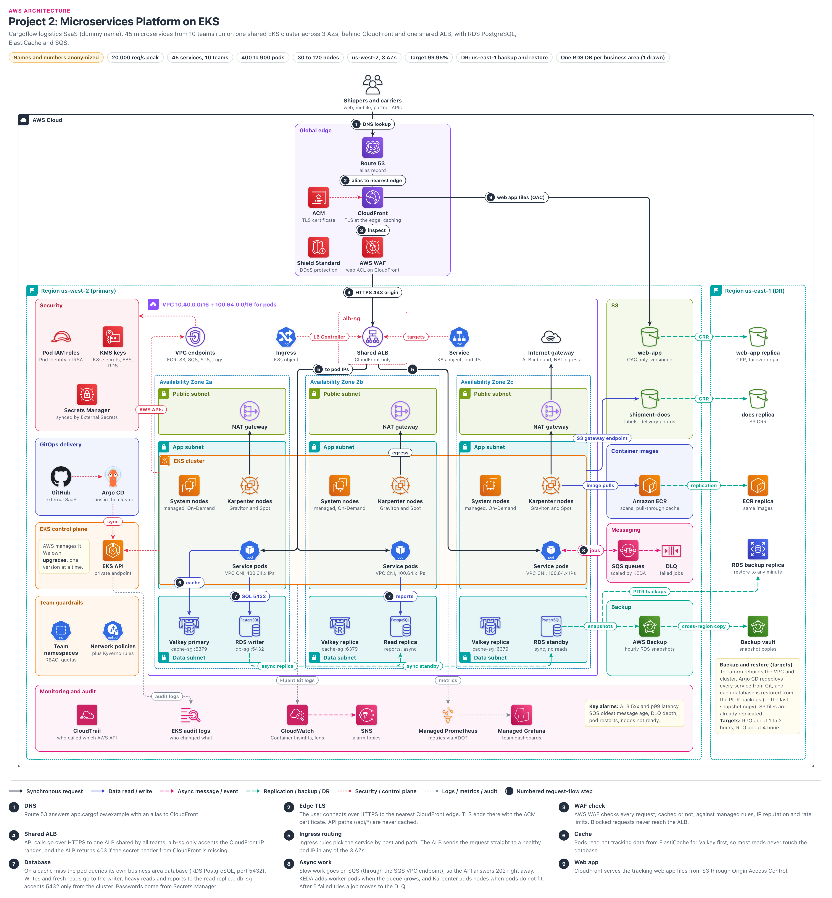

# Microservices Platform on EKS

> **Confidentiality note:** Company names, domain names, IDs and all numbers in this document are dummy values. The architecture, the decisions and the trade-offs are what this document shares.
> **Key figures (dummy values):** 45 services, 10 teams, peak 20,000 req/s, 400 to 900 pods, 30 to 120 nodes, us-west-2 (3 AZs), 99.95%, DR in us-east-1 (RPO 1 to 2 h, RTO 4 h).
> AWS limits and prices change over time, so treat these figures as approximate.

## Architecture diagram

### How to read the diagram
- **Center, top to bottom:** this is the main request path. Users → Route 53 → CloudFront → WAF → Shared ALB → Service pods in 3 AZs → Valkey and RDS PostgreSQL in the data subnets at the bottom (writer in 2a, read replica in 2b, standby in 2c).
- **Numbered badges (1 to 9):** these are the request flow steps from section 4. Step 8 (SQS async jobs) goes to the Messaging panel on the right, and step 9 (web app files) goes from CloudFront to S3.
- **Ingress and Service next to the ALB:** these are not AWS resources, they are Kubernetes objects. The Load Balancer Controller reads them and builds the ALB.
- **Line meanings:** black line = request, blue = data read/write, pink dashed = async message, green dashed = backup/replication, red dotted = security/control, grey dotted = logs/metrics.
- **Side panels:** on the left, Security (Pod IAM roles, KMS, Secrets Manager), GitOps (GitHub, Argo CD), EKS control plane and Team guardrails. On the right, S3, ECR, SQS and AWS Backup, and at the far right the us-east-1 DR region (web-app replica, docs replica, ECR replica, RDS backup replica, backup vault). At the bottom, Monitoring and audit.
- **DR lines:** two green lines leave the RDS standby in 2c. One goes to AWS Backup (hourly snapshots, copied from there to the us-east-1 vault). The other goes to the "RDS backup replica" in us-east-1 (RDS cross-Region automated backups, used for PITR).

## 1. Project name
- **Cargoflow Microservices Platform:** one shared EKS platform used by 10 teams together.
- In one line: we run 45 microservices on a single production EKS cluster, across 3 AZs, behind one shared ALB. Each team gets its own namespace, its own IAM role and its own database.
- The platform team (4 people) owns the cluster. Product teams only write YAML in Git to deploy.

## 2. Business problem

### Who is the company?
- Cargoflow is a logistics SaaS company.
- **Shippers** (people who send goods) track their parcels. **Carriers** (trucks, delivery companies) update the status. Partner systems call the public API.
- Main features: shipment tracking, route optimization (which truck should take which route), carrier integrations and billing.
- 10 product teams using different languages: Go, Java, Node.js and Python (this is called polyglot).

### What were the problems?
**What happened one day (the story):**
- One Monday at 8:30 in the morning, during dispatch time (when trucks leave the depot). 500 trucks needed routes.
- Route optimization was running inside the API request itself. It went past 30 seconds and timed out. Drivers did not get their routes in the app, and the trucks stayed stuck at the depot.
- The on-call engineer (the person handling problems that day) did not even know whether that service was deployed with an EC2 script or with Docker Compose. The fix took 2 hours.
- In the same month, a large customer said: "If you do not give us a SOC 2 report and a 99.95% SLA, we will not renew the contract."
- The CTO's decision: move all services onto one platform within 6 months, with a 4-person platform team, without increasing the compute bill.

**List of problems:**
1. **Every team was deploying in its own way:** some used scripts on EC2, some used Docker Compose, one used a Heroku-like PaaS. There were 10 different deploy processes, and on-call was a nightmare.
2. **Slow at peak time:** from 8 to 10 in the morning (dispatch time), traffic grows 4 times. Heavy work like route optimization was happening inside the API request, which is why the API timed out.
3. **Paying for idle servers:** each service had its own EC2 instances, and average CPU usage was only about 12%.
4. **Security audit problems:** all services shared one IAM access key. Database passwords were in config files. There was no trace of who changed what.
5. **Enterprise customers were asking for:** a SOC 2 report (a report from an outside auditor after checking the company's security), a 99.95% SLA (the uptime promise given to the customer in the contract), and audit logs.

### What did the company need?
| Need | Target | In simple words |
|---|---|---|
| Availability | 99.95% | Only about 21 minutes of downtime allowed per month |
| API speed | p99 latency under 300 ms | 99 out of 100 requests must return within 300 ms |
| Peak load | About 20,000 req/s | Combined traffic from all teams during dispatch time |
| Compute size | 400 to 900 pods, 30 to 120 nodes | Must grow and shrink automatically with traffic |
| RTO (if a region is lost) | About 4 hours | Time taken to get the platform working again |
| RPO (if a region is lost) | About 1 to 2 hours | How much data (in time) we can afford to lose |
| Security | Own IAM role per service, secrets in a vault, audit trail | No shared keys, every change must be traceable |
| Team isolation | One team's mistake must not take down another team | Namespaces, quotas, network policies |

### Why this architecture?
- **One platform, 10 teams:** everyone uses the same deploy process (Git → Argo CD → EKS). On-call becomes simple.
- **Why Kubernetes:** the teams already had experience with Helm charts (a way to install Kubernetes YAML files as one package) and Kubernetes. Tools like Karpenter, KEDA and Argo CD are already in the ecosystem.
- **Bin packing (many pods on one node):** packing the 45 services together raises CPU usage from 12% to about 55 to 65%.
- **Slow work goes to SQS:** the API answers immediately, and worker pods do route optimization in the background.

## 3. Architecture overview

### Internet and DNS
- Users: shippers and carriers (web, mobile), and partner systems (API calls).
- **Route 53:** the AWS DNS service (it turns a domain name into an address). An alias record for `app.cargoflow.example` points to CloudFront.

### Edge (Global edge)
- **CloudFront:** the AWS CDN (content delivery network), with edge locations all over the world. TLS ends here. It sends web app file requests to S3 and API calls to the ALB.
- **AWS WAF:** a web application firewall. It sits on CloudFront as a web ACL and stops attacks, bots and rate-limit abuse right at the edge.
- **ACM:** AWS Certificate Manager, which gives free TLS certificates. We attached one to CloudFront. **Shield Standard:** free DDoS protection that is on automatically.

### Network (VPC)
- **VPC:** our own private network inside AWS. Main range `10.40.0.0/16`, plus an extra `100.64.0.0/16` for pods (secondary CIDR).
- Each AZ (us-west-2a, 2b, 2c) has 3 subnets: public (ALB, NAT), app (EKS nodes, pods) and data (RDS, Valkey).
- **Internet Gateway:** the VPC's door to the internet. Inbound traffic to the ALB and outbound traffic from NAT both go through it. Nodes and pods have no public IP.
- **NAT Gateway (one in each AZ):** the only way for private nodes to go out (to carrier APIs). Nobody from outside can come in through it.
- **VPC endpoints:** private paths to ECR, S3, STS, EKS Auth, Secrets Manager, KMS, CloudWatch Logs, SQS and Managed Prometheus. Image pulls, SQS polling and metrics do not go through NAT.

### Application (EKS)
- **EKS control plane:** EKS is the AWS managed Kubernetes service. AWS runs the Kubernetes API server (where all commands arrive) and etcd (the database that stores what should run in the cluster) across 3 AZs. Nodes talk to it through a private endpoint.
- **VPC CNI:** the EKS networking add-on. It gives every pod a real IP from the VPC (100.64.x). That is why the ALB can go straight to a pod. But IPs run out quickly, so they must be planned (section 5A).
- **System nodes:** a small managed node group (On-Demand). CoreDNS (DNS inside the cluster: it turns a service name into an IP), the Load Balancer Controller, Karpenter, KEDA, External Secrets and Argo CD run here.
- **Karpenter nodes:** for workload pods. Graviton (ARM, cheaper), and Spot for stateless services.
- **Shared ALB:** one ALB for all 10 teams. Each team writes its own Ingress, and the Controller merges them into rules on the same ALB (IngressGroup).
- **Service pods:** 45 services spread across 3 AZs. HPA scales on CPU, and KEDA scales on SQS depth.

### Data
- **RDS PostgreSQL:** each business area (shipments, routing, billing) has its own Multi-AZ DB instance: 1 writer + 1 synchronous standby in another AZ (the standby does not take reads). For heavy reads and reports, there is one read replica in the third AZ. The diagram shows only one of these databases.
- **Why a DB instance and not a DB cluster:** a Multi-AZ DB cluster (1 writer + 2 readable standbys) fails over faster, but it does not support snapshot copy, cross-Region backups or a cross-Region replica. Our DR needs those.
- **ElastiCache for Valkey:** hot tracking data and rate limit counters. 1 primary, 2 replicas, automatic failover.
- **S3:** the `web-app` bucket (static files, OAC only: only this CloudFront can read it) and the `shipment-docs` bucket (shipping labels, delivery photos).

### Messaging
- **SQS queues:** we put slow work (route optimization, carrier API calls) in a queue. The API immediately replies "accepted".
- **DLQ (dead-letter queue):** a message that fails 5 times lands here, and an alarm goes off. One bad message cannot block the whole queue.
- **KEDA:** when messages in the queue grow, it adds more worker pods.

### Platform and delivery (GitOps)
- **GitHub:** external SaaS. Git is the source of truth for every Deployment, Ingress and policy.
- **Argo CD:** runs inside the cluster. It watches Git and applies changes through the EKS API. If someone changes something by hand with kubectl, it changes it back to what is in Git (covered in depth in Project 9).
- **ECR:** the container image store. Images are scanned as soon as they are pushed, public images go through a pull-through cache, and images are replicated to us-east-1.

### Security
- **Pod IAM roles:** each service account has its own IAM role (EKS Pod Identity, and IRSA for the tools that need it). The node role is very small.
- **KMS keys:** they encrypt Kubernetes secrets (envelope encryption), EBS, RDS, ElastiCache, SQS and S3.
- **Secrets Manager:** DB passwords and carrier API keys. The External Secrets Operator copies them into the right namespace.
- **Team guardrails:** team namespaces (RBAC, quotas), network policies (traffic between teams is blocked by default), and Kyverno (stops unsafe pod settings).

### Monitoring
- **CloudWatch:** Fluent Bit sends pod logs, Container Insights shows node and pod health, and EKS audit logs also go here.
- **Managed Prometheus + Managed Grafana:** the ADOT collector scrapes service metrics, and each team has its own dashboards.
- **SNS:** alarms page the on-call engineer and post to the owning team's channel.
- **CloudTrail:** an organization trail that records who made which AWS API call, in a separate log account.

### DR (Disaster Recovery)
- Strategy: **backup and restore** in us-east-1 (targets: RPO about 1 to 2 hours, RTO about 4 hours).
- AWS Backup takes hourly RDS snapshots (kept 35 days), and every snapshot is copied to the us-east-1 vault (with a us-east-1 KMS key). RDS cross-Region automated backups are also on, which gives PITR (restore to any minute) in us-east-1.
- ECR replica and S3 replicas (CRR: files copied automatically to another region) for both `shipment-docs` and `web-app` are already in us-east-1.
- We do not back up the cluster: Terraform (a tool to write infrastructure as code) rebuilds the VPC and cluster, and Argo CD redeploys all services from Git.

## 4. Request flow
- Main chain: `User → Route 53 → CloudFront → WAF → Shared ALB → Ingress rule → Service pod (EKS) → ElastiCache / RDS PostgreSQL / SQS`
- Web app files chain: `User → Route 53 → CloudFront → S3 (OAC)`
- Note: the user first loads the web app (step 9), then makes API calls (steps 1 to 8). Steps 1 to 3 are the same for both flows.
- For example, say a shipper asks "where is shipment CF-1234?" by calling `GET /api/tracking/CF-1234`.

### Step 1: DNS (Route 53)
- The browser asks for the IP of `app.cargoflow.example`. The Route 53 alias record returns CloudFront addresses.
- Alias queries to CloudFront are free. We cannot set the TTL on an alias record; Route 53 uses the TTL of the target (CloudFront).
- Time: usually a few ms (almost 0 if it is in the resolver cache).

### Step 2: Edge TLS (CloudFront + ACM)
- HTTPS 443 connection to the CloudFront edge nearest the user. TLS ends there, using the ACM certificate.
- Note: the CloudFront certificate must be in ACM in us-east-1 (even though our region is us-west-2).
- Cached files (JS, CSS) are served from the edge. The `/api/*` path is not cached (CachingDisabled policy) and goes to the origin.
- Time: TLS handshake about 10 to 30 ms (low because the edge is close).

### Step 3: WAF check (AWS WAF)
- The web ACL on CloudFront checks every request: AWS managed rules (common attacks, known bad inputs) and the IP reputation list.
- Rate-based rule: if one IP sends more than 2,000 requests in 5 minutes, it is blocked. Partner API keys have a separate, bigger limit.
- A blocked request never reaches the ALB, so it costs the cluster nothing.
- Time: usually under 1 ms.

### Step 4: Shared ALB (Application Load Balancer)
- CloudFront sends the request over HTTPS 443 to the ALB, which is its origin. The ALB sits in public subnets across 3 AZs.
- **alb-sg:** allows 443 only from the CloudFront managed prefix list (CloudFront IP ranges).
- **How this is enforced:** we create alb-sg in Terraform and give it to the Ingress with the `alb.ingress.kubernetes.io/security-groups` annotation (`manage-backend-security-group-rules: true`). Otherwise the controller puts its own SG with 0.0.0.0/0 on an internet-facing ALB.
- **Kyverno guard:** in an IngressGroup, annotations are merged across all teams' Ingresses. That is why teams cannot change the `inbound-cidrs`, `security-groups` or `group.name` annotations; only the platform team can.
- The CloudFront prefix list takes about 55 rules of weight in an SG (default 60 rules per SG), so alb-sg has only the 443 rule.
- **Secret header:** CloudFront adds a secret header called `X-Origin-Verify`. If the header is missing, an ALB listener rule returns 403. Even traffic coming from someone else's CloudFront distribution is stopped.
- The ALB listener has a separate us-west-2 ACM certificate.
- Time: ALB processing is usually a few ms.

### Step 5: Ingress routing (ALB → pod IP)
- Rule in the tracking team's Ingress: host `app.cargoflow.example`, path `/api/tracking/*` → `tracking` Service.
- The Load Balancer Controller registers the healthy pod IPs behind that Service in the target group (target type `ip`).
- The ALB sends the request straight to a pod IP (100.64.x.x), to any pod in the 3 AZs. There is no NodePort or kube-proxy hop. (What a Service is, and how services call each other: section 5A "Kubernetes Services".)
- Port: ALB → pod is usually HTTP 8080 (inside the VPC). The node/pod SG allows traffic only from the ALB SG.
- Time: 1 to 2 ms network, then app processing.

### Step 6: Cache (ElastiCache for Valkey)
- The tracking pod first looks for the key `shipment:CF-1234` in Valkey (cache-aside: check the cache first; if it is not there, fetch from the DB and put it in the cache).
- On a cache hit, the answer comes back in about 1 ms. Hot tracking data gets about 85 to 90% hits, and those requests never touch the database.
- **cache-sg:** allows 6379 only from the cluster. In-transit TLS and AUTH/RBAC users are on.

### Step 7: Database (RDS PostgreSQL)
- On a cache miss, an SQL query goes to the shipments database on port 5432. Writes and fresh reads go to the writer endpoint. Heavy reads and reports go to the read replica endpoint (there can be a few seconds of lag).
- Each business area has its own database. The tracking service touches only the shipments DB, not the billing DB.
- **db-sg:** allows 5432 only from the cluster. The password comes from Secrets Manager (through External Secrets).
- We store the result in Valkey with a 30 second TTL. Time: query about 2 to 10 ms.

### Step 8: Async work (SQS + KEDA + Karpenter)
- When a carrier asks to "recalculate the route", the API pod puts a job in SQS and immediately returns `202 Accepted`.
- Port: HTTPS 443 to the SQS API (through the SQS VPC endpoint). Security: the `route-worker` role can only receive/delete on this one queue, and the queue is encrypted with KMS.
- Worker pods read SQS with long polling (a read that waits up to 20 s until a message arrives). If the queue grows, KEDA adds worker pods, and if there is no room on the nodes for those pods, Karpenter adds nodes.
- When the job is done, the worker deletes the message. If it fails 5 times, it goes to the DLQ.
- Time: about 20 ms for the API, and a few seconds to minutes for the background job.

### Step 9: Web app (CloudFront → S3 via OAC)
- The tracking web app (HTML, JS, CSS) lives in the `web-app` S3 bucket. The bucket is not public.
- **OAC (Origin Access Control):** the bucket policy gives read permission only to this one CloudFront distribution.
- Files are cached at the edge, so most requests never reach S3. The bucket is versioned, so after a bad deploy we can roll back to the old version.
- Port: HTTPS 443. Time: about 10 to 50 ms on an edge cache hit, and more than about 100 ms from S3 on a miss.

### Other flows
- **Deploy flow (GitOps):** developer merges a PR → CI builds the image and pushes it to ECR → image tag updated in Git → Argo CD sees it and applies it through the EKS API → rolling update. (CI details in Project 9.)
- **Image pull:** Karpenter nodes pull images from ECR through VPC endpoints (ecr.api, ecr.dkr) + the S3 gateway endpoint. No NAT data charge.
- **Documents:** pods write shipping labels and delivery photos to the `shipment-docs` bucket through the S3 gateway endpoint. Users get a presigned URL.
- **Carrier APIs (outbound):** worker pods → NAT Gateway (same AZ) → Internet Gateway → carrier API. Some carriers ask for an IP allowlist, so we give them the NAT Elastic IPs.
- **Secrets sync:** the External Secrets Operator reads Secrets Manager every 1 hour and updates the Kubernetes Secret in the namespace.
- **Telemetry:** on every node, Fluent Bit (logs → CloudWatch) and the ADOT collector (metrics → Managed Prometheus). EKS control plane audit logs → CloudWatch Logs.
- **Backup / DR:** RDS → AWS Backup hourly snapshots → copy to us-east-1 vault, plus RDS cross-Region automated backups. ECR → ECR replica. `shipment-docs` and `web-app` → CRR → us-east-1 replica buckets.

## 5. Why each AWS service

### Amazon Route 53
**What it is:** the AWS managed DNS service. It turns a domain name into an address.

**Why we used it:** to point `app.cargoflow.example` to CloudFront with an alias record.

**Problem it solves:** we can use CloudFront even at the zone apex (the main domain without www, `cargoflow.example`), it has a 100% availability SLA, and alias queries are free.

**Alternatives:** Cloudflare DNS, or the company's existing DNS provider.

**Why not the alternative:** with AWS we get alias records, health checks and IAM control, and it is easier to manage everything in one place with Terraform.

### Amazon CloudFront
**What it is:** the AWS CDN. It serves content from edge locations close to the user.

**Why we used it:** to end TLS at the edge, to cache web app files, and as a shield in front of the ALB for the API.

**Problem it solves:** latency drops for far-away users, WAF and Shield work right at the edge, and the ALB is not directly open to the internet.

**Alternatives:** expose the ALB directly and put WAF on the ALB.

**Why not the alternative:** we need a CDN for the static files anyway. It is better to stop attacks at the edge before they reach the cluster.

### AWS WAF
**What it is:** a web application firewall. It checks HTTP requests against rules and allows, blocks or counts them.

**Why we used it:** a web ACL on CloudFront with AWS managed rule groups, rate-based rules and separate limits for the partner API.

**Problem it solves:** things like SQL injection, bad bots and floods from a single IP never reach the cluster. Each of the teams behind the 45 services does not have to write its own protection.

**Alternatives:** WAF on the ALB, or an ingress WAF inside the cluster such as NGINX ModSecurity.

**Why not the alternative:** a WAF inside the cluster means our pods and nodes spend resources on attack traffic. Stopping it at the edge is cheaper and safer.

### AWS Certificate Manager (ACM)
**What it is:** a service that gives free public TLS certificates and renews them automatically.

**Why we used it:** the CloudFront certificate (in us-east-1) and the ALB listener certificate (in us-west-2).

**Problem it solves:** the old problem of a certificate expiring and taking the site down goes away. We never handle the private key.

**Alternatives:** cert-manager + Let's Encrypt in the cluster.

**Why not the alternative:** TLS ends on CloudFront and the ALB, where ACM is native. cert-manager is needed only if we want pod-to-pod mTLS.

### AWS Shield Standard
**What it is:** free DDoS protection. It stops network and transport layer floods (SYN flood, UDP reflection).

**Why we used it:** it is on automatically for CloudFront and Route 53, with no extra setup.

**Problem it solves:** big network floods never reach the origin. Layer 7 floods are handled by the WAF rate rules.

**Alternatives:** Shield Advanced (DDoS response team, cost protection, about $3,000 per month subscription).

**Why not the alternative:** for the current risk, Standard + WAF is enough. If a big customer contract comes in, we will look at Advanced again.

### Application Load Balancer (with AWS Load Balancer Controller)
**What it is:** a Layer 7 (HTTP) load balancer. It looks at the host and path and sends the request to the right target group. The Load Balancer Controller is an AWS controller that runs in the cluster and creates the ALB from Ingress objects.

**Why we used it:** one shared ALB, with the Ingress rules of 10 teams merged using IngressGroup. Target type `ip`, straight to pod IPs.

**Problem it solves:** one ALB instead of 45 (cost, WAF and certificate in one place). Health checks across 3 AZs, so no traffic goes to unhealthy pods.

**Alternatives:** NLB + an NGINX/Envoy ingress controller in the cluster, or a separate ALB for each team.

**Why not the alternative:** with NGINX we must scale and patch the pods ourselves, and it adds another hop. An ALB per team means cost and sprawl. Trade-off: we must watch the ALB rules quota (default about 100 rules).

### Amazon VPC (subnets, Internet Gateway)
**What it is:** our own isolated network inside AWS. We build it with subnets, route tables and an Internet Gateway.

**Why we used it:** `10.40.0.0/16` for nodes, ALB and data. `100.64.0.0/16` as a secondary CIDR for pods. Public, app and data subnets in 3 AZs.

**Problem it solves:** nodes, pods and databases have no public IP. The Internet Gateway is used only for ALB inbound traffic and NAT egress.

**Alternatives:** an IPv6 EKS cluster (pods get IPv6, so there is no IP shortage).

**Why not the alternative:** IPv6 must be chosen at cluster create time. An existing cluster cannot be converted; it needs a new cluster + migration. Some add-ons and old libraries need IPv6 testing. Carriers being IPv4-only is not a problem: IPv6 pods reach outside IPv4 addresses using the node IP through NAT.

### NAT Gateway
**What it is:** the way for nodes in private subnets to reach the internet. No connection can come in from outside.

**Why we used it:** worker pods must call carrier APIs and partner webhooks. One in each AZ.

**Problem it solves:** if one AZ goes down, outbound traffic from the other AZs does not stop. It gives carriers fixed Elastic IPs for their allowlist.

**Alternatives:** a single NAT Gateway (cheaper), EC2 NAT instances, or a Regional NAT Gateway (since Nov 2025: one NAT that expands across AZs automatically).

**Why not the alternative:** with a single NAT, if that AZ goes down, all AZs lose outbound access, and there is also a cross-AZ data charge. NAT instances must be patched and scaled by us. A Regional NAT can take up to about 60 minutes to expand to a new AZ, and we need to control the EIPs ourselves for the carrier allowlist (manual mode). Per-AZ NAT is already in Terraform, and we will evaluate Regional NAT later.

### VPC Endpoints
**What it is:** a private path to AWS services from inside the VPC. A gateway endpoint for S3 (free), and interface endpoints for the others (an ENI in each AZ).

**Why we used it:** ECR (api, dkr), S3, STS, EKS Auth (Pod Identity), Secrets Manager, KMS, CloudWatch Logs, SQS (workers, KEDA, Karpenter interruption queue polling) and Managed Prometheus `aps-workspaces` (ADOT remote write). EC2 and ELB API calls (Karpenter, LB Controller) are low volume, so going through NAT is fine for them.

**Problem it solves:** if image pulls (hundreds of MB per image) go through NAT, there is a processing charge per GB. With endpoints, that charge goes away. Even if NAT fails, image pulls and SQS jobs do not stop.

**Alternatives:** send everything through the NAT Gateway.

**Why not the alternative:** during scale-out, if 50 nodes pull images at the same time, we get both a big NAT bill and a NAT bottleneck. Interface endpoints have an hourly charge, but for our traffic that is cheaper.

### Amazon EKS (control plane)
**What it is:** AWS managed Kubernetes. AWS runs the API server and etcd across 3 AZs, and backs them up and patches them.

**Why we used it:** one standard Kubernetes API for 10 teams. Private endpoint (nodes talk to it from inside the VPC). The public endpoint is open only to office/VPN IPs (or fully off, using the private endpoint through VPN). Argo CD is inside the cluster, so deploys do not need the public endpoint. Control plane logs go to CloudWatch.

**Problem it solves:** we do not have to manage HA for etcd and the API server. We can use the ecosystem: Helm, Argo CD, Karpenter, KEDA and so on.

**Alternatives:** Amazon ECS on Fargate/EC2, or self-managed Kubernetes on EC2 (kOps).

**Why not the alternative:** ECS is covered in detail in section 5A. Self-managed means etcd backups, control plane upgrades and everything else are on us, which is too much for a 4-person platform team.

### EKS Managed Node Groups (EC2 system nodes)
**What it is:** EC2 Auto Scaling groups managed by EKS. AMI updates and node drains happen with AWS help.

**Why we used it:** a small On-Demand "system" node group (3 to 6 nodes across 3 AZs). CoreDNS, the Load Balancer Controller, Karpenter, KEDA, External Secrets and Argo CD run here.

**Problem it solves:** if Karpenter ran on nodes it launched itself, then when that node died there would be nobody to bring up a new node. That is why Karpenter runs on separate fixed nodes. Critical add-ons also avoid Spot interruptions.

**Alternatives:** system add-ons on Fargate, or EKS Auto Mode.

**Why not the alternative:** DaemonSets do not run on Fargate, which is a problem for some add-ons. The Auto Mode (GA since Dec 2024) fee is about 12% on top of the EC2 On-Demand price (depending on instance type), and Savings Plans do not apply to that fee. There is also less control over the AMI and node config. Our Karpenter setup is already stable, so not now; we will evaluate it later.

### Karpenter nodes (Amazon EC2, Graviton and Spot)
**What it is:** Karpenter is a node autoscaler (an open-source project started by AWS). It watches pending pods and directly launches an EC2 instance of the right size, usually in about one minute.

**Why we used it:** for workload pods. We allowed many instance types in the NodePool, Graviton first, Spot for stateless services and On-Demand for the rest.

**Problem it solves:** we do not have to plan node groups in advance. Consolidation removes empty nodes. When a Spot interruption notice (2 minutes) arrives, it drains the node ahead of time.

**Alternatives:** Cluster Autoscaler + many managed node groups.

**Why not the alternative:** Cluster Autoscaler goes through the ASG, which is slower. One node group can only mix instance types of the same size (equal vCPU/memory), so we would need many node groups. The comparison is in section 5A.

### Amazon ECR
**What it is:** the AWS private container image registry.

**Why we used it:** images for the 45 services. Scan right after push, pull-through cache (mirror of Docker Hub and registry.k8s.io images), replication to us-east-1, immutable tags.

**Problem it solves:** Docker Hub rate limits, and pods failing to start when a public registry is down. Nodes pull using IAM, with no passwords.

**Alternatives:** Docker Hub, GitHub Container Registry, JFrog Artifactory.

**Why not the alternative:** private pulls through a VPC endpoint, IAM integration and regional replication are native. An external registry means another credential and another point of outage.

### Amazon RDS for PostgreSQL (Multi-AZ DB instance + read replica)
**What it is:** AWS managed PostgreSQL. A Multi-AZ DB instance means 1 writer + 1 synchronous standby in another AZ. The standby does not take reads; it is only for failover.

**Why we used it:** each business area (shipments, routing, billing) has its own DB. A write commits only after it is written in both AZs (synchronous). One read replica in the third AZ for heavy reads and reports.

**Problem it solves:** automatic failover usually takes 1 to 2 minutes, and committed data is not lost. Snapshot copy, cross-Region automated backups and cross-Region read replicas are all supported, so we can build a DR plan. AWS does the backups and patching.

**Alternatives:** Multi-AZ DB cluster (1 writer + 2 readable standbys, failover usually under 35 seconds), Aurora PostgreSQL, DynamoDB, or a PostgreSQL operator inside the cluster.

**Why not the alternative:** a Multi-AZ DB cluster has no snapshot copy, no cross-Region automated backups and no read replica in another Region. Our DR needs those, so we gave up the faster failover. Aurora features (15 replicas, Global Database) are not needed for small DBs (hundreds of GB). The data is relational (joins, transactions), so not DynamoDB. Putting the database in Kubernetes is an upgrade risk.

### Amazon ElastiCache for Valkey
**What it is:** an AWS managed in-memory cache. Valkey is an open-source fork of Redis OSS 7.2. Commands and clients up to Redis OSS 7.2 work the same way (features after Redis 8 are not guaranteed).

**Why we used it:** hot tracking data (latest shipment status), rate limit counters and idempotency keys. 1 primary + 2 replicas, 3 AZs, automatic failover.

**Problem it solves:** during the dispatch peak, tracking reads do not hit the database. Pods stay stateless, so whichever pod gets the request sees the same data.

**Alternatives:** ElastiCache for Redis OSS, DynamoDB DAX, or self-hosted Redis in the cluster.

**Why not the alternative:** Valkey pricing is about 20% lower than Redis OSS, and the features we need (up to 7.2) are the same. DAX works only with DynamoDB. Self-hosted means failover and patching are on us.

### Amazon SQS (with DLQ)
**What it is:** a fully managed message queue. A producer puts a message in, and a consumer takes it and deletes it once the work is done.

**Why we used it:** for slow work like route optimization and carrier API calls. Each queue has a DLQ (maxReceiveCount 5), and KEDA scales worker pods on queue depth.

**Problem it solves:** the API answers immediately. If a carrier API is down, messages stay in the queue and are retried later, so no data is lost.

**Alternatives:** Amazon MSK (Kafka), EventBridge, or RabbitMQ in the cluster.

**Why not the alternative:** what we need is a "one job, one worker" work queue, not event streaming. Kafka needs brokers and partitions to be managed. EventBridge is good for routing, but SQS is the right fit for holding a backlog and reading it at the consumer's speed.

### Amazon S3
**What it is:** object storage. It keeps files very durably (designed for 11 nines durability).

**Why we used it:** the `web-app` bucket (static files, OAC only, versioned, CRR to us-east-1) and the `shipment-docs` bucket (labels, delivery photos, KMS encrypted, CRR to us-east-1).

**Problem it solves:** files do not have to live in pods or on EBS. Pods stay stateless. A lifecycle rule for photos (cheaper storage class after 90 days).

**Alternatives:** Amazon EFS (shared file system), EBS volumes.

**Why not the alternative:** EFS and EBS cost more, and we cannot hand files to users directly with a presigned URL. An EBS volume lives in one AZ only and cannot be attached to a node in another AZ.

### AWS Secrets Manager
**What it is:** a service that stores passwords and API keys encrypted. It supports automatic rotation.

**Why we used it:** app DB passwords and carrier API keys. The External Secrets Operator (ESO) syncs them as Kubernetes Secrets into each team's namespace. Only the master user password uses RDS managed rotation (about every 7 days), and apps never use it.

**Problem it solves:** passwords are not in Git or in config files. App users use **alternating users** rotation: the new password is set on a second user, and the old user keeps working until the next rotation. So even with a 1 hour ESO lag, connections do not fail.

**Alternatives:** Secrets Store CSI Driver (mount as files), SSM Parameter Store, HashiCorp Vault.

**Why not the alternative:** the CSI driver is good, but teams are used to env variables and the Kubernetes Secret format. Parameter Store has no built-in DB rotation. Vault we would have to run ourselves.

### AWS IAM (EKS Pod Identity and IRSA)
**What it is:** the service that decides who can do what in AWS. Pod Identity and IRSA are both ways to give a pod (its service account) its own IAM role.

**Why we used it:** each service has its own role, for example `tracking` can read the shipment-docs bucket and `route-worker` can use only one SQS queue. Pod Identity for new services, IRSA for old tools that do not support Pod Identity.

**Problem it solves:** the old shared access key is gone. Credentials are temporary and change automatically. CloudTrail shows which service did what.

**Alternatives:** give all permissions to the node IAM role, or static access keys in Secrets.

**Why not the alternative:** a node role means every pod on that node gets all the permissions (45 services!). Static keys leak and are hard to rotate.

### AWS KMS
**What it is:** the service that manages encryption keys. The key never leaves the service, and every use is logged in CloudTrail.

**Why we used it:** customer managed keys for Kubernetes secrets envelope encryption, EBS volumes, RDS, ElastiCache, SQS and S3. A separate key per data type.

**Problem it solves:** on EKS 1.28+, all Kubernetes API data is envelope encrypted by default with an AWS owned key (since March 2025). We supplied a customer managed key for key policy control, CloudTrail audit and SOC 2 proof. Note: this only covers etcd at rest. Anyone who can create a pod in a namespace can read all secrets in that namespace, so in prod, writes happen only through Git + Argo CD.

**Alternatives:** AWS owned / AWS managed keys (default encryption), CloudHSM.

**Why not the alternative:** default keys give no key policy control and no cross-account sharing. CloudHSM only if compliance requires it; it is expensive and needs more operations work.

### Amazon CloudWatch (Container Insights, Logs)
**What it is:** the AWS monitoring service: metrics, logs, alarms and dashboards. Container Insights is the feature that shows the health of EKS nodes and pods.

**Why we used it:** Fluent Bit (DaemonSet) sends pod logs. EKS audit logs, ALB, RDS and SQS metrics, and all alarms live here.

**Problem it solves:** even when a pod dies, its logs remain. AWS service metrics need no extra setup.

**Alternatives:** Datadog, Splunk, self-hosted ELK / OpenSearch.

**Why not the alternative:** third-party per-host pricing is expensive for 120 nodes. Running self-hosted ELK is a whole other project. Trade-off: CloudWatch Logs ingestion costs money, so we control log levels and retention.

### AWS CloudTrail
**What it is:** the audit service that records all AWS API calls: who did what, when and from where.

**Why we used it:** an organization trail, stored in S3 (Object Lock) in a separate log archive account. It covers all EKS, IAM, KMS and Security Group changes.

**Problem it solves:** it answers "who changed this Security Group?". Even the production account admin cannot delete the logs.

**Alternatives:** EKS audit logs only.

**Why not the alternative:** EKS audit logs only show changes inside the cluster (kubectl). AWS-level changes need CloudTrail. We use both.

### Amazon SNS
**What it is:** a pub/sub notification service. It sends one message to many subscribers.

**Why we used it:** CloudWatch alarm topics. Platform alarms go to the platform on-call, and team alarms go to that team's channel (Slack, through Amazon Q Developer in chat applications).

**Problem it solves:** the right alarm goes to the right team. One alarm, many destinations (PagerDuty, Slack, email).

**Alternatives:** a direct PagerDuty integration from the alarms, or Alertmanager only.

**Why not the alternative:** SNS is the native target for CloudWatch alarms. For Prometheus alerts, the Managed Prometheus alert manager also sends to SNS, so there is one path.

### Amazon Managed Service for Prometheus
**What it is:** an AWS managed, Prometheus-compatible metrics store. AWS handles storage, HA and scaling.

**Why we used it:** the ADOT collector (AWS Distro for OpenTelemetry) scrapes service metrics (request rate, errors, latency, queue lag) and writes them here.

**Problem it solves:** teams already expose Prometheus metrics. We avoid the memory and disk problems a self-hosted Prometheus would have with metrics from 900 pods.

**Alternatives:** self-hosted Prometheus + Thanos in the cluster, or CloudWatch custom metrics.

**Why not the alternative:** running Thanos is a full-time job. CloudWatch custom metrics are expensive for high-cardinality labels. Trade-off: the bill is based on samples, so we drop unnecessary labels.

### Amazon Managed Grafana
**What it is:** AWS managed Grafana dashboards, with login through IAM Identity Center.

**Why we used it:** each team gets dashboards for its own services (Prometheus + CloudWatch data in one place). The platform team gets a cluster dashboard.

**Problem it solves:** we do not have to handle Grafana server upgrades, HA or login.

**Alternatives:** CloudWatch dashboards only, or Grafana inside the cluster.

**Why not the alternative:** CloudWatch dashboards do not support PromQL queries. Grafana inside the cluster means that if the cluster goes down, the dashboards go down too, which is the biggest problem during an incident.

### AWS Backup
**What it is:** a service that manages backups of AWS resources in one place, using policies.

**Why we used it:** hourly snapshots for all RDS DBs, 35 days retention, and every snapshot copied to the us-east-1 backup vault (re-encrypted with a us-east-1 KMS key). With Vault Lock, nobody can delete them.

**Problem it solves:** we can restore after a region loss, ransomware or a wrong `DELETE` query. Auditors get a single report.

**Alternatives:** RDS automated backups only, Velero, or AWS Backup for EKS (since Nov 2025 it can also back up EKS cluster state).

**Why not the alternative:** RDS automated backups are on for PITR (also in us-east-1, with cross-Region automated backups). AWS Backup gives one policy for all DBs, vault lock and cross-region copy. All cluster state is in Git and we test rebuilding from Git, so that is the main plan. If state that is not in Git appears (some CRDs/objects), AWS Backup for EKS can be an extra layer.

### Key decisions
| Decision | Chosen | Rejected | Why |
|---|---|---|---|
| Container orchestrator | EKS | ECS | Teams have Kubernetes skills and Helm charts, and the Karpenter/KEDA/Argo CD ecosystem. Cost: on average 3 minor upgrades a year are our work |
| Cluster model | One shared prod cluster, team namespaces | One cluster per team | 10 clusters means 10 times the upgrades and add-ons. Namespaces + quotas + network policies are enough |
| Node autoscaling | Karpenter (Graviton, Spot mix) | Cluster Autoscaler | Faster, right-sized nodes, consolidation, many instance types |
| Pod AWS access | EKS Pod Identity (IRSA for old tools) | Node IAM role | Least privilege per service, small node role |
| Database | RDS PostgreSQL Multi-AZ DB instance + read replica per business area | Multi-AZ DB cluster, one big Aurora cluster, DynamoDB | Team ownership, small blast radius, relational data. A DB cluster has no cross-Region copy/backups, and DR needs a DB instance |
| Async work | SQS + KEDA | Kafka (MSK), doing it inside the API request (synchronous) | Simple work queue, built-in DLQ, scaling on queue depth |
| Edge, ingress | CloudFront → one shared ALB (IngressGroup, target type ip), ALB CloudFront only | ALB open to the internet, NGINX + NLB, an ALB per team | Edge WAF, TLS close to users, static cache. One ALB: one hop fewer, no pods to patch, one WAF/cert |
| DR | us-east-1 backup and restore (RTO about 4h) | Warm standby cluster | For a 99.95% target, region loss is rare, and a warm cluster costs thousands of dollars a month. We will revisit if the contract changes |

## 5A. Key topics

### Why EKS instead of ECS
- **What ECS is:** AWS's own container orchestrator. The control plane is free, it is simple, and it has deep AWS integration.
- **What EKS is:** AWS managed Kubernetes. Standard Kubernetes API and a big open-source ecosystem.

| Topic | EKS | ECS |
|---|---|---|
| Control plane cost | About $0.10 per hour per cluster (about $73 a month) | Free |
| Upgrades | About 14 months of standard support per version. Kubernetes releases about 3 versions a year, and we can upgrade only one version at a time. So on average, 3 upgrades a year are our work | AWS handles it, no version upgrades |
| Ecosystem | Helm, Argo CD, Karpenter, KEDA, Kyverno, operators | AWS tools only (CDK, Service Connect, Application Auto Scaling) |
| Portability | Same API on any cloud or on-prem | AWS API only (on-prem servers to some extent with ECS Anywhere) |
| Learning curve | Higher (RBAC, CNI, add-ons) | Lower |

**Why we chose EKS:**
- 7 of the 10 teams already had Helm charts and Kubernetes experience (a team that came in through an acquisition came from GKE).
- We wanted Karpenter (Spot, Graviton bin packing), KEDA (SQS scaling), Argo CD (GitOps) and Kyverno (policies) on one platform.
- Some enterprise customers are asking "can you run this in our data center?". Kubernetes manifests are portable.

**Honest trade-offs:**
- **Upgrades are our work:** control plane, add-ons (VPC CNI, CoreDNS, kube-proxy: meaning in section 3), nodes, Helm charts and deprecated APIs. About 3 to 4 weeks of platform team work a year.
- If an upgrade is late, the cluster moves into **extended support** (about 12 more months), and the cluster cost rises to about $0.60 per hour.
- A platform team (4 people) is a must. ECS would not need that many people.
- **When we would choose ECS:** 3 to 5 services, a small team without Kubernetes skills, AWS only. Then ECS on Fargate is simpler and cheaper.
- (In Project 6 we chose ECS Fargate. The reason there was security/compliance: no hosts to patch and separate isolation for each task.)

### Multi-tenancy for 10 teams
- **What a tenant is:** here, one product team. One team's mistake must not take down another, and one team must not see another's data.
- Our model is **soft multi-tenancy:** all teams are in the same company and trust each other, but mistakes happen. They are not hostile customers.

**Layers (each one is a wall):**
1. **Namespaces:** each team has namespaces like `tracking-prod` and `routing-prod`. An Argo CD AppProject limits the team to its own namespaces.
2. **RBAC (Role-Based Access Control, who can do what):**
   - Engineers log in with IAM Identity Center (AWS SSO login).
   - EKS **access entries** (the EKS setting that maps an IAM role to a Kubernetes group) put them in their team group. This replaces the old `aws-auth` ConfigMap.
   - A team can only view its own namespace and go inside a pod for debugging (`exec`). All changes go through Git.
3. **ResourceQuota, LimitRange:** CPU, memory and pod count limits for each namespace. LimitRange gives default requests to a pod that has none. One team's runaway HPA cannot eat the cluster.
4. **Network policies:** default deny in every namespace. Only the needed paths are allowed (for example, `billing` to the `shipments` API on port 8080). We use the native network policy support in VPC CNI.
5. **Kyverno admission policies:** privileged pods, hostPath, the `latest` tag, images not from our ECR, and pods without requests/limits are blocked before they are created. Pod Security Standards "restricted" too.
6. **IAM per service:** each team has its own Pod Identity roles and can read only its own DB secret.
7. **PriorityClasses:** high priority for platform add-ons, low priority for batch workers. When a node is full, batch gets out of the way first.

**One cluster vs many clusters:**
| Model | Benefit | Drawback |
|---|---|---|
| One shared cluster (ours) | Upgrade once, lower cost, better bin packing | A cluster-wide problem (CoreDNS, bad webhook) hits everyone |
| One cluster per team | Full isolation | 10 times the upgrades, add-ons and cost |

- If hard isolation is needed (for example, PCI payments), we give that service a separate cluster or a separate account.
- To reduce the blast radius (how far the damage spreads when one thing fails): prod and staging are separate clusters in separate AWS accounts.

### Kubernetes Services
- **The problem:** pods come and go, and their IP changes every time. Which IP should the billing service call to reach shipments?
- **What a Service is:** a stable name, with a list of ready pods behind it. For example: `shipments.shipments-prod.svc.cluster.local:8080`.
- **ClusterIP (default type):** works only inside the cluster. CoreDNS turns the name into a virtual IP. On every node, kube-proxy sends a request for that IP to one ready pod. All calls between our 45 services (east-west traffic) work this way.
- **Traffic from outside:** the ALB does not go through the Service. The Load Balancer Controller only takes the list of pod IPs from the Service and puts it in the target group (target type ip).
- **Types we do not use:** NodePort (opening a port on every node) and type LoadBalancer (a separate NLB per Service, higher cost).
- **Readiness:** only pods that pass their readiness probe are in the Service list (EndpointSlices).
- **Network policy:** even if you know the Service name, the call does not go through unless a network policy allows it (for example, only billing → shipments 8080 is allowed).
- **Cross-AZ cost:** a call to a pod in another AZ has a data charge. With Topology Aware Routing (`service.kubernetes.io/topology-mode: Auto`), requests go to pods in the same AZ first.

### Pod-level IAM: IRSA vs EKS Pod Identity
- **The problem:** a pod needs credentials to call AWS APIs (S3, SQS). If we use the node role, every pod on that node gets the same permissions.
- **Service account:** the pod's identity in Kubernetes. We bind one IAM role to one service account.

**How IRSA (IAM Roles for Service Accounts) works:**
- We register an OIDC provider for the cluster in IAM.
- A Kubernetes signed token (projected token) is mounted into the pod. The AWS SDK gives it to STS `AssumeRoleWithWebIdentity` and gets temporary credentials.
- The role trust policy contains the cluster OIDC issuer URL, the namespace and the service account name.

**How EKS Pod Identity works:**
- The Pod Identity Agent (add-on, DaemonSet) runs on the node. In the EKS API we create an association: "this namespace + service account → this role".
- The SDK asks the agent, and the agent gets credentials from the EKS Auth API (`AssumeRoleForPodIdentity`). That is why we added the EKS Auth VPC endpoint.
- The trust policy has only the principal `pods.eks.amazonaws.com`, with no cluster-specific URL.

| Topic | IRSA | Pod Identity |
|---|---|---|
| Setup | OIDC provider for each cluster | Add-on + association, no OIDC needed |
| Role reuse (many clusters) | Must add each cluster URL to the trust policy | Same role in any cluster |
| Blue/green cluster upgrade | Must change all trust policies for the new cluster | Only new associations |
| Session tags (ABAC) | None | Cluster and namespace tags are included |
| Fargate, old SDKs | Works | Not supported on Fargate, needs newer SDK versions |
| Limits, extras | Default 100 OIDC providers per account, trust policy about 2,048 characters (if many clusters are trusted, the role must be duplicated) | `sts:AssumeRole` + `sts:TagSession` in the trust policy. Since June 2025, cross-account role chaining with `targetRoleArn` in the association |

**Why the node IAM role must stay small:**
- The node role has only EKS worker and ECR pull permissions. For the pull-through cache it also has `ecr:BatchImportUpstreamImage` and `ecr:CreateRepository`, but only for the cache prefix repos (for example `docker-hub/*`). Or, if CI pulls images into the cache ahead of time, the node role stays pull-only.
- Even the VPC CNI permissions are not in the node role; the `aws-node` service account has its own role.
- **IMDSv2, hop limit 1:** pods cannot steal node credentials from node metadata (IMDS, 169.254.169.254). We set this as the default in the Karpenter EC2NodeClass.
- Why it matters: if one pod is hacked, the node role credentials must not open a path to the whole account. Blast radius = that one service role.

### Pod and node autoscaling end to end
- **Two levels:** pods (application copies) must grow, and then those pods need room on nodes (EC2).

**Pod level:**
- **HPA (Horizontal Pod Autoscaler):** CPU target 60%. It checks metrics about every 15 seconds and increases replicas. Used for API services.
- **KEDA:** an event-driven autoscaler. By default it counts both SQS `ApproximateNumberOfMessages` + `ApproximateNumberOfMessagesNotVisible` (in-flight) (`scaleOnInFlight: true`). For example, a target of 20 messages per worker pod. That is why it does not remove workers in the middle of their work, and scales to 0 only after in-flight is also 0. Inside, KEDA creates an HPA.
- **Requests must be right:** both the scheduler and Karpenter decide based on pod `requests`. Wrong requests mean wrong scaling.

**Node level:**
- **Karpenter:** as soon as a pod is Pending (no room anywhere), it launches the cheapest instance type that fits those pods using the EC2 Fleet API. The node is usually Ready in about one minute.
- **Consolidation:** when load is low, it moves pods to other nodes and removes empty nodes. Disruption budgets limit how many nodes can go at once (for example 10%).
- **Spot interruption:** EventBridge → SQS interruption queue → Karpenter. Within the 2-minute notice, the node is cordoned (no new pods), drained (existing pods moved) and a new node is brought up.

**End to end timeline:**
| Step | What happens | Time |
|---|---|---|
| 1 | Dispatch peak starts, pod CPU rises | 0 s |
| 2 | HPA sees it and increases replicas | 15 to 30 s |
| 3 | No room for new pods, Pending | Immediately |
| 4 | Karpenter launches a new node, node Ready | About 60 s |
| 5 | Image pull (through VPC endpoint) | 10 to 20 s |
| 6 | Readiness probe passes, ALB target healthy | 10 to 30 s |
| | **Total** | **About 2 to 3 minutes** |

- That is why we raise minReplicas before the peak (for example at 7:45) (scheduled scaling, KEDA cron).

| Tool | What it scales | Signal | Where we use it |
|---|---|---|---|
| HPA | Pods | CPU, memory, custom metrics | API services |
| KEDA | Pods (from 0) | SQS depth, cron, Prometheus | Queue workers |
| Karpenter | Nodes | Pending pods | Workload nodes |
| Cluster Autoscaler | Node group (ASG) size | Pending pods | Not used |
| Managed node group (fixed) | Does not scale (3 to 6) | Manual | System add-ons |

**Karpenter vs Cluster Autoscaler:**
- Cluster Autoscaler only increases the ASG desired count. One node group can only mix instance types of the same size (equal vCPU/memory). 45 services would need many node groups, and it is slow.
- Karpenter launches EC2 directly without node groups, with many instance types and built-in consolidation.
- When Cluster Autoscaler is better: if you need ASG features (warm pools, lifecycle hooks), or for simple, fixed workloads.

### EKS cluster upgrade strategy with zero downtime
- **Rule:** the control plane moves only one minor version at a time (for example 1.35 → 1.36; 1.36 has been available on EKS since June 2026). EKS now offers a rollback of one version within 7 days, but we should not depend on it, which is why preparation matters.
- **Cadence:** Kubernetes releases about 3 minor versions a year. So on average, 3 upgrades a year (one every 4 months, or two in a row in one window). If we do fewer, we fall 1 to 2 versions behind every year and land in extended support. We set a calendar so we never go past the 14 months of standard support.

**Preparation (work done first):**
1. **Deprecated APIs:** find manifests that use removed APIs with EKS Upgrade Insights and tools like `kubent`/pluto. PRs to teams 2 weeks ahead.
2. **Add-on compatibility:** check whether the VPC CNI, CoreDNS, kube-proxy, Pod Identity Agent, Load Balancer Controller, Karpenter, KEDA, Kyverno and Argo CD versions support the new Kubernetes version.
3. **Staging cluster first:** the same process in staging, with a one-week soak (run it and watch).
4. **PodDisruptionBudgets (PDB):** a PDB is mandatory for every service (Kyverno check). For example: `minAvailable: 66%`. At least 3 replicas, spread across 3 AZs.

**Upgrade order (in-place):**
1. **Control plane:** EKS API upgrade (about 20 to 40 minutes). AWS replaces the API servers in a rolling way, and workloads keep running.
2. **Add-ons:** EKS managed add-ons to new versions, then the Helm add-ons.
3. **System managed node group:** managed rolling update (a new AMI node comes up, the old one is drained).
4. **Karpenter nodes:** when we set a new AMI version in the EC2NodeClass, Karpenter notices the **drift** and slowly replaces nodes. Only a few nodes at a time, without breaking PDBs and disruption budgets.

**How we get zero downtime:**
- When a node is drained, pods move a few at a time according to the PDB. With the ALB pod readiness gate, the old pod goes away only after the new pod is healthy in the ALB.
- A `preStop` sleep in pods (about 15 s) + the ALB deregistration delay let in-flight requests finish.
- Under the Kubernetes skew policy, nodes can be a few versions behind the control plane, but never ahead. So the control plane goes first and nodes after.

**Blue/green cluster (only for big changes):**
- Build a new cluster → Argo CD deploys all apps → shift traffic slowly.
- **How to shift:** CloudFront has no weighted origins. So we use a Route 53 name like `api-origin.cargoflow.example` as the CloudFront origin, and its weighted records move traffic 10%, 50%, 100% between the old and new cluster ALBs. Or weighted forwarding to the target groups of both clusters on one ALB.
- When: a CNI change, an IPv6 migration, or when we are two versions behind. For normal upgrades, in-place is enough and costs less.

### IP address planning for EKS
- **The problem:** VPC CNI gives every pod a real VPC IP. 900 pods + warm pool IPs + nodes = thousands of IPs. With small subnets, pods get stuck in ContainerCreating with "no IP" in the middle of a scale-out.
- **The benefit:** since the pod IP is a real VPC IP, the ALB goes straight to the pod, and the RDS SG can see pod traffic.

**Our plan:**
| Range | For | Size |
|---|---|---|
| `10.40.0.0/24`, `10.40.1.0/24`, `10.40.2.0/24` | Public subnets (ALB, NAT) | 256 per AZ |
| `10.40.16.0/20`, `10.40.32.0/20`, `10.40.48.0/20` | App subnets (nodes, endpoints) | About 4,000 per AZ |
| 3 subnets starting at `10.40.64.0/24` | Data subnets (RDS, Valkey) | 256 per AZ |
| `100.64.0.0/18`, `100.64.64.0/18`, `100.64.128.0/18` | Pod subnets (secondary CIDR) | About 16,000 per AZ |

**Three techniques:**
1. **Secondary CIDR `100.64.0.0/16` + custom networking:**
   - The company network (on-prem, other VPCs) also uses 10.x IPs, so 10.x IPs are scarce.
   - We give pods a different range, `100.64.x`. Then 10.x IPs are used only by nodes, the ALB and databases.
   - ENIConfig (one per AZ) tells the CNI "put the pods of this AZ in this 100.64 subnet".
   - AWS allows the `100.64.0.0/10` range as a VPC secondary CIDR.
2. **Prefix delegation:** instead of one IP at a time, it gives the ENI (a virtual network card for EC2) a `/28` prefix (16 IPs). More pods fit on one node (for example, on m5.large, from about 29 up to 110, per the kubelet max-pods recommendation). EC2 API calls also drop.
3. **Warm pool tuning:** settings like `WARM_PREFIX_TARGET=1`, so each node does not hold too many spare IPs.

**Gotchas:**
- Prefix delegation needs continuous `/28` blocks in the subnet. In a fragmented subnet, you may not find a prefix even if free IPs exist. That is why the pod subnets are large and separate.
- With custom networking, the node's primary ENI is not used for pods, so the node's max pods drops slightly.
- `100.64.x` pod IPs are not routed to on-prem. Traffic going to on-prem is SNATed to the node IP (10.40.x).
- **Alarm:** when available IPs in a subnet drop below 20% (VPC IPAM or CNI metrics).
- **Future:** an IPv6 cluster removes this problem completely. IPv6 must be chosen at cluster create time, so after the add-ons are tested we migrate with a blue/green cluster. IPv4-only carriers are not a problem (pod egress goes through NAT with the node IPv4).

## 6. High availability
- **3 AZs in every layer:** ALB, NAT (one per AZ), system nodes, Karpenter nodes, pods, RDS (writer, standby, read replica) and Valkey (primary + 2 replicas).
- **Pod spread:** with `topologySpreadConstraints`, each service's replicas are spread evenly across 3 AZs. At least 3 replicas, and with a PDB they never all go at once.
- **Spread setting:** we use `whenUnsatisfiable: ScheduleAnyway` (or `nodeTaintsPolicy: Honor`). With `DoNotSchedule`, when an AZ is lost the skew is counted including the dead AZ, and new pods get stuck in Pending.
- **Zonal shift:** ARC zonal shift / zonal autoshift is on for the EKS cluster. When an AZ is impaired, the nodes in that AZ are cordoned and the pod endpoints in that AZ are removed from the Service list. Karpenter 1.12+ follows this (section 11, Failure 2).
- **Health checks in two places:** if the Kubernetes readiness probe fails, the pod is removed from the Service endpoints; if the ALB target health check fails, the ALB stops sending traffic. The liveness probe restarts a pod that hangs.
- **If a node is lost:** Kubernetes recreates those pods on other nodes, and Karpenter brings a new node if needed.
- **If an AZ is lost:** the other 2 AZs must have enough capacity. That is why in normal times we fill each AZ only to about 60 to 65% (N+1 headroom), and Karpenter adds nodes in the remaining AZs.
- **Control plane:** AWS runs the API servers and etcd in 3 AZs. Even if the EKS API is unreachable for a while, already running pods and ALB traffic do not stop (only new deploys and scaling stop).

**Database failover:**
- If the writer of the RDS Multi-AZ DB instance is lost, the synchronous standby becomes the writer, usually in 1 to 2 minutes. The writer endpoint DNS moves to the new writer. Committed data is not lost.
- Trade-off: a Multi-AZ DB cluster usually fails over in under 35 seconds, but it has no snapshot copy, no cross-Region backups and no cross-Region replica. We need DR, so we took this trade-off.
- With **RDS Proxy**, the proxy connects straight to the new writer during failover without waiting for DNS, so the failover looks short to apps.
- What the app must do: retry with backoff in the connection pool, and return 503 for writes during failover so the client retries.
- The app must not cache the DNS answer for long. In Java apps, set `networkaddress.cache.ttl` to 5 to 30 seconds. Otherwise the app keeps going to the old writer IP even after failover.
- If the Valkey primary is lost, a replica is promoted, usually within a few seconds to a minute or two. On a cache miss we go to the DB, so no data is lost (the cache is not the source of truth).

**Failure domains (what fails and how big the impact is):**
| What fails | Impact | How we survive it |
|---|---|---|
| One pod | Almost nothing | Other replicas, restart |
| One node (Spot interruption) | A few seconds, retries | PDB, Karpenter replacement |
| One AZ | A few minutes of some errors | 3 AZs, headroom, RDS failover |
| One business area DB | Only that area (for example billing) | DB per bounded context |
| Cluster-wide (bad webhook, CoreDNS) | All services | Webhook failurePolicy, CoreDNS autoscaling, runbook |
| Region | Everything | us-east-1 backup and restore (section 9) |

## 7. Security

### IAM (humans)
- Engineers log in with IAM Identity Center (SSO). No IAM users, no long-lived keys.
- EKS access entries: cluster admin for the platform team, and product teams only in their own namespaces. In production all writes go through Git + Argo CD; kubectl write is only for the break-glass role (used only in an emergency, every use raises an alert).
- SCPs (deny rules for a whole account in AWS Organizations): turning off CloudTrail and using regions other than us-west-2/us-east-1 are blocked.

### IAM roles (workloads)
- Each service account has its own role (Pod Identity, IRSA where needed). For example: `route-worker` can only receive/delete on the `route-jobs` queue.
- Node role: EKS worker + ECR pull + pull-through cache import (only for cache repos like `docker-hub/*`). IMDSv2 hop limit 1.
- Karpenter and the Load Balancer Controller also have their own scoped roles.
- **ESO isolation:** each team's SecretStore assumes the team's own IAM role (the ESO `role` field, or IRSA with the team service account). That role can read only `cargoflow/<team>/*`. We do not give the ESO controller a broad role that reads all secrets, and we do not let teams use a ClusterSecretStore. Otherwise one team's ExternalSecret could read another team's path.

### Security Groups chain
| SG | Port | Allowed only from |
|---|---|---|
| alb-sg | 443 | CloudFront managed prefix list (created in Terraform, given through the Ingress annotation) |
| pod-sg (in ENIConfig), node-sg | 8080 | alb-sg. For nodes, kubelet 10250 from the control plane, and DNS 53 between nodes |
| cache-sg | 6379 | pod-sg, node-sg |
| db-sg | 5432 | pod-sg, node-sg |
| vpce-sg | 443 | VPC CIDRs 10.40.0.0/16, 100.64.0.0/16 |

- Note: with custom networking, pods get the SG set in the ENIConfig (pod-sg). This is not "Security Groups for Pods"; that is covered below.
- Chain: `CloudFront prefix list → alb-sg :443 → pod-sg :8080 → cache-sg :6379 / db-sg :5432`
- If we need it even stricter: with **Security Groups for Pods**, only shipments pods can reach the shipments DB. Trade-off: branch ENIs, a pod limit per node, and complexity. Not used today (in the diagram, db-sg allows the whole cluster); this is the next step for the billing DB.

### Network ACLs
- A stateless firewall at the subnet level. Allow by default, but the data subnets' NACL denies traffic coming from the public subnets (defense in depth: if one wall falls, there is another).
- We do not put many rules in NACLs: because they are stateless, forgetting ephemeral ports (ports 1024 to 65535 used for reply traffic) causes outages. The main controls are SGs and network policies.

### Network policies (pod level)
- Every namespace has default deny ingress. Allowed only from the ALB (ALB subnets CIDR), the same team and permitted teams.
- Egress: DNS, RDS, Valkey, VPC endpoints, NAT (only for services that need it).

### KMS and encryption
- **At rest:** Kubernetes secrets in etcd use envelope encryption with a KMS CMK (the secret is encrypted with a data key, and the data key is encrypted with the KMS key). On EKS 1.28+ this already happens by default with an AWS owned key; the CMK is for key policy control and audit. EBS, RDS, ElastiCache, SQS and S3 all use CMKs.
- **Note:** this only covers etcd at rest. Anyone who can create a pod in a namespace can mount and read that namespace's secrets.
- **Key policy:** key administrators (security team) and key users (service roles) are separate. Automatic yearly rotation is on.
- **DR keys:** separate KMS keys (or multi-Region keys) already exist in us-east-1 for snapshot copies, S3 CRR and secret replicas.

**In transit:**
| Path | Encryption |
|---|---|
| User → CloudFront | TLS 1.2+ |
| CloudFront → ALB | HTTPS 443 |
| ALB → pod | HTTP 8080, only inside the VPC. mTLS (certificates on both sides) would need a service mesh, and we decided not to do that for now |
| pod → RDS | TLS, `sslmode=verify-full` (also checks the server certificate) |
| pod → Valkey | TLS |

### Secrets Manager
- **RDS master password:** RDS managed rotation (about every 7 days, single user: as soon as it rotates, the old password stops working). Apps do not use it; it is only for the DBA and break-glass.
- **App DB users:** each service has its own DB user. Rotation Lambda with the **alternating users** method: two users (`tracking_a`, `tracking_b`), and only one changes at a time. The old password keeps working until the next rotation.
- **Why:** ESO syncs every 1 hour. With single-user rotation, new connections would fail during that hour. With alternating users, the old password also works during that gap.
- Env variables do not change until the pod restarts. So after the sync, Reloader (a tool that restarts pods when a secret changes) does a rolling restart, or the app reads the secret again when it gets an auth error.
- Kubernetes Secret objects are encrypted with KMS, and with RBAC only that namespace's service accounts can read them.

### WAF and edge
- AWS managed rules (Core rule set, Known bad inputs, SQL database), IP reputation and rate-based rules.
- Separate rate limits for the partner API, and Bot Control only on the login page (to save cost).
- Origin lock: alb-sg prefix list + secret header. The header value is in Secrets Manager, and during rotation both values are allowed for a while.

### Supply chain and pods
- **Scan gate in CI:** ECR enhanced scanning (Amazon Inspector). If there is a critical CVE, the image is not promoted. Kyverno cannot read ECR scan results directly, so the gate is in CI.
- **Signing:** we sign the images that pass (AWS Signer/Notation or cosign). Kyverno verifies the signature and allows only signed images from our ECR (no `latest` tag).
- Inspector continuous scan: if a new CVE is found in a running image, the team gets a ticket.
- Pods are non-root, with a read-only root filesystem and no privilege escalation (Pod Security Standards restricted).
- GuardDuty EKS protection (audit log monitoring, runtime monitoring) is good to have: it catches things like crypto mining.

### CloudTrail and audit
- Organization trail, S3 in the log archive account (Object Lock), log file validation on.
- EKS audit logs to CloudWatch Logs: which user changed what in which namespace, and who ran `exec`.
- In CloudTrail, Pod Identity sessions show the service account and namespace (session tags), so we can trace which service made which API call.

## 8. Monitoring

### Key metrics
| Layer | Metric | Why |
|---|---|---|
| CloudFront | `5xxErrorRate`, `OriginLatency` | How things look from the edge to users |
| ALB | `HTTPCode_Target_5XX_Count`, `TargetResponseTime` (p99), `UnHealthyHostCount` | API health, which target group has a problem |
| EKS (Container Insights) | node CPU/memory, `pod_number_of_container_restarts`, `node_status_condition_ready` | Cluster health |
| Karpenter | pending pods, node launch errors, Spot interruptions | Capacity problems |
| RDS | `CPUUtilization`, `DatabaseConnections`, `ReplicaLag`, `FreeStorageSpace` | DB health, failover readiness |
| ElastiCache | `EngineCPUUtilization`, `CacheHitRate`, `Evictions` | Is the cache working |
| SQS | `ApproximateAgeOfOldestMessage`, `ApproximateNumberOfMessagesVisible` | Backlog |
| VPC CNI | subnet available IPs | Early warning of IP exhaustion |

### Alarms (thresholds)
| Alarm | Threshold | Who gets it |
|---|---|---|
| ALB 5xx rate | Above 1%, 5 minutes | Platform on-call (page) |
| ALB p99 `TargetResponseTime` | Above 300 ms, 10 minutes | Owning team |
| SQS oldest message age | Over 10 minutes | Owning team |
| DLQ depth | Above 0 ticket, above 100 page | Owning team |
| Pod restarts (one service, CrashLoopBackOff) | More than 5 in 15 minutes | Owning team |
| Nodes NotReady / pods Pending | More than 3 nodes / Pending for 5 minutes | Platform |
| Pods ContainerCreating (IP problem) | Over 5 minutes | Platform |
| RDS CPU / connections / storage | 80%, 15 minutes / 80% of max / free below 15% | DB owner |

- All alarms go through SNS to PagerDuty and to the team Slack channel.

### Logs
- Fluent Bit DaemonSet: pod stdout logs → CloudWatch Logs, a separate log group per team, JSON structured logs.
- Retention: app logs 30 days, audit logs 1 year (then archived to S3). Debug logs are off in prod (cost).
- EKS control plane logs: the `api`, `audit` and `authenticator` types are on.

### Dashboards and tracing
- Managed Grafana: a platform dashboard (nodes, Karpenter, CoreDNS, ALB), and a RED dashboard (Rate, Errors, Duration) for each team.
- Tracing (optional, not shown in the diagram): ADOT SDK/collector → AWS X-Ray or another OpenTelemetry backend. It shows which services a request went through and where it got slow.
- **SLO:** a target for each critical API (for example: tracking API 99.95% success, p99 300 ms).
- **Error budget:** the part of the month that is allowed to fail. 99.95% means 0.05% of requests.
- **Burn-rate alert:** a page comes only when that budget is being spent much faster than normal. Small spikes do not page anyone at night.
- CloudTrail + EKS audit logs: for security investigations, with CloudWatch Logs Insights queries.

## 9. Disaster recovery

### Strategy: backup and restore (us-east-1)
- There are 4 DR strategies: backup and restore (cheap, slow) → pilot light → warm standby → active-active (expensive, fast). We chose the first one.
- Why: the 99.95% target is about AZ failures. A full region loss is very rare. A warm standby cluster means thousands of dollars a month and upgrades for 2 clusters.

### Backups and replication
| What | How | In us-east-1 |
|---|---|---|
| RDS databases | AWS Backup hourly snapshots, 35 days. In-region PITR (automated backups) too | Every snapshot copied to the vault (with a us-east-1 KMS key). RDS cross-Region automated backups: PITR in us-east-1 too, usually only a few minutes behind |
| Container images | ECR cross-region replication | ECR replica, the same images |
| Shipment docs (S3) | S3 CRR | docs replica bucket |
| Web app files (S3) | CRR for the `web-app` bucket too | web-app replica bucket |
| KMS keys | Separate keys or multi-Region keys in us-east-1, set up ahead of time | For all encrypted copies and replicas |
| Cluster config | Git (Argo CD apps, Helm values), Terraform state | GitHub (outside AWS), Terraform state bucket replicated (not shown in the diagram) |
| Secrets | Secrets Manager replica secrets | Replicated secrets (not shown in the diagram) |
| Valkey cache | Not backed up | Starts with an empty cache, which warms up |

### RTO / RPO (targets)
| Scenario | RPO | RTO | In simple words |
|---|---|---|---|
| Pod / node / AZ failure | 0 (sync standby) | Minutes | Automatic, users see only a few errors |
| Data deleted by mistake (one DB) | About 5 minutes (PITR) | About 1 hour | Point-in-time restore to a new instance |
| Region loss | Target about 1 to 2 hours (with cross-Region PITR, usually only a few minutes in practice) | About 4 hours | Data only up to the last backup available in us-east-1 |

### Region failure steps (runbook)
1. **Decision (0 to 30 min):** confirm with AWS Health and our alarms. The incident commander decides "start DR" (it is not automatic).
2. **Infra (30 min to 1.5 h):** Terraform builds the VPC, EKS cluster, node group and add-ons in us-east-1.
3. **Data (in parallel, about 1 to 2 h):** restore each RDS DB as a Multi-AZ DB instance using PITR to the latest time from the cross-Region automated backup (otherwise the last snapshot in the vault). Bigger DBs take more time.
4. **Secrets (after DB restore):** in the restored DB, the app user passwords are from the snapshot time, while the replica secrets have the latest rotated values. Both must be matched (rotate or reset), otherwise pod logins fail. The new DB endpoint is also updated in the secret.
5. **Apps (about 30 min):** Argo CD syncs all apps with the us-east-1 overlay. Images come from the ECR replica.
6. **Traffic (about 15 min):** switch the CloudFront API origin to the us-east-1 ALB (manual), run smoke tests, update the status page. For web app files, the CloudFront origin group (origin failover) already sends S3 GETs to the us-east-1 replica automatically.
- **Must exist ahead of time:** us-east-1 KMS keys (for snapshot copies, secret replicas and CRR), the web-app and docs replica buckets, and the ECR replica.

### Database recovery
**Case 1: someone ran a wrong `DELETE` (the region is fine):**
1. With PITR (restore to any minute), we restore that DB as a new DB instance to 1 minute before the mistake. The old DB keeps running.
2. We export only the lost rows from the new DB and put them back into the old DB. Replacing the whole DB is the last option.
3. If we have to replace the whole DB: change the host in Secrets Manager, force an ESO sync and do a rolling restart of the pods.

**Case 2: the region is lost:**
1. Restore a Multi-AZ DB instance in us-east-1 with PITR from the cross-Region automated backup (or the last snapshot in the vault).
2. **KMS gotcha:** a KMS key works only in one region. To copy an encrypted snapshot, a separate key (or a multi-Region key) must already exist in us-east-1. The same rule applies to S3 CRR and ECR replication.
3. Match the new DB endpoint and app user passwords with the us-east-1 replica secret, then Argo CD sync.
4. Smoke test: check row counts and the last shipment time, and record how much data was actually lost (RPO).
- Restoring a big DB (hundreds of GB) can take more than an hour. That is why we run a restore test every month and measure the time.

### DR testing
- A game day every quarter (a practice day where we actually run DR): a full rebuild in us-east-1 with staging data, and we measure the time. The first test took 7 hours; with Terraform parallelism and pre-baked scripts we brought it down to 4 hours.
- A random RDS snapshot restore test every month (does the backup really work?).

## 10. Scaling (when traffic grows 10x)
- Scenario: a big carrier customer joins, and the peak goes from 20,000 req/s to 200,000 req/s. Layer by layer:

| Layer | What happens | What we must do |
|---|---|---|
| CloudFront, WAF | Scales automatically, and because of cache hits the load on the origin barely grows (see CDN caching below) | Review WAF rate limits again; cost goes up (per-request pricing) |
| ALB | LCUs scale automatically, but a sudden jump takes a little time. If pods reach the thousands, we hit the targets per ALB quota (default about 1,000) | Before the launch, LCU (the unit for ALB capacity and billing) capacity reservation or pre-warm. Quota increase or ALB split |
| Pods (HPA, KEDA) | Replicas grow | Raise maxReplicas and namespace quotas |
| Nodes (Karpenter) | From 120 to about 800+ nodes | Raise NodePool limits and EC2 vCPU quotas (On-Demand, Spot) ahead of time |
| IPs | Pods in the thousands | Check whether the 100.64.x pod subnets are enough (about 48,000 IPs) |
| Cache (Valkey) | More reads | Add shards with cluster mode, add replicas |
| RDS | Writes and connections grow | Add read replicas (the standby does not take reads), increase instance size, RDS Proxy connection pooling |
| SQS | Standard queue throughput is almost unlimited. But the in-flight message limit is about 120,000, which we can hit if slow jobs pile up | Workers with KEDA; watch the downstream carrier API rate limits |
| NAT Gateway | More outbound connections | About 55,000 connections limit to a single destination; more Elastic IPs |
| Control plane | More API requests | AWS scales the EKS API server. But some tools (operators) keep asking "give me a list of all objects", which loads the API server. We must watch such tools |

### CDN caching (CloudFront)
- **The first win at 10x comes from the edge cache:** web app files (JS, CSS, images) already go about 95% from the edge. Even at 10x traffic, requests reaching S3 barely change.
- **Micro-cache for the public tracking page:** 5 to 10 seconds of cache for the share link `GET /api/tracking/{id}`, which needs no login. Even if 1,000 people view the same shipment, the ALB gets only one request every 10 s.
- **Keep the cache key small:** only the needed query strings and headers in the cache key. Otherwise every request looks different and the hit ratio drops.
- **Origin Shield:** all edges go through one regional cache, so requests to the ALB drop even more.
- **Not cached:** logged-in user data and POST requests. These stay on CachingDisabled.
- **Metrics to watch:** CloudFront `CacheHitRate` (additional metrics must be turned on) and `OriginLatency`.

### What is the first bottleneck?
- **RDS connections and writer CPU.** 900 pods × 10 connections per pod = 9,000 connections. In PostgreSQL each connection is a process and eats memory.
- Fix: a small pool size per pod (2 to 5), RDS Proxy (connection pooling, and it reaches the new writer without DNS wait during failover) or PgBouncer transaction mode (cheaper, but be careful with session features). Reads go to the cache, heavy reports to the read replica.
- Next bottleneck: the **ALB targets quota** (with target type ip, each pod is one target; default about 1,000 per ALB).
- After that, **CoreDNS** (DNS inside the cluster). Thousands of pods ask DNS on every call. Fix: add CoreDNS pods based on load. A small DNS cache on each node (NodeLocal DNSCache). Reduce `ndots` to 2 (the default of 5 sends many unnecessary DNS queries for a single outside name).

### Quotas to raise ahead of time
- EC2 On-Demand and Spot vCPU quotas (region level).
- **ALB quotas:** rules (about 100), target groups (about 100), **targets per ALB (default about 1,000, can be raised)**. In IP mode each pod is one target. At 10x, if pods reach the thousands, new pods will not register in the ALB. Fix: raise the quota ahead of time, or split the IngressGroup into 2 to 3 ALBs (for example: web, public API, partner API).
- EKS: pods per node (max-pods), Karpenter NodePool CPU limits.
- RDS max_connections (instance size), Secrets Manager API rate (increase the ESO sync interval).
- Pre-scale: on a big launch day, raise HPA minReplicas and give Karpenter nodes ahead of time.

## 11. Failure scenarios

### Failure 1: Spot node interruption (losing one worker node)
- **What happens:** AWS takes back the Spot capacity, with a 2-minute notice. That node has about 20 pods.
- **How we detect it:** the EventBridge interruption event, Karpenter metrics, and the node disappearing in Container Insights.
- **What happens automatically:** Karpenter cordons and drains the node and launches a new one. Pods move to other nodes according to the PDB. With ALB deregistration, in-flight requests finish.
- **What we do:** usually nothing. If one instance family gets many interruptions, we add more instance types to the NodePool.
- **Impact on users:** almost none. A few requests may be retried.

### Failure 2: Availability Zone failure (losing us-west-2a)
- **What happens:** the nodes, pods, NAT, RDS writer (if it is in 2a) and Valkey primary in that AZ are all lost. About 1/3 of capacity is gone.
- **How we detect it:** ALB `UnHealthyHostCount`, nodes NotReady, the RDS failover event, and the AWS Health Dashboard.
- **What happens automatically:** ALB health checks stop traffic to the 2a targets in about 30 seconds. The RDS standby becomes the writer (about 1 to 2 minutes), and a Valkey replica is promoted. The NATs in 2b and 2c keep working.
- **Zonal autoshift:** ARC zonal autoshift is on for the EKS cluster. It cordons the 2a nodes and removes the 2a pod endpoints from the Service lists. Karpenter 1.12+ follows the zonal shift: it does not launch new nodes in 2a, and it stops consolidation/drift there.
- **Eviction gap:** pods on unreachable nodes are evicted only after about 5 minutes (default `tolerationSeconds: 300`). That gap is covered by the headroom in the other 2 AZs (60 to 65%) + HPA. Because zone spread is `ScheduleAnyway`, new pods do not get stuck in Pending.
- **What we do:** check whether autoshift has started; if not, start a manual zonal shift in ARC. If the AZ is flapping (going down and up again and again), keep the shift until AWS says it is "healthy". If headroom is not enough, raise HPA limits.
- **Impact on users:** about 1 to 3 minutes of some errors and slowness. Then back to normal.

### Failure 3: RDS writer failure (shipments DB)
- **What happens:** the writer instance has a hardware failure or hangs.
- **How we detect it:** the RDS event, app errors (connection refused), and the ALB 5xx alarm on the shipments paths.
- **What happens automatically:** RDS makes the synchronous standby the writer, usually in 1 to 2 minutes. Because replication is synchronous, committed data is not lost. The writer endpoint moves to the new instance, and RDS Proxy connects to the new writer right away.
- **What we do:** check that apps have reconnected (restart pods that have DNS cache problems). RDS logs for the RCA (finding the real cause).
- **Impact on users:** shipments writes fail/retry for about 1 to 2 minutes. Billing and routing (separate DBs) are not affected, and tracking reads keep working from the cache.

### Failure 4: Bad deploy, pods CrashLoopBackOff
- **What happens:** the routing team's new version has a wrong config, and the new pods crash as soon as they start.
- **How we detect it:** the pod restarts alarm, the Argo CD app shows "Degraded", and the team's error-rate SLO burn alert.
- **What happens automatically:** we set `maxUnavailable: 0` and `maxSurge: 25%`. So if the new pods do not become Ready, not a single old pod goes away, and the rollout stops right there (with the default 25%, a quarter of the old pods would go away immediately). Because of the readiness gate, the ALB does not send traffic to the new pods. A plain Deployment does not roll back automatically; after `progressDeadlineSeconds` it only shows as failed.
- **What we do:** Git revert (Argo CD syncs the old version), or automatic rollback if Argo Rollouts canary is in place. RCA, and add a config test to the pipeline.
- **Impact on users:** almost none if set up correctly. If the readiness probe is wrong (always passes), errors will appear, which is why we review probes.

### Failure 5: SQS backlog, poison message
- **What happens:** the carrier API became slow, and 50,000 messages piled up in the route jobs queue. One corrupted message crashes the worker every time.
- **How we detect it:** the `ApproximateAgeOfOldestMessage` alarm and the DLQ depth alarm.
- **What happens automatically:** KEDA adds workers (up to the max limit), and Karpenter adds nodes. After the poison message fails 5 times it goes to the DLQ, and the rest of the queue gets processed.
- **What we do:** if the carrier API is rate limiting, we must not add workers (that causes even more throttling), so we lower the KEDA max. Look at the DLQ message, fix it and redrive (send DLQ messages back to the main queue). Workers are idempotent, so duplicate processing is safe.
- **Impact on users:** route updates are delayed (minutes), but the API stays fast. No data is lost.

### Failure 6: Pod IP exhaustion (pods stuck in ContainerCreating)
- **What happens:** at peak, one AZ's pod subnet runs out of continuous `/28` prefixes. The pods are already scheduled to a node, but they get stuck in ContainerCreating with `failed to assign an IP address` (FailedCreatePodSandBox). Not Pending.
- **How we detect it:** the subnet available IPs alarm (below 20%), the pods ContainerCreating alarm, and the aws-node (CNI) logs.
- **What happens automatically:** the scheduler and Karpenter do not know about the IP problem (the pods are already scheduled, and Karpenter reacts only to Pending pods), so there is no automatic fix. When launching new nodes, Karpenter picks the subnet with more free IPs, and that is all.
- **What we do:** add a new subnet/ENIConfig for pods and lower the warm prefix settings. Long term: bigger pod subnets and an IPv6 plan.
- **Impact on users:** scale-out stops and latency rises at peak. Existing pods keep working.

### Failure 7: Cluster-wide issue after upgrade (admission webhook down)
- **What happens:** after an upgrade, the Kyverno pods crash. Because the webhook has `failurePolicy: Fail`, no new pods can be created in the cluster, and deploys and scaling stop for all teams.
- **How we detect it:** webhook timeout errors in the EKS API server logs, pods Pending, and HPA scale events failing.
- **What happens automatically:** existing pods and ALB traffic keep working. Only new things stop.
- **What we do:** runbook: set the webhook configuration to `Ignore` temporarily, or fix Kyverno. Exclude `kube-system` and the platform namespaces from the webhook (ahead of time). Test add-ons in staging before the upgrade.
- **Impact on users:** slow at peak if scale-out cannot happen. Cluster-wide problems are a big risk for a shared cluster, which is why platform add-ons get strict testing.

### Failure 8: Region failure (all of us-west-2)
- **What happens:** a region-level outage; EKS, RDS and ALB are all unreachable.
- **How we detect it:** CloudFront origin 5xx, Route 53 health checks, and the AWS Health Dashboard.
- **What happens automatically:** with the CloudFront origin group (origin failover), web app S3 GET requests go to the us-east-1 `web-app` replica automatically, so the web app loads even after the cache TTL expires. The API fails, and API DR is not automatic.
- **What we do:** the section 9 runbook: Terraform builds the us-east-1 cluster, RDS restore (cross-Region PITR), match DB passwords with the replica secrets, Argo CD sync, and switch the CloudFront API origin.
- **Impact on users:** the API is down for about 4 hours (RTO), but the web app still opens. The data loss target is under 1 to 2 hours (RPO), and with cross-Region PITR it is usually only a few minutes. The business accepted this risk.

## 12. Cost optimization
- **Spot for stateless:** stateless APIs and queue workers run on Spot. Usually 60 to 70% cheaper than On-Demand (varies by instance type).
- **Graviton:** ARM instances, about 20% better price-performance. Multi-arch images (amd64 + arm64) are built in CI.
- **Karpenter consolidation:** at night under low load, nodes drop from 120 to about 30. Empty nodes cost nothing.
- **Right-sizing requests:** teams set requests too high. We review every month with VPA (a tool that suggests the right CPU and memory requests) recommendations (recommend mode only), which cut compute by about 25%.
- **Compute Savings Plans (a lower rate if you commit for 1 or 3 years):** a 1 year commitment for the EC2 baseline (the 30 night-time nodes and the system nodes).
- **Database Savings Plans:** for the RDS and ElastiCache for Valkey baseline (1 year, up to about 35% cheaper, still applies if the instance family or engine changes). Or Reserved Instances.
- **Cross-AZ traffic:** keep pod-to-pod calls in the same AZ with Topology Aware Routing.
- **VPC endpoints:** keep image pulls and S3 traffic away from NAT.
- **Logs, metrics:** drop health-check logs in Fluent Bit, set retention limits, and drop high-cardinality labels in Prometheus.
- **ECR lifecycle policies:** delete old untagged images.
- **Dev/staging:** scale to zero at night and on weekends (KEDA cron, Karpenter limits).
- **Cost per team:** with EKS split cost allocation data (pod-level cost in the Cost and Usage Report), we show each namespace's cost to the teams. Once they see it, teams reduce it themselves.

### Monthly cost estimate (rough, list-price order of magnitude)
- Assumption: an average of about 3,000 req/s (about 8 billion requests a month), with prod + staging + dev clusters. Prices change; this is only to give a feel.

| Item | Rough monthly cost (USD) | Note |
|---|---|---|
| CloudFront (requests + data) | $9,000 to $11,000 | Per-request charge applies to API requests too |
| AWS WAF | $4,500 to $5,500 | Charged per million requests |
| EC2 worker nodes (Karpenter, avg about 60) | $8,000 to $11,000 | After Spot + Graviton + Savings Plans |
| System nodes + EKS control plane (3 clusters) | About $500 | Control plane about $0.10 per hour per cluster |
| RDS PostgreSQL (3 prod DBs: shipments, routing, billing) | $5,000 to $7,000 | Writer + standby + read replica per DB, small single-AZ instances in staging/dev |
| ElastiCache for Valkey | $350 to $500 | 3 nodes |
| ALB | $700 to $1,200 | Based on LCUs |
| NAT Gateways + VPC endpoints | $1,000 to $1,500 | 3 environments, fixed hourly + data. Without endpoints, the NAT data charge would be much higher |
| Cross-AZ data transfer | $1,000 to $2,500 | ALB → pods, pod-to-pod and RDS traffic between AZs is charged per GB. Topology aware routing can reduce it |
| CloudWatch (logs, Container Insights, alarms) | $2,000 to $3,000 | Log volume is the big factor |
| Managed Prometheus + Grafana | $1,500 to $3,000 | Based on metric samples |
| S3 + CRR, AWS Backup, SQS, KMS, Secrets | $2,000 to $3,000 | |
| **Total (rough)** | **About $36,000 to $50,000** | |

- **Senior insight:** at API scale, the CloudFront + WAF per-request charges become as big as EC2. We talk to the AWS account team about committed-use pricing (CloudFront private pricing / savings bundle).
- Compared with the old setup (separate EC2 per service, 12% CPU), compute cost dropped by about 40%.

## 13. Two-minute project walkthrough
1. **Problem:** Cargoflow is a logistics SaaS with 10 product teams and 45 microservices in Go, Java, Node.js and Python. Every team deployed in its own way, servers used only about 12% CPU on average, and everyone shared one IAM key.
2. **Goal:** one platform, 99.95% availability, a peak of 20,000 req/s, and separate permissions for each service.
3. **Architecture:** Route 53 → CloudFront + WAF → one shared ALB → one EKS cluster across 3 AZs in us-west-2. The Load Balancer Controller merges every team's Ingress into the one ALB, and the ALB sends traffic straight to pod IPs.
4. **Data:** each business area has its own RDS PostgreSQL Multi-AZ DB instance (DR needs cross-Region copy, which is why it is not a DB cluster). Hot tracking data is in ElastiCache for Valkey, slow work goes to SQS, and KEDA scales workers on queue depth.
5. **Decision 1, EKS vs ECS:** the teams already had Kubernetes skills, and we wanted Karpenter, KEDA and Argo CD. I am honest about the trade-off: about 3 version upgrades a year are our platform team's work, and ECS does not have that work.
6. **Decision 2, pod-level IAM:** each service account has an EKS Pod Identity role, the node role is very small, and IMDSv2 hop limit is 1. Even if one pod is hacked, the blast radius is that one service.
7. **Decision 3, IP planning:** 900 pods need IPs. We used the `100.64.0.0/16` secondary CIDR, custom networking and prefix delegation, so the main VPC range stays safe.
8. **Scale numbers:** nodes go from 30 to 120 with Karpenter, with a Graviton and Spot mix. Compute cost is about 40% lower than the old setup.
9. **DR:** backup and restore in us-east-1. We do not back up the cluster; Terraform and Argo CD rebuild it from Git. RTO about 4 hours, RPO 1 to 2 hours.
10. **Lesson learned:** in the first months, the first bottleneck was not CPU, it was RDS connections: 900 pods × big connection pools. After we reduced pool sizes and added pooling, the problem went away. Now we review a connection budget for every new service.

## 14. Deep-dive questions and answers

### Q1. Why did you choose EKS instead of ECS?
- Directly: the teams already had Kubernetes skills and Helm charts, and we needed ecosystem tools like Karpenter, KEDA, Argo CD and Kyverno.
- One standard API for 45 services and 10 teams, plus portability (some enterprise customers are asking for on-prem deployment).
- Trade-off: Kubernetes releases about 3 versions a year, and we can move up only one version at a time. So on average 3 upgrades a year and add-on compatibility are our work. On ECS the control plane is free and there are no upgrades.
- After about 14 months of standard support, the extended support cost (about $0.60 per hour per cluster) kicks in, which is why we set an upgrade calendar.
- For a small team with a few services, AWS-only, I would suggest ECS on Fargate.
- If I did it again: an upgrade calendar and an add-on version matrix from day one. In the first year we came close to extended support.

### Q2. How does a pod get AWS permissions? IRSA or Pod Identity?
- Each service account has its own IAM role. EKS Pod Identity for new services, and IRSA for old tools that do not support Pod Identity.
- **How IRSA works:** we register the cluster as an OIDC provider in IAM. Kubernetes puts a signed token into the pod. The AWS SDK gives that token to STS and gets temporary credentials. The role trust policy must contain that cluster's URL.
- **How Pod Identity works:** there is an agent on every node. In EKS we create an association: "this service account gets this role". The SDK asks the agent, and the agent fetches the credentials and hands them over. The trust policy has only `pods.eks.amazonaws.com` (`sts:AssumeRole` + `sts:TagSession`).
- The benefit of Pod Identity shows most in a blue/green cluster upgrade: no trust policies to change, only associations. Session tags also enable ABAC (permissions based on namespace).
- IRSA limits: default 100 OIDC providers per account, and a trust policy of about 2,048 characters. If many clusters must be trusted, the role has to be duplicated.
- Since June 2025, a Pod Identity association can also do cross-account role chaining with `targetRoleArn`.
- If I did it again: Pod Identity as the default from the start, with a list of IRSA exceptions.

### Q3. Why must the node IAM role stay minimal, and how do you stop pods from using it?
- Node role permissions are available to every pod on that node (through the metadata service). If any one of the 45 services is hacked, everything is exposed.
- The node role has only EKS worker and ECR pull, plus `ecr:BatchImportUpstreamImage` and `ecr:CreateRepository` for the pull-through cache, limited to the cache prefix repos. Even the VPC CNI permissions go to the `aws-node` service account role.
- IMDSv2 required, hop limit 1: a packet from inside a container cannot reach the metadata endpoint.
- We block `hostNetwork: true` pods with Kyverno: the hop limit protection does not work for host network pods, and they can reach metadata just like the node.
- Check: running `aws sts get-caller-identity` in a pod must return the service role, not the node role. We test this on every new cluster.
- If I did it again: put this check in CI as an automatic conformance test from day one, not manually.

### Q4. How does a request get from the ALB to a pod? Why target type ip?
- The Load Balancer Controller reads the Ingress and Service objects and creates the ALB rules and target groups. One target group per Service.
- Target type `ip`: the ALB sends straight to the pod IP (100.64.x). Because of VPC CNI, pod IPs are routable in the VPC.
- With target type `instance`, it would be ALB → NodePort → kube-proxy → pod (possibly on another node, even in another AZ). One more hop, a cross-AZ data charge, and health checks only at node level.
- In IP mode, the ALB health check checks the real pod, and when a pod goes away the controller deregisters it immediately.
- Trade-off: when pods change fast, there is target registration churn. The ALB has a default limit of about 1,000 targets, so if pods grow, we have a plan for a quota increase or an ALB split.
- If I did it again: put the ALB in Terraform from the start and use TargetGroupBinding, so there is no risk of the ALB ARN changing.

### Q5. How do you avoid 5xx errors during rolling deployments?
- **Pod readiness gate:** once we label the namespace, Kubernetes calls a new pod Ready only after it is healthy in the ALB. Only then does the rollout remove an old pod.
- **preStop sleep (about 15 s):** while a pod is terminating, it keeps taking requests until the ALB deregistration is complete.
- **Deregistration delay (on the ALB, for example 30 s):** after the pod is removed from the target group, the ALB sends it no new requests. It gives requests that are already running 30 s to finish.
- **terminationGracePeriodSeconds (for example 60 s):** this must be longer than the preStop sleep (15 s) + app shutdown time. Otherwise Kubernetes force-kills the pod (SIGKILL) in the middle of requests.
- After getting SIGTERM, the app must stop taking new connections and finish in-flight requests (graceful shutdown).
- Without all of these, every deploy gives some 502/503 errors. We saw exactly this in the first months.

### Q6. How do you upgrade EKS with zero downtime?
- **Work done first:** we find and fix YAML that uses removed (deprecated) APIs with Upgrade Insights and kubent. We check that add-ons work with the new version. We upgrade staging and watch it for a week.
- **Order:** control plane first (one version only), then add-ons, then system nodes, and finally Karpenter nodes (Karpenter sees the new AMI and replaces them slowly).
- **Avoiding downtime:** a PDB for every service, at least 3 replicas across 3 AZs, readiness gates, and a Karpenter disruption budget (only 10% of nodes at a time).
- EKS offers a rollback of one version within 7 days, but we should not depend on it; staging is mandatory.
- For big changes (a CNI change, two versions behind), a blue/green cluster: shift 10%, 50%, 100% with Route 53 weighted records (on the CloudFront origin name). CloudFront has no weighted origins. Normally, in-place is enough.
- Lesson: in one upgrade, a Helm chart used an old API, and we caught it in staging. Now the deprecated API check runs in CI.

### Q7. Traffic suddenly goes 10x. What happens, layer by layer?
- CloudFront, WAF and SQS scale automatically. The ALB also scales, but for a sudden 10x it is better to do an LCU reservation or pre-warm ahead of time.
- HPA adds pods (15 to 30 s) and Karpenter adds nodes (about 60 s), 2 to 3 minutes in total. Headroom and the cache cover that gap.
- First bottleneck: RDS connections and writer CPU. Then CoreDNS, then EC2 vCPU quotas.
- Ahead of time: raise EC2 On-Demand/Spot vCPU quotas, NodePool limits, namespace quotas and maxReplicas.
- We do not scale queue workers beyond the carrier API limits; otherwise throttling gets even worse.
- We also raise the ALB targets quota (default about 1,000; in IP mode each pod is one target) ahead of time, or split the ALB. The CloudFront micro-cache (5 to 10 s for public tracking) reduces origin load.
- If I did it again: put 2x and 5x load tests on the calendar every quarter, and check quotas at that time.

### Q8. Karpenter or Cluster Autoscaler? Why?
- Karpenter. It watches pending pods and launches the right-sized instance directly with EC2 Fleet, without node groups, usually in about one minute.
- Many instance types in one NodePool: Graviton, Spot, On-Demand. More diversity for Spot means fewer interruptions.
- Consolidation removes empty and underused nodes. Drift handles AMI upgrades.
- Cluster Autoscaler only changes the ASG desired count, needs a node group per instance shape, and is slow.
- Karpenter risk: consolidation brings more pod churn. We control it with disruption budgets, the `do-not-disrupt` annotation and PDBs.
- `do-not-disrupt` stops only consolidation/drift, not Spot interruption. Jobs longer than 2 minutes go to an On-Demand NodePool, or use checkpoint + idempotent retry.
- We run Karpenter on the managed system node group, not on its own nodes.

### Q9. How did you plan IP addresses? What if pods run out of IPs?
- VPC CNI gives every pod a VPC IP. The main range is not enough for 900 pods + warm IPs, and the corporate `10.x` space is also scarce.
- `100.64.0.0/16` secondary CIDR, custom networking (ENIConfig per AZ), and a `/18` pod subnet per AZ (about 16,000 IPs).
- Prefix delegation: `/28` blocks to the ENI, more pods per node, fewer EC2 API calls.
- Gotcha: a prefix needs a continuous `/28`, so it fails in a fragmented subnet. Alarm at 20% subnet available IPs.
- If IPs run out, pods get stuck in ContainerCreating (not Pending). Fix: a new pod subnet + ENIConfig, and lower warm settings. Long term, an IPv6 cluster.
- If I did it again: take even bigger pod subnets on day one, or start with an IPv6 cluster.

### Q10. How do you isolate 10 teams on one cluster? Why not one cluster per team?
- We put many walls inside one cluster: each team has its own namespace. With RBAC, access stays inside that namespace. ResourceQuota limits CPU and memory. Network policies mean there is no path to other teams by default. Kyverno stops unsafe pods. Each service has its own IAM role.
- Argo CD AppProjects: a team can deploy only into its own namespaces.
- A cluster per team means 10 times the upgrades, add-ons and control plane cost, and bin packing gets worse too.
- Shared cluster risk: cluster-wide failures (CoreDNS, webhooks) hit everyone. Strict testing for platform add-ons, and webhook exclusions.
- If hard isolation like PCI is needed, that workload gets a separate cluster/account.
- If I did it again: namespace, quota, network policy and IAM role all from one "team onboarding" template from day one, not by hand.

### Q11. How do secrets reach the pods, and how are they protected?
- The source of truth is Secrets Manager. The External Secrets Operator syncs them every hour as Kubernetes Secrets in the namespace.
- Each team's SecretStore assumes the team's own IAM role, and that role can read only `cargoflow/<team>/*`. The ESO controller has no broad role, and teams do not get a ClusterSecretStore.
- On EKS 1.28+, etcd uses envelope encryption by default, and we supplied a customer managed key (key policy, audit). This is only at rest: anyone who can create a pod in a namespace can read the secrets, which is why prod writes go only through Git.
- Secrets Store CSI Driver alternative: mount as files, with no copy in etcd. Teams are used to env variables, so we chose ESO.
- Rotation: only the master password is RDS managed. App users use alternating-users rotation, so connections do not fail during the ESO sync gap. Then Reloader does a rolling restart.
- Secrets are never in Git, only the ExternalSecret manifest (a reference).
- If I did it again: alternating-users rotation from day one. At first, with single-user rotation, we saw login errors on one rotation day.

### Q12. Why RDS PostgreSQL, and why one database per business area?
- Shipments and billing data are relational: joins, transactions, constraints. The teams know PostgreSQL.
- Database per bounded context: each team changes its own schema, a problem in one DB does not hit another area, and the blast radius is small.
- Multi-AZ DB instance: 1 writer + a synchronous standby (it does not take reads), failover usually 1 to 2 minutes. One read replica for heavy reads.
- We looked at a Multi-AZ DB cluster (2 readable standbys, failover usually under 35 seconds). But we learned it has no snapshot copy, no cross-Region automated backups and no cross-Region replica, so we chose a DB instance. DR needs those.
- Why not Aurora: small DBs (hundreds of GB), no need for Aurora Global Database or 15 replicas, and cost. If tracking data passes 10 TB or we need fast cross-region DR, we will look at Aurora again.
- Why not DynamoDB: access patterns are still changing, and we need ad-hoc queries and reports.
- Trade-off: when services need each other's data, it goes through APIs or events, not a DB join. We must accept eventual consistency.
- If I did it again: check the DR feature list (copy, cross-Region backups, replicas) before choosing the DB deployment type.

### Q13. 900 pods talk to RDS. How do you avoid running out of connections?
- The math: 900 pods × pool 10 = 9,000 connections. In PostgreSQL each connection is a process and uses a lot of memory, and max_connections depends on instance size.
- A connection budget for each service: pool size 2 to 5, and replicas × pool < 70% of that DB's max.
- Pooling: RDS Proxy (connection pooling, and fast switch to the new writer without DNS wait during failover) or PgBouncer transaction mode (cheaper, but be careful with session features).
- Reads go to the cache, heavy reads to the read replica.
- We decide HPA maxReplicas together with DB capacity; otherwise the scale-out itself takes down the DB.
- Alarm on `DatabaseConnections` at 80%.
- If I did it again: a connection budget review for every new service from day one, not after an incident.

### Q14. Why SQS with KEDA? How do you handle retries and duplicates?
- A simple work queue for slow work that needs retries (route optimization, carrier calls). The API returns 202 and is free right away.
- By default KEDA counts both visible and in-flight (`ApproximateNumberOfMessagesNotVisible`) messages to scale workers (`scaleOnInFlight: true`, for example 20 messages per pod). It does not remove workers in the middle of their work, and scales to 0 only after in-flight is also 0.
- The visibility timeout is longer than the job's max time (for example 6 minutes); if a job fails, the message becomes visible again.
- 5 failures → DLQ, alarm, and redrive after the fix.
- Standard SQS is at-least-once, so duplicates can happen. Workers are idempotent: they record the job ID in Valkey/DB and skip it the second time.
- If ordering is needed (events for one shipment), a FIFO queue with message group = shipment ID.
- If I did it again: set the KEDA max from the carrier API rate limit on day one.

### Q15. Why CloudFront in front of the ALB, and how is the ALB locked down?
- TLS ends at the edge, close to users. WAF and Shield stop attacks right there. Web app files are cached. Attacks do not reach the ALB directly.
- The ALB is internet-facing, but `alb-sg` allows 443 only from the CloudFront managed prefix list. We create alb-sg in Terraform and give it through the `alb.ingress.kubernetes.io/security-groups` annotation; otherwise the controller puts its own SG with 0.0.0.0/0. Because of Kyverno, teams cannot change those annotations.
- The prefix list allows all CloudFront distributions, which is why an ALB rule checks the secret header (`X-Origin-Verify`) and returns 403 without it.
- **An even better option: CloudFront VPC origins** (used in Project 1). We make the ALB internal, with no public IP. Only CloudFront reaches it, privately. No prefix list or secret header needed.
- **Why we have not done it yet:** a VPC origin is tied to one fixed ALB (ARN). If the Load Balancer Controller recreates the ALB because of Ingress changes, the ARN changes, and then the CloudFront origin stops working.
- **Next step:** we create the ALB ourselves in Terraform. The controller gets only TargetGroupBinding (a Kubernetes object that registers pod IPs in an existing target group).

### Q16. An Availability Zone goes down. Walk me through what happens.
- ALB health checks stop traffic to that AZ's targets in about 30 seconds. Pods in the other 2 AZs take the traffic.
- If the RDS writer is in that AZ, the standby becomes the writer (about 1 to 2 minutes), and a Valkey replica is promoted. Each AZ has its own NAT, so outbound traffic does not stop.
- ARC zonal autoshift is on for the EKS cluster: it cordons that AZ's nodes and takes that AZ's pod endpoints out of the Service lists. Karpenter 1.12+ follows the zonal shift: it does not launch new nodes in the impaired AZ, and it stops consolidation/drift there.
- Pods on unreachable nodes are evicted only after about 5 minutes (default `tolerationSeconds: 300`). The headroom in the other 2 AZs (60 to 65%) + HPA cover that gap.
- Zone spread uses `whenUnsatisfiable: ScheduleAnyway` (or `nodeTaintsPolicy: Honor`). Otherwise, when an AZ is lost, new pods get stuck in Pending.
- Users see some errors and slowness for about 1 to 3 minutes.
- If I did it again: turn on autoshift practice runs from day one, to really test AZ loss.

### Q17. Your DR is backup and restore with a 4-hour RTO. Why not warm standby?
- Business decision: the 99.95% SLA is for AZ failures. Region loss is rare. In the customer contracts we wrote a 4-hour RTO if the region is lost, and they agreed.
- Warm standby means a second cluster, RDS replicas and upgrades in two places: thousands of dollars a month and double the platform team's work.
- Ours is a "rebuild" DR: Terraform, Argo CD, ECR replica, S3 CRR, snapshot copies and RDS cross-Region automated backups. We do not back up the cluster; Git is the backup.
- Every quarter, a game day measures whether we really hit 4 hours.
- If a big customer asks for a 1 hour RTO: a cross-Region read replica in us-east-1 + a small standby EKS cluster (pilot light). This works only with a Multi-AZ DB instance; a Multi-AZ DB cluster has no replica in another Region.
- If I did it again: before the first game day, set up a checklist of "must exist ahead of time" items like KMS keys, secret replicas and web-app CRR.

### Q18. A pod is stuck in Pending or CrashLoopBackOff. How do you debug it?
- `kubectl describe pod`: look at the events. If it is Pending, the reason is: no resources, quota, node selector/taints, or strict spread constraints.
- Karpenter logs: why it did not launch a node (NodePool limit, vCPU quota, no Spot capacity).
- If it is stuck in ContainerCreating: IP assignment failed (FailedCreatePodSandBox, CNI logs), image pull error, or a missing secret/volume mount.
- If it is CrashLoopBackOff, `kubectl logs --previous`. Exit code 137 means SIGKILL. It is a memory limit problem only if `lastState.terminated.reason: OOMKilled` is present; otherwise it may have been killed after a liveness probe failure.
- A missing secret or IAM permission denied (a forgotten Pod Identity association) are common causes.
- We look at node pressure and deploy events for that time together in Container Insights and Grafana.
- If I did it again: give these steps to teams as a runbook, with direct links for common errors, in the first month.

### Q19. How does one microservice call another inside the cluster?
- Directly: by the Kubernetes Service name. For example: billing → `shipments.shipments-prod.svc.cluster.local:8080`.
- CoreDNS turns that name into a ClusterIP (virtual IP). On every node, kube-proxy sends a request for that IP to one ready pod.
- Only pods that pass the readiness probe are in the EndpointSlices, so calls never go to an unhealthy pod.
- The call goes through only if the network policy allows billing → shipments 8080; the default is deny.
- Trade-off: going to a pod in another AZ has a cross-AZ data charge. With Topology Aware Routing (`service.kubernetes.io/topology-mode: Auto`), pods in the same AZ are tried first.
- For mTLS, retries and per-call metrics you need a service mesh (like Istio), but that is another platform. For now, retries in the app + ADOT tracing are enough.
- If I did it again: tell teams on day one to lower `ndots` and use the full name (FQDN), which reduces DNS load.

## Glossary
| Term | Simple meaning |
|---|---|
| Region | An area where AWS has data centers (for example us-west-2, Oregon) |
| AZ (Availability Zone) | A group of data centers inside a Region with separate power and network. If one fails, the others keep working |
| VPC | Our own private network inside AWS |
| Subnet / CIDR | A smaller IP part of the VPC. CIDR (`10.40.0.0/16`) is the way to write that IP range |
| NAT Gateway | The only way for private servers to go out; nobody from outside can come in |
| Pod | The smallest unit in Kubernetes: one or more containers together |
| Node | The EC2 server where pods run |
| Namespace | Like a separate room for one team inside the cluster |
| Ingress / Service | Ingress: rules for which service outside traffic should go to. Service: a stable name + virtual IP (ClusterIP), with a list of ready pods behind it |
| VPC CNI | The EKS networking add-on that gives pods real IPs from the VPC |
| etcd | The database that stores which pods and configs should exist in the cluster. In EKS, AWS manages it |
| CoreDNS | DNS inside the cluster. It turns a Service name into an IP |
| ENI | A virtual network card for EC2. IPs are attached to it |
| Prefix delegation | Giving the ENI a block of 16 IPs (/28) at once instead of one IP at a time |
| IMDS | The address 169.254.169.254 inside EC2, where node credentials can be found |
| OIDC provider | What we register in IAM so that AWS trusts the cluster token in IRSA |
| kube-proxy / NodePort | kube-proxy: node rules that send Service traffic to pods. NodePort: opening a port on every node |
| Target group | The list of targets the ALB sends requests to (pod IPs in our case), with health checks |
| Cordon / drain | Cordon: no new pods on this node. Drain: carefully move the existing pods to other nodes |
| DaemonSet | A pod that runs one copy on every node (like Fluent Bit) |
| HPA / KEDA | Tools that grow and shrink pods based on CPU (HPA) or on events like a queue (KEDA) |
| Karpenter | A tool that quickly brings the right EC2 node when pods have no room |
| IRSA / Pod Identity | Two ways to give a pod its own IAM role |
| PDB (PodDisruptionBudget) | A limit on how many pods can go away at once during an upgrade |
| Spot / Graviton | Spot: spare AWS capacity, cheap but can be taken back. Graviton: AWS ARM processors, cheaper |
| GitOps | What is in Git must be what is in the cluster; a tool (Argo CD) syncs it automatically |
| DLQ | A separate queue where messages that fail again and again go |
| Visibility timeout | The time a message taken by a worker stays hidden from others. If it is not deleted within that time, it shows up in the queue again |
| CrashLoopBackOff | The container crashes right after starting, and Kubernetes keeps restarting it, waiting longer each time |
| Readiness / liveness probe | Readiness: is the pod ready for traffic? Liveness: is the pod alive? If not, restart it |
| Admission webhook | A tool that checks a pod before it is created (Kyverno). If the check fails, the pod is not created |
| PITR | Point-in-time restore: bring back the DB as a new copy at any minute in the last 35 days |
| CRR | S3 Cross-Region Replication: automatically copying files to a bucket in another region |
| OAC | A setting that lets only one CloudFront distribution read an S3 bucket |
| LCU | The unit that measures ALB capacity and billing |
| SCP | A rule in Organizations that says "nobody can do this" for a whole account |
| Blast radius | How far the damage spreads when one thing fails |
| SLA | The uptime promise given to the customer in the contract |
| Zonal shift | An ARC feature that temporarily keeps traffic and new nodes away from an impaired AZ |
| Idempotency | Even if the same request arrives twice, the result is the same, with no duplicate damage |
| Envelope encryption | Encrypting data with a data key, and encrypting that data key with a KMS key |
| RTO | The time taken to get working again after a disaster |
| RPO | How much data (in time) can be lost in a disaster |
| Failover | When the primary fails, the standby takes over its work |
| Latency / p99 | The time a request takes. p99 means 99 out of 100 requests come back within this time |
| Stateless | The server keeps no user data, so it does not matter which pod gets the request |
| Cache | Keeping frequently needed data in fast memory, without going to the database |
| Bounded context | One business area (shipments, billing), with its data and its team |
