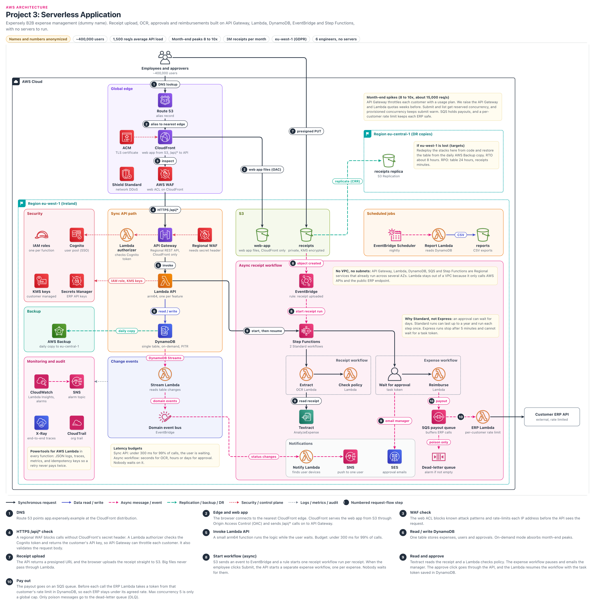

# Serverless Application

> **Confidentiality note:** Company names, domain names, IDs and all numbers in this document are dummy values. The architecture, the decisions and the trade-offs are what this document shares.
>
> Key figures (dummy values): about 400,000 users, 1,500 API req/s on average, 8 to 10 times more at month-end (about 15,000 req/s), 3M receipts per month, eu-west-1 (GDPR), 6 engineers, no servers.
>
> AWS limits and prices change over time (the information here is as of September 2026), so treat them as approximate.

## Architecture diagram

### How to read the diagram
- **Center, top to bottom (Sync API path):** the path where users wait for an answer. Users → Route 53 → CloudFront → WAF → API Gateway → Lambda API → DynamoDB (steps 1 to 6).
  - To the left of API Gateway is the Lambda authorizer (its arrow goes to Cognito in the left Security panel). To the right is the Regional WAF (secret header check).
  - Below it is the "Change events" panel: DynamoDB Streams → Stream Lambda → Domain event bus.
- **Numbers in black circles (1 to 10):** each step of the request. Section 4 uses the same numbers. When the same number appears on two or three arrows (for example 2, 8, 9, 10), all of them are parts of that one step. Arrow colors: black = sync request, blue = data read/write, pink dashed = async event, green = backup, red dotted = security, grey = logs.
- **Steps 7 to 10 (right side):** step 7 is the long line that goes from the users at the top straight to the S3 `receipts` bucket (not through the API). Steps 8 to 10 are in the pink panel: EventBridge, Step Functions, Textract, SQS payout queue, ERP Lambda, DLQ.
  - Below Step Functions are two dashed boxes: Receipt workflow (Extract → Check policy) and Expense workflow (Wait for approval → Reimburse).
  - Below that is the Notifications panel: Domain event bus → Notify Lambda → SNS (push to one user's phone), SES.
- **Side panels:** Security, Backup and Monitoring on the left. Scheduled jobs on the right (Scheduler → Report Lambda → `reports`).
  - In the top right corner is the "eu-central-1 (DR copies)" box: the `receipts` replica and a DR targets note.
  - The yellow notes cover month-end, "No VPC", Standard vs Express, latency budgets and DR.
- **Not shown in the diagram (details are in the text):**
  - The DynamoDB token bucket and circuit breaker used by the ERP Lambda (step 10, section 5A).
  - CodeDeploy canary deploys (section 6) and the Cognito replica (section 9).
  - There is no arrow to the AWS Backup vault in eu-central-1. The DynamoDB "daily copy" arrow only goes to the left Backup panel; the vault is mentioned in the DR box note.

## 1. Project name
- **Expensely Expense Platform:** a B2B expense-management SaaS built fully serverless.
- **B2B SaaS:** software that companies use over the internet for a monthly subscription.
- In one line: employees upload a receipt photo, OCR fills in the details automatically, and when the manager approves, the payout goes into the customer's ERP. All of this without running a single server.
- **OCR:** a computer reading the letters in a photo as text. **ERP:** the large software that runs a customer company's accounts and payments (SAP, NetSuite).
- **What serverless means:** servers still exist, but AWS takes care of them. We do not think about patching, capacity or AZ placement. We pay only for what we use.

## 2. Business problem

### Who is the company?
- Expensely is a B2B SaaS company. About 1,800 customer companies (tenants) in Europe use it.
- **Two kinds of users:** employees (who submit expenses) and approvers/managers (who approve or reject). About 400,000 users in total.
- **Main jobs:** receipt upload, pulling amount/tax/merchant with OCR, company policy check, approval workflow, and sending the reimbursement into the customer ERP (such as SAP or NetSuite).
- All data must stay inside the EU (GDPR: the EU law that protects the personal data of people in the EU), so the primary region is eu-west-1 (Ireland).

### A short story (how it was before)
- Ravi, a sales employee, types 20 receipts by hand at the end of the month. Everyone submits on the same day, and the old VMs say "try again".
- When the manager, Priya, is on holiday, the approval waits 5 days. Then all the payouts go to the ERP at once, the ERP returns 429 and stops.
- A large customer said: "Give us a SOC 2 report, data only in the EU, and proof of encryption, or we will not renew." That is why we rebuilt.
- In the new system: Ravi uploads a photo, the fields fill in within seconds, Priya gets an email, and as soon as she approves, the payout goes to the ERP at a safe speed.

### What were the problems?
1. **Month-end rush:** in the last 2 to 3 days of the month, everyone submits expenses at the same time. Traffic is 8 to 10 times the average. The old setup (a few VMs) became slow at that time and sat idle for the rest of the month.
2. **Manual data entry:** 3M receipts per month. Employees typed the amount, tax and date by hand. There were many mistakes, and the finance team had to check again.
3. **Customer ERPs are fragile:** some customer ERPs accept only a few calls per second. If the month-end burst is sent directly, the ERP returns 429 (too many requests) or goes down.
4. **Approval can take many days:** if a manager is on holiday, approval can take 5 days. During that time, the state of the expense must never be lost.

### Constraints
- **Small team:** only 6 engineers. No dedicated ops/SRE team. No interest in running servers, Kubernetes or patching.
- **GDPR:** personal data, receipts and backups all stay in EU regions (eu-west-1 primary, eu-central-1 backup copy).
- **Security reviews:** enterprise customers ask for a SOC 2 report, encryption and audit logs.

### What did the company need?
| Need | Target | In simple words |
|---|---|---|
| API availability | 99.9% (per month) | only about 43 minutes of errors/downtime allowed per month |
| Sync API speed | 99% of calls under 300 ms (p99) | when the user presses a button, the answer must come right away |
| Receipt OCR | most receipts in a few seconds, p99 under 60 s | fields should fill in shortly after upload, the user does not wait |
| Peak load | 1,500 req/s on average, 12,000 to 15,000 req/s at month-end | must handle 8 to 10 times the traffic at month-end |
| Receipts volume | 3M per month | about 100,000 per day, much more at month-end |
| ERP safety | only a safe rate for each ERP | never overload a customer ERP |
| RTO (if a region is lost) | about 8 hours | if all of eu-west-1 is lost, the time to be working again in eu-central-1 |
| RPO (if a region is lost) | DynamoDB: 24 hours + copy time. Receipts: minutes | the table copy is daily, so the last day of data can be lost (the business accepted this). With replication, receipts are almost never lost |
| RPO (data corruption) | seconds | with PITR, the table can be restored to any second |
| Security | per-function IAM, KMS CMKs, audit logs | each function gets only the permission it needs, every action is recorded |
| Data residency | EU only (GDPR) | data and backups must not leave EU regions |

### Why this architecture?
- **Serverless fits spiky traffic:** Lambda (runs our code without servers), API Gateway (the managed front door for APIs) and DynamoDB on-demand (a managed database that bills per request) scale only when requests come in. There is no need to buy servers for month-end and keep them idle.
- **Less ops work for a team of 6:** no OS patching, AMIs, cluster upgrades, NAT Gateways or subnets. Engineers spend their time on features.
- **Most of this work is async:** OCR, approval and payout are not tasks the user has to wait for. We separated them with EventBridge (an event router), Step Functions (a workflow engine) and SQS (a message queue), so the API always stays fast.
- **Multi-AZ comes for free:** all these regional services run across many AZs (Availability Zones, separate data centers in a region) by default. We do not have to design for AZs.
- **Honest trade-off:** at a steady 1,500 req/s, the pure infrastructure bill could be lower with containers (Fargate, which runs containers without managing servers). But looking at team size, spikes and security surface, we accepted paying a bit more for serverless (the calculation is in section 5A).

## 3. Architecture overview

### Internet and DNS
- Users open `app.expensely.example` from a browser or the mobile app.
- **Route 53:** the AWS DNS service. It turns a name into an IP/target. Here an alias record points to the CloudFront distribution.
- There is no query charge for an alias record, and if the CloudFront IPs change, we do not have to change anything.

### Edge (Global edge)
- **CloudFront:** the AWS CDN, meaning a service that serves content from edge locations close to users.
- It fetches the web app files (HTML, JS, CSS) from S3 and caches them at the edge. It sends `/api/*` calls to API Gateway.
- The web app and the API are on the same domain, so no CORS setup is needed (CORS: the permission rules a browser asks for when a page on one domain calls an API on a different domain).
- **AWS WAF:** a web application firewall. A web ACL (a set of rules) on CloudFront: AWS managed rules that stop SQL injection, bad inputs and bad IPs, plus a rate limit per IP.
- **ACM:** free TLS certificates. For CloudFront, the certificate must be issued in us-east-1 (a CloudFront rule), and it renews automatically.
- **Shield Standard:** network-level DDoS protection that comes free with CloudFront and Route 53.

### Network (no VPC, and why)
- This design has **no VPC, subnets, NAT Gateway or Security Groups.** This is a deliberate decision.
- Our functions only call AWS APIs (DynamoDB, S3, Textract) and the public ERP HTTPS endpoint. There is no private database or on-prem system, so a VPC is not needed.
- **When we would put Lambda in a VPC:** for private resources such as RDS or ElastiCache, for on-prem, or if a customer ERP asks for our static IP (details in Q10 and section 7). Then NAT cost, IP planning and endpoints become our job.

### Application (Sync API)
- **API Gateway:** the managed API front door (regional REST API): token check, validation, per-customer throttling.
- **Cognito:** the user sign-in service. After login with the customer's SSO, it issues a JWT (a signed token that contains the user id and tenant id).
- **Lambda authorizer:** a small function that verifies the JWT and returns the tenant's API key (details in step 4).
- **Lambda API:** one arm64 function per feature, built with **Powertools for AWS Lambda** (JSON logs, traces, metrics, idempotency).

### Data
- **DynamoDB:** the AWS NoSQL key-value database. Users, expenses, approvals and tenant config are all in one table (single-table design). On-demand mode, with PITR (restore within 35 days) turned on.
- **DynamoDB Streams:** an ordered log that keeps every change (insert/update/delete) in the table for 24 hours. The Stream Lambda reads it.
- **Three S3 buckets:** `web-app` (app files, only CloudFront can read it), `receipts` (private, KMS encrypted, upload with presigned URLs) and `reports` (nightly CSV exports).

### Messaging (Async workflow)
- **EventBridge (default bus rule):** when an S3 "Object Created" event arrives, a rule starts the receipt workflow.
- **Step Functions (Standard):** the workflow engine. Two state machines: the receipt workflow (Extract → Check policy) and the expense workflow (Wait for approval → Reimburse). It handles retries and state by itself.
- **Textract:** the AWS OCR service. The AnalyzeExpense API pulls the total, tax and merchant from a receipt.
- **SQS payout queue + DLQ:** buffers the ERP calls. Only bad (poison) messages go to the DLQ (dead-letter queue).

### Events and notifications
- **Domain event bus (EventBridge custom bus):** business events such as ExpenseApproved and ExpensePaid. Other features subscribe with rules.
- **Notify Lambda → SNS, SES:** SNS sends a push to one employee's phone ("expense paid"), and SES sends the approval email to the manager.
- **EventBridge Scheduler:** runs the nightly report job in each customer's time zone.

### Security
- **IAM roles, one per function:** only its own table actions, its own bucket prefix, its own queue and its own secret.
- **KMS customer managed keys:** encryption for DynamoDB, S3, SQS and SNS. The key policy decides which role can use the key.
- **Secrets Manager:** the ERP API key of each customer. The ERP Lambda reads it with Powertools Parameters and caches it for about 5 minutes (see section 7).
- WAF + Shield at the edge. At the API: the Lambda authorizer (Cognito JWT) + the CloudFront secret header check (section 7).

### Monitoring
- **CloudWatch:** logs and metrics of all functions in one place. Lambda Insights shows memory, CPU and cold starts. Alarms fire on errors, throttles, queue delay, messages in the DLQ, and a slow API.
- **SNS alarm topic:** sends alarms to the on-call engineer and to the team chat channel.
- **X-Ray:** shows where a request spent its time between API Gateway → Lambda → DynamoDB → Step Functions.
- **CloudTrail (org trail):** records every AWS API call (who changed a function, who read a secret) in the log archive account.

### DR (Disaster Recovery)
- **DynamoDB PITR:** restore to any second in the last 35 days.
- **AWS Backup:** a daily DynamoDB copy to eu-central-1 (Frankfurt). If the whole region is lost, we restore there (backup and restore DR strategy).
- **Receipts:** copied to eu-central-1 with S3 Replication (CRR). Receipts are tax records and must not be lost.
- All infrastructure is in code (AWS SAM/CDK), so the stacks can be deployed again in a new region.

## 4. Request flow
- **Sync path (the user waits):** `User → Route 53 → CloudFront → WAF → API Gateway (Lambda authorizer, Cognito JWT) → Lambda → DynamoDB`
- **Async path (nobody waits):** `Browser → S3 receipts (presigned upload) → EventBridge → Receipt workflow (Textract, Check policy) → Expense workflow (Wait for approval, SES → Reimburse) → SQS → ERP Lambda → Customer ERP`
- The step numbers below match the numbered badges in the diagram exactly.

### Step 1: DNS (Route 53)
- The browser sends a DNS query for `app.expensely.example`.
- The Route 53 alias record returns the CloudFront distribution name, and the nearest edge IPs come back.
- Most of the time the DNS answer is already in the browser/resolver cache. Time: about 0 to 20 ms.

### Step 2: Edge and web app (CloudFront + S3 OAC)
- The browser opens an HTTPS connection (port 443, TLS 1.2 or higher) with the nearest CloudFront edge. The ACM certificate is used here.
- The web app files come from the `web-app` bucket. **OAC (Origin Access Control):** the bucket policy gives read access only to this one distribution, and the bucket is not public.
- App files are cached for a long time (file names contain a hash), and the `index` HTML entry page has a short TTL.
- `/api/*` behavior: `CachingDisabled` cache policy, so personal data is not stored at the edge. Origin request policy `AllViewerExceptHostHeader`: if the viewer's `Host` header is sent to API Gateway, it returns 403, but the `Authorization` header must still reach the origin.

### Step 3: WAF check (AWS WAF)
- The web ACL on CloudFront checks every request before it goes to API Gateway.
- AWS managed rules (Core rule set, Known bad inputs, IP reputation) block attacks.
- There is a per-IP rate-based rule. Thousands of B2B users sit behind the same office NAT IP, so we set this limit a bit higher. The per-customer limit is done in API Gateway.
- Time: from under about 1 ms to a few ms.

### Step 4: HTTPS /api/* check (API Gateway, Lambda authorizer)
- Calls without the CloudFront secret header are blocked right at the API, so nobody can skip the edge (section 7).
- **Lambda authorizer (REQUEST type):** verifies the Cognito JWT signature and expiry with the Cognito public keys. In the diagram, this is the Lambda authorizer node on the left of API Gateway and its arrow to Cognito.
  - Along with an Allow policy, it returns the API key of the tenant in the token as `usageIdentifierKey` (API key source = AUTHORIZER).
  - The result is cached, for example for 300 s (key = the `Authorization` header), so Lambda does not run on every call.
  - The tenant id comes in the ID token as a custom attribute. If it is needed in the access token, use the pre token generation trigger V2 (Essentials/Plus tier).
- **Throttling:** usage plans identify the customer only by the API key. One usage plan (for example 500 req/s, burst 1,000) holds 1,800 keys, and the limit applies to each key separately. Above it, the client gets 429 and retries with backoff.
- **Request validation:** the body is checked with a JSON schema, so a wrong request never reaches Lambda. Time: API Gateway overhead about 10 to 30 ms (another 20 to 50 ms if the authorizer cache misses).

### Step 5: Invoke (Lambda API)
- API Gateway invokes Lambda synchronously. The user waits for the response.
- The function runs on arm64 (Graviton). With Powertools, the request id and tenant id appear in every log line.
- The Lambda has one IAM role with only the DynamoDB actions that feature needs.
- **Latency budget:** 99% of calls under 300 ms. Warm function logic takes about 20 to 150 ms. A cold start takes about a few hundred ms (depending on runtime and package size), so busy functions get provisioned concurrency.
- The Lambda timeout is kept low on purpose (for example 6 s). The API Gateway integration timeout is 29 s by default, and the function must fail well before that.

### Step 6: Read / write (DynamoDB)
- Lambda calls DynamoDB over HTTPS with the AWS SDK (GetItem, Query, PutItem, TransactWriteItems).
- One table: an expense, its receipts and its approvals sit under the same partition key. One Query returns all the data for the expense screen.
- On-demand mode handles the month-end peak without capacity planning. Latency is usually single-digit ms.
- Every change that is written goes into DynamoDB Streams (see Other flows).

### Step 7: Receipt upload (S3 presigned URL)
- When the user presses "upload receipt", the API (steps 4 to 6) returns a **presigned URL**. This is a signed link that works for only a few minutes and allows uploading only one file (object key).
- The browser PUTs the receipt straight to the `receipts` bucket. Large files do not pass through Lambda (this avoids both the Lambda payload limit and the cost).
- Key format: `tenant/<tenantId>/expense/<expenseId>/<uuid>.jpg`. URL expiry is about 5 minutes. We sign Content-Length as well as Content-Type: the app tells the file size first, and if it is over 10 MB the API does not give a URL. (Another way: `content-length-range` in a presigned POST.)
- The bucket encrypts with SSE-KMS. The bucket policy denies requests that are not HTTPS.
- The upload goes straight to the S3 regional endpoint (not through CloudFront), so the `receipts` bucket has a CORS rule: PUT only, and only from our app domain.

### Step 8: Start workflow async (S3 → EventBridge → Step Functions)
- "Send notifications to EventBridge" is on for the bucket. An EventBridge rule filters by bucket and key prefix and starts the **receipt workflow**: one run per receipt (Extract → Check policy), finishing in minutes.
- The **expense workflow** is separate: one run per expense when the employee presses "Submit" (Wait for approval → Reimburse). Even if an expense has many receipts, the manager gets one email and there is one payout.
- **Duplicate starts:** S3 → EventBridge delivery is at-least-once, and the rule target does not give an execution name. So the first state of the workflow is a DynamoDB conditional put (`attribute_not_exists`, key = receipt id + S3 version id). If the item already exists, the run ends with Succeed right away, and there is no second Textract charge.
- If the target fails, EventBridge retries (up to 24 hours by default), then the rule DLQ. The user does not wait; the screen shows "processing".

### Step 9: Read and approve (Textract, Lambda, SES, task token)
- **Extract Lambda:** for a photo or a 1-page PDF (under 10 MB), it calls sync `AnalyzeExpense`. For a PDF with many pages, it calls async `StartExpenseAnalysis`: when it finishes, Textract tells SNS, and until then the workflow waits with a task token. Merchant, date, amount and tax are saved in DynamoDB.
- **Check policy Lambda:** checks company rules (spending limit, allowed categories, duplicate receipt).
- **Wait for approval (expense workflow):** the workflow pauses with a **task token**. The token is saved on the DynamoDB approval item, and SES sends an email to the manager (the link contains only the expense id, not the token).
- When the manager logs in and presses approve, the click comes through the API → Lambda API. Lambda checks that the approver is the right person, does a conditional update on the approval item (PENDING → APPROVED), and calls `SendTaskSuccess` with the token saved in DynamoDB.
- Approval can take days. A Standard workflow has no charge while waiting (only for state transitions).

### Step 10: Pay out (SQS → ERP Lambda → Customer ERP)
- The **Reimburse Lambda** puts the payout (payout id derived from the expense id) on the SQS payout queue. The workflow is almost done at that point.
- **ERP Lambda:** the SQS trigger is an event source mapping (ESM: a connector where the Lambda service itself polls the queue and hands messages to the function in batches). Its maximum concurrency of 5 means "5 calls at the same time", not "5 per second", and that is across all customers combined.
- That is why each ERP gets its own limit:
  - A DynamoDB token bucket (a bucket that refills with a few tokens every second, and an ERP call happens only if a token is available; for example 2 calls per second per tenant).
  - ERP HTTP timeout of 5 s.
  - A tenant circuit breaker (a switch that stops calls for a while when the ERP keeps failing). The full design is in section 5A.
- **So that money is never sent twice:** a retry is safe only if the ERP supports an idempotency key (payout id). If it does not, we look up the payout id in the ERP before the call (check-then-post) and use a conditional write on the expense status (APPROVED → PAYING → PAID). Time: minutes.

### Other flows
- **Change events:** DynamoDB Streams → Stream Lambda → Domain event bus (EventBridge custom bus). Events such as ExpenseApproved and ExpensePaid come out.
- **Notification:** rule "status changes" → Notify Lambda. It reads that one user's device endpoint ARNs from DynamoDB and calls SNS `Publish(TargetArn)`. Publishing to a topic would reach all subscribers (a privacy incident), and topic filter policies are only 200 by default, which is not enough for 400,000 users.
- **Why from Streams:** if the API Lambda writes to the DB and then publishes the event separately, one can succeed while the other fails. This is the "dual write" problem. With Streams, every change that is written always produces an event.
- **Scheduled jobs:** EventBridge Scheduler (nightly, by customer time zone) → Report Lambda (reads DynamoDB) → CSV in the `reports` bucket. Customers download it with a presigned URL.
- **Telemetry:** logs and metrics of all functions go to CloudWatch, and traces go to X-Ray. When an alarm state changes, SNS alarm topic → on-call.
- **Backup:** DynamoDB → AWS Backup daily copy to eu-central-1. `receipts` → S3 Replication to eu-central-1. CloudTrail sends all API calls to the log archive account.

## 5. Why each AWS service

### Amazon Route 53
**What it is:** the AWS managed DNS service.

**Why we used it:** to connect `app.expensely.example` to CloudFront with an alias record.

**Problem it solves:** if the CloudFront IPs change, we do not have to change anything, and alias queries are free.

**Alternatives:** Cloudflare DNS, the old DNS provider.

**Why not the alternative:** alias records and IaC are easy when everything is in one place in AWS.

### Amazon CloudFront
**What it is:** the AWS CDN. It serves content from edge locations and reuses connections to the origin.

**Why we used it:** to cache and serve the web app files from S3, to send `/api/*` to API Gateway, and to attach WAF right at the edge.

**Problem it solves:** one domain (no CORS). The HTTPS connection is set up at the edge near the user, so the page loads fast even for users far away. Attacks stop before they reach the region.

**Alternatives:** an API Gateway edge-optimized endpoint (it has a CloudFront distribution managed by AWS), or S3 website hosting directly.

**Why not the alternative:** with an edge-optimized endpoint, cache behaviors, our WAF rules, and combining the web app + API on one domain are not in our control. The S3 website endpoint does not offer HTTPS, and the bucket must be public.

### AWS WAF
**What it is:** a web application firewall that checks HTTP requests against rules.

**Why we used it:** two web ACLs. On CloudFront: managed rules, IP reputation, per-IP rate limit. On API Gateway, a regional ACL: drops calls without the CloudFront secret header.

**Problem it solves:** attacks such as SQL injection, bad bots and credential stuffing never reach Lambda. It stops the bypass of hitting the API directly.

**Alternatives:** checking the secret header inside our Lambda authorizer and removing the regional WAF, or a third-party WAF (Cloudflare, Akamai).

**Why not the alternative:**
- The authorizer result is cached (300 s by default), and if the header is missing, API Gateway returns 401 without calling Lambda. So "cost per call" is not the reason.
- The real reason: if an attacker sends many different fake header values, each one is a cache miss, and Lambda runs for each one. WAF stops that at a flat per-request rate.
- Trade-off: removing the regional WAF would save about $2,300 per month. We did not accept that risk. A third-party WAF means another vendor and another bill.

### AWS Certificate Manager (ACM)
**What it is:** a service that issues free public TLS certificates and renews them automatically.

**Why we used it:** the `app.expensely.example` certificate for CloudFront (for CloudFront it must be in us-east-1).

**Problem it solves:** it fully avoids certificate expiry outages (which are very common).

**Alternatives:** Let's Encrypt, importing a commercial certificate.

**Why not the alternative:** imported certificates do not renew automatically. With ACM DNS validation, renewal happens by itself.

### AWS Shield Standard
**What it is:** always-on protection against network and transport layer (L3/L4) DDoS attacks.

**Why we used it:** it comes at no extra cost when we use CloudFront and Route 53.

**Problem it solves:** network attacks such as SYN floods stop at the edge. For HTTP floods, we use WAF rate rules.

**Alternatives:** Shield Advanced (DDoS response team, cost protection).

**Why not the alternative:** about $3,000 per month + data fees, with a one-year commitment. If large DDoS attacks start coming often, we will think about it again.

### Amazon S3
**What it is:** object storage. It keeps files with very high durability, in at least 3 AZs.

**Why we used it:** three buckets: `web-app` (SPA files; an SPA is a JavaScript app that loads once in the browser and after that only makes API calls), `receipts` (photos, PDFs) and `reports` (CSV exports). The receipt upload event starts the workflow.

**Problem it solves:** large files do not go through the API (presigned URLs). With lifecycle rules, old receipts move to cheaper storage and can be kept for years for tax purposes.

**Alternatives:** EFS, storing receipts as binary in DynamoDB.

**Why not the alternative:** EFS needs a VPC and mount targets, and we do not need file system semantics. A DynamoDB item is 400 KB max, and large binaries there are very expensive.

### Amazon Cognito
**What it is:** a managed identity service (user pool) that handles user sign-in and issues tokens.

**Why we used it:** we federated each customer company's SSO (SAML or OIDC, for example Entra ID or Okta) into the user pool. Our Lambda authorizer verifies that JWT (with a library such as `aws-jwt-verify`, caching the Cognito public keys).
- Why not the built-in Cognito authorizer: the usage plan needs an API key, and with the Cognito authorizer the key must be sent from the browser in the `x-api-key` header. Then every user can see it and copy it.

**Problem it solves:** we do not store passwords. Employees come in with their own company login. The token has a tenant id claim, and that is the base of tenant isolation.

**Alternatives:** Auth0, Okta Customer Identity, our own auth service.

**Why not the alternative:** a third-party IdP is another vendor, another data residency review and a per-user cost. Our own auth is a security risk. Cognito is not cheap either: for SAML/OIDC federated users it is about $0.015 per MAU in all tiers, so the bill depends on the number of MAUs, not on the tier.

### Amazon API Gateway
**What it is:** a managed API front door. Auth, validation, throttling and routing all in one place.

**Why we used it:** a regional REST API. Lambda authorizer (API key source = AUTHORIZER), JSON schema request validation, per-customer usage plans, and a regional WAF attached. All of these are available in the REST API.

**Problem it solves:** we do not have to write auth, validation and throttle logic again in every Lambda. Bad requests stop before they reach Lambda.

**Alternatives:** HTTP API (cheaper, faster), ALB + Lambda target, Lambda function URLs.

**Why not the alternative:**
- HTTP API: WAF cannot be attached directly, and there are no usage plans or request validation.
- ALB + Lambda: needs a VPC, and there is no per-customer throttling.
- Function URLs: no authorizer and no throttling.
- Cost: REST is about $3.50 per million (lower in higher tiers), HTTP API about $1.00. We pay more for these features.

### AWS Lambda
**What it is:** compute that runs code only when an event arrives. Charged per millisecond, no cost when idle.

**Why we used it:** API functions (one per feature), plus the Authorizer, Stream, Notify, Report, Extract, Check policy, Reimburse and ERP functions. All on arm64, with Powertools.

**Problem it solves:** no capacity planning for the 10x month-end burst, no patching, and each function has its own IAM role, its own scaling and its own alarms.

**Alternatives:** ECS on Fargate, EKS, EC2 Auto Scaling.

**Why not the alternative:** for a team of 6, managing a VPC, ALB, images and task scaling is a burden. Under steady load the Fargate bill could be lower, but looking at ops cost and spikes, Lambda is better (the calculation is in section 5A).

### Amazon DynamoDB (and DynamoDB Streams)
**What it is:** a fully managed NoSQL key-value database, with no servers or connections to manage. Data is kept as 3 copies in 3 AZs. A write returns success once it is durable in 2 of the 3 copies (quorum). That is why the default read is eventually consistent, and a strongly consistent read comes from the leader copy.

**Why we used it:** single-table design, on-demand capacity, PITR. With Streams, every change becomes a domain event.

**Problem it solves:** even with thousands of concurrent calls from Lambda, there is no connection pool problem (because it is an HTTPS API). No VPC is needed. No capacity planning for the month-end peak.

**Alternatives:** Aurora Serverless v2 (PostgreSQL) with the Data API, or Aurora DSQL (serverless distributed SQL that became GA in 2025, with IAM auth and no instances).

**Why not the alternative:**
- "Aurora requires a VPC and RDS Proxy" is no longer true: with the Data API, Lambda can send SQL over HTTPS.
- The real reason: the access patterns are known in advance (get by key, list), and there are no joins. Single-digit ms at 15,000 req/s, with on-demand scaling. The Data API has its own quotas and extra latency.
- DSQL is new, and its eu-west-1 availability and features need to be checked. For ad-hoc reports, we use DynamoDB export to S3.

### Amazon EventBridge (event buses and rules)
**What it is:** a serverless event router. It matches events with rules and sends them to targets.

**Why we used it:** default bus: S3 "Object Created" → receipt workflow. Custom domain bus: ExpenseApproved, ExpensePaid → Notify Lambda (SNS) and other features.

**Problem it solves:** features do not call each other directly (loose coupling). A new consumer only needs a new rule; we do not change the publisher code.

**Alternatives:** S3 event notifications directly to Lambda, SNS topics, EventBridge Pipes (from Streams to the bus without code).

**Why not the alternative:** an S3 notification allows only one destination per prefix and has little content filtering. SNS standard topics have no archive or replay (SNS FIFO topics have them, but with lower throughput), and there is no schema registry. Pipes would have worked, but we wanted to write the event business logic (which change becomes which event) in Lambda.

### Amazon EventBridge Scheduler
**What it is:** a managed, cron-like scheduler. One-time or recurring schedules, with time zones.

**Why we used it:** to run the nightly spend report in each customer's time zone.

**Problem it solves:** no cron server. Scheduler handles time zones and daylight saving. It stays simple even with many schedules.

**Alternatives:** the older EventBridge scheduled rules, cron on EC2.

**Why not the alternative:** scheduled rules are UTC only and allow fewer schedules. EC2 cron means running a server, which does not fit our "no servers" rule.

### AWS Step Functions
**What it is:** a workflow engine. It runs steps in order and handles retries, timeouts, branching and state by itself.

**Why we used it:** two Standard state machines. The receipt workflow (one run per receipt): Extract → Check policy, finishing in minutes. The expense workflow (one run per expense): Wait for approval (a single task token) → Reimburse, which can take days.
- If everything were in one workflow, an expense with 5 receipts would risk 5 approval emails and 5 payouts. Open executions would also grow a lot (default quota of 1,000,000 per account + region).

**Problem it solves:** retry with backoff and error handling live in the state machine definition, not in code. The console shows which step each receipt is in. Lambda does not have to sit idle during a human wait.

**Alternatives:** Step Functions Express, chaining Lambdas to each other with SQS, or our own state machine with a status field in DynamoDB.

**Why not the alternative:** Express runs for only 5 minutes and does not support task token callbacks. In our own chain, we would have to write retries, timeouts and "where did it stop" visibility ourselves, and there would be more bugs.

### Amazon Textract
**What it is:** a managed OCR/ML service that pulls text and fields out of documents. The AnalyzeExpense API is made specially for receipts and invoices.

**Why we used it:** to pull merchant, date, total and tax from a receipt automatically, so employees do not have to type them.

**Problem it solves:** manual entry of 3M receipts per month is gone. We ask the user to check only when the confidence score is low.

**Alternatives:** a multimodal model in Bedrock, a third-party OCR API, our own ML model (SageMaker).

**Why not the alternative:**
- Third-party means the risk of data leaving the EU and another DPA. We have no ML team for our own model.
- AnalyzeExpense has structured output and known pricing. Note: Textract is the biggest cost in this architecture.
- **Limits:** Textract reads only English, French, German, Italian, Portuguese and Spanish. Accuracy is lower for Dutch and Polish receipts; there the fallback is a Bedrock multimodal model or manual entry.
- **GDPR:** we set an AI services opt-out policy in AWS Organizations, so AWS does not use our receipts for service improvement.

### Amazon SQS
**What it is:** a fully managed message queue. It keeps messages safe until a consumer takes them (at-least-once delivery).

**Why we used it:** the payout queue (fair queues, customer id = message group) + DLQ (poison messages only).

**Problem it solves:** the month-end burst waits in the queue, not at the ERP. But the rate limit for the ERP comes from the per-tenant token bucket, not from the queue alone (section 5A).

**Alternatives:** Lambda directly from an EventBridge rule, EventBridge API destinations, SQS FIFO.

**Why not the alternative:**
- EventBridge is a push model, so we cannot control the consumer's speed. API destinations have a rate limit, but a 5 s response timeout and no per-message backoff.
- In FIFO, if one payout fails in a message group (tenant), all later messages in that group stop (head-of-line blocking). We do not need ordering, and a standard queue + fair queues is enough for fairness.

### Amazon SNS
**What it is:** a pub/sub notification service. It sends one message to many subscribers (mobile push, email, HTTPS, SQS).

**Why we used it:** mobile push: the Notify Lambda publishes directly to each user's device platform endpoint (`TargetArn`), not to a topic. Also the CloudWatch alarm topic, to on-call.

**Problem it solves:** we do not have to talk directly to the iOS and Android push services (APNs, FCM). Alarms go from one topic to many places.

**Alternatives:** Firebase directly, a third-party push service, Pinpoint.

**Why not the alternative:** AWS announced end of support for Pinpoint engagement features, so we did not use it. A third party is another vendor. SNS fits the rest of our setup with KMS encryption and IAM.

### Amazon SES
**What it is:** a managed email service for sending transactional emails.

**Why we used it:** emails to managers with approve/reject links, and payment confirmations to employees.

**Problem it solves:** no mail server. With DKIM, SPF and DMARC, emails do not go to spam. The sending rate quota must be raised in advance for the month-end burst.

**Alternatives:** SendGrid, Mailgun, SNS email subscription.

**Why not the alternative:** a third party means an EU data review. SNS email has no templates, and each subscription must be confirmed.

### AWS IAM
**What it is:** the service that decides who (a human or a service) can do which action on which resource in AWS.

**Why we used it:** each Lambda has its own role (for example, the Extract function gets only `receipts` bucket read, Textract, and its own table items). Humans use SSO through IAM Identity Center, and there are no IAM users.

**Problem it solves:** even if one function is hacked, the blast radius (how far the damage spreads) is small. There are no long-lived access keys anywhere.

**Alternatives:** one shared role for all functions.

**Why not the alternative:** a shared role means even the report function could read ERP secrets. There is no least privilege, and it would not pass an audit.

### AWS KMS
**What it is:** the service that creates and protects encryption keys. A key never leaves KMS in plaintext.

**Why we used it:** customer managed keys (CMKs): table, buckets, queues, topics (details in section 7).

**Problem it solves:** with the key policy, we decide which role can decrypt, and every decrypt is in CloudTrail. This is the "key control" proof that enterprise customers ask for.

**Alternatives:** AWS owned keys (default encryption), SSE-S3.

**Why not the alternative:** with AWS owned keys, we cannot see the key policy or the usage audit. A CMK costs about $1 per key per month plus requests. With S3 Bucket Keys, we cut the KMS request cost a lot.

### AWS Secrets Manager
**What it is:** a service that stores passwords and API keys encrypted and can rotate them.

**Why we used it:** each customer's ERP API key, named `erp/<tenantId>` (details in section 7).

**Problem it solves:** keys are not in code or in env variables. If a customer changes its key, we update it without a deploy.

**Alternatives:** SSM Parameter Store SecureString.

**Why not the alternative:** Parameter Store is cheaper, but it has no built-in rotation and no cross-region replica secrets. Being able to replicate secrets to eu-central-1 for DR is important for us.

### AWS Backup
**What it is:** a service that manages backups for many AWS services with one plan. Cross-region and cross-account copies, vault lock.

**Why we used it:** a daily DynamoDB backup, copied to a vault in eu-central-1 (Frankfurt). With vault lock, nobody can delete the backups. For receipts, we use S3 Replication instead of AWS Backup (RPO of minutes, section 9).

**Problem it solves:** even if all of eu-west-1 is lost, or the table is lost because of ransomware or an admin mistake, there is a safe copy inside the EU.

**Alternatives:** DynamoDB global tables (eu-central-1 replica), DynamoDB on-demand backups + our own copy scripts.

**Why not the alternative:** global tables give an RPO of seconds, but the write cost almost doubles and we would have to run the whole stack in a second region. The business accepted an RPO of 24 hours. Our own scripts are a maintenance burden.

### Amazon CloudWatch
**What it is:** the AWS monitoring service. Metrics, logs, alarms and dashboards all in one place.

**Why we used it:** the JSON logs of every Lambda come here. Lambda Insights shows which function is short on memory or CPU (turned on only for busy functions, to save cost). Business numbers such as receipt count go through EMF (the metric is inside the JSON log line, and CloudWatch turns it into a metric).

**Problem it solves:** even without servers, we know right away which function is slow, which customer is being throttled, and how far behind the queue is.

**Alternatives:** Datadog, New Relic, Grafana stack.

**Why not the alternative:** third parties have per-function and per-host pricing and need an EU data review. CloudWatch gives metrics for all services natively. The log cost is large, so we control log level and retention tightly.

### AWS X-Ray
**What it is:** a distributed tracing service. It shows how much time a request spent in each service.

**Why we used it:** traces for API Gateway → Lambda → DynamoDB and Step Functions → Lambda → Textract. Lambda active tracing or OpenTelemetry (ADOT) sends the traces. Sampling keeps the cost under control.

**Problem it solves:** when "p99 went over 300 ms", we find out in minutes whether it is a cold start, DynamoDB or the ERP.

**Alternatives:** our own Jaeger/Tempo, a third-party APM.

**Why not the alternative:**
- Our own tracing backend means running servers.
- The X-Ray SDKs and daemon are in maintenance mode from 25 Feb 2026 (security fixes only). The X-Ray service keeps accepting traces.
- Powertools Tracer depends on the X-Ray SDK. So new code uses OpenTelemetry (ADOT), and there is a migration plan for old code.

### AWS CloudTrail
**What it is:** an audit service that records every API call in an AWS account (who, when, from where, what).

**Why we used it:** an organization trail to an S3 bucket in the log archive account (Object Lock: an S3 setting where even an admin cannot delete a file until a set period ends). S3 data events are also on for the `receipts` bucket (who read a receipt).

**Problem it solves:** it answers audit and security investigation questions such as "who changed this function code" and "who read this secret".

**Alternatives:** application logs only, a third-party SIEM directly.

**Why not the alternative:** app logs do not contain AWS control plane changes. If a SIEM is needed, we feed it from CloudTrail; CloudTrail is the source of truth.

### Key decisions
| Decision | Chosen | Rejected | Why |
|---|---|---|---|
| Compute | Lambda (arm64) | ECS on Fargate | team of 6, 10x spikes, no patching. Fargate may be cheaper under steady load; if the API bill grows, we will look again at moving hot read paths to Fargate |
| Database | DynamoDB single table, on-demand | Aurora Serverless v2 (Data API), Aurora DSQL | access patterns known in advance, single-digit ms at peak, on-demand scaling. Ad-hoc SQL is hard, solved with export to S3 |
| API type, edge | CloudFront + regional REST API, Lambda authorizer | HTTP API, edge-optimized endpoint | WAF, usage plans (tenant API key from the authorizer) and validation exist only in REST. Our own cache behaviors, one domain. About 3 times more expensive |
| Workflow | Step Functions Standard, separate receipt + expense workflows | Express, a single workflow | approval takes days, task token needed. One approval and one payout per expense |
| ERP calls | SQS + per-tenant token bucket + circuit breaker | directly from EventBridge, API destinations | pull model, a different rate for each ERP. During an ERP outage, messages stay in the queue, not in the DLQ |
| Network | Lambda outside a VPC | Lambda inside a VPC | no private resources. Avoided NAT Gateway cost and IP planning. If an ERP asks for a static IP, only the ERP Lambda goes into a VPC |
| Receipt upload | directly to S3 with a presigned URL | upload through Lambda | avoids the 10 MB API Gateway payload limit, Lambda time and cost |
| DR | backup and restore (daily table copy, receipts replication) | global tables active-passive | the business accepted a table RPO of 24 hours. Avoided a second-region stack and double write cost |

## 5A. Key topics

### Synchronous vs asynchronous processing (sync vs async)
- **Sync:** the caller waits until the answer comes. **Async:** the caller takes "accepted" and leaves, and the work happens in the background.
- **Our rule:** if the user is waiting in front of the screen, it is sync. If the work can take more than 1 second, depends on an outside system, needs retries, or has to wait for a human, it is async.

| Path | Type | Latency budget | Why this way |
|---|---|---|---|
| Login, list expenses, submit expense, presigned URL | Sync | p99 under 300 ms | the user is waiting |
| Approve click (API → SendTaskSuccess) | Sync | p99 under 300 ms | the click must show "approved" right away, the workflow continues later |
| Receipt OCR (Textract) | Async | a few seconds, p99 under 60 s | Textract time varies and it can throttle |
| Manager approval | Async | hours to days | waiting for a human |
| ERP payout | Async | minutes | fragile outside system, rate limit |
| Notifications, domain events | Async | seconds | nobody should be blocked |
| Nightly reports | Async (batch) | at night | large read job, away from the peak |

- **How the user learns about async work:** a status in DynamoDB (UPLOADED → EXTRACTED → PENDING_APPROVAL → APPROVED → PAID). The app shows the status, and mobile gets an SNS push.
- **Remember the sync limits:** the API Gateway integration timeout is 29 s by default (for Regional REST APIs you can request an increase, but you may have to lower the throttle quota). If OCR were sync, both this 29 s limit and Lambda concurrency would become problems.
- **The cost of async:** at-least-once delivery brings duplicates, so every consumer is idempotent. Debugging is harder, so a correlation id (the expense id) is in every event and log.

### Lambda vs ECS/Fargate and the cost crossover point
- **Lambda bill:** requests + GB-seconds. Zero when idle. **Fargate bill:** every hour a task runs (vCPU + memory), whether it is used or not.
- **Rough calculation (list price):**

| Item | API Gateway REST + Lambda | ALB + Fargate (arm64) |
|---|---|---|
| Per million requests | about $3 to $4 (mostly API Gateway) | almost a fixed cost, very little per request |
| Minimum cost for HA | about $0 (idle) | 3 tasks in 3 AZs + ALB, about $500 to $700/month |
| Our volume (about 3.9B requests per month) | about $12,000/month | about $1,500 to $2,000/month (including NAT and ALB) |

- **Crossover:** about $600 fixed ÷ $3.5 per million = about 170M requests per month, which is about 65 req/s on average. Above that steady load, containers win on the raw bill.
- **We are far above the crossover, so why Lambda anyway:**
  1. Ops time: VPC, NAT, ALB, image patching, task scaling tuning. The bill difference is about $10,000 per month (about $120k per year), which is close to the fully-loaded cost of one senior engineer in Europe. So we must compare it with one engineer's ops work + spike risk + security surface, not with half an engineer.
  2. The 10x month-end spike: containers need scale-out lag handling, pre-scaling and over-provisioning.
  3. A smaller security surface: no OS, no network, per-function IAM.
- **Honest point:** most of the difference is not Lambda but API Gateway REST. If the bill starts to hurt, we first cut API calls (batching, fixing chatty screens), then look at moving the hottest read route (list expenses) to ALB + Fargate. The async side stays on Lambda + Step Functions.
- **Where Lambda does not fit:** jobs longer than 15 minutes, very high memory/GPU, long-lived connections (even though API Gateway WebSocket exists for WebSockets), steady high CPU.

### DynamoDB single-table design and access patterns
- **Idea:** first we write down the access patterns (the questions the app asks), then design the keys to fit them. Not like SQL, where tables come first and queries later.
- **Single table means:** different kinds of items (expense, receipt, approval, config) in one table, separated by PK/SK prefixes.

| Access pattern | Key design | Operation |
|---|---|---|
| Full screen for one expense (receipts, approvals, audit) | PK `T#t1#EXP#e123`, SK `#META`, `RCPT#r1`, `APPR#<ts>`, `AUDIT#<ts>` | a single Query |
| My expenses, newest first | GSI1: PK `T#t1#U#u9`, SK `<date>#e123` | Query, ScanIndexForward=false |
| Approver inbox (pending only) | GSI2: PK `T#t1#APPROVER#m5`, SK `<submittedAt>` (sparse) | Query |
| Tenant policy rules | PK `T#t1`, SK `POLICY#<category>` | Query begins_with |
| Nightly report (one tenant, one day) | GSI3: PK `T#t1#D#2026-09-24`, SK `e123` | Query |
| Stopping duplicate retries | PK `IDEMP#<hash>`, TTL 24 hours | Conditional put |

- **Sparse index:** we set the GSI2 attributes only while the expense is pending. When the attribute is removed after approval, the item disappears from the index. The inbox always stays small and cheap.
- **Tenant isolation:** every key starts with `T#<tenantId>`. We take the tenant id only from the token, never from the request body. For even stronger isolation, tenant-scoped credentials with the IAM `dynamodb:LeadingKeys` condition.
- **Watch out for hot partitions:** a partition has a limit of about 1,000 WCU / 3,000 RCU (WCU: one 1 KB write per second. RCU: one 4 KB strongly consistent read per second). If a very large tenant writes to a single key at month-end (for example the GSI3 day key), we use write sharding with a `#0` to `#9` suffix.
- **Consistency:** GSIs are eventually consistent. Right after submit, the item may not appear in "my expenses" yet (usually within a second), so the UI does an optimistic update (showing the new item on screen before the server confirms).
- **Trade-offs:** a new access pattern means a new GSI or a data migration. Ad-hoc analytics is hard, which is why we use DynamoDB export to S3 + Athena. There is a learning curve for new engineers.

### Handling month-end spikes
- **First, the math (Little's law):** concurrency = req/s × average duration. 15,000 req/s × 0.1 s = about 1,500 concurrent Lambda executions (sync only). Async functions come on top of this.
- **Plan by layer (numbers):**

| Layer | Default limit (approximate, depends on region) | What we do |
|---|---|---|
| API Gateway account throttle | 10,000 req/s steady, 5,000 burst | the peak is 15,000, so we raise the quota to 25,000 in advance |
| Per-customer throttle | set by us | usage plan, for example 500 req/s, burst 1,000, with the tenant API key from the authorizer. One customer's script cannot drown everyone |
| Lambda account concurrency | 1,000 | raise to 5,000 (request weeks in advance) |
| Lambda scaling speed | 1,000 every 10 s per function | provisioned concurrency before the burst |
| DynamoDB on-demand | 2 times the previous peak, instantly | set warm throughput before month-end, design without hot keys |
| Cognito auth requests | RPS quota per category | raise the quota for the login storm |

- **Reserved concurrency:** for example 1,000 for submit and 800 for list.
  - Guarantee: other functions, such as the report job, cannot eat this capacity.
  - Also a cap: this function does not grow beyond it.
  - AWS rule: at least 100 must stay unreserved in the account.
- **Provisioned concurrency:** for example 300 for submit, only in the last 3 days of the month from 7 am to 8 pm (CET), with an Application Auto Scaling scheduled action.
  - The first 300 concurrent requests have no cold starts. Above 300, the rest go to on-demand environments and get cold starts.
  - That is why we also add target tracking (`ProvisionedConcurrencyUtilization`, for example 70%) along with the scheduled action.
- **Clients:** on a 429, retry with exponential backoff + jitter. Submit has an idempotency key header, so a retry does not create a duplicate expense.
- **Async side:** the AnalyzeExpense default TPS is very low (about 1 to 5 depending on region). Month-end needs an average of 1.2/s × 10 = about 12/s, so a quota raise is a must. We also check Step Functions StartExecution, open executions and the SES sending rate. Even if a limit is exceeded, the user only sees a delay, thanks to workflow retries.
- **Rehearsal:** a 15,000 req/s load test in the staging account 2 weeks before month-end. Quotas, alarms and dashboards are all checked in that test.

### Protecting a fragile downstream
- **The problem:** a customer ERP accepts only a few calls per second. Lambda scales into the thousands. If we connect the two directly, it is as if we are doing a DDoS on the ERP ourselves.
- **Careful, max concurrency is not a rate:** ESM max concurrency of 5 means "5 calls at the same time", not "5 per second". If the ERP answers in 100 ms, about 50 calls per second can go to a single ERP.
- On top of that, the 5 is shared by all 1,800 customers. If one ERP keeps timing out at 30 s, those 5 slots are taken by it and everyone's payouts stop. Fair queues change only the delivery order, not the slots.
- **Visibility timeout (this term first):** after a consumer takes a message, it is hidden from others for a while. If it is not deleted within that time, it becomes visible again.
  - We set it to about 6 times the function timeout (AWS recommendation). Otherwise two copies of the same message are processed at the same time.
  - **Receive count:** SQS counts how many times a message has been received (`ApproximateReceiveCount`). When it passes maxReceiveCount, the message goes to the DLQ.
- **Layer 1, SQS buffer:** the Reimburse Lambda puts the payout on the queue and leaves. The burst waits in the queue, not at the ERP.
- **Layer 2, per-tenant rate limit:** one token bucket item per tenant in DynamoDB (conditional update, for example 2 calls per second, more if the ERP accepts it). No token, no ERP call.
- **Careful, receive count:** if we push a message back by "a few seconds" with `ChangeMessageVisibility` because there is no token, the count goes up on every receive.
  - 50,000 payouts at 2 per second take about 7 hours. In that time, even if the ERP is healthy, messages pass 15 receives and go to the DLQ.
- **That is why we delay-resend:** when there is no token, we send a new message with the same body and the same message group id with `DelaySeconds` (max 15 minutes), then delete the old one.
  - Since it is a new message, the receive count starts again from 0. If the send succeeds and the delete fails, there is a duplicate, and idempotency handles it.
  - We keep the count of real ERP failures in a message attribute (it also goes along with the resend). If the message is poison, the code sends it to the DLQ itself.
- **Another way:** reserve a future slot time on the payout item and set the visibility to that time (max 12 hours). Then each message goes back only about once.
- **Layer 3, global cap:** ESM max concurrency (5 in diagram step 10), with reserved concurrency set to the same number.
  - Now this is only a total throughput cap; ERP safety comes from Layer 2. Based on the month-end backlog, it can be raised, for example to 20.
  - ERP HTTP timeout is 5 s, so a hanging ERP does not hold the slots for long.
- **Why both the ESM cap and reserved concurrency:**
  1. With only reserved concurrency, the SQS poller brings more batches than that.
  2. Lambda cannot run more copies than that, so the other batches are throttled.
  3. A throttled message goes back to the queue, and its receive count goes up.
  4. Even with no problem at the ERP, the message goes to the DLQ after maxReceiveCount.
  5. With ESM max concurrency set, the poller does not bring more than that, so this problem never happens.
- **Layer 4, two kinds of errors:** transient (429, 5xx, timeout) are retried. Poison (4xx validation, wrong data) gain nothing from a retry, so the Lambda sends them straight to the DLQ and deletes them from the source.
- **Layer 5, tenant circuit breaker (a switch that stops calls for a while when the ERP keeps failing):** opens automatically in DynamoDB (for example 5 transient failures in 1 minute).
  - While it is open, that tenant's messages are pushed back with a large visibility delay (for example 15 minutes; the SQS max is 12 hours). After a while, one test call goes out, and if it succeeds, the circuit closes.
  - The receive count goes up on every receive. So when the count gets close to maxReceiveCount (or the outage goes past hours), the message is saved as "parked" in DynamoDB and deleted, and it goes back into the queue once the ERP is fixed.
- **Layer 6, backoff:** capped exponential backoff for real transient failures (30 s, 1 min, 2 min, ... up to 15 min), maxReceiveCount for example 15.
  - Here it is correct for the receive count to go up, because the ERP really is failing. If the outage lasts hours, the circuit (Layer 5) takes care of it.
  - With partial batch response (`ReportBatchItemFailures`), only the failed messages are retried.
- **Fairness:** SQS fair queues, message group id = customer id. Even if a large customer puts 50,000 payouts in, small customers' payouts do not fall behind.
- **The DLQ is only for poison messages:** so the "DLQ > 0" alarm shows only a real bug. An ERP outage has a different alarm: "tenant circuit open". After a fix, we replay with SQS redrive.
- **Idempotency:** SQS is at-least-once, so duplicates can come. The payout id goes to the ERP as the idempotency key, and the Powertools idempotency record is in DynamoDB. If the ERP does not support a key, we use check-then-post (section 4, step 10).
- **A large or strict tenant:** gets its own queue + its own ESM (ESM max concurrency at least 2).
- **Alternative we looked at:** EventBridge API destinations have an invocation rate limit per destination. But there is a 5 s response timeout, no per-message backoff, and we would have to manage 1,800 destinations. That is why SQS + Lambda.

### Step Functions Standard vs Express
| Item | Standard (what we used) | Express |
|---|---|---|
| Maximum duration | 1 year | 5 minutes |
| Execution semantics | exactly-once steps inside a run (repeated only if you set a retry). If the start event is duplicated, a second run can happen | at-least-once (async) / at-most-once (sync) |
| Task token callback (`.waitForTaskToken`) | yes | no |
| Pricing | per state transition (about $0.025 per 1,000) | requests + duration + memory |
| History | 90 days of visual history in the console | only in CloudWatch Logs |
| Start rate | lower quota | very high (thousands per second) |

- **Why Standard for us:** days of waiting for approval, task tokens, money steps like payout must run only once, and the support team needs the history of every receipt.
- **Duplicate starts:** the "exactly-once" guarantee does not cover the start event. That is why the first state is a conditional put (step 8). Another way: EventBridge → SQS → a small Lambda → `StartExecution` with name = receipt id. In Standard, a second start with the same name does not create a new run for up to 90 days (`ExecutionAlreadyExists` or the same run).
- **Open executions:** expense workflows stay open for days. The default quota is 1,000,000 per account + region (can be raised), with a 70% alarm on `OpenExecutionCount`.
- **Cost:** receipt and expense workflows together make about 30M transitions per month, about $750.
- **Where we would use Express:** high-volume, short, idempotent work. For example, enrichment after every API call in the future, or OCR sub-steps as a child workflow inside Standard.

## 6. High availability

### Multi-AZ (if one AZ is lost)
- API Gateway, Lambda, DynamoDB (3 copies in 3 AZs, quorum writes), SQS, SNS, EventBridge, Step Functions and S3 are all regional services. If one AZ is lost, AWS moves traffic to the other AZs. We do no subnet or AZ config.
- **Global layer:** Route 53 (100% availability SLA) and CloudFront edges. If one edge is lost, DNS sends users to another nearby edge.

### Scaling and load balancing
- **No Auto Scaling needed:** Lambda scales with requests, and DynamoDB is on-demand. Functions are stateless (state is in DynamoDB), so any copy can take any request. What we watch is quotas and reserved/provisioned concurrency.
- **Load balancing (no ALB, and why):** CloudFront sends users to the nearest edge. API Gateway hands requests to Lambda, and the Lambda service itself spreads each request across free copies in different AZs.
- So we do not have to manage target groups, health checks or cross-zone settings. Instead of health checks, we watch API Gateway 5XX and Lambda Errors/Throttles alarms.

### Database failover (why DynamoDB does not have one)
- In DynamoDB we never see a primary/replica switch, there are no connection strings to change and no DNS TTL wait. In Project 1 (Aurora), failover takes about 30 s; here that problem does not exist.

### What can fail (failure domains)
- (1) the whole region, (2) service quotas (throttling), (3) outside dependencies (Textract, Cognito, customer ERP), (4) our own bad deploy. The details of each failure are in section 11.

### Retries (done carefully)
- The AWS SDK has retries built in (exponential backoff + jitter), and we keep timeouts short.
- Step Functions: a `Retry` on every Task (for example MaxAttempts 4, BackoffRate 2), then a `Catch` to a "manual review" branch.
- SQS: capped backoff, maxReceiveCount for example 15, only poison goes to the DLQ. EventBridge: target retry, then the rule DLQ.
- Where there is a retry there is a duplicate, so every write is idempotent (conditional writes, Powertools idempotency).

### Keeping part of the work going (graceful degradation)
- If Textract is down, the workflow retries, and then the user is asked to "type the details yourself". Expense submit does not stop.
- If an ERP is down, that tenant's circuit opens, and payouts wait in the queue or as parked. Approvals continue.
- If there is a Cognito sign-in problem, users who are already logged in keep working until their token expires (for example 1 hour).

### Safe deploys
- Lambda versions + aliases, CodeDeploy canary deploy (the new version first gets, for example, 10% of traffic for 5 minutes). If error/latency alarms fire, it rolls back automatically. In SAM this is a few lines of config.

## 7. Security

### IAM (humans)
- No IAM users and no long-lived access keys. Engineers log in with SSO through IAM Identity Center, with permission sets.
- Read-only by default in production. All changes go only through the pipeline (IaC). A break-glass role (an admin role used only in emergencies) with MFA, and an alarm fires when it is used.
- When developers create new roles, a permission boundary is mandatory, so they cannot grant more than that.

### IAM roles (workloads)
- **One role per function.** For example:
  - Lambda API (expenses): GetItem/Query/PutItem on the table, PutObject on `tenant/*` in the `receipts` bucket for presigning, GenerateDataKey on the KMS key.
  - Extract: `receipts` read, `textract:AnalyzeExpense`, update its own table items.
  - ERP Lambda: payout queue receive/delete, read `erp/*` secrets, and only the token bucket and circuit items.
  - Authorizer: read tenant config items (the tenant API key id is there). Notify: read device endpoint items and `sns:Publish` only.
- The Step Functions role can invoke only its 4 Lambdas. The EventBridge role can start only that one state machine.
- **Resource policies too:** in the Lambda resource policy, only that API Gateway ARN can invoke. S3, SQS, SNS and KMS policies act like a second lock.
- Every week we review IAM Access Analyzer findings on unused permissions and public/cross-account access.

### Security Groups and NACLs (how it works here)
- **The functions are not in a VPC, so Security Groups and NACLs do not apply to our functions.** It is important to say this honestly.
- Here, identity does the job of a network firewall. This is our equivalent of an "SG chain": `CloudFront + WAF (edge) → API Gateway (regional WAF secret header + Lambda authorizer, Cognito JWT) → Lambda (IAM role) → DynamoDB/S3 (IAM + resource policy + KMS key policy)`.
- Every hop has an identity check, and there is no trust based on network location (similar to zero trust).
- If a customer ERP asks for a static IP allow-list: only the ERP Lambda moves into VPC private subnets, with a NAT Gateway Elastic IP. Then `erp-lambda-sg` has egress TCP 443 only, and no inbound rules.
- The default NACL allows everything. The reason a private subnet gets no inbound internet traffic: the route table has no IGW route, there is no public IP, and NAT only handles connections started from inside.
- If the ERP Lambda goes into a VPC, we add a DynamoDB gateway endpoint (free) and a Secrets Manager interface endpoint. Otherwise all idempotency and secret traffic would go through NAT, with NAT cost.

### KMS and encryption
- **At rest:** DynamoDB, the `receipts` and `reports` buckets, SQS queues and SNS topics all use customer managed KMS keys. Different keys by data type (for example a receipts key and a table key), with only the needed roles in the key policy.
- S3 Bucket Keys on: no KMS call is needed for every object, so both KMS request cost and quota usage go down. The `web-app` bucket uses SSE-S3 (public app code, not a secret).
- **In transit:** TLS 1.2+ from users to CloudFront (security policy TLSv1.2_2025; TLSv1.3_2025 if there are no old clients), HTTPS from CloudFront to API Gateway, and all SDK calls over HTTPS. The bucket policies deny requests when `aws:SecureTransport` is false.
- Key rotation happens automatically once a year. Key deletion has a waiting period (for example 30 days), so data is not lost if a key is deleted by mistake.

### Secrets Manager
- ERP API keys are stored as `erp/<tenantId>`. The resource policy allows only the ERP Lambda role. No secrets in code or env variables.
- Powertools Parameters caches them, for example for 5 minutes, so there is no Secrets Manager call on every invocation (this avoids cost, latency and throttling).
- If the ERP supports it, we rotate with a rotation Lambda. For DR, secrets are replicated to eu-central-1.

### WAF and edge
- CloudFront web ACL: Core rule set, Known bad inputs, Amazon IP reputation list, and a per-IP rate-based rule (limit set a bit higher because of office NAT). Before month-end, we test rules in count mode and then switch them to block.
- API Gateway regional web ACL: blocks requests without the CloudFront secret header. The header value is in Secrets Manager and is rotated regularly (allowing both values for a short time).
- Presigned URLs: 5 minutes, one key, a signed size limit (step 7). The Extract Lambda checks the file type. If a malware scan is needed, GuardDuty Malware Protection for S3.

### CloudTrail and GDPR
- Organization trail: all logs go to an S3 bucket in the log archive account (with Object Lock and KMS, so nobody can change them).
- We record every config change in AWS (management events). Also who read which file in the `receipts` bucket (data events). We do not log Lambda invoke calls, because there are tens of millions of them per month and the cost would be very high.
- GDPR: data, backups and receipt replicas stay in the EU (eu-west-1, eu-central-1).
- Because of the AI services opt-out policy, Textract does not use our receipts for service improvement. `/api/*` is not cached in CloudFront.
- When a user delete request comes in, we delete the DynamoDB items and S3 receipts. Versioned deletes do not replicate, so the script also deletes in the replica bucket.
- Backups are also gone after their retention ends (we state this in the privacy policy).

## 8. Monitoring

### Key metrics and alarms
| Service | Metric | Alarm |
|---|---|---|
| API Gateway | `5XXError`, `Latency` (p99), `4XXError`, `Count` | 5XX above 1% for 5 minutes. p99 above 300 ms for 10 minutes |
| Lambda | `Errors`, `Throttles`, `Duration` p99, `ConcurrentExecutions` | Throttles > 0 for about 5 minutes. Above 80% of the concurrency quota |
| Stream Lambda | `IteratorAge` | above 60 s (events are falling behind) |
| DynamoDB | `ReadThrottleEvents`, `WriteThrottleEvents`, `SuccessfulRequestLatency`, `SystemErrors` | if throttles last a few minutes |
| SQS payout queue | `ApproximateAgeOfOldestMessage`, `ApproximateNumberOfMessagesVisible` | oldest message above 30 minutes. It also grows because of a tenant with an open circuit, so we read it together with the circuit alarm |
| DLQ | `ApproximateNumberOfMessagesVisible` | > 0 (only poison lands here, so it is a real bug) |
| ERP circuit (custom metric) | `TenantCircuitOpen` (per tenant) | when open, tell support; if open for more than 1 hour, tell the customer |
| Step Functions | `ExecutionsFailed`, `ExecutionThrottled`, `OpenExecutionCount` | more than 10 failures in 15 minutes. Above 70% of the open executions quota |
| EventBridge | `FailedInvocations`, rule DLQ depth | > 0 |
| WAF / CloudFront | `BlockedRequests`, `5xxErrorRate` | far more blocks than usual (an attack or a wrong rule) |

### Logs
- JSON logs with Powertools Logger: `tenantId`, `expenseId`, `requestId` and `coldStart` on every line. With CloudWatch Logs Insights, "errors for this customer today" takes a minute.
- Log level INFO, with DEBUG only on sampling, for example 1%. Retention 30 days. Lambda advanced logging controls (JSON format, system log level WARN) reduce platform log lines. The log cost is large in this design, so we control log level and retention tightly.

### Dashboards
- **API health:** how many requests came in, how many failed (4XX/5XX), how slow (p50/p99), and which customer is being throttled.
- **Month-end capacity:** how close we are to the Lambda concurrency quota, and whether API Gateway, DynamoDB or Textract is throttling anywhere.
- **Workflow and payouts:** how many receipts were processed, what % came back with low OCR confidence, how many approvals are pending, how far behind the payout queue is, which tenants have an open circuit, and whether anything is in the DLQ.

### Tracing and application monitoring
- X-Ray traces (sampling, for example 5%): API Gateway → Lambda → DynamoDB, Step Functions → Textract. Cold starts and slow dependencies show up right away.
- Business metrics with Powertools Metrics (EMF): `ReceiptsProcessed`, `PayoutsSent`, `ApprovalsPending`. If a business number drops while all technical dashboards are green, that is the first warning.
- **SLOs:** API availability 99.9%, p99 under 300 ms, OCR p99 under 60 s, 95% of payouts within 1 hour after approval (delays from ERP downtime and from the ERP rate the customer agreed to are not counted in this SLO).

### Where alarms go, and CloudTrail
- CloudWatch alarm → SNS alarm topic → on-call pager. Also to the team chat channel through Amazon Q Developer in chat applications.
- CloudTrail: who changed function code, an IAM policy or a KMS key policy. An EventBridge rule sends an immediate alert for events such as root login, CloudTrail stop or KMS key disable.

## 9. Disaster recovery

### Backups and replication
- **DynamoDB PITR:** the recovery period can be set from 1 to 35 days, and we set 35. Restore to any second in that period. A restore always goes into a new table.
- **AWS Backup:** a daily DynamoDB backup with a cross-region copy to the eu-central-1 vault (this needs the AWS Backup advanced DynamoDB features turned on). Retention, for example 35 daily + 12 monthly. Vault lock (compliance mode).
- **Receipts:** bucket versioning on (for overwrite/delete mistakes). S3 Replication (CRR) to an eu-central-1 bucket, with the KMS key there. With Replication Time Control, 99.99% of objects are copied within 15 minutes, so the receipts RPO is minutes.
- In the diagram, this is the green "replicate (CRR)" arrow from `receipts` to the replica in the eu-central-1 box at the top right. Receipts are records that must be kept for years for tax, and if the region is lost, "please submit again" does not work (the paper receipt may be gone).
- **Code and config:** all stacks are in SAM/CDK in Git. Secrets are replicated to eu-central-1. So the "backup" of the infrastructure is the code itself.

### RTO / RPO (targets)
| Scenario | RTO | RPO | In simple words |
|---|---|---|---|
| One AZ is lost | 0 (automatic) | 0 | AWS handles it, users do not notice |
| Bad deploy | minutes | 0 | alias rollback, no data lost |
| Data corruption / wrong delete | about 2 to 4 hours | seconds | restore with PITR to the second before the corruption |
| All of eu-west-1 is lost (table) | about 8 hours | 24 hours + copy time | restore from the daily copy in eu-central-1 |
| All of eu-west-1 is lost (receipts) | together with the table | minutes | the replica bucket is already in eu-central-1 |

### Region failure steps (eu-west-1 → eu-central-1)
1. Confirm with AWS Health and our alarms. The incident commander declares "DR" after about 1 hour (for a short outage, waiting is better than DR).
2. Deploy the stacks in eu-central-1 with the pipeline: API Gateway, Lambdas, Step Functions, queues, buses (about 30 to 60 minutes).
3. Restore the DynamoDB table from the latest backup copy (hours, depending on size). Receipts are already in the replica bucket; point the app to it.
4. **Cognito:** since June 2026, Cognito has multi-Region replication (an Essentials/Plus tier add-on, about $0.0045 per MAU in Essentials, about $1,800 per month for 400k MAU). We use it.
   - Users and federation config are copied from the eu-west-1 primary pool to the eu-central-1 replica in near real time (eventually consistent).
   - We keep the replica Active in advance (an Inactive replica does not serve logins). The user pool ID and `sub` stay the same, so users do not need to set up again.
   - **How failover works:** failover routing with a Route 53 health check on the login domain (for example `auth.expensely.example`). When the health check is unhealthy, Cognito serves logins from the replica on the same domain.
   - The domain does not change, so nothing needs to change in the SPA config or in the SAML redirect URL in the customer IdP.
   - **Authorizer:** the "updated issuer" setting that AWS describes for the user pool, so tokens from both regions come with the same issuer. In the DR test, we check that the eu-central-1 authorizer accepts them.
   - **Federated users (all our users are SSO):** according to the AWS docs, only users who have logged in at least once on the primary can log in on the replica. New users cannot log in during DR, and we tell customers this in advance.
   - Limits: no sign up, password reset, profile change or TOTP MFA on the secondary. Only one replica, and a multi-Region KMS key is needed. Lambda triggers must be set up separately on the replica.
   - If for any reason we have to build a new pool, `sub` changes. That is why our user data is keyed on our own user id, not on the Cognito `sub`.
5. Change the CloudFront `/api/*` origin to the eu-central-1 API. No DNS change is needed (CloudFront is global).
6. **Reconcile with the ERP before restarting workflows:**
   - The backup is old, so the last day's PAID statuses and idempotency records (TTL 24 h) are lost.
   - For every expense in APPROVED/PAYING, look up the ERP with the payout id (the external reference in the ERP). If it exists, mark it PAID; only if it does not, replay the payout.
   - For money, the ERP is the source of truth.
7. Tell customers that the last day of expense data may be lost. The receipts are in the replica, so it is easy to create the expenses again from them.

### Database recovery (wrong delete or corrupted data)
1. Use CloudTrail and app logs to find the time the mistake started (for example 10:42:15).
2. First stop the bad deploy or script (alias rollback, pipeline freeze). Otherwise the data keeps getting corrupted.
3. Restore with PITR to 10:42:14 into a new table (`expenses-restore`). It can take hours depending on table size.
4. Streams, TTL, PITR, warm throughput, tags and alarms do not come to the new table automatically. They must be turned on again with IaC.
5. Rather than replacing the whole table, it is better to copy only the corrupted items (for example one tenant) back into the old table with a script. Then nothing needs to change in Lambda env vars, IAM policies or the Stream trigger.
6. Only if the whole table is corrupted do we deploy the Lambdas with the new table name.
7. Check sample expenses, compare counts, then give customers an update.

### DR testing
- Every quarter: restore the table from the eu-central-1 copy in the DR test account, measure the restore time, and smoke test the app on it.
- Once a year, a full game day (causing a failure on purpose to practice recovery, steps 2 to 6). With AWS FIS (a service that injects errors and latency on purpose), we check retries and alarms.
- **To lower the RPO (cheapest to most expensive):** (1) AWS Backup every 1 to 4 hours, with an eu-central-1 copy of each backup (short retention for hourly copies), RPO of a few hours. (2) DynamoDB global tables, RPO of seconds, write cost almost doubles, and a warm stack in the second region.

## 10. Scaling (when traffic grows 10x)
- **10x has two meanings:**
  - (a) Average 1,500 → 15,000 req/s. This is today's month-end peak, and the section 5A plan (API Gateway 25,000, Lambda 5,000) already handles it.
  - (b) The business grows 10 times (users, 30M receipts per month): average 15,000, month-end peak about 120,000 to 150,000 req/s. This is the real test.
- **EC2 / ECS / EKS scaling:** there are no servers or containers in this design. Lambda concurrency does that job.
- **First bottleneck:** the API Gateway account throttle. The quota is now 25,000 (section 5A), and at 150,000 this breaks first.

| Layer | What happens at 150,000 req/s | What to do in advance |
|---|---|---|
| API Gateway | goes past the 25,000 quota, 429 for everyone | talk to AWS about the quota weeks in advance. If needed, split tenants into 2 or 3 cells (separate accounts/stacks) |
| Lambda | 150,000 × 0.1 s = about 15,000 concurrent. Function scaling is 1,000 per 10 s, so the ramp takes a few minutes | quota 20,000+, more provisioned concurrency, reduce duration |
| DynamoDB | 1 to 3 DB calls per API call + GSI writes. Goes past the per-table default quota (about 40,000 read/write units per second) | raise the table quota, warm throughput, design without hot keys |
| Cognito | login storm | raise the auth RPS quota |
| Textract, Step Functions | 30M receipts per month, open executions grow | raise TPS, StartExecution and open executions quotas. Since it is async, it only causes delay |
| ERP payouts | a large payout backlog | queues per tier, token bucket rates |
| Bill | API Gateway, WAF and CloudFront bill almost 10x | reduce API calls, look at moving hot routes to HTTP API or Fargate |

- **CDN caching:** the web app files are already cached, so almost nothing reaches the origin. `/api/*` is not cached (personal data), so the full API load goes down to the backend. A short-TTL cache could be considered for reference data such as tenant categories.
- **Caching:** ElastiCache and DAX (an in-memory cache placed in front of DynamoDB) both need a VPC. First, a small cache in Lambda memory (tenant config).
- **Queue-based scaling:** SQS takes any amount, and a growing payout backlog is by design, not a bug. If the customer ERP agrees, we raise that tenant's token bucket rate, or move it to its own queue.
- **Cells:** at 150k, many quotas in a single account get close to their limits. Splitting into cells means a bug in one cell does not drown everyone (smaller blast radius).

### Quotas to raise in advance
| Quota | Default (approximate, depends on region) | Raise in advance to (month-end 15k) |
|---|---|---|
| API Gateway account throttle | 10,000 req/s, burst 5,000 | 25,000 req/s |
| Lambda concurrent executions | 1,000 | 5,000 |
| Cognito auth requests (RPS) | depends on category | 2 times the login peak |
| Textract AnalyzeExpense TPS | about 1 to 5 | 2 times the month-end rate (about 12/s) |
| Step Functions StartExecution, open executions | depends on region, open 1,000,000 | enough for the month-end rate |
| DynamoDB table throughput (on-demand) | about 40,000 units/s per table | 2 times the peak |
| SES sending rate, daily quota | depends on account | for the month-end burst of approval emails |
| EventBridge PutEvents, KMS requests | depends on region | for the domain events peak; check even with Bucket Keys |

## 11. Failure scenarios

### Failure 1: Bad Lambda deploy (a new version with a bug)
- **What happens:** we forgot a null check in the new version of the submit expense function. Some requests get 500 errors.
- **How we detect it:** during the CodeDeploy canary, the `Errors` alarm fires on the 10% traffic, and API Gateway `5XXError` goes up.
- **What happens automatically:** as soon as the alarm fires, CodeDeploy switches the alias back to the old version (within minutes).
- **What we do:** look at the failed requests in the logs, fix, and add more tests. Check whether clients retried the failed submits (no duplicates, thanks to the idempotency key).
- **Impact on users:** some errors on about 10% of requests during the canary, for only a few minutes.

### Failure 2: Month-end throttling (Lambda concurrency or API 429)
- **What happens:** we forgot to raise a quota, or traffic is higher than expected. Lambda `Throttles` or API Gateway 429.
- **How we detect it:** the Throttles alarm, the concurrency 80% alarm, and the 429 rate on the dashboard.
- **What happens automatically:** clients retry with backoff + jitter. Because of reserved concurrency, the submit and list functions keep their capacity, and things like the report job stop first. Async work waits in the queue.
- **What we do:** an urgent quota increase request, lower the reserved concurrency of less important functions, and fix per-tenant usage plan limits. Then add it to the quota checklist.
- **Impact on users:** some people see slowness or "try again". No data is lost.

### Failure 3: Customer ERP down (payout queue backlog)
- **What happens:** a customer ERP is in maintenance and returns 5xx/timeouts.
- **How we detect it:** the ERP errors metric (per tenant), the "tenant circuit open" alarm, and `ApproximateAgeOfOldestMessage` going up. The DLQ alarm does not ring (the DLQ is only for poison).
- **What happens automatically:** after 5 failures in 1 minute, the circuit opens. That tenant's messages are pushed back with a 15-minute delay, and parked if the outage lasts hours. When a test call succeeds, the circuit closes, and the backlog goes out at the token bucket rate.
  - The re-queued backlog also goes through the same delay-resend path, not to the DLQ. Because of fair queues and the per-tenant limit, other customers' payouts do not stop.
- **What we do:** talk to the customer, and put the parked payouts back in the queue once the ERP is fixed. If it is down for many days, a manual plan with the customer's finance team.
- **Impact on users:** reimbursement is delayed for that customer's employees. Approvals and submits keep working. Money is never sent twice, thanks to the ERP key or check-then-post.

### Failure 4: Textract throttling or outage
- **What happens:** at month-end, the Textract TPS quota is exceeded (`ThrottlingException`), or there is a regional Textract problem.
- **How we detect it:** Extract Lambda errors, Step Functions retries going up, and the OCR p99 60 s SLO alarm.
- **What happens automatically:** with Step Functions `Retry` (backoff 2x, for example 6 attempts), throttling only causes a small delay. When the retries run out, the `Catch` branch sets a "manual entry needed" status.
- **What we do:** a quota increase, and if needed, lower the concurrency of the Extract step. After an outage, a script sends the manual-entry receipts back to OCR.
- **Impact on users:** the fields fill in late, or the user has to type them. Submit and approval do not stop.

### Failure 5: Stream Lambda poison record (events stop)
- **What happens:** an item has an unexpected format. The Stream Lambda crashes on it. A DynamoDB Streams shard keeps order, so the later records in that shard also stop.
- **How we detect it:** `IteratorAge` goes over 60 s, and Stream Lambda `Errors`. Users say they are not getting "paid" push notifications.
- **What happens automatically:** ESM settings: bisect batch on error (when a batch fails, split it in half and try again, until only the bad record is left), maximum retry attempts (for example 3), record age limit, and an on-failure destination (the place that receives the details of a record whose retries ran out). `ReportBatchItemFailures` with the Powertools batch utility. The bad record is set aside, and the rest continue.
- **What we do:** the on-failure destination is S3 (available since November 2024), which saves the full batch payload. An SQS destination would not have the record data, only the shard id and sequence numbers, and we would have to fetch it with GetRecords within the 24-hour stream retention. We look at the record in S3, fix the code, and replay the event.
- **Impact on users:** notifications and domain events are delayed for a while. Nothing happens to the core API.

### Failure 6: DynamoDB hot partition throttling
- **What happens:** at month-end, a very large customer does thousands of writes per second on a single key (for example that day's report GSI key). It goes past that partition's limit.
- **How we detect it:** `WriteThrottleEvents` on that table/GSI, and the hot key shows up in CloudWatch Contributor Insights for DynamoDB.
- **What happens automatically:** SDK retries, and DynamoDB adaptive capacity shifts capacity to the hot partition and splits it if needed. But if a single key goes past its limit, that is not enough.
- **What we do:** write sharding for that key (`#0` to `#9` suffix), and change the GSI key design. Remember that a GSI throttle also stops base table writes.
- **Impact on users:** slow submits or retries for that customer. Usually nothing for other customers.

### Failure 7: Approval never comes (task token stuck)
- **What happens:** the manager left the company, or the email was missed. The workflow keeps waiting with the task token.
- **How we detect it:** the `ApprovalsPending` age metric, and `States.Timeout` when the `TimeoutSeconds` set on the approve step (for example 7 days) is passed.
- **What happens automatically:** when we save the token, we create a one-time schedule in EventBridge Scheduler (a reminder email after 3 days), and delete that schedule on approve/reject. At 7 days, `TimeoutSeconds` → `Catch` → escalate to the next manager up (with a new task token).
- **What we do:** a feature that lets the tenant admin set a delegate approver. The support team looks at the execution history in the console and helps.
- **Impact on users:** reimbursement is delayed for that one employee. Nothing happens to the system as a whole.

### Failure 8: The whole eu-west-1 region is down
- **What happens:** very rare, but Lambda, API Gateway and DynamoDB are all in one region. The API is completely gone.
- **How we detect it:** CloudFront `5xxErrorRate`, outside synthetic checks, and the AWS Health Dashboard.
- **What happens automatically:** nothing. Our DR strategy is manual backup and restore. If the web app files are in the CloudFront cache, the page shows, but the API does not work.
- **What we do:** the section 9 steps: deploy in eu-central-1, restore from the backup copy, Cognito replica failover, change the CloudFront origin, ERP reconciliation, and only then restart the workflows.
- **Impact on users:** no service for about 8 hours (RTO). The last day of expense data may have to be created again, but the receipts are in the replica. The business accepted this risk knowingly.

## 12. Cost optimization

### Techniques
- **Textract (the biggest line):** dedupe with a file hash, so if the same receipt is uploaded twice, there is no second OCR. Skip OCR for structured e-invoices (where the data is already in the PDF). Volume tier pricing.
- **Reduce API calls:** about 3.9B requests per month. Batch endpoints for chatty screens, and push instead of polling. If calls drop by 30%, API Gateway, CloudFront, WAF and Lambda all drop by 30%.
- **Lambda:** arm64 (about 20% cheaper per GB-second than x86), right-size memory with Lambda Power Tuning, and the Compute Savings Plans discount also applies to Lambda. Never sleep/wait inside Lambda; waiting is the job of Step Functions.
- **Provisioned concurrency** only in the month-end window, on a schedule.
- **Logs:** INFO level, DEBUG sampling, 30-day retention, and not logging fields we do not need. X-Ray sampling, for example 5%.
- **DynamoDB:** TTL (free deletes) for temporary items such as idempotency records and upload sessions. The baseline is steady, so once a year we compare: on-demand + Database Savings Plans (launched in late 2025, with a discount for DynamoDB too), or provisioned + auto scaling + reserved capacity.
- **S3 lifecycle:** receipts go Standard → Standard-IA after 30 days → Glacier Instant Retrieval after 90 days → deleted after the tax retention period (for example 10 years). KMS cost is low with Bucket Keys.
- **Step Functions:** remove unnecessary Pass states to cut transitions. Express child workflows for small, high-volume sub-steps.
- **CloudFront:** the flat-rate plans (WAF included, November 2025) do not fit our 3.9B requests. The CloudFront Security Savings Bundle (1-year commitment) is an option for us.

### Monthly cost (rough, list-price order of magnitude, eu-west-1)
| Item | Rough $/month | Note |
|---|---|---|
| Textract AnalyzeExpense (3M pages) | ~26,000 | charged per page, the biggest line |
| API Gateway REST (~3.9B requests) | ~9,500 | tiered pricing |
| CloudFront (requests + transfer) | ~6,000 | API calls also go through CloudFront |
| Cognito (400k federated MAU + replication) | ~7,800 | ~$0.015 per federated MAU in all tiers (based on the MAU count), replication add-on ~$1,800 |
| AWS WAF (2 web ACLs) | ~4,500 | ~$0.60 per million requests for each ACL |
| CloudWatch (logs, metrics, Insights) | ~4,500 | Insights only for busy functions. Turning it on for all (~1 KB of log per invocation) would add another ~$2,000 |
| Lambda (arm64) | ~2,500 | requests + GB-seconds + INIT |
| DynamoDB (on-demand, PITR) | ~1,500 | |
| Step Functions Standard (~30M transitions) | ~750 | |
| SES, SNS, SQS, EventBridge | ~700 | |
| S3, KMS, Secrets Manager, X-Ray, CloudTrail, Backup | ~4,500 | Secrets 1,800 + replicas ~$1,440, X-Ray 5% (~195M traces) ~$975, DynamoDB backups as full copies in two vaults, receipts replication |
| **Total** | **~68,000** | about $0.17 per user per month (rough) |

- **Key point:** when people hear "serverless cost", everyone thinks of Lambda. In reality, Lambda is not even 5% here. The big costs are ML (Textract), API Gateway and the per-request edge costs.

## 13. Two-minute project walkthrough
1. **Problem:** Expensely is a B2B expense SaaS with about 400,000 users and 3M receipts per month. At month-end, traffic goes up 8 to 10 times.
   - The team is only 6 people, and we did not want to run servers. Data must stay in the EU, so we use eu-west-1.
2. **Sync path (edge):** Route 53 to CloudFront, with WAF on it. CloudFront serves the web app from S3 and sends `/api/*` to a regional REST API Gateway.
3. **Sync path (API):** a Lambda authorizer checks the Cognito token and returns the tenant API key, which drives per-customer throttling. Then an arm64 Lambda and a single DynamoDB table. The budget is 99% of calls under 300 ms.
4. **Async path:** the receipt goes from the browser straight to S3 with a presigned URL. The S3 event goes through EventBridge to the receipt workflow (Textract OCR, policy check). After submit, the expense workflow runs: manager approval with a task token, then reimbursement.
5. **Key decision 1, sync vs async:** only what the user waits for is sync. OCR, approval and payout are all async. That is why the API stays fast even at month-end.
6. **Key decision 2, protecting the ERP:** customer ERPs accept only a few calls per second. I put payouts on SQS, with a token bucket rate limit per tenant, a global concurrency cap, a circuit breaker and idempotency. The burst waits in the queue and never reaches the ERP.
7. **Key decision 3, Standard vs Express:** approval takes days and needs a task token, so I chose Standard.
8. **Honest trade-off:** at a steady 1,500 req/s, the raw Fargate bill is lower. But looking at the ops burden for a team of 6 and the spikes, I chose Lambda. I know that most of the difference comes from API Gateway.
9. **Scale number:** about 15,000 req/s at month-end. The first bottlenecks are the API Gateway account throttle and the Lambda concurrency quota. That is why we raise quotas and run a load test before every month-end.
10. **Lesson:** serverless does not remove capacity planning; it turns into quota planning. And the biggest part of the bill is not Lambda, it is Textract and API Gateway.

## 14. Deep-dive questions and answers

### Q1. Walk me through what happens when an employee uploads a receipt until they get reimbursed.
- The receipt goes straight to S3 with a presigned URL (the sync part ends here). S3 event → EventBridge → receipt workflow (stopping duplicate starts with a conditional put, Textract, policy check).
- After submit, the expense workflow: pause with a task token, SES email. Approve click → conditional update → `SendTaskSuccess`.
- Reimburse → SQS → ERP Lambda to the ERP at the tenant rate. Status changes go Streams → Notify Lambda → SNS push. The hop-by-hop details are in section 4.
- If we built it again: we would separate the receipt and expense workflows from day one.

### Q2. Why Lambda instead of ECS on Fargate? At 1,500 req/s steady, isn't Fargate cheaper?
- Yes, Fargate is cheaper on the raw bill: API Gateway + Lambda about $12,000, ALB + Fargate $1,500 to $2,000 per month. The crossover is about 65 req/s steady (calculation in section 5A), and we are far above it.
- Why Lambda anyway: a team of 6, 10x month-end spikes, no patching/VPC/ALB, per-function IAM. Engineer time is also a cost.
- Most of the difference is API Gateway REST. First we cut API calls, then we look at moving the hottest read route to Fargate. The async side stays on Lambda.

### Q3. Why DynamoDB instead of Aurora Serverless v2?
- The access patterns are known in advance (get expense, my list, approver inbox), and no joins are needed.
- On-demand takes the month-end spike without capacity planning, single-digit ms at 15,000 req/s, and PITR and 3-AZ replication are built in.
- "With the Data API you do not need a VPC, right?" True, but latency is higher, it has its own quotas, and ACU scaling and migrations are our job. DSQL is new (see DynamoDB in section 5).
- Trade-off: ad-hoc SQL and finance analytics are hard. For that, DynamoDB export to S3 + Athena.
- If we built it again: if reporting were very relational, we would set up the DynamoDB → S3 → Athena pipeline from the start.

### Q4. How does your single-table design serve the approver inbox?
- GSI2 sparse index: PK `T#<tenant>#APPROVER#<managerId>`, SK `<submittedAt>`.
- We set those GSI attributes only while the expense is pending. After approve/reject we remove them, and the item disappears from the index.
- The inbox is one Query, oldest first. The index always stays small, so storage and write costs are low.
- The GSI is eventually consistent; a new expense usually shows up in the inbox within a second. The UI handles this.
- If we built it again: for the delegate approver feature, we would put the GSI2 key on the approver item from the start, which would have avoided a later migration.

### Q5. Month-end traffic is 10x. What breaks first and how do you prepare?
- First the API Gateway account throttle (default about 10,000 req/s), then Lambda account concurrency (default 1,000). Peak about 15,000 req/s × 0.1 s = 1,500 concurrent.
- Raise quotas in advance (for example 25,000 req/s, 5,000 concurrency), reserved + scheduled provisioned concurrency, DynamoDB warm throughput, per-tenant usage plans (the full plan is in section 5A).
- If the business really grows 10 times, the peak is about 150,000 req/s: a quota raise is not enough, so we split into cells (section 10).
- A 15,000 req/s load test 2 weeks before. Lesson: in serverless, capacity planning turns into quota planning.

### Q6. How do you protect a customer ERP that accepts only a few calls per second?
- Payouts are buffered in SQS, with a DynamoDB token bucket per tenant (for example 2 per second). If there is no token, the message is sent again with `DelaySeconds`, the receive count resets, and it does not go to the DLQ.
- ESM max concurrency only means "N calls at the same time", not a rate, and it is shared by all tenants. That is why it is not enough on its own.
- Tenant circuit breaker, idempotency key (otherwise check-then-post), fair queues. The DLQ is only for poison. The full 6 layers are in section 5A.
- If we built it again: we would add the per-tenant token bucket on day one; at first we thought the global cap of 5 alone would be enough.

### Q7. Why Step Functions Standard instead of Express? Where would you use Express?
- Approval waits for days (Standard 1 year, Express 5 minutes), and `.waitForTaskToken` exists only in Standard.
- Steps inside a run are exactly-once (important for money steps). The start event does not have that guarantee, so the first state is a conditional put. The full table is in section 5A.
- The cost is about $750 per month (30M transitions). Express is for high-volume, short, idempotent work (for example OCR sub-steps as a child workflow).
- If we built it again: the `OpenExecutionCount` alarm from the start, since expense workflows stay open for days.

### Q8. How does the task token approval work, and how do you secure it?
- The approve state saves the task token in the DynamoDB approval item and sends the manager an email with SES. The workflow pauses, and there is no compute cost during that time.
- The email link contains only the expense id, not the raw token. Opening the link requires login.
- The Lambda API checks: is the user in the JWT the assigned approver for this expense, and is the tenant correct. A conditional update on the approval item (PENDING → APPROVED), and only then `SendTaskSuccess`/`SendTaskFailure` with the token stored in DynamoDB.
- Double click: the second click stops at the conditional check and never reaches Step Functions. Even if a second `SendTaskSuccess` goes out for the same token, it gets a `TaskTimedOut` ("Provided task does not exist anymore") error, which we show as "already approved".
- `TimeoutSeconds` (for example 7 days), a reminder with Scheduler, and an escalation branch.
- If we built it again: the approval audit (who, when, which device) in a single item from the start.

### Q9. Why SQS for ERP calls instead of sending events straight from EventBridge to a Lambda?
- EventBridge is a push model: when an event comes, it invokes right away, and the consumer's speed is not in our control. No per-message backoff.
- SQS is a pull model: the ERP Lambda takes only as much as it can handle. The backlog is safe in the queue (retention up to 14 days), and there is a per-message delay.
- API destinations have a rate limit, but a 5 s timeout and 1,800 destinations to manage (see SQS in section 5). EventBridge for fan-out, SQS for rate control.
- If we built it again: the tenant rate limit and circuit breaker in the SQS consumer as a shared library from the start.

### Q10. Your Lambdas are not in a VPC. When would you put a Lambda in a VPC?
- To reach private resources: RDS/Aurora, ElastiCache, an internal ALB, an OpenSearch VPC domain, on-prem over Direct Connect/VPN.
- When egress control is needed: a customer static IP allow-list (NAT Gateway Elastic IP), or outbound filtering with Network Firewall.
- We only call AWS APIs and the public ERP HTTPS endpoint, so a VPC is not needed. We avoided NAT cost and IP planning.
- Since Hyperplane ENIs (shared network interfaces) arrived, the VPC cold start delay is almost gone. So this is a cost + operations decision, not a performance one.
- If an ERP asks for a static IP, only the ERP Lambda goes into a VPC (section 7).

### Q11. SQS is at-least-once. How do you make sure a payout is never paid twice?
- Every payout has a stable payout id (from the expense id). We send the same id to the ERP as the idempotency key (if the ERP supports it).
- Powertools idempotency: the request hash goes into DynamoDB with a conditional put. If a second copy comes, the first result is returned and there is no ERP call.
- Expense status transitions use conditional writes (`PAYING` only from `APPROVED`), so two workers cannot grab the same expense.
- If the ERP does not support a key, we look up the payout id in the ERP before the call and skip if it exists (check-then-post).
- After a DR restore the idempotency records are lost, so we reconcile with the ERP before replay (section 9).
- If we built it again: we would ask "does your ERP support an idempotency key" during onboarding and track the tenants without it separately.

### Q12. How do you stop someone from calling API Gateway directly and skipping CloudFront and WAF?
- CloudFront adds a secret custom header to the origin request. The regional WAF web ACL on API Gateway blocks requests without that header.
- The header value is in Secrets Manager, and during rotation both values are allowed for a while.
- It could also be done in the authorizer, but fake headers cause cache misses, which is why we use WAF (see WAF in section 5).
- On top of that, the Lambda authorizer checks the Cognito JWT: even if the header is stolen, no data comes out without a valid token. The header is defense in depth.
- If we built it again: we would make header rotation automatic (Secrets Manager rotation Lambda) from the start.

### Q13. Why REST API instead of HTTP API?
- What we need from REST: WAF attach, per-tenant throttling with usage plans (API key from the authorizer), JSON schema validation.
- HTTP API is cheaper (about $1.00 per million vs about $3.50 for REST) and has a JWT authorizer. But it has no WAF or usage plans, and we would have to write those in code ourselves.
- AWS says usage plan throttling is best-effort, not a hard guarantee. That is why Lambda reserved concurrency is a second guard.
- If the bill grows, we will look at moving internal, low-risk routes to HTTP API.

### Q14. eu-west-1 goes down. Walk me through recovery. Why is an RPO of 24 hours acceptable?
- Backup and restore: IaC deploy in eu-central-1, table restore, Cognito replica failover, CloudFront origin change, ERP reconciliation, and only then workflows. RTO about 8 hours (full steps in section 9).
- Table RPO is 24 hours + copy time. Why it was accepted: losing a whole region is very rare, the receipts are in the replica, and payment records are also in the ERP.
- To lower it: a backup copy every 1 to 4 hours (RPO of hours), or global tables (RPO of seconds, write cost almost doubles).
- A restore test every quarter. A DR plan that is not tested is only a hope.

### Q15. How do you deal with cold starts?
- arm64, small packages (tree-shaking, removing unneeded SDK modules), and clients created only in init code.
- One function per feature: small code, but very small functions mean more cold starts. We balanced this at the feature level.
- Provisioned concurrency for the submit function at month-end. SnapStart (take a snapshot after init and start from it on a cold start; for Java, Python, .NET) is another option.
- We measure with X-Ray and the Powertools `coldStart` field. On normal days, cold starts are under about 1% and show up only on p99.
- Since August 2025, the INIT phase is also billed, so reducing cold starts is not only about latency but also cost.
- If we built it again: we would add a package size budget as a CI check; dependencies grew and cold starts slowly got longer.

### Q16. How do you isolate tenants in a shared DynamoDB table?
- Every key has the `T#<tenantId>` prefix. The tenant id comes only from the verified JWT claim (it reaches Lambda in the authorizer context); we never trust the request body/path for it.
- Data access goes through one shared library, which adds the tenant prefix to every query. Raw DynamoDB calls are rejected in code review.
- Stronger: an STS session with a tenant tag + IAM `dynamodb:LeadingKeys`, so even with a bug we cannot read another tenant's keys.
- Usage plans and fair queues for the noisy neighbour. A separate account/stack for a regulated customer (silo model).
- If we built it again: `dynamodb:LeadingKeys` tenant-scoped credentials from the start; adding them later was hard.

### Q17. Why publish domain events from DynamoDB Streams instead of from the API Lambda?
- If Lambda writes to the DB and then publishes to EventBridge, the event is lost when the second step fails (the dual write problem).
- Every committed write is recorded in Streams, so no event is missed. This is the transactional outbox pattern (saving the write and the event in one transaction and sending the event later) without an extra table.
- Order per item key, 24-hour retention. Poison record handling is in Failure 5.
- Trade-off: events are a bit delayed (usually under a second), duplicates can come, and consumers must be idempotent. For a no-code option, EventBridge Pipes.
- If we built it again: a versioned event schema (in the schema registry) from the start; changing it after consumers grow is hard.

### Q18. What would you do differently if you built it again?
- A quota checklist and a month-end load test from day one. In the first month-end we struggled with the Lambda concurrency quota.
- A cost model up front: we only learned later that Textract, API Gateway and CloudWatch logs were the big items. Per-feature cost tags from the start.
- An access patterns document up front, since changing GSIs later is hard.
- A UI design with fewer API calls (batch endpoints), which later makes a big difference in the bill.
- A DR restore test in the first quarter. It was the test that showed us the Cognito pool had no backup and the receipts were not in any backup. After that, we added receipts replication and the Cognito multi-Region replication (released in 2026) to the DR plan.
- The per-tenant ERP rate limit and the workflow split in the design itself, not after a production incident.

## Glossary
| Term | Simple meaning |
|---|---|
| Serverless | servers exist, but AWS runs them. We handle only code and config, and pay only for what we use |
| Region | a geographic area (for example eu-west-1 Ireland) that contains many AZs |
| AZ (Availability Zone) | a separate group of data centers in a region. If one is lost, the others keep working |
| VPC | our own private network in AWS. In this project, the functions are outside it |
| Subnet | a small IP range inside a VPC, located in one AZ |
| NAT Gateway | the way for servers in a private subnet to go out to the internet; nobody can come in from outside |
| Latency | the time from sending a request until the answer comes back |
| p99 | 99 out of 100 requests finish within this time. It shows the slow tail |
| Stateless | the server/function remembers nothing between requests; state is in the DB |
| Cache | keeping often-needed data close by to serve it fast (for example the CloudFront edge) |
| Cold start | the extra delay when a new Lambda environment starts |
| Concurrency | the number of Lambda copies running at the same time |
| Reserved concurrency | concurrency set aside for one function, which is also its maximum |
| Provisioned concurrency | environments kept warm in advance, so no cold start, with an hourly cost |
| Throttling | stopping requests that go over a limit (usually a 429 error) |
| Backoff + jitter | increasing the gap between retries and adding a small random delay, so everyone does not retry at the same time |
| Idempotency | the same request coming twice gives the same result, so money is never sent twice |
| At-least-once delivery | a message comes at least once, and sometimes twice |
| DLQ (Dead-letter queue) | a queue that sets aside messages that keep failing; a person looks at them and replays them |
| Presigned URL | a signed S3 link that works for only a few minutes and for only one object |
| Task token | the key Step Functions gives when it pauses. An outside system uses it to resume the workflow |
| Single-table design | different kinds of items in one DynamoDB table, with keys designed for the access patterns |
| GSI / Sparse index | a second index to find data by a different key. Sparse means only items that have the attribute are in the index |
| Hot partition | too much traffic on one partition key, so that partition goes past its limit and throttles |
| PITR | Point-in-time recovery: restore the table to any second in the recovery period (1 to 35 days, we use 35) |
| RTO | the maximum time to get the service working again after a disaster |
| RPO | how many minutes/hours of the latest data we accept losing if a disaster happens |
| Failover | moving traffic to the backup when something is lost |
| Fan-out | sending one event to many consumers at the same time |
| OAC (Origin Access Control) | a setting that lets only one CloudFront distribution read an S3 bucket |
| Tenant | one customer company that uses our product. Many tenants share one system |
| Origin | the real source behind CloudFront (here the S3 bucket and API Gateway) |
| Web ACL | a set that combines all WAF rules, attached to CloudFront or an API |
| TTL | the time an item/cache should live. When it runs out, it is removed |
| Usage plan | a speed limit (req/s) per API key, so one customer cannot drown everyone |
| Lambda authorizer | a small function in front of API Gateway that checks the token, returns allow/deny and gives the tenant API key |
| Event source mapping (ESM) | a setting where Lambda itself fetches messages from a queue/stream and hands them to the function |
| Visibility timeout | the time a message stays hidden from others after it is taken |
| Token bucket | a bucket that fills with a few tokens every second. A call happens only if a token is there, which gives a rate limit |
| Circuit breaker | a switch that fully stops calls for a while when an outside system keeps failing |
| Canary deploy | giving a new version only a small part of the traffic first (for example 10%) |
| Eventually consistent | new data takes a little time (usually under a second) to show up everywhere |
| Domain event | something that happened in the business (for example ExpensePaid); other features listen to it and act |
| Dual write | writing to the DB and to the event bus separately. If one fails, the two no longer match |
| Noisy neighbour | one large customer using a lot and slowing down everyone else |
| SLO | the service target we set for ourselves (for example 99.9% of calls succeed) |
| Write sharding | spreading many writes on one key across suffixes such as `#0` to `#9` |
| Cell | a full copy of the stack that serves only part of the tenants. If one cell is lost, the others keep working |
| JWT | the signed token Cognito gives after login, containing the user id and tenant id |
| CORS | the permission rules a browser asks for when a page on one domain calls an API on a different domain |
| SPA | a JavaScript app that loads once in the browser and after that only makes API calls |
| OCR | a computer reading the letters in a photo as text |
| ERP | the large software that runs a company's accounts and payments (SAP, NetSuite) |
| GDPR | the EU law that protects the personal data of people in the EU |
