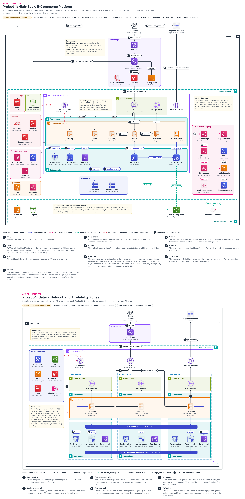

# High-Scale E-Commerce Platform

> **Confidentiality note:** Company names, domain names, IDs and all numbers in this document are dummy values. The architecture, the decisions and the trade-offs are what this document shares.
>
> Key figures (dummy values): about 5,000 req/s normally, 50,000 req/s at the Black Friday peak (10x), 15M monthly active users, up to 2M orders on the peak day, 3 AZs in us-east-1, Amazon ECS (Fargate, Graviton EC2, Fargate Spot), Aurora with 1 writer + 2 readers, and AZ failover in about 30 seconds. AWS limits, prices and timings change over time, so read them as "typically" or "about".

## Architecture diagram


### How to read the diagram
- **Top to bottom in the middle:** this is the main request path. Shoppers → Route 53 → CloudFront → WAF → ALB → ECS Orders service → RDS Proxy → Aurora orders.
- **Numbered badges (1 to 10):** these are the request flow steps in section 4. Steps 1 to 9 are synchronous (the shopper waits). Step 10 is async (the shopper does not wait).
- **Left-side panels:** Login (Cognito), S3 (product-media), Security (IAM roles, KMS, Secrets Manager), Monitoring and audit (CloudWatch, X-Ray, CloudTrail), Operations (ECR, AppConfig).
- **Right-side panel:** the event-driven (async) part: EventBridge, Step Functions, SNS, SQS, dead-letter queue, Notify Lambda, SES, End User Messaging.
- **Region us-west-2 (DR) panel at the bottom:** backup copies only: AWS Backup vault (Aurora and DynamoDB copies), ECR replica, S3 replica, order events copy + archive. A short note on what to do if the region is lost is also there (section 9).
- **Arrow colors:** black line = synchronous request, blue = data read/write, pink dashed = async event, teal dashed = backup/DR copy, red dotted = security/control, grey dotted = logs/metrics.
- **Network and AZ detail:** the subnets, NAT gateways and the Aurora writer/readers spread across the 3 AZs are explained as steps 1 to 6 in section 6.

## 1. Project name
- **ShopSphere Commerce Platform:** a high-scale e-commerce platform running on Amazon ECS.
- In one line: we answer the shopper synchronously for browse, cart and checkout. All the work after the order is saved (payment capture, warehouse, emails, SMS) happens asynchronously through events.
- **Core idea:** "Checkout must always work, it is fine if the extras fail." Even when Black Friday brings 10x traffic, not a single unit may be oversold and no customer may be charged twice.

## 2. Business problem

### Who is the company?
- ShopSphere is an omnichannel retailer. It sells through three channels: the website, the mobile app and physical stores.
- **Omnichannel means:** whichever channel a customer buys from, there is one catalog, one stock and one order history.
- About 15M monthly active users. About 5,000 req/s on a normal day. Up to 50,000 req/s on Black Friday and during flash sales.
- **Team:** a platform team of 5 people and 14 product squads (catalog, cart, checkout, payments, search, notifications, and so on). Each squad deploys its own service.

### What were the problems?

1. **The site went down on Black Friday:** the old system was one big application with one database. Within minutes of the sale starting, the database went past the number of connections it could accept at once. Checkout did not work for 40 minutes. The company lost money on the busiest sales day of the year.
2. **Overselling:** when many people bought the last units at the same time, more orders were accepted than there was stock. Orders had to be cancelled later, and customers were angry.
3. **Double charge complaints:** when the payment call timed out, the app retried. Some customers were charged twice.
4. **Scalper bots:** bots bought limited-edition products within minutes. Nothing was left for real customers.
5. **One slow part made everything slow:** if the email service was slow, checkout was also slow, because everything ran synchronously inside one request.
6. **Squads waited for each other:** one codebase and one release train. The 14 squads could deploy only once a week.

### What did the company need?
| Need | Target | In simple words |
|---|---|---|
| Checkout availability | 99.95% | Checkout may be down only about 22 minutes a month |
| Browse availability | 99.9% + degraded mode | Products must still show even if recommendations fail |
| Product page speed | p95 under 200 ms | Most pages come straight from the CloudFront edge |
| Checkout speed | p99 under 2 seconds | This includes the payment provider call (300 to 800 ms) |
| Peak load | 50,000 req/s, 2M orders a day | 10x normal. Hundreds of orders per second at the start of a flash sale |
| Overselling | 0 | No order may be accepted for a unit that is not in stock |
| Double charge | 0 | Only one charge even if a retry happens |
| RTO / RPO (AZ lost) | under 2 minutes / 0 | No data loss if one AZ fails, checkout back within minutes |
| RTO / RPO (region lost) | about 4 hours / about 1 to 2 hours | Losing a whole region is very rare, we rebuild in another region from backups |
| Security | Small PCI scope, bots blocked | Card numbers must never reach our servers |

### Why this architecture?
- **One service per domain, with the database that fits it:** Aurora + cache + search for the catalog, DynamoDB for the cart, Aurora for orders. If one fails, the others keep working.
- **Only checkout is synchronous:** the shopper must know right away if the order was placed or the card was declined. The rest of the work runs on events, so a slow email does not slow down checkout.
- **Stop most traffic at the edge:** CloudFront cache, WAF Bot Control and a waiting room. Only what the backend can handle reaches it.
- **Amazon ECS (not EKS):** a platform team of 5 has to support 14 squads. There is no time to look after Kubernetes cluster upgrades and add-ons.
- **3 tricks to prevent mistakes:** (1) a database write that reduces stock only if stock is available, so we never oversell. (2) A unique ID for every payment, so a retry still charges only once. (3) The order and the "order received" message are saved together, so we never forget the email or the shipping.

## 3. Architecture overview

### Internet and DNS
- **Route 53** (the AWS DNS service) points `shop.shopsphere.example` to CloudFront with an alias record. The **Cognito user pool** (the AWS sign-in service) signs the shopper in and issues a JWT.
- **PSP (Payment Service Provider, Stripe or Adyen):** the card number goes from the browser straight to the PSP. We only receive a token.

### Edge (Global edge)
- **CloudFront** (the AWS content delivery network) serves images, web files and catalog GETs (cached for about 60 s) from the edge. **WAF** (web application firewall: Bot Control, rate-based rules) and **Shield Advanced** (paid DDoS protection) are attached to it.
- **Waiting room (Lambda@Edge, small functions that run at CloudFront locations):** during a flash sale, a shopper without a signed token sees a holding page.

### Network (VPC)
- **VPC 10.40.0.0/16 (our private network in AWS), 3 AZs:** each AZ has public (ALB, NAT), app (ECS tasks) and data (databases) subnets. The ALB accepts only CloudFront traffic.
- **One NAT gateway per AZ** (for the PSP call). **VPC endpoints** for AWS APIs, and free gateway endpoints for S3 and DynamoDB.

### Application (ECS cluster, 3 AZs)
- **Amazon ECS (the AWS container service):** Catalog runs on Graviton EC2 (steady heavy load). Cart, Inventory, Orders and Payments run on Fargate. Outbox relay: 1 on-demand + 1 Fargate Spot task.
- Every service is spread evenly across 3 AZs and sized so that it can handle the peak even if only 2 AZs remain.

### Data (data subnets + DynamoDB)
- **Catalog:** Aurora PostgreSQL (the source of truth) + ElastiCache for Valkey (product cache) + OpenSearch (search). **Orders:** RDS Proxy → Aurora orders, with the order row and the outbox row in one transaction.
- **DynamoDB (the AWS key-value database):** carts (30-day TTL) and inventory (stock per SKU, conditional writes). Only CloudFront can read **S3 product-media** (OAC).

### Messaging (Event-driven, async)
- **EventBridge** (the AWS event bus) routes events such as OrderPlaced using rules. **Step Functions** (the AWS workflow service) runs the saga: warehouse → shipping → payment capture after shipping. If something fails earlier, it voids the payment and releases the stock.
- **SNS → SQS** (each consumer has its own queue, DLQ after 5 failures) → **Notify Lambda** → SES / End User Messaging.

### Security
- **One IAM task role per service.** All stores are encrypted with customer managed **KMS keys**.
- **Secrets Manager:** the service that stores passwords and API keys. The Catalog DB password (rotated automatically) and the PSP API key live here. The per-service security group chain is in section 7.

### Monitoring
- **CloudWatch** (Container Insights, logs, alarms → on-call page), **X-Ray** (OpenTelemetry traces, which hop is slow).
- **CloudTrail:** records who made which AWS API call, stored in a central log archive account.

### DR (Disaster Recovery)
- **AZ level:** Aurora fails over in about 30 s, and an ElastiCache replica is promoted. Aurora backups and DynamoDB PITR are on (not drawn in the diagram).
- **Region level:** backups are copied to us-west-2 (the DR panel at the bottom of the diagram), where a dormant stack (IAM roles, keys, VPC, ALB) is ready in advance. The switch is done with a Route 53 failover record (section 9).

## 4. Request flow
- **Checkout (sync) path:** `Shopper → Route 53 → CloudFront → WAF → ALB → ECS Orders → Inventory + Payments → RDS Proxy → Aurora orders`
- **Browse path:** `Shopper → CloudFront (cache) → WAF → ALB → ECS Catalog → ElastiCache → Aurora catalog (on a miss)`
- **After-order (async) path:** `Outbox relay → EventBridge → Step Functions (saga) + SNS → SQS → Notify Lambda → SES / SMS`
- The numbers 1 to 10 in the diagram follow the same order as the steps below.

### Step 1: DNS (Route 53)
- The shopper opens `shop.shopsphere.example`. The Route 53 alias record returns the CloudFront distribution address.
- **Time:** almost 0 ms if it is in the resolver cache, otherwise about 10 to 50 ms.

### Step 2: Edge cache (CloudFront + S3)
- The shopper connects over HTTPS (443, TLS 1.2+) to the nearest CloudFront edge.
- Images, JS and CSS come from S3 product-media through OAC (the bucket is not public). Catalog GETs are cached for about 60 s, so most traffic stops here.
- **Time:** about 10 to 30 ms on a cache hit.

### Step 3: Sign in (Cognito)
- The shopper signs in with the Cognito user pool (password + MFA when needed). The shopper gets ID, access and refresh tokens, and the app sends the access token with every API call.
- Every service checks the JWT signature with the Cognito public keys (JWKS) and does not store a login session anywhere. On paths that require sign-in (/account), the ALB also verifies the JWT (Q19).
- **Time:** sign-in takes about 200 to 500 ms, only once. The token check takes under 1 ms.

### Step 4: WAF (AWS WAF + waiting room)
- WAF actually sits inside CloudFront and checks every request at the edge (including cache hits). We drew it below CloudFront in the diagram for clarity.
- **Checks:** managed rules (SQL injection, bad inputs), Bot Control, rate-based rules (for example, block an IP that sends more than 100 login requests in 5 minutes).
- **During a flash sale:** a viewer-request Lambda@Edge checks for a signed waiting-room token, otherwise it shows the holding page (section 5A, Q10).
- **Time:** WAF takes a few ms. Lambda@Edge takes under tens of ms when warm, and hundreds of ms on a cold start.

### Step 5: Routing (ALB → ECS)
- CloudFront sends cache-miss requests to the ALB (Application Load Balancer) over HTTPS.
- **ALB lock down:** alb-sg allows only the CloudFront managed prefix list, and a listener rule checks a CloudFront secret header (otherwise 403).
- Routing by path: `/catalog` → Catalog, `/cart` → Cart, `/checkout` → Orders, only to healthy tasks. The security groups of ALB-facing services (for example orders-sg) allow port 8080 only from alb-sg.
- **Time:** about 1 to 5 ms.

### Step 6: Browse (Catalog → ElastiCache, Aurora, OpenSearch)
- Catalog first looks in ElastiCache for Valkey (cache-aside). A hit takes under 1 ms.
- On a miss, it reads from the Aurora catalog reader and puts the result in the cache with a TTL (5 minutes + random jitter). Search queries go to OpenSearch (search-sg :443).
- **Time:** about 5 to 15 ms with a cache hit, plus 5 to 20 ms on an Aurora miss.

### Step 7: Cart (Cart → DynamoDB carts table)
- Key: the signed-in user ID, or the session ID for a guest. The guest cart is merged after sign-in. One item = one cart, on-demand capacity.
- TTL is 30 days. TTL deletes happen late, so reads also check the expiry time. Traffic goes through the gateway endpoint, not through NAT.
- **Time:** single-digit ms.

### Step 8: Checkout (Orders → Inventory, Payments, payment provider)
- **8a. Card token:** the browser shows PSP hosted fields (card boxes from the provider, the data goes only to the provider). We get only a token, so the PCI scope stays small.
- **8b. Stock reserve:** a conditional write in Inventory, "reduce only if stock ≥ quantity", + a HELD reservation (15 minutes). See section 5A.
- **8c. Payment authorize:** commit a `payment_attempts` row (STARTED), then call PSP authorize with an idempotency key (HTTPS through NAT). Authorize only holds the money. See section 5A.
- **8d. Reservation confirm:** set it to CONFIRMED with the condition `status = HELD`. If this fails or the card is declined, void/release. See section 5A.
- **Time:** reserve 10 to 20 ms, PSP authorize 300 to 800 ms (this takes the most time).

### Step 9: Save order (Orders → RDS Proxy → Aurora orders)
- Orders connects to RDS Proxy with PostgreSQL (5432, TLS). db-sg (the proxy SG) allows only orders-sg and payments-sg (both use IAM auth).
- **One transaction:** the order row + an OrderPlaced row in the outbox. Either both are saved or neither is. After the commit, the shopper sees the "order placed" page, and the sync part is finished.
- **Time:** 10 to 20 ms. The whole checkout takes about 0.5 to 1.5 s.

### Step 10: Events (Outbox relay → EventBridge → Step Functions, SNS → SQS)
- The relay sends new outbox rows to EventBridge with PutEvents and marks only the successful ones as published.
- **Rule 1:** the Step Functions saga: warehouse → shipping label → capture after shipping (taking the money that was held). If something fails earlier, void + stock release.
- **Rule 2:** SNS topic → email, SMS, loyalty and analytics SQS queues → Notify Lambda → SES / End User Messaging.
- **At-least-once:** the same event can arrive twice, so consumers dedupe by event ID. The shopper does not wait, and at peak it is OK for an email to be a few minutes late.

### Other flows
- **Catalog → OpenSearch sync:** when a price changes, a catalog event is sent, an indexer Lambda inside the VPC updates OpenSearch and deletes the cache key (no arrow in the diagram).
- **Stock sweeper:** every minute, an EventBridge Scheduler Lambda releases HELD reservations that have expired (using a sparse GSI on expiresAt). We do not use TTL, because a TTL delete can take days and it does not add the stock back.
- **Deploy:** CI → ECR (scan on push) → ECS rolling deploy, with the circuit breaker for automatic rollback. Degradation flags come from AppConfig (through a VPC endpoint).
- **Telemetry:** logs, metrics and traces go to CloudWatch and X-Ray. AWS API calls go to CloudTrail.

## 5. Why each AWS service

### Amazon Route 53
- **What it is:** AWS managed DNS, one of the rare services with a 100% availability SLA.
- **Why we used it:** to point the domain to CloudFront with an alias, and to hold the `origin.shopsphere.example` failover record for DR (section 9).
- **Problem it solves:** even if CloudFront IPs change, we do not need to change anything, and alias queries are free.
- **Alternatives:** Cloudflare DNS, NS1.
- **Why not the alternative:** a CloudFront alias on the apex domain is native in Route 53, so there is no need for another vendor.

### Amazon CloudFront
- **What it is:** the AWS CDN. It serves content from edge locations close to users.
- **Why we used it:** images, web files and 60 s catalog responses are served from the edge. WAF, Shield and Lambda@Edge are attached here.
- **Problem it solves:** most of the 50,000 req/s never reaches the origin, and Origin Shield (an extra cache layer) reduces it further.
- **Alternatives:** Akamai, Cloudflare, or exposing the ALB directly.
- **Why not the alternative:** a third party means WAF, logs and billing sit somewhere else. Exposing the ALB directly means no cache, and DDoS traffic hits the region directly.

### AWS WAF
- **What it is:** a web firewall. It allows, blocks, or sends a CAPTCHA or challenge to HTTP requests based on rules.
- **Why we used it:** managed rules, Bot Control and rate-based rules on login/checkout, in the CloudFront web ACL.
- **Problem it solves:** scalper bots, credential stuffing (login attempts with stolen passwords) and request floods.
- **Alternatives:** Cloudflare/Akamai bot management, rate limiting in code.
- **Why not the alternative:** if we stop it in code, the request has already reached the tasks. Stopping it at the edge is cheaper. Bot Control is expensive, so we use it only on hot paths.

### AWS Shield Advanced
- **What it is:** paid DDoS protection: the 24/7 Shield Response Team (SRT), attack visibility, and cost protection for the DDoS bill.
- **Why we used it:** extortion attacks come on Black Friday. CloudFront, the ALB and the Route 53 hosted zone are protected.
- **Problem it solves:** during a large L7 attack, the SRT helps with WAF rules, and the extra bill caused by the attack comes back as credit.
- **Alternatives:** Shield Standard (free) + WAF only.
- **Why not the alternative:** Standard does not include the SRT or cost protection. Advanced is about $3,000/month with a 1-year commitment. It is insurance for peak revenue (Q16).

### AWS Lambda (Waiting room + Notify worker)
- **What it is:** a service that runs code without servers. It runs only when an event arrives and bills by the ms.
- **Why we used it:** the Lambda@Edge waiting-room token check, the Notify Lambda (SQS batch → email/SMS), and glue functions (OpenSearch indexer, stock sweeper).
- **Problem it solves:** bursty small jobs do not need always-on containers, and it scales automatically with SQS depth.
- **Alternatives:** CloudFront Functions for the token check, an ECS service for Notify.
- **Why not the alternative:** CloudFront Functions cannot verify our RS256 tokens (Q10). ECS for Notify means paying for idle time too.

### Amazon Cognito
- **What it is:** a managed user directory. User pools handle sign-up, sign-in, MFA and password reset, and issue JWTs.
- **Why we used it:** so we do not build a login system ourselves for 15M users. Services only check the JWT.
- **Problem it solves:** we do not maintain password hashing, MFA or recovery, and the services stay stateless.
- **Alternatives:** Auth0/Okta Customer Identity, Keycloak.
- **Why not the alternative:** Auth0 is expensive at this MAU scale, and Keycloak is one more 24/7 stateful system. Guest checkout keeps the MAU bill down.

### Amazon VPC (subnets, Internet Gateway)
- **What it is:** our private network in AWS: 10.40.0.0/16, 3 AZs, with public, app and data subnets in each AZ. Internet gateway = the VPC's door to the internet.
- **Why we used it:** to keep tasks and databases in private subnets, away from the internet.
- **Problem it solves:** network isolation. In Fargate awsvpc mode every task gets its own ENI, IP and SG.
- **Alternatives:** everything in public subnets with public IPs.
- **Why not the alternative:** the attack surface is bigger, and public IPv4 is charged. We chose /16 because at peak every task takes one IP.

### NAT Gateway
- **What it is:** an outbound-only path for private tasks. No connection can come in from outside.
- **Why we used it:** Payments must call the PSP over the internet. One NAT gateway per AZ.
- **Problem it solves:** if one AZ fails, egress in the other AZs keeps working, and there are no cross-AZ charges.
- **Alternatives:** a single NAT, NAT instances, Regional NAT Gateway (Nov 2025).
- **Why not the alternative:** a single NAT is a single point of failure, and we would have to patch instances ourselves. Why not Regional NAT is in Q20.

### VPC Endpoints
- **What it is:** a private path to AWS services without NAT. Interface endpoints are charged per hour, gateway endpoints (S3, DynamoDB) are free.
- **Why we used it:** ECR, Secrets Manager, KMS, AppConfig, logs, events, xray, monitoring, sts, and ecs endpoints for Catalog EC2. Gateway endpoints for S3 and DynamoDB.
- **Problem it solves:** at peak, thousands of image pulls through NAT would add a lot of data processing cost (about $0.045/GB).
- **Alternatives:** everything through the NAT gateway.
- **Why not the alternative:** cost, security through endpoint policies, and less connection pressure on NAT.

### Application Load Balancer (ALB)
- **What it is:** a Layer 7 (HTTP/HTTPS) load balancer that routes to target groups by path, host or header.
- **Why we used it:** one ALB with path rules: /catalog, /cart, /checkout. ECS tasks register automatically as IP targets.
- **Problem it solves:** traffic goes only to healthy tasks across 3 AZs, with a deregistration delay during deploys.
- **Alternatives:** NLB, API Gateway, an internal ALB with CloudFront VPC origins.
- **Why not the alternative:** NLB has no path routing, and API Gateway is expensive at this rate. VPC origins come after Black Friday (Q9).

### Amazon ECS (Fargate, Graviton EC2, Fargate Spot)
- **What it is:** the AWS container orchestrator. Capacity providers (the setting that says which compute a task runs on): Fargate, EC2 ASG, Fargate Spot.
- **Why we used it:** a platform team of 5 and 14 squads. No control plane upgrades, and ALB, task roles and secrets are native.
- **Problem it solves:** squads deploy separately, with target tracking scaling. Orders → Inventory/Payments through Service Connect (calling services by name).
- **Alternatives:** Amazon EKS (including Auto Mode), a monolith on EC2.
- **Why not the alternative:** even with Auto Mode, Kubernetes upgrades and RBAC are still our job (section 5A).

### Amazon ECR
- **What it is:** a private container image registry.
- **Why we used it:** all images, scan on push, immutable tags, lifecycle policies, replication to us-west-2.
- **Problem it solves:** IAM access, pulls through a VPC endpoint, and it holds up even when hundreds of tasks pull at the same time.
- **Alternatives:** Docker Hub, GitHub Container Registry, JFrog Artifactory.
- **Why not the alternative:** Docker Hub pull rate limits can cause failures in the middle of a scale-out, and an external registry means pulling through NAT.

### AWS AppConfig
- **What it is:** a feature flag and config service: validators, gradual rollout, automatic rollback when an alarm fires.
- **Why we used it:** degradation flags (recommendations off, longer cache TTL, waiting room admit rate).
- **Problem it solves:** extras can be turned off in seconds without a deploy. The AppConfig agent keeps a local cache, so even if AppConfig is down the last value is used.
- **Alternatives:** LaunchDarkly, env variables, flags in a DB table.
- **Why not the alternative:** env variables need a task restart (risky at peak), LaunchDarkly is one more vendor, and DB flags add another call on the hot path.

### Amazon Aurora PostgreSQL (catalog, orders)
- **What it is:** the AWS relational database, PostgreSQL compatible. Storage keeps 6 copies across 3 AZs, with a writer + up to 15 readers.
- **Why we used it:** two clusters: catalog (joins, read-heavy) and orders (ACID: order + line items + outbox together, I/O-Optimized).
- **Problem it solves:** failover typically under 30 s, and the catalog load does not slow down orders.
- **Alternatives:** RDS PostgreSQL Multi-AZ, RDS Multi-AZ DB cluster, DynamoDB for orders.
- **Why not the alternative:** RDS failover is slower or has fewer readers (Q21), and order queries are very relational.

### Amazon RDS Proxy
- **What it is:** a managed connection pooler in front of Aurora. Many tasks share a small number of DB connections.
- **Why we used it:** at peak there are hundreds of Orders tasks. At 10 connections per task that is thousands of connections, which goes past Aurora max_connections.
- **Problem it solves:**
  - It stops connection storms.
  - During failover it holds client connections and moves them to the new writer, with no wait for the DNS TTL.
  - Both tasks → proxy and proxy → Aurora use IAM auth (end-to-end, since 2025), so there is no password anywhere.
- **Alternatives:** PgBouncer on ECS, app-side pooling only.
- **Why not the alternative:** with PgBouncer, HA and failover logic are our job. The pinning risk is in Q8.

### Amazon DynamoDB (carts, inventory)
- **What it is:** a serverless key-value database with single-digit ms latency at any scale, in on-demand mode.
- **Why we used it:** carts (key get/put, TTL) and inventory (stock + reservation together with TransactWriteItems).
- **Problem it solves:** no connection limits and no failover, no overselling thanks to conditional writes, and PITR for 35 days.
- **Alternatives:** ElastiCache for carts, Aurora `SELECT ... FOR UPDATE` for inventory.
- **Why not the alternative:** if a cache node fails, carts can be lost. An Aurora row lock on a hot SKU would queue up and slow down the orders writer.

### Amazon ElastiCache for Valkey
- **What it is:** a managed in-memory store. Valkey = an open-source fork of Redis OSS, and Redis commands work on it.
- **Why we used it:** product detail cache (cache-aside), a primary + replicas in other AZs, automatic failover.
- **Problem it solves:** sub-ms reads, and far fewer Aurora catalog reads (hit rate above 95%).
- **Alternatives:** ElastiCache for Redis OSS, DAX, Aurora readers only.
- **Why not the alternative:** Valkey is about 20% cheaper, DAX works only with DynamoDB, and readers only would be expensive (Q22).

### Amazon OpenSearch Service
- **What it is:** a managed search engine (a fork of Elasticsearch): full-text search, filters, facets, ranking.
- **Why we used it:** searches like "red running shoes size 9 under $100". Data nodes across 3 AZs, dedicated masters.
- **Problem it solves:** PostgreSQL LIKE queries would kill the database at peak, so search goes to a separate engine.
- **Alternatives:** PostgreSQL full-text search, Algolia, OpenSearch Serverless.
- **Why not the alternative:** FTS is weak at facets and relevance, Algolia is expensive, and Serverless is usually expensive for a steady heavy load.

### Amazon S3 (product-media)
- **What it is:** object storage with 11 nines of durability.
- **Why we used it:** images and web files. Only CloudFront can read it (OAC + bucket policy), and Block Public Access is on.
- **Problem it solves:** no servers needed for hundreds of thousands of images. Versioned file names (`app.3f9c.js`) allow a long cache.
- **Alternatives:** EFS, putting images inside containers.
- **Why not the alternative:** EFS is expensive for web serving, and images inside containers means a deploy for every change.

### Amazon EventBridge
- **What it is:** a serverless event bus. It matches rules on the event content and sends events to targets, with archive and replay.
- **Why we used it:** a central bus for events such as OrderPlaced and PaymentCaptured. Rules: saga, notifications, analytics, a copy to the us-west-2 bus.
- **Problem it solves:** Orders does not need to know its consumers, a new squad only has to add a new rule, and we can replay after a bug fix.
- **Alternatives:** SNS only, Amazon MSK (Kafka), Kinesis Data Streams.
- **Why not the alternative:** SNS standard has no archive/replay. Running a Kafka cluster is a burden for a team of 5.

### AWS Step Functions (order saga)
- **What it is:** a serverless workflow engine: steps, retries and timeouts as a state machine. Standard workflows can run for up to 1 year.
- **Why we used it:** the saga: warehouse → shipping label → shipment confirm (task token callback: wait until the outside system says "done") → capture.
- **Problem it solves:** if something fails before capture, void + stock release happen in one place, and we can see which step each order is in.
- **Alternatives:** EventBridge choreography, Temporal, our own state machine in the DB.
- **Why not the alternative:** with choreography it is hard to answer "where is this order stuck?". We keep the steps few because of cost (about $25 per million transitions).

### Amazon SNS
- **What it is:** pub/sub messaging. It pushes one message to many subscribers (SQS, Lambda, HTTP).
- **Why we used it:** EventBridge rule → SNS topic → email, SMS, loyalty and analytics queues. A separate topic for alarms.
- **Problem it solves:** the notification squad owns its topic, and filter policies send each queue only the events it needs.
- **Alternatives:** a separate EventBridge rule → SQS for each consumer.
- **Why not the alternative:** that is also a correct design. We use SNS for the ownership boundary, and SNS → SQS delivery is free (Q11).

### Amazon SQS
- **What it is:** a managed message queue. A standard queue has almost unlimited throughput with at-least-once delivery.
- **Why we used it:** each consumer has its own queue + DLQ (maxReceiveCount 5). The visibility timeout (hiding a message for a while as it is being read) is about 6x the Lambda timeout.
- **Problem it solves:** buffering: if SES is slow, only the email queue grows.
- **Alternatives:** SNS → Lambda directly, FIFO queues, Kinesis.
- **Why not the alternative:**
  - SNS → Lambda directly gives less buffering and batch control.
  - FIFO gives ordering only within a message group, and costs more. Notifications do not need ordering.

### Amazon SES
- **What it is:** a transactional and bulk email service.
- **Why we used it:** order and shipping emails, with DKIM/SPF/DMARC (settings that prove the mail really comes from our domain).
- **Problem it solves:** hundreds of thousands of emails on the peak day. The sending quota is raised in advance, and the Notify Lambda concurrency is capped to match it.
- **Alternatives:** SendGrid, Mailgun, our own SMTP.
- **Why not the alternative:** SES is very cheap (about $0.10 per 1,000 emails) and native with IAM and CloudWatch.

### AWS End User Messaging (SMS)
- **What it is:** the AWS service for sending SMS, voice and push. The SMS features that used to be in Pinpoint now live under this name.
- **Why we used it:** "out for delivery" SMS, using 10DLC (registered business numbers) or toll-free numbers in the US.
- **Problem it solves:** AWS handles carrier connections, opt-out and delivery receipts.
- **Alternatives:** Twilio, Pinpoint engagement features, SNS SMS.
- **Why not the alternative:** end of support has been announced for Pinpoint engagement, and Twilio is one more vendor. Number registration takes weeks.

### AWS IAM (task roles, execution roles)
- **What it is:** the service that decides "who can do which action on which resource". Roles give temporary credentials.
- **Why we used it:** each service has its own task role (the cart role can use only the carts table), and the execution role is for ECR pull, secrets and logs.
- **Problem it solves:** even if one service is compromised, the blast radius (the part that can be affected) stays small.
- **Alternatives:** one shared role for all services, access keys in env variables.
- **Why not the alternative:** with a shared role, a catalog bug could delete the orders table. Access keys leak. PCI requires least privilege.

### AWS KMS
- **What it is:** the encryption key service. Keys never leave the HSMs (secure hardware), and every use is logged in CloudTrail.
- **Why we used it:** a separate customer managed key (CMK) for each data store, with yearly rotation on.
- **Problem it solves:** the key policy controls "who can decrypt", and it supports cross-account and cross-Region backup copies.
- **Alternatives:** AWS owned/managed keys, CloudHSM.
- **Why not the alternative:**
  - We cannot change the policy of AWS managed keys, and cross-account backup copies are hard.
  - With CloudHSM we would have to run the cluster ourselves.
  - Note: disabling a key is dangerous. If a DynamoDB table cannot reach its key for 7 days, the table is archived, so key disabling is done only through a runbook.

### AWS Secrets Manager
- **What it is:** a service that stores passwords and API keys and rotates them automatically.
- **Why we used it:** the Catalog DB password, the PSP API key and the CloudFront secret header, injected through the ECS `secrets` field.
- **Problem it solves:** secrets are not in code, images or Git, and CloudTrail shows who read them.
- **Alternatives:** SSM Parameter Store SecureString, HashiCorp Vault.
- **Why not the alternative:** Parameter Store has no automatic DB password rotation, and we would have to run Vault 24/7 ourselves. Rotation details are in section 7.

### Amazon CloudWatch
- **What it is:** the metrics, logs, alarms and dashboards service. Container Insights shows CPU and memory for ECS tasks.
- **Why we used it:** ALB, ECS, Aurora, DynamoDB and SQS metrics, task logs (awslogs or the FireLens log router), and business metrics (orders/min).
- **Problem it solves:** everything in one place, less noise with composite alarms, and the Black Friday war-room dashboard.
- **Alternatives:** Datadog, New Relic, Prometheus + Grafana.
- **Why not the alternative:** Datadog is expensive for thousands of tasks, and we would have to run a Prometheus stack ourselves. Log ingestion is expensive, so debug logs are off at peak.

### AWS X-Ray (via OpenTelemetry)
- **What it is:** distributed tracing: it shows how much time a request took at each hop.
- **Why we used it:** services send traces with ADOT (AWS Distro for OpenTelemetry): ALB → Orders → Inventory → Payments → PSP → Aurora.
- **Problem it solves:** when "checkout is slow", we find out within minutes whether it is the PSP or Aurora.
- **Alternatives:** self-hosted Jaeger/Tempo, Datadog APM, X-Ray SDKs.
- **Why not the alternative:** with self-hosting, the storage is ours to run. The X-Ray SDKs and daemon are in maintenance mode from Feb 2026, so we use OpenTelemetry.

### AWS CloudTrail
- **What it is:** the service that records every AWS API call (who, when, what changed).
- **Why we used it:** an organization trail to S3 in the log archive account (Object Lock, KMS). Data events in a small scope (section 7).
- **Problem it solves:** "Who changed the SG the day before Black Friday?" is answered right away, and it gives PCI audit evidence.
- **Alternatives:** AWS Config only, application audit logs only.
- **Why not the alternative:** Config shows resource state, but only CloudTrail shows "who made which call". We use both.

### AWS Backup
- **What it is:** the AWS service that takes all backups with one plan and copies them to another region.
- **Why we used it:** Aurora snapshots and DynamoDB backups are copied to the us-west-2 vault (orders hourly, the rest daily), with restore testing every 3 months. S3 and ECR copies use their own replication.
- **Problem it solves:** even if all of us-east-1 is lost, the data is in us-west-2.
- **Alternatives:** each service's own snapshot copy scripts.
- **Why not the alternative:** we would have to maintain the scripts ourselves, and there would be no vault lock, no restore testing and no reports in one place.

### Key decisions
| Decision | Chosen | Rejected | Why |
|---|---|---|---|
| Container platform | Amazon ECS (Fargate + Graviton EC2 + Fargate Spot) | Amazon EKS (including Auto Mode) | Team of 5, no burden of Kubernetes upgrades and RBAC, native AWS integrations |
| Orders database | Aurora PostgreSQL + RDS Proxy | DynamoDB, RDS Multi-AZ | ACID, relational queries, outbox in the same transaction; failover speed, readers |
| Cart, inventory | DynamoDB | Aurora, ElastiCache | ms latency at any scale, conditional writes, no connection limits |
| Product cache | ElastiCache for Valkey | Aurora readers only, DAX | Sub-ms reads, cheaper than readers, DAX does not work with Aurora |
| Edge | CloudFront in front of the ALB (CloudFront → ALB) | Opening the ALB directly to the internet | Cache and WAF/Shield at the edge, the ALB accepts traffic only from CloudFront |
| Events | EventBridge + SNS fan-out + SQS | Everything on SQS, or Kafka | Routing + buffering, no clusters to run |
| After-order flow | Step Functions saga (orchestration) | Pure choreography | Visibility, compensation in one place |
| Event publishing | Transactional outbox + relay | Publishing directly after the DB commit | Dual-write problem: no event may be lost |
| Payments | PSP tokenization + idempotency keys, capture when shipped | Handling card data ourselves, capture during checkout | Small PCI scope, no double charge, no refund needed if the order is cancelled |

## 5A. Key topics

### Domain by domain (how we handled each domain)
| Domain | Service (ECS) | Data store | Why that store |
|---|---|---|---|
| Product catalog | Catalog (Graviton EC2) | Aurora catalog + ElastiCache + OpenSearch + CloudFront | Relational source of truth, cache for reads, a separate engine for search |
| User authentication | (Cognito, no service) | Cognito user pool | Managed login, JWT, stateless services |
| Shopping cart | Cart (Fargate) | DynamoDB carts (TTL) | Key-value, high write, old carts deleted for free |
| Orders | Orders (Fargate) | Aurora orders + RDS Proxy (outbox) | ACID, relational, no event may be lost |
| Payments | Payments (Fargate) | PSP + payment attempts table (Aurora orders) | Card data stays outside, idempotency |
| Inventory | Inventory (Fargate) | DynamoDB inventory | Conditional writes, hot SKU sharding |
| Notifications | Notify Lambda | SQS (buffer) | Async, retry, DLQ |

- **Catalog:** CloudFront 60 s, ElastiCache 5 minutes. When a price changes, we delete the cache key, and for urgent cases we run a CloudFront invalidation. **At checkout we always read the price again from the Aurora writer.**
- **Authentication:** the access token lasts 15 minutes (the Cognito default is 60), and a new one is obtained with the refresh token. Services cache the JWKS keys and check the signature, expiry and audience.
- **Cart:** a guest cart uses the session ID and is merged after sign-in. The price in the cart is "display only" and is calculated again at checkout.
- **Orders:** states: PENDING → PLACED → SHIPPED → CAPTURED (or CANCELLED). Every state change is an outbox event.
- **Payments:** at checkout we only authorize (hold the money), and we capture when the order ships. If the order is cancelled, we void (cancel the hold, the customer does not lose a single cent). Refunds are only for returns.
- **Authorization expiry:** a card authorization is valid for only a few days (about 5 to 7 days depending on the card network, check the PSP docs). If shipping is late, the saga re-authorizes with the PSP stored token.
- **Inventory:** DynamoDB holds the "sellable stock". The source of truth for physical stock is the warehouse system, with a daily reconciliation.

### Synchronous vs event-driven (what is sync, what is async)
- **Rule:** if the shopper waits for the answer, it is sync. If the shopper does not wait, or if a failure can simply be retried, it is async.

| Task | Sync / Async | How | Why |
|---|---|---|---|
| Sign in | Sync | Cognito | We cannot go further without a token |
| Browse, search | Sync | CloudFront, Catalog, cache, OpenSearch | The page must show right away |
| Cart add/remove | Sync | Cart → DynamoDB | The shopper sees the cart count right away |
| Stock reserve | Sync | Inventory conditional write | We must say "Sold out" right away |
| Payment authorize | Sync | Payments → PSP | We must say "Card declined" right away |
| Order save | Sync | Aurora transaction (order + outbox) | "Order placed" confirmation |
| Payment capture | Async | Step Functions saga | When the order ships, can be retried |
| Warehouse, shipping | Async | Step Functions (task token callback) | Takes hours/days |
| Email, SMS | Async | EventBridge → SNS → SQS → Lambda | Even if slow, it must not affect checkout |
| Loyalty points, analytics | Async | SNS → SQS | Eventually is enough |
| Search index update | Async | Catalog event → Lambda → OpenSearch | A few seconds of delay is OK |
| Expired reservation release | Async | Scheduler sweeper (not TTL) | The 15-minute deadline must be exact |

- **Trade-off:** async means eventual consistency (a change does not reach every place right away, it arrives within a few seconds). After "order placed" is shown, the email status may not appear on the "My orders" page for a few seconds. The UI shows it as "processing".
- **Keep the sync chain short:** checkout makes only 3 calls (inventory, payments, Aurora). Every call has a timeout (inventory 200 ms, PSP 3 s), and only idempotent calls are retried.

### Black Friday readiness (getting ready in advance)
**6 to 8 weeks before:**
- **Raise quotas:** the full list is in section 10 (Fargate vCPU, ALB targets, Step Functions, EventBridge, Lambda, SES, KMS). Some of them take days.
- **Talk to the payment provider:** their rate limits can also become our bottleneck. We share the peak numbers with them in advance.
- **SMS numbers, SES reputation:** registration and warm-up are done early.

**2 weeks before:**
- **Load test at 2x peak (100,000 req/s):** in a production-like environment, with a real traffic mix (80% browse, 15% cart, 5% checkout). The goal is to find the first bottleneck.
- **Game day:** fail one AZ in the middle of the load test (AWS Fault Injection Service) and trigger an Aurora failover.
- **Scale up the Aurora orders writer:** changing the instance size is not possible without downtime. We add a bigger reader, fail over to it at a low-traffic time (about a 30 s blip, shorter with RDS Proxy), and then remove the old writer. This is done before the change freeze.
- **Change freeze:** no non-critical deploys from the week before Black Friday.

**The night before (pre-warm):**
- **ECS scheduled scaling:** scale tasks up close to the peak in advance. Target tracking reacts in minutes, but at the sale start traffic goes 10x in seconds.
- **Pre-scale Aurora readers:** adding a reader takes more than 10 minutes, so we do it early.
- **DynamoDB warm throughput:** pre-warm the on-demand tables for the peak. Add ElastiCache shards/replicas in advance.
- **ALB:** capacity in advance with LCU reservation (capacity unit reservation).
- **Outbox relay:** fully on-demand instead of Spot (Spot capacity is low during big events), and more tasks.

**During the sale (degradation modes, AppConfig flags):**
1. Waiting room on: shoppers are let in only at the rate the backend can handle.
2. Recommendations, reviews and personalization off. Longer catalog cache TTL.
3. CloudFront stale-if-error: show the old catalog page even if the origin fails.
4. Protect checkout until the very end: everything else is turned off first.

### Inventory overselling and hot keys (not selling too much, the hot SKU problem)
**Why overselling happens:**
- Old code: "read stock → check if it is more than 0 → reduce it". If two requests read at the same time, both see "1 left" and both buy (race condition).

**Fix: conditional write (atomic = a single step that cannot be stopped in the middle and that no one else can get into):**
- `UpdateItem SET available = available - :q  CONDITION available >= :q`
- Only one succeeds. The second gets `ConditionalCheckFailedException` = "sold out".
- **TransactWriteItems:** reduce the stock + write the reservation item (orderId, sku, shard, qty, `status = HELD`, expiresAt) together.

**A release must happen only once:**
- Release = TransactWriteItems: set the reservation to RELEASED with the condition `status = HELD` + increase the stock in the same shard.
- Even if the payment-fail release and the sweeper arrive at the same time, only one succeeds. The stock is not increased twice, so there is no "extra stock" bug.
- Before the order is saved, the reservation is set to CONFIRMED with the condition `status = HELD`. If the sweeper already released it, the confirm fails and the authorization is voided.

**The hot key problem:**
- For a limited-edition sneaker, thousands of requests per second hit one item at the sale start.
- One partition gives 1,000 WCU/s. For items under 1 KB, that is about 1,000 plain writes/s. But TransactWriteItems uses 2 WCU per item, so one hot item gets only about 500 transactional writes/s.
- Under contention, `TransactionConflict` cancellations also happen. Adaptive capacity cannot split a single item.

**Fix: sharded counters:**
- Spread the hot SKU stock across N items. For example: 1,000 units → 10 shards (`SKU#123#0` ... `SKU#123#9`), with 100 in each.
- A request picks a random shard and does a conditional write. If that shard is empty, it tries another shard (2 or 3 tries). Only when all shards are empty is it "sold out".
- For the shards to land in different partitions, the table needs enough partitions, which is why we use warm throughput before the sale.
- **Trade-off:** total stock = the sum of all shards. For display we use a slightly old cached value.

**More protections:**
- The waiting room lowers the rate for a hot product. WAF Bot Control stops scalpers.
- Per-customer limit (2 units per customer): a condition on a purchase-count item in the same TransactWriteItems.
- A spike in `ConditionalCheckFailedRequests` means "sold out" or a hot SKU. We watch it on the dashboard.

### Payment idempotency and the outbox pattern
**Idempotency means:** no matter how many times the same request is sent, the result is the same as sending it once.

**How a double charge happens:**
- Payments sent an authorize to the PSP. The PSP authorized it, but the reply was lost in the network (timeout). Payments assumed "failed" and sent a new request. Second charge.

**Fix:**
1. A unique `checkoutAttemptId` is created when checkout starts. This is the idempotency key.
2. **Before** the PSP call, a `payment_attempts` row (STARTED, key, reservation ID) is committed in a small transaction. There is a unique constraint on that key, so the same attempt cannot start twice.
3. The PSP call carries an `Idempotency-Key` header (both Stripe and Adyen support it). If a retry comes with the same key, the PSP returns the first result. Stripe remembers keys for at least 24 hours.
4. On a timeout: retry with the same key, or check with the PSP status API. Never a new key.
5. If "Place order" is clicked twice: the UI disables the button + the same attempt ID is used.

**Outbox pattern (the dual-write problem):**
- **Problem:** "save in the DB → publish to EventBridge" touches two separate systems. If the task crashes in between, the event is lost (no email, the saga does not start).
- **Fix:** the order row and the outbox row (event JSON) go in one Aurora transaction. Either both are saved or neither is.
- **Relay:** normally 2 tasks: 1 Fargate on-demand (base 1) + 1 Fargate Spot. It reads batches with `SELECT ... WHERE published = false ORDER BY id LIMIT 100 FOR UPDATE SKIP LOCKED`. Because of SKIP LOCKED, relays do not take the same rows, so adding tasks increases throughput.
- **Relay loop:** if a full batch (100 rows) comes back, it takes the next batch without sleeping. It waits 1 s only when the table is empty.
- **PutEvents limits:** up to 10 entries per call (under 1 MB in total), so 100 rows = 10 calls. It checks `FailedEntryCount` in the response and retries only the failed entries. Only the successful ones get published = true.
- **Capacity:** at peak, 500 orders per second × 2 to 3 events = 1,000 to 1,500 events/s. We scale the relays to match and watch them with an outbox lag alarm (60 s).
- **Delivery guarantee:** at-least-once. If it crashes before marking, it sends again, and consumers dedupe by event ID.
- **Ordering:** EventBridge does not guarantee order. Events carry a version number, and consumers ignore older versions.
- **Cleanup:** the outbox is split into daily partitions and old partitions are dropped (so a big DELETE does not cause vacuum bloat).
- **Alternative:** CDC (reading every change in the database from the WAL log and sending it as events, for example Debezium). Lower latency, but one more system to run.

### Why ECS instead of EKS (why ECS for this organization)
**The organization's situation:**
- A platform team of 5 and 14 product squads. The squads have little Kubernetes experience and a lot of AWS experience.
- No multi-cloud requirement. No need for Kubernetes operators (such as a Kafka operator).

| Topic | Amazon ECS | Amazon EKS |
|---|---|---|
| Control plane cost | Free | About $0.10 per hour per cluster (standard support) |
| Upgrades | No control plane upgrades. AWS patches Fargate. AMI and agent updates for Catalog EC2 are ours (with ECS Managed Instances, AWS does that too) | A new Kubernetes version about 3 times a year, API deprecations, testing manifests |
| Add-ons | ALB, IAM, secrets and logs are native | EKS Auto Mode (since Dec 2024) has AWS manage nodes, Karpenter, CNI, CoreDNS and the LB controller. Without Auto Mode these are ours |
| Auto Mode cost | None | About a 12% management fee on top of the EC2 price, and Savings Plans do not discount this fee |
| Pod/task IAM | Task roles (built-in) | IRSA or Pod Identity setup |
| Ecosystem | AWS-specific | Helm, operators, service mesh, portable |
| Learning curve | Low | High (RBAC, CRDs, networking) |

**Honest trade-offs (what we give up with ECS):**
- Portability: task definitions do not work on another cloud. We accepted the lock-in.
- Ecosystem: no Helm, operators or Argo Rollouts. For deploys we use ECS rolling + circuit breaker, and ECS also has built-in blue/green.

**When we would revisit:**
- If the platform team grows to 15+ people, if a multi-cloud or on-prem requirement comes up, or if we need Kubernetes-native tools (Kafka operators, ML workloads).
- The images stay the same, so migration is possible: the task definitions would need to be turned into manifests.

**Capacity mix:** Fargate (most services), Graviton EC2 (Catalog, about 20% cheaper than x86), Fargate Spot (one task in the relay). The reasons are in Q17.

## 6. High availability

### Failure domains (what can fail)
- **One task:** the ALB health check fails → traffic to it stops, and ECS starts a new task.
- **One AZ:** everything is spread across 3 AZs. Each AZ is sized so that **the peak can be handled even if only 2 AZs remain** (static stability: do not depend on new capacity during a failure).
- **Region:** see section 9 (backup-based DR).

### Layer by layer
| Layer | How it is HA | Recovery time if one part fails |
|---|---|---|
| Edge (CloudFront, Route 53, WAF) | Global, many edge locations. Cached pages with stale-if-error even if the origin fails | Nothing for us to do |
| ALB | Nodes in 3 AZs, health check `/health` every 10 s, unhealthy after 2 failures | Seconds |
| ECS | At least 3 tasks per service, AZ spread, circuit breaker, minimum healthy 100% | New task in 30 to 60 s |
| Aurora (catalog, orders) | 1 writer + 2 readers, 6 storage copies (2 per AZ), failover priority tiers | About 30 s |
| RDS Proxy | In 3 data subnets, holds connections during failover | No DNS problem for the app |
| ElastiCache | Primary + replicas in different AZs, automatic failover. If the cache is lost, fall back to Aurora (with stampede protection) | Usually under a minute |
| OpenSearch | Data nodes and replicas in 3 AZs, 3 dedicated masters | Search keeps working |
| NAT gateways | One per AZ, each app subnet uses the NAT in its own AZ | Only that AZ is affected |
| DynamoDB, S3, SQS, SNS, EventBridge, Lambda | Regional, AWS handles it across AZs | Nothing for us to do |

### Network and AZ detail steps (1 to 6)
- **1:** CloudFront to the ALB. The ALB has one node in the public subnet of each AZ.
- **2:** The ALB sends traffic only to healthy tasks, in any AZ.
- **3:** Writes go to the Aurora writer in AZ a, and reads go to the readers in b and c, through RDS Proxy.
- **4:** The cache primary is in one AZ, with replicas in the others. OpenSearch has one node in each AZ.
- **5:** The payment call goes only through the NAT gateway in its own AZ.
- **6:** AWS API calls go through VPC endpoints, not through NAT.

### What the app must do (AWS alone is not enough)
- **Retries with exponential backoff + jitter,** only for idempotent calls.
- **Timeouts** on every call. A circuit breaker for the PSP: when the error rate is high, fail fast and tell the shopper "try again".
- **DB failover:** even with the proxy, an in-flight transaction fails. Orders retries that transaction with the same idempotency key.
- **Graceful shutdown:** on SIGTERM, stop taking new requests and finish the in-flight ones (ALB deregistration delay 30 s).

## 7. Security

### IAM (humans and workloads)
- **Humans:** no IAM users. Login through IAM Identity Center (SSO). Developers get read-only access in production.
- **Break-glass role:** an admin role used only in emergencies, MFA required, and an alarm every time it is used.
- **Organizations + SCPs:** an SCP is an organization-level rule that says "nobody may do this". In production we deny turning off CloudTrail, deleting KMS keys, and using any region other than us-east-1/us-west-2.
- **CI/CD:** GitHub Actions with OIDC (a way to give GitHub a temporary role without giving it AWS keys). No long-lived access keys.

### IAM roles (workloads)
- **Task role (one per service):** for AWS calls from app code. The Cart role can use only the carts table, the Inventory role only the inventory table, and the Relay role only `events:PutEvents` on that bus.
- **Execution role:** for the ECS agent: ECR pull, only its own secrets, log writes. App code does not use this role.
- **Lambda roles:** the Notify Lambda can only read its own SQS queue, send with SES and send SMS.
- We remove unused permissions with IAM Access Analyzer.

### Security Groups chain
```
alb-sg            : 443 from CloudFront managed prefix list only
catalog-sg        : 8080 from alb-sg
cart-sg           : 8080 from alb-sg
orders-sg         : 8080 from alb-sg
inventory-sg      : 8080 from orders-sg only
payments-sg       : 8080 from orders-sg only (egress: 443 via NAT for PSP + vpce-sg, 5432 to db-sg)
db-sg (RDS Proxy) : 5432 from orders-sg, payments-sg
aurora-orders-sg  : 5432 from db-sg, relay-sg
aurora-catalog-sg : 5432 from catalog-sg
cache-sg          : 6379 from catalog-sg, indexer-sg
search-sg         : 443 from catalog-sg, indexer-sg
vpce-sg           : 443 from all task SGs + Catalog container-instance SG
```
- **Each service has its own SG:** in awsvpc mode each task has its own ENI, so this costs nothing. A shared SG would mean that if Catalog is compromised, there is a path to Payments and the orders DB.
- **Why separate SGs:** if the proxy and Aurora were in the same SG, proxy → Aurora would be blocked (unless there is a self-rule). indexer-sg is for the OpenSearch indexer Lambda inside the VPC. On Catalog EC2, image pulls and logs go out from the instance ENI, which is why the container-instance SG is in vpce-sg.
- **The prefix list alone is not enough:** it is the same for everyone's CloudFront, so we also use a secret header (in Secrets Manager, rotated). The prefix list counts as many rules, so the SG rules quota may need to be raised.
- **payments-sg egress:** an SG cannot filter by domain, so opening 443 allows traffic to any site. To allow only the PSP domain we would need a Network Firewall domain allowlist (that design is in Project 6).

### Network ACLs
- NACLs are stateless (return traffic also needs a rule) and work at the subnet level. They are only a coarse guardrail, the main control is the SGs.
- **Data subnets inbound:** 5432, 6379 and 443 from the app subnet CIDRs. **Also 5432 from the data subnet CIDRs**, because when the RDS Proxy in AZ a goes to the Aurora writer in AZ b, it crosses a subnet boundary.
- **Data subnets outbound:** ephemeral ports (1024-65535) to the app CIDRs, and 5432 and ephemeral ports to the data CIDRs. Direct traffic from the public subnets to the data subnets is denied.
- We test NACL changes in staging with an Aurora failover. Otherwise this bug shows up only on the day of a failover (when the writer moves to another AZ).

### KMS (encryption keys)
- A separate customer managed key for each data store: `orders-db`, `catalog-db`, `dynamodb`, `media-s3`, `messaging`.
- The key policy separates key administrators (the platform team) from key users (the related task roles).
- **Note:** an admin with `kms:PutKeyPolicy` can grant themselves decrypt. That is why there is a CloudTrail alarm and an SCP guardrail on key policy changes.
- Automatic rotation is on (once a year, old versions are kept for decryption). Key deletion has a 30-day waiting period + an alarm.
- Multi-Region keys for DR (the same key also exists in us-west-2), so backup copies can be decrypted.

### Secrets Manager
- **Catalog DB password:** automatic rotation (30 days). A secret passed as an env variable changes only when the task restarts, so we use the alternating-users strategy (two DB users, switched in turn), and old tasks can still connect.
- **Orders:** tasks → RDS Proxy use IAM auth, and proxy → Aurora also uses IAM (end-to-end IAM). No password.
- **PSP API key:** a manual rotation runbook that creates a new key in the PSP dashboard.
- Resource policy: only the payments task execution role can read the PSP secret.

### WAF and Shield
- **AWS managed rules:** Core rule set, Known bad inputs, SQL injection, IP reputation (IPs with a bad reputation).
- **Bot Control (targeted):** only on /login, /checkout and hot paths, with CAPTCHA/challenge for suspected bots. Rate-based rules on login, checkout and cart. Account Takeover Prevention is optional (expensive).
- **Shield Advanced:** protects CloudFront, the ALB and Route 53, and detects attacks faster using our health checks (section 5, Q16).

### Encryption (in transit and at rest)
| Path | Encryption |
|---|---|
| Shopper → CloudFront | HTTPS, TLS 1.2+, ACM certificate in us-east-1 |
| CloudFront → ALB | HTTPS |
| ALB → tasks | HTTP inside the VPC (HTTPS target groups with a certificate in the container if needed) |
| Orders → Inventory, Payments (Service Connect) | Service Connect TLS if needed (AWS Private CA certs, encryption only, not mTLS) |
| Tasks → Aurora | TLS required (`rds.force_ssl=1`) |
| Tasks → ElastiCache, OpenSearch | In-transit encryption on |
- **At rest:** Aurora, DynamoDB, S3, SQS, SNS, ElastiCache, OpenSearch and ECR are all encrypted with KMS.

### Reducing PCI scope
- The card number goes from the browser straight to the PSP hosted fields. The card number is never in our servers, logs or databases, only the token.
- ShopSphere processes more than 6M card transactions a year, so it is a Level 1 merchant. It needs a Report on Compliance (ROC) with a QSA (PCI auditor) every year, and an SAQ (self-check form) is not enough.
- Hosted fields make the ROC scope very small. But the controls over the scripts loaded on the checkout page and over the Payments service network are still ours. The QSA decides the final scope.

### CloudTrail and detection
- CloudTrail logs from all accounts go to an S3 bucket in one log archive account. Object Lock is on, which means even an admin cannot delete or change the logs. Log file validation lets us check whether anyone changed the logs.
- **Data events:** on the log archive and backup buckets. On the inventory table, only admin/bulk changes (principals that are not the service role), using advanced event selectors.
- **Data events off for carts and product-media:** the volume is very high (about $0.10 per 100,000 events, so 10,000 writes per second is about $800+ a day), and the security value is low.
- **Alarms:** root login, CloudTrail stopped, SG changes, KMS key disabled or key policy changed.
- ECR scan on push: images with critical CVEs are blocked from deploy (a gate in CI).

## 8. Monitoring

### Key CloudWatch metrics and alarms (thresholds)
| Layer | Metric | Alarm | Why |
|---|---|---|---|
| CloudFront | `CacheHitRate`, `5xxErrorRate` | Hit rate < 80% for 10 minutes | A cache miss increases the load on the origin. CacheHitRate is an additional metric that must be turned on for the distribution (small charge) |
| WAF | `BlockedRequests` | 5x normal | A bot attack has started |
| ALB | `HTTPCode_Target_5XX_Count`, `TargetResponseTime` p99 | 5xx > 1% for 5 minutes; checkout p99 > 2 s | Errors and slowness for users |
| ALB | `UnHealthyHostCount` | > 0 in one AZ for 3 minutes | Task or AZ problem |
| ECS | `CPUUtilization`, `MemoryUtilization`, `RunningTaskCount` | Memory > 85%; running < desired | Scaling, OOM kills |
| Aurora | `CPUUtilization`, `DatabaseConnections`, `AuroraReplicaLag`, `CommitLatency` | Writer CPU > 70%; replica lag > 1 s | The writer is the first bottleneck |
| RDS Proxy | `DatabaseConnectionsCurrentlySessionPinned`, `ClientConnections` | When pinned connections grow | Pooling is not working |
| DynamoDB | `ThrottledRequests`, `ConditionalCheckFailedRequests` | Throttles > 0 for 5 minutes | Hot key |
| ElastiCache | `CacheHitRate`, `EngineCPUUtilization`, `Evictions` | Hit rate < 90%; when evictions grow | Stampede risk on Aurora |
| SQS | `ApproximateAgeOfOldestMessage` | Email queue > 10 minutes | Consumers have fallen behind |
| DLQ | `ApproximateNumberOfMessagesVisible` | > 0 | Poison messages, bug |
| EventBridge | `FailedInvocations`, `ThrottledRules` | > 0 | Events are not reaching targets |
| Step Functions | `ExecutionsFailed`, `ExecutionsTimedOut` | Failed > 0.5% | Saga problem |
| Custom | Outbox lag (age of the oldest unpublished row) | > 60 s | The relay has stopped |

### Business metrics (the real health)
- **Orders per minute:** a CloudWatch anomaly detection alarm. If orders suddenly drop, it pages even if all the technical metrics are green.
- **Checkout success rate, payment decline rate:** a sudden rise in the decline rate means a PSP problem or a fraud attack.
- **SLOs:** checkout success 99.95%, checkout p99 < 2 s. SLO and error budget tracking with CloudWatch Application Signals.

### Logs
- ECS tasks send structured JSON logs (traceId, orderId, customerId hash) to CloudWatch Logs through a VPC endpoint. Card data and PII (personal details) are masked in the logs.
- ALB access logs, CloudFront logs and WAF logs go to S3. We query them with Athena (for example: "how many checkout requests came from this IP").
- App logs stay in CloudWatch for 30 days, then go to an S3 archive. The debug level is off at peak (ingestion cost).

### Tracing
- An ADOT collector sidecar in every task. The sidecar can only do head sampling (5%), because at the start of a request it does not know whether the request will end in an error.
- **If we want "all errors and slow requests":** sidecars → central ADOT gateway collectors (a load-balancing exporter by trace ID, so all spans of one trace go to the same collector) → tail sampling. Or ingest all spans with X-Ray Transaction Search (higher cost).
- The PSP call is one span in the trace, so we know right away whether "the PSP is slow or we are".

### Dashboards
- **Black Friday war-room dashboard:** orders per minute, checkout p99, 5xx, CloudFront hit rate, how many people are in the waiting room, Aurora writer CPU, DynamoDB throttles, SQS age. All on one screen.
- A service dashboard for each squad (golden signals: latency, traffic, errors, saturation).

### Alarm routing
- Critical alarms go through an SNS topic to PagerDuty and wake up the on-call engineer. Warnings go only to Slack (through Amazon Q Developer in chat applications).
- Composite alarms: page only if "ALB 5xx is high AND orders/min dropped", so there is less noise.

### CloudTrail (audit)
- The first question in an incident is "what changed?". CloudTrail tells us who made SG, task definition and IAM changes.
- CloudTrail events go to EventBridge, with an immediate alert for sensitive changes (such as opening a production SG to 0.0.0.0/0).

## 9. Disaster recovery

### Backups
- **Aurora (catalog, orders):** automated backups with 35-day PITR (restore to any second, usually up to the last 5 minutes). Backtrack is only for Aurora MySQL, not PostgreSQL.
- **DynamoDB:** PITR for 35 days. Daily on-demand backups for the inventory table as well.
- **Cross-region copies (the us-west-2 DR panel at the bottom of the diagram, but the Aurora catalog and S3 copy arrows are not drawn):** Aurora snapshots and DynamoDB backups go to us-west-2 with AWS Backup (hourly for orders, daily for the rest). Cross-Region Replication for S3 product-media, and cross-region replication for ECR.
- **Events copy:** OrderPlaced and PaymentAuthorized events are also sent to the us-west-2 event bus with a cross-Region rule and archived there. Reason: the EventBridge archive is regional, so the us-east-1 archive would be lost together with that region.
- **RPO math:** RPO = snapshot interval + cross-Region copy time. Aurora cross-Region copies are stored as full snapshots at the destination, so for hourly copies we have to measure both the storage cost and the copy time. That is why we say "RPO about 1 to 2 hours".

### RTO / RPO (targets)
| Scenario | RTO | RPO | In simple words |
|---|---|---|---|
| One task crashes | Seconds | 0 | ECS starts a new task, users do not notice |
| One AZ is lost | Under 2 minutes | 0 | Aurora fails over in about 30 s, the other 2 AZs handle the peak |
| A bad deploy corrupts data | 1 to 2 hours | Minutes | Restore with PITR to a time before the damage (steps below) |
| A whole region is lost | About 4 hours | About 1 to 2 hours | Rebuild from backups in us-west-2 |

### Database recovery (how to get data back if it is corrupted)
1. **Stop it first:** roll back the bad deploy, turn the feature off with an AppConfig flag, and stop the harmful writes.
2. **Find the time:** use CloudTrail and app logs to find the minute from which the data went bad.
3. **Aurora PITR:** restore to one minute before that time. PITR creates a new cluster, and for a large DB it can take more than an hour.
4. **Fix it:** if the damage is small, copy only the correct rows. If it is large, point the RDS Proxy target to the new cluster.
5. **DynamoDB:** PITR also gives a new table. Change the table name in config or write the items back, then reconcile the stock with the warehouse.
6. **Check, then open:** allow full traffic only after comparing order counts and the PSP settlement report.

### Region failure plan (if us-east-1 is lost)
- **One important point first:** the APIs that change CloudFront, Route 53 and IAM settings (the control plane) are in us-east-1. If us-east-1 is lost, editing a distribution, changing a DNS record or creating an IAM role may fail. But DNS answers, CloudFront serving and health checks (the data plane) keep working all over the world. So on DR day we must use only data plane actions.

1. **Declare:** the incident commander decides (AWS Health Dashboard, our alarms). If the region does not come back within 30 minutes, DR starts.
2. **Deploy infra:** deploy the ECS services in us-west-2 with the IaC pipeline (the ALB already exists, and new tasks register in its target groups). The pipeline itself can run from us-west-2 (the CI runner and the state bucket are there). The images are already in the ECR replica.
   - **Dormant stack in advance:** we create IAM roles, multi-Region KMS keys, the ACM certificate, the us-west-2 VPC, the ALB (HTTPS listener, empty target groups) and Route 53 health checks ahead of time. The secondary of the failover record already points to this ALB, so on DR day we do not need to change a DNS record or create IAM resources. The idle ALB costs only about $20 a month.
3. **Restore data:** Aurora orders and catalog from the last copied snapshot. Losing carts is accepted (shoppers add items again).
   - **We do not use inventory straight from an old backup:** stock that is 24 hours old means units that were sold show as available again, which leads to overselling.
   - We rebuild it from the warehouse system (the source of truth for physical stock), subtract the restored orders + PSP records, add a safety buffer for hot SKUs, and only then open checkout.
   - **Alternative:** replicate only the inventory table to us-west-2 as a DynamoDB global table (writes stay in us-east-1, us-west-2 is standby). The last few seconds of writes may be lost, which is why we keep the buffer.
4. **Fill the gap:** reconcile orders placed after the last backup from the event archive copy in us-west-2, the PSP records and the warehouse system.
5. **Switch traffic (data plane only):** the CloudFront origin is already set to `origin.shopsphere.example`, a Route 53 failover record (primary us-east-1 ALB, secondary us-west-2 ALB, with an ACM cert for that name on both). The switch happens through a Route 53 health check or an ARC routing control, without touching the distribution.
   - CloudFront origin group failover works only for GET, HEAD and OPTIONS, not for the checkout POST. That is why we use DNS failover.
6. **Degraded mode:** first only catalog + checkout, extras later.

### Important gotchas
- **Cognito multi-Region replication (June 2026):** a replica user pool in us-west-2 (same pool ID), with users and passwords synced in near real time, so signed-in users do not need to log in again. **Conditions:** it needs the Essentials or Plus tier (Lite does not have this add-on). The add-on has an extra charge per MAU (pricing page: about $0.0045 per MAU on Essentials). It needs a multi-Region KMS customer managed key. Failover happens through a Route 53 health check on the user pool domain.
- **Limits (per the launch docs, check the latest docs before enabling):** only one replica. New sign-ups, password resets, profile changes and TOTP MFA do not work in the secondary, so they must be turned off in the UI during DR.
- **Our decision:** this is a cost trade-off, not a "missing feature". We would have to move from Lite to Essentials (the MAU rate goes up a lot) + pay the add-on fee. That is a large cost for a backup-based DR with a 4-hour RTO. For now, DR supports only guest checkout. When we add Aurora Global Database for orders, we will turn on Cognito replication too.
- **Why not pilot light or Aurora Global Database:** region outages are very rare, and the business accepted a 4-hour RTO. If revenue grows, the first step is Aurora Global Database for orders (typically under 1 second of lag). That design is in Project 8.

### DR testing
- **Restore drill every 3 months:** we actually restore from backup (AWS Backup restore testing). We measure how long it took and check that the data is correct (order counts).
- **Region game day once a year:** a full stack in us-west-2, a synthetic checkout, and a switch of the Route 53 failover record. We measure the real RTO and update the runbook.

## 10. Scaling (when traffic grows 10x)
- **5,000 → 50,000 req/s** (this is Black Friday). The numbers: 50,000 req/s at the edge. CloudFront normally serves about 80% (the alarm is also at 80%), so about 10,000 req/s reach the ALB. In the worst case of 65%, it is about 17,500 req/s.
- **ECS math:** target tracking on `ALBRequestCountPerTarget` (50 req/s per task, with JVM + DB calls). At peak about 350 ALB-facing tasks (worst case), and about 500 with the 2-AZ static stability headroom. Adding the other squads' services (recommendations, reviews, loyalty) and workers, the total is about 1,000 to 1,200 tasks. About 200 on a normal day.

### Layer by layer
| Layer | How it scales | Note |
|---|---|---|
| CloudFront | Automatic | Origin Shield, and removing unneeded cookies/headers from the cache key, are very important for the hit rate |
| WAF + waiting room | WAF is automatic | The waiting room lets people in only at a rate that matches backend capacity |
| ALB | Automatic, but a 10x jump in seconds takes time | Capacity in advance with LCU reservation |
| ECS | Target tracking + a CPU 60% policy + scheduled scaling before the sale | See the math above |
| Graviton EC2 (Catalog) | ECS managed scaling grows the ASG | Instances take minutes to boot, target capacity 80% (headroom) |
| Aurora catalog | Add readers (up to 15) + cache | Adding a reader takes 10+ minutes, so do it early |
| Aurora orders | Only one writer, a bigger instance in advance (method in section 5A) | RDS Proxy stops connection storms |
| ElastiCache | Add shards (online resharding), replicas | With a hit rate above 95%, the load on Aurora is low |
| DynamoDB | On-demand, automatic | Warm throughput for a new peak, shards for hot SKUs |
| SQS + Notify Lambda | SQS is almost unlimited, Lambda scales with queue depth | A maximum concurrency cap keeps it within the SES rate, emails are only slightly late |

### First bottleneck
1. **Aurora orders writer:** a single writer, write IOPS, commit latency. Mitigation: a bigger instance in advance, short transactions, reads on readers, and an orders rate cap through the waiting room.
2. **Payment provider rate limits:** not in our control. An agreement with the PSP in advance.
3. **Hot SKU DynamoDB partition:** if many writes hit one product, that partition goes past its limit. The answer is sharding (section 5A).
4. **NAT connections to the PSP:** there is a limit on NAT connections to a single PSP IP. We reuse connections (pooling, keep-alive), see Q20.

### Quotas to raise in advance
| Quota | Why raise it |
|---|---|
| Fargate On-Demand vCPU, EC2 vCPU (Graviton) | Enough vCPUs for about 1,200 tasks at peak |
| ECS tasks per service | Big services go to hundreds of tasks |
| ALB targets per load balancer, targets per target group (default 1,000 each) | At peak the targets behind an ALB get close to a thousand, and registration fails. Raise it in advance or split the services across two ALBs |
| Step Functions StartExecution, StateTransition | About 300/s with a 5,000/s refill in us-east-1 Standard. At about 10 transitions per order, the limit is close to 500 orders per second |
| EventBridge PutEvents | The relay sends thousands of events per second at peak |
| Lambda concurrency | Default 1,000 per region. Lambda@Edge also uses each region's concurrency, so check the edge regions too |
| SES sending rate | Hundreds of thousands of emails on the peak day |
| DynamoDB table/account throughput | Warm throughput, hot SKU shards |
| KMS requests per second | SQS, SNS and DynamoDB encryption calls go up |
| ElastiCache nodes, WAF rules, SG rules | More shards, prefix list rules |

## 11. Failure scenarios

### Failure 1: ECS task crash (application crash, memory leak)
- **What happens:** a memory leak in the Cart service, and some tasks are killed with OOM.
- **How we detect it:** ALB `UnHealthyHostCount`, the ECS stopped reason "OutOfMemoryError", Container Insights memory.
- **What happens automatically:** the ALB stops sending traffic to those tasks, and ECS starts new tasks (30 to 60 s).
- **What we do:** if a new deploy caused it, roll back, and check the memory limit and heap settings.
- **Impact on users:** some in-flight requests fail and succeed on retry.

### Failure 2: A whole AZ is lost (AZ failure)
- **What happens:** a power/network problem in us-east-1a: the tasks, Aurora writer, cache primary and NAT there are lost.
- **How we detect it:** unhealthy hosts in one AZ, an Aurora failover event, the AWS Health Dashboard.
- **What happens automatically:** the ALB drops that AZ, an Aurora reader is promoted (RDS Proxy moves to the new writer), a cache replica is promoted, and ECS runs tasks in the other AZs.
- **What we do:** we sized for 2 AZs to handle the peak. For a gray failure (half working), we use zonal shift (stop traffic to that AZ with one click).
- **Impact on users:** some checkouts fail during failover and succeed on retry, no data loss.

### Failure 3: The Aurora orders writer is lost (database failure)
- **What happens:** the writer hardware fails, and order writes stop.
- **How we detect it:** the RDS "failover started" event, Orders 5xx, the checkout success rate alarm.
- **What happens automatically:** the highest-priority reader is promoted (about 30 s). Storage is shared, so no data copy is needed, and RDS Proxy moves connections to the new writer.
- **What we do:** check that there are still 2 readers and that failed checkouts were retried with the same idempotency key.
- **Impact on users:** 20 to 30 s of checkout errors, browse and cart are normal. Reconciliation voids the cases where a payment was authorized but the order was not saved (Q5).

### Failure 4: Hot SKU throttling in a flash sale
- **What happens:** a limited sneaker drop, thousands of requests per second on one inventory item, the partition limit is exceeded and throttling starts.
- **How we detect it:** DynamoDB `ThrottledRequests`, a spike in `ConditionalCheckFailedRequests`, Inventory latency.
- **What happens automatically:** SDK retries with backoff, and sharded counters spread the load for the SKUs set up in advance.
- **What we do:** lower the waiting room admit rate, and go from 10 to 20 shards for the next drops.
- **Impact on users:** slowness or "try again" only for that product, and no overselling.

### Failure 5: Payment provider slow or down (external dependency)
- **What happens:** on Black Friday the PSP p99 goes from 800 ms to 8 s, and all Payments connections are waiting.
- **How we detect it:** a slow PSP span in X-Ray, the checkout p99 alarm, the payment error rate, the PSP status page.
- **What happens automatically:** a 3 s timeout, the circuit breaker opens, fast fail, and retries use the same key. Bulkhead (isolating parts so a failure in one does not spread to the others): Catalog and Cart run in separate tasks.
- **What we do:** lower the waiting room admit rate, switch to a secondary PSP with a flag if we have one, and reconcile the timed-out attempts with the PSP status API.
- **Impact on users:** checkout is slow or shows "please retry". Unclear payments show "order pending", with an email once confirmed.

### Failure 6: Queue backlog and DLQ (notification failure)
- **What happens:** the SES rate limit is exceeded, or there is a Notify Lambda bug (a crash on a new event field).
- **How we detect it:** email queue `ApproximateAgeOfOldestMessage` > 10 minutes, Lambda `Errors`, DLQ > 0.
- **What happens automatically:** messages are safe in the queue, and go to the DLQ after 5 failures. Because of partial batch response, one bad message does not block the whole batch.
- **What we do:** deploy the bug fix, then redrive the DLQ. Consumers are idempotent, so there are no duplicate emails.
- **Impact on users:** the confirmation email is late, no impact on checkout.

### Failure 7: Cache failure and Aurora stampede
- **What happens:** the ElastiCache primary is lost or the cache is flushed, and all product reads hit the Aurora catalog at once (thundering herd).
- **How we detect it:** the cache hit rate drops, Aurora catalog CPU and connections spike, catalog p99.
- **What happens automatically:** a replica is promoted (usually under a minute), the CloudFront 60 s cache stops much of the traffic, and request coalescing (one DB read per key) kicks in.
- **What we do:** raise the TTL with AppConfig, turn recommendations off, add readers if needed, and warm up the top 10,000 products.
- **Impact on users:** product pages are slow for a few minutes, no impact on checkout (separate cluster).

### Failure 8: The outbox relay slows down (Fargate Spot interruption)
- **What happens:** AWS took back the Spot capacity, only the on-demand relay task is left, and the outbox lag grows at peak.
- **How we detect it:** the "outbox lag" (age of the oldest unpublished row) > 60 s alarm, and a drop in the EventBridge OrderPlaced count.
- **What happens automatically:** events do not stop, they just move slowly. A new Spot task continues from the `published = false` rows, and no event is lost.
- **What we do:** if the lag stays high for long, switch fully to on-demand and add relay tasks (they run in parallel thanks to SKIP LOCKED).
- **Impact on users:** the order is placed right away, the email and saga are a few minutes late, no data loss.

### Failure 9: A whole region is lost (region failure)
- **What happens:** an outage of hours in us-east-1, and the CloudFront, Route 53 and IAM control planes may also be in trouble.
- **How we detect it:** the AWS Health Dashboard, synthetic checks from another region, all alarms firing at once.
- **What happens automatically:** CloudFront serves cached catalog pages (stale-if-error). Checkout does not switch automatically, because this is backup-based DR.
- **What we do:** the section 9 runbook: restore, rebuild inventory, switch with the Route 53 failover record (not by editing the distribution).
- **Impact on users:** no checkout for about 4 hours, and orders from the last 1 to 2 hours are rebuilt from the event archive copy and PSP records. Cognito replication is off, so only guest checkout works.

## 12. Cost optimization

### Techniques
| Technique | Where | Approximate savings |
|---|---|---|
| Raise the cache hit rate | Remove unneeded headers, cookies and query strings from the CloudFront cache key, private pricing for large traffic | Even a 5% higher hit rate lowers ALB, ECS and Aurora cost |
| Graviton | Catalog EC2, Fargate ARM64, Aurora, ElastiCache, OpenSearch | Up to about 20% |
| Compute Savings Plans | For the 5,000 req/s baseline (Fargate, EC2, Lambda), peak stays on-demand | About 20 to 50% (depending on term) |
| Database Savings Plans (Dec 2025) | Aurora, ElastiCache for Valkey, DynamoDB, a 1-year $/hour commitment that still applies if the engine or family changes | Up to 35% (less for provisioned) |
| Fargate Spot | Tolerant workers such as the relay (not on Black Friday) | Up to about 70% |
| Right-sizing | Lower task CPU/memory with Container Insights and Compute Optimizer | Many tasks start out over-provisioned |
| VPC endpoints | ECR, S3, DynamoDB, logs, other AWS APIs (section 5) | Much lower NAT data processing |
| Logs | Debug off, 30-day retention, then S3, Infrequent Access log class | Logs are a big part of the bill |
| WAF Bot Control scope-down, CloudTrail data events scope | Bot Control only on hot paths, data events off for carts and product-media | Hundreds of dollars a day |
| Cognito | Guest checkout, only signed-in users count in the MAU bill | Lower MAU line |
| Scale down | Reduce the pre-scaled capacity right after Black Friday | If forgotten, you pay for the whole month |

### Monthly cost (rough, list-price order of magnitude, us-east-1)
| Item | Rough monthly cost | Note |
|---|---|---|
| CloudFront + data transfer | $35,000 to $50,000 | Lots of images, lower with private pricing |
| WAF + Bot Control + Shield Advanced | $12,000 to $20,000 | Shield $3,000 + requests |
| ECS (Fargate + Graviton EC2 + Spot) | $15,000 to $30,000 | About 200 tasks normally, more on peak days |
| Aurora (2 clusters) + RDS Proxy | $12,000 to $20,000 | I/O-Optimized for orders |
| DynamoDB (carts, inventory) | $3,000 to $6,000 | On-demand, PITR |
| ElastiCache + OpenSearch | $8,000 to $15,000 | 3 AZs, Graviton nodes |
| Messaging (EventBridge, SNS, SQS, Step Functions, Lambda) | $4,000 to $8,000 | Step Functions state transitions are the largest part |
| SES + SMS | $3,000 to $10,000 | SMS messages are expensive |
| Cognito | $10,000 to $30,000 | Estimate assumes the Lite tier (based on sign-in MAU). Replication would need Essentials/Plus + the add-on, and then this line grows a lot |
| CloudWatch + X-Ray + CloudTrail | $6,000 to $12,000 | Log ingestion is the largest part |
| NAT, VPC endpoints, ALB | $4,000 to $8,000 | |
| **Total (rough)** | **About $110,000 to $210,000** | A small percentage of revenue. Prices change |

## 13. Two-minute project walkthrough
1. **Problem:** ShopSphere is a retailer with 15M users a month. Normally we get 5,000 requests per second, and 50,000 on Black Friday. On Black Friday the old system ran out of database connections and went down. We also had overselling, double charges and scalper bots.
2. **Edge:** a shopper request first goes from Route 53 to CloudFront. CloudFront caches images and catalog pages for 60 seconds, so most traffic stops there. WAF stops bots at the same place, and during a flash sale the waiting room puts shoppers in a queue. Our ALB accepts only traffic that comes from CloudFront.
3. **Application:** the ALB looks at the path and sends the request to the right ECS service. Everything runs across 3 AZs. Most services run on Fargate. Catalog, which is always busy, runs on cheaper Graviton EC2.
4. **Data:** each domain has the database that fits it. Aurora, cache and search for the catalog. DynamoDB for cart and inventory. Aurora for orders, through RDS Proxy.
5. **Sync and async:** the shopper waits for only three things: stock reserve, payment authorize and order save. After that, warehouse, capture and emails all happen through events.
6. **Decision 1:** we chose ECS instead of EKS. We did not want to put the burden of Kubernetes upgrades on a team of 5. We gave up portability, and we accepted that trade-off.
7. **Decision 2:** three patterns to prevent mistakes. A conditional write that reduces stock only if it is available, so there is no overselling. An idempotency key for each payment, so there is no double charge. The order and the event in one transaction (outbox), so no event is lost.
8. **Decision 3:** RDS Proxy in front of Aurora. Even with hundreds of tasks at peak, the database does not run out of connections.
9. **Reliability number:** we sized the system so that if one AZ is lost, the other 2 AZs can handle the peak. Before Black Friday we ran a load test at 2x the peak.
10. **Lesson learned:** in the first load test, the bottleneck was not our code but the payment provider rate limit and NAT connections. Since then, we include outside dependencies in the capacity plan as well.

## 14. Deep-dive questions and answers

### Q1. Walk me through checkout. Which parts are synchronous and which are event-driven, and why?
- **Direct answer:** only the part the shopper waits for is synchronous: stock reserve, payment authorize, order save. Everything else runs on events.
- **Why:** we must say "card declined" or "sold out" right away, so those are sync. If email, warehouse or loyalty are late, the shopper loses nothing.
- **Trade-off:** every call in the sync chain is a failure point. That is why there are only three calls, each with a timeout and idempotent retries.
- **Doing it differently:** in a very large flash sale, we could say "order accepted, confirming" and make payment async too. But declined cards would then get cancel emails later, which is a bad experience.

### Q2. Why ECS instead of EKS for this company?
- **Direct answer:** a platform team of 5 must support 14 squads. Kubernetes upgrades (about 3 a year), RBAC and manifests are too much for our team size.
- **If asked about EKS Auto Mode:** AWS handles nodes and add-ons, but upgrades and RBAC are still ours, and there is a fee of about 12% on the EC2 price. We gave up portability, but we do not need multi-cloud.
- Details and revisit conditions are in section 5A (ECS vs EKS table).

### Q3. Two shoppers click "buy" on the last unit at the same moment. What happens?
- **Direct answer:** only one succeeds, and the other gets "sold out". The DynamoDB conditional update "reduce only if stock ≥ quantity" is a single atomic step.
- **Reservation:** a HELD reservation (15 minutes) in the same transaction. The release also uses the HELD condition, so the stock is never increased twice.
- Why not TTL, and the release details, are in section 5A.

### Q4. How do you handle a hot SKU that gets thousands of writes per second?
- **Direct answer:** sharded counters (1,000 units → 10 shards) and a rate cap with the waiting room.
- **Key number:** only about 500 transactional writes/s per item (TransactWriteItems uses 2 WCU per item). Warm throughput before the sale.
- The trade-off (total stock is slightly old) and the math are in section 5A.

### Q5. The payment call timed out. How do you make sure the customer is not charged twice?
- **Direct answer:** one idempotency key per checkout attempt. A retry uses the same key, or we check with the PSP status API. Never a new key.
- **Crash case:** the `payment_attempts` row is committed before the PSP call. A reconciliation job voids "AUTHORIZED but no order" attempts after 15 minutes.
- At checkout we only authorize, and capture after shipping. Details are in section 5A.

### Q6. What is the transactional outbox, and why not publish to EventBridge right after the database commit?
- **Direct answer:** the order and the event row go in one Aurora transaction. If the task crashes after the commit but before the publish, the event is lost (dual-write problem). With the outbox it is not lost.
- **Relay:** `FOR UPDATE SKIP LOCKED` batches, PutEvents with 10 entries each, only failed ones retried. At-least-once, consumers dedupe.
- The CDC (Debezium) alternative and the relay details are in section 5A.

### Q7. Why Aurora for orders but DynamoDB for cart and inventory?
- **Direct answer:** the store is chosen by access pattern. Orders are relational and transactional. Cart and inventory are simple key lookups with very high writes.
- **Aurora for orders:** order, line items and outbox in one ACID transaction. payment_attempts is also in the same database (a separate small transaction, for joins). Customer service, refunds and reports need joins.
- **DynamoDB for cart and inventory:** ms latency at any scale, no connection problems, atomic conditional writes. With an Aurora row lock, the hot SKU queue would slow down the orders writer.
- **Trade-off:** two kinds of databases means two skill sets and two backup strategies.

### Q8. Why RDS Proxy? What problems can it cause?
- **Direct answer:** at peak there are hundreds of Orders tasks, each with a pool. The proxy shares connections and keeps Aurora under its max connections.
- **Pinning:** if commands that change session state are used (SET, temp tables, advisory locks, some prepared statements), the proxy pins the connection to that client and the pooling benefit is lost. We alarm on the pinned metric and changed the ORM settings.
- **Other points:** the proxy adds a little over a ms of latency, and it is priced by vCPU. With end-to-end IAM auth the proxy does not even need a secret.

### Q9. Why put CloudFront in front of the ALB, and how do you stop people from hitting the ALB directly?
- **Direct answer:** cache, edge security and origin protection. Most of the 50,000 req/s stops at the edge.
- **Lock down:** (1) alb-sg allows 443 only from the CloudFront origin-facing managed prefix list. (2) The prefix list is the same for everyone's distributions, so we also check a secret header, otherwise 403.
- **Better option:** CloudFront VPC origins (GA in Nov 2024): an internal ALB, with no public ALB at all. Distributions in other accounts cannot use our origin, and the secret header and SG quota problems go away.
- **Why not yet:** changing the origin before Black Friday is a risk, so we will migrate after the change freeze.

### Q10. How does your virtual waiting room work?
- **Direct answer:** during a flash sale, shoppers are let in only at the rate the backend can handle, and the rest see a holding page at the edge.
- **Per-request check:** on hot paths, a viewer-request Lambda@Edge checks the signature and expiry of the signed cookie token. The public key is in the code, so there is no network call.
- **Token issue:** the holding page polls the waiting room API (API Gateway + Lambda + a DynamoDB counter, similar to "Virtual Waiting Room on AWS"). The admit rate (20,000 per minute) is set with an AppConfig flag, and when a shopper's turn comes they get a token with an expiry.
- **On/off:** we attach the Lambda@Edge association before the sale (a distribution update takes minutes) and remove it afterwards.
- **Trade-off:** Lambda@Edge cost, cold starts and region concurrency. Because we use RS256, we did not use CloudFront Functions (they support only hash and HMAC). Later: an HMAC token + CloudFront Functions + KeyValueStore: under 1 ms and much cheaper.

### Q11. Why EventBridge, then SNS, then SQS for notifications? Why not SQS instead of EventBridge?
- **Direct answer:** each does one job well. EventBridge for routing, SNS for fan-out, SQS for buffering and retries.
- **EventBridge:** rules on content, archive/replay. Orders does not need to know who its consumers are.
- **Why SNS:** "5 targets per rule" is not the real reason, because we could add more rules. The real reasons: (1) the notification squad owns its topic and subscriptions, while shared bus rules are under platform team governance. (2) Subscription filter policies (on the message body too). (3) No extra charge for SNS → SQS delivery.
- **With SQS only:** Orders would need to know every consumer queue, and a new consumer would mean changing Orders code.
- **Trade-off:** one more hop. A separate EventBridge rule → SQS for each consumer is also a correct design.

### Q12. Why Step Functions for the order saga instead of pure EventBridge choreography?
- **Direct answer:** the after-order steps have a clear order and undo logic. With orchestration, that lives in one visible place.
- **Saga:** warehouse booking → shipping label → shipment confirm (task token) → payment capture. If any step fails before capture, authorization void + stock release (the money was never taken, so no refund is needed). Refunds are only for returns.
- **Standard workflow:** the shipping callback can take days. Express allows only 5 minutes, so we use Standard. If shipping is late and the authorization is close to expiring, there is a re-authorize step.
- **Trade-off:** cost is per state transition (about $25 per million), and there is also a StateTransition quota in us-east-1. We kept the steps few.

### Q13. How did you prepare for Black Friday? Which quotas did you raise?
- **Direct answer:** a 2x peak load test 2 weeks before, and quotas 6 weeks before (Fargate vCPU, ALB targets, Step Functions, EventBridge, Lambda, SES, KMS). We did not rely only on auto scaling, because traffic goes 10x in seconds.
- **Scaling up in advance:** the night before the sale we increased ECS tasks, Aurora readers, DynamoDB warm throughput and ALB capacity. The writer size increase was done by adding a reader and failing over, before the change freeze.
- The full checklist is in section 5A, and the quotas table is in section 10.

### Q14. The payment provider is slow on Black Friday. What happens to your system?
- **Direct answer:** checkout becomes slow, but the system does not go down. Browse and cart are separate services (bulkhead).
- **Key setting:** a 3 s timeout + circuit breaker on the PSP call, and retries only with the same idempotency key.
- For the operational steps (lower the admit rate, secondary PSP, reconcile), see Failure 5.

### Q15. How do you keep the cache, OpenSearch and CloudFront consistent with Aurora when a price changes?
- **Direct answer:** we do not give full consistency, and we usually accept staleness of under 60 s. At checkout the price always comes from the Aurora writer, so no order is placed at a wrong price.
- **Flow:** when a price changes, the catalog sends an event. A Lambda removes that key from ElastiCache and updates the OpenSearch document. CloudFront refreshes by itself within 60 s, and if a wrong price is urgent, we run an invalidation.
- **Race:** right after the key is deleted, another request can miss, read the old price from a reader (replica lag) and put it back in the cache.
- **Fix:** a price version in the cache key (`product:123:v42`), or a second delete a few seconds later. Otherwise the worst-case staleness = ElastiCache TTL (5 minutes) + CloudFront 60 s.

### Q16. Is Shield Advanced worth its monthly fee? Would you buy it again?
- **Direct answer:** yes, for a retailer of this size. Compared with the revenue of one peak hour, it is small insurance.
- **What you get:** the 24/7 SRT, help with WAF rules during an L7 attack, and cost protection for the attack bill. If automatic application layer DDoS mitigation is on, Shield adds WAF rules by itself during an attack.
- **Conditions:** SRT access needs a Business or Enterprise-level AWS Support plan. Only basic WAF (web ACL, rules, requests) is included. Bot Control and ATP/ACFP fees are separate, and they are the biggest part of our WAF bill.
- **Is Shield Standard enough:** Standard stops most L3/L4 attacks for free. But you do not get expert help or cost protection.
- **For a small company:** Standard + WAF rate-based rules are enough. The subscription is at the organization level, so it is one fee even with many accounts.

### Q17. Why mix Fargate, Graviton EC2 and Fargate Spot? Isn't that extra complexity?
- **Direct answer:** the right price for each type of workload. Thanks to capacity providers, it is just one setting per service.
- **Graviton EC2 (Catalog):** a 24/7 steady load, cheap with Savings Plans. But the ASG and AMI updates are platform team work.
- **Catalog next step:** ECS Managed Instances (Sept 2025): we choose the Graviton instance types, and AWS does provisioning and patching. EC2 price + a small management fee. The ASG/AMI work goes away.
- **Fargate Spot (one task in the relay):** up to about 70% cheaper. The relay has a base of 1 on-demand + 1 Spot, and is fully on-demand for Black Friday. We never use Spot on the checkout path.

### Q18. What happens if all of us-east-1 goes down? Why not multi-region?
- **Direct answer:** backup-based DR. RTO about 4 hours, RPO about 1 to 2 hours (targets). The business accepted this risk.
- **Plan:** backups, ECR and S3 are copied to us-west-2, and a dormant stack (IAM, KMS, VPC, ALB) is ready in advance. If the region is lost: deploy the stack, restore, rebuild inventory, and switch with the Route 53 failover origin record (no control plane needed).
- **Cognito:** multi-Region replication is available since June 2026. If it is on, sign-in works during DR too (new sign-ups and password resets wait until the primary comes back). But it needs the Essentials/Plus tier + an add-on fee, so for now it is off and we use guest checkout.
- **Why not multi-region:** with active-active, keeping inventory and orders consistent is hard (overselling risk), and the cost almost doubles. The next step: Aurora Global Database for orders.

### Q19. How do services authenticate users, and how do services call each other securely?
- **Direct answer:** Cognito JWTs for users, with the ALB as the first layer and every service also verifying. Service-to-service calls stay inside the VPC, with per-service SGs and ECS Service Connect.
- **JWT at the ALB:** since late 2025 the ALB can verify bearer JWTs (RS256 signature, iss, exp, up to 10 extra claims). It is on for paths that require sign-in.
- **In the services too:** audience, scopes, and "does this order belong to this user". Service Connect calls do not pass through the ALB, so this check is mandatory (shared library).
- **Revocation:** a local check does not detect a revoked token. That is why the access token lasts 15 minutes, and checkout checks a revoked-token denylist.
- **To improve:** Service Connect TLS is one-way only, not mTLS. For caller identity, use VPC Lattice (IAM auth policies) or signed service tokens. Not App Mesh (end of support on Sept 30, 2026).

### Q20. Why a NAT gateway in every AZ, and why so many VPC endpoints?
- **Direct answer:** NAT per AZ for availability (if a single NAT fails, payment calls fail in all AZs), and endpoints for cost and security.
- **NAT limit:** about 55,000 simultaneous connections per NAT IP to one destination IP and port. Keep-alive pooling to the PSP, and secondary IPs if needed.
- **Regional NAT Gateway (Nov 2025):** one NAT per VPC that expands to AZs automatically. We still use per-AZ: the egress IPs are clear (PSP allowlist), and expanding to a new AZ can take up to 60 minutes.
- **Endpoints:** an AWS call without an endpoint goes through NAT ($0.045/GB), and endpoint policies limit access to our own resources. Trade-off: interface endpoints are charged per AZ per hour, so for low-traffic services NAT is cheaper.

### Q21. Why Aurora instead of plain RDS PostgreSQL?
- **Direct answer:** for failover speed, readers and storage durability. These matter for orders.
- **Failover:** Aurora typically under 30 seconds. An RDS Multi-AZ instance (one standby) usually takes 1 to 2 minutes, and the standby does not serve reads.
- **Note:** there is also the RDS Multi-AZ DB cluster (2 readable standbys), with failover typically under 35 s, but only 2 readers.
- **Storage:** 6 copies across 3 AZs, size grows automatically, 15 readers, and the Global Database option.
- **Trade-off:** Aurora is a bit more expensive. For a small, low-traffic DB, RDS PostgreSQL is enough.

### Q22. Why ElastiCache if you already have CloudFront and Aurora readers?
- **Direct answer:** CloudFront caches the same page for everyone. But product lookups that happen inside services (cart, checkout, API calls) go past CloudFront, and ElastiCache is for those.
- **Speed:** a cache read takes under 1 ms, an Aurora reader 5 to 20 ms. A 95% hit rate means 20x fewer reads on Aurora.
- **Cost:** a few cache nodes are cheaper than adding readers for the peak.
- **Trade-off:** risk of old data, invalidation work, and a stampede if the cache is lost. That is why we use TTL + jitter and request coalescing (Failure 7).

## Glossary
| Term | Simple meaning |
|---|---|
| Region | A group of AWS data centers in one area of the world (for example us-east-1 = North Virginia), with at least 3 AZs in each region |
| AZ (Availability Zone) | A group of data centers inside a region with separate power and network. If one fails, the others keep working |
| VPC | Our own private network in AWS |
| Subnet | A smaller part of a VPC. A public subnet has a path to the internet, a private one does not |
| NAT Gateway | An outbound-only path for private servers. Nobody can come in from outside |
| VPC Endpoint | A private path to AWS services from inside the VPC, without the internet |
| RTO | The maximum time it takes to be working again after a big problem |
| RPO | The limit on how many minutes of recent data we can afford to lose in a big problem (for example: 1 hour) |
| Failover | When the main part fails, the backup takes over the work right away |
| Latency | The time it takes to get an answer to a request |
| p95 / p99 | 95 (or 99) out of 100 requests arrive within this time. It shows the experience of slow users that the average hides |
| Stateless | The service does not keep user data inside itself, so any task can handle any request |
| Cache | A nearby copy of frequently needed data, kept to serve it fast |
| Cache-aside | Look in the cache first. If it is not there, get it from the database and put it in the cache |
| Idempotency | No matter how many times the same request is sent, the result is the same as sending it once |
| Conditional write | A database write that says "write only if this condition is true". The check and the write happen in one step, and no one else can get in between |
| Hot key / hot partition | So much traffic on one item that its partition goes past its limit |
| Sharded counter | Splitting one counter across many items to spread the load |
| Transactional outbox | A pattern that saves the data and the event in one transaction and sends the event afterwards |
| Saga | A job with many steps. If one fails, there are steps that undo the earlier steps |
| At-least-once | A message arrives at least once, and sometimes twice |
| DLQ (Dead-letter queue) | A queue that sets aside messages that failed many times |
| Waiting room | When traffic is high, holding users in a queue and letting them in a little at a time |
| Tokenization | Using an unrelated token instead of the card number. The real number stays with the PSP |
| PCI scope | The systems that touch card data. The fewer they are, the easier the audit |
| Circuit breaker | When a downstream service keeps failing, stop calling it for a while and fail fast |
| Graceful degradation | Under high load, turn off features that are not important and protect the important ones (checkout) |
| SKU | A unique code for a product variant (for example: a blue, size 9 shoe) |
| TTL | An expiry that says how long data should live. After it passes, the cache or DynamoDB removes the data (late, in DynamoDB) |
| ACID | In a transaction, either everything happens or nothing happens, and no half-written data is left |
| Authorize | Holding money on a card, not taking it yet |
| Capture | Actually taking the money that was held |
| Void | Cancelling the hold, the customer does not lose a single cent |
| Graviton | AWS's own ARM processor, cheaper than x86 |
| Fargate Spot | Spare AWS capacity, very cheap, but it can be taken back with 2 minutes' notice |
| JWT | A signed token received after sign-in. Services read it and trust who the user is |
| Prefix list | A name for a group of IP ranges, here all the CloudFront IPs |
| Control plane / data plane | The APIs that change settings (control plane) vs the part that serves real traffic (data plane). In DR we must rely only on the data plane |
| Pilot light | Only a copy of the data + a minimal setup in another region |
| Active-active | Two regions take live traffic at the same time |
