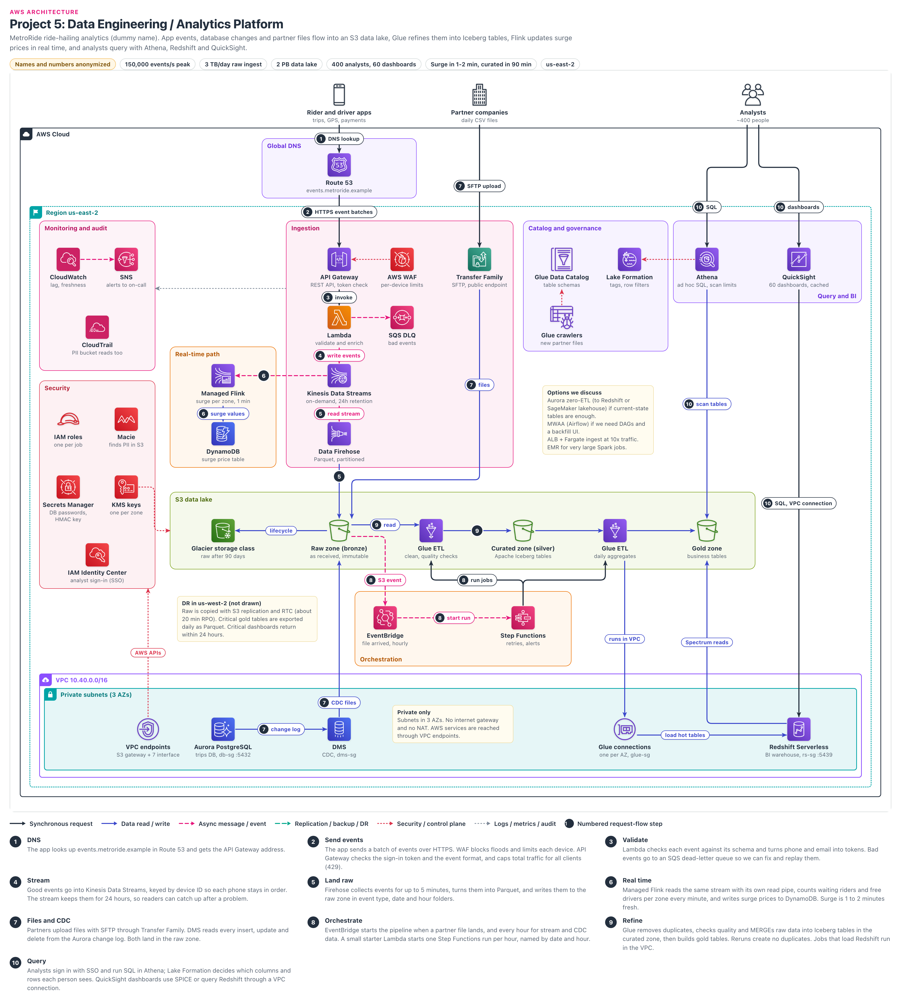

# Data Engineering and Analytics Platform

> **Confidentiality note:** Company names, domain names, IDs and all numbers in this document are dummy values. The architecture, the decisions and the trade-offs are what this document shares.
> Key figures (dummy values): us-east-2, peak 150,000 events/s, 3 TB raw per day, a 2 PB lake, 400 analysts, 60 dashboards, VPC 10.40.0.0/16, Kinesis retention of 24 hours, raw data moves to Glacier after 90 days.
> AWS limits and prices change over time, so treat these figures as approximate.

## Contents

- [Architecture diagram](#architecture-diagram)
- [1. Project name](#1-project-name)
- [2. Business problem](#2-business-problem)
- [3. Architecture overview](#3-architecture-overview)
- [4. Request flow](#4-request-flow)
- [5. Why each AWS service](#5-why-each-aws-service)
  - Services: [Route 53](#route-53) · [API Gateway (REST API)](#api-gateway-rest-api) · [AWS WAF](#aws-waf) · [Lambda](#lambda) · [Amazon SQS (DLQ)](#amazon-sqs-dlq) · [Kinesis Data Streams](#kinesis-data-streams) · [Amazon Data Firehose](#amazon-data-firehose) · [Amazon Managed Service for Apache Flink](#amazon-managed-service-for-apache-flink) · [DynamoDB](#dynamodb) · [AWS Transfer Family (SFTP)](#aws-transfer-family-sftp) · [Aurora PostgreSQL (source)](#aurora-postgresql-source) · [AWS DMS (Database Migration Service)](#aws-dms-database-migration-service) · [Amazon S3 (data lake zones + Glacier storage class)](#amazon-s3-data-lake-zones--glacier-storage-class) · [AWS Glue ETL](#aws-glue-etl) · [Glue Data Catalog and Glue crawlers](#glue-data-catalog-and-glue-crawlers) · [AWS Lake Formation](#aws-lake-formation) · [Amazon EventBridge](#amazon-eventbridge) · [AWS Step Functions](#aws-step-functions) · [Amazon Athena](#amazon-athena) · [Amazon Redshift Serverless](#amazon-redshift-serverless) · [Amazon QuickSight](#amazon-quicksight) · [Amazon VPC and VPC endpoints](#amazon-vpc-and-vpc-endpoints) · [Amazon CloudWatch](#amazon-cloudwatch) · [Amazon SNS](#amazon-sns) · [AWS CloudTrail](#aws-cloudtrail) · [IAM (roles)](#iam-roles) · [IAM Identity Center](#iam-identity-center) · [AWS KMS](#aws-kms) · [AWS Secrets Manager](#aws-secrets-manager) · [Amazon Macie](#amazon-macie)
  - [Key decisions](#key-decisions)
- [5A. Key topics](#5a-key-topics)
  - [Data ingestion (bringing data in: streaming, CDC, batch files)](#data-ingestion-bringing-data-in-streaming-cdc-batch-files)
  - [Data lake zones and table formats](#data-lake-zones-and-table-formats)
  - [ETL design (Glue jobs, idempotent reprocessing, Iceberg)](#etl-design-glue-jobs-idempotent-reprocessing-iceberg)
  - [Data warehouse design (Redshift modeling, Athena vs Redshift)](#data-warehouse-design-redshift-modeling-athena-vs-redshift)
  - [Batch vs streaming (latency, cost, complexity)](#batch-vs-streaming-latency-cost-complexity)
  - [Data partitioning and the small-files problem](#data-partitioning-and-the-small-files-problem)
  - [Security (Lake Formation, KMS, PII handling)](#security-lake-formation-kms-pii-handling)
  - [Cost optimization specific to analytics](#cost-optimization-specific-to-analytics)
- [6. High availability](#6-high-availability)
- [7. Security](#7-security)
- [8. Monitoring](#8-monitoring)
- [9. Disaster recovery](#9-disaster-recovery)
- [10. Scaling (when traffic grows 10x)](#10-scaling-when-traffic-grows-10x)
- [11. Failure scenarios](#11-failure-scenarios)
  - [Failure 1: Firehose (the lake reader) stops or records go missing](#failure-1-firehose-the-lake-reader-stops-or-records-go-missing)
  - [Failure 2: Bad app release, malformed events flood](#failure-2-bad-app-release-malformed-events-flood)
  - [Failure 3: Glue job fails halfway, or bad data](#failure-3-glue-job-fails-halfway-or-bad-data)
  - [Failure 4: DMS CDC task stops (replication slot problem)](#failure-4-dms-cdc-task-stops-replication-slot-problem)
  - [Failure 5: Managed Flink crash, surge stale](#failure-5-managed-flink-crash-surge-stale)
  - [Failure 6: Partner file late, duplicate, or wrong format](#failure-6-partner-file-late-duplicate-or-wrong-format)
  - [Failure 7: Runaway queries, month-end overload](#failure-7-runaway-queries-month-end-overload)
- [12. Cost optimization](#12-cost-optimization)
- [13. Two-minute project walkthrough](#13-two-minute-project-walkthrough)
- [14. Deep-dive questions and answers](#14-deep-dive-questions-and-answers)
  - [Q1. Why do you need both Athena and Redshift? Why not just one?](#q1-why-do-you-need-both-athena-and-redshift-why-not-just-one)
  - [Q2. Why put Kinesis Data Streams in front of Firehose? Firehose can take data directly.](#q2-why-put-kinesis-data-streams-in-front-of-firehose-firehose-can-take-data-directly)
  - [Q3. Why Kinesis instead of Amazon MSK (Kafka)?](#q3-why-kinesis-instead-of-amazon-msk-kafka)
  - [Q4. How do you make sure there are no duplicate events in the lake?](#q4-how-do-you-make-sure-there-are-no-duplicate-events-in-the-lake)
  - [Q5. Why Apache Iceberg? Why not plain Parquet, Delta Lake or Hudi?](#q5-why-apache-iceberg-why-not-plain-parquet-delta-lake-or-hudi)
  - [Q6. How does CDC from Aurora work, and why DMS instead of Aurora zero-ETL?](#q6-how-does-cdc-from-aurora-work-and-why-dms-instead-of-aurora-zero-etl)
  - [Q7. Why Step Functions instead of MWAA (Airflow)?](#q7-why-step-functions-instead-of-mwaa-airflow)
  - [Q8. How do you handle late-arriving and out-of-order events?](#q8-how-do-you-handle-late-arriving-and-out-of-order-events)
  - [Q9. How do analysts get access, and how do you hide PII columns?](#q9-how-do-analysts-get-access-and-how-do-you-hide-pii-columns)
  - [Q10. A customer asks you to delete their data. How do you do that in an immutable data lake?](#q10-a-customer-asks-you-to-delete-their-data-how-do-you-do-that-in-an-immutable-data-lake)
  - [Q11. Yesterday's revenue on the dashboard is wrong. How do you debug and fix it?](#q11-yesterdays-revenue-on-the-dashboard-is-wrong-how-do-you-debug-and-fix-it)
  - [Q12. The mobile team adds a new field or changes a field type. What breaks?](#q12-the-mobile-team-adds-a-new-field-or-changes-a-field-type-what-breaks)
  - [Q13. Why Lambda in the ingest path? When would you remove it?](#q13-why-lambda-in-the-ingest-path-when-would-you-remove-it)
  - [Q14. What happens if us-east-2 goes down?](#q14-what-happens-if-us-east-2-goes-down)
  - [Q15. Why Redshift Serverless instead of a provisioned RA3 cluster?](#q15-why-redshift-serverless-instead-of-a-provisioned-ra3-cluster)
  - [Q16. Your VPC has no NAT gateway. How do Glue jobs and DMS reach AWS services?](#q16-your-vpc-has-no-nat-gateway-how-do-glue-jobs-and-dms-reach-aws-services)
- [Glossary](#glossary)

## Architecture diagram

### How to read the diagram

- **Top to bottom in the middle (the ingestion spine):** Apps → Route 53 → API Gateway → Lambda → Kinesis → Firehose → S3 raw zone. This is the main streaming path.
- **Numbered badges (1 to 10):** these are the steps in section 4.
  - Step 6 on the left is the real-time path (Flink, DynamoDB). Step 7 is partner files and Aurora CDC. Steps 8 and 9 at the bottom are orchestration and Glue ETL.
  - Step 10: Athena and QuickSight at the top right; Redshift Serverless at the bottom right inside the VPC (with a VPC connection arrow from QuickSight).
- **Green band (S3 data lake):** Raw → Glue → Curated → Glue → Gold. Data gets cleaner as it moves from left to right. To the left of Raw is Glacier (lifecycle after 90 days).
- **Left panels:** Monitoring (CloudWatch, SNS, CloudTrail) and Security (IAM roles, Macie, Secrets Manager, KMS, IAM Identity Center). **VPC at the bottom:** Aurora, DMS, Glue connections (one per AZ, with a load arrow from there to Redshift), Redshift Serverless and VPC endpoints. There is no IGW and no NAT.
- **Notes:** "Options we discuss" (zero-ETL, MWAA, ALB + Fargate, EMR) and "DR in us-west-2" (raw replication, gold exports). The DR region is not drawn as a box; it is only a note.
- **Arrow colors:** black line = synchronous request, blue line = data read/write, pink dashes = async event, red dots = security/control, grey dots = logs/metrics.

## 1. Project name

- **MetroRide Analytics and Data Platform:** a data lake on S3 that combines both streaming and batch data (Glue, Athena, Redshift).
- In one line: we bring app events, database changes and partner files into one S3 lake, clean them with Glue, and give them to analysts through Athena, Redshift and QuickSight. There is also a small real-time path for surge pricing.

## 2. Business problem

### Who is the company?

- MetroRide is a ride-hailing company. It is an app like Uber.
- Every ride creates a lot of data: trip events (request, accept, start, end), driver GPS pings (every 4 seconds), payments and marketing campaigns.
- 400 analysts, data scientists and managers write SQL, look at 60 dashboards and run ML feature pipelines.

### What were the problems?

1. **All data was scattered:** trips were in Aurora, GPS was in an old Kafka cluster, and partner files were on an FTP server. To answer "Which city had the most revenue yesterday?", you had to go to 3 teams.
2. **Reports ran on the production database:** analysts ran heavy SQL on an Aurora replica. At month-end, replica lag grew and the app also became slow.
3. **Surge price changed too late:** surge was calculated only once every 15 minutes. (Surge pricing: when demand is high and drivers are few, the price goes up, and then more drivers come online.)
   - One case: on a Friday at 6 PM it rained and requests tripled, but the price did not change until 6:15. Riders waited 20 minutes and cancelled, and revenue was lost.
4. **No PII control:** tables with phone numbers were visible to everyone. There was no audit of who read what.
5. **Cost was not understood:** if an analyst scanned terabytes with a single query, nobody knew.

### Constraints

- The data platform team has 8 people. They have no time to run clusters, so the platform must be managed or serverless.
- We must not put extra load on Aurora. Data must stay in us-east-2.

### What did the company need?

| Need | Target | In simple words |
|---|---|---|
| Peak ingest | 150,000 events/s | This many events per second during the evening rush, and not a single one may be lost |
| Daily volume | 3 TB/day raw, lake 2 PB | Years of history, but kept cheaply |
| Event API availability | 99.9% | It may be down for about 43 minutes per month. Apps buffer on the phone and send again |
| Surge freshness | About 1 to 2 minutes | The price must change within 2 minutes of demand going up |
| Curated freshness | Under 90 minutes | Hourly Glue runs |
| Dashboard speed | p95 under 3 seconds | 95% of dashboard loads finish within 3 seconds |
| RTO / RPO (if an AZ is lost) | Ingest RTO about 0; processing and dashboards a few minutes / RPO 0 | No data is lost. Flink and Redshift take a few minutes to restart in another AZ |
| RTO / RPO (if a region is lost) | Critical dashboards 24 hours / raw about 20 minutes | Because this is analytics, we can wait a day, but we must not lose much data |
| Security | PII only for a few people, audit of who read what | Column and row permissions, CMK encryption, S3 data events |

### Why this architecture?

- **S3 is the single source of truth:** storage is cheap, and compute (Athena, Glue, Redshift) is separate, so we pay only when we use it.
- **One stream, many readers:** Firehose (for the lake) and Flink (for surge) read the Kinesis stream separately.
- **Very little load on Aurora:** DMS reads only the database change log (WAL), with no heavy SQL. The only risk: if DMS stops, the WAL piles up (Failure 4).
- **Mostly serverless, with governance in one place:** tables live in the Glue Data Catalog, permissions live in Lake Formation, and every engine follows the same rules.

## 3. Architecture overview

- Each service is explained in detail in section 5. Here is only a quick look, layer by layer.

### Internet and DNS

- **Data comes from three places:** mobile apps (events), partners (daily CSV files) and Aurora (database changes).
- **Route 53** (AWS's DNS service, which turns a name into an address): points `events.metroride.example` to the API Gateway custom domain with an alias record.

### Edge (API entry)

- **WAF** (web application firewall): stops floods, bad IPs and too many requests from a single device (the per-device limit lives here).
- **API Gateway (REST, regional)** (the managed front door for APIs): HTTPS event batches, token check, format check and a throttling ceiling for the whole API. There is no CloudFront (AWS's CDN): everything is a POST write, so there is nothing to cache.

### Messaging (streaming ingest)

- **Lambda** (runs code without servers) validates and enriches events and writes them to **Kinesis Data Streams** (an ordered stream of events that many readers can read). Bad events go to an **SQS DLQ** (a queue that keeps failed messages).
- **Firehose** (a delivery service that buffers a stream and writes files) takes data from the stream and writes it to the raw zone as Parquet files. **Flink** (a real-time stream processing engine) reads the same stream, calculates surge and writes it to **DynamoDB** (a fast serverless key-value database).
- **Transfer Family (SFTP)** (a managed file transfer server) and **DMS (CDC)** (a service that copies database changes) also write to the raw zone.

### Data (S3 data lake)

- **S3** (AWS object storage) holds the lake in three zones.
- **Raw (bronze):** data exactly as it arrived; we do not edit it. If a job has a bug, we rebuild from here. After 90 days it moves to Glacier Flexible Retrieval (a cheap archive storage class).
- **Curated (silver):** clean data with duplicates removed, types fixed and PII masked. These are Apache Iceberg tables (Iceberg: a format that lets you use Parquet files in S3 like a database table. You can update and delete rows and roll back to an older version).
- **Gold:** ready tables that business users use directly. For example: trips per day in each city, driver earnings, ML features.
- **Aurora PostgreSQL** (AWS's managed relational database): the main database used by the ride app. We only read its change log.

### Application (processing, query)

- **EventBridge → Step Functions → Glue ETL:** the pipeline runs when a file arrives or every hour. (EventBridge is an event router and scheduler, Step Functions is a workflow engine, and Glue ETL runs serverless Spark jobs.)
- **Glue Data Catalog + Lake Formation:** the list of tables in one place, and who can see which column or row in one place.
- **Athena:** SQL directly on S3 files, with no server, for questions that come up on the spot. **Redshift Serverless:** a fast data warehouse for dashboards. **QuickSight:** the AWS BI tool for charts and dashboards.

### Network (VPC)

- VPC (our private network in AWS) 10.40.0.0/16, with only private subnets across 3 AZs. No IGW (internet gateway) and no NAT.
- Inside: Aurora (db-sg :5432), DMS (dms-sg), Glue connections (glue-sg, one per AZ) and Redshift Serverless (rs-sg :5439).
- **VPC endpoints:** an S3 gateway plus interface endpoints; the list is in section 5.

### Security

- One IAM role per job. Analysts sign in through IAM Identity Center (SSO).
- KMS keys per zone (KMS is the encryption key service), passwords in Secrets Manager, and Macie PII scans (Macie finds sensitive data in S3).

### Monitoring

- Metrics, logs and alarms (lag, freshness, errors) are in CloudWatch. When an alarm fires, SNS (a notification service) sends it to on-call. CloudTrail (the audit log of API calls) records every API call and the S3 reads on PII buckets.

### DR (Disaster Recovery)

- Single region, with Multi-AZ inside it. Raw data is copied to us-west-2 with S3 Replication.
- If the region is lost, the pricing service falls back to the default surge (1.0x).

## 4. Request flow

- Streaming: `Apps → Route 53 → API Gateway (WAF) → Lambda → Kinesis Data Streams → Data Firehose → S3 raw`
- Real time: `Kinesis Data Streams → Managed Flink → DynamoDB (surge table)`
- Files, CDC: `Partners → Transfer Family → S3 raw`, `Aurora → DMS → S3 raw`
- Refine, query: `S3 event / hourly schedule → EventBridge → Step Functions → Glue → Curated (Iceberg) → Glue → Gold → Athena / Redshift → QuickSight`
- The step numbers below match badges 1 to 10 in the diagram. All times are rough.

### Step 1: DNS (Route 53)

- The app does a DNS lookup for `events.metroride.example` (UDP/TCP 53). The alias record returns the API Gateway regional custom domain address.
- Because of the phone's DNS cache this is usually 0 ms; otherwise a few tens of ms. Route 53 query logging is on.

### Step 2: Send events (API Gateway + WAF)

- The app takes a GPS reading every 4 seconds and sends one batch about every 15 to 20 seconds (about 5 events per batch). HTTPS POST, port 443. That means about 30,000 requests/s at peak.
- **WAF first:** rate-based rules (IP, `device-id` header) and managed rule groups.
- **Lambda authorizer** (a small function that checks the token): it checks that the sign-in token the app got at login (a JWT: like a signed digital ID card) is genuine. The result is cached for about 5 minutes.
- The request validator checks the body format. Stage/method throttling is one ceiling for all traffic; above it the caller gets a 429.
- Time: TLS + WAF + cached authorizer take about 10 to 40 ms.

### Step 3: Validate (Lambda + SQS DLQ)

- API Gateway calls Lambda synchronously (proxy integration: the whole request goes to Lambda unchanged, and Lambda's reply goes back to the app).
- Each event gets a JSON schema check; city and app version are added; the code checks that `event_id` is present. Phone and email are turned into an HMAC token right here (see section 5A, Security).
- Bad events go to the SQS DLQ, and good events move forward. Security: the Lambda resource policy allows invoke only from this API ARN.
- Time: about 20 to 60 ms (arm64, warm).

### Step 4: Stream (Kinesis Data Streams)

- Inside a Kinesis stream there are many lanes, and each lane is called a **shard**. **Partition key** = `device_id`: events from the same phone always go to the same shard, so the order does not change.
- `PutRecords` (up to 500 records in one call) can return a partial failure (`FailedRecordCount`). Only the failed records are retried with backoff; if they still fail, the app gets a 5xx and sends again.
- Kinesis reports success only after copying the data across 3 AZs. It keeps data for 24 hours. Time: about 10 to 30 ms, and the total p95 for the app is about 150 ms.

### Step 5: Land raw (Data Firehose → S3 raw zone)

- Firehose buffer: a file is written at 128 MB in size or 300 s in time, whichever comes first. It converts JSON into Parquet (the schema comes from a Glue table).
- Dynamic partitioning: `raw/events/event_type=gps/dt=2026-09-25/hour=18/`.
- Firehose does not sit in our VPC; it writes to S3 from the AWS side. Files are encrypted with the raw-zone KMS key. Time: from a few seconds to about 5 minutes.

### Step 6: Real time (Managed Flink → DynamoDB)

- **Enhanced fan-out:** Flink gets its own read path (about 2 MB per second per shard), so it does not have to share with Firehose.
- `keyBy(zone)`, with one box every 1 minute (tumbling window: 6:00-6:01, 6:01-6:02, no overlap). In that minute it counts, per zone, the riders who are waiting and the drivers who are free.
- Allowed lateness is 30 seconds, which is more than the app batch interval (20 s); otherwise pings would be dropped.
- Surge is upserted into DynamoDB with the `zone_id` key (a new row if none exists, an update if it does).
- To stop an old window from overwriting a newer one, we use `UpdateItem` + `ConditionExpression` (`window_end < :new`).
- The standard Flink DynamoDB sink uses `BatchWriteItem`, which has no condition, so we use a small custom sink (there are only a few thousand zones, so cost is not a problem).
- Security: the Flink role can only read this stream and write to the surge table. The table uses a CMK. Time: within a few seconds of the window closing, with total freshness of 1 to 2 minutes.

### Step 7: Files and CDC (Transfer Family, DMS, Aurora)

- **Partner files:** SFTP (port 22). Each partner has its own SSH key and can reach only its own folder (`raw/partners/<partner>/`). Files go straight into S3.
- **CDC (change data capture):** DMS reads every insert, update and delete from Aurora logical replication (WAL). dms-sg → db-sg :5432, over TLS.
- DMS writes Parquet files into `raw/cdc/trips/`. Each row has `Op` (I/U/D), the commit timestamp and `AR_H_CHANGE_SEQ` (an increasing sequence). It reaches S3 through the S3 gateway endpoint.
- Time: CDC within a few minutes; partner files once a day.

### Step 8: Orchestrate (EventBridge → Step Functions)

- **Partner files:** an EventBridge rule matches `Object Created` on `raw/partners/` and starts the pipeline.
- **Streaming, CDC:** one run per file would mean thousands of runs, so these use an hourly schedule.
- When an EventBridge rule targets Step Functions, the execution name is auto-generated, and in Scheduler the name is static. So a small starter Lambda works out dt/hour and calls `StartExecution(name='trips-2026-09-25-18')`.
- In a Standard workflow, a second run with the same name will not start for up to 90 days (if we get `ExecutionAlreadyExists`, we skip). For a deliberate rerun: `trips-2026-09-25-18-rerun-1`.
- Security: the starter role has only `states:StartExecution` on this state machine. Time: a few seconds.

### Step 9: Refine (Glue ETL → Curated → Gold)

- Step Functions starts the Glue job and waits by itself until it finishes (`.sync` integration: we do not have to write status-check code). `dt` and `hour` are job parameters.
- **Glue ETL 1 (clean):** reads one hour from raw, then:
  - removes duplicates using `event_id`
  - fixes types and masks PII
  - checks Glue Data Quality rules
  - does a `MERGE` into the curated Iceberg table (update the row if it exists, insert it if not). For CDC, only the latest change per `trip_id` is used, and if `Op = D` the row is deleted.
- **Glue ETL 2 (aggregate):** curated to gold. Redshift load jobs run inside the VPC through Glue connections (glue-sg).
- If quality fails, promotion to gold stops, and after retries an SNS alert goes out. Time: hourly runs take about 10 to 20 minutes, daily runs 30 to 60 minutes.

### Step 10: Query (Athena, QuickSight, Redshift, Lake Formation)

- Analysts sign in with SSO and write SQL in Athena. Athena asks Lake Formation "which columns and rows can this user see?" and only then scans.
- Workgroup per-query scan limit (1 TB).
- QuickSight reads from SPICE (its memory cache), or from Redshift Serverless through a VPC connection to rs-sg :5439.
- Time: SPICE about 1 second, Redshift a few seconds, Athena from seconds to minutes.

### Other flows

- **DLQ replay:** after a fix, a replay Lambda sends events from the DLQ back to Kinesis. SQS retention is at most 14 days, so we also keep an S3 quarantine copy.
- **Catalog:** crawlers scan partner folders and create tables. Glue jobs register the Iceberg tables themselves.
- **Macie** findings and **telemetry** alarms go to SNS through EventBridge/CloudWatch.

## 5. Why each AWS service

### Route 53

**What it is:** AWS's managed DNS service.

**Why we used it:** it points `events.metroride.example` to the API Gateway custom domain with an alias record.

**Problem it solves:** apps do not need a hardcoded AWS URL. If the backend changes, only DNS changes.

**Alternatives:** the old DNS provider (for example, Cloudflare).

**Why not the alternative:** AWS alias support, everything in one place in IaC, and easy record changes during DR.

### API Gateway (REST API)

**What it is:** a managed API front door. It authorizes, validates and throttles HTTPS requests and sends them to the backend.

**Why we used it:** apps send events with the JWT they already have, without being given AWS credentials. Validator and WAF are built in.

**Problem it solves:** a stable contract for apps and one throttling ceiling for all traffic. The per-device limit is in WAF (an API key inside a mobile app is not a secret).

**Alternatives:** HTTP API, an ALB + Fargate ingest service, or apps writing straight to Kinesis.

**Why not the alternative:** HTTP API has no WAF and no validator, and direct Kinesis needs AWS credentials on phones. ALB + Fargate is cheaper at this scale, and that is a later plan (Q13).

### AWS WAF

**What it is:** a firewall that looks inside HTTP requests (URL, headers, body) and blocks them (Layer 7, meaning the application level).

**Why we used it:** rate-based rules (IP, with the `device-id` header as an aggregation key) and AWS managed rule groups.

**Problem it solves:** it stops floods and broken app loops before Lambda and Kinesis costs go up.

**Alternatives:** API Gateway throttling alone, or Shield Advanced.

**Why not the alternative:** throttling cannot single out one bad device, and because of Carrier NAT (on mobile networks, thousands of phones sit behind one public IP), an IP rule alone is also not enough. Shield Advanced (about $3,000 per month) is not needed now.

### Lambda

**What it is:** a service that runs code without servers; you pay per ms of run time.

**Why we used it:** batch validation, enrichment, PII tokenization and `PutRecords`. arm64 (about 20% cheaper).

**Problem it solves:** bad data is stopped before it enters the lake.

**Alternatives:** API Gateway direct Kinesis integration.

**Why not the alternative:** even with a validator in the direct setup, one wrong event makes the whole batch fail with 400. Per-event DLQ, enrichment and partial retry are not possible, and VTL (a small template language in API Gateway that changes the request) allows only simple reshaping.

### Amazon SQS (DLQ)

**What it is:** a managed queue. Here it is a dead-letter queue: it keeps messages that failed.

**Why we used it:** Lambda sends events that fail the schema check here, together with the reason.

**Problem it solves:** bad events are not silently lost, and we replay them after a fix.

**Alternatives:** only an S3 quarantine prefix.

**Why not the alternative:** SQS gives easy depth alarms and redrive. Retention is at most 14 days, so we keep an S3 copy too.

### Kinesis Data Streams

**What it is:** a conveyor belt that keeps events in order for a while (here 24 hours). It copies data across 3 AZs, and many readers can read separately and read again and again.

**Why we used it:** Firehose and Flink must read the same events. On-demand mode (no shard count to manage), with On-demand Advantage for cost (section 12).

**Problem it solves:** it separates apps from readers, so if one reader is slow, the others are not affected.

**Alternatives:** Amazon MSK, or Firehose Direct PUT.

**Why not the alternative:** MSK means operating brokers (Q3), and Direct PUT has no replay and no second reader (Q2). There is a plan to raise retention to 3 days to cover weekend incidents.

### Amazon Data Firehose

**What it is:** a managed service that buffers stream data and writes it to places like S3.

**Why we used it:** JSON → Parquet, written to the raw zone in `event_type/dt/hour` folders.

**Problem it solves:** the file-writing code and retries are not ours to build. If S3 is down, it retries for up to about 24 hours.

**Alternatives:** Flink/Glue streaming into Iceberg, or the new (August 2026) Kinesis direct delivery (S3 Tables streaming tables, or an S3 bucket; on-demand streams only).

**Why not the alternative:** a streaming job means we own it 24x7. Direct delivery is JSON only (no Parquet, no dynamic partitioning), and streaming tables are new, so they are only in a pilot.

### Amazon Managed Service for Apache Flink

**What it is:** an engine that does calculations while data is still arriving. It remembers running counts per zone (state), which survive a crash, and every event is counted exactly once.

**Why we used it:** supply vs demand and surge per zone in 1-minute windows.

**Problem it solves:** surge goes from 15 minutes to 1 to 2 minutes. It handles late pings with a watermark (a marker that says "events up to this time have arrived").

**Alternatives:** a Lambda Kinesis consumer, or Spark Structured Streaming.

**Why not the alternative:**
- Lambda has tumbling windows (up to 15 minutes), but its state is per shard and only about 1 MB.
- The key is `device_id`, so one zone's pings land on all shards, and a cross-shard count is not possible. Flink does this with `keyBy(zone)` + checkpoints (saving state to S3 every few seconds).
- Spark micro-batch (small batches) means we run the cluster.

### DynamoDB

**What it is:** a serverless key-value database with single-digit ms reads.

**Why we used it:** the surge table: `zone_id`, multiplier, `window_end`, TTL. On-demand.

**Problem it solves:** the latest surge is available fast at booking time.

**Alternatives:** ElastiCache (Valkey), or an Aurora table.

**Why not the alternative:** an ElastiCache cluster would be ours to run. Aurora would mean thousands of upserts every minute on the app database.

### AWS Transfer Family (SFTP)

**What it is:** a managed SFTP server that puts files straight into S3.

**Why we used it:** partners send daily CSV files. Each partner has an SSH key, its own folder and a scoped role. The VPC has no IGW, so we use the **public endpoint type** (AWS managed, outside the VPC).

**Problem it solves:** the operations work of the old FTP server is gone, and nothing changes on the partners' side.

**Alternatives:** an EC2 SFTP server, or S3 presigned URLs.

**Why not the alternative:**
- EC2 means we run the server ourselves.
- Note: the public endpoint has no security group. If we need a partner IP allowlist, we use a VPC hosted internet-facing endpoint (IGW + Elastic IPs) in a separate small ingress VPC.
- Or we check the source IP in a custom identity provider Lambda. The data VPC stays private either way.

### Aurora PostgreSQL (source)

**What it is:** AWS's relational database, with 6 copies of storage across 3 AZs.

**Why we used it:** it is the ride app's trips database (owned by the app team); for us it is only a source (db-sg :5432).

**Problem it solves:** the real data for trips and payments lives here. We only read the change log.

**Alternatives:** a read replica for analysts (the old way).

**Why not the alternative:** heavy SQL pushed the replica into lag, it has no history, and it cannot be joined with GPS data.

### AWS DMS (Database Migration Service)

**What it is:** a managed service that copies data between databases: full load and CDC.

**Why we used it:** every Aurora change goes to the raw zone as Parquet. Multi-AZ instance, dms-sg.

**Problem it solves:** no nightly dumps, and we get full history including deletes and updates.

**Alternatives:** Aurora zero-ETL (to Redshift, or since October 2025 to SageMaker lakehouse as Iceberg tables), or Debezium (an open-source CDC tool).

**Why not the alternative:** zero-ETL gives only a latest-state replica, and we need the history of every change in our own raw zone (Q6). Debezium needs a Kafka stack.

### Amazon S3 (data lake zones + Glacier storage class)

**What it is:** object storage. The chance of losing data is almost zero (11 nines durability), and there is almost no size limit.

**Why we used it:**
- Three zones: raw, curated (Iceberg) and gold. Each zone has its own bucket and its own KMS key, with Versioning on.
- Raw moves to Glacier Flexible Retrieval after 90 days.

**Problem it solves:** storage and compute are separate, and every engine uses the same files.

**Alternatives:** everything in Redshift storage, or S3 Tables (managed Iceberg with automatic maintenance).

**Why not the alternative:** 2 PB in a warehouse is expensive. The team already runs Iceberg, and we are evaluating S3 Tables for new tables.

### AWS Glue ETL

**What it is:** Spark jobs without servers, billed per second of DPU (compute unit) use.

**Why we used it:** raw → curated → gold, with auto scaling and Flex. VPC jobs get one Glue connection per AZ (section 6).

**Problem it solves:** TBs of data without a cluster, with native support for Iceberg and LF.

**Alternatives:** Amazon EMR, or dbt in Redshift (a tool for writing transformations in SQL).

**Why not the alternative:** with EMR, cluster tuning is ours, so only jobs of hundreds of TB go to EMR. dbt would make the warehouse the source, not the lake.

### Glue Data Catalog and Glue crawlers

**What it is:** the Catalog is one place that lists tables, columns and partitions. Crawlers are jobs that scan S3 folders and create tables.

**Why we used it:** one set of definitions for every engine and for the Firehose Parquet schema. Crawlers are used only for partner folders, and Iceberg table optimizers are on.

**Problem it solves:** the confusion of "where is this table, and what does this column mean" goes away.

**Alternatives:** our own Hive metastore (an open-source catalog database that stores the list of tables, which we would have to run).

**Why not the alternative:** the metastore DB would become ours to run, and LF works only on top of the Glue Catalog.

### AWS Lake Formation

**What it is:** data lake permissions: grants at table, column, row and cell level.

**Why we used it:** LF-tags (`sensitivity=pii|internal`, `domain=trips|payments`) and a row filter for city managers.

**Problem it solves:** hundreds of tables do not each need their own policy, and every engine follows the same rules.

**Alternatives:** S3 + IAM policies, or copy tables for each team.

**Why not the alternative:** IAM works only down to the folder level, not column or row. Copies mean sync problems.

### Amazon EventBridge

**What it is:** a serverless event router and scheduler.

**Why we used it:** partner `Object Created` → Step Functions, and hourly schedule → starter Lambda. Also Glue and Macie events.

**Problem it solves:** trigger logic lives in configuration, and adding a new target is easy.

**Alternatives:** S3 event notifications straight to Lambda/SQS.

**Why not the alternative:** S3 notifications have less filtering and no archive or replay.

### AWS Step Functions

**What it is:** a serverless workflow engine: steps, retries and error handling.

**Why we used it:** a Standard workflow: clean → quality → aggregate, with `.sync`, Retry 3 times and Catch → SNS.

**Problem it solves:** dependencies, retries, alerts and run history in one place.

**Alternatives:** Amazon MWAA (provisioned, or MWAA Serverless since November 2025), or Glue Workflows.

**Why not the alternative:** the pipelines are simple and the team has no Airflow experience. "MWAA has an idle cost" is true only for provisioned MWAA (Q7).

### Amazon Athena

**What it is:** serverless SQL (based on Trino) directly on S3; you pay per TB scanned (about $5).

**Why we used it:** ad hoc queries. Each team gets a workgroup with a scan limit and cost tags.

**Problem it solves:** SQL over 2 PB without a cluster.

**Alternatives:** everything in Redshift, or Trino on EMR.

**Why not the alternative:** ad hoc work and dashboards are different workloads (Q1). A Trino cluster would be ours to run.

### Amazon Redshift Serverless

**What it is:** a SQL data warehouse for reports. It stores data by column and spreads each query across many nodes (MPP). You pay per RPU hour.

**Why we used it:** 60 dashboards on a star schema (a big fact table in the middle with small dimension tables around it; see 5A). The last 13 months are stored locally, and older data is read through Spectrum (querying S3 files directly from Redshift).

**Problem it solves:** a few seconds even when many people open dashboards at once, thanks to materialized views (results calculated in advance and stored) and the result cache.

**Alternatives:** Provisioned RA3, or Athena alone.

**Why not the alternative:** the load changes during the day, and there is no charge when idle. Serverless Reservations exist even for steady load, so RA3 is not the automatic choice (Q15).

### Amazon QuickSight

**What it is:** the AWS BI (dashboards) service, with the SPICE memory cache (now part of Amazon Quick Suite).

**Why we used it:** 60 dashboards. Popular datasets are in SPICE, and the rest go to Redshift through a VPC connection.

**Problem it solves:** BI without servers, and not every dashboard open sends a query to the warehouse.

**Alternatives:** Tableau, Power BI, Looker.

**Why not the alternative:** separate licenses and connectivity. Tableau teams can still connect to Redshift, and the lake does not change.

### Amazon VPC and VPC endpoints

**What it is:** a VPC is our private network in AWS. Endpoints are paths to reach AWS services without the internet or NAT.

**Why we used it:** an S3 gateway endpoint (free), plus interface endpoints for Glue, Lake Formation, KMS, STS, Secrets Manager, CloudWatch Logs and CloudWatch (the diagram shows this as "S3 gateway + 7 interface").

**Problem it solves:** data resources have no path to the internet, and there is no NAT per-GB charge.

**Alternatives:** NAT Gateway.

**Why not the alternative:** NAT costs about $0.045/GB and carries the risk of data being secretly sent out (exfiltration).

### Amazon CloudWatch

**What it is:** metrics, logs, alarms and dashboards.

**Why we used it:** alarms on iterator age, freshness, DLQ depth, Glue failures and DMS lag.

**Problem it solves:** pipelines can fail even without an error (data simply stops arriving), and freshness metrics catch that.

**Alternatives:** Datadog, Grafana.

**Why not the alternative:** managed services send their metrics here by default, with no agents.

### Amazon SNS

**What it is:** pub/sub notifications: publish to one topic and every subscriber gets it.

**Why we used it:** sends alarms and pipeline failures to the paging tool and to team chat.

**Problem it solves:** one alarm reaches many places at the same time.

**Alternatives:** EventBridge.

**Why not the alternative:** SNS is the standard, simple choice for alarm actions.

### AWS CloudTrail

**What it is:** an audit service that records every AWS API call (who, when, what).

**Why we used it:** management events, S3 data events for PII buckets, and a log-archive bucket.

**Problem it solves:** answers "who read this phone number?"

**Alternatives:** S3 server access logs.

**Why not the alternative:** access logs are best-effort. Data events for all buckets are expensive, so we enable them only for sensitive buckets.

### IAM (roles)

**What it is:** the service that decides who can do what. Roles give temporary credentials, with no passwords.

**Why we used it:** one role per job:

| Role | What it can do (only this) |
|---|---|
| Ingest Lambda | `kinesis:PutRecords` on one stream, `sqs:SendMessage` on the DLQ, read the HMAC key |
| Firehose | read the stream, write to `raw/events/` |
| Clean Glue job | read raw, write to curated |
| DMS | write to `raw/cdc/` |

**Problem it solves:** even if one job is hacked, it can damage only its own small task (a small blast radius).

**Alternatives:** one role for all pipelines.

**Why not the alternative:** a buggy job could overwrite gold, and the audit would not show which job did what.

### IAM Identity Center

**What it is:** workforce SSO: AWS access through the company identity provider (Okta, Entra ID).

**Why we used it:** 400 analysts log in once. Trusted identity propagation: the analyst's own name reaches Athena and Redshift, so LF permissions and the audit work on the person's name.

**Problem it solves:** disabling someone in SSO removes their access everywhere.

**Alternatives:** an IAM user per analyst.

**Why not the alternative:** long-lived keys, which we forget to remove during offboarding.

### AWS KMS

**What it is:** the encryption keys service. Keys never leave it, and every use is logged in CloudTrail.

**Why we used it:** one customer managed key (CMK) per zone, and also for Kinesis, DynamoDB and Redshift. Bucket Keys are on.

**Problem it solves:** the key policy is a second lock: even if a bucket policy is open, nobody can read the data without decrypt permission.

**Alternatives:** SSE-S3, or the `aws/s3` managed key.

**Why not the alternative:** their key policy is not under our control, and we cannot separate them by zone.

### AWS Secrets Manager

**What it is:** a service that stores passwords and keys and rotates them automatically.

**Why we used it:** DMS and Glue passwords (30-day rotation) and the HMAC key.

**Problem it solves:** no hardcoded passwords.

**Alternatives:** Parameter Store SecureString.

**Why not the alternative:** it has no built-in rotation, and DMS and Glue use Secrets Manager natively.

### Amazon Macie

**What it is:** a service that finds sensitive data such as PII in S3.

**Why we used it:** automated discovery (sampling) across all lake buckets.

**Problem it solves:** we find out if phone numbers show up in gold or card data shows up in a partner file.

**Alternatives:** Glue sensitive data detection alone.

**Why not the alternative:** we use Glue detection too, and Macie is an independent check from outside. A full scan is expensive, so we use sampling.

### Key decisions

| Decision | Chosen | Rejected | Why |
|---|---|---|---|
| Streaming backbone | Kinesis (On-demand Advantage) | Amazon MSK | No brokers or partitions to manage, native with Firehose/Flink (Q3) |
| Lake landing | Kinesis → Firehose | Firehose Direct PUT | Flink must read too, and we need replay (Q2) |
| Curated format | Apache Iceberg | Plain Parquet, Delta, Hudi | Row update/delete, safe commits, rollback (Q5) |
| Orchestration | Step Functions | MWAA (provisioned / Serverless) | Pipelines are simple, `.sync`, team has no Airflow experience (Q7) |
| ETL engine | Glue | EMR | No cluster ops; only big steady jobs go to EMR |
| Query engines | Athena + Redshift Serverless | A single engine | Ad hoc and dashboards are different workloads (Q1) |
| Warehouse type | Redshift Serverless (+ Reservations) | Provisioned RA3 | Load changes, no pay when idle (Q15) |
| Aurora data | DMS CDC → S3 | Aurora zero-ETL (Redshift / SageMaker lakehouse) | We need the history of every change in our own raw zone (Q6) |

## 5A. Key topics

### Data ingestion (bringing data in: streaming, CDC, batch files)

| Source | Path | Latency | Main thing to watch |
|---|---|---|---|
| App events | API Gateway → Lambda → Kinesis → Firehose → S3 | A few minutes | At-least-once, dedupe with `event_id` |
| Aurora trips DB | DMS CDC → S3 | A few minutes | Replication slot, WAL growth |
| Partner files | Transfer Family SFTP → S3 | Once a day | Late / duplicate / malformed files |

- **Push vs pull:** apps and partners push, and we pull from Aurora (DMS). All three go to the same raw zone.
- **Contract:** every event must have `event_id`, `event_type`, `schema_version`, `event_time` (phone time) and `received_at` (server time).
- **Schema versioning:** schemas live in Git. A new optional field is OK. Removing a field or changing a type = a new `schema_version`.
- **Delivery:** retries in the app, Lambda and Firehose can create duplicates. We do not claim "exactly once": it is at-least-once + downstream dedupe.

### Data lake zones and table formats

| Zone | What it holds | Format | Who reads it | Retention |
|---|---|---|---|---|
| Raw (bronze) | As it arrived, immutable, PII tokens only | Parquet, CSV (partners) | Glue jobs, a few engineers | Glacier after 90 days, expires after 15 months |
| Raw restricted | CDC/partner PII columns | Parquet, CSV | Only the clean Glue job | 30 days |
| Curated (silver) | Clean, deduped, PII masked | Iceberg | Data scientists, Athena | Many years, Intelligent-Tiering |
| Gold | Business tables, ML features | Iceberg | Analysts, Redshift, QuickSight | Many years |

- **What a table format means:** a metadata layer on top of Parquet files that tracks "which files and which snapshot belong to this table".
- **The problem with plain Parquet:** no update or delete, and if a job fails halfway, a reader sees half the data.
- **Intelligent-Tiering:** S3 watches how often files are read and moves them to a cheaper tier by itself.

| Iceberg feature | Simple meaning | Why we need it |
|---|---|---|
| ACID commit | A write either completes fully or does not show up at all | Even if a Glue job fails halfway, analysts do not see half the data |
| Row-level MERGE / DELETE | Update or delete one row without rewriting the whole folder | CDC updates, customer delete requests |
| Time travel | Query an old version, like "what did the table look like yesterday at 6 PM" | Rollback and debugging after a bad run |
| Schema evolution | Add or rename a column without rewriting old files | When the mobile team adds a new field |
| Hidden partitioning | Users do not need to know the partition column name | Write `WHERE event_time ...` and Iceberg skips folders by itself |

- **Maintenance is a must:** compaction (combining small files), snapshot expiry and orphan file cleanup. These run automatically with Glue Catalog table optimizers.

### ETL design (Glue jobs, idempotent reprocessing, Iceberg)

- **What idempotent means:** whether you run the same job with the same input once or five times, the result is the same.
- **How:** the job input = one partition (`dt`, `hour`), passed as an explicit parameter. The output is an Iceberg `MERGE` on a key (`event_id` for events, `trip_id` for trips). A rerun updates the same rows.
- **Late data:** if a phone is offline, events arrive hours later. Raw is partitioned by arrival time, curated by event time. Late rows are merged (`MERGE`) into curated, and gold is rebuilt for that day.
- **CDC merge:** one run can have many changes for the same `trip_id`.
  - If two updates happen in the same transaction, the commit timestamp is equal, so a DMS transformation rule adds the `AR_H_CHANGE_SEQ` column.
  - Order: `ORDER BY commit_ts DESC, change_seq DESC`; only the latest one is merged (`MERGE`), and if `Op = D`, the row is deleted.
- **Quality gate:** Glue Data Quality rules (`IsComplete "trip_id"`, `ColumnValues "fare" >= 0`, and the row count must not be more than 50% lower than yesterday). If they fail, we do not promote to gold.
- **Backfill (processing data for old dates again):** old partitions from raw. If something goes wrong, Iceberg rolls back to the previous snapshot.

### Data warehouse design (Redshift modeling, Athena vs Redshift)

- **Star schema:** fact tables (`fact_trips`, `fact_driver_day`: one row per trip / per day) and dimension tables (`dim_driver`, `dim_rider`, `dim_city`, `dim_date`). When driver details change, we use SCD Type 2 (keeping the old version too).
- **Physical design:** in Serverless, the distribution key (how rows are spread across nodes) and the sort key (the order on disk) are AUTO by default. Only for `fact_trips`, where the query pattern is clear, we set an explicit `SORTKEY(trip_date)`.
- **Hot vs cold:** the last 13 months are in Redshift; older data is in Spectrum external tables (S3 gold).
- **For dashboards:** materialized views (auto refresh), result cache and SPICE.

| Question | Athena | Redshift Serverless |
|---|---|---|
| Workload | Ad hoc, once in a while | Repeated dashboards, many people at once |
| Pricing | Per TB scanned | Per RPU hour |
| Latency | Seconds to minutes | A few seconds for tuned queries |
| Example | "Why did the cancel rate go up in Chicago this week?" | The revenue dashboard that 200 people open every morning |

### Batch vs streaming (latency, cost, complexity)

| Topic | Streaming (Flink → DynamoDB) | Micro-batch (hourly Glue) | Daily batch (gold) |
|---|---|---|---|
| Latency | 1 to 2 minutes | Under 90 minutes | The next morning |
| Cost | 24x7 compute (KPUs always on) | Only when it runs | Only when it runs, even cheaper with Flex |
| Complexity | State, watermarks, late data, checkpoints | Medium (not too hard) | Low, easy to rerun |
| Use case | Surge pricing | Operations dashboards | Finance, driver earnings |

- **Rule:** does the business really need a decision in seconds? Use streaming only if the answer is yes. Surge needs it, finance does not.
- **Why streaming is expensive:** it always runs, it needs more on-call, and state makes bugs harder to fix.
- **This is not a "Lambda architecture":** (not AWS Lambda: it is an old pattern where you build batch and streaming paths separately and combine them at the end.)
- Streaming is only for surge. All reports come from the raw events, one source of truth. If we need surge analysis, we can recalculate it in batch from the same GPS events.

### Data partitioning and the small-files problem

- **What a partition is:** splitting data into folders (`dt=2026-09-25/hour=18/`). If a query has `WHERE dt = ...`, the other folders are not scanned (partition pruning).
- **Raw:** `event_type/dt/hour` (arrival time).
- **Partition projection:** we do not register every folder. We write a rule like "dt is a date, hour is 00-23" and Athena works out the paths by itself. This is for Athena only; Glue jobs read raw by S3 path.
- **Curated Iceberg:** `days(event_time)` hidden partitioning, and `bucket(16, city_id)` for big tables (city_id is hashed into 16 groups, so there are not too many folders).
- **Wrong partition:** partitioning on `user_id` or `driver_id` means millions of folders, KB-sized files, and S3 LIST/GET costs.
- **Where small files come from:** rare `event_type` partitions flush on the 300-second timer and create small files. DMS CDC also creates small files.
- Even in busy partitions, the 128 MB buffer is measured on input size, so after Parquet + Snappy a file is about 15 to 30 MB.
- **Why it is a problem:** every file has open, metadata and S3 GET overhead. 800 files of 128 MB are much faster than 1 million files of 100 KB.
- **Fixes:** put rare event types in one partition, set the buffer interval to 900 s, increase the DMS file size/interval, and run compaction on curated (target 128 to 512 MB).

### Security (Lake Formation, KMS, PII handling)

- **Protection in six layers:** network (private VPC) → who (Identity Center, IAM roles) → which data (Lake Formation) → encryption (KMS) → finding PII (Macie) → who did what (CloudTrail).
- **LF grants:** the `analyst` group gets SELECT on `sensitivity=internal` tables. `sensitivity=pii` columns are only for the `pii-approved` group. City ops get the row filter `city = 'chicago'`.
- **The problem with keeping PII in raw:** raw is kept for 15 months. A delete request usually has a 30 to 45 day deadline (confirm with the legal team). "It disappears after retention" is not good enough.
- **Fix:** the ingest Lambda turns phone and email into an HMAC token before sending data to raw.
  - An HMAC token is a one-way code made with a secret key: the same phone always gets the same token, and nobody can work out the phone from the token.
  - In CDC and partner files, PII columns go to the raw restricted prefix and stay only 30 days. Glue tokenizes them and writes them to curated.
- When a delete request comes, we delete from the restricted data and the token mapping. Or we encrypt with a per-customer key and delete that key (crypto-shredding).
- **Card data:** because of PCI, it never enters the lake; only the payment provider's token does. If Macie finds card data, it is an incident.
- **Iceberg delete timeline:** Athena `DELETE` is merge-on-read: it writes only a delete file, and the row is still inside the old Parquet file.
- For the row to really disappear: compaction (`OPTIMIZE`) → snapshot expiry (7 days) → orphan cleanup → S3 noncurrent version expiry (30 days), about 40 days in total.
- To stay within the deadline, we shorten noncurrent expiry, or run a targeted cleanup after the delete.
- **Redshift gotcha:** LF rules apply only to Spectrum tables, not to Redshift local tables. There we use column grants, row-level security and dynamic data masking. That is why we load gold without PII.

### Cost optimization specific to analytics

- **Format:** Parquet + compression instead of JSON usually cuts Athena scan by 80 to 90%.
- **Pruning:** a date filter in every query and dashboard. The workgroup scan limit stops big mistakes.
- **Storage tiers:** raw in Glacier (about 80% cheaper than Standard), curated in Intelligent-Tiering, and Athena results expire in 30 days.
- **Compute:** Glue Flex and timeouts. Redshift base RPU sized to the workload (64), with a max RPU cap and usage limits as a ceiling. Only hot data lives in Redshift.
- **Hidden costs:** KMS requests (Bucket Keys), CloudTrail data events (sensitive buckets only), NAT (none), Macie (sampling), DR replication.

## 6. High availability

### Failure domains (what can fail)

- One AZ, one service (a Glue job), one stage (Firehose is slow), the source (Aurora failover), or the region.
- **Design idea:** buffers between stages. Phone buffer → Kinesis 24h → Firehose retry → S3. Even if Glue fails, ingestion does not stop; the data waits in raw.

### Multi-AZ per service

| Layer | How HA works | If an AZ is lost |
|---|---|---|
| API Gateway, Lambda, WAF, Firehose | Regional, AWS managed | Automatic, about 0 |
| Kinesis, DynamoDB, S3 | Data copied synchronously across 3 AZs | Automatic, no data lost |
| Managed Flink | Checkpoints in durable storage | Restarts from the latest checkpoint; surge is stale for a few minutes |
| Aurora (source) | Multi-AZ, 6 copies of storage | Failover in about 30 to 60 seconds |
| DMS | Multi-AZ instance (standby) | Fails over to standby, task resumes, a few minutes |
| Step Functions, EventBridge, Athena | Regional serverless | Automatic |
| Glue (VPC jobs) | One connection per AZ (3), all attached to the job | At run submit time, Glue health-checks them in order and picks a healthy AZ |
| Redshift Serverless | Workgroup across subnets in 3 AZs | Recovers in another AZ; queries fail for a few minutes |
| Transfer Family | AWS managed endpoint | Partners retry |

- **Glue gotcha:** a Glue connection is bound to a single subnet, so in one run the driver and all executors are in that one AZ. With only one connection, the Redshift-load and Aurora-read jobs stop during an AZ outage. A Step Functions retry is a new run, so it moves to another AZ.

### Scaling, load balancing

- There is no load balancer. API Gateway, Lambda and Kinesis on-demand scale automatically.
- **Kinesis:** our peak would have been 75% of the us-east-2 on-demand default limit, so we raised it before launch (section 10).
- On-demand grows instantly only up to about 2 times the previous peak, so we set warm throughput in On-demand Advantage to have capacity ready before a big event (New Year's Eve).

### Database failover (Aurora), application behavior

- When Aurora fails over, the DMS connection drops for a while, then reconnects and continues CDC from the checkpoint (LSN: a bookmark that says "I have read the WAL up to here").
- Whether the logical replication slot survives a failover depends on the Aurora version, so we test it in advance. If it does not, we do a full load + CDC (runbook).
- The DMS endpoint must use the cluster writer DNS name, not an instance name.

## 7. Security

### IAM (humans)

- Everyone signs in through Identity Center (SSO + MFA). No IAM users and no long-lived keys.
- Permission sets: `Analyst` (Athena, QuickSight, data access through LF), `DataEngineer` (Glue, Step Functions, raw read), `PlatformAdmin` (a few people only; break-glass access used only in an emergency, with an alert on every use).
- Production changes go only through the IaC pipeline.

### IAM roles (workloads)

- Every Lambda, Glue job, Firehose, DMS task and Flink app has its own role, scoped down to the ARN/prefix (see the table in section 5).
- Glue jobs read through LF grants; we do not give `s3:*` on S3. Each Transfer Family partner gets a session policy limited to its own prefix.
- Permission boundaries: even if engineers create new roles, those roles cannot go beyond the boundary.

### Security Groups chain

- `dms-sg` → `db-sg :5432`. `glue-sg` → `db-sg :5432`, `rs-sg :5439`.
- `glue-sg` has a self-referencing rule, both inbound and outbound (Spark workers must talk to each other).
- QuickSight ENI `qs-sg` → `rs-sg :5439`. The QuickSight ENI is not stateful, so `qs-sg` must also allow return traffic (a point people often forget).
- `endpoint-sg :443` from `dms-sg`, `glue-sg`, `rs-sg`.
- **Why the LF endpoint:** Glue jobs ask Lake Formation for temporary credentials. Without that interface endpoint, they usually time out (confirmed in testing).
- **SG egress:** `dms-sg`, `glue-sg` and `rs-sg` have an outbound rule to the S3 managed prefix list (`pl-xxxx`) on :443. Without it, S3 writes time out. There is no `0.0.0.0/0` egress.

### Network ACLs

- There is no IGW, so NACLs are only a second layer. They allow 443, 5432, 5439 and ephemeral ports (1024-65535, where reply traffic comes back) inside the VPC CIDR.
- **NACL gotcha:** S3 gateway endpoint traffic goes to S3 public IPs, not to the VPC CIDR.
- A NACL cannot use a prefix list, so we allow outbound 443 and inbound 1024-65535 to the us-east-2 S3 CIDRs (looked up with `aws ec2 describe-prefix-lists`).
- Otherwise DMS and Glue writes to S3 time out. This is the common error that shows up on day one in "no NAT" designs.

### KMS, encryption at rest

- Separate CMKs for raw, curated and gold. Only a few roles can decrypt with the raw key. Kinesis, DynamoDB, Redshift, Athena results, SQS and CloudTrail logs all use CMKs.
- S3 Bucket Keys: a bucket-level data key instead of a KMS call for every object, which reduces both KMS cost and throttling.
- The key deletion waiting period is 7 to 30 days (configurable). We set 30, and if anyone tries to use the key during that period, a CloudTrail/EventBridge alarm fires. Very few people have delete permission.

### Encryption in transit

- Apps → API Gateway over TLS 1.2+, partners over SFTP. DMS → Aurora over SSL (`rds.force_ssl`), and Redshift requires SSL.
- Bucket policy: deny if `aws:SecureTransport = false`.

### Secrets Manager, WAF

- Aurora and Redshift passwords rotate every 30 days. Only the ingest Lambda and clean Glue job roles can access the HMAC key.
- WAF: rate-based rules (IP, device-id), managed rules and IP reputation. A new rule starts in `count` mode and moves to `block` later.

### Bucket policies, one gotcha

- Block Public Access is on at account level. Bucket policies allow only specific roles.
- **Gotcha:** if you put `aws:sourceVpce` ("allow only if the request comes from a VPC endpoint") on the whole bucket, Firehose, Athena and Transfer Family break, because they do not come from our VPC.
- **What we did:** that rule applies only to human roles. When Athena reads on behalf of a user, there is an `aws:ViaAWSService = true` exception.
- **LF gotcha:** with LF credential vending, Athena and Glue read S3 with the credentials of the LF registered data access role, so the request is not on behalf of the user. That is why the role ARN is also an `aws:PrincipalArn` exception; otherwise Athena gets AccessDenied.

### CloudTrail, Macie

- CloudTrail: all regions, data events for sensitive buckets, log file validation, and a log-archive bucket (Object Lock). Macie findings go EventBridge → SNS → security on-call.

## 8. Monitoring

### Key CloudWatch metrics and alarms

| Stage | Metric | Alarm | Meaning |
|---|---|---|---|
| API Gateway | `5XXError`, `Latency`, `Count` | 5xx > 1% for 5 minutes | Apps cannot send events |
| Lambda | `Throttles`, `ConcurrentExecutions` | Throttles > 0 for 5 minutes | Close to the concurrency limit |
| Kinesis | `GetRecords.IteratorAgeMilliseconds` | > 15 minutes warn, > 1 hour page | A reader has fallen behind; data is lost if it passes retention |
| Kinesis | `WriteProvisionedThroughputExceeded`, incoming bytes | > 0, or 70% of the raised limit | Close to the stream write limit |
| Firehose | `DeliveryToS3.DataFreshness` | > 15 minutes | Files are not reaching S3 |
| Firehose | `FailedConversion.Records`, new objects in the error prefix | > 0 | Records are silently missing from the main table |
| SQS DLQ | Depth, `ApproximateAgeOfOldestMessage` | > 1,000 or > 3 days | A bad release, or we forgot to replay |
| Flink | `millisBehindLatest`, `numberOfFailedCheckpoints` | Behind > 2 minutes | Surge is stale |
| DMS / Aurora | `CDCLatencySource`, `OldestReplicationSlotLag` | > 10 minutes / keeps growing | CDC has fallen behind, WAL is piling up |
| Glue / Step Functions | `FAILED`/`TIMEOUT`, `ExecutionsFailed` | Any failure | The pipeline has stopped |
| Redshift / Athena | Queued queries / daily scanned bytes | Queue > 30 s / over budget | Dashboards are slow / cost spike |

### Data freshness, SLOs

- Custom metric: `freshness_minutes` for every gold table, published by the last step of the pipeline.
- SLOs: ingest 99.9% success, curated under 90 minutes 99% of the time, daily gold before 06:00, surge under 2 minutes.
- **Lesson:** in data pipelines, the big failure is not an "error", it is "data not arriving". That is why lag, freshness and row count alarms matter.

### Logs, dashboards

- Lambda, Glue, Step Functions, Flink and DMS logs go to CloudWatch Logs as structured JSON, searchable by `event_id` / `run_id`. After 30 days they are exported to S3.
- **Pipeline health dashboard:** API → Kinesis → Firehose → raw → curated → gold, with lag, errors and freshness for each stage, laid out left to right just like the diagram.
- **Cost dashboard:** how much each team scanned in Athena, how many Redshift RPU hours, how many Glue DPU hours and how many GB went into Kinesis, all on one screen.

### Tracing, lineage

- API Gateway and Lambda send active tracing to X-Ray (AWS's request tracing service). For custom spans we use ADOT (OpenTelemetry) instead of the X-Ray SDK.
- Reason: the X-Ray SDKs and daemon are in maintenance mode from February 25, 2026 (no new features; check the AWS page for the end date). The X-Ray service and console stay as they are.
- In batch, lineage matters more than tracing: Step Functions history and the Iceberg snapshot summary (which run wrote which snapshot).
- **CloudTrail:** "who dropped this table", "who read the PII bucket". An EventBridge alarm fires on LF grant changes.

## 9. Disaster recovery

### Backup strategy

- **S3 Versioning:** an old version remains even after an overwrite or delete. Noncurrent versions expire after 30 days.
- **Iceberg snapshots:** after a bad run, roll back to the previous snapshot (in minutes). Retention is 7 days.
- **Raw = the main backup:** curated, gold and Redshift are rebuilt from raw. That is why raw is immutable and only a few roles can delete.
- Raw retention is 15 months. Curated and gold data older than that cannot be rebuilt from raw, so they have Versioning, snapshots, and a DR copy for important old gold.
- **Redshift Serverless:** automatic recovery points (about every 30 minutes), daily manual snapshots, and cross-region snapshot copy on.
- **DynamoDB surge:** PITR (point-in-time recovery: restoring back to any second) is not needed, because we recalculate every minute.
- Glue scripts, Step Functions, the Flink app, schemas and IaC are all in Git.

### Replication

- **Raw → us-west-2:** S3 Cross-Region Replication + Replication Time Control (RTC: 99.99% of objects within 15 minutes, AWS SLA). The DR bucket uses a different KMS key and a cheap storage class.
- **Iceberg replication gotcha:** Iceberg metadata contains absolute paths (`s3://metroride-gold-use2/...`). Even if the files are in the replica bucket, the table cannot be read directly. CRR has no order guarantee, so metadata can arrive before the data files or after them.
- **Our approach:** a daily Glue job exports critical gold tables to the DR bucket as plain Parquet (dt folders). Or we use Iceberg (1.8+) `rewrite_table_path` to change the paths and `register_table` in the DR catalog.
- The Glue Data Catalog and LF grants are regional. In the DR region, databases, tables, LF-tags and grants are created in advance with IaC. Raw does not have this problem (plain files).
- Aurora DR is the app team's responsibility. The DR region is not a box in the diagram (only a note); there is a ready "backup and restore" plan in IaC.

### RTO / RPO targets

| Scenario | RTO | RPO | In simple words |
|---|---|---|---|
| One AZ is lost | Ingest about 0. Aurora 30 to 60 s. DMS, Flink, Redshift a few minutes | 0 | No events are lost; surge and some dashboards are stale for a few minutes |
| Bad Glue job | Under 1 hour | 0 | Snapshot rollback, rerun the fixed job |
| S3 files deleted | A few hours | 0 | Restore from Versioning |
| Flink goes down | About 5 minutes | N/A | Pricing falls back to the default surge |
| Region is lost (critical dashboards) | 24 hours | Raw about 20 minutes; gold up to the last export (one day) | IaC stack in us-west-2, from the DR Parquet exports |
| Region is lost (full history) | A few days | Same | Rebuild curated from raw, a large backfill |

- **Why RPO is 20 minutes:** Firehose buffer (up to 300 s) + RTC (15 minutes). Data in Kinesis that was not yet consumed can be recovered only when the region comes back.

### Region failure steps (runbook)

1. Declare an incident and confirm with AWS Health. Decide whether us-east-2 will come back within a few hours.
2. Ingest: deploy API Gateway, Lambda, Kinesis and Firehose in us-west-2 with IaC, and change the Route 53 record. Until then, apps buffer on the phone.
3. Warehouse: Redshift Serverless in us-west-2, loaded from the DR Parquet exports (or restored from a copied snapshot).
4. QuickSight: the top 10 critical dashboards first.
5. When us-east-2 comes back: copy the us-west-2 raw data back, reprocess those partitions, and switch Route 53 back.

### Database recovery, DR testing

- The app team does the Aurora PITR. After that, a DMS full load + CDC, and a `MERGE` into curated trips.
- Every quarter: a gold table rollback drill. Every 6 months: deploy ingest in us-west-2 + one dashboard from the DR export, and measure the time. We test the Iceberg DR step first.

## 10. Scaling (when traffic grows 10x)

- Scenario: new countries, and events grow from 150,000/s to 1.5 million/s. An event is about 1 KB, so peak write grows from 150 MB/s to 1.5 GB/s. Requests grow from 30,000/s to 300,000/s.

### Layer by layer

- **API Gateway:** we have already raised the quota to 30,000 req/s (the default is about 10,000). 300,000 req/s is not practical for a REST API, and the cost would also be 10 times higher. So we would move ingest to ALB + Fargate, or use a bigger batch (10 events).
- **Lambda:** today 30,000 × 0.05 to 0.1 s = 1,500 to 3,000 concurrency (the default is 1,000, raised before launch). At 10x it would be 15,000+, which is another reason to move to Fargate.
- **EC2 / ECS / EKS:** this design has no servers that we run. That job is done by Lambda concurrency, Glue workers, Flink KPUs and Redshift RPUs.
- If ingest moves to Fargate at 10x, we use ECS Service Auto Scaling (target tracking: `ALBRequestCountPerTarget`, CPU 60%). The ALB scales automatically, with an ALB capacity reservation for a big launch.
- **Kinesis:** for 1.5 GB/s, raise a support ticket in us-east-2, or split streams by event type (GPS separate, trips separate). Set warm throughput in advance.
- **Firehose:** watch the dynamic partitioning active partitions limit (default about 500); buffer 128 MB.
- **Flink:** parallelism and KPUs (autoscaling on).
- **Database scaling (Aurora + DMS):** if trips grow 10 times, WAL also grows 10 times. A bigger DMS instance class, and separate DMS tasks for big tables (in parallel). The `CDCLatencySource` and `OldestReplicationSlotLag` alarms become even more important.
- **DynamoDB (surge):** on-demand. Writes depend on the number of zones (new countries = only new zones). If pricing reads jump suddenly, set warm throughput in advance.
- **S3:** about 3,500 writes and 5,500 reads per second per prefix. Partitioned prefixes mean this is not a problem. If small files grow, we get 503 SlowDown, so compaction is very important.
- **Glue:** max workers, parallel runs per partition, and a DPU quota raise.
- **Athena / Redshift / QuickSight:** if the number of analysts does not change, query load does not change much, but data size grows. Pruning, max RPU and materialized views.
- **Caching:** SPICE and the Redshift result cache play the "CDN caching" role here (there is no CloudFront).
- **Queue-based scaling:** Kinesis is the buffer. If consumers fall behind, iterator age goes up, and data is safe in the stream until they scale.

### What is the first bottleneck?

- **My estimate: the Kinesis on-demand per-stream limit.** In us-east-2 the default is about 200 MB/s write. Our peak is 150 MB/s (one event = one record), which would be 75% of the default. A 1.4 times spike (rain, New Year's Eve) would have caused throttling.
- The default of up to 10 GB/s applies only in us-east-1, us-west-2 and eu-west-1. In us-east-2 it needs a support ticket, which can take days, so we raised it weeks before launch (quotas change, so check).
- **A new stream starts small:** if we had moved traffic from the old Kafka all at once, the 2x rule would have caused throttling. So we moved it in stages of 10%, 50% and 100% (or set warm throughput in advance).
- After that: API Gateway throttle and Lambda concurrency (we raised both at launch). On the batch side: the hourly Glue run taking longer than 60 minutes (runs overlap).

### Quotas to raise in advance (weeks before launch)

- Kinesis on-demand stream throughput, API Gateway account throttle, Lambda concurrency.
- Firehose active partitions, Glue DPUs, concurrent runs, Athena DML queries, Redshift max RPU, KMS request rate.
- Load test: 2x peak with synthetic events, watching iterator age and freshness.

## 11. Failure scenarios

### Failure 1: Firehose (the lake reader) stops or records go missing

- **What happens:** if Firehose cannot read the Glue table (the table is deleted, or `glue:GetTable` or the LF permission is lost), or if an S3/KMS permission changes, delivery stops.
  - If only some records do not match the schema, delivery does not stop. Those records go as JSON to the `format-conversion-failed/` error prefix (silently missing from the main table).
  - If writing to the error prefix also fails, Firehose keeps retrying and everything is blocked.
- **How we detect it:** alarms on `DeliveryToS3.DataFreshness`, the Firehose consumer iterator age (15 minutes warn, 1 hour page), `FailedConversion.Records` > 0, and new objects in the error prefix.
- **What happens automatically:** Firehose retries. Data is safe in Kinesis for 24 hours. Flink is not affected (it is a separate consumer).
- **What we do:** read the error logs and fix the cause (Glue table, KMS grant). Fix the error-prefix records and reprocess them. If there is a risk of passing 24 hours, run `IncreaseStreamRetentionPeriod`.
- **Impact on users:** nothing for riders. For analysts the data is late, and if retention passes, data is lost.

### Failure 2: Bad app release, malformed events flood

- **What happens:** a new Android version sends `fare` as a string. Hundreds of thousands of bad events per minute go to the DLQ.
- **How we detect it:** the DLQ depth alarm, and the Lambda metric `invalid_events` by `app_version`.
- **What happens automatically:** events from older versions move forward, and bad events are safe in the DLQ. WAF stops the retry storm.
- **What we do:** pause the rollout, add a temporary parse fix in Lambda, then replay the DLQ (within 14 days, or from the S3 copy).
- **Impact on users:** none for riders. Data from that version is a few hours late, and `event_id` dedupe means no duplicates.

### Failure 3: Glue job fails halfway, or bad data

- **What happens:** the job fails with OOM (a worker crashes because it runs out of memory), or a bug makes fares 100 times higher.
- **How we detect it:** Glue `FAILED` → Step Functions Catch → SNS. For bad data, a Data Quality rule (`fare` range, row count) fails.
- **What happens automatically:** the Iceberg commit is atomic, so half-written data never shows up. It retries 3 times. If quality fails, promotion to gold stops.
- **What we do:** for OOM, use G.2X (a worker type with more memory per worker) or fix the skew (so that all data for one key, for example a big city, does not land on a single worker). If bad data was committed, roll back the snapshot, fix, and rerun.
- **Impact on users:** dashboards are late by one run, and wrong numbers never reach them.

### Failure 4: DMS CDC task stops (replication slot problem)

- **What happens:** the DMS task stops. Because the replication slot exists, Aurora does not remove the WAL, and storage grows.
- **How we detect it:** the DMS task alarm, `CDCLatencySource`, and Aurora `OldestReplicationSlotLag` and `TransactionLogsDiskUsage`.
- **What happens automatically:** DMS retries for some errors, but not all.
- **What we do:** fix it and resume from the last checkpoint. If it has been stopped for many days, drop the slot to protect the app DB, then do a full load + CDC. This runbook is agreed with the app team in advance.
- **Impact on users:** trips are late in the lake. In the worst case, Aurora storage/performance suffers, which is a risk to the ride app itself. That is why this is high priority.

### Failure 5: Managed Flink crash, surge stale

- **What happens:** a bad GPS record or a large state causes a restart loop. Surge values stop updating.
- **How we detect it:** Flink `downtime`, `fullRestarts` and failed checkpoints. The pricing service metric "surge older than 3 minutes".
- **What happens automatically:** Flink restarts from the latest checkpoint. If `window_end` is older than 3 minutes, pricing uses the default (1.0x) or a capped last value.
- **What we do:** a fix that sends the bad record to a separate output (side output) instead of crashing. If needed, roll back the app from an earlier snapshot and replay from the stream.
- **Impact on users:** rides work, but surge is not accurate, so there are fewer drivers during the rush. There is a revenue impact, but no safety impact.

### Failure 6: Partner file late, duplicate, or wrong format

- **What happens:** the same file arrives twice, the column order changes, or the file does not arrive.
- **How we detect it:** a freshness check ("the file had not arrived by 06:00"), and Data Quality schema/row count rules.
- **What happens automatically:** a load key (partner + file date + checksum) is tracked, and `MERGE` means there is no double counting. Wrong-format files go to the quarantine prefix.
- **What we do:** get the correct file from the partner and rerun. If it is a real schema change, update the mapping.
- **Impact on users:** only that partner's data is late.

### Failure 7: Runaway queries, month-end overload

- **What happens:** at month-end everyone refreshes, and one analyst runs a query on 2 PB without a date filter. The Redshift queue and the Athena bill both go up.
- **How we detect it:** Redshift queued queries, RPU close to max. The Athena daily scanned bytes alarm.
- **What happens automatically:** Athena cancels a query that passes the 1 TB limit. Redshift scales up to max RPU, then queues.
- **What we do:** temporarily raise max RPU before month-end, move heavy dashboards to SPICE, and abort long queries with query monitoring rules.
- **Impact on users:** dashboards are slow. There is no impact on the ride app, because analytics does not touch Aurora.

## 12. Cost optimization

### Techniques

- **Analytics basics (details in 5A):** Parquet + date pruning, S3 lifecycle tiers, Glue Flex (about 30% cheaper), Redshift max RPU cap + Reservations.
- **S3 cleanup:** abort incomplete multipart uploads after 7 days, and expire noncurrent versions.
- **Kinesis On-demand Advantage (November 2025):** ingest about $0.032/GB, retrieval about $0.016/GB (US East, about 60% less than Standard).
- No extra charge for enhanced fan-out, no stream-hour charge, and cheaper extended retention.
- The catch: a minimum charge of 25 MB/s ingest + 25 MB/s retrieval on the account. Our average is about 35 MB/s with 2 consumers, so it works for us.
- **Firehose cost trap:** ingestion is billed in 5 KB increments, so with 1 KB events you pay about 5 times more. Sending records combined is an option, but we decide only after confirming de-aggregation support and measuring.
- **Ingest front door:** at 30,000 req/s, REST API + WAF is the biggest item. Moving to ALB + Fargate ingest (or direct Kinesis integration) would save tens of thousands of dollars per month (Q13).
- **DR bucket:** a cheap storage class for the raw replica (Glacier Instant Retrieval or Deep Archive). Getting data back from Deep Archive takes more than 12 hours, so we keep the critical gold exports in Standard-IA.
- **Small things:** along with the hidden costs in 5A, Lambda arm64. At PB scale these add up to thousands of dollars.

### Estimated monthly cost (rough, list-price order of magnitude)

| Item | Assumption | Per month (USD, rough) |
|---|---|---|
| S3 storage + requests | 2 PB: about 1.2 PB Glacier Flexible, 0.8 PB Standard/Intelligent-Tiering | 20,000 - 28,000 |
| Kinesis Data Streams (On-demand Advantage) | 90 TB in per month, 2 consumers | 6,000 - 8,000 |
| Data Firehose | 90 TB, Parquet, dynamic partitioning (can vary a lot because of 5 KB rounding) | 8,000 - 20,000 |
| API Gateway (REST) + WAF | Average 35,000 events/s, 5 per request, about 18 billion requests per month | 45,000 - 60,000 |
| Lambda (arm64) | The same requests, about 50 ms, 512 MB | 8,000 - 14,000 |
| Managed Flink + DynamoDB | 8 to 16 KPUs, on-demand table | 1,500 - 2,500 |
| Glue ETL | About 300 DPU-hours per day | 4,000 - 7,000 |
| DMS + Transfer Family | Multi-AZ instance, one SFTP endpoint | 1,000 - 1,500 |
| Athena | About 300 TB scanned per month | 1,500 - 3,000 |
| Redshift Serverless | Base 64 RPU, about 10 active hours per day | 7,000 - 11,000 |
| QuickSight | Authors, readers | 2,000 - 4,000 |
| CloudWatch, CloudTrail, Macie, KMS, endpoints | Logs, alarms, scoped data events | 5,000 - 9,000 |
| S3 Replication to us-west-2 (DR) | 90 TB/month: inter-region about $0.02/GB + RTC about $0.015/GB, replica in a cheap class | 4,000 - 8,000 |
| **Total** | | **About 115,000 - 175,000** |

- **Note:** prices change by region and with discounts (check the us-east-2 prices). Treat these figures only as an order of magnitude.
- The biggest items: the ingest front door (API Gateway + WAF + Lambda), S3 storage and Firehose. Optimization starts there.

## 13. Two-minute project walkthrough

1. **Problem:** MetroRide is a ride-hailing company. Its data was in three places: trips in Aurora, GPS in an old Kafka cluster, and partner files on FTP. Analysts slowed down the app with queries on the replica. Surge used data that was 15 minutes old.
2. **Goal:** one S3 lake in us-east-2. Peak 150,000 events/s, 3 TB per day, 2 PB, 400 analysts, 60 dashboards, and PII control.
3. **Ingestion:** apps send to API Gateway, and Lambda validates and writes to Kinesis. Firehose lands the data as Parquet in the raw zone. Aurora changes come in with DMS CDC and partner files with Transfer Family, all into the same raw zone.
4. **Real time:** Flink reads the same stream, calculates surge per zone every minute, and writes it to DynamoDB. Freshness went from 15 minutes to 1 to 2 minutes.
5. **ETL:** EventBridge and Step Functions run the Glue jobs: raw → curated Iceberg (`MERGE`) → gold. The run name is the partition, so even a rerun does not create duplicates.
6. **Consumption:** Athena for ad hoc work, Redshift Serverless + QuickSight for dashboards. Lake Formation LF-tags give column and row permissions.
7. **Decision 1:** Kinesis instead of MSK. No Kafka ops. Trade-off: less of the Kafka ecosystem's flexibility, and I have to watch per-stream limits.
8. **Decision 2:** Iceberg instead of plain Parquet. Updates, privacy deletes and atomic commits. Trade-off: compaction and snapshot maintenance are a must.
9. **Decision 3:** Athena + Redshift instead of a single engine. Ad hoc scans must not slow down dashboards. Trade-off: two engines and two billing models. LF rules do not work on Redshift local tables, so permissions there are set again in Redshift.
10. **Scale number:** peak 150 MB/s, which is 75% of the us-east-2 on-demand stream default limit. So I raised the quota before launch and moved traffic in stages.
11. **Lesson:** at first, small files made Athena slow. After combining rare partitions and turning on compaction, query time dropped a lot. Another lesson: "data not arriving" is a bigger risk than errors, which is why we have freshness alarms.

## 14. Deep-dive questions and answers

### Q1. Why do you need both Athena and Redshift? Why not just one?

- **Short answer:** the workloads are different: Athena for ad hoc work (pay per TB), Redshift for the dashboards that hundreds of people open in the morning (predictable seconds). The comparison table is in 5A.
- All Athena: every dashboard open is an S3 scan. All Redshift: a 2 PB warehouse, with ad hoc queries competing against dashboards.
- Because of the Catalog and LF, both see the same tables.
- Otherwise: if the workload were small, Athena + SPICE alone.

### Q2. Why put Kinesis Data Streams in front of Firehose? Firehose can take data directly.

- **Short answer:** two readers (Firehose and Flink) need the same events, and we need replay. Direct PUT does not give that.
- With enhanced fan-out, Flink has its own read path, so neither slows the other down.
- Trade-off: extra cost, about $6k to $8k per month with On-demand Advantage.
- Without a real-time consumer, Direct PUT would be cheaper and would be enough.

### Q3. Why Kinesis instead of Amazon MSK (Kafka)?

- **Short answer:** the team is small, and we do not need the Kafka ecosystem. Kinesis is serverless and native with Firehose and Flink.
- With MSK, broker sizing, partitions, upgrades and rebalancing are ours.
- Kinesis also offers 365-day retention (extra charge). MSK advantages: very long retention with tiered storage, Kafka Connect, and existing Kafka clients.
- Trade-off: we have to watch the Kinesis per-stream limits ourselves (section 10).

### Q4. How do you make sure there are no duplicate events in the lake?

- **Short answer:** the pipeline is at-least-once, so duplicates do happen. In curated we dedupe on `event_id` + Iceberg `MERGE`.
- Sources of duplicates: app retry, `PutRecords` retry, Firehose retry, DLQ replay.
- The `MERGE` condition includes an `event_date` range of the last 3 days; otherwise it would scan the full table. Duplicates that arrive later than that are handled by a weekly job.
- CDC order: `commit_ts`, `AR_H_CHANGE_SEQ`. I do not say "exactly-once": the result is like exactly-once, but the delivery is not.

### Q5. Why Apache Iceberg? Why not plain Parquet, Delta Lake or Hudi?

- **Short answer:** CDC updates, privacy deletes and atomic commits are a must. Iceberg is supported across all AWS services (Athena, Glue, Spectrum, EMR, LF, Firehose).
- Delta is strong in the Databricks ecosystem, and Hudi in upsert-heavy streaming.
- Trade-off: if you forget maintenance, metadata and storage grow. Concurrent writers can hit commit conflicts.
- If I were starting today, I would evaluate S3 Tables.

### Q6. How does CDC from Aurora work, and why DMS instead of Aurora zero-ETL?

- **Short answer:** DMS reads WAL changes from a logical replication slot and writes them to S3 as Parquet. It needs `rds.logical_replication = 1`, a replication user, and primary keys on the tables.
- Zero-ETL now has two targets: Redshift and SageMaker lakehouse (October 2025). But it gives only a latest-state replica. We need the history of every change (I/U/D) in the raw zone (audit, replay, SCD Type 2, ML), with the layout and KMS key under our control.
- Trade-off: the DMS instance, task tuning and slot monitoring are ours. The `OldestReplicationSlotLag` alarm is a must.
- If we only needed current-state tables, we would evaluate SageMaker zero-ETL again. DMS Serverless is also worth considering.

### Q7. Why Step Functions instead of MWAA (Airflow)?

- **Short answer:** a few dozen pipelines, `.sync` integrations, idempotency through the execution name, and a team with no Airflow experience.
- MWAA provisioned: charged per hour, even when idle. MWAA Serverless (November 2025, available in us-east-2): you pay only for task run time, with a minimum of 1 minute per task. So "MWAA has an idle cost" is now true only for provisioned.
- Trade-off: there is no Airflow-style backfill UI, so we wrote a small tool.
- If we need DAGs (a graph of step order) and a backfill UI, MWAA Serverless comes first (after checking that our operators are supported).

### Q8. How do you handle late-arriving and out-of-order events?

- **Short answer:** two times: `event_time` (phone) and `received_at` (server). Raw is partitioned by arrival time and curated by event time; late data is merged (`MERGE`), and gold is recomputed for that day.
- The hourly job looks at which `event_date` values arrived, marks those gold partitions as "dirty" and rebuilds them.
- Flink: allowed lateness is 30 s (more than the 20 s batch interval). Pings later than that are not used for surge, but they stay in the lake.
- If the phone clock is in the future, we use `received_at`. For finance, the month is frozen after 3 days.

### Q9. How do analysts get access, and how do you hide PII columns?

- **Short answer:** Identity Center login and LF-tags: `sensitivity=pii` columns are only for the `pii-approved` group, and city managers get row filters.
- When a new table gets a tag, the grants apply automatically. Trusted identity propagation puts the person's name in the audit.
- Redshift local tables do not use LF: they use RLS (row-level security: a user sees only their own rows), column grants and masking, and we load them without PII.
- Common mistake: giving analysts direct `s3:GetObject`, which bypasses LF.

### Q10. A customer asks you to delete their data. How do you do that in an immutable data lake?

- **Short answer:** raw has no direct PII (it is tokenized at ingest). We delete from the restricted PII data and the token mapping, run an Iceberg `DELETE` in curated/gold, and then the cleanup chain (5A Security).
- The deadline is usually 30 to 45 days (confirm with legal). "It disappears after retention" is not good enough.
- Iceberg `DELETE` is merge-on-read. For the row to leave the actual file, compaction, snapshot expiry and noncurrent expiry together take about 40 days. We shorten the timers or run a targeted cleanup.
- Crypto-shredding is also an option. Copies in Redshift and SPICE must also be refreshed.

### Q11. Yesterday's revenue on the dashboard is wrong. How do you debug and fix it?

- **Short answer:** go gold → curated → raw → source; the bug is wherever the numbers change.
- Gold snapshot history (which run, which code version). Curated vs Aurora counts (DMS lag?). Are the raw partitions complete?
- Fix: roll back Iceberg, fix the bug, and rerun (it is idempotent, so no duplicates). Then reload Redshift and refresh SPICE.
- Prevent: a quality rule that blocks the load if revenue changes by more than 30%, and a "data as of" time on the dashboard.

### Q12. The mobile team adds a new field or changes a field type. What breaks?

- **Short answer:** an optional field breaks nothing. A type change is breaking and needs a new `schema_version`.
- Firehose uses the Glue table schema: if a new column is not in the table, it is dropped from the Parquet. That is why updating the Glue table is a step in the process.
- Iceberg: add, rename and int → long are safe. String → number means a new column. There is a contract test in CI.

### Q13. Why Lambda in the ingest path? When would you remove it?

- **Short answer:** validation, enrichment, PII tokenization and a per-event DLQ, all before the lake. It is simple, which helped launch speed.
- Numbers: a batch of 5 events every 20 s, peak about 30,000 req/s, concurrency 1,500 to 3,000 (the default is 1,000; we raised it).
- To be honest about cost: about 18 billion requests per month, REST API + WAF about $45k to $60k, Lambda about $10k.
- At this scale, ALB + Fargate (Graviton) ingest is cheaper, with the same code in a container. Or direct Kinesis integration + validation in Flink (bad data enters the stream).
- Caution: if you set a small reserved concurrency on ingest, that becomes the cap. Only the DLQ replay function gets a small reserved concurrency.

### Q14. What happens if us-east-2 goes down?

- **Short answer:** apps buffer on the phone, surge falls back to the default, and critical dashboards come up in us-west-2 with a 24-hour RTO (section 9 runbook).
- Raw RPO is about 20 minutes (Firehose buffer + RTC). Gold uses a daily Parquet export, because Iceberg does not work directly with CRR (absolute paths, no ordering).
- It is not active-active: running 2 PB and streaming in two regions would almost double the cost. If surge were critical, only that small path (Flink + DynamoDB global table) would go multi-region.

### Q15. Why Redshift Serverless instead of a provisioned RA3 cluster?

- **Short answer:** the load changes during the day (morning peak, empty at night, month-end spike), and there is no compute charge when idle.
- For the steady base we use Serverless Reservations (up to about 24% less for a 1-year term, up to about 45% less for 3 years; you pay 24x7 for the reserved RPUs), and peaks use on-demand RPU.
- Real reasons to move to RA3: Multi-AZ provisioned (99.99% SLA), full control over WLM/concurrency scaling, and an even lower cost with reserved nodes after measuring.

### Q16. Your VPC has no NAT gateway. How do Glue jobs and DMS reach AWS services?

- **Short answer:** VPC endpoints (the list is in section 5). Without the S3 endpoint, a Glue job will not start.
- An S3 prefix list :443 egress rule in the SG, and S3 CIDRs allowed in the NACL (section 7); otherwise timeouts. `glue-sg` has self-referencing inbound and outbound rules.
- One Glue connection per AZ. All workers in a run get IPs from a single subnet, so the subnets are /20.
- Trade-off: interface endpoints have a small hourly + per-GB charge, much lower than NAT's per-GB charge.

## Glossary

| Term | Simple meaning |
|---|---|
| Region | An area where AWS has data centers (for example, us-east-2 means Ohio) |
| AZ (Availability Zone) | Data centers inside a region with separate power and network. If one fails, the others keep working |
| VPC / Subnet | Our private network in AWS / a smaller IP range inside it that lives in one AZ |
| NAT Gateway | The path private servers use to go out to the internet. This project does not have one |
| VPC endpoint | A private path to AWS services without the internet or NAT |
| Data lake / Data warehouse | All data kept raw in cheap S3 / a fast SQL database with clean data for reports |
| ETL | Extract, Transform, Load: take data, clean it, and put it somewhere else |
| CDC | Change Data Capture: catching every insert, update and delete in a database and sending it on |
| Replication slot | A bookmark that holds the WAL for a CDC reader; if the reader stops, the WAL piles up |
| Parquet | A columnar file format: you can read only the columns you need, and it compresses well |
| Snapshot / Time travel | The version of a table as it was at a point in time; you can query or roll back to an old version |
| Partition | Splitting data into folders (date, hour) so less data is scanned |
| Iterator age | How far behind the latest data a Kinesis reader is (in time) |
| At-least-once | Every message arrives at least once, and duplicates can happen |
| DLQ | Dead-letter queue: a queue that keeps messages that could not be processed |
| Throttling | Stopping requests that go over a limit (429) |
| LF-tags | Labels on tables and columns in Lake Formation; permissions are granted on the tags |
| CMK | Customer managed KMS key, with the key policy under our control |
| RPU / DPU / KPU | Redshift / Glue / Flink compute units; this is what you pay for |
| SPICE / Cache | The QuickSight memory cache / a nearby copy that serves frequently needed data fast |
| PII | Data that identifies a person (phone, email, address) |
| Latency | The time a request or piece of data takes |
| p95 | 95 out of 100 requests finish within this time; the other 5 may be slower |
| Stateless | The server keeps no data it must remember for any request (like Lambda), so any copy can handle it |
| Failover | Switching automatically to the standby when the primary fails |
| RTO | The time it takes for the service to work again after a big problem |
| RPO | How much data (measured in time) can be lost because of a problem |
