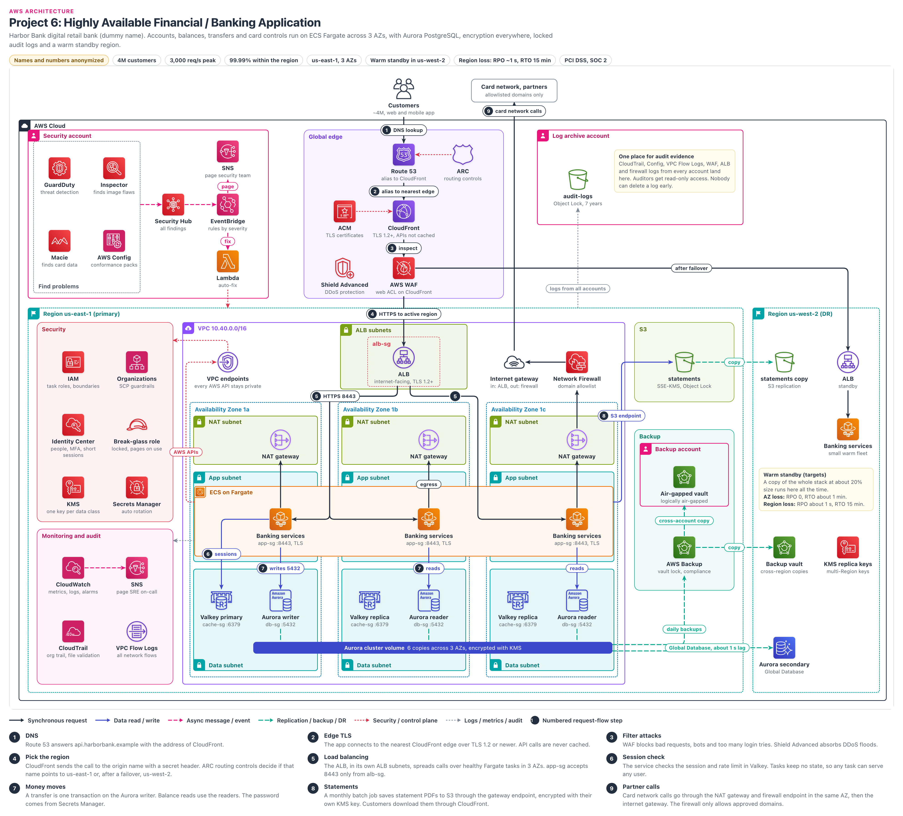

# Highly Available Banking Application

> **Confidentiality note:** Company names, domain names, IDs and all numbers in this document are dummy values. The architecture, the decisions and the trade-offs are what this document shares.
> Key figures (dummy values): 4M customers, peak 3,000 req/s, 99.99% availability, us-east-1 (3 AZs) plus a us-west-2 warm standby, AZ loss: RPO 0 / RTO about 1 min, Region loss: RPO about 1 s / RTO 15 min, PCI DSS + SOC 2. AWS limits and prices change over time, so treat the figures as approximate.

## Architecture diagram

### How to read the diagram
- **Center, top to bottom:** this is the main request path. Customers → Route 53 → CloudFront → WAF → ALB (in its own "ALB subnets" box) → Fargate tasks in 3 AZs → Valkey and Aurora in the data subnets at the bottom.
- **Numbered badges (1 to 9):** these are the steps in section 4. Step 8 (statements) goes to the right. Step 9 (card network calls) goes up and out through the Network Firewall.
- **Top left and top right:** the Security account (findings pipeline) and the Log archive account (the locked `audit-logs` bucket). Inside the Region, the left panels show Security and Monitoring. The right panels show S3 statements and Backup.
- **Far right, us-west-2 (DR):** standby ALB, a small Fargate fleet, the Aurora secondary, the statements copy, the backup vault and the KMS replica keys.
- **Line colors:** black line = customer request, blue = data read/write, pink dashed = events, green dashed = replication/backup, red dotted = security/control, gray dotted = logs/metrics.
- **Subnets:** the ALB has its own "ALB subnets" box, and each AZ has its NAT gateway in a "NAT subnet" box. As explained in section 3, these are kept separate.
- **What the diagram simplifies:**
  - The small firewall subnets are not drawn. A single Network Firewall icon stands for the three AZ endpoints.
  - ECR, AWS Private CA, the customer download path (CloudFront → S3) and the small Valkey in us-west-2 are not drawn.

## 1. Project name
- **Harbor Bank Digital Banking Platform:** a highly secure banking backend that runs on ECS on Fargate and keeps working without stopping.
- **In one line:** this setup serves the bank's most important APIs (accounts, balances, transfers, card controls):
  - They run in 3 AZs (Availability Zones, separate data centers inside one AWS Region) and do not stop even if one AZ fails.
  - All data is always encrypted.
  - Every action is written to audit logs that nobody can change.
  - A small copy (warm standby) is always ready in us-west-2.
- **Core theme:** "Money must never be lost, the site must never stop, and there must always be proof of who did what."

## 2. Business problem

### Who is the company?
- Harbor Bank is a digital retail bank. It has few branches, and most of its business happens in the mobile app and on the website.
- About 4M customers. They check balances, transfer money, freeze/unfreeze cards and download monthly statements.
- It is a regulated bank, which means it must follow outside rules:
  - **PCI DSS:** rules set by card companies such as Visa and Mastercard on how to protect card numbers.
  - **SOC 2:** a report from an outside auditor that says "our security controls really work". Customers and partners ask for it.
  - **Banking regulator:** watches outages and the DR plan closely. It asks for proof of a DR test once a year.

### What were the problems?
1. **The old core banking system lived in one main data center:** switching to its DR site took a full day. The regulator wrote this up as a "high risk" finding.
2. **Payday traffic peak:** on the morning salaries land, everyone checks their balance at the same time. The peak is about 3,000 req/s, 3 to 4 times normal.
3. **Audits were painful:** for every audit, engineers spent weeks collecting screenshots and logs. Proving that nobody had changed the logs was hard.
4. **Security gaps:** shared admin accounts, direct SSH to servers, and servers could reach any website. If one server was hacked, sending data out was easy.
5. **Fear of ransomware:** at a nearby bank, an attacker deleted the backups too. The board asked: "Are our backups safe even from deletion by an admin?"

### What did the company need?
| Need | Target | In simple words |
|---|---|---|
| Availability | 99.99% (within the Region) | Only about 4.3 minutes of downtime per month |
| Speed (latency) | API p99 under 300 ms | 99 out of 100 requests finish in under 0.3 seconds |
| Peak load | 3,000 req/s, even with one AZ down | If one AZ fails, the other two AZs must carry the full peak |
| AZ loss | RPO 0, RTO about 1 minute | Not a single transfer is lost, back to normal within a minute |
| Region loss | RPO about 1 s, RTO 15 minutes | Only the last second of data is at risk, service from us-west-2 within 15 minutes |
| Encryption | At rest + in transit everywhere, field-level for card numbers | Even if a disk is stolen or the network is sniffed, the data cannot be read |
| Audit logs | 7 years, nobody can delete them | Until 7 years pass, not even the root user can delete a single log |
| Access | Least privilege, MFA, no long-lived keys | Every person and every service gets only the power they need |
| Backups | Immutable, different account, different Region | Backups stay safe even if an attacker takes over the main account |

### Constraints
- **Team:** about 25 platform and backend engineers. Few Kubernetes experts.
- **Small PCI scope:** the fewer components in PCI DSS scope, the easier and cheaper the audit.

### Why this architecture?
| Old problem | Our solution | Result |
|---|---|---|
| One data center, one day for DR | Warm standby in us-west-2, Aurora Global Database | Service within 15 minutes even if a Region fails |
| Payday peak | 3 AZs, each AZ carries half the peak, scheduled scaling | The peak is handled even if an AZ fails |
| Weeks of manual work for audits | All logs in one locked log archive account, Security Hub report | Read-only access for the auditor, no screenshots needed |
| Shared admin, SSH, open internet | Identity Center + MFA, no SSH, Network Firewall allowlist | Even if something is hacked, sending data out is hard |
| Fear of ransomware | Backup vault lock, air-gapped vault in a different account | Not even an admin can delete backups |

- **ECS on Fargate:** no servers to patch, and each task gets its own microVM (a small, dedicated virtual machine). There is no host OS in PCI scope at all.
- **3 AZs, each carrying half the peak:** 3 x 50% = 150%. If one AZ fails, the other two carry 100% of the peak without waiting for new servers (static stability).
- **Aurora PostgreSQL:** in a transfer, the debit and the credit must happen together, or neither must happen (ACID transaction). Aurora writes the data as 6 copies across 3 AZs.
- **Warm standby:** a copy at 20% of the full size always runs in us-west-2.
  - With pilot light (database only, zero servers), starting everything within 15 minutes is hard.
  - With active-active, there is a risk of the same money being spent twice (double-spend).
- **Security from day one:** logs, backups and security tools live in separate AWS accounts. Because of SCPs (organization-level bans), not even an admin can turn off logs. Servers can only go out to approved partner sites.

## 3. Architecture overview

### Internet and DNS
- The mobile app and the website both call the same HTTPS API (`api.harborbank.example`).
- **Route 53:** the AWS DNS service. It points the API name to CloudFront with an alias record.
- **ARC (Amazon Application Recovery Controller):** on/off switches (routing controls) that say "which Region is active?". ARC decides whether the origin name points to the us-east-1 ALB or the us-west-2 ALB.

### Edge (Global edge)
- **CloudFront:** the AWS CDN (edge servers all over the world). The TLS 1.2+ connection from the customer's phone ends at the nearest edge. From there, a new TLS connection goes to the ALB.
- Only static web files are cached. API calls are never cached.
- **AWS WAF:** a Layer 7 firewall. It blocks SQL injection, bots and credential stuffing (bots trying thousands of logins with stolen usernames and passwords).
- **Shield Advanced:** protection from large DDoS attacks, a 24/7 AWS response team (SRT), and cost protection for bills that grow because of an attack.
- **ACM:** free public TLS certificates with auto renewal. The CloudFront certificate is in us-east-1, and each ALB has a certificate in its own Region.

### Network (VPC)
- **VPC 10.40.0.0/16, 3 AZs.** Each AZ has 5 subnets: ALB subnet (public), NAT subnet (public), firewall subnet (small, for example /28), app subnet and data subnet.
- **Route tables:**
  - ALB subnet: 0.0.0.0/0 → IGW (directly).
  - NAT subnet: 0.0.0.0/0 → the firewall endpoint in the same AZ. Firewall subnet: 0.0.0.0/0 → IGW.
  - IGW edge route table: NAT subnet CIDR → the firewall endpoint in the same AZ (so return traffic takes the same path).
- **Why separate:** a subnet has only one route table. If the ALB and NAT shared a subnet, CloudFront → ALB traffic would also go into the firewall. The firewall's domain allowlist (default drop) would then stop it.
- No Fargate task has a public IP. **VPC endpoints:** private paths to AWS APIs such as ECR, KMS, Secrets Manager, STS, CloudWatch and S3.

### Application
- **ECS on Fargate:** the accounts, transfers, cards and ledger services run as containers. We do not manage servers.
- Tasks run in 3 AZs. Each AZ can carry half the peak (for example: the peak needs 60 tasks, so 30 in each AZ, 90 in total).
- Tasks are stateless: no session lives in any task, sessions live in Valkey. Calls between services use TLS (ECS Service Connect, section 5A).

### Data
- **Aurora PostgreSQL:** 1 writer (AZ 1a), 2 readers (1b, 1c). Transfers go to the writer, balance/history reads go to the readers. Storage keeps 6 copies across 3 AZs, encrypted with KMS.
- **ElastiCache for Valkey:** 1 primary, 2 replicas, Multi-AZ failover, TLS, RBAC users. Only sessions and rate limits. Real balances are never in the cache.
- **S3:** `statements` bucket (PDFs, SSE-KMS, Object Lock compliance mode, 7 years). `audit-logs` bucket in the log archive account (Object Lock compliance mode, 7 years).

### Security
- **Identity:** a separate IAM task role for each service, permission boundaries, Organizations SCPs, Identity Center for people (MFA, short sessions), and a locked break-glass role.
- **Keys and secrets:** a separate KMS key for each data class, Secrets Manager auto rotation.
- **Note:** clusters in an Aurora Global Database do not support the RDS-managed master password (an AWS documented limitation). So we keep the master password in our own Secrets Manager secret and rotate it with Lambda.
- **Separate accounts:** workload, security, log archive and backup accounts. If one is hacked, the others stay safe.

### Security findings pipeline (Events)
- In the security account, GuardDuty, Inspector, Macie and AWS Config look for problems and send findings to Security Hub.
- **EventBridge rules** route findings by severity: high/critical pages the security on-call through SNS, and known problems get a Lambda auto-fix.

### Monitoring
- **CloudWatch:** metrics, logs, alarms, dashboards. Synthetics canaries log in and make a test transfer every minute.
- **SNS:** when an alarm fires, it pages the on-call and sends a message to the team chat.
- **CloudTrail org trail** (every API call) and **VPC Flow Logs** (every network flow). Both go to the log archive account.

### DR (Disaster Recovery)
- **us-west-2 warm standby:** the same VPC design, a standby ALB, and a Fargate fleet at about 20% size that is always running.
- **What is copied to us-west-2:** the database (Aurora Global Database, about 1 s behind), statement files (S3 replication), backups (AWS Backup copies), encryption keys (KMS multi-Region keys) and passwords (Secrets Manager replica secrets).
- **Backups:** vault lock in compliance mode, plus a copy to a logically air-gapped vault in the backup account.

## 4. Request flow
- Main path: `Customer → Route 53 → CloudFront → WAF + Shield Advanced → ALB (Region chosen by ARC) → ECS Fargate → Valkey (session) → Aurora (money)`
- Statements path: `ECS Fargate → S3 gateway endpoint → S3`
- Partner path: `Fargate task → NAT gateway → Network Firewall → Internet gateway → Card network`
- For example: a customer taps "Send $500 to Ravi" in the app. Below is the journey of that single request.

### Step 1: DNS (Route 53)
- The app asks for the IP of `api.harborbank.example`. The Route 53 alias record returns CloudFront addresses.
- Alias queries are free. The Route 53 data plane has a 100% availability SLA.
- Time: most of the time the answer is already cached on the phone, otherwise about 10 to 30 ms.

### Step 2: Edge TLS (CloudFront + ACM)
- The app makes a TLS 1.2+ connection with the nearest CloudFront edge (ACM certificate, a security policy such as TLSv1.2_2021).
- Caching is fully off for `/api/*` paths (CachingDisabled policy). So there is no risk of one customer's transfer response being shown to another customer.
- Time: because the edge is close, the TLS handshake takes about 10 to 30 ms, and after that the connection is reused.

### Step 3: Filter attacks (AWS WAF + Shield Advanced)
- WAF web ACL on CloudFront: AWS managed rules (common, SQLi, known bad inputs), Bot Control, and Account Takeover Prevention (ATP) for `/login`.
- Rate-based rules: for example, block an IP that sends more than 1,000 requests in 5 minutes, with an even lower limit on `/login`.
- Shield stops large network floods (L3/L4, for example a SYN flood) at the edge. If an HTTP flood (L7) comes, Shield Advanced can add a new WAF rule by itself during the attack and stop it.
- Time: WAF inspection usually takes a few milliseconds.

### Step 4: Pick the region (CloudFront origin + ARC)
- The CloudFront origin is a DNS name (`origin.harborbank.example`). ARC routing controls decide which ALB this name points to. Normally us-east-1, and us-west-2 after a failover.
- HTTPS 443 to the origin, TLS 1.2+. CloudFront also sends a secret custom header. Without it, the ALB returns 403.
- The origin DNS TTL is short (60 s). TTL = how long a DNS answer is remembered. With a short TTL, a Region switch reaches everyone quickly.
- Time: CloudFront → ALB runs over the AWS backbone, about 10 to 70 ms depending on distance.

### Step 5: Load balancing (ALB → ECS Fargate)
- The ALB sits in 3 ALB subnets. `alb-sg` (the ALB's firewall) allows port 443 only from CloudFront server IPs. AWS maintains this IP list itself (the CloudFront origin-facing managed prefix list).
- The ALB uses path rules to send the request to the right service (for example `/transfers` → transfers service), and only to healthy tasks.
- ALB → task: HTTPS 8443 (encrypted again). `app-sg` accepts 8443 only from `alb-sg`.
- Time: the ALB usually adds only a few ms.

### Step 6: Session check (Fargate → ElastiCache for Valkey)
- The service checks the session token and the rate limit counter in Valkey. TLS, port 6379, `cache-sg` accepts traffic only from `app-sg`.
- Valkey RBAC: a separate Valkey user for each service, with only the commands it needs.
- Time: under about 1 ms.

### Step 7: Money moves (Fargate → Aurora PostgreSQL)
- Transfer = one database transaction on the writer: the debit, credit, ledger entries and idempotency key are all committed together, or all rolled back.
- Balance and history reads go to the reader endpoint. Port 5432, TLS required (`rds.force_ssl`), `db-sg` accepts traffic only from `app-sg`.
- The DB password comes from Secrets Manager through a VPC endpoint. Card numbers arrive already encrypted by the app.
- Time: a normal transfer transaction takes about 10 to 30 ms.

### Step 8: Statements (Fargate → S3 gateway endpoint)
- Monthly statement PDFs go to the `statements` bucket through the S3 gateway endpoint. They cross neither the internet nor NAT.
- Bucket policy: IAM roles get PutObject and GetObject only from our VPC endpoint (`aws:SourceVpce`), only over TLS (`aws:SecureTransport`), and only with the statements KMS key. Only the CloudFront service principal is exempt from this deny (`aws:PrincipalIsAWSService`).
- **Customer download:** with a presigned S3 URL, the request comes from the internet, it has no `aws:SourceVpce`, and the deny above blocks it. That is why downloads go through CloudFront:
  - Origin Access Control (OAC) for the S3 origin, and a CloudFront signed URL (5 minutes).
  - The bucket policy allows GetObject to `cloudfront.amazonaws.com` only with our distribution ARN (`AWS:SourceArn`).
  - The objects are SSE-KMS, so the `statements-key` key policy gives `kms:Decrypt` to the CloudFront service principal (with a SourceArn condition).
  - Another simple option: the app reads from S3 through the VPC endpoint and streams the file to the customer. If downloads grow, the CloudFront path is better.
- Time: about 50 to 200 ms depending on the PDF size. This is a monthly batch job, not part of the customer request path.

### Step 9: Partner calls (NAT gateway → Network Firewall → Card network)
- Card authorization and partner bank calls: task → NAT in the same AZ → firewall endpoint in the same AZ → Internet gateway → card network.
- At the start of an HTTPS connection, the name of the site being called (SNI) is visible. The firewall compares that name with the approved list. If it is not on the list, the call is dropped and written to the log.
- mTLS with partners (certificates on both sides), and partner certificates are kept in Secrets Manager. Time: 50 to 200 ms depending on the partner.

### Other flows
- **Database replication:** Aurora storage → Aurora secondary in us-west-2 (Global Database, storage level, about 1 s lag). The app has no work to do.
- **Backups:** AWS Backup takes daily Aurora and S3 backups → copies them to the us-west-2 vault → copies them to the air-gapped vault in the backup account.
- **S3 replication:** `statements` → `statements copy` in us-west-2, encrypted with the KMS key there.
- **AWS API calls:** tasks call ECR, KMS, Secrets Manager, STS and CloudWatch Logs only through interface VPC endpoints.
- **Audit logs:** CloudTrail, Config, VPC Flow Logs, WAF and ALB logs from all accounts go to the `audit-logs` bucket in the log archive account.
- **Security findings:** GuardDuty, Inspector, Macie, Config → Security Hub → EventBridge → SNS page or Lambda auto-fix.
- **Admin access:** an engineer logs in to Identity Center with MFA, read-only by default. If a shell inside a container is needed, ECS Exec is used (with an audit log). No SSH.
- **Region failover:** ARC switch flip → the origin name points to the us-west-2 ALB → CloudFront sends traffic to the new Region (section 9).

## 5. Why each AWS service

### Amazon Route 53
**What it is:** AWS managed DNS. It turns a name into an IP address. The data plane has a 100% availability SLA.

**Why we used it:** to point the API name to CloudFront with an alias, and to point the origin name to an ALB using the ARC switches.

**Problem it solves:** customers get one stable name, and the app config does not need to change even when the Region changes.

**Alternatives:** a third-party managed DNS.

**Why not the alternative:** the CloudFront alias, ARC and Shield Advanced integrations live in Route 53. A different vendor means different credentials and a separate audit.

### Amazon Application Recovery Controller (ARC) (old name Route 53 ARC)
**What it is:** on/off switches (routing controls) for Region failover. They change DNS answers through Route 53 health checks.

**Why we used it:** to move all traffic with one tested switch that says "us-east-1 on, us-west-2 off". Safety rule: at least one Region is always on.

**Problem it solves:**
- AWS has two kinds of work: the **control plane** = changing settings (creating or editing a record), and the **data plane** = the real day-to-day work (answering DNS queries).
- The control plane that changes Route 53 records lives only in us-east-1. If us-east-1 fails, we may not be able to change a record.
- Flipping an ARC switch is data plane work, with endpoints in 5 Regions. That is why it works even if us-east-1 is down.
- Route 53 accelerated recovery (since 2025) allows record changes from us-west-2, but with an RTO of about 60 minutes. That does not meet our 15 minutes, so it is turned on only as a backup.

**Alternatives:** Route 53 failover records that switch by themselves when a health check fails, or CloudFront origin groups.

**Why not the alternative:** if a health check fails once and passes once, traffic moves back and forth (flapping). If the app moves while the writer is still in us-east-1, we get split brain. Origin group failover works only for GET/HEAD/OPTIONS, not for POST transfers.

### AWS Certificate Manager (ACM)
**What it is:** free public TLS certificates with auto renewal.

**Why we used it:** for CloudFront (certificate in us-east-1) and for the ALBs in both Regions.

**Problem it solves:** it removes a common outage, where a certificate expires and the site goes down.

**Alternatives:** buy a certificate from a commercial CA and import it.

**Why not the alternative:** imported certificates do not auto renew. For internal certificates we use AWS Private CA.

### Amazon CloudFront
**What it is:** the AWS CDN. It takes the TLS connection at the edge nearest to the customer, and caches and serves content.

**Why we used it:** even though we do not cache the API, to put WAF and Shield at the edge and to have the TLS handshake happen close to the customer.

**Problem it solves:** attack traffic stops before it reaches the Region. The ALB accepts only calls from CloudFront.

**Alternatives:** a direct ALB + WAF, Global Accelerator, or CloudFront VPC origins (private ALB).

**Why not the alternative:**
- A direct ALB means DDoS lands on the Region itself. Global Accelerator is L4, and WAF cannot be attached to it.
- VPC origins are possible: since 2025, CloudFront Functions (`selectRequestOriginById`) can switch to another existing origin (a VPC origin too), using an "active region" flag in KeyValueStore.
- For now we kept ARC: it is tested and has safety rules. The path that changes the flag has not yet been proven in a drill to work when us-east-1 is down, and the function adds a cost on every request (Q13).

### AWS WAF
**What it is:** a Layer 7 web firewall. It uses rules to allow, block, count or CAPTCHA HTTP requests.

**Why we used it:** managed rules, Bot Control, ATP for login, rate-based rules.

**Problem it solves:** credential stuffing bots and common OWASP attacks stop before they reach the app.

**Alternatives:** a third party such as Cloudflare or Akamai, or checks inside the app.

**Why not the alternative:** a third party would hold our TLS keys and customer data, and the PCI scope grows. Checks in the app mean we pay for compute to handle attack traffic.

### AWS Shield Advanced
**What it is:** paid DDoS protection: a 24/7 Shield Response Team (SRT), cost protection and attack visibility.

**Why we used it:** for CloudFront, the Route 53 zones and the ALBs in both Regions. DDoS ransom threats against banks are real.

**Problem it solves:** expert help during an attack, automatic L7 mitigation, and credit for the bill that grows because of the attack.

**Alternatives:** Shield Standard (free) + WAF.

**Why not the alternative:** Standard has no SRT and no cost protection. About $3,000/month (per organization), which works like insurance (Q20).

### Amazon VPC (subnets)
**What it is:** our private network inside AWS: 10.40.0.0/16, 3 AZs, and in each AZ an ALB, NAT, firewall, app and data subnet.

**Why we used it:** only the ALB can be reached from the internet. Tasks and databases sit in private subnets.

**Problem it solves:** the old flat network is gone. Security Groups and NACLs put a wall around every layer.

**Alternatives:** the default VPC, or one big public subnet.

**Why not the alternative:** in the default VPC all subnets are public. PCI DSS asks for network segmentation.

### Internet Gateway
**What it is:** the VPC's door to the internet, managed by AWS.

**Why we used it:** inbound, only CloudFront → ALB. Outbound, only partner calls that have passed the firewall check.

**Problem it solves:** internet connectivity for the ALB and the NAT gateways.

**Alternatives:** a VPC with no internet, and Direct Connect or PrivateLink for partners.

**Why not the alternative:** card networks and most partners offer only mTLS APIs over the internet. For a partner that offers PrivateLink, we use that.

### NAT Gateway
**What it is:** an outbound-only path for private tasks. Nobody from outside can come in through it.

**Why we used it:** one in each AZ, in its own NAT subnet. If one AZ fails, egress in the other AZs keeps working.

**Problem it solves:** all calls leave from the fixed Elastic IPs of the NAT, so partners only need to allowlist those few IPs.

**Alternatives:** one NAT for all AZs, or NAT instances.

**Why not the alternative:** with one NAT, if that AZ fails, all egress is lost. With NAT instances, patching and HA are our job.

### AWS Network Firewall
**What it is:** a managed stateful firewall for the VPC (domain lists, Suricata rules). One endpoint in each AZ, in its own small subnet.

**Why we used it:** a domain allowlist for outbound traffic. Default drop, and every drop is logged.

**Problem it solves:** a hacked task cannot send data to an attacker's server. It also gives evidence for the PCI egress control.

**Alternatives:** Security Groups only, Route 53 Resolver DNS Firewall, or third-party appliances.

**Why not the alternative:** SGs do not look at domain names. DNS Firewall does not stop a hardcoded IP (it can be added as an extra layer). Appliances must be patched and scaled by us.

### VPC Endpoints (Gateway and Interface)
**What it is:** a way to call AWS services from inside the VPC using private IPs. A gateway endpoint for S3 (free), and interface endpoints (PrivateLink) for the rest.

**Why we used it:** for ECR, KMS, Secrets Manager, STS, CloudWatch Logs and S3. Endpoint policies allow only our resources.

**Problem it solves:** AWS API traffic does not go to the internet, and NAT cost goes down.

**Alternatives:** send everything through NAT to the public AWS endpoints.

**Why not the alternative:** through NAT, a hacked task could upload to the attacker's own S3 bucket. The endpoint policy says "only our buckets", and the bucket policy uses `aws:SourceVpce`: the path is closed from both sides.

### Application Load Balancer (ALB)
**What it is:** a Layer 7 load balancer. It looks at the path and host and spreads requests across healthy targets.

**Why we used it:** for tasks in 3 AZs, path routing, health checks and a TLS 1.2+ policy.

**Problem it solves:** even if a task or an AZ fails, traffic goes only to healthy ones.

**Alternatives:** NLB, or API Gateway.

**Why not the alternative:** NLB has no path routing and no WAF. API Gateway has a higher per-request cost at a steady 3,000 req/s load, a 29 s default timeout, and needs a VPC link.

### Amazon ECS on AWS Fargate
**What it is:** ECS = a container orchestrator (it runs and manages containers), Fargate = containers without servers. Each task runs in its own Firecracker microVM.

**Why we used it:** there are no hosts to patch, and the host OS is not in PCI scope. Each service gets its own task role and its own SG (awsvpc mode).

**Problem it solves:** the "server patching" audit item disappears. Even if a container breaks out, reaching a neighbor task is very hard.

**Alternatives:** EKS, containers on EC2, or ECS Managed Instances (since 2025: AWS patches and replaces the EC2 hosts about every 14 days, and it is a bit cheaper).

**Why not the alternative:**
- EKS: K8s upgrades, RBAC and add-ons are all our job, and the team has few K8s experts. EC2: AMI patching is our job.
- Managed Instances: the hosts are in our account, many tasks share one instance (no per-task VM isolation), and the host layer is back in PCI scope.
- Fargate downsides: no DaemonSets or privileged containers, and the vCPU price is a bit higher.

### Amazon ElastiCache for Valkey
**What it is:** a managed in-memory store. Valkey = an open-source fork of Redis OSS, with almost the same commands.

**Why we used it:** sessions and rate limit counters. Primary + 2 replicas, 3 AZs, auto failover, TLS, RBAC.

**Problem it solves:** tasks stay stateless, there is no need to ask Aurora for the session, and reads take under a millisecond.

**Alternatives:** Redis OSS, DynamoDB, or a sessions table in Aurora.

**Why not the alternative:** Valkey is about 20% cheaper than Redis OSS. DynamoDB has higher latency for counters. Aurora would put unnecessary load on the writer.

### Amazon Aurora PostgreSQL (Global Database)
**What it is:** a managed PostgreSQL-compatible database. Storage keeps 6 copies across 3 AZs, and Global Database copies data to another Region with about 1 s lag.

**Why we used it:** ACID, constraints and reconciliation SQL for the ledger. If the writer fails, a reader becomes the writer: usually within 60 s, often within 30 s (AWS docs).

**Problem it solves:** every write goes to 6 copies and commits only when at least 4 are written (write quorum). Even if the 2 copies in one AZ are lost, no data is lost.

**Alternatives:** RDS PostgreSQL Multi-AZ, DynamoDB global tables, Aurora DSQL.

**Why not the alternative:**
- RDS Multi-AZ: failover usually takes 1 to 2 minutes.
- DynamoDB: relations between tables and the ad-hoc SQL auditors ask for are hard.
- Aurora DSQL: writes in two Regions, but no features such as foreign keys, and changing the ledger is a risk.

### Amazon S3
**What it is:** object storage, designed for 11 nines of durability.

**Why we used it:** the `statements` bucket (SSE-KMS, Object Lock compliance mode, 7 years) and `audit-logs` in the log archive account (Object Lock compliance mode, 7 years).

**Problem it solves:** until the retention ends, nobody can change or delete the objects (WORM, write once read many).

**Alternatives:** PDFs in Aurora, or a third-party archive.

**Why not the alternative:** PDFs in the DB increase size, backup time and cost. With a third party, Object Lock and KMS integration are not easy.

### AWS Backup
**What it is:** one place for backup plans, vaults, copies and restore testing across all resources.

**Why we used it:** daily Aurora and S3 backups, vault lock in compliance mode, a copy in us-west-2, and a copy to a logically air-gapped (LAG) vault in the backup account.

**Problem it solves:** even if an attacker becomes admin, they cannot delete locked backups before the retention ends.

**Alternatives:** Aurora automated backups, manual snapshots, third-party tools.

**Why not the alternative:** automated backups are kept for at most 35 days, in the same account. Scripts have no central lock and no audit reports.

### AWS KMS (Key Management Service)
**What it is:** a service that keeps keys in HSMs (hardware security modules). The key never leaves, only encrypt/decrypt API calls are possible.

**Why we used it:** a separate customer managed key for each data class, separate key admins and key users, and multi-Region keys for DR (section 5A).

**Problem it solves:** every decrypt call is recorded in CloudTrail. One key policy can cut off access to a whole data class.

**Alternatives:** AWS managed keys, CloudHSM, External Key Store (XKS).

**Why not the alternative:** AWS managed keys give no policy control. CloudHSM and XKS are options if the regulator asks, but the HA and cost are on us (if XKS fails, we cannot read any of the data).

### AWS Secrets Manager
**What it is:** a service that stores passwords, API keys and certificates encrypted, and rotates them.

**Why we used it:**
- Per-service DB users, partner credentials, partner mTLS certificates, and replica secrets in us-west-2.
- The Aurora master password is also in our own secret (not RDS-managed, because Global Database clusters do not have that feature). It is rotated with a rotation Lambda (single user strategy).
- Apps do not use the master user. It is used only as the superuser for alternating-users rotation.

**Problem it solves:** there are no passwords in code or Git. A leaked password becomes useless after rotation.

**Alternatives:** SSM Parameter Store, HashiCorp Vault, IAM database authentication.

**Why not the alternative:** Parameter Store has no rotation and no cross-Region replica. A Vault cluster would have to be run by us. IAM DB auth has connection rate limits and is a risk after a failover.

### AWS IAM (roles, permission boundaries, break-glass role)
**What it is:** the service that decides "who can do which action on which resource".

**Why we used it:** a separate task role for each ECS service, permission boundaries on developer roles, and a break-glass role for emergencies.

**Problem it solves:** if one service is hacked, the damage is limited to its permissions (blast radius). No long-lived keys.

**Alternatives:** one shared role for all services, or IAM users + access keys.

**Why not the alternative:** with a shared role, if the cards service is hacked, the ledger data is lost too. Access keys leak, and they are a PCI finding.

### AWS Organizations (SCPs)
**What it is:** a service that manages many accounts as one organization. SCP = a maximum limit on a whole account that says "nobody can do this".

**Why we used it:** SCPs deny:
- Stopping/deleting CloudTrail, disabling GuardDuty, work outside approved Regions, deleting backup vaults, KMS key deletion (except by break-glass).
- `kms:DisableKey` and `kms:PutKeyPolicy` on `aurora-key`, `backup-key` and `logs-key` (except by the pipeline role), and any call that comes with `BypassPolicyLockoutSafetyCheck=true`.

**Problem it solves:** even if an attacker steals admin credentials, they cannot stop logs, remove backups or lock the keys.

**Alternatives:** only IAM policies in each account, or one big account.

**Why not the alternative:** an account admin can change IAM policies, but only the management account can change an SCP. RCPs too: they stop anyone outside the org from touching our S3/KMS.

### AWS IAM Identity Center
**What it is:** single sign-on for people, connected to the corporate IdP, giving temporary access through permission sets.

**Why we used it:** MFA, read-only by default, 1-hour sessions, read-only for auditors. Multi-Region replication to us-west-2 (section 5A).

**Problem it solves:** shared admin accounts go away. When an employee leaves, disabling them in the IdP removes access to all accounts at once.

**Alternatives:** IAM users in each account, or direct SAML to each account.

**Why not the alternative:** IAM users = long-lived passwords and keys. Managing separate SAML for many accounts is hard.

### Amazon CloudWatch
**What it is:** metrics, logs, alarms, dashboards, Synthetics canaries and Application Signals.

**Why we used it:** metrics from all layers in one place, canaries every minute, and data protection policies that mask card numbers in logs.

**Problem it solves:** we find out before a customer complains. With a 4.3-minute budget, detection must happen within a minute.

**Alternatives:** Datadog, Splunk, self-hosted Prometheus + Grafana.

**Why not the alternative:** if sensitive logs go to an outside vendor, the PCI scope grows. Self-hosted means its HA is also our job.

### Amazon SNS
**What it is:** pub/sub notifications: one message to many subscribers (SMS, email, Lambda, HTTPS, chat).

**Why we used it:** two topics: alarms → SRE on-call, security findings → security on-call. KMS encrypted.

**Problem it solves:** one alarm reaches the paging tool and the chat right away.

**Alternatives:** a paging tool directly from CloudWatch, or chat only.

**Why not the alternative:** with SNS in the middle, we can change subscribers without changing the alarms. With chat only, nobody looks at night.

### AWS CloudTrail
**What it is:** an audit service that records every API call (who, when, from where, what).

**Why we used it:** an organization trail (all accounts, all Regions), log file validation, data events for sensitive buckets, and delivery to the locked bucket.

**Problem it solves:** questions like "who disabled this key?" get an answer with proof.

**Alternatives:** a separate trail in each account, or a SIEM only.

**Why not the alternative:** an account admin can stop account trails. A copy can be sent to a SIEM, but the real proof stays in the locked S3 bucket.

### Amazon VPC Flow Logs
**What it is:** metadata for every network connection (source, destination, port, accept/reject). Not the packet content.

**Why we used it:** PCI network monitoring evidence, input for GuardDuty, and answering "who did this task talk to?" during incidents.

**Problem it solves:** firewall logs show only the NAT IP. With Flow Logs we can match it to the task ENI.

**Alternatives:** Traffic Mirroring, packet capture.

**Why not the alternative:** full capture is expensive and also captures sensitive data. It is used only for investigations.

### Amazon GuardDuty
**What it is:** managed threat detection: it reads CloudTrail, Flow Logs, DNS logs and ECS runtime activity to find signs of attack.

**Why we used it:** delegated admin in the security account, Fargate Runtime Monitoring, S3 Protection.

**Problem it solves:** stolen credentials, crypto mining and a reverse shell inside a container are found without writing rules.

**Alternatives:** SIEM correlation rules, Falco.

**Why not the alternative:** we would have to maintain the rules ourselves. Falco has limited kernel access on Fargate.

### Amazon Inspector
**What it is:** continuously scans ECR images and Lambda code for known CVEs (public security bugs).

**Why we used it:** scans on every push, and scans again when a new CVE is published. If there is a critical CVE, the pipeline does not deploy.

**Problem it solves:** even if an image that was safe yesterday gets a CVE today, we find out.

**Alternatives:** pipeline scanners such as Trivy or Snyk.

**Why not the alternative:** they only look at build time. We do have one in the pipeline, but continuous coverage comes from Inspector.

### Amazon Macie
**What it is:** finds sensitive data (card numbers, SSNs) in S3 using ML and patterns.

**Why we used it:** automated discovery on all buckets. If a plain PAN (card number) shows up, it raises a finding.

**Problem it solves:** it catches mistakes such as putting a debug dump in the wrong bucket, and gives PCI data discovery evidence.

**Alternatives:** a custom regex Lambda, third-party DLP.

**Why not the alternative:** a custom scanner has more false positives and more maintenance. Macie sampling keeps the cost under control.

### AWS Config (conformance packs)
**What it is:** records the settings of every resource and checks them with rules. Conformance pack = a group of rules.

**Why we used it:** the PCI DSS conformance pack (no public buckets, encryption on, no 0.0.0.0/0 on port 22).

**Problem it solves:** history for the audit question "what was that setting on that day?", and an immediate finding on drift.

**Alternatives:** Terraform plan drift checks, third-party CSPM.

**Why not the alternative:** Terraform plan only sees drift in the resources it manages, and only when the plan runs. Resources created outside Terraform are invisible to it. Config records all resources continuously, with history.

### AWS Security Hub
**What it is:** collects findings from all accounts and tools in one place, and scores them against PCI DSS and best practices.

**Why we used it:** GuardDuty, Inspector, Macie and Config findings in the security account, in one format, from one EventBridge source.

**Problem it solves:** no need to watch four consoles, and one report for auditors.

**Alternatives:** send each tool directly to a SIEM, or a third-party SOAR.

**Why not the alternative:** each tool would need its own integration. One feed from Security Hub to the SIEM is simpler.

### Amazon EventBridge
**What it is:** an event bus: when an event matches a pattern, it sends it to a target (SNS, Lambda, SQS).

**Why we used it:** critical findings → SNS page, known types → Lambda auto-fix. There are also rules for break-glass use and for KMS `DisableKey`/`PutKeyPolicy`/`ScheduleKeyDeletion` events.

**Problem it solves:** action within seconds of a finding.

**Alternatives:** SNS directly from Security Hub, or Lambda polling.

**Why not the alternative:** native integration, and filtering by severity/type/account is easy in rules. Polling means delay and extra code.

### AWS Lambda
**What it is:** a service that runs code only when an event arrives, without servers.

**Why we used it:** auto-fix (block a public bucket, remove an open SG rule, isolate a suspicious task and save evidence) and the Aurora master secret rotation.

**Problem it solves:** the exposure window shrinks from minutes to seconds, and no person is needed even at night.

**Alternatives:** SSM Automation runbooks, Config auto-remediation.

**Why not the alternative:** we use Config remediation for some cases, but Lambda is simpler for custom logic (evidence, ticket). The events are rare.

### Key decisions
| Decision | Chosen | Rejected | Why |
|---|---|---|---|
| Compute | ECS on Fargate | EKS, EC2, ECS Managed Instances | No hosts, microVM isolation, smaller PCI scope, no K8s burden on the team. We will look at EKS again only if Service Connect or VPC Lattice is not enough |
| Database | Aurora PostgreSQL | DynamoDB, RDS PostgreSQL | ACID and SQL for the ledger, fast failover, Global Database. If writes outgrow one writer, cell-based sharding (an Aurora Global Database per cell). Not Limitless for now, because it does not support Global Database or AWS Backup |
| Accounts | Separate workload, security, log archive and backup accounts | One big account | Even if one account is hacked, logs, backups and security tools are safe in other accounts. With SCPs, not even an admin can touch them |
| DR strategy | Warm standby (20%) | Pilot light, active-active | For an RTO of 15 min, compute must already be running. Active-active brings double-spend risk to the ledger and double the cost |
| Region switch | ARC routing controls, human decision | Automatic health-check failover | The DB promotion and the traffic switch must happen together. No flapping, no split brain. The ARC data plane does not depend on us-east-1 |
| Edge to origin | CloudFront + public ALB (prefix list + secret header + WAF) | Direct ALB, CloudFront VPC origins | The ARC DNS switch is tested and does not depend on us-east-1. We are evaluating VPC origins + CloudFront Function origin selection, and if it passes a drill we will make the ALB private |
| Session store | ElastiCache for Valkey | Aurora table, DynamoDB | Sub-ms, no load on the writer, cheaper than Redis. We accepted losing sessions in a Region failover (users log in again) |
| Egress | NAT + Network Firewall allowlist | NAT only | A hacked task cannot send data out, PCI egress evidence. Cost: 6 firewall endpoints (two Regions) |
| Backups | AWS Backup, vault lock compliance, cross-account + cross-Region + air-gapped | Same-account snapshots | Not even an admin can delete them. Compliance mode cannot be reversed, so we lock only after agreeing the retention with the legal team |

## 5A. Key topics

### Encryption (never leaving data in plain form anywhere)
**At rest (data on disk):**
- Aurora: encryption with a KMS key is set when the cluster is created (it cannot be turned on later, you must restore from a snapshot). Backups, snapshots and readers all use the same key.
- Valkey: at-rest encryption on, with its own KMS key. S3: SSE-KMS with bucket keys on (fewer KMS calls, lower cost).
- CloudWatch Logs, SNS topics, secrets and backup vaults all use customer managed keys.

**In transit (data moving over the network):**
| From → To | How it is encrypted |
|---|---|
| Customer → CloudFront → ALB | TLS 1.2+ |
| ALB → task | HTTPS 8443 |
| Service → service | ECS Service Connect TLS (TLS 1.3, AWS Private CA short-lived certificates) |
| Task → Aurora | TLS required (`rds.force_ssl`) |
| Task → Valkey | TLS |
| Task → partner | mTLS (certificates on both sides) |

- **Service Connect TLS:** ECS rotates the certificates about every 5 days. This gives encryption and server identity.
- The caller must be verified too (the mTLS goal from the requirements): for sensitive services such as tokenization and ledger, VPC Lattice IAM auth (SigV4, "only this task role may call"), or a Private CA client certificate check inside the app.
- We do not use App Mesh: its support ends on 30 September 2026.

**Field-level (very sensitive fields such as PAN and SSN):**
- Disk encryption does not hide data from a DB admin. So we encrypt the card number (PAN) and SSN inside the app.
- Only one small **tokenization service** sees the PAN: envelope encryption with the AWS Encryption SDK, `pan-key`, and the customer id in the encryption context.
- All other services see only the token. The PCI scope shrinks to that one service.
- For search/dedup, the PAN has an HMAC blind index column (a separate KMS HMAC key, `GenerateMac`). Details in Q7.
- CloudFront field-level encryption works only for form-encoded POSTs. Our APIs use JSON, so we did not use it.

### Key management (key hierarchy, rotation, separation of duties)
**Key hierarchy (envelope encryption):**
- KMS key (stays inside the HSM) → data key → data. The KMS key encrypts the data key, and the data key encrypts the data.
- With caching, one data key is reused for a few records, with limits (such as 5 minutes or 1,000 records).
- Newer versions of the Encryption SDK recommend the AWS KMS Hierarchical keyring for this job (branch keys in DynamoDB, local cache). For DR, that table must also exist in us-west-2.
- Trade-off: fewer KMS calls, but one data key covers more data.

**A separate key for each data class:**
| Key | Used for | Who can use it (key users) |
|---|---|---|
| `aurora-key` | Aurora storage, snapshots | RDS service (through grants) |
| `pan-key` | Card number and SSN fields | Only the tokenization service task role |
| `statements-key` | statements bucket | statements service, S3 replication role, CloudFront (downloads) |
| `logs-key` | CloudTrail, CloudWatch Logs | CloudTrail and logs service principals |
| `backup-key` | backup vaults | AWS Backup service role |

**Separation of duties (key admins are separate from key users):**
- Key users (task roles): encrypt/decrypt only. They cannot change the key policy or delete the key.
- **Careful:** an admin with `kms:PutKeyPolicy` or `kms:CreateGrant` can give Decrypt to themselves. So just saying "admins have no Decrypt" is not enough.
- **Our setup:** human key admins do not have PutKeyPolicy or CreateGrant. Key policy changes happen only through the Terraform pipeline role, with two-person review.
- SCP: `kms:PutKeyPolicy` is denied to everyone except the pipeline role. `kms:CreateGrant` only for AWS services (`kms:GrantIsForAWSResource` condition).
- An EventBridge rule on the PutKeyPolicy, CreateGrant and DisableKey CloudTrail events → security page. IAM Access Analyzer checks whether new principals appeared in key policies.
- `kms:ScheduleKeyDeletion` is denied to everyone except break-glass. The waiting period is 30 days (it can be set between 7 and 30).

**Rotation:**
- Automatic rotation is on for customer managed keys, we use 365 days (it can be set from 90 days). On-demand rotation also exists.
- The old key material stays, so old data still decrypts. Data does not need to be encrypted again.

**Multi-Region keys (for DR):**
- App-level keys such as `pan-key` are multi-Region: a replica in us-west-2 with the same key ID and the same material. It decrypts without calling us-east-1.
- Aurora, S3 replication and Backup copies do not need them: they encrypt again with a key in the destination Region.
- The replica key policy must be just as strict, otherwise the DR Region becomes the weak door.

**CloudHSM / External Key Store:**
- KMS HSMs are FIPS validated, and that is enough for most audits. If the regulator asks for "an HSM that only we use" (single-tenant), we use a CloudHSM custom key store.
- If XKS (key outside AWS) fails, we cannot read any data, which is a big risk for 99.99%. So KMS is the default.

### Disaster recovery (Warm standby design)
- **Warm standby means:** a small copy of the whole stack is always running in us-west-2: VPC, endpoints, firewall, standby ALB, a Fargate fleet at about 20%, the Aurora secondary and a small Valkey.
- **Why:** pilot light (DB only, compute 0) cannot reliably scale within 15 minutes. An active-active ledger means writes to the same account in two Regions, with double-spend risk.
- **Prepared in advance:** images (ECR replication), replica secrets, KMS replica keys, IAM roles, DR permission sets, quotas (Fargate vCPU for the full peak in us-west-2). During a failover we create nothing, we only scale.
- **Static stability:** during a failover we must not depend on the AWS control plane in us-east-1 (IAM changes, Route 53 record changes). We use only two things: the ARC switch (data plane) and resources created in advance.

### RTO / RPO (targets, and how each layer meets them)
- **RTO:** the time it takes for the service to work again. **RPO:** the maximum amount of data loss (in time) we accept.
- Targets: AZ loss: RPO 0, RTO about 1 min. Region loss: RPO about 1 s, RTO 15 min. Bad data/ransomware: restore from backups (section 9).

| Layer | AZ loss | Region loss |
|---|---|---|
| Edge (CloudFront, WAF, Route 53) | Global, no impact | Global, no impact |
| ALB | Nodes in the other 2 AZs, seconds | us-west-2 standby ALB, ARC switch + DNS TTL about 2 min |
| Fargate tasks | Already 100% of peak in the other 2 AZs, RTO about 0 | Scale from 20% to 100%, about 5 to 10 min |
| Aurora | Reader promotion, usually within 60 s, RPO 0 | Global failover: "a few minutes" per AWS docs, about 1 to 2 min in our drills, 4 min in the plan. RPO = lag (about 1 s) |
| Valkey | Replica promotion, usually within a minute | Sessions are lost, users log in again (accepted) |
| S3 statements | S3 is regional, no impact | Replica bucket, RPO of minutes (15 min SLA with S3 RTC) |

**15-minute RTO budget (in the same order as the section 9 runbook):**
| Phase | Time |
|---|---|
| Detect + decide | 0 to 5 min |
| us-west-2 scale-out starts | 5 min (in parallel with the other steps) |
| ARC switch + DNS TTL, fence check | 5 to 7 min |
| Aurora global failover | 7 to 11 min |
| Read-write mode, checks | 11 to 14 min |
| Buffer | 14 to 15 min |

### Audit logging (what, where, how long, how we prove it)
- **What is logged:** CloudTrail (every API call, KMS calls, data events for sensitive buckets), Config history, VPC Flow Logs, WAF, ALB and Network Firewall logs.
- App audit events too: who made which transfer, which admin viewed which customer record.
- **Where:** the `audit-logs` bucket in the log archive account. The workload account admin has only delivery (write) there, no read/delete.
- **Cannot be changed:** S3 Object Lock compliance mode, 7 years. Not even root can delete or overwrite before the retention ends, or shorten the retention.
- **Tamper proof:** CloudTrail log file validation writes a signed digest file (SHA-256 hashes) every hour. Running `aws cloudtrail validate-logs` immediately shows any file that someone changed or removed.
- **Retention:** 90 days in CloudWatch Logs (fast search), 7 years in S3, moved to Glacier classes with lifecycle (Object Lock stays in place).
- **Evidence for auditors:** an auditor read-only permission set, Athena queries, the Security Hub PCI score, Config conformance reports and Backup Audit Manager reports. The screenshot work is gone.

### Least privilege (people, workloads, break-glass)
**People:**
- Everyone logs in to Identity Center with MFA. By default, they can only view (read-only).
- To make a change, higher access is given only for a few hours with a ticket + approval (2 hours), and then it expires by itself.
- Nobody has direct DB access to customer data. Support uses only the audited admin screens inside the app.

**Workloads (services):**
- A separate task role for each ECS service. For example: the statements service has only `s3:PutObject` on the `statements` bucket, and nothing on `pan-key`.
- The task execution role (image pull, logs, secret injection) and the task role (the app's work) are separate.
- Resource policies are the second wall: the bucket, key and secret policies also allow only that role (`aws:SourceVpce`, `aws:PrincipalOrgID`).
- IAM Access Analyzer shows unused permissions, and we trim roles every quarter.

**Guardrails:** permission boundaries (developers cannot give new roles more power than the boundary allows) and SCPs (section 5, Organizations).

**Break-glass, Identity Center DR:**
- We replicated Identity Center from us-east-1 to us-west-2 with multi-Region replication (GA since 2026). This needs a multi-Region customer managed KMS key.
- Even if us-east-1 fails, engineers log in from the us-west-2 access portal with the existing permission sets.
- Even with replication, config changes are made only from the primary Region. During a Region loss we cannot create new permission sets, which is why the DR permission sets are prepared in advance.
- Break-glass is still needed: if the IdP (Okta/Entra) fails, or if Identity Center does not work at all. It uses IAM users + hardware MFA and does not depend on Identity Center.
- It opens only when two people act together (two-person rule). Any use triggers a security page right away. We test it every quarter and change the credentials.

### High availability to 99.99%
- **Budget:** 99.99% = about 4.3 minutes per month, about 52 minutes per year. One bad deployment alone can eat this budget.
- **Static stability:** each AZ carries half the peak (3 x 50% = 150%). If an AZ fails, there is no need to wait for scale-out or for the ECS control plane.
- **Redundancy in every layer:** a 3-AZ ALB, a NAT and firewall endpoint per AZ, Aurora in 3 AZs, Valkey in 3 AZs, interface endpoints in 3 AZs.
- **Gray failures (the AZ is not fully down, but slow):** zonal shift moves only ALB traffic away. The writer (1a) and the Valkey primary (1a) stay there. Runbook:
  1. ALB zonal shift (supported since 2024 even with ALB cross-zone on).
  2. Move the writer with `aws rds failover-db-cluster --target-db-instance-identifier <1b reader>`.
  3. Fail over the ElastiCache primary to another AZ (TestFailover API).
  4. Decide whether to temporarily remove that AZ's subnet from the ECS service.
- **Deployments (the number 1 cause of outages):** canary, ECS circuit breaker, auto rollback on alarm. DB changes follow the expand/contract pattern.
- **To be honest:** if a Region fails, the RTO is 15 minutes, which is more than the monthly budget (4.3 minutes).
  - That is why the 99.99% target covers only failures inside one Region (task, AZ, DB).
  - Losing a whole Region is very rare. We count it separately as a DR event, and the SLA says so too.

### Database failover (Multi-AZ failover, Global Database switchover vs failover)
**1) Writer fails inside the Region (Multi-AZ failover), timeline:**
- 0 s: the writer instance or its AZ fails. Storage (6 copies) is safe, and committed data is not lost.
- About 10 to 20 s: Aurora detects it and promotes the tier 0 reader to writer.
- Usually within 60 s, often within 30 s: the cluster endpoint points to the new writer. In between, the app gets connection errors.
- **App:** the AWS Advanced JDBC Wrapper (failover plugin) knows the topology and reconnects to the new writer without waiting for DNS. Java DNS cache TTL 5 s.
- We do not know whether an in-flight transaction committed. The client retries with the same idempotency key, so money is not taken twice.

**2) Global Database switchover (planned, no data loss):**
- For a DR drill or maintenance. Aurora first fully syncs the secondary and then swaps the roles. RPO 0.
- Time: usually a few minutes, and writes pause during that time. We do it at a quiet time.

**3) Global Database failover (emergency, the Region is down):**
- The primary Region is not available. We promote the us-west-2 secondary with `failover-global-cluster` (allow data loss).
- Time: "a few minutes" per AWS docs, about 1 to 2 min in our drills. RPO = the replication lag at that moment, usually under 1 s.
- Apps use the Aurora global writer endpoint, so the connection string does not need to change.
- **Managed RPO (`rds.global_db_rpo`):**
  - The minimum value is 20 seconds. So it does not guarantee a 1 s RPO, it only caps the worst case (such as 20 to 60 s).
  - If the lag of all secondaries passes that limit, commits on the primary pause (a cost to availability).
  - In a global DB with only two Regions, keep the default in the secondary's parameter group. Otherwise, AWS docs warn that after a failover (when there is no secondary yet), transactions on the new primary may pause.
  - Our "1 s RPO" is only the typical lag, not a guarantee. We watch it with the `AuroraGlobalDBRPOLag` alarm (5 s).
- **How we bring back the lost ~1 s of transactions:**
  - When us-east-1 comes back, Aurora tries to take a snapshot of the old primary volume (named `rds:unplanned-global-failover-...`). The lost transactions are in it.
  - It is a system snapshot and is removed when its retention ends. So we copy it right away as a manual snapshot, restore it as a separate cluster, compare it with the new primary and reconcile.
- After that, us-east-1 joins again as a secondary. We move back with a planned switchover at a quiet time.

| Type | When | RPO | Time (approx.) |
|---|---|---|---|
| Multi-AZ failover | Writer or AZ fails | 0 | Usually within 60 s, often within 30 s |
| Global switchover | Planned drill, maintenance | 0 | A few minutes |
| Global failover | Region fails | Lag (about 1 s) | A few minutes (4 min in the plan) |

## 6. High availability

### Multi-AZ (3 AZs, everything in each)
| Component | How it is HA | If one AZ fails |
|---|---|---|
| ALB | Nodes in 3 ALB subnets | That AZ's node is removed from DNS |
| NAT + firewall endpoint | One per AZ, AZ-local route tables | Egress in the other AZs keeps working |
| Fargate tasks | 50% of peak in each AZ (30 tasks) | The other 60 tasks carry 100% of the peak |
| Valkey | Primary 1a, replicas 1b, 1c | A replica becomes the primary |
| Aurora | Writer 1a, readers 1b, 1c, storage 6 copies | A reader becomes the writer, usually within 60 s |
| VPC endpoints | ENIs in 3 AZs for each interface endpoint | The other ENIs are used |

### Auto Scaling (ECS service auto scaling)
- Target tracking: the `ALBRequestCountPerTarget` target is about 3,000 requests per minute per task (that is 50 req/s), plus CPU 50%.
- This metric is a per-minute count, not per second. Each service has its own target group, so the policy is also per service.
- The minimum is 90 tasks across all services. Even when night traffic is low, we do not go below 90 (for static stability).
- Payday scheduled scaling: we increase capacity at 6 AM, not after the spike arrives.
- On Fargate, placement strategies cannot be set. If the service is given app subnets in 3 AZs, Fargate spreads the tasks across the AZs by itself. `availabilityZoneRebalancing` is ENABLED to even out the tasks after an AZ comes back.

### Load balancing, health checks
- ALB health check `/health/ready`: checks the DB and Valkey connections. If a partner is down, it does not mark the task unhealthy (otherwise all tasks would go down at once).
- Deregistration delay 30 s (so in-flight transfers can finish), slow start for new tasks, cross-zone on.

### Database failover, failure domains
- DB failover details are in section 5A. Failover priority: the 1b reader is tier 0, 1c is tier 1. Readers are the same size as the writer.
- A Valkey failover causes a few seconds of errors: the app retries, and we accepted that rate limit counters may reset a little (there is still a limit at the WAF edge).
- **Task → AZ → Region → Account:** isolation at every level. Timeouts and circuit breakers between services.
- **Graceful degradation:** if a partner is down, only card features stop. Balances and internal transfers keep working.
- During a failure, we use only data plane actions (ARC switch, zonal shift). We do not create new resources.

## 7. Security

### IAM, IAM roles
- **People:** everyone logs in to Identity Center with MFA. By default, they can only view (read-only).
  - To make a change, higher access is given only for a few hours, with approval.
  - For emergencies there is a break-glass role that opens only when two people act together (details in section 5A).
- **Workloads:** each service has a separate task role and execution role. For the Lambda auto-fix, there is a small cross-account role in the workload account (only actions such as `s3:PutBucketPublicAccessBlock` and `ec2:RevokeSecurityGroupIngress`).
- **Guardrails:** permission boundaries, SCPs, RCPs. Zero long-lived access keys, checked with a Config rule.

### Security Groups chain
| Security Group | Port | Allowed only from |
|---|---|---|
| `alb-sg` | 443 | CloudFront origin-facing prefix list |
| `app-sg` | 8443 | `alb-sg`, `app-sg` (service-to-service TLS) |
| `cache-sg` | 6379 | `app-sg` |
| `db-sg` | 5432 | `app-sg` |
| `vpce-sg` | 443 | `app-sg` |

- The CloudFront prefix list counts as many entries in the SG rules quota, so check the quota in advance.
- Outbound is strict too: `app-sg` outbound goes only to the db, cache, endpoints and NAT (443).

### Network ACLs
- Security groups are stateful and are the main control. NACLs are stateless and act as a second wall at the subnet level.
- Data subnets NACL: inbound only 5432 and 6379 from the app subnet CIDRs, plus ephemeral ports for return traffic. Data subnets have no internet route.
- We do not put many rules in NACLs: debugging is hard, and one wrong rule can stop a whole subnet.

### KMS, Secrets Manager, encryption
- A separate KMS key for each data class, separate admins and users, multi-Region keys, field-level PAN encryption (details in section 5A).
- Secrets Manager: alternating users rotation for the per-service DB users (30 days). The app reads the secret with a caching client, and fetches it again if auth fails (Q15).

### WAF, edge
- Managed rules, Bot Control, ATP (login), rate-based rules, geo rules (block countries where the bank does not offer services), Shield Advanced.
- ALB listener: 403 if the CloudFront secret header is missing. The header is kept in Secrets Manager and we rotate it.

### CloudTrail, detective controls
- Org trail, log file validation and the locked archive are all in place (details in section 5A).
- Four guards: GuardDuty (attacks), Inspector (weaknesses in images), Macie (card data in S3), Config (wrong settings). They all send findings to Security Hub, and from there EventBridge pages someone or runs an auto-fix.
- ECR image tags cannot be changed (immutable), and we deploy only if the Inspector scan passes. Containers run as non-root with a read-only root filesystem.

## 8. Monitoring

### Key CloudWatch metrics and alarms (thresholds)
| Layer | Metric | Alarm |
|---|---|---|
| Customer view | Synthetics canary success (login, test transfer) | 2 failures in a row from 2 Regions → page |
| CloudFront | `5xxErrorRate`, `OriginLatency` | 5xx > 1%, 3 minutes |
| ALB | `HTTPCode_Target_5XX_Count`, `TargetResponseTime` p99, `UnHealthyHostCount` per AZ | 5xx > 0.5%, p99 > 300 ms, 5 minutes |
| ECS | `CPUUtilization`, `MemoryUtilization`, `RunningTaskCount` | running tasks < 90 (static stability minimum) |
| Aurora | `AuroraReplicaLag`, `DatabaseConnections`, `CPUUtilization`, `Deadlocks` | writer CPU > 70%, connections > 80% of max |
| Aurora Global | `AuroraGlobalDBReplicationLag`, `AuroraGlobalDBRPOLag` | lag > 5 s (RPO at risk) |
| Valkey | `EngineCPUUtilization`, `DatabaseMemoryUsagePercentage`, `Evictions` | memory > 75%, evictions > 0 |
| WAF | `BlockedRequests`, ATP metrics | blocked 5 times higher than normal (attack?) |
| Egress | Firewall dropped packets, NAT `ErrorPortAllocation` | new drops, port allocation errors > 0 |
| Fence | us-east-1 write attempts after ARC off | if > 0 during failover, stop the promotion (section 9) |
| Business | transfers per minute, failed transfers % | failed > 1%, or transfers suddenly drop by 50% |

- **Composite alarms:** so that one incident does not cause 20 pages. For example, page only if "ALB 5xx AND canary fail". Warnings go only to chat.

### Logs
- App logs are structured JSON: correlation id, customer id hash, service, latency. We never log PAN, SSN or passwords.
- CloudWatch Logs data protection policies are the second wall: they mask card number patterns and raise an alarm if one shows up.
- Retention: 90 days in CloudWatch, 7 years in the log archive S3.

### Dashboards
- **SLO dashboard:** how much of the monthly budget (4.3 min) is left, p99 latency, error budget burn rate.
- **Per-AZ dashboard:** 5xx and latency per AZ. If one AZ becomes slow (gray failure), we see it quickly and decide on a zonal shift.
- **DR readiness dashboard:** shows at a glance "if the Region failed now, is us-west-2 ready?". It includes: Aurora Global DB lag, healthy tasks in us-west-2, replica secrets/keys status, S3 replication lag.

### Tracing, CloudTrail monitoring
- OpenTelemetry (ADOT collector sidecar) → X-Ray / Application Signals. The trace shows in which service a transfer became slow.
- Burn-rate alarm: page if more than 2% of the error budget is spent in an hour.
- EventBridge rules: root login, break-glass use, KMS `DisableKey`/`PutKeyPolicy`/`ScheduleKeyDeletion`, a `StopLogging` attempt, 0.0.0.0/0 in an SG → immediate security page.

## 9. Disaster recovery

### Backups
- **Aurora:** continuous backup (PITR, 35 days, restore to any second). AWS Backup daily (35 days) and monthly (7 years, for the regulator).
- **S3 statements:** versioning on (the old version always stays), Object Lock (no delete until the retention ends), and AWS Backup takes a copy every day.
- **Vault lock compliance mode:** after the grace period (at least 3 days), the lock is permanent. Nobody can delete recovery points before the retention ends, or remove the lock.
- **Copies:** a cross-Region copy to the us-west-2 vault, a cross-account copy to the backup account, and a logically air-gapped (LAG) vault (in an AWS-owned account, shared with RAM for restore).
- Aurora backups do not go to the LAG vault directly, only through a copy (the cluster must be encrypted).
- **If the backup account is also hacked or locked:** with AWS Backup Multi-party approval (since 2025), if the approval team (2 of 3 people) agrees, the LAG vault is shared to a clean recovery account and restored there.

### Replication (always running)
| Data | How | Lag (approx.) |
|---|---|---|
| Aurora | Global Database, storage level | Under 1 s |
| S3 statements | Cross-Region Replication, replica KMS key | Minutes |
| Container images | ECR cross-Region replication | Minutes |
| Secrets | Secrets Manager replica secrets | Seconds |
| KMS | Multi-Region replica keys | Same key material |
| Identity Center | Multi-Region replication | Seconds to minutes |

### RTO/RPO (in simple words)
| Scenario | RPO | RTO | In simple words |
|---|---|---|---|
| One AZ fails | 0 | About 1 minute | Not a single transfer is lost, normal within a minute |
| Region fails | About 1 s (typical, not a guarantee) | 15 minutes | Transfers in the last 1 second are at risk, us-west-2 within 15 minutes |
| Bad data (bad migration) | Minutes (PITR) | 1 to 4 hours | Restore a new cluster to the second before the damage |
| Ransomware / account compromise | Under 24 hours | Hours to a day | Restore from the air-gapped vault into a clean account |

### Region failure steps (runbook)
1. **Detect (0 to 3 min):** canaries fail from 2 Regions, AWS Health events, errors from many services in us-east-1. The incident commander declares an incident.
2. **Decide (3 to 5 min):** the incident commander + one business approver decide "failover". We do not fail over for a small blip (flapping would cause even more damage).
3. **Start compute scaling (5 min):** set the desired count of the us-west-2 ECS services to the full peak. This runs in parallel with the other steps.
4. **Move traffic and stop the old Region (5 to 7 min):**
   - One ARC API call: us-east-1 off, us-west-2 on. Both happen in one call, so the "at least one on" safety rule is not broken.
   - New traffic goes to us-west-2. But the DNS flip alone is not a strong fence: cached DNS, old CloudFront origin connections and batch/async jobs in us-east-1 could still write to the old writer.
   - **App-level fence:** in each Region, a small poller reads the ARC routing control state (ARC data plane, 5 regional endpoints) every few seconds and gives the app a flag. If every task called ARC directly, we could hit ARC API limits, so we use a poller.
   - If its Region is "off", the app stops writes right away and goes read-only. This does not depend on the us-east-1 control plane.
   - After the 60 s origin DNS TTL, CloudFront sends traffic to the us-west-2 ALB.
5. **Read-only mode:** until the DB is promoted, the us-west-2 app shows balances from the secondary. For transfers it says "please try again in a few minutes".
6. **Promote the DB (7 to 11 min):**
   - First, check with the fence metric that us-east-1 writes have stopped.
   - With `failover-global-cluster` (allow data loss), the us-west-2 secondary becomes the writer. Aurora managed failover also tries write fencing, but per AWS docs it is only best-effort.
   - Apps use the Aurora global writer endpoint, DNS cache TTL 5 s.
7. **Read-write, verify (11 to 15 min):**
   - Turn on read-write mode with a feature flag. Check that canaries pass and transfers are going through.
   - Check that Fargate has grown from 20% to full size and the dashboards are green.
   - If the us-east-1 control plane is working, set the batch jobs and services there to 0. This is only extra safety, not the main fence.
   - Update the status page for customers.
8. **After:** reconcile the lost ~1 s of transactions from the unplanned-failover snapshot (section 5A). Then move back to us-east-1 with a planned switchover.
- Since 2025, ARC has a feature called Region switch plans to orchestrate these steps. We are evaluating moving our runbook into it.

### Database recovery (data damaged without losing the Region)
- **For example:** a bad migration updated balances wrongly in one table. Global Database copies that mistake to us-west-2 within 1 s too, so replication does not help here.
- **Steps:** (1) stop transfers with maintenance mode, (2) restore a new cluster with PITR to the second before the mistake, (3) compare the correct rows and run a fix script, or swap the whole cluster.
- Aurora Backtrack exists only for Aurora MySQL, not PostgreSQL. So we measure the PITR restore time (hours for TB sizes) in drills.
- **Ransomware:** restore from the LAG vault into a new clean account (with Multi-party approval). Access to KMS keys in that account is also planned in advance.

### DR testing (does it really work?)
- **Quarterly:** a planned switchover to us-west-2 (RPO 0), run there for a few hours and come back. Evidence for the regulator (timestamps, measured RTO).
- **Once a year:** a "region lost" game day. We simulate cutting off us-east-1 at the network level, and the on-call team (not the people who wrote the runbook) runs the emergency runbook. The fence metric and Identity Center login in us-west-2 are tested too.
- **Monthly:** AWS Backup restore testing restores Aurora and S3 by itself and runs a validation script. We record the restore time.
- **AWS Fault Injection Service:** AZ power interruption, task kill and Aurora failover in staging, and carefully in production.
- After every test: we update the runbook and automation for whatever was slow (for example, the Fargate quota).

## 10. Scaling (when traffic grows 10x)
- Scenario: a partnership with a big employer takes the peak from 3,000 to 30,000 req/s. What happens at each layer:

### EC2 scaling
- There are no EC2 servers in this project. With Fargate, AWS takes care of server capacity.
- Our job is only to check in advance that the Fargate vCPU quota and the subnet IPs are enough.

### CDN caching (CloudFront)
- We never cache personal data (balances, transactions).
- What we cache: web app JS/CSS/images (version in the file name, 1-day TTL) and public pages (FAQ, branch locator, interest rates, 5-minute TTL).
- At 10x these stop at the edge, but all API traffic still reaches the origin. That is why origin scaling matters.
- WAF rate limits must be adjusted to the new normal, otherwise real users get blocked. The WAF request cost also grows 10 times.

### ALB, ECS Fargate
- The ALB scales by itself, but for a 10x spike within seconds it must be ready in advance: an LCU capacity reservation before payday.
- Tasks go from 90 to about 900. Launching hundreds of tasks at once is limited by the Fargate launch rate and the vCPU quota.
- Graviton + right-sizing: if one task carries more req/s, fewer tasks are needed.

### Database (this is the first bottleneck)
- **Reads:** more readers (up to 15), reader auto scaling, and a small cache of a few seconds for balance reads (showing "pending").
- **Writes:** a single writer. At 10x, writer CPU, commit latency and lock contention get hit first. Before that: a bigger writer instance, and batching for hot rows (thousands of credits to one company account).
- **Connections:** 900 tasks x pool of 10 = 9,000, which goes past the writer's max_connections. Use RDS Proxy (a managed connection pool in front of the database), or small pools (2 to 3 per task).
- **Next stage:** a cell-based architecture (split customers into cells, with a separate Aurora cluster and a separate Global Database per cell). This is a project of several months, so it is planned before 10x arrives.
- Aurora Limitless Database is an option, but for now (per AWS docs) it does not support Aurora Global Database, AWS Backup or RDS Proxy. Using it would break both our DR plan and our ransomware plan (vault lock). We will look again when those features arrive.

### Caching (Valkey)
- Sessions and rate limit counters grow 10x. We switch to cluster mode enabled and add shards (3 shards), keeping memory under 75%.

### Queue-based scaling (SQS)
- Today transfers are synchronous (the customer must see the result right away).
- Before 10x: we put statement PDFs, notifications and reports behind an SQS queue (a managed message queue).
- We scale the worker ECS service with target tracking on "messages in the queue per task" (backlog per task). This takes load off the request path.

### Quotas to raise in advance
| Quota | What happens at 10x | What to do in advance |
|---|---|---|
| Fargate vCPU (both Regions) | Task launches stop | Raise for the full peak |
| Subnet IPs (/24) | Tasks run out of IPs | /20 or a secondary CIDR |
| Aurora max_connections | 9,000 connections | RDS Proxy, small pools |
| KMS request rate | Decrypt throttling | Data key caching, S3 bucket keys, increase |
| NAT per-destination (about 55,000) | `ErrorPortAllocation` | Keep-alive, more EIPs |
| ALB LCU | Slow during a spike | LCU capacity reservation |

- Secrets Manager: not `GetSecretValue` on every request, but a caching client. One Network Firewall endpoint carries a lot of throughput, but the cost grows per GB.

## 11. Failure scenarios

### Failure 1: Fargate task crash or bad deployment
- **What happens:** a bug in the new version makes tasks crash or return 5xx. Or one task dies from a memory leak.
- **How we detect it:** ALB `UnHealthyHostCount`, a rise in 5xx, ECS deployment events, canary failures.
- **What happens automatically:** the ALB stops sending traffic to that task, and ECS starts a new task. The circuit breaker or an alarm rolls back to the old version.
- **What we do:** confirm the rollback happened, freeze the pipeline and fix the bug.
- **Impact on users:** for one task, almost nothing. For a bad deploy, the canary (5%) users see errors for a few minutes.

### Failure 2: A whole AZ is lost (or a gray failure)
- **What happens:** a power/network problem in AZ 1a: the tasks, NAT, firewall endpoint, Aurora writer and Valkey primary there are lost. Or a gray failure: the AZ is not down, but slow because of packet loss.
- **How we detect it:** 5xx and latency for 1a on the per-AZ dashboard, an AWS Health event, an Aurora failover event.
- **What happens automatically:**
  1. The ALB stops sending traffic to the tasks in that AZ.
  2. The Aurora 1b reader becomes the writer (usually within 60 s), and a Valkey replica becomes the primary.
  3. The other 60 tasks already carry 100% of the peak.
  4. If zonal autoshift is on, AWS moves traffic away from that AZ by itself.
- **What we do:** for a gray failure, the section 5A runbook: zonal shift, move the Aurora writer to 1b, fail over the Valkey primary. After the AZ comes back, rebalance the tasks and check where the writer is.
- **Impact on users:** for about 30 s to 1 minute, some transfers get errors and complete on retry. RPO 0.

### Failure 3: Aurora writer instance failure
- **What happens:** writer hardware fails or the engine crashes, but the storage is fine.
- **How we detect it:** RDS event "failover started", a spike in app connection errors.
- **What happens automatically:** the tier 0 reader becomes the writer (usually within 60 s), and the JDBC wrapper reconnects right away.
- **What we do:** check that the old writer came back as a reader, and look for the cause (memory, long query).
- **Impact on users:** for a few seconds, transfers get a "try again shortly" error, then an idempotent retry, with no double debit.

### Failure 4: The whole us-east-1 Region is lost
- **What happens:** a large outage in the Region: ALB, ECS and Aurora are not available.
- **How we detect it:** canaries fail from both Regions, the AWS Health Dashboard, a rise in Global DB lag.
- **What happens automatically:** by design, nothing is automatic. The edge (CloudFront, WAF, Route 53) is global, and the 20% fleet in us-west-2 is ready.
- **What we do:** the section 9 runbook: declare, scale, ARC switch, fence check, Aurora global failover, read-write, reconcile.
- **Impact on users:** about 15 minutes of no service or read-only, and users log in again.

### Failure 5: The ElastiCache Valkey primary is lost
- **What happens:** the Valkey primary node fails.
- **How we detect it:** an ElastiCache event, Valkey connection errors in the app.
- **What happens automatically:** a replica becomes the primary and the endpoint points to the new node, usually within a minute.
- **What we do:** check that the new replica has synced.
- **Impact on users:** a few seconds of slowness, and a few people log in again. Balances are not in the cache, so there is no risk to money.

### Failure 6: DDoS or credential stuffing attack
- **What happens:** a botnet makes hundreds of thousands of login tries per minute, or a large L7 flood.
- **How we detect it:** a spike in WAF `BlockedRequests`, ATP metrics, a Shield event, a rise in the login failure rate.
- **What happens automatically:** ATP, Bot Control and rate rules block it. Shield adds an automatic L7 mitigation rule, and L3/L4 stops at the edge.
- **What we do:** work with the SRT on a custom rule (for example, one ASN), CAPTCHA for login, password reset for compromised accounts.
- **Impact on users:** usually none, and some people see a CAPTCHA. Shield cost protection covers the extra bill.

### Failure 7: Account compromise / ransomware attempt
- **What happens:** an attacker steals an engineer's credentials or a CI role and tries to encrypt data, delete backups and logs, and disable or lock a KMS key.
- **How we detect it:** GuardDuty spots unusual API calls (a new IP, large deletes at midnight). Any attempt to delete backups or logs, or to disable a key, makes an EventBridge rule page the security team right away.
- **What happens automatically:** SCPs deny it: the attacker cannot stop logs, delete backups, or delete, disable or lock keys. Vault lock and Object Lock compliance mode stop it at the AWS level. A Lambda revokes the suspicious session.
- **What we do:** revoke credentials, invalidate role sessions (revoke older sessions), and take forensic evidence from the log archive. If needed, restore from the LAG vault into a clean account with Multi-party approval.
- **Impact on users:** very small if the guardrails work. In the worst case, a restore means hours of downtime, but no data is lost.

### Failure 8: Partner / card network cannot be reached
- **What happens:** the card network API is down, or a partner moved to a new domain that is not in our allowlist.
- **How we detect it:** the new domain in firewall drop logs, partner error rate alarms, the circuit breaker open metric.
- **What happens automatically:** the app circuit breaker opens, so not all threads get stuck. Only card features are affected.
- **What we do:** confirm with the partner and add the new domain to the allowlist through a Terraform change (with review). We never add an "allow all" rule.
- **Impact on users:** card freeze/unfreeze says "try again later" for a while, and the rest of the app is normal.

### Failure 9: A KMS key is disabled by mistake
- **What happens:** an admin disabled the wrong key, or a wrong change in the key policy removed the decrypt permission from a task role.
- **How we detect it:** `KMSInvalidStateException` / `AccessDeniedException` in the app, an EventBridge page for the `DisableKey` event, 5xx from the tokenization service.
- **What happens automatically:** we do not put an automatic fix on disable (it may be an intentional security action). The page arrives right away. For deletion, there is a 30-day waiting period.
- **What we do:** check in CloudTrail who did it and why, then `EnableKey`, or revert the key policy (from Terraform).
- **Impact on users:**
  - For `pan-key`, only card features are affected.
  - But if `aurora-key` is disabled, the whole ledger database goes down (inaccessible-encryption-credentials state).
  - A normal cluster has a 7-day recoverable window. That may not apply to clusters that cannot be stopped (those in a Global Database), and then the only way is to restore from backup.
  - That is why nobody except break-glass has DisableKey on `aurora-key`. The us-west-2 secondary is encrypted with its own regional key, so in the worst case a Region failover may be a recovery option.

## 12. Cost optimization

### Techniques
- **Graviton (ARM64):** Fargate tasks, Aurora and Valkey all run on Graviton (AWS's own ARM processors). About 20% lower price for the same work.
- **Savings Plans / reserved nodes:** Compute Savings Plans for Fargate (baseline 90 tasks), reserved nodes for Aurora and ElastiCache. These apply only to the compute and database lines (about 25 to 40%), which saves about 10 to 15% on the whole bill.
- **Database Savings Plans (since late 2025):** 1 year, up to about 20% for provisioned, and it applies even if the instance family changes. For a steady Aurora writer, reserved instances may save even more, so we compare both and choose.
- **Warm standby at only 20%:** compared with active-active, the DR compute cost is about one fifth.
- **Aurora I/O-Optimized:** switching pays off when I/O cost goes above 25% of the Aurora bill. Checked monthly.
- **VPC endpoints:** if ECR pulls, logs and S3 traffic go through NAT, NAT charges per GB. Endpoints reduce this (the S3 gateway endpoint is free).
- **WAF add-ons:** ATP is priced per login attempt (about $1 per 1,000, lower in tiers as volume grows).
  - If logins run into tens of millions per month, this becomes the biggest WAF line.
  - We scope ATP down to `/login` only, and Bot Control to sensitive paths only.
- **Logs:**
  - CloudWatch Logs retention 90 days, and the S3 archive moves to Glacier Deep Archive with lifecycle (Object Lock stays).
  - The Infrequent Access log class has no metric filters, subscription filters or Live Tail. Log groups that feed alarms or stream to the S3 archive stay in Standard.
  - In IA, data protection has an extra per-GB charge. So IA is used only for debug-level logs that are rarely viewed.
- **Security tools tuning:** Macie sampling, removing unneeded resource types from Config, watching GuardDuty/Inspector cost per account.
- **What we do not cut:** Shield Advanced, 3-AZ static stability, backup copies, the 6 firewall endpoints, the ARC cluster. These are insurance for a bank. We do not use Fargate Spot for banking APIs, only for batch statement jobs.

### Monthly cost (rough, list-price order of magnitude)
| Item | Rough monthly (USD) |
|---|---|
| ECS Fargate (primary 90 tasks + DR 20%) | 8,000 |
| Aurora PostgreSQL (3 instances + Global secondary + storage/IO) | 7,000 |
| ElastiCache for Valkey (both Regions) | 800 |
| ALB x2 + LCUs | 600 |
| CloudFront requests + WAF paid add-ons (Bot Control, ATP) | 5,500 |
| Shield Advanced (organization subscription) | 3,000 |
| ARC routing control cluster (about $2.50/hour) | 1,800 |
| NAT gateways + Network Firewall endpoints (both Regions) + data | 2,500 |
| VPC interface endpoints (both Regions) | 500 |
| KMS, Secrets Manager | 400 |
| CloudWatch (logs, metrics, Synthetics, Application Signals) | 3,500 |
| CloudTrail data events, Config, GuardDuty, Security Hub, Macie, Inspector | 4,500 |
| S3 + AWS Backup (copies, air-gapped vault) | 2,500 |
| **Total (approx.)** | **40,000 to 42,000** |

- These are list-price orders of magnitude only, and prices change. After commitments, the total is about 10 to 15% lower.
- For 4M customers, that is about 1 cent per customer per month. One hour of outage costs the bank far more than this.

## 13. Two-minute project walkthrough
1. **Problem:**
   - Harbor Bank is a digital retail bank with about 4M customers and a payday peak of 3,000 req/s.
   - The old setup was one data center, a day for DR, and weeks of manual work for audits. The regulator asked for 99.99% and tested DR.
2. **Architecture:**
   - Route 53 → CloudFront, with WAF and Shield Advanced on it. Then the ALB, which opens only to the CloudFront prefix list with the secret header.
   - ECS on Fargate in 3 AZs, an Aurora PostgreSQL writer + 2 readers, and Valkey for sessions. Statements and audit logs are in Object Lock S3.
3. **Decision 1, Fargate vs EKS:**
   - I chose Fargate for security: no hosts to patch, a microVM per task, a smaller PCI scope.
   - Trade-off: no DaemonSets, and the vCPU price is a bit higher.
4. **Decision 2, warm standby:**
   - A 20% size stack in us-west-2, with Aurora Global Database at about 1 s lag. An active-active ledger brings double-spend risk.
   - The Region switch uses ARC, with a human decision. Along with the DNS switch there is an app-level fence, otherwise we get split brain.
5. **Decision 3, security by design:**
   - A separate KMS key for each data class, key policy changes only through the pipeline, and tokenization for card numbers.
   - An egress domain allowlist, vault lock on backups, and an air-gapped vault. With SCPs, nobody can stop CloudTrail or disable keys.
6. **Numbers:**
   - Each AZ carries half the peak: if an AZ fails, RPO 0 and RTO about 1 min.
   - If a Region fails, RPO about 1 s and RTO 15 min, and we measure this in quarterly drills.
7. **Lesson learned:**
   - In our first DR drill, the Fargate vCPU quota in us-west-2 was not enough and scale-out stopped.
   - Since then, I raise DR quotas for the full peak in advance and check them in every drill. A DR plan is proven only in a drill.

## 14. Deep-dive questions and answers

### Q1. Why did you choose ECS on Fargate instead of EKS for a bank?
- **Short answer:** for security and compliance scope. No hosts to patch, and a separate Firecracker microVM for each task.
- **Why:** under PCI DSS, the host OS, node patching and CIS benchmark work goes away. EKS means K8s upgrades, RBAC and add-ons, all of which are audit surface.
- **Why not ECS Managed Instances:** even though AWS patches them, the hosts are in our account, many tasks share one instance, and the host layer is back in PCI scope.
- **Trade-off:** no DaemonSets or privileged containers, and the vCPU price is a bit higher.
- **What I would do differently now:** we would look at EKS Auto Mode only if we needed a mesh that Service Connect and VPC Lattice cannot provide.

### Q2. Walk me through an Aurora writer failure. What does the application actually see?
- **Short answer:** a few seconds of connection errors (usually within 60 s, often within 30 s), then normal. No data loss.
- **Timeline:** detection in about 10 to 20 s, promotion of the tier 0 reader (1b), cluster endpoint update.
- **App side:** the AWS Advanced JDBC Wrapper knows the topology and connects to the new writer without waiting for DNS.
- **In-flight transfer:** we do not know whether it committed, so the client retries with the same idempotency key.
- **What we learned:** with plain JDBC, because of the Java DNS cache, some tasks kept going to the old IP for minutes. That is why we use the wrapper and a 5 s DNS TTL.

### Q3. Explain Aurora Global Database switchover versus failover, with timelines and data loss.
- **Switchover (planned):** when both Regions are healthy, the roles swap after the secondary is fully synced. RPO 0, writes pause for a few minutes, and this is what we use for drills.
- **Failover (unplanned):** the secondary is promoted with allow-data-loss. "A few minutes" per AWS docs, about 1 to 2 min in our drills, 4 min in the plan. RPO = the lag at that moment (usually under 1 s).
- **RPO control:** `rds.global_db_rpo` is at least 20 s, so it cannot enforce 1 s, and commits pause if the limit is passed. We use only an alarm, and in a two-Region setup the secondary parameter group stays at the default.
- **After:** copy the `rds:unplanned-global-failover-...` snapshot as a manual snapshot, restore it, and reconcile the lost transactions.
- **Common mistake:** saying "global failover has RPO 0". That is true only for switchover.

### Q4. How exactly do you fail over to us-west-2, and why is it not automatic?
- **Short answer:** after the incident commander and the business approver decide, one ARC call turns us-east-1 off and us-west-2 on. Then the fence check, Aurora global failover, read-write.
- **Why not automatic:** if the health check flaps, traffic moves back and forth, and if the old writer takes writes, we get split brain. The decision to accept 1 s of data loss belongs to a human.
- **Why ARC:** the control plane that changes Route 53 records lives only in us-east-1, and it may not work if the Region fails. Flipping an ARC switch is data plane work with endpoints in 5 Regions, so it can be flipped even if us-east-1 is down.
- **Three layers of fence:** the ARC DNS switch + an ARC state check in the app (read-only if the Region is "off") + Aurora write fencing (best-effort). Only with all three is the split brain risk very low.
- **Number:** decision within 5 min, RTO 15 min, about 12 min in drills.

### Q5. Is 99.99% realistic here? How do you actually get there?
- **Short answer:** within a Region, yes, but only with both design and operations. That is 4.3 minutes per month.
- **How:** static stability, 3 AZs in every layer, AZ-local NAT and firewall, fast DB failover, a gray failure runbook.
- **The biggest risk is new deployments:**
  - The new version first gets only 5% of traffic (canary). If errors rise, the circuit breaker or an alarm rolls back by itself.
  - DB changes happen in two stages (expand/contract). We make no changes on payday.
- **Honest view:** the Region loss RTO of 15 min goes past the budget, so it is reported separately as a DR event. Graceful degradation for partner dependencies.

### Q6. Why Aurora PostgreSQL instead of DynamoDB, or plain RDS for PostgreSQL?
- **Compared with DynamoDB:** a ledger means double-entry, multi-row ACID, foreign keys and ad-hoc SQL. Even though DynamoDB has transactions (up to 100 items), relational integrity and SQL for auditors are hard.
- **Compared with RDS:** storage with 6 copies, faster failover (RDS Multi-AZ usually takes 1 to 2 min), 15 readers, Global Database.
- **Trade-off:** higher price, I/O charges (controlled with I/O-Optimized), and writes still go to a single writer.
- **Where DynamoDB fits:** key-value data such as preferences. The idempotency key is part of the transaction, so it stays in Aurora.

### Q7. How do you protect card numbers and SSNs beyond disk encryption?
- **Short answer:** tokenization + field-level envelope encryption. Only one tokenization service sees the PAN, and all others see only the token.
- **How:** the Encryption SDK, `pan-key` (multi-Region), and the customer id in the encryption context (if the ciphertext is copied to another row, decryption fails).
- **Search/dedup:** the ciphertext is random, so it cannot be searched. The PAN gets an HMAC blind index column (a separate KMS HMAC key, `GenerateMac`). No plain SHA-256: the PAN space is small and can be brute forced (PCI DSS 4.0 asks for a keyed hash).
- **Scope:** the only user of `pan-key` is the tokenization role. The DB admin sees only ciphertext. The PCI scope is limited to that service.
- **Also:** we will evaluate AWS Payment Cryptography in the card issuing phase.

### Q8. Walk me through your KMS key strategy. Who can do what with a key?
- **Short answer:** a separate customer managed key for each data class. Users (service roles) can only encrypt/decrypt, and AWS services use grants.
- **The admin trap:** an admin with PutKeyPolicy or CreateGrant can give Decrypt to themselves. That is why human admins do not have them, and policy changes go through the Terraform pipeline role with two-person review.
- **SCP:** PutKeyPolicy is denied to everyone except the pipeline, CreateGrant requires `kms:GrantIsForAWSResource`, and ScheduleKeyDeletion and DisableKey are denied except for break-glass.
- **Detection:** a page on PutKeyPolicy, CreateGrant and DisableKey events, and Access Analyzer checks for new principals.
- **Why separate keys:** blast radius, and we can filter "who decrypted card data" by one key ID.

### Q9. Why multi-Region KMS keys? Does Aurora need them?
- **Short answer:** Aurora does not need them, because the secondary encrypts with its own Region's key. S3 replication and Backup copies also use the destination key.
- **Where they are needed:** app-level encrypted PAN. The ciphertext goes to us-west-2, and to decrypt it even when us-east-1 is down, we need the same key material.
- **Risk:** the replica key policy must be just as strict. A Config rule checks that both are the same.
- **Common mistake:** "make all keys multi-Region". Use them only where needed, otherwise we lose the control that a key stays in one Region.

### Q10. How do you prove to an auditor that audit logs were not tampered with?
- **Short answer:** three layers: a separate account, Object Lock compliance mode, CloudTrail log file validation.
- **Account:** workload admins have only delivery, no read/delete. StopLogging/DeleteTrail are denied with an SCP.
- **Integrity:** a signed digest every hour. `aws cloudtrail validate-logs` shows any file that someone changed or removed. We run it in front of the auditor.
- **How we give evidence:** we give the auditor a read-only role. They query the logs with Athena themselves, and look at Config history and the Security Hub PCI report.
- **What we learned:** at first we used governance mode. The auditor raised a finding that it can be bypassed, so we switched to compliance mode.

### Q11. An attacker gets admin in the production account. What can they still destroy?
- **Short answer:** they can damage the workload (stop tasks, change data). They cannot destroy logs or backups, and they cannot delete keys.
- **KMS ransomware:** without an SCP, they could disable a key, or lock everyone out with the key policy. That is why DisableKey, PutKeyPolicy (except for the pipeline) and BypassPolicyLockoutSafetyCheck are also denied with an SCP.
- **How we catch it:** GuardDuty spots unusual API calls. Any attempt to delete backups or logs makes EventBridge page security right away.
- **Recovery:** revoke credentials, invalidate sessions, and restore from the LAG vault into a clean account with Multi-party approval.
- **Gap (honestly):** if data is changed with SQL, replication copies that too. For that we have PITR and append-only ledger tables.

### Q12. Everyone is read-only by default. How does an engineer fix production at 3 AM?
- **Short answer:** they request the "incident responder" permission set in Identity Center with temporary elevated access, the on-call lead approves, and they get a 2-hour session.
- **Audit:** the request, the approval and every action are in CloudTrail. Access ends as soon as the session ends.
- **Shell:** ECS Exec, controlled with IAM, with session logs. No SSH and no bastion.
- **If us-east-1 fails:** with Identity Center multi-Region replication, they log in from the us-west-2 portal, and the DR permission sets are prepared in advance. If the IdP also fails, break-glass (two people, hardware MFA, security page).
- **Trade-off:** approval takes a few minutes, which is why common fixes are set up as SSM Automation.

### Q13. Why put CloudFront in front of an API you never cache? And why not a private ALB with CloudFront VPC origins?
- **Short answer:** here CloudFront is the security and routing front door: WAF and Shield sit at the edge, and the TLS handshake happens at the edge closest to the customer. Even though the origin DNS name is public, the prefix list and the secret header stop customers from reaching the ALB directly.
- **VPC origins:** a VPC origin binds to one ALB ARN, but a CloudFront Function (`selectRequestOriginById`) can switch between two VPC origins per request. There is only one blocker: there is no proof yet that the path that changes the flag is reliable during a Region failure.
- **Protection today:** `alb-sg` allows only the CloudFront prefix list, the secret header (otherwise 403, and we rotate it), and Shield Advanced on the ALB.
- **Revisit:** we will test this design in the next DR drill, and if it passes, we will remove the public ALB.

### Q14. How does your egress control work? Why Network Firewall, not just security groups?
- **Short answer:** every outbound call goes task → NAT in the same AZ → firewall in the same AZ → Internet gateway. The firewall has a list of approved domains. A call to a domain not on the list is dropped and logged.
- **Routing:** ALB subnets and NAT subnets are separate. NAT subnet → firewall endpoint, firewall subnet → IGW, and the IGW edge route table sends only the NAT subnet CIDRs to the firewall. The ALB subnet goes straight to the IGW, so CloudFront → ALB traffic does not pass through the firewall.
- **Why SGs are not enough:** they see only IP/port, not domains. Partner IPs keep changing.
- **Trade-off:** firewall logs show the NAT IP, so we join with Flow Logs to find the task. SNI spoofing is not fully stopped, which is why AWS APIs go through VPC endpoints.

### Q15. How do database credentials rotate without breaking 3,000 req/s?
- **Short answer:** alternating users (`transfers_a`, `transfers_b`): one is changed while the other is active, so there is a valid password at every moment.
- **App side:** not an env var, but read at runtime with a caching client. If auth fails, refresh and retry. Connections in the old pool keep working.
- **Master password:** because of Global Database, we cannot use the RDS-managed option.
  - Our own Secrets Manager secret, with a rotation Lambda, replicated to us-west-2. Apps do not use the master user.
  - DB users replicate at the storage level, so the same password also works on the us-west-2 secondary.
- **Why not IAM DB auth:** 15-minute tokens, connection rate limits, and risk during the reconnect storm after a failover.

### Q16. The client times out and retries a transfer. How do you make sure money moves only once?
- **Short answer:** idempotency keys. The app sends a UUID `Idempotency-Key` header for each transfer, and the same key on retry.
- **Server:** an Aurora `idempotency_keys` table with a unique constraint. The key insert, debit, credit and ledger entries are one transaction. If the key already exists, we return the earlier result.
- **Why in the DB:** if it were in Valkey, the key could be lost in a cache failover and cause a double transfer.
- **Number:** keys are kept for 24 to 72 hours, then the partition is dropped.

### Q17. Traffic suddenly grows 10x (for example, after a big employer partnership). What breaks first?
- **Short answer:** the Aurora writer. Reads have readers and the cache, but all transfers go to one writer.
- **Signs:** writer CPU, commit latency, lock waits on hot rows, connections going past the max (900 tasks x pool).
- **Short term:** a bigger writer, RDS Proxy or small pools, an ALB LCU reservation, and the Fargate vCPU quota in both Regions.
- **Long term:** cell-based sharding (a separate Aurora Global Database per cell). Aurora Limitless does not support Global Database or AWS Backup, so not now. Statement work moves behind SQS.

### Q18. How do you test DR, and what did the drills teach you?
- **Short answer:** a quarterly planned switchover, one "region lost" game day a year, monthly restore tests, and AZ scenarios with FIS.
- **Rule:** the on-call person must run the runbook, not the person who wrote it. RTO is measured with a timer and reported to the regulator.
- **Lesson 1:** the us-west-2 Fargate vCPU quota was low and scale-out stopped. Now it is set for the full peak.
- **Lesson 2:** a partner had allowlisted only the us-east-1 NAT IPs. Now we give them the IPs for both Regions in advance.
- **Lesson 3:** the origin DNS TTL was 300 s, so the switch spread slowly. We lowered it to 60 s.

### Q19. Why warm standby and not active-active across two regions?
- **Short answer:** a ledger needs a single writer as the source of truth. Active-active means writes to the same account in two Regions, with double-spend risk.
- **Aurora:** the writer is in one Region only. Write forwarding sends writes to the primary, it is not a true multi-writer.
- **Cost:** active-active means about double the compute, warm standby is 20%.
- **Revisit:** if the RTO had to be under a minute, cell-based active-active (a home Region for each customer) or Aurora DSQL.

### Q20. Shield Advanced costs about $3,000 a month. How do you justify it?
- **Short answer:** DDoS is a real threat for a bank. One attack can eat the whole monthly budget (4.3 min).
- **What we get:** 24/7 SRT, automatic L7 mitigation, and cost protection for bills that grow because of an attack.
- **WAF cost:** standard WAF charges for protected resources (web ACL, rules, requests, up to 1,500 WCU) are included in the subscription. Bot Control, ATP and CAPTCHA are charged separately.
- **Math:** an average of 1,000 req/s = about 2.6 billion requests per month. The WAF request charge alone saves about $1,500, a big part of the Shield fee.
- **Also:** proactive engagement is on: if Route 53 health checks go unhealthy, the SRT contacts us directly.

### Q21. Why did you split security, logging and backups into separate AWS accounts?
- **Short answer:** blast radius. Even if the workload account is hacked, logs, backups and security tools are safe in other accounts.
- **SCP guardrails:** nobody can delete anything in the log archive, and nobody can change vault policies in the backup account.
- **Auditors:** read-only only on the log archive, so they never need to step into production.
- **Ransomware case:** even a production admin cannot touch the backups or the LAG vault in another account.
- **Cost:** GuardDuty and Config charges for each account, and cross-account roles are a bit more complex. A small price for a bank.

## Glossary
| Term | Simple meaning |
|---|---|
| Region | A group of AWS data centers in one area of the world (for example, us-east-1 = North Virginia) |
| AZ (Availability Zone) | Data center(s) inside a Region with separate power and network. If one fails, the others keep working |
| VPC | Our private network inside AWS |
| Subnet | A smaller part inside a VPC. Public = connected to the internet, private = cannot be reached directly from the internet |
| NAT Gateway | An outbound-only path for private servers. Nobody from outside can come in through it |
| CDN | Edge servers all over the world that serve content close to users |
| Egress | Traffic that leaves our network |
| RTO | The time it takes for the service to work again after a failure |
| RPO | The maximum amount of data loss (in time) we accept (1 s = only the last 1 second of transfers is at risk) |
| Failover | A backup component takes over when the main component fails (emergency) |
| Switchover | Swapping roles in a planned way, without data loss |
| Warm standby | A small-size copy that always runs in another Region and scales up when needed |
| Pilot light | Only the database runs in the DR Region, with zero servers |
| Static stability | Being able to keep running on existing capacity during a failure, without creating anything new |
| Control plane | The work of changing settings (create, edit, delete). Do not depend on it during a failure |
| Data plane | The real day-to-day work (answering DNS, sending traffic). It keeps working even if the control plane fails |
| Split brain | Two places both think "I am the main one" and take writes, causing data differences |
| Fence (fencing) | Firmly stopping new writes to the old primary, so split brain cannot happen |
| Zonal shift | Moving traffic away from one AZ for a while |
| Gray failure | A failure where something is not fully down but is slow or has some errors, and is hard to detect |
| Blast radius | How far the impact spreads when something breaks |
| TTL | The time a DNS answer is remembered |
| Latency / p99 | The time a request takes. p99 = 99 out of 100 requests finish within this time |
| SLO / SLA | SLO = the target we set for ourselves. SLA = the promise given to the customer |
| Error budget | The downtime allowed by the SLO (about 4.3 minutes per month for 99.99%) |
| Stateless | Not keeping user data on the server, so any server can serve any user |
| Cache | Keeping often-needed data in fast memory |
| Canary deployment | Giving a new version first to only a few users (for example 5%) |
| Circuit breaker | Stopping calls to a service for a while when it keeps failing |
| DDoS | An attack that sends traffic from many computers at once to bring a site down |
| Credential stuffing | Bots trying thousands of logins with stolen usernames and passwords |
| SNI | The "which site are we going to" name visible at the start of an HTTPS connection |
| Prefix list | A name for a list of IP ranges. AWS updates the CloudFront list itself |
| PCI DSS | Rules set by card companies on how to protect card numbers |
| SOC 2 | A report from an outside auditor that security controls really work |
| CVE | A number given to a publicly known software security bug |
| microVM | A small virtual machine used by only one task (Firecracker in Fargate) |
| ACID transaction | Many changes must all happen together, or none of them must happen |
| Ledger | The bank's book of money movements, where every debit/credit is an entry |
| Double-spend | The same money being spent twice |
| Reconciliation | Comparing our records with partner/card network records and fixing differences |
| Idempotency key | A unique id that makes a request execute only once, no matter how many times it is sent |
| PITR | Bringing the database back to any second in the past days |
| HSM | Special hardware that keeps keys, and the key never leaves it |
| Envelope encryption | Encrypting data with a data key, and the data key with a KMS key |
| Multi-Region key | A KMS key with the same key ID and the same material in different Regions |
| Tokenization | Using a meaningless token instead of the real card number |
| Blind index | A keyed hash (HMAC) column added to allow searching on an encrypted field |
| PAN | Primary Account Number, which means the card number |
| mTLS | TLS where both sides show certificates and verify each other |
| Object Lock (compliance mode) | S3 WORM: until the retention ends, not even root can delete/overwrite |
| Vault lock | Locking an AWS Backup vault so backups cannot be deleted early |
| LAG vault | Logically air-gapped vault: a locked backup vault that lives in an AWS-owned account |
| SCP | An organization-level policy, a maximum limit that not even an account admin can get past |
| Permission boundary | A limit on the maximum permissions a role can be given |
| Break-glass | Locked emergency admin access for urgent situations |
