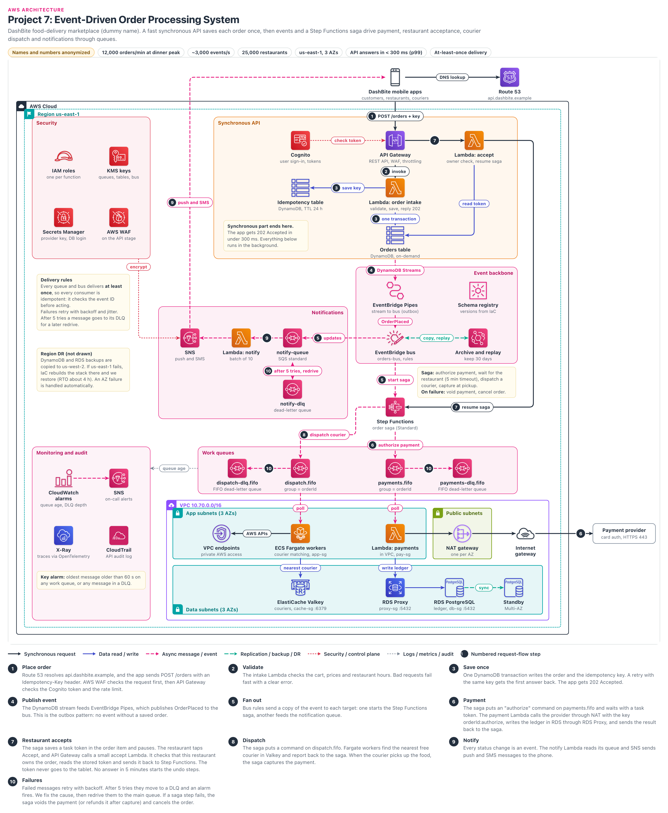

# Event-Driven Order Processing System

> **Confidentiality note:** Company names, domain names, IDs and all numbers in this document are dummy values. The architecture, the decisions and the trade-offs are what this document shares. DashBite is the food-delivery company used as the dummy name. AWS limits and prices change over time, so treat them as approximate.
>
> Key figures (dummy values): **Load:** about 12,000 orders in the top minute of the dinner peak (about 200/s), about 3,000 events/s, about 1.2M orders per day (average about 830/min). **Setup:** 25,000 restaurants, us-east-1, 3 AZs. **Targets:** order API reply under 300 ms, RDS failover about 1 to 2 minutes. **Rules:** every queue is at-least-once, a message goes to a DLQ (dead-letter queue: a queue that holds failed messages to one side) after 5 failed attempts, event archive 30 days, idempotency keys 24 hours.

## Contents

- [Architecture diagram](#architecture-diagram)
- [1. Project name](#1-project-name)
- [2. Business problem](#2-business-problem)
- [3. Architecture overview](#3-architecture-overview)
- [4. Request flow](#4-request-flow)
- [5. Why each AWS service](#5-why-each-aws-service)
  - Services: [Amazon Route 53](#amazon-route-53) · [AWS WAF](#aws-waf) · [Amazon API Gateway (REST API)](#amazon-api-gateway-rest-api) · [Amazon Cognito](#amazon-cognito) · [AWS Lambda](#aws-lambda) · [Amazon DynamoDB](#amazon-dynamodb) · [Amazon EventBridge Pipes](#amazon-eventbridge-pipes) · [Amazon EventBridge (bus, rules, archive, schema registry)](#amazon-eventbridge-bus-rules-archive-schema-registry) · [AWS Step Functions (Standard workflow)](#aws-step-functions-standard-workflow) · [Amazon SQS (standard, FIFO, DLQs)](#amazon-sqs-standard-fifo-dlqs) · [Amazon SNS](#amazon-sns) · [Amazon ECS on AWS Fargate](#amazon-ecs-on-aws-fargate) · [Amazon ElastiCache for Valkey](#amazon-elasticache-for-valkey) · [Amazon RDS for PostgreSQL (Multi-AZ, RDS Proxy)](#amazon-rds-for-postgresql-multi-az-rds-proxy) · [Amazon VPC (subnets, Internet gateway)](#amazon-vpc-subnets-internet-gateway) · [NAT Gateway](#nat-gateway) · [VPC Endpoints](#vpc-endpoints) · [AWS IAM (roles)](#aws-iam-roles) · [AWS KMS](#aws-kms) · [AWS Secrets Manager](#aws-secrets-manager) · [Amazon CloudWatch](#amazon-cloudwatch) · [AWS X-Ray](#aws-x-ray) · [AWS CloudTrail](#aws-cloudtrail)
  - [Key decisions](#key-decisions)
- [5A. Key topics](#5a-key-topics)
  - [Event-driven architecture (events vs commands, choreography vs orchestration)](#event-driven-architecture-events-vs-commands-choreography-vs-orchestration)
  - [Fan-out (SNS vs EventBridge, SNS+SQS pattern)](#fan-out-sns-vs-eventbridge-snssqs-pattern)
  - [Dead-letter queues and redrive](#dead-letter-queues-and-redrive)
  - [Retry mechanisms (Lambda async retries, SQS maxReceiveCount, backoff with jitter, Step Functions Retry/Catch)](#retry-mechanisms-lambda-async-retries-sqs-maxreceivecount-backoff-with-jitter-step-functions-retrycatch)
  - [Idempotency (keys, conditional writes, Powertools idempotency)](#idempotency-keys-conditional-writes-powertools-idempotency)
  - [At-least-once delivery (why exactly-once end to end is a myth)](#at-least-once-delivery-why-exactly-once-end-to-end-is-a-myth)
  - [Ordering (FIFO message groups, versioning, out-of-order handling)](#ordering-fifo-message-groups-versioning-out-of-order-handling)
  - [Failure handling (poison pills, partial batch responses, circuit breakers, saga compensation)](#failure-handling-poison-pills-partial-batch-responses-circuit-breakers-saga-compensation)
  - [Transactional outbox](#transactional-outbox)
- [6. High availability](#6-high-availability)
- [7. Security](#7-security)
- [8. Monitoring](#8-monitoring)
- [9. Disaster recovery](#9-disaster-recovery)
- [10. Scaling (when traffic grows 10x)](#10-scaling-when-traffic-grows-10x)
- [11. Failure scenarios](#11-failure-scenarios)
  - [Failure 1: Payment provider down for 20 minutes (at the dinner peak)](#failure-1-payment-provider-down-for-20-minutes-at-the-dinner-peak)
  - [Failure 2: Poison message in payments.fifo](#failure-2-poison-message-in-paymentsfifo)
  - [Failure 3: Bad deploy in the notify Lambda](#failure-3-bad-deploy-in-the-notify-lambda)
  - [Failure 4: AZ failure (one AZ in us-east-1)](#failure-4-az-failure-one-az-in-us-east-1)
  - [Failure 5: EventBridge Pipe stops (outbox relay stuck)](#failure-5-eventbridge-pipe-stops-outbox-relay-stuck)
  - [Failure 6: Dispatch queue backlog (couriers matched late)](#failure-6-dispatch-queue-backlog-couriers-matched-late)
  - [Failure 7: Restaurant tablet offline (no accept arrives)](#failure-7-restaurant-tablet-offline-no-accept-arrives)
  - [Failure 8: The whole us-east-1 region is down](#failure-8-the-whole-us-east-1-region-is-down)
- [12. Cost optimization](#12-cost-optimization)
- [13. Two-minute project walkthrough](#13-two-minute-project-walkthrough)
- [14. Deep-dive questions and answers](#14-deep-dive-questions-and-answers)
  - [Q1. Walk me through what happens when a customer taps "Place order".](#q1-walk-me-through-what-happens-when-a-customer-taps-place-order)
  - [Q2. Why return 202 instead of waiting for the payment result?](#q2-why-return-202-instead-of-waiting-for-the-payment-result)
  - [Q3. How do you guarantee an order is never created twice?](#q3-how-do-you-guarantee-an-order-is-never-created-twice)
  - [Q4. How do you avoid the dual-write problem between the database and the event bus?](#q4-how-do-you-avoid-the-dual-write-problem-between-the-database-and-the-event-bus)
  - [Q5. Why EventBridge instead of SNS for fan-out?](#q5-why-eventbridge-instead-of-sns-for-fan-out)
  - [Q6. Why put SQS between EventBridge and the consumers instead of invoking Lambda directly?](#q6-why-put-sqs-between-eventbridge-and-the-consumers-instead-of-invoking-lambda-directly)
  - [Q7. Why Step Functions orchestration instead of pure choreography for the order saga?](#q7-why-step-functions-orchestration-instead-of-pure-choreography-for-the-order-saga)
  - [Q8. Why Standard workflows and not Express?](#q8-why-standard-workflows-and-not-express)
  - [Q9. How does the restaurant callback work, and what if the restaurant never answers?](#q9-how-does-the-restaurant-callback-work-and-what-if-the-restaurant-never-answers)
  - [Q10. Can you guarantee exactly-once processing?](#q10-can-you-guarantee-exactly-once-processing)
  - [Q11. How do you handle ordering? Why FIFO only for payments and dispatch?](#q11-how-do-you-handle-ordering-why-fifo-only-for-payments-and-dispatch)
  - [Q12. A message lands in the payments DLQ. Walk me through what you do.](#q12-a-message-lands-in-the-payments-dlq-walk-me-through-what-you-do)
  - [Q13. The payment provider is down for 20 minutes at dinner peak. What happens?](#q13-the-payment-provider-is-down-for-20-minutes-at-dinner-peak-what-happens)
  - [Q14. How do you make sure a customer is never charged twice?](#q14-how-do-you-make-sure-a-customer-is-never-charged-twice)
  - [Q15. Why DynamoDB for orders but RDS PostgreSQL for the ledger?](#q15-why-dynamodb-for-orders-but-rds-postgresql-for-the-ledger)
  - [Q16. Why Lambda for payments but ECS Fargate for courier dispatch?](#q16-why-lambda-for-payments-but-ecs-fargate-for-courier-dispatch)
  - [Q17. How do you evolve event schemas without breaking consumers?](#q17-how-do-you-evolve-event-schemas-without-breaking-consumers)
  - [Q18. Traffic grows 10x. What breaks first?](#q18-traffic-grows-10x-what-breaks-first)
  - [Q19. A customer says "my order is stuck". How do you debug it?](#q19-a-customer-says-my-order-is-stuck-how-do-you-debug-it)
  - [Q20. Why no CloudFront or ALB in front of the API? Why REST API and not HTTP API?](#q20-why-no-cloudfront-or-alb-in-front-of-the-api-why-rest-api-and-not-http-api)
  - [Q21. What would you do differently if you built it again?](#q21-what-would-you-do-differently-if-you-built-it-again)
  - [Q22. When do you capture the payment, and how do you refund after capture?](#q22-when-do-you-capture-the-payment-and-how-do-you-refund-after-capture)
- [Glossary](#glossary)

## Architecture diagram

### How to read the diagram

- **Top part (synchronous API):** Mobile apps → API Gateway → Lambda order intake → DynamoDB. The user waits only up to this point.
  - Top right: Route 53 (DNS lookup).
  - To the right of API Gateway: the small accept Lambda (step 7).
  - At the "Synchronous part ends here" note, the app already receives 202 Accepted (202 is the HTTP reply that means "we have taken the order, the rest of the work happens in the background").
- **Middle, from top to bottom:** Orders table → DynamoDB Streams → EventBridge Pipes → EventBridge bus → Step Functions saga (a workflow that runs the steps of one order in sequence and undoes them if something fails) → work queues (payments.fifo, dispatch.fifo) → workers in the VPC → RDS Proxy → RDS, Valkey. All of this happens in the background.
- **Numbered badges (1 to 10):** these are the same steps as in section 4.
  - 1 to 3 are synchronous, 4 to 9 are async, 10 is the failure path (DLQs, redrive, undo steps).
  - If the same number appears in two or three places, those are different arrows of the same step. For example, 5 = one copy from the bus to the saga and another copy to notify-queue.
- **Left column:** Security (IAM roles, KMS keys, Secrets Manager, AWS WAF), the "Delivery rules" note, the "Region DR" note, and Monitoring and audit (CloudWatch alarms, SNS on-call, X-Ray, CloudTrail).
- **Middle left:** the Notifications panel (notify-queue, Lambda notify, SNS).
- **What is simplified in the diagram:**
  - WAF appears only as an icon in the Security panel, with no arrow to API Gateway (it is attached to the API stage).
  - The DR region us-west-2 is not drawn, there is only a small note on the left.
  - Logs/metrics arrows and courier location updates are also not shown.
- **Data subnets at the bottom:** payments Lambda → RDS Proxy → RDS PostgreSQL → Standby (Multi-AZ, a synchronous copy only, it does not serve reads).
- **Arrow colors:** black line = synchronous request, blue = data read/write, pink dashed = async message/event, green = replication/archive, red dotted = security/control, grey = metrics/logs.

## 1. Project name

- **DashBite Order Lifecycle Platform:** an event-driven, serverless-first order processing system.
- In one line: we save the order only once, and fast (under 300 ms). After that, payment, restaurant accept, courier dispatch and notifications all run in the background.
- Events, queues and one Step Functions saga drive this work (saga = the sequence of steps for one order. If any step fails, it undoes the steps done before it, for example a payment void).
- **What event-driven means:** one service announces "this happened" (an event). Whoever needs it listens and does their own work. Services do not wait for each other.

## 2. Business problem

### Who is the company?

- DashBite is a food-delivery marketplace. It works with 25,000 restaurants in the US.
- **Three types of users, one API:** customers place orders, restaurants accept orders on a tablet, couriers pick up and deliver orders.
- The life of an order (lifecycle): order placed → payment authorize → restaurant accept → courier assign → picked up → delivered. Every change must reach the customer's phone as a notification.
- Old setup: one large monolith with one PostgreSQL database. Inside the order API, the payment call, the restaurant call and the courier search all happened one after another, synchronously.
- **Team and deadline:** about 12 backend engineers, no Kubernetes team. The migration had to finish within 6 months, before the holiday season. The work of looking after servers had to be small, so the design is serverless-first.

### What were the problems?

**The story of one Friday night:**

- 7:15 PM, Priya placed a biryani order in the app. The app froze on "Loading..." for 8 seconds, because the server was waiting for the payment provider.
- The network was weak, so the app sent the same order again. The server created two orders, and the card was charged twice.
- At the same time the SMS vendor became slow. Because of that, orders from other customers also failed.
- Priya called support. Support could not see at which step her order had stopped.
- The problems below are exactly what happened in this one night:

1. **Timeouts at the dinner peak:** around 7 PM, 12,000 orders per minute. One order request took 3 to 8 seconds, because it waited for the payment provider and the courier search. Threads ran out and the whole app became slow.
2. **Double orders, double charges:** when the mobile network was weak, the app retried. Two requests reached the server, creating two orders and sometimes two charges. This meant support tickets, refunds and angry customers.
3. **If one thing falls, everything falls:** if the payment provider was slow for 10 minutes, all orders stopped. If the SMS vendor was down, the order API also failed.
4. **No one knew where an order was stuck:** when a customer asked "Where is my food?", support had no proper tool to see at which step the order was stuck.
5. **New features were hard:** for example, adding "loyalty points" meant changing the order code itself and deploying the whole monolith.

### What did the company need?

| Need | Target | In simple words |
|---|---|---|
| Order API availability | 99.95% (per month) | Only about 21 minutes per month when orders cannot be placed |
| Order API speed | Under 300 ms (p99) | For 99 out of 100 orders, the order ID must come back in under 300 ms |
| Order reaching the restaurant | p95 under 5 seconds | Time from payment authorization until the order shows up on the tablet |
| Peak load | 12,000 orders/min, about 3,000 events/s | At the dinner peak (the top minute, around 7 PM). The daily average is about 830 orders/min (1.2M/day), so the peak is about 14 times the average. This peak does not last long |
| Duplicate orders/charges | Zero (0) | However many times the app retries, one order and one charge |
| Background delay | No message in any queue may be older than 60 s | Anything later than this raises an alarm, and on-call must look at it |
| If an AZ is lost | RPO 0, RTO under 5 minutes | Even if one data center building is lost, no data is lost and the system keeps running automatically |
| If a Region is lost | RTO about 4 hours, orders RPO about 1 to 2 hours (hourly backup + copy time), about 15 minutes for the ledger | Restore from backups in us-west-2. The business accepted this trade-off |
| Security | Card data must never reach us, everything encrypted, every change audited | The card number never reaches our servers, only a token from the provider. That is why very few systems need a PCI (card data security rules) audit |

### Why this architecture?

- **The user waits for only one save:** payment, restaurant and courier all happen in the background. The API stays fast, and a slow provider cannot bring the API down.
- **Queues = shock absorbers:** SQS queues absorb the burst that arrives at the peak. Workers process at their own speed. Even if a downstream system is down, messages wait safely in the queue.
- **Idempotency everywhere:** even if the app retries, or the queue delivers the same message twice, the effect happens only once. This is where the double charge problem is solved.
- **Step Functions saga = order status in one place:** which order is at which step is visible in the console. Timeouts and undo steps (compensation) live in the workflow, not in code.
- **New feature = new rule:** if we want loyalty points, we add a new rule and a new consumer on the EventBridge bus. There is no need to touch the order code.

## 3. Architecture overview

### Internet and DNS

- **Route 53:** the AWS DNS service. It points the name `api.dashbite.example` to the API Gateway custom domain (alias record).
- All mobile apps (customer, restaurant, courier) use this one API domain. HTTPS 443 only.

### Edge (API front door)

- **AWS WAF:** a web application firewall. We attached it to the API Gateway stage. It stops SQL injection, bad bots, and too many requests from a single IP.
- **API Gateway (REST API, Regional):** the single front door for the apps. It checks the login token, applies rate limiting (throttling) and request validation, and then passes the request to Lambda (AWS Lambda runs our code without servers).
- **Cognito:** signs users in and gives them a JWT token (JWT = a signed digital pass that says "who this user is and which group they belong to"). API Gateway checks that token on every call.
- There is no CloudFront or ALB here: this is a mobile API with dynamic data, and there is nothing to cache. There is a question about this in section 14.

### Network (VPC)

- **VPC 10.70.0.0/16, 3 AZs:** (a VPC is our private network inside AWS, an AZ is a separate data center group). Lambda intake and notify run outside the VPC (they do not need any private resource). Inside the VPC: ECS Fargate workers, payments Lambda, RDS and Valkey.
- **App subnets (private, 3 AZs):** the Fargate tasks and the payments Lambda network cards live here (ENI = a network card with a private IP that the VPC gives to Lambda).
- **Data subnets (private, 3 AZs):** RDS PostgreSQL and ElastiCache Valkey live here. There is no path from the internet.
- **Public subnets:** only the NAT gateway (one in each AZ). It lets the payments Lambda call the payment provider on the internet.
- **VPC endpoints:** DynamoDB and S3 (gateway, free). SQS, Step Functions, ECR api/dkr, Secrets Manager, CloudWatch Logs and X-Ray (interface). Without these, those AWS calls would go through NAT and cost more.
- The payments Lambda does not need an SQS endpoint (the Lambda service does the polling). The Fargate pollers do need it.

### Application

- **Lambda order intake:** checks the request, saves the order only once, and replies 202.
- **Lambda payments:** calls the payment provider and writes the result to the ledger.
- **Lambda notify:** turns an event into a push/SMS message.
- **Lambda accept (small):** when the restaurant presses "Accept", it checks that the order belongs to that restaurant and resumes the saga.
- **ECS Fargate workers:** courier matching. This is long-running work that needs a lot of memory, so it runs in containers (ECS Fargate runs containers without us managing servers).
- **Step Functions (Standard):** the order saga (Step Functions is the AWS workflow service). Payment → restaurant accept (5 minute timeout) → dispatch. If something fails: void payment, cancel order.

### Data

- **DynamoDB Orders table (on-demand):** every order and its status (DynamoDB is the AWS serverless NoSQL database). Every update checks a version number, so an old update cannot overwrite a newer one.
- **DynamoDB Idempotency table (TTL 24 h):** remembers the Idempotency-Key that the app sends. After 24 hours, TTL deletes it automatically.
- **RDS PostgreSQL (Multi-AZ, through RDS Proxy):** the payments ledger and settlement reports (RDS is the AWS managed relational database, RDS Proxy is a connection pool in front of it). Money needs strict transactions and SQL reports.
- **ElastiCache for Valkey:** live courier locations kept in memory (ElastiCache is the AWS managed in-memory cache). The query "who is the nearest free courier?" answers in milliseconds.

### Messaging

- **DynamoDB Streams + EventBridge Pipes:** as soon as an order is saved, the OrderPlaced event goes to the bus. This is called the outbox pattern: we take the event from the database write itself, so the event goes out only if the order is saved.
- **EventBridge bus `orders-bus`:** all order events come here (EventBridge is the AWS serverless event router). Rules copy each event to the right targets. There is an archive (30 days) and a schema registry.
- **SQS queues:** `payments.fifo`, `dispatch.fifo` (group = orderId, sequence matters in an order), `notify-queue` (standard). SQS is the AWS managed message queue. Every queue has a DLQ (dead-letter queue: a queue that holds a message to one side after it fails 5 times. The message is not lost and the main queue does not stop).
- **SNS:** mobile push and SMS to customers and couriers (SNS is the AWS publish/subscribe notification service). A separate SNS topic in monitoring handles on-call alerts.

### Security

- **IAM roles, one per function:** every Lambda, ECS task and state machine can touch only its own queue, table and key (IAM controls who can do what in AWS).
- **KMS customer managed keys:** queues, SNS topics, tables, RDS and the event archive are all encrypted (KMS is the AWS encryption key service).
- **Secrets Manager:** the payment provider API key and the DB password, with automatic rotation.
- Security Groups chain: `pay-sg → proxy-sg :5432 → db-sg :5432`, `app-sg → cache-sg :6379`. Details in section 7.

### Monitoring

- **CloudWatch alarms:** when the oldest message age goes over 60 s, when even one message lands in any DLQ, on Lambda errors, and on saga failures. Alerts go to on-call through SNS.
- **X-Ray (OpenTelemetry):** traces every hop. DynamoDB Streams does not carry the trace context, so there is one trace before the stream and separate traces after it. We view them together using the `orderId` annotation (section 8).
- **CloudTrail:** records every AWS API call. Who changed a rule, who redrove a DLQ.

### DR (Disaster Recovery)

- If an AZ is lost: everything runs in 3 AZs, automatically. RDS fails over to the standby in 1 to 2 minutes.
- If a bad deploy corrupts data: DynamoDB PITR (point-in-time recovery: we can bring the table back to any second in the last 35 days) and EventBridge archive replay (30 days).
- If a Region is lost: backups are copied to us-west-2, and we build the whole stack there with IaC (the diagram does not show the DR region, see section 9).

## 4. Request flow

- **Synchronous (the part the user waits for):** `Mobile app → Route 53 → WAF → API Gateway (Cognito token) → Lambda intake → DynamoDB (Orders + Idempotency) → 202 Accepted`
- **Async (background):** `Orders table → DynamoDB Streams → EventBridge Pipes → EventBridge bus → Step Functions saga → SQS FIFO → Lambda payments / ECS Fargate → RDS / Valkey`
- **Notifications:** `EventBridge bus → notify-queue → Lambda notify → SNS → phone`

### Step 1: Place order (API Gateway + Cognito + WAF)

- The app sends `POST /orders` with an `Idempotency-Key` header (a UUID that the app generates, the same key is used on retry).
- Route 53 resolves the domain to API Gateway. The WAF web ACL checks first (managed rules, per-IP rate rule).
- API Gateway checks the JWT token with the Cognito authorizer. If the token is wrong: 401, and the request never reaches Lambda.
- Throttling: stage-level rate limit, 429 when it is exceeded. HTTPS 443, TLS 1.2 or higher. About 20 to 40 ms.

### Step 2: Validate (Lambda: order intake)

- The intake Lambda checks the cart, the prices and the restaurant opening hours. Menu data comes from a small in-memory cache.
- If the request is wrong: an immediate 400 with a clear error message (fail fast). No junk goes into the queue.
- This Lambda does not wait for the payment or the restaurant. About 30 to 60 ms.
- **Cold start risk:** cold starts (init + menu cache load) are a risk for the p99 300 ms target. Before dinner (at 5:30 PM) the intake Lambda gets scheduled provisioned concurrency (50), or SnapStart. The menu cache also stays warm.

### Step 3: Save once (DynamoDB transaction)

- Two writes in a single `TransactWriteItems`: the order in the Orders table (status = PLACED, version = 1), and the key in the Idempotency table.
- Both have an `attribute_not_exists` condition (meaning "write only if this key did not exist before"). The idempotency key uses `attribute_not_exists(pk) OR expiresAt < :now`, so an old, expired key does not block a new request.
- If the key already exists, the transaction fails and the Lambda returns the response it gave the first time (the same order ID).
- The app gets `202 Accepted` + orderId. The whole thing takes under 300 ms (usually 100 to 150 ms).
- The intake Lambda IAM role has write-only access on these two tables, no delete.

### Step 4: Publish event (DynamoDB Streams + EventBridge Pipes)

- DynamoDB Streams is on for the Orders table. A new item (INSERT) arrives in the stream as a record.
- EventBridge Pipes reads the stream, filters only INSERTs, and publishes them to `orders-bus` as an OrderPlaced event.
- This is the outbox pattern: an event only if the order is saved, no event if it is not saved. There is no dual-write problem (if we wrote to the DB and to the bus separately and crashed in between, only one of them would happen, and that is the dual-write problem).
- It usually reaches the bus in under 1 second.

### Step 5: Fan out (EventBridge rules)

- Rules on `orders-bus` look at the event type and send copies. OrderPlaced rule → Step Functions `StartExecution` (saga start).
- Another rule: every status event (OrderPlaced, PaymentAuthorized, CourierAssigned ...) → `notify-queue`.
- Every rule target has a retry policy and a target DLQ. The archive copies every event.
- EventBridge is at-least-once, so the first state of the saga is a conditional write: has the saga already started for this order? If yes, the duplicate execution ends immediately.

### Step 6: Payment (Step Functions → payments.fifo → Lambda payments → provider, RDS)

- The saga sends the "authorize" command to `payments.fifo` and pauses. A task token goes with the message (a task token is like a receipt number that the saga hands out. When the work is done, the worker uses this number to tell the saga "the work is done"). This is called the `.waitForTaskToken` integration. MessageGroupId = orderId.
- The payments Lambda (it runs in the VPC) takes the message from the queue.
- It calls the payment provider on HTTPS 443 through the NAT gateway and the Internet gateway.
- It sends the provider the idempotency key `orderId:authorize`. If a retry comes with the same key, the provider does not make a new charge, it returns the old result.
- It writes the result to the RDS ledger through RDS Proxy (port 5432). Then it answers the saga with `SendTaskSuccess` (or `SendTaskFailure`).
- The provider call usually takes 300 ms to 1.5 s.
- **Authorize vs capture:** authorize means the money is only held on the card, not yet taken. Capture means actually taking the money.
- When the courier picks up the food, the last step of the saga does the capture (key `orderId:capture`, a CAPTURE entry in the ledger).
- If the order is cancelled before capture: void (the hold is released, the customer sees no charge). If it is cancelled after capture: refund (`orderId:refund`, the money comes back in a few days).
- An authorization hold expires in a few days (depending on the card network). An order finishes within an hour, so this is usually not a problem, but if we forget to capture, we do not get the money. The nightly reconciliation alerts on "authorized but not captured" orders.

### Step 7: Restaurant accepts (API Gateway → accept Lambda → Step Functions callback)

- The saga saves a task token in the order item and pauses. The new order shows up on the restaurant tablet (only the orderId, not the token).
- When the restaurant presses "Accept", `POST /orders/{id}/accept` is sent. API Gateway checks the login with Cognito and calls the small accept Lambda.
- The Lambda checks that the `restaurantId` claim in the token = the `restaurantId` in the order item. Then it reads the task token from DynamoDB and calls `SendTaskSuccess`. The saga resumes.
- A task token is like a bearer secret (anyone who has it can push the saga forward), so it never goes to the device or to the logs. An API Gateway direct integration cannot read DynamoDB and check ownership, so we use a Lambda. (In the diagram this Lambda is to the right of API Gateway.)
- The task state has a 300 s timeout. If there is no answer within 5 minutes: `States.Timeout` → Catch → undo steps (void payment, cancel).
- The time here depends on the restaurant, usually 30 s to 2 minutes.

### Step 8: Dispatch (dispatch.fifo → ECS Fargate → Valkey)

- The saga sends the "dispatch" command to `dispatch.fifo` with a task token. Group = orderId.
- Fargate workers poll and use a GEO query in Valkey to find the nearest free courier (`cache-sg :6379`).
- After a courier is assigned, the worker calls back the saga. The saga publishes the CourierAssigned event to the bus.
- Matching usually takes a few seconds. If no courier is found, it tries again with backoff.
- Next, the saga waits for the "picked up" callback from the courier app and then captures the payment (see Step 6).

### Step 9: Notify (notify-queue → Lambda notify → SNS)

- Every status change is an event. A rule sends it to `notify-queue` (SQS standard).
- Lambda notify reads messages in batches of 10. It builds a message such as "Your food is on the way" and publishes it to SNS.
- SNS sends a mobile push (through APNs and FCM), and SMS when needed. If one item fails, the partial batch response makes only that item come back again.
- If an old event arrives late (lower version), the Lambda skips it. Usually 1 to 3 seconds from event to phone.

### Step 10: Failures (retries, DLQs, redrive, compensation)

- A failed message is retried with backoff. `maxReceiveCount = 5`, and after 5 failures it goes to the DLQ (`payments-dlq.fifo`, `dispatch-dlq.fifo`, `notify-dlq`).
- Even one message in a DLQ triggers a CloudWatch alarm → SNS → on-call. We fix the cause and use redrive to send the messages back to the main queue.
- If a step fails in the saga (payment declined, restaurant timeout, no courier found): Catch → compensation: void payment, order CANCELLED, notification to the customer.

### Other flows

- **Services publish their own events:** the saga sends PaymentAuthorized, RestaurantAccepted and CourierAssigned events to the bus using the Step Functions EventBridge integration. Notifications and analytics listen to these.
- **Replay flow:** after a bug fix, we replay a time window from the archive (for example 19:00 to 19:20) and send it again to one consumer only.
- **Courier location updates:** the courier app sends its location every few seconds, and it is updated in Valkey (simplified in this diagram).
- **Settlement (batch):** at night, payout reports for restaurants are built from the ledger with SQL. Reconciliation against the provider settlement file.
- **Admin/support:** the support team views the order execution history in the Step Functions console: which step, how long, which error.

## 5. Why each AWS service

### Amazon Route 53

**What it is:** AWS managed DNS. It points a domain name to an AWS resource.

**Why we used it:** to point `api.dashbite.example` to the API Gateway custom domain with an alias record.

**Problem it solves:** there is no need to hard-code an AWS generated URL in the apps. During a Region DR, we can change DNS and redirect to us-west-2.

**Alternatives:** Cloudflare DNS, or the company's old DNS provider.

**Why not the alternative:** alias records, health checks and IaC are all inside AWS. Another vendor means an extra contract and extra access management.

### AWS WAF

**What it is:** a Layer 7 firewall. It checks HTTP requests against rules and blocks or allows them.

**Why we used it:** a web ACL attached to the API Gateway REST API stage. AWS managed rules (Common, Known bad inputs, IP reputation) and a per-IP rate-based rule.

**Problem it solves:** bot fake orders, credential stuffing, floods from a single IP. These stop before they reach Lambda, which also lowers Lambda cost.

**Alternatives:** API Gateway throttling alone, or a third-party WAF.

**Why not the alternative:** throttling gives everyone the same limit and cannot separate a bad IP. A third-party WAF means traffic goes out and comes back, adding latency and cost.

### Amazon API Gateway (REST API)

**What it is:** a managed API front door. Auth, throttling, validation, and routing to Lambda or AWS services.

**Why we used it:** Cognito authorizer, request validation, direct WAF attach, stage/method throttling. Usage plans only for partner APIs (we cannot hide an API key inside a mobile app).

**Problem it solves:** an API without servers. Bad requests and unauthenticated calls are rejected early.

**Alternatives:** HTTP API (cheaper, faster), or ALB + Lambda.

**Why not the alternative:** WAF cannot attach directly to an HTTP API, and there is no request validation. ALB can now (since Nov 2025) verify JWTs (signature, iss, exp), but it has no request validation, API-level throttling or usage plans. REST API does cost more, but these features are worth it.

### Amazon Cognito

**What it is:** a user sign-up and sign-in service. After login it issues JWT tokens.

**Why we used it:** separate user groups for all three: customers, restaurants and couriers. API Gateway checks the token on every call.

**Problem it solves:** we do not have to write password storage, MFA or token refresh. API Gateway checks OAuth scopes (access token) on methods. If we need a `cognito:groups` check, it goes in the Lambda code or in a Lambda authorizer. For DR, Cognito multi-Region replication to us-west-2 is on (section 9).

**Alternatives:** Auth0/Okta, or our own auth service + Lambda authorizer.

**Why not the alternative:** third-party per-user cost is higher, and our own auth means security risk and maintenance. Cognito works natively with API Gateway.

### AWS Lambda

**What it is:** a service that runs code without servers. It runs only when a request/message arrives, billed per ms.

**Why we used it:** four functions: order intake (short, spiky), payments (about 1 s per message), notify (batch of 10), and the small accept Lambda (restaurant callback). arm64 (Graviton), with Powertools for AWS Lambda.

**Problem it solves:** automatic scaling for the dinner peak, which is more than 10 times the average traffic, and almost zero cost at 3 AM. The SQS event source mapping (ESM: the AWS poller that takes messages from SQS and hands them to Lambda) gives us polling, batching and retries for free.

**Alternatives:** ECS Fargate services for everything.

**Why not the alternative:** these jobs are small, far from the 15 minute limit. Containers mean we handle scaling and patching ourselves. Only courier matching runs on Fargate (see below).

### Amazon DynamoDB

**What it is:** a serverless NoSQL key-value database. Single-digit ms reads/writes at any scale.

**Why we used it:** Orders table (PK = orderId, on-demand, Streams on, PITR on), Idempotency table (TTL 24 h). Writes to both tables in a single transaction.

**Problem it solves:** no connection pool problem for peak writes. Conditional writes give idempotency and the version check. Streams give us the outbox for free.

**Alternatives:** an orders table + outbox table in Aurora PostgreSQL.

**Why not the alternative:** the orders access pattern is simple (get/update by orderId). Aurora would mean thousands of connections from Lambda, failover time, and an outbox poller as extra work. SQL is needed only for reports, and that lives in the ledger RDS.

### Amazon EventBridge Pipes

**What it is:** a point-to-point connection from one source (DynamoDB stream, SQS, Kinesis) to one target. It can filter, transform and enrich, without code.

**Why we used it:** Orders table stream → filter (INSERT only) → input transformer (OrderPlaced event shape) → `orders-bus`.

**Problem it solves:** we do not have to write an outbox relay. Saving the order and publishing the event never get out of step. The pipe has DLQ and retry settings.

**Alternatives:** DynamoDB Streams → Lambda → `PutEvents`.

**Why not the alternative:** that Lambda is only glue code: we would have to deploy it, monitor it and handle partial failures. Pipes does the same work with configuration, and charges only for events after the filter.

### Amazon EventBridge (bus, rules, archive, schema registry)

**What it is:** a serverless event bus. It looks at the content of an event (type, fields) and uses rules to send it to many targets.

**Why we used it:** custom bus `orders-bus`. Rules: OrderPlaced → saga, all status events → notify-queue. Archive for 30 days, replay. We define event schemas in IaC and keep them in the schema registry (the bus is encrypted with a CMK, and schema discovery does not work on such a bus).

**Problem it solves:** the publisher does not need to know who the consumers are (loose coupling). New consumer = new rule. Replay after a bug fix. The schema registry stores versions and gives code bindings. It does not enforce compatibility, so the breaking change check is in our CI (diff of the new version vs the old version). In prod, schemas are defined in IaC instead of discovery (discovery adds cost and noise).

**Alternatives:** SNS topics + SQS subscriptions, or Amazon MSK (Kafka).

**Why not the alternative:** SNS standard topics have no archive/replay (only SNS FIFO topics have it, but with FIFO throughput limits). There is no schema registry, and filtering is not as rich as EventBridge. Kafka gives ordering and long retention, but we would have to run brokers, partitions and consumer groups. EventBridge is enough for 3,000 events/s.

- **Sept 2026 update:** EventBridge launched a new "Custom Event Bus" (the old one with rules is now called "Custom Event Bus - Classic"). The new bus retains events, has Subscribers (filter + target + retry in a single resource), ordered delivery to a FIFO subscriber with `EventGroupId`, and 5 minute dedup on publish.
- Our design is on the classic bus + archive. If we built it new, we would evaluate the new bus (Step Functions/Pipes support and pricing need checking).

### AWS Step Functions (Standard workflow)

**What it is:** a managed workflow engine. We define steps, retries, timeouts, parallel branches and wait states as a JSON/ASL state machine.

**Why we used it:** one execution per order: authorize payment → restaurant accept (callback, 5 min timeout) → dispatch. Compensation in Catch.

**Problem it solves:** saga state is not scattered across code and database flags. Every order has a visual execution history. Standard supports task token callbacks and can run for up to one year.

**Alternatives:** choreography (services listen to events and do the next job), Express workflows, Temporal, or Lambda durable functions (since Dec 2025: steps inside code, checkpoints, callback waits, up to 1 year).

**Why not the alternative:** in choreography, it is not clear who owns timeouts and undo steps. Express has no `.waitForTaskToken` support, and it also has a 5 minute duration limit. Temporal means running a cluster. Durable functions are new (region/runtime support needs checking) and are a good option for code-heavy teams. But the visual execution history for the support team, declarative Catch in ASL, and the SQS/EventBridge `.waitForTaskToken` integrations are only in Step Functions.

### Amazon SQS (standard, FIFO, DLQs)

**What it is:** a managed message queue. The producer puts a message in, the consumer takes it at its own speed and deletes it after success.

**Why we used it:** `payments.fifo`, `dispatch.fifo` (MessageGroupId = orderId, high-throughput FIFO mode), `notify-queue` (standard). Each one has a DLQ, `maxReceiveCount = 5`.

**Problem it solves:** a burst buffer, and messages stay safe even if a consumer is down (retention 4 days, DLQ 14 days). For one order, authorize and void never arrive in the wrong sequence.

**Alternatives:** invoke Lambda directly from EventBridge, or Kinesis Data Streams.

**Why not the alternative:** direct invoke has no consumer speed control (max concurrency), no queue age visibility and no per-consumer DLQ redrive. Kinesis gives ordering per shard, but one poison record stops the whole shard, and there is no natural per-message DLQ.

### Amazon SNS

**What it is:** a pub/sub push service. One publish goes to many subscribers (SQS, Lambda, HTTP, mobile push, SMS, email).

**Why we used it:** mobile push and SMS to customers and couriers. A separate topic in monitoring for on-call alerts.

**Problem it solves:** we do not have to manage APNs (Apple) and FCM (Google) connections, device endpoints or SMS delivery.

**Alternatives:** a third-party push service (such as OneSignal), Twilio for SMS, or AWS End User Messaging directly.

**Why not the alternative:** another vendor, another contract, another secret. SNS is enough for our volume. If we need marketing campaigns, we will look at it later.

### Amazon ECS on AWS Fargate

**What it is:** ECS to run containers, and Fargate so we do not manage servers. We give each task vCPU and memory, and AWS runs it.

**Why we used it:** courier matching workers: road-network data loaded in memory, many Valkey calls per match, and long-running pollers that are always on. The image comes from ECR through a VPC endpoint.

**Problem it solves:** with Lambda, every cold start would have to load that large data again. On Fargate we load it once and run thousands of matches. Scaling on queue depth (6 to 60 tasks).

**Alternatives:** Lambda, or EKS.

**Why not the alternative:** warm state and long connections do not suit Lambda. EKS means the burden of a cluster, upgrades and add-ons for just one worker service. The company has no Kubernetes platform team.

### Amazon ElastiCache for Valkey

**What it is:** a managed in-memory data store (Valkey, an open-source fork of Redis OSS). Sub-millisecond reads.

**Why we used it:** live courier locations (GEO commands, `GEOSEARCH`) and availability status. 1 primary + 2 replicas across 3 AZs, automatic failover. `cache-sg :6379` only from app-sg.

**Problem it solves:** answers "which free courier is within 2 km" in ms. Location updates are very frequent (every courier, every few seconds), so we cannot send them to a database.

**Alternatives:** DynamoDB + geohash, Amazon Location Service, OpenSearch geo queries.

**Why not the alternative:** DynamoDB geohash queries need many reads and complex code. OpenSearch is heavy and costly for this write rate. Valkey is cheaper than Redis OSS, with the same commands.

### Amazon RDS for PostgreSQL (Multi-AZ, RDS Proxy)

**What it is:** a managed relational database. Multi-AZ keeps a synchronous standby in another AZ. RDS Proxy pools connections.

**Why we used it:** the payments ledger (double-entry rows) and settlement reports. `db-sg :5432` only from the proxy. The payments Lambda always goes through the Proxy.

**Problem it solves:** ACID transactions for money. `UNIQUE (order_id, entry_type)` in the `journal_entries` table, so the same operation cannot be written twice. Each journal entry has two `ledger_lines` rows (debit, credit), in the same transaction. SQL for the finance team. Without the Proxy, a Lambda burst would open hundreds of connections and bring the DB down.

**Alternatives:** Aurora PostgreSQL, or the ledger in DynamoDB too.

**Why not the alternative:** ledger writes are about 200/s at peak, which is small. RDS Multi-AZ is cheap, and a 1 to 2 minute failover is fine for finance (if the payments Lambda fails, the SQS message comes back, and it is safe because it is idempotent). If scale grows, we will migrate to Aurora. Ad-hoc SQL reports are hard in DynamoDB.

### Amazon VPC (subnets, Internet gateway)

**What it is:** our private network in AWS. Subnets, route tables and security groups control who can talk to whom.

**Why we used it:** `10.70.0.0/16`, 3 AZs. App subnets (Fargate, payments Lambda), data subnets (RDS, Valkey), public subnets (NAT only). The Internet gateway is only for outbound NAT traffic.

**Problem it solves:** there is no path from the internet to the database or the cache. Keeping the ledger database private is an audit requirement.

**Alternatives:** everything outside a VPC (using only DynamoDB and Lambda).

**Why not the alternative:** RDS, Valkey and Fargate require a VPC. But we kept the intake and notify Lambdas outside the VPC, because they do not need any private resource.

### NAT Gateway

**What it is:** a path only for resources in private subnets to go out to the internet. Nobody from outside can come in.

**Why we used it:** so the payments Lambda can call the payment provider on HTTPS 443. One in each AZ.

**Problem it solves:** the provider call works without a public IP on the Lambda. The provider allowlists our NAT Elastic IPs.

**Alternatives:** a single NAT gateway, PrivateLink if the provider offers it, or Regional NAT Gateway (since Nov 2025: one NAT that expands across AZs automatically, no public subnet needed).

**Why not the alternative:** if the AZ with the single NAT is lost, payments stop in the other AZs too. The provider did not offer PrivateLink. With a zonal NAT per AZ, allowlisting fixed EIPs at the provider is simple and AZ-local routing is under our control. We can migrate to Regional NAT later, after checking whether we can manage fixed EIPs with it. For AWS APIs, no NAT: we used endpoints.

### VPC Endpoints

**What it is:** a private path from the VPC to AWS services. Gateway endpoint (S3, DynamoDB, free), interface endpoint (PrivateLink, ENI, hourly cost).

**Why we used it:** DynamoDB and S3 (gateway, free). SQS, Step Functions, ECR api/dkr, Secrets Manager, CloudWatch Logs and X-Ray (interface). The Fargate workers and the payments Lambda use these. Gotcha: ECR image layers live in S3, so we also added the S3 gateway endpoint (free), otherwise image pulls would go through NAT.

**Problem it solves:** AWS API traffic does not go to the internet. NAT data processing cost goes down. Endpoint policies restrict access to "our account's resources only".

**Alternatives:** all AWS calls through NAT.

**Why not the alternative:** NAT charges per GB, so container image pulls and queue polling raise the bill. The security team wants AWS traffic kept private.

### AWS IAM (roles)

**What it is:** the service that decides who (user, service) can do which AWS action on which resource. Roles get temporary credentials.

**Why we used it:** a separate role for every Lambda, ECS task, state machine, pipe and EventBridge rule. `aws:SourceArn` conditions in queue policies and key policies.

**Problem it solves:** even if one function is hacked, it can touch only its own queue and table. There are no long-lived access keys anywhere.

**Alternatives:** one shared role for all functions.

**Why not the alternative:** a shared role has a large blast radius. The notify Lambda has no need for access to the payments secret.

### AWS KMS

**What it is:** the service that manages encryption keys. Keys never leave KMS, and every use is recorded in CloudTrail.

**Why we used it:** customer managed keys for SQS queues, SNS topics, DynamoDB tables, RDS, the EventBridge bus and the archive. Automatic yearly rotation on.

**Problem it solves:** at-rest encryption, and the key policy controls who can decrypt. If we disable the key, the data becomes unreadable within a few minutes (services cache data keys, for example the SQS data key reuse period defaults to 5 minutes).

**Alternatives:** AWS owned/managed keys (such as SSE-SQS, aws/sqs).

**Why not the alternative:** we cannot change the `aws/sqs` key policy, so EventBridge/SNS cannot send to a queue encrypted with it. SSE-SQS does not have that problem, but key use does not show up in CloudTrail, and access control through the key policy and revoking are not in our hands. The payments audit needs a CMK (a separate key for payments).

### AWS Secrets Manager

**What it is:** a service that encrypts and stores passwords and API keys, and rotates them automatically.

**Why we used it:** the payment provider API key and the RDS password (RDS Proxy uses the same secret). Cached in Lambda with the Parameters and Secrets extension. Option: RDS Proxy end-to-end IAM authentication (since Sept 2025), with both Lambda → Proxy and Proxy → DB using IAM. Then we do not need the DB password secret or its rotation, and only the provider API key remains.

**Problem it solves:** secrets are not kept as plain text in code or in environment variables. With rotation, a leaked password becomes useless after some time.

**Alternatives:** SSM Parameter Store SecureString.

**Why not the alternative:** Parameter Store has no built-in RDS rotation. Rotation and audit matter for payment secrets, and the cost is very low.

### Amazon CloudWatch

**What it is:** the AWS service for metrics, logs, alarms and dashboards.

**Why we used it:** alarms on `ApproximateAgeOfOldestMessage`, DLQ depth, Lambda errors and saga failures. Structured JSON logs, Logs Insights, business metrics (orders/min with EMF).

**Problem it solves:** in an async system, an error is not visible to the user, it quietly piles up in a queue. The queue age alarm is what catches it first.

**Alternatives:** Datadog, Grafana/Prometheus.

**Why not the alternative:** SQS, Lambda and Step Functions metrics are native, with no extra agent. For the company's size, another vendor is not needed (we can stream metrics to Datadog later).

### AWS X-Ray

**What it is:** a distributed tracing service. It shows which services a request passed through and how long it took at each place.

**Why we used it:** traces for API Gateway, Lambda, SQS, Step Functions and Fargate, all with ADOT/OpenTelemetry (in Lambda too). The X-Ray SDKs/daemon are in maintenance mode since Feb 25, 2026, which is why we use OTel. Every trace has an `orderId` annotation.

**Problem it solves:** the aggregate latency shows which hop is slow (provider, queue wait). DynamoDB Streams does not carry trace context, so the traces before and after the stream are separate. We view them together with `annotation.orderId`.

**Alternatives:** self-hosted Jaeger/Tempo, or a vendor APM.

**Why not the alternative:** running a self-hosted tracing backend is one more system. Since we use OpenTelemetry, we can change the backend later, so lock-in is low.

### AWS CloudTrail

**What it is:** an audit log that records every API call in the AWS account (who, when, from where, what they did).

**Why we used it:** an organization trail, with logs going to S3 in a separate log archive account, encrypted with KMS. EventBridge rule changes, queue policy changes, DLQ redrives and key policy changes are all recorded here.

**Problem it solves:** it answers questions like "who disabled the notify rule on Friday night?". Evidence for the payments audit.

**Alternatives:** application logs only.

**Why not the alternative:** app logs do not capture AWS console/CLI changes. Only CloudTrail captures control plane changes.

### Key decisions

| Decision | Chosen | Rejected | Why |
|---|---|---|---|
| API reply | 202 Accepted, background processing | Wait until payment is done (200 OK) | The API stays under 300 ms, and a slow provider cannot bring the API down. But the app has to push/poll for status |
| Orders database | DynamoDB | Aurora PostgreSQL | Simple access pattern, no connection problem, outbox for free with Streams. We give up complex queries |
| Ledger database | RDS PostgreSQL Multi-AZ | DynamoDB | ACID for money, unique constraints, finance SQL. RDS is enough for 200 writes/s |
| Event publish | DynamoDB Streams + Pipes (outbox) | DB write + `PutEvents` in Lambda | With a dual write, a crash loses the event. With the stream, if the order exists, the event is guaranteed |
| Fan-out | EventBridge bus + SQS per consumer | SNS + SQS | Rich filtering, archive/replay, schema registry. Latency is a little higher than SNS, which is fine for 3,000 events/s |
| Saga style | Orchestration (Step Functions Standard) | Choreography, Express workflow | Timeouts, compensation and visibility in one place. Standard supports task token callbacks and waits longer than 5 minutes. Cost is per state transition. Choreography only for notifications |
| Queue type | FIFO for payments, dispatch; standard for notify | All FIFO / all standard | For one order, the sequence of commands matters. For notifications, the sequence matters less, and versioning is enough |
| Courier matching compute | ECS Fargate | Lambda | Warm in-memory data, long-running pollers. Loading the data on a Lambda cold start is costly |

## 5A. Key topics

### Event-driven architecture (events vs commands, choreography vs orchestration)

- **Event:** a fact that has already happened, in the past tense. For example `OrderPlaced`, `PaymentAuthorized`. The publisher does not know who listens, and does not care. From 0 to many listeners.
- **Command:** an order that says "do this", sent to exactly one receiver. For example `AuthorizePayment`, `DispatchCourier`. The sender waits for the result.
- Our rule: events go on the bus (`orders-bus`), commands go on FIFO queues (`payments.fifo`, `dispatch.fifo`). We never mix one with the other.

| | Choreography | Orchestration |
|---|---|---|
| How | Each service listens to events and does the next job by itself | A conductor (Step Functions) tells who does what and when |
| Good | Loose coupling, a new consumer is easy | The flow is visible in one place, timeouts and compensation are easy |
| Bad | Hard to answer "where is the order?", the chain of events gets confusing | The conductor is a central dependency, and it costs money |
| Where we use it | Notifications, analytics, loyalty | Order saga (payment → accept → dispatch) |

- **Senior point:** this is not a "pick only one" choice. Orchestration for business-critical flows that have a sequence. Choreography for things like "this happened, anyone who needs it can take it".

### Fan-out (SNS vs EventBridge, SNS+SQS pattern)

- **What fan-out means:** copying one message to many consumers. Each consumer works at its own speed, with its own failures.
- **SNS+SQS pattern:** many SQS queues subscribe to an SNS topic. Each consumer gets its own queue, its own DLQ and its own scaling. If one consumer is slow, nothing happens to the others.
- We use the same idea with EventBridge: bus → rule → one SQS queue per consumer. The reason for putting a queue as the target instead of Lambda directly: buffer, max concurrency, queue age alarm, redrive.

| | SNS | EventBridge |
|---|---|---|
| Filtering | Message attributes, payload filter policies | Rich patterns on any field in the event (prefix, numeric, exists) |
| Throughput, latency | Very high throughput, low latency | There is a PutEvents quota (thousands, depending on region, can be raised), latency a little higher |
| Replay, schemas | None (FIFO topics have a message archive) | Archive, replay, schema registry |
| Targets | SQS, Lambda, HTTP, push, SMS, email | 20+ AWS targets, API destinations, cross-account buses |

- **Our choice:** EventBridge for internal events (flexibility, replay). SNS for the last mile to phones (it is the best at push and SMS).

### Dead-letter queues and redrive

- **What a DLQ is:** a queue that holds messages that failed many times to one side. It does not block the main queue, and the message is not lost.
- **Setup:** every work queue has a redrive policy, `maxReceiveCount = 5`. For a FIFO queue, the DLQ is also FIFO (`payments-dlq.fifo`, `dispatch-dlq.fifo`). DLQ retention is 14 days (the maximum).
- **Alarm:** if `ApproximateNumberOfMessagesVisible > 0` in any DLQ, page immediately. A message in a DLQ = one customer order stuck.
- **Redrive steps (runbook):**
  1. Look at a few messages in the DLQ and find the error type (in the logs, using eventId and orderId).
  2. Deploy the bug fix, or wait until the downstream (provider) is healthy again.
  3. Use the SQS console/API (`StartMessageMoveTask`) to move messages from the DLQ back to the source queue, with a velocity limit (so they do not flood in all at once).
- **Careful:** a redriven message is old. The payments Lambda first checks the order/saga state in the orders table (`GetItem`): if the saga has already timed out and been cancelled, it skips the old "authorize" command (stale command check).
- **Other DLQs:** EventBridge rule targets have a DLQ, the Pipe has a DLQ, and the SNS subscription has a DLQ too. Remember that "delivery can also fail".

### Retry mechanisms (Lambda async retries, SQS maxReceiveCount, backoff with jitter, Step Functions Retry/Catch)

| Layer | How it retries | Our setting |
|---|---|---|
| App → API | Retry with the same Idempotency-Key, exponential backoff | 3 tries, 0.5 s, 1 s, 2 s + jitter |
| EventBridge → target | Built-in retry, by default up to 24 hours, then the target DLQ | Max event age 1 hour, then DLQ |
| Lambda async invoke | Default 2 retries, then the on-failure destination | We use little async invoke, we use queues |
| SQS → Lambda | After the visibility timeout the message becomes visible again, after 5 times it goes to the DLQ | Visibility = 6 times the Lambda timeout (30 s → 180 s) |
| Step Functions | `Retry` (IntervalSeconds, BackoffRate, MaxAttempts, MaxDelaySeconds, JitterStrategy FULL), then `Catch` | Only for AWS-side errors (for example `SendMessage` throttle): 1 s, rate 2.0, 3 attempts, jitter FULL. We do not put Retry on provider errors |

- **Why backoff with jitter:** if the provider is down for 1 minute and all retries come back at the same moment, it falls over again (thundering herd). Jitter spreads the retries with a random wait.
- **Backoff in SQS:** SQS has no native per-message backoff. The consumer looks at `ApproximateReceiveCount` and increases the wait with `ChangeMessageVisibility` (10 s, 30 s, 90 s ...).
- **Only one layer retries the provider:** if the provider times out or returns 5xx, the payments Lambda throws an exception and SQS retries (`ChangeMessageVisibility` backoff). `SendTaskFailure` is only for permanent errors such as card declined. If the saga `Retry` were also on provider errors, one order would make 5 × 4 = 20 provider calls.
- **Math:** 5 tries × 180 s visibility = at most about 12 to 15 minutes until the DLQ (even sooner if the backoff is shorter). That is why, during a provider outage, the circuit breaker (see Failure handling below) stops the ESM. The saga payment step `TimeoutSeconds` 900 (15 minutes) is the business cutoff.
- **What must not be retried:** card declined, validation error. These are "permanent" errors, and we send a failure to the saga immediately. Retrying them only fills the DLQ, with no benefit.

### Idempotency (keys, conditional writes, Powertools idempotency)

- **What idempotent means:** whether you do the same job 1 time or 5 times, the result is the same. In an at-least-once world, this is a must.
- **Layer 1, API:** the app sends an `Idempotency-Key`. The intake Lambda writes the order + key in a single transaction, with an `attribute_not_exists` condition. If it is a duplicate, the first response (the same orderId) goes back.
- **We also save a hash of the request body with the key:** if a different cart arrives with the same key, it returns a 422 error. This stops a wrong order caused by an app bug.
- **TTL gotcha:** a DynamoDB TTL delete is not immediate, it usually happens within a few days. Checking on read is not enough: if an expired key still exists, an `attribute_not_exists` write fails. That is why the write condition is `attribute_not_exists(pk) OR expiresAt < :now`.
- **Layer 2, consumers:** every event has a unique `eventId`. The notify Lambda records the eventId in DynamoDB with the Powertools idempotency utility, and skips duplicates.
- **Layer 3, side effects:** a different key for each provider operation: `orderId:authorize`, `orderId:capture`, `orderId:void`. If we used a single orderId key, the provider would see the void as a retry of the authorize and return the old result. `UNIQUE (order_id, entry_type)` in `journal_entries`. Even if a retry arrives, one charge and one row.
- **Layer 4, saga start:** the first state of the saga sets `sagaStartedAt` in the orders table with `attribute_not_exists`. If a duplicate OrderPlaced starts a second execution, the condition fails and it goes straight to Succeed.
- **Version numbers:** `version` in the orders item. We always update with a `version = :expected` condition: "update only if the version I read is still the same". If someone else changes it in between, the update fails, and we read again and retry. An old update cannot overwrite a newer status.

### At-least-once delivery (why exactly-once end to end is a myth)

- **What at-least-once means:** the message is sure to arrive, but sometimes twice. SQS standard, EventBridge, SNS and Lambda event source mapping all work this way.
- **Why duplicates happen:** if the consumer makes the payment and crashes before deleting the message, the message comes back after the visibility timeout. The queue does not know whether "the work is done".
- **FIFO "exactly-once processing":** SQS FIFO removes duplicate sends within a 5 minute deduplication window. But that is only inside the queue. If the consumer crashes after the side effect, the message comes back.
- **Step Functions Standard:** each state runs exactly once (if there is no Retry). But the Lambda and the provider that it calls do not have that guarantee.
- **The truth:** end-to-end exactly-once = at-least-once delivery + idempotent processing. The correct phrase is "exactly-once effect", not "exactly-once delivery".

### Ordering (FIFO message groups, versioning, out-of-order handling)

- **Global ordering is not needed:** it does not matter in which sequence order A and order B are processed. Sequence matters only inside one order (void only after authorize).
- **FIFO message groups:** `MessageGroupId = orderId`. In one group, the next message does not come until the current one is done. Different orders run in parallel. Lambda scales up to the number of active message groups.
- **High-throughput FIFO:** normal FIFO has a limit of about 300 TPS per API action (3,000 messages/s with batching). Step Functions sends only one message per `SendMessage` (no batching), so the normal mode limit of 300 TPS is genuinely close for us. That is why high-throughput mode is on: about 70,000 TPS per API action in us-east-1 (up to 700,000 messages/s with batching).
- **The classic EventBridge bus and SQS standard do not give ordering:** "CourierAssigned" can arrive before "RestaurantAccepted".
- **Out-of-order handling:** every event carries the order `version`. If the notify Lambda receives a version lower than the last one it sent, it skips it. The status machine rejects a transition that goes backwards (DELIVERED → PREPARING).
- **Bus ordering is not needed:** the saga (Step Functions) itself decides in which sequence payment, accept and dispatch happen. So it does not matter in which sequence events arrive on the bus. This is the big benefit of orchestration.

### Failure handling (poison pills, partial batch responses, circuit breakers, saga compensation)

- **Poison pill:** a message that fails however many times we try (for example: a wrong schema). After 5 tries it goes to the DLQ. In FIFO, it blocks only that order group, for up to 5 tries, and then the group moves on.
- **Partial batch response:** the notify Lambda takes a batch of 10 messages. If one fails, `ReportBatchItemFailures` returns only that one messageId to the queue. The other 9 are not processed again.
- **Careful with FIFO batches:** if one message fails, the later messages in the same group must also be returned as failures, otherwise the sequence breaks. The Powertools batch processor does this.
- **Circuit breaker (protecting the provider):** if provider errors go over 50% within 5 minutes, a CloudWatch alarm fires.
- That alarm runs a small automation Lambda. It disables the payments ESM (event source mapping: the AWS poller that takes messages from SQS and hands them to Lambda) (`Enabled=false`).
- Lowering `MaximumConcurrency` (minimum 2) is not enough: the received messages keep failing, the receive count goes up, and they go to the DLQ. When we disable it, polling stops, the count does not go up, and the messages stay safe in the queue.
- When the provider comes back, we enable the ESM and slowly raise `MaximumConcurrency`.
- **Reserved concurrency trap:** if we put a small reserved concurrency on a Lambda driven by SQS, throttled messages also count as "one try" and go to the DLQ without any real error. That is why we use the ESM `MaximumConcurrency`, not reserved concurrency.
- **Saga compensation:** void if cancelled before capture, refund if after capture. For example, if the payment is authorized and the restaurant does not accept within 5 minutes: `VoidPayment` command → order CANCELLED → a "Restaurant busy, no charge" notification to the customer. Compensation steps also run with retry and are idempotent.

### Transactional outbox

- **The dual-write problem:** the Lambda first saves the order in the DB, then calls `PutEvents`. If it crashes or times out in between, the order exists but the event does not: the order never reaches the restaurant. If we do it the other way round, the event exists but the order does not.
- **The outbox idea:** save the event inside the database write, in the same transaction. Then a relay sends those saved events to the bus.
- **Our version:** DynamoDB Streams itself is the outbox. If the order item is written, a stream record is sure to come (each change appears in the stream exactly once, in sequence per item). EventBridge Pipes is the relay.
- **Stream retention is 24 hours:** if the Pipe stops for more than 24 hours, records are lost.
- Pipes has no IteratorAge metric. Instead: `ExecutionFailed`/`TargetStageFailed` alarms, an "orders placed vs sagas started" gap alarm, and one synthetic canary order every minute.
- On the Pipe we set `MaximumRetryAttempts` (10) and `MaximumRecordAgeInSeconds` (3600), so one bad batch cannot block a shard for hours.
- **The relay is also at-least-once:** on a Pipe retry, OrderPlaced can reach the bus twice. That is why the consumers are idempotent (saga start conditional write).
- **Ledger side (RDS):** if the payments Lambda crashes after the ledger write, the SQS message comes back. The Lambda sees that the ledger row exists, does not call the provider again, and only sends the answer to the saga. We did not need an outbox table in RDS, because the saga publishes the events.
- **Alternative:** an outbox table + poller Lambda in Aurora/RDS, or Debezium CDC. In our design, DynamoDB Streams gives this for free.

## 6. High availability

### Multi-AZ, database failover

- **Serverless parts (API Gateway, Lambda, DynamoDB, EventBridge, SQS, SNS, Step Functions):** AWS runs these across many AZs in the region automatically. If one AZ is lost, we do not have to do anything.
- **VPC parts across 3 AZs:** payments Lambda ENIs in 3 app subnets, the Fargate service spread across 3 AZs (minimum 6 tasks, 2 in each AZ), one NAT gateway in each AZ, AZ-local route tables.
- **RDS PostgreSQL Multi-AZ:** a synchronous standby in another AZ. If the primary is lost, the DNS endpoint switches to the standby, usually in 1 to 2 minutes. RDS Proxy holds the connections and makes the failover faster and smoother.
- **What the app must do during failover:** if the ledger write fails, the Lambda errors and the SQS message comes back (after the visibility timeout). Because it is idempotent, money is not doubled. This SQS retry fits within the saga payment step's 900 s timeout. The saga Retry is only for AWS-side errors.
- **ElastiCache Valkey:** primary + 2 replicas across 3 AZs, Multi-AZ automatic failover (usually within a minute). Courier locations update again within a few seconds, so data loss is a small problem.
- **Queues = HA buffer:** even if all Fargate workers are lost, dispatch messages are safe in the queue. When the workers come back, the backlog clears.
- **Failure domains:** if one consumer (notify) falls, nothing happens to payments or dispatch, because each consumer has its own queue.

### Load balancing (how we spread load without an ALB)

- There is no ALB/NLB in this design. API Gateway sends every request to Lambda. When needed, Lambda starts new copies by itself.
- In the background work, the queues themselves are the load balancer. Workers take a message from the queue whenever they are able to (pull model). Work goes only to a worker that is free.
- If a worker dies, its message goes to another worker after the visibility timeout.

### Auto Scaling

- **Lambda:** when messages grow in the queue, the SQS ESM raises concurrency. Payments has a `MaximumConcurrency` cap (100).
- **ECS Fargate:** target tracking, backlog per task (20). Minimum 6 tasks (2 in each AZ), maximum 60.
- **DynamoDB on-demand:** no capacity planning needed. Warm throughput before a big event.

### What happens if one AZ is lost

| Component | What happens | How long |
|---|---|---|
| API Gateway, Lambda, DynamoDB, SQS, EventBridge, Step Functions | AWS runs them in the other AZs | We do not have to do anything, it happens without us even noticing |
| Fargate workers | New tasks in the other 2 AZs | 1 to 2 minutes |
| RDS PostgreSQL | The standby becomes the primary | 1 to 2 minutes |
| Valkey | A replica becomes the primary | About 1 minute or less |
| NAT gateway | Only that AZ's route is lost, payments keep running in the other AZs | Immediately |

- Detailed failures are in section 11.

## 7. Security

### IAM (humans, workloads)

- **Humans:** SSO with IAM Identity Center, permission sets (ReadOnly, Developer, PaymentsOnCall). Write access in production only through a break-glass role (break-glass = a special role used only in an emergency. Every time it is used, an alert fires and it is recorded in CloudTrail).
- **DLQ redrive:** the `sqs:StartMessageMoveTask` permission is only on the PaymentsOnCall role. CloudTrail tells us who did a redrive.
- **Workloads, IAM roles:** every Lambda, ECS task role, state machine and pipe has its own role. For example, the payments Lambda role = receive/delete on `payments.fifo`, `states:SendTaskSuccess/SendTaskFailure` on that state machine, `GetSecretValue` on one secret, `rds-db:connect`, `kms:Decrypt` (payments queue key, secret key; otherwise the ESM cannot read the encrypted queue), `GetItem` on the orders table (stale command check), and VPC ENI permissions (`AWSLambdaVPCAccessExecutionRole`).
- **Step Functions role:** `kms:GenerateDataKey` and `kms:Decrypt` on the queue key (to send to the encrypted `payments.fifo`).
- **Accept Lambda role:** only `GetItem` on the orders table (to read the task token) and `states:SendTaskSuccess/SendTaskFailure`.
- **Resource policies:** in the `payments.fifo` queue policy, only the Step Functions role can send. The `notify-queue` policy allows `events.amazonaws.com`, with `aws:SourceArn` = that rule's ARN. This means only our rule can send to this queue. A rule in another account cannot use the EventBridge name to send to it (this is called the confused deputy problem).

### Security Groups chain

| Security Group | For whom | Inbound | Outbound |
|---|---|---|---|
| `pay-sg` | Payments Lambda | Nothing | 443 to the provider IP ranges (if the provider publishes them, otherwise 0.0.0.0/0), 5432 to `proxy-sg`, 443 to `vpce-sg`, 443 to the DynamoDB managed prefix list (orders table read for the stale check) |
| `proxy-sg` | RDS Proxy | 5432 only from `pay-sg` | 5432 to `db-sg` |
| `db-sg` | RDS PostgreSQL | 5432 only from `proxy-sg` | No rule needed (replies are automatic) |
| `app-sg` | Fargate workers | Nothing (they pull from the queue themselves) | 6379 to `cache-sg`, 443 to `vpce-sg`, 443 to the S3 and DynamoDB managed prefix lists |
| `cache-sg` | Valkey | 6379 from `app-sg`, and from `cache-sg` for replication | No rule needed |
| `vpce-sg` | Interface endpoints | 443 from `app-sg` and `pay-sg` | No rule needed |

- In simple words: nobody can reach the database directly, only through the Proxy. Only the workers can reach the cache.
- We cannot put NAT as a target in an SG, the route table sends traffic to NAT.
- **Gateway endpoints gotcha:** SG references do not work for S3 and DynamoDB gateway endpoints, we need a prefix list rule (`com.amazonaws.us-east-1.s3`). Otherwise ECR image layer pulls fail (CannotPullContainerError), and tasks do not start.

### NACLs

- Security Groups are stateful and are the main control. NACLs are stateless, a second layer at the subnet level.
- Data subnets NACL: 5432 and 6379 from the app subnet CIDRs, and also between the data subnet CIDRs (Valkey replication in another AZ, Proxy → DB). A NACL checks every packet that crosses a subnet.
- Because a NACL is stateless, we must also open ephemeral ports for replies (1024 to 65535, temporary ports used for replies). Internet CIDRs are denied.

### KMS, encryption

- **At rest:** SQS, SNS, DynamoDB, RDS, the EventBridge bus, the archive and CloudWatch Logs all use customer managed keys. A separate key for payments data.
- **Key policy gotcha:** for EventBridge and SNS to send to an encrypted queue, the key policy must give that service principal `kms:GenerateDataKey` and `kms:Decrypt`. If we forget, messages are silently not delivered (they go to the target DLQ).
- **In transit (encryption while data moves):** TLS 1.2 or higher for the API, HTTPS to the provider. `rds.force_ssl = 1` in RDS, meaning the DB does not accept a connection without SSL. In-transit encryption is also on in Valkey.

### Secrets Manager, WAF, CloudTrail

- The provider API key and the DB password are in Secrets Manager, with rotation on. Card numbers never enter our system (the app tokenizes them with the provider SDK), so the PCI scope is small.
- **WAF:** managed rule groups and a bad IP reputation list. A per-IP rate rule (2,000 requests in 5 minutes), and also a rule on a custom aggregation key (for example the `Authorization` header).
- On mobile networks (CGNAT) many users sit behind the same IP, so if we used only a per-IP limit, real customers would be blocked at the dinner peak.
- **CloudTrail:** one organization trail for all accounts. Logs go to an S3 bucket in a separate log archive account. Because of S3 Object Lock, even an admin cannot delete the logs. With log file validation, we can check whether anyone changed the logs.

## 8. Monitoring

- **The key point:** in an async system, errors do not show up to the user as a 500, they quietly pile up in queues. That is why queue age and DLQ depth are our main signals.

### Key metrics and alarms

| Metric | Where | Alarm | Meaning |
|---|---|---|---|
| `ApproximateAgeOfOldestMessage` | Every work queue | Over 60 s, for 3 minutes | Consumers have fallen behind or are stuck |
| `ApproximateNumberOfMessagesVisible` | Every DLQ | More than 0 | An order is really stuck, page on-call |
| `5XXError`, `Latency` p99 | API Gateway | 5XX over 1%, p99 over 300 ms | Customers cannot place orders |
| `Errors`, `Throttles` | Every Lambda | Errors over 2%, Throttles more than 0 | Code bug or concurrency limit |
| `ExecutionsFailed`, `ExecutionsTimedOut` | Step Functions | Over 1% of orders in 5 minutes | Real technical failures. We end the compensation path (declined, restaurant timeout) with a `Succeed` state (status CANCELLED), and the cancellation rate has a separate EMF metric and a separate alarm |
| `FailedInvocations`, `InvocationsSentToDlq` | EventBridge rules | More than 0 | An event did not reach its target |
| `ThrottledRequests` | DynamoDB | More than 0 | Capacity or a hot key |
| `DatabaseConnections`, `CPUUtilization` | RDS | CPU over 75% | Pressure on the ledger DB |

### Business metrics and dashboards

- **Orders per minute (from Lambda with EMF):** an anomaly detection alarm. If orders suddenly drop at dinner time, something is broken somewhere (even if there are no errors).
- **Funnel dashboard:** placed → paid → accepted → dispatched → delivered, with the p95 time of each step. If "restaurant accept time" goes up, the ops team is informed.
- **Stuck orders:** the count of orders that have been in one state for more than 15 minutes (scheduled query), on the support dashboard.

### Logs, tracing, audit

- Structured JSON logs (Powertools logger), with `orderId`, `eventId` and `correlationId` on every line. With Logs Insights, the whole history of one order in a single query.
- **Tracing (OTel → X-Ray):** DynamoDB Streams does not carry the trace context. So API Gateway → intake Lambda is one trace, and Pipes → bus → saga → SQS → workers are separate traces. It is not a single trace.
- **Link:** the intake Lambda saves a `correlationId` in the order item, the Pipe input transformer puts it into the event, and every trace has an `orderId` annotation. In X-Ray we view all the traces together with `annotation.orderId`.
- Sampling is 5%, so a single order may not have a trace. The main tools for debugging a stuck order are the Step Functions execution history and Logs Insights with the orderId. X-Ray is for aggregate latency.
- Log retention: Lambda logs 30 days, payments logs 1 year (audit).
- CloudTrail: rule, queue policy, key policy and state machine changes. An EventBridge rule on important changes → security alert.
- **SLOs:** order API 99.95% success, 95% of orders reach the restaurant tablet within 5 s (p95). Error budget burn rate alarm.

## 9. Disaster recovery

### Backups and replication

- **DynamoDB:** PITR on (restore to any second in the last 35 days). Daily + hourly copies to us-west-2 with AWS Backup (cross-region copy).
- **RDS PostgreSQL:** automated backups for 35 days, cross-region automated backup replication to us-west-2 (snapshots + transaction logs). A manual snapshot before every release.
- **EventBridge archive:** 30 days. If a consumer bug causes wrong processing, we replay that time window.
- **Infrastructure:** the whole stack is in IaC (CDK/Terraform). We can build it in us-west-2 with a single command. Container images are also in us-west-2 through ECR replication.
- **KMS keys are region-specific:** to copy a backup to us-west-2, a key (or a multi-Region key) must already exist there, and the key policy must give AWS Backup/RDS permission. Otherwise the copy fails, and we only find out on the day of the restore. The quarterly DR drill checks exactly this.
- **What is not in the diagram:** the DR region us-west-2 is not shown in the diagram (there is only the "Region DR" note on the left), because nothing runs there, only backups (backup and restore strategy).

### RTO / RPO (targets)

| Scenario | RTO | RPO | In simple words |
|---|---|---|---|
| One Lambda/task crash | Seconds | 0 | The message stays in the queue and is processed again |
| One AZ lost | Under 5 minutes (RDS 1 to 2 minutes) | 0 | Multi-AZ, synchronous standby, automatic |
| Bad deploy, corrupted data | About 1 to 2 hours | Minutes | PITR restore, archive replay |
| Whole Region lost | About 4 hours | Orders about 1 to 2 hours (hourly backup + copy time), ledger about 15 minutes | Restore from backups in us-west-2 |

### Region failure steps (runbook)

1. Incident commander decision: based on AWS Health and our alarms, decide that us-east-1 will not come back within a few hours.
2. **Cognito:** a user pool is region-specific, and passwords cannot be exported. That is why Cognito multi-Region replication is on: a replica pool in us-west-2, users and credentials are synced, and the same login works during failover. This needs a multi-Region KMS key and a per-MAU add-on cost.
3. **Prepared in advance (checked in the drill):** Secrets Manager secrets replicated to us-west-2, us-west-2 NAT EIPs already on the provider allowlist, SNS push platform apps and SMS origination numbers already registered in us-west-2 (10DLC takes weeks).
4. Run the IaC pipeline in us-west-2: VPC, Lambdas, queues, bus, state machine, Fargate.
5. Restore the DynamoDB tables from the latest copy, and restore RDS to the latest restorable time.
6. In Route 53, switch `api.dashbite.example` to the us-west-2 API Gateway. The apps use the same domain.
7. In-flight orders (the ones in the middle when the region went down): reconciliation with the provider settlement file, void orders that were authorized but not delivered, and an apology credit to customers.

### DB recovery, DR testing

- **Ledger corruption:** restore to a new instance with PITR, diff, and copy only the correct rows. We never overwrite the live DB.
- **DR test:** every quarter, a full restore drill in us-west-2, and we measure the time. Every month, one replay drill (from the archive to a staging bus).
- **Trade-off:** a 4 hour RTO means we could lose one dinner service. Multi-region active-active (DynamoDB global tables, full stack in two regions) means 2 times the cost and complexity. The business has not accepted it for now, it will be reviewed next year.
- EventBridge global endpoints are active-passive (ingestion failover with a Route 53 health check), not active-active.
- **Middle option (pilot light/warm standby):** a DynamoDB global table replica in us-west-2 (orders RPO in seconds), an RDS cross-region read replica, a Cognito replica, and compute with IaC. RTO under 1 hour, and the cost does not double, it goes up only a little.

## 10. Scaling (when traffic grows 10x)

- **What 10x means:** 120,000 orders per minute (about 2,000 orders/s), about 30,000 events/s. For example: the day of a big sports event, or a launch in a new country.

### Layer by layer

| Layer | What happens at 10x | What to do in advance |
|---|---|---|
| Step Functions `StartExecution` | Needs about 2,000/s, default refill is about 300/s (bucket 1,300) | **The first raise.** Already at about 67% at peak today |
| Step Functions state transitions | About 24,000/s (2,000 × 12), default about 5,000/s | Raise it, reduce the number of states |
| API Gateway | Gets close to the account throttle (default about 10,000 req/s) | Quota raise. Push instead of status polling |
| Lambda | Account concurrency (default 1,000) may not be enough | Raise to 5,000. For intake, 2,000 × 0.1 s = about 200 concurrent is enough |
| DynamoDB on-demand | Throttling can happen if traffic goes over 2 times the previous peak | Warm throughput before the event. orderId has high cardinality, so there is no hot key |
| EventBridge | PutEvents (10,000 requests/s) and invocations (18,750/s) may not be enough for 30,000 events/s | Quota increase in advance |
| SQS | Standard is almost unlimited. FIFO has a limit per group, and group = orderId, so it is fine | High-throughput FIFO on |
| ECS Fargate | Backlog per task grows | Max from 60 to 400, Fargate vCPU quota raise |
| Valkey | More CPU for GEO queries | Cluster mode, shard by city |
| RDS ledger | About 2,000 writes/s | Bigger instance (r7g.xlarge to 4xlarge), then Aurora |
| SNS SMS | Spending limit (the default is very low) | Raise the limit, origination numbers in advance |

### Which is the first bottleneck

- **On the business side:** the payment provider rate limit (not in our hands). That is why the payments ESM `MaximumConcurrency` matches the provider limit, and the rest waits in the queue.
- **First in AWS: Step Functions Standard `StartExecution`.** The us-east-1 default is about 300/s refill (bucket 1,300). 200 sagas/s at peak is already about 67%, so the limit is hit at just 1.5x traffic.
- If it throttles, EventBridge retries, so the order is not lost, but the saga start is delayed and the p95 5 s target is missed.
- **Next:** state transitions (default 5,000/s; at peak 200 × 12 = about 2,400/s), PutEvents (10,000 requests/s), rule invocations (18,750/s), Lambda concurrency (1,000; about 300 at peak).
- These numbers keep changing, so check Service Quotas. An alarm at 80% usage in the Service Quotas dashboard.
- **No CDN caching here:** menus and images come from a separate catalog service through CloudFront (outside the scope of this project). The order API cannot be cached.

## 11. Failure scenarios

### Failure 1: Payment provider down for 20 minutes (at the dinner peak)

- **What happens:** payments Lambda calls time out or return 5xx. Messages are retried, and the `payments.fifo` backlog grows. Orders wait in PLACED status.
- **How we detect it:** the payments Lambda errors alarm, the `payments.fifo` oldest message age goes over 60 s, and the provider error rate metric.
- **What happens automatically:** retries happen only at the SQS layer (backoff with jitter), the saga does not retry provider errors. The circuit breaker alarm disables the payments ESM (`Enabled=false`), so the message receive count does not go up and messages do not go to the DLQ. Without the breaker, hundreds of messages would go to the DLQ within 12 to 15 minutes (5 tries × 180 s). The order API keeps returning 202.
- **What we do:** check the provider status page, turn on the "Payments slow, your order is safe" banner in the app. Orders that pass the saga payment step `TimeoutSeconds` 900 (15 minutes) are cancelled and the customer is informed. When the provider comes back, enable the ESM and slowly raise `MaximumConcurrency`. The stale check skips old commands for orders that were cancelled.
- **Impact on users:** they can place orders, but confirmation is delayed. Some orders are cancelled. No double charge (idempotency key). Blast radius: payments only.

### Failure 2: Poison message in payments.fifo

- **What happens:** one message has wrong data (for example, a currency field sent by an old app version). The Lambda throws an exception every time. That order group is blocked.
- **How we detect it:** after 5 tries, the message is in `payments-dlq.fifo`, and the DLQ depth alarm pages immediately.
- **What happens automatically:** as soon as the message goes to the DLQ, the group moves on. Nothing happened to other orders (different groups). The saga task times out and compensation runs for that order.
- **What we do:** look at the DLQ message, fix the bug (schema validation), and check that order's status before redrive. If the saga has already cancelled it, do not redrive: delete the message and log the reason.
- **Impact on users:** one customer's order is cancelled, with an apology. Nobody else notices anything.

### Failure 3: Bad deploy in the notify Lambda

- **What happens:** the new version crashes on every message. Customers stop getting "on the way" notifications. Orders keep running normally.
- **How we detect it:** the notify Lambda `Errors` alarm, the alarm in the CodeDeploy canary (10% of traffic for 5 minutes), and then the `notify-dlq` depth.
- **What happens automatically:** the CodeDeploy canary alarm triggers an automatic rollback to the old alias version. Messages that already failed go to the DLQ.
- **What we do:** confirm the rollback and redrive `notify-dlq`. Sending old notifications (older than 30 minutes) now makes no sense, so the Lambda has an "event too old, skip" rule. If needed, replay from the archive.
- **Impact on users:** for a few minutes, notifications are late or skipped. The food still arrives on time. Blast radius: notifications only, because they have their own queue.

### Failure 4: AZ failure (one AZ in us-east-1)

- **What happens:** the Fargate tasks, payments Lambda ENIs and NAT gateway in that AZ are lost. If the RDS primary is in that AZ, it is lost too.
- **How we detect it:** an AWS Health event, a drop in the ECS running task count, an RDS failover event, and ledger write errors for a short time.
- **What happens automatically:** RDS fails over to the standby in 1 to 2 minutes. ECS starts new tasks in the other 2 AZs. Lambda uses the subnets in the other AZs. The Valkey replica is promoted.
- **What we do:** usually nothing. After the failover, check the DLQs and queue age. If Fargate capacity is not enough, raise the max.
- **Impact on users:** payment confirmation is delayed for 1 to 2 minutes, and orders stay safe in the queue. No data loss (synchronous standby).

### Failure 5: EventBridge Pipe stops (outbox relay stuck)

- **What happens:** for example, someone removed the `events:PutEvents` permission from the Pipe IAM role (a manual change outside IaC), and the Pipe cannot publish to `orders-bus`. Orders are being saved (202 is returned), but OrderPlaced events are not going out. Sagas do not start.
- **How we detect it:** the Pipe execution failed metric alarm, the "orders placed" vs "sagas started" gap alarm (a difference of more than 1% in 5 minutes), and the IAM policy change in CloudTrail.
- **What happens automatically:** for errors like KMS/IAM access denied, the Pipe may send the batch straight to the DLQ without retrying. If 4xx errors keep coming, the Pipe may even disable itself automatically (check `StateReason`). We must not assume "there are 24 hours of time". The Pipe DLQ does not hold the full event, only batch details (shardId, sequence numbers).
- **What we do:** find the change with CloudTrail and revert the IAM policy (from IaC). Check the Pipe state (if it is disabled, `StartPipe`). Run a replay script that reads the orders created in the incident window from the Orders table (createdAt GSI) and publishes OrderPlaced again. Because the saga start is conditional, duplicates are safe.
- **Impact on users:** until the fix, orders stay in "placed" and do not reach the restaurant. That is why this gap alarm is Sev1. No order data was lost.

### Failure 6: Dispatch queue backlog (couriers matched late)

- **What happens:** on a rainy night, orders double and there are fewer couriers. Matching takes longer, and the `dispatch.fifo` backlog grows.
- **How we detect it:** the `dispatch.fifo` oldest message age goes over 60 s, and the backlog per task metric goes up.
- **What happens automatically:** ECS target tracking adds tasks (up to max 60). Messages wait safely in the queue.
- **What we do:** if tasks reach the max, recognize that the real problem is too few couriers. The ops team turns on surge pricing / courier bonus. Increase the delivery time estimate in the app.
- **Impact on users:** delivery is delayed, but orders are not lost. Nothing happens to payments or notifications.

### Failure 7: Restaurant tablet offline (no accept arrives)

- **What happens:** the restaurant WiFi is down. The saga has authorized the payment and is waiting for the accept callback.
- **How we detect it:** the 5 minute task token timeout in the saga. A restaurant heartbeat missing metric (repeated timeouts from the same restaurant).
- **What happens automatically:** `States.Timeout` → Catch → `VoidPayment` command → order CANCELLED → notification to the customer. The restaurant is marked as "paused" for a while to stop new orders.
- **What we do:** a phone call from the restaurant success team. If many restaurants in one area time out, recognize it as an ISP problem.
- **Impact on users:** that customer's order is cancelled with no charge (void). We suggest another restaurant.

### Failure 8: The whole us-east-1 region is down

- **What happens:** API Gateway, Lambda and DynamoDB are all unavailable. Apps cannot place orders. In-flight orders stop in the middle.
- **How we detect it:** the external synthetic canary (from another region) fails, the AWS Health dashboard, and our status page alarms.
- **What happens automatically:** nothing is automatic. This is a backup and restore design (not even active-passive).
- **What we do:** the section 9 runbook: check that the Cognito replica is ready, deploy IaC in us-west-2, restore DynamoDB and RDS, switch Route 53. Reconcile in-flight orders with the provider settlement file.
- **Impact on users:** no service for about 4 hours (RTO target). The last hour of order data (RPO) must be reconciled. This is a risk the business accepted, and a multi-region design like Project 8 is the next step for it.

## 12. Cost optimization

### Techniques

| Technique | What we do | Saving |
|---|---|---|
| Fewer Step Functions states (our biggest line item) | Remove unnecessary small states, and call DynamoDB/SQS/EventBridge directly from the saga instead of through Lambda | Each saga goes from 18 to 12 transitions, about 30% |
| Push first, SMS last | SMS only if the push does not arrive (except critical alerts to couriers) | About 60% less SMS |
| Lambda arm64 + right-size | Graviton, the right memory with Power Tuning, Compute Savings Plans (Lambda, Fargate) | About 20% |
| SQS batching, long polling | 10 messages per call, 20 s wait | Fewer requests |
| Pipes filter | Only INSERT events go to the bus | No charge for filtered records |
| Fewer logs and traces | INFO level, retention, sampling 5% + all errors | Observability bill under control |
| KMS data key reuse | Longer than the 5 minute default in SQS | Fewer KMS calls |
| Fargate Spot | Base on-demand, the rest on Spot (if interrupted, the message comes back in the queue) | Spot is up to about 70% cheaper |
| Database Savings Plans (since Dec 2025) | A 1-year plan for RDS, Valkey and DynamoDB. Instance family and region can change | Up to about 20% for provisioned, up to about 18% for DynamoDB on-demand |
| RDS/ElastiCache reserved nodes | Graviton, 1-year reserved. Bigger discount but rigid | About 30 to 40% |
| VPC endpoints | AWS API calls do not go through NAT, only provider calls use NAT | Lower NAT per-GB cost |

### Monthly cost (rough, list-price order of magnitude, about 36M orders/month)

| Item | Rough cost/month | Note |
|---|---|---|
| Step Functions Standard | $10,800 | 36M sagas × about 12 transitions |
| SNS (push + SMS) | $8,000 | Almost all of it is SMS, push is very cheap |
| Lambda (4 functions, arm64) | $1,000 | Rough; most of it is provider wait time in payments |
| CloudWatch + X-Ray | $2,500 | Mostly logs ingestion |
| DynamoDB (on-demand, PITR, backups) | $1,500 | Orders + idempotency |
| RDS PostgreSQL Multi-AZ + Proxy | $1,300 | r7g.xlarge, 1 TB gp3 |
| API Gateway REST | $1,200 | About 350M requests (including status calls) |
| EventBridge + Pipes + archive | $700 | About 540M events |
| SQS (standard + FIFO) | $600 | With batching |
| ECS Fargate | $600 | Average 15 tasks, arm64 |
| ElastiCache Valkey | $450 | 3 nodes |
| NAT + VPC endpoints | $300 | 3 AZs |
| WAF, KMS, Secrets Manager | $400 | |
| **Total** | **About $29,000** (the rows add up to $29,350) | About $0.001 per order. Cognito depends on the number of users, separate budget |

## 13. Two-minute project walkthrough

1. **Problem:** DashBite is a food-delivery marketplace. In the old monolith, the order API waited for the payment provider and the courier search. At the dinner peak, with 12,000 orders per minute, we had timeouts, and app retries caused double orders and double charges.
2. **Main idea:** the user waits for only one save. API Gateway and the intake Lambda save the order in a single DynamoDB transaction with an idempotency key and return 202 in under 300 ms. Everything else happens in the background.
3. **Outbox:** DynamoDB Streams and EventBridge Pipes send OrderPlaced to the bus. An event goes out only if the order is saved, so there is no dual-write problem.
4. **Orchestration:** a rule on the bus starts a Step Functions Standard saga. The saga first gets the payment done. Then it waits 5 minutes for the restaurant to accept (with a task token). Then it gets the courier dispatched. If any step fails, it voids the payment and cancels the order. Payment and dispatch commands go through SQS FIFO queues with group = orderId, so the commands for one order never go out of sequence.
5. **Where choreography fits:** notifications listen to events, notify-queue → Lambda → SNS push and SMS. A new feature means only a new rule.
6. **Decision 1, trade-off:** I chose Step Functions Standard, not Express. We need callbacks and long waits. The cost is the biggest line in our bill, and we saved 30% by reducing states.
7. **Decision 2:** orders in DynamoDB, the ledger in RDS PostgreSQL. Scale and Streams for orders. ACID, unique constraints and finance SQL for money.
8. **Reliability:** I assumed everything is at-least-once. Every consumer is idempotent, a message goes to the DLQ after 5 tries, and there is an alarm if the oldest message passes 60 s. At the peak of about 3,000 events/s, duplicate charges are zero.
9. **Lesson learned:** at the start, EventBridge could not send to an encrypted queue, because we forgot the service principal permission in the key policy. No errors showed up anywhere, and the events landed in the target DLQ. Since then, we have a FailedInvocations alarm on every rule and a "placed vs saga started" gap alarm. In an async system, silence does not mean success.

## 14. Deep-dive questions and answers

### Q1. Walk me through what happens when a customer taps "Place order".

- The app sends `POST /orders` + `Idempotency-Key`. API Gateway checks WAF, the Cognito token and throttling.
- The intake Lambda validates and saves the order + key in a single `TransactWriteItems`. 202 + orderId, in under 300 ms.
- As soon as the order is saved, a record appears in the DynamoDB Stream. EventBridge Pipes sends it to the bus as an OrderPlaced event.
- One rule on the bus starts the saga. Another rule sends a copy of the same event to notify-queue.
- The saga runs the steps in sequence: payment (payments.fifo), wait for the restaurant to accept (5 minute timeout), courier dispatch (dispatch.fifo, Fargate), and capture after pick up. After each step, an event goes to the bus.
- On failure: DLQ after 5 tries, saga compensation (void, cancel).

### Q2. Why return 202 instead of waiting for the payment result?

- Payment provider latency is not in our hands (300 ms to a few seconds, minutes during an outage). If we waited, API availability = provider availability.
- With 202 the API is fast, and even if the provider is down we accept orders, and they wait in the queue.
- Trade-off: the app has to learn the final status through push (SNS) or `GET /orders/{id}`. The UX shows a "Confirming payment..." screen.
- If the card is declined, the customer learns it a few seconds later, not immediately. The business accepted this.
- If I did it again: I would look at a small sync "pre-auth" attempt (1 s timeout), confirming immediately in the fast case and falling back to async in the slow case.

### Q3. How do you guarantee an order is never created twice?

- The app creates one UUID key for each "Place order" tap, and uses the same key on retries.
- The intake Lambda writes the order + key in a single transaction with `attribute_not_exists`. If the key exists, the transaction fails and the stored response (the first orderId) is returned.
- We also store a hash of the request body, so the same key with a different body returns 422.
- The key TTL is 24 hours. A TTL delete can happen late, so the write condition is `attribute_not_exists(pk) OR expiresAt < :now`. Checking on read is not enough.
- If two requests arrive at the same time (concurrent), only one wins. The second gets `TransactionCanceledException` (reason `ConditionalCheckFailed` or `TransactionConflict`).
- On a conflict, it retries with a small backoff, then returns the first orderId with a strongly consistent read.
- If I did it again: the app should create the key on the checkout screen itself and save it in phone storage. Then even if the app crashes or restarts, it uses the same key. At the start we did not have this, and some duplicates came through.

### Q4. How do you avoid the dual-write problem between the database and the event bus?

- If the Lambda calls `PutEvents` after the DB write and crashes in between, the event is lost. That is the dual-write problem.
- Transactional outbox: DynamoDB Streams itself is the outbox, and EventBridge Pipes is the relay (filter INSERT, transform, publish). No code.
- The relay is at-least-once, so the saga start dedupes with a conditional write.
- Risk: stream retention is 24 hours, and Pipes has no IteratorAge metric. Details in section 5A.
- If I did it again: from day one, a "placed vs sagas started" gap alarm, a synthetic canary order, and a replay script from the Orders table ready to use.

### Q5. Why EventBridge instead of SNS for fan-out?

- Content-based rules: filter on any field in the event (for example `detail.status = CANCELLED` and `detail.amount > 50`).
- Archive and replay: after a bug fix, replay any window in the last 30 days. SNS standard topics do not have this.
- The schema registry records, as versions, which fields each event has. Teams generate code classes (bindings) from it. The compatibility check is in our CI (the registry does not enforce it).
- Trade-off: SNS has lower latency and higher throughput. The EventBridge PutEvents quota must be raised in advance. EventBridge is enough for 3,000 events/s.
- Where we used SNS: last-mile push and SMS. SNS is the best there.
- If we built it again (now): we would evaluate the new EventBridge Custom Event Bus (subscribers, retention, FIFO ordering).

### Q6. Why put SQS between EventBridge and the consumers instead of invoking Lambda directly?

- Buffer: the queue absorbs the dinner burst, and the consumer works at its own speed.
- Control: protect the provider with the ESM `MaximumConcurrency`. Direct invoke has no such throttle.
- Visibility: a single metric, `ApproximateAgeOfOldestMessage`, tells us the consumer's health.
- Recovery: a per-consumer DLQ, and redrive after the fix. Even though EventBridge has a target DLQ, it gives less retry control.
- Cost: an extra hop, a little latency (tens of ms), and the cost of SQS requests. This trade-off is worth it.
- If I did it again: put `MaximumConcurrency`, the age alarm and the DLQ alarm as defaults for every queue in the IaC template.

### Q7. Why Step Functions orchestration instead of pure choreography for the order saga?

- The saga has a sequence, timeouts (restaurant 5 minutes) and compensation (void payment). In choreography, these would be scattered across every service.
- The Step Functions execution history answers "where is this order?" in one place. The support team looks at it directly.
- We write the undo steps (compensation) inside the workflow as Retry and Catch. There is no need to keep "which step is done" flags in code.
- Lambda durable functions (Dec 2025) are also an option, but we chose Step Functions for the visual history and the `.waitForTaskToken` integrations.
- Trade-off: a central dependency, per-transition cost, and care with versioning (aliases) for state machine changes.
- Where choreography fits: notifications, analytics, loyalty. They do not stop the saga, and even if they fail, the order is not lost.

### Q8. Why Standard workflows and not Express?

- `.waitForTaskToken` callbacks (payment, restaurant, dispatch) are not supported in Express.
- Express max duration is 5 minutes. Our saga runs up to 30 minutes with the restaurant wait and courier matching.
- Standard runs each step exactly once (if there is no Retry), Express is at-least-once. Standard is safer for a payments flow.
- Execution history stays in the console for 90 days, which is useful for support.
- Trade-off: cost. 36M sagas × 12 transitions is about $10,800/month. If there are high-volume, short sub-steps without callbacks, we use nested Express.

### Q9. How does the restaurant callback work, and what if the restaurant never answers?

- In the restaurant step, the saga saves the task token in the orders item and pauses (`.waitForTaskToken`, TimeoutSeconds 300). Only the orderId goes to the tablet.
- When Accept is pressed: API Gateway (Cognito login check) → the small accept Lambda. The Lambda checks that the `restaurantId` claim in the Cognito token = the `restaurantId` in the order item, and calls `SendTaskSuccess` with the stored token.
- A task token is like a bearer secret, it must not leak onto the device or into the logs. An API Gateway direct integration cannot read DynamoDB and check ownership, so we use a Lambda.
- If Reject is pressed: `SendTaskFailure`, saga Catch → compensation. If nothing arrives within 5 minutes: `States.Timeout` → void payment, cancel, customer notification.
- On a double tap, the second call fails with an error (the task is already closed, `TaskTimedOut` error), and it has no effect.
- If I did it again: in the first version we gave the token to the tablet itself. After a security review we moved it to the accept Lambda. It should have been that way from the start.

### Q10. Can you guarantee exactly-once processing?

- Not in delivery. SQS, EventBridge (classic bus), SNS and Pipes are all at-least-once. If the consumer crashes after the side effect but before the ack, the message comes back.
- SQS FIFO dedup only removes duplicate sends within a 5 minute window, it does not stop a duplicate caused by a consumer crash.
- We give an "exactly-once effect": at-least-once delivery + idempotent consumers (provider key `orderId:authorize`, `journal_entries` `UNIQUE`). Details in section 5A.
- Kafka exactly-once also works only inside Kafka. An outside side effect always needs idempotency.

### Q11. How do you handle ordering? Why FIFO only for payments and dispatch?

- A global order is not needed, only the sequence inside one order. `MessageGroupId = orderId`.
- In payments, void only after authorize, and a wrong sequence means a money problem. In dispatch, the assign/reassign sequence matters.
- Standard queue for notifications: cheaper, higher throughput. An out-of-order event is skipped using the version.
- FIFO cost: a poison message blocks its group, and there are throughput limits (that is why we use high-throughput mode).
- The saga enforces the sequence, so bus ordering is not needed.

### Q12. A message lands in the payments DLQ. Walk me through what you do.

- The DLQ depth alarm pages. The message body has the orderId and eventId. Look at the error for that orderId in Logs Insights.
- Find out what kind of error it is. If it is a code bug, deploy a fix. If it is a provider problem, wait until the provider recovers. If the data is wrong, correct it by hand, or remove the message and write down the reason.
- Before redrive: check the saga state. If the saga has timed out and cancelled, a redrive risks charging a cancelled order. The payments Lambda has the stale command check, but the runbook checks it too.
- Redrive with `StartMessageMoveTask` and a velocity limit. CloudTrail records who did it.
- After that: fix the root cause, add a test for that error, and an alarm if needed.

### Q13. The payment provider is down for 20 minutes at dinner peak. What happens?

- The order API keeps returning 202, and orders are safe in DynamoDB. Payment messages wait in `payments.fifo`.
- Only the SQS layer retries provider errors (backoff + jitter). If the saga retried too, one order would make 5 × 4 = 20 provider calls, which is why the saga does not retry provider errors.
- Error rate alarm → automation disables the payments ESM (circuit breaker). Polling stops, the receive count does not go up, and messages do not go to the DLQ. Lowering `MaximumConcurrency` (minimum 2) is not enough for this.
- Saga payment step `TimeoutSeconds` 900. Past that: cancel + "no charge" notification. When the provider comes back, enable the ESM and slowly raise concurrency. Details in Failure 1.
- If I did it again: if there is a business case, we would look at failover to a second payment provider (routing and reconciliation are complex).

### Q14. How do you make sure a customer is never charged twice?

- A different provider idempotency key for each operation (`orderId:authorize`, `orderId:capture`, `orderId:void`). For a second call with the same key, the provider returns the first result.
- `payments.fifo` group = orderId, `UNIQUE (order_id, entry_type)` in `journal_entries`, and only one saga (conditional start). Details in section 5A, Idempotency.
- Nightly reconciliation: provider settlement file vs ledger, alert on any difference. Also an alert for "authorized but not captured" orders.
- If I did it again: set up reconciliation as a daily job from day one, instead of the finance team doing it manually.

### Q15. Why DynamoDB for orders but RDS PostgreSQL for the ledger?

- Orders: get/update by orderId, thousands of writes/s at peak, no connections from Lambda, outbox with Streams. DynamoDB is perfect.
- In the ledger, every money movement must be written as two rows (double-entry). We need ACID transactions (all of it happens, or none of it) and unique constraints. The finance team asks for SQL reports by restaurant and by day. All of this is easy in a relational database.
- Ledger writes are about 200/s, so RDS Multi-AZ is enough. RDS Proxy handles the Lambda connection storm.
- Why not Aurora: RDS is cheaper at this size, and a 1 to 2 minute failover is fine with SQS retry. If 10x comes, we will move to Aurora (faster failover, readers).
- Trade-off: two databases, two backup/DR procedures.

### Q16. Why Lambda for payments but ECS Fargate for courier dispatch?

- Payments: about 1 s per message, stateless, spiky. Lambda + SQS ESM give scaling, retries and batching for free. Zero cost at night.
- Dispatch: matching needs road-network data in memory (hundreds of MB), many Valkey calls per match, and long-running pollers.
- In Lambda, every cold start would load that data and open the connections again. On Fargate we load it once and run thousands of matches.
- Fargate scaling: backlog per task target tracking (target 20 messages per task), 6 to 60 tasks.
- Trade-off: with Fargate we handle images, patching and scaling tuning ourselves. No EKS, a cluster is too heavy for one service.
- If I did it again: put the matching logic in a container from the start. Prototyping in Lambda and migrating later wasted time.

### Q17. How do you evolve event schemas without breaking consumers?

- The EventBridge schema registry stores versions and gives code bindings. It does not enforce compatibility. In prod, schemas are defined in IaC instead of discovery (discovery adds cost and noise).
- Rule: additive changes only (a new optional field). Removing a field or changing its type = breaking.
- For a breaking change: a new `detail-type` version (`OrderPlaced.v2`), publish both for a while, and stop v1 after the consumers have migrated.
- Consumers are tolerant readers: they ignore unknown fields.
- The breaking change check is in our CI (diff of the new version vs the old version). The archive holds old events, so replay must also handle old versions.

### Q18. Traffic grows 10x. What breaks first?

- Really first: the payment provider rate limit. Our ESM concurrency is capped to match it.
- First in AWS: Step Functions Standard `StartExecution` (us-east-1 default refill about 300/s). 200 sagas/s at peak is already about 67%, so the limit is hit at 1.5x. If it throttles, EventBridge retries, and the order is not lost, but the saga is delayed.
- Next: state transitions (about 5,000/s default), EventBridge PutEvents/invocation quotas, Lambda account concurrency (1,000). These are raised in advance.
- DynamoDB on-demand can throttle on a sudden 10x, so warm throughput is set in advance.
- SNS SMS spending limit and origination number throughput. If we forget these, SMS silently stops.
- A load test before every big event, 2x peak in staging, and a Service Quotas 80% alarm.

### Q19. A customer says "my order is stuck". How do you debug it?

- Look at the Step Functions execution by orderId: which state it is in, for how long, and which error.
- If the saga is at the payment step: `payments.fifo` age, the payments DLQ, and that orderId in Logs Insights.
- If the saga never started: Pipe failures, the EventBridge rule `FailedInvocations`, the target DLQ. This is an outbox relay problem.
- We do not rely on X-Ray: sampling is 5%, so this order may not have a trace. The traces before and after the stream are also separate. X-Ray is for aggregate latency (which hop is slow).
- Because every log line has the orderId and correlationId, this is a 2 minute job. At the start we did not have this, and it took hours.

### Q20. Why no CloudFront or ALB in front of the API? Why REST API and not HTTP API?

- This is a dynamic, per-user API for mobile clients. There is nothing to cache, so CloudFront adds little value. Users are in a single country, so a Regional endpoint is enough.
- ALB can now (since Nov 2025) verify JWTs (signature, iss, exp). But it has no request validation, usage plans or AWS service integrations, and no API-level throttling either.
- REST API: direct WAF attach, request validation, stage/method throttling. HTTP API is cheaper (about 70% less), but it has no direct WAF attach and no request validation.
- Revisit: if users grow on other continents, CloudFront (TLS terminated close to users, AWS backbone), or a multi-region API.

### Q21. What would you do differently if you built it again?

- From day one, the "placed vs saga started" gap alarm and a `FailedInvocations` alarm on every rule. We only added these after a silent incident.
- A versioning rule and a CI check for event schemas from the start.
- Design Step Functions states with cost in mind up front, rather than refactoring later.
- Region DR: today it is backup and restore. If the business grows, pilot light/warm standby: a DynamoDB global table replica, an RDS cross-region replica and a Cognito replica in us-west-2.
- Accept flow: keep the task token on the server from the start, with the ownership check in the accept Lambda.

### Q22. When do you capture the payment, and how do you refund after capture?

- When the order is placed, we only authorize (a hold on the card). When the courier picks up the food, the last step of the saga does the capture.
- Capture also has its own idempotency key `orderId:capture`, and a CAPTURE entry in the ledger (`UNIQUE (order_id, entry_type)` in `journal_entries`).
- If the order is cancelled before capture: void, the hold is released and the customer sees no charge. If it is cancelled after capture: refund (`orderId:refund`), and the money comes back in a few days.
- An authorization hold expires in a few days (depending on the card network). An order finishes within an hour, so this is usually not a problem. If we forget to capture, we do not get the money, which is why there is a nightly "authorized but not captured" alert.
- Trade-off: capturing at pick up means that if the restaurant cancels, no refund is needed, a void is enough (cheaper, and clean for the customer).
- If I did it again: fix the `journal_entries.entry_type` values (AUTHORIZE, CAPTURE, VOID, REFUND) from the start, and give each type its own column in the reconciliation report.

## Glossary

| Term | Simple meaning |
|---|---|
| Region | A geographic area where AWS has data centers (for example us-east-1) |
| AZ (Availability Zone) | A group of data centers inside a Region with separate power and network. If one fails, the others keep running |
| VPC | Our private network in AWS |
| Subnet | A small IP range in a VPC that belongs to one AZ. Public (has a path to the internet) or private |
| NAT Gateway | A path for private resources to go out only. Nobody from outside can come in |
| Event | A fact that has already happened (OrderPlaced). Many listeners can hear it |
| Command | A message that says "do this", sent to one receiver (AuthorizePayment) |
| Fan-out | Copying one message to many consumers |
| At-least-once | The message is sure to arrive, but it can arrive twice |
| Idempotency | However many times the same job is done, the result is the same |
| DLQ (dead-letter queue) | A queue that holds messages that failed many times to one side |
| Redrive | Sending messages from the DLQ back to the main queue after a fix |
| Visibility timeout | The time after a consumer takes a message during which others cannot see it. When it ends, the message becomes visible again |
| Message group (FIFO) | Messages in the same group are processed in sequence, one after another. For us, group = orderId |
| Poison pill | A message that fails however many times we try |
| Backoff with jitter | Increasing the wait before each retry, with a little randomness added, so that everyone does not retry at the same time |
| Saga | A business transaction with many steps. If a step fails, it undoes the earlier steps |
| Compensation | An undo step in a saga (void payment, cancel order) |
| Task token | A ticket that Step Functions hands out. When the work is done, the worker resumes the saga with this token |
| Transactional outbox | A pattern that saves the data and the event in one write, and then a relay publishes the event |
| Choreography | Services listen to events and do the next job on their own, with no conductor |
| Orchestration | A conductor (Step Functions) tells who does what |
| Circuit breaker | Stopping calls for a while when a downstream system fails a lot, to let it recover |
| Failover | When the primary is lost, the standby takes over the work automatically |
| RTO | The maximum time it can take for the service to work again after a big failure |
| RPO | How much data (measured in time) we can afford to lose in a failure |
| Latency, p95/p99 | The time a response takes. p99 = 99 out of 100 requests finish within this time |
| Stateless | The server does not remember user data, so any copy can handle any request |
| Cache | Keeping frequently needed data in fast memory (Valkey) |
| TTL | An expiry time for an item. After it passes, DynamoDB deletes the item in the background, not immediately (usually within a few days) |
| ESM (event source mapping) | The AWS poller that takes messages from SQS and hands them to Lambda in batches. Concurrency and batch size are set here |
| Dual-write problem | Writing separately to the database and to the event bus. If a crash happens in between, only one of them happens |
| PITR | Point-in-time recovery: restoring a table to any second in the last 35 days |
| JWT | A signed token received after login. It says who the user is and which group they are in |
| Schema registry | The place that records, as versions, which fields each event has |
| Archive, replay | Keeping events from the bus for some days and sending them again later |
| Partial batch response | Returning only the failed messages of a batch to the queue |
| Authorize, capture, void, refund | Authorize = hold money on the card. Capture = actually take it. Void = release the hold before capture. Refund = return the money after capture |
| Throttling | Stopping requests that go over a limit (429 error) |
| Cold start | The extra time it takes for a new Lambda copy to start |
| Blast radius | How many people and how many parts one failure hurts |
| Standard vs Express workflow | Standard: runs for up to one year, supports callbacks. Express: under 5 minutes, cheaper, for very high volume |
| Reconciliation | Comparing our ledger figures with the provider's figures to check that they match |
| RDS Proxy | A managed proxy that pools database connections for many Lambda copies |
| FIFO queue | First in, first out: messages in the same group are processed in the order they arrived |
