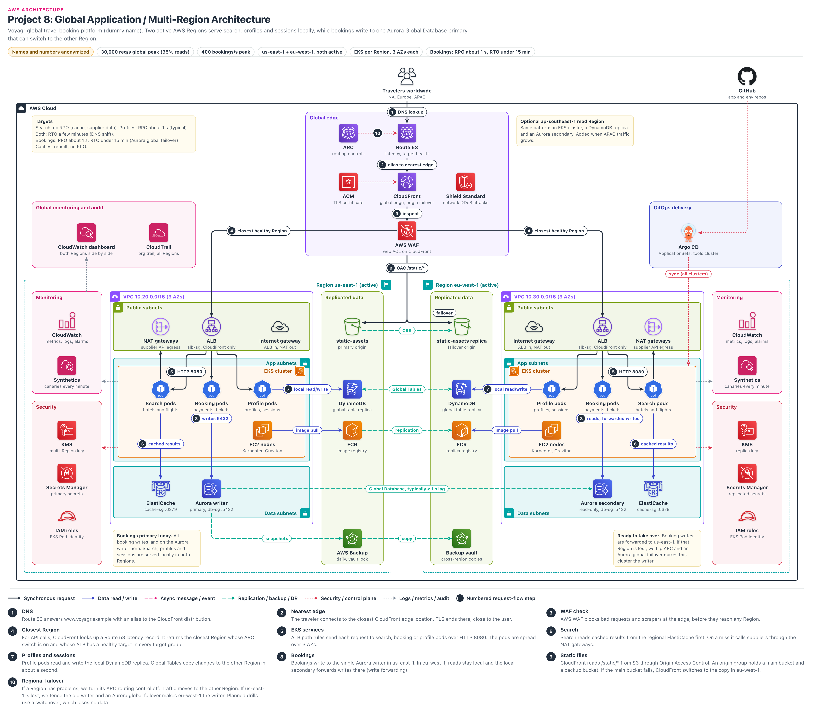

# Global Multi-Region Application

> **Confidentiality note:** Company names, domain names, IDs and all numbers in this document are dummy values. The architecture, the decisions and the trade-offs are what this document shares.
> Key figures (dummy values): peak of about 30,000 req/s (95% reads), 400 bookings/s, two active Regions (us-east-1 and eu-west-1). Bookings: RPO about 1 s, RTO under 15 minutes. Search and profiles: RTO of a few minutes.

## Contents

- [Architecture diagram](#architecture-diagram)
- [1. Project name](#1-project-name)
- [2. Business problem](#2-business-problem)
- [3. Architecture overview](#3-architecture-overview)
- [4. Request flow](#4-request-flow)
- [5. Why each AWS service](#5-why-each-aws-service)
  - Services: [Amazon Route 53](#amazon-route-53) · [Amazon Application Recovery Controller (ARC)](#amazon-application-recovery-controller-arc) · [Amazon CloudFront](#amazon-cloudfront) · [AWS WAF](#aws-waf) · [AWS Certificate Manager (ACM)](#aws-certificate-manager-acm) · [AWS Shield Standard](#aws-shield-standard) · [Amazon S3 (static-assets + Cross-Region Replication)](#amazon-s3-static-assets--cross-region-replication) · [Application Load Balancer (ALB)](#application-load-balancer-alb) · [Amazon VPC (in each Region, with VPC endpoints)](#amazon-vpc-in-each-region-with-vpc-endpoints) · [NAT Gateway](#nat-gateway) · [Internet Gateway](#internet-gateway) · [Amazon EKS](#amazon-eks) · [Amazon EC2 worker nodes (Karpenter, Graviton)](#amazon-ec2-worker-nodes-karpenter-graviton) · [Amazon ECR (with registry replication)](#amazon-ecr-with-registry-replication) · [Amazon ElastiCache (Valkey)](#amazon-elasticache-valkey) · [Amazon Aurora Global Database (PostgreSQL)](#amazon-aurora-global-database-postgresql) · [Amazon DynamoDB Global Tables](#amazon-dynamodb-global-tables) · [AWS Backup](#aws-backup) · [AWS KMS (multi-Region keys)](#aws-kms-multi-region-keys) · [AWS Secrets Manager (replicated secrets)](#aws-secrets-manager-replicated-secrets) · [AWS IAM (roles, EKS Pod Identity)](#aws-iam-roles-eks-pod-identity) · [Amazon CloudWatch (metrics, logs, alarms, Synthetics, cross-region dashboard)](#amazon-cloudwatch-metrics-logs-alarms-synthetics-cross-region-dashboard) · [AWS CloudTrail](#aws-cloudtrail) · [Argo CD (open source, not an AWS service)](#argo-cd-open-source-not-an-aws-service)
  - [Key decisions](#key-decisions)
- [5A. Key topics](#5a-key-topics)
  - [Multi-region architecture (what is global, what is regional)](#multi-region-architecture-what-is-global-what-is-regional)
  - [Active-active vs active-passive](#active-active-vs-active-passive)
  - [DNS failover (health checks, TTLs, ARC, client caching)](#dns-failover-health-checks-ttls-arc-client-caching)
  - [Database replication (Aurora Global Database)](#database-replication-aurora-global-database)
  - [Database replication (DynamoDB Global Tables, MREC vs MRSC)](#database-replication-dynamodb-global-tables-mrec-vs-mrsc)
  - [Disaster recovery (which DR strategy we use)](#disaster-recovery-which-dr-strategy-we-use)
  - [RTO/RPO per component](#rtorpo-per-component)
  - [Regional failure scenario (minute-by-minute timeline)](#regional-failure-scenario-minute-by-minute-timeline)
  - [Data residency (EU travelers data)](#data-residency-eu-travelers-data)
- [6. High availability](#6-high-availability)
- [7. Security](#7-security)
- [8. Monitoring](#8-monitoring)
- [9. Disaster recovery](#9-disaster-recovery)
- [10. Scaling (when traffic grows 10x)](#10-scaling-when-traffic-grows-10x)
- [11. Failure scenarios](#11-failure-scenarios)
  - [Failure 1: An EC2 node or pod crashes](#failure-1-an-ec2-node-or-pod-crashes)
  - [Failure 2: One AZ is lost in us-east-1](#failure-2-one-az-is-lost-in-us-east-1)
  - [Failure 3: Aurora writer instance fails (the Region is fine)](#failure-3-aurora-writer-instance-fails-the-region-is-fine)
  - [Failure 4: The whole us-east-1 Region is impaired (peak time)](#failure-4-the-whole-us-east-1-region-is-impaired-peak-time)
  - [Failure 5: Gray failure in eu-west-1 (slow, but health checks pass)](#failure-5-gray-failure-in-eu-west-1-slow-but-health-checks-pass)
  - [Failure 6: Aurora Global Database replication lag grows](#failure-6-aurora-global-database-replication-lag-grows)
  - [Failure 7: A bad deployment reaches both Regions](#failure-7-a-bad-deployment-reaches-both-regions)
  - [Failure 8: Cold cache + supplier throttling after failover (thundering herd: everyone hits the supplier at once)](#failure-8-cold-cache--supplier-throttling-after-failover-thundering-herd-everyone-hits-the-supplier-at-once)
  - [Failure 9: A wrong DELETE is replicated to both Regions](#failure-9-a-wrong-delete-is-replicated-to-both-regions)
- [12. Cost optimization](#12-cost-optimization)
- [13. Two-minute project walkthrough](#13-two-minute-project-walkthrough)
- [14. Deep-dive questions and answers](#14-deep-dive-questions-and-answers)
  - [Q1. Why are you active-active for reads but single-writer for bookings?](#q1-why-are-you-active-active-for-reads-but-single-writer-for-bookings)
  - [Q2. Why not put bookings in DynamoDB Global Tables and write in both Regions?](#q2-why-not-put-bookings-in-dynamodb-global-tables-and-write-in-both-regions)
  - [Q3. How does DNS failover work here, and what about clients that cache DNS?](#q3-how-does-dns-failover-work-here-and-what-about-clients-that-cache-dns)
  - [Q4. Route 53 health checks already fail over automatically. Why do you need ARC?](#q4-route-53-health-checks-already-fail-over-automatically-why-do-you-need-arc)
  - [Q5. What is the difference between Aurora global switchover and global failover?](#q5-what-is-the-difference-between-aurora-global-switchover-and-global-failover)
  - [Q6. How does Aurora write forwarding work, and what are its limits?](#q6-how-does-aurora-write-forwarding-work-and-what-are-its-limits)
  - [Q7. How do DynamoDB Global Tables resolve conflicts, and when would you choose MRSC?](#q7-how-do-dynamodb-global-tables-resolve-conflicts-and-when-would-you-choose-mrsc)
  - [Q8. Walk me through a full us-east-1 outage at peak.](#q8-walk-me-through-a-full-us-east-1-outage-at-peak)
  - [Q9. How do you prevent split-brain on the booking database?](#q9-how-do-you-prevent-split-brain-on-the-booking-database)
  - [Q10. Why didn't you use ElastiCache Global Datastore?](#q10-why-didnt-you-use-elasticache-global-datastore)
  - [Q11. How do you know eu-west-1 can really take 100% of traffic?](#q11-how-do-you-know-eu-west-1-can-really-take-100-of-traffic)
  - [Q12. How do you handle data residency for EU travelers?](#q12-how-do-you-handle-data-residency-for-eu-travelers)
  - [Q13. Why CloudFront in front instead of Global Accelerator or exposing the ALB directly?](#q13-why-cloudfront-in-front-instead-of-global-accelerator-or-exposing-the-alb-directly)
  - [Q14. Why a public ALB instead of CloudFront VPC origins with an internal ALB?](#q14-why-a-public-alb-instead-of-cloudfront-vpc-origins-with-an-internal-alb)
  - [Q15. Why EKS instead of ECS, and how do you deploy to two Regions safely?](#q15-why-eks-instead-of-ecs-and-how-do-you-deploy-to-two-regions-safely)
  - [Q16. How do you recover the bookings lost in the RPO window?](#q16-how-do-you-recover-the-bookings-lost-in-the-rpo-window)
  - [Q17. What does multi-region cost, and how did you justify it?](#q17-what-does-multi-region-cost-and-how-did-you-justify-it)
  - [Q18. Which hidden us-east-1 dependencies do people miss in multi-region designs?](#q18-which-hidden-us-east-1-dependencies-do-people-miss-in-multi-region-designs)
  - [Q19. How do you test DR, and how often?](#q19-how-do-you-test-dr-and-how-often)
  - [Q20. What would you change if you designed it again?](#q20-what-would-you-change-if-you-designed-it-again)
  - [Q21. Why Aurora Global Database instead of RDS PostgreSQL with a cross-region read replica?](#q21-why-aurora-global-database-instead-of-rds-postgresql-with-a-cross-region-read-replica)
- [Glossary](#glossary)

## Architecture diagram

### How to read the diagram
- **Down the middle, top to bottom (the global spine):** Travelers → Route 53 → CloudFront → AWS WAF. These are all global services. They do not belong to any single Region. They sit in the "Global edge" box.
- **Two Regions on the left and right (like a mirror image):** us-east-1 on the left, eu-west-1 on the right. Both are "active", which means both take real user traffic. Each Region has a VPC, an ALB, EKS pods, ElastiCache and Aurora.
- **"Replicated data" columns in the middle:** S3, DynamoDB, ECR and AWS Backup. The green dashed lines (CRR, Global Tables, replication, copy) show data being copied between Regions. At the bottom, the line between the two Aurora clusters says "Global Database, typically < 1 s lag".
- **Numbered badges (1 to 10):** these are the same steps as in section 4. Steps 1 to 4 are the global path, 5 to 8 happen inside a Region, 9 is static files, and 10 is Region failover (ARC).
- **Side panels:** top left has the Targets note (RTO/RPO) and Global monitoring (cross-region dashboard, CloudTrail). Only one line is drawn to the dashboard, from us-east-1 Monitoring, but eu-west-1 metrics also appear on the same dashboard. Top right has GitHub + Argo CD (GitOps delivery). Each Region has Monitoring and Security panels outside it.
- **Note:** the optional ap-southeast-1 read Region is only a note on the diagram. Items such as the EU PII table, GuardDuty and Security Hub are not drawn, but they exist. AWS limits, prices and timings change over time, so read them as "typically" or "about".

## 1. Project name
- **Voyagr Global Booking Platform:** a global travel platform where people search and book hotels and flights. It runs in two AWS Regions at the same time.
- In one line: search, profiles and sessions are served locally in both Regions (active-active). Bookings go to a single database writer (single writer), and that writer moves to the other Region when needed.
- **What multi-Region means:** running the app fully not just in one Region (for example us-east-1) but also in a second Region far away. Even if one whole Region goes down, the business does not stop.

## 2. Business problem

### Who is the company?
- Voyagr is an online travel booking company.
- Travelers from North America, Europe and APAC use a browser or the mobile app to search hotels and flights, make bookings, and view their profile (not passport details, but preferences and saved travelers).
- 95% of traffic is reads: searching and looking at prices. Booking is a small part of the traffic, but that is where the money comes from.
- Old setup: everything ran only in us-east-1. European users had to cross the Atlantic for every request.

### What were the problems?
1. **Slow for Europe and APAC users:** when a traveler in London searches for a hotel, the app makes many API calls for that page (around 10). Each call has to cross the Atlantic to us-east-1 and come back, about 70 to 90 ms every time. The page took more than 3 seconds, and the share of people who search and then book (conversion) dropped.
2. **If one Region goes down, the whole business stops:** last year an AWS outage in us-east-1 stopped bookings for about 3 hours. The backup plan was "restore from snapshot", which takes hours.
3. **Fear of double booking:** two people in two Regions must not book the same hotel room at the same time. So we cannot simply say "let us write everything in both places".
4. **Price scrapers:** competitors scrape prices with bots. A large part of search traffic is bots, and this raises the supplier API bill.
5. **EU data rules:** the legal team is asking where European travelers' data (GDPR) is stored and who can see it. Some corporate customers ask in their contracts to "keep it in the EU".

### What did the company need?
| Need | Target | Simple meaning |
|---|---|---|
| Availability (search, booking) | 99.99% | Only about 4 minutes of downtime per month; hard to reach with a single Region |
| Speed | search API p99 under 300 ms (inside the Region) | 99 out of 100 search requests must get an answer in under 0.3 seconds, from the nearest Region |
| Peak load | 30,000 req/s global, 400 bookings/s | 95% reads; if one Region goes down, the remaining Region alone must take 30,000 req/s |
| RPO, RTO: bookings | RPO about 1 s, RTO under 15 minutes | If a Region goes down, only the last 1 second of bookings is at risk; bookings work again within 15 minutes |
| RPO, RTO: search, profiles | Search: RPO does not apply (cache, supplier data); profiles: RPO about 1 s (typical), a few seconds in the worst case. RTO of a few minutes | As soon as DNS changes, the other Region serves the traffic |
| Caches | No RPO | Losing the cache is fine, we fill it again |
| Security | block bots, encryption, least privilege, audit | Stop scrapers at the edge, and record every API call |
| Data residency | follow the rules for EU travelers' data | Be able to clearly say which data is copied to the US |

### Why this architecture?
- **Many reads, few writes:** since 95% of traffic is reads, serving reads locally in both Regions improves both latency and availability.
- **Only one writer for bookings:** 400 bookings/s is a very small load for one Aurora writer. There is no need to add multiple writers and bring in conflicts and double booking risk.
- **Changing Regions is a human decision:** Route 53 health checks automatically remove a Region that is fully down. But moving traffic with the ARC switch, and moving the database writer with Aurora global failover, are decisions made by the on-call engineer. This greatly reduces the risk of split-brain (two Regions both thinking "I am the writer" at the same time and writing different data).
- **We do not copy what we can rebuild:** we do not copy caches between Regions. This reduces cost and complexity.

## 3. Architecture overview

### Internet and DNS
- **Route 53:** the AWS DNS service (it turns names like `www.voyagr.example` into addresses). When someone asks for `www.voyagr.example`, it returns the CloudFront address (alias record). It also runs health checks.
- **Latency record:** a second DNS name for the API origin (for example `api-origin.voyagr.example`). It has two latency records, one for each Region's ALB. "Evaluate target health" is on: if any one target group on the ALB has no healthy target at all, Route 53 does not return that ALB (details in 5A).
- **ARC (Application Recovery Controller, old name Route 53 ARC):** an on/off switch (routing control) for each Region. Turning it Off stops traffic to that Region.

### Edge
- **CloudFront:** the AWS CDN (Content Delivery Network: a network that serves content from servers all around the world). Those servers are called edge locations. At the edge locations, TLS ends close to the user, static files are cached, and API calls go to the nearest Region.
- **AWS WAF:** a web firewall. A web ACL on CloudFront with managed rules, rate limits on search, and Bot Control against price scrapers.
- **ACM:** free TLS certificates. The CloudFront certificate must be in us-east-1, and it renews automatically.
- **Shield Standard:** free network DDoS protection that comes with CloudFront and Route 53.

### Network (in each Region)
- **VPC:** our private network. us-east-1 uses `10.20.0.0/16`, eu-west-1 uses `10.30.0.0/16`. The CIDRs do not overlap, so we can connect the Regions in the future.
- **3 AZs:** 3 Availability Zones (separate groups of data centers) in each Region. Public, app and data subnets in each AZ.
- **Internet gateway:** the VPC's door to the internet. Traffic comes in to the ALB, and traffic goes out from NAT.
- **NAT gateways:** one in each AZ. Private pods can only go out (to hotel and airline supplier APIs). Nothing from outside can come in to them.
- **VPC endpoints:** a private path to AWS services such as S3, DynamoDB and ECR without using the internet (not drawn on the diagram).

### Application (in each Region)
- **ALB (Application Load Balancer):** an HTTP load balancer across 3 AZs. It only accepts traffic coming from CloudFront (alb-sg + secret header).
- **EKS (Elastic Kubernetes Service):** AWS managed Kubernetes. One cluster in each Region. AWS runs the control plane, and we look after the worker side.
- **Three services (pods):** Search pods (hotels, flights, most of the traffic), Booking pods (payments, tickets), Profile pods (profiles, sessions).
- **EC2 nodes:** the servers where pods run. Karpenter (an open source node autoscaler) adds and removes Graviton nodes (AWS ARM chips, lower cost) based on demand.
- **ECR:** the container image registry. Replication from us-east-1 to eu-west-1, so nodes pull images from their own Region.

### Data
- **ElastiCache (Valkey):** an in-memory cache. Search results and prices live here. Each Region has its own cache, with no copy between Regions (we did not use Global Datastore).
- **Aurora Global Database (PostgreSQL):** the bookings database. The writer (primary) is in us-east-1, and a read-only secondary is in eu-west-1. Replication happens at the storage level, and lag is typically under 1 second.
- **DynamoDB Global Tables:** a NoSQL table with a replica in both Regions. Both reads and writes can be done in either place. Profiles and sessions live here.
- **S3:** static web files (`static-assets` bucket). A copy in eu-west-1 with Cross-Region Replication (CRR).

### Security
- **IAM roles + EKS Pod Identity:** each service has its own IAM role, and there are no access keys inside pods.
- **KMS multi-Region keys:** the same key material in both Regions, so data encrypted in one place can be decrypted in the other.
- **Secrets Manager:** DB and supplier API secrets. Replicated to eu-west-1, so the app can start even if us-east-1 is down.
- **Security groups:** alb-sg, pod SGs (search, booking, profile), db-sg (:5432), cache-sg (:6379). Details in section 7.

### Monitoring
- **CloudWatch (in each Region):** metrics, logs and alarms. Container Insights (EKS metrics), and alarms on errors, p99 latency and Aurora replica lag.
- **CloudWatch Synthetics:** canaries (small scripts) run a fake search and a test login against each Region every minute. We learn about a problem before users do.
- **Cross-region dashboard:** shows both Regions side by side on one screen (latency, errors, replication lag, canaries). The dashboard is a global resource, but the metrics are regional (section 8).
- **CloudTrail:** records every AWS API call. An organization trail, all Regions, sent to the log archive account.

### Delivery (GitOps)
- **GitHub:** app code and the environment repo. **Argo CD** (a Kubernetes GitOps tool) runs in a small tools EKS cluster.
- One **ApplicationSet** creates the same app in each Region's cluster. Both Regions run the same version.

### DR (Disaster Recovery)
- **Pattern:** active-active for reads, single writer + managed failover for bookings. This is not warm standby (a small-size stack in the second Region with no traffic). The second Region always takes real traffic.
- **AWS Backup:** daily Aurora and DynamoDB backups with vault lock (nobody can delete them until the retention period ends). Copied to the eu-west-1 Backup vault. Replication also copies a "wrong delete", and backup protects us from that.
- **Optional ap-southeast-1:** if APAC traffic grows, a third Region with the same pattern (EKS cluster, DynamoDB replica, Aurora secondary). Only a note on the diagram.

## 4. Request flow
- API call: `Traveler → Route 53 → CloudFront edge → AWS WAF → Route 53 latency record → ALB (closest healthy Region) → EKS pods → ElastiCache / DynamoDB / Aurora`
- Static file: `Traveler → Route 53 → CloudFront edge → AWS WAF → S3 static-assets (OAC), failover to S3 replica`

### Step 1: DNS (Route 53)
- The traveler's app asks DNS for `www.voyagr.example` (UDP/TCP 53).
- The Route 53 alias record returns the CloudFront distribution address. This answer never changes, not even during a Region failover.
- **Why it matters:** the Region switch does not happen here. So even if users' phones and browsers cache DNS, failover is not a problem.
- Time: 0 ms if cached, otherwise about 10 to 50 ms.

### Step 2: Nearest edge (CloudFront)
- The traveler connects over HTTPS (443) to the nearest CloudFront edge location.
- The TLS handshake ends right there (ACM certificate). A European user gets a European edge, with no need to cross the Atlantic.
- From the edge to the AWS Region, traffic travels on AWS's own backbone network, which is more stable than the public internet.
- Time: since the TLS handshake happens nearby, it saves about 20 to 40 ms.

### Step 3: WAF check (AWS WAF)
- The web ACL attached to CloudFront checks every request.
- Managed rules (SQL injection, bad inputs, IP reputation), a rate-based rule on `/api/search` (for example 2,000 requests per IP in 5 minutes), and Bot Control (price scrapers).
- A blocked request never reaches any Region. This reduces both supplier API cost and EKS load.
- Time: under about 1 ms (at the edge itself).

### Step 4: Closest Region (Route 53 latency record + ALB)
- For API calls (`/api/*`), the CloudFront origin is a DNS name: `api-origin.voyagr.example`. When CloudFront resolves it, the Route 53 latency record returns the nearest Region's ALB.
- **Healthy check:** if any target group on the ALB has no healthy target (evaluate target health), or the ARC switch is Off, that Region's answer is not returned. The other Region's ALB is returned instead.
- CloudFront → ALB: HTTPS 443. alb-sg allows traffic only from the CloudFront origin-facing prefix list (an AWS managed list with all the IP ranges of CloudFront servers). The ALB listener rule returns 403 if the secret header (`X-Origin-Verify`) is missing.
- Each ALB has an ACM certificate in its own Region (with the name `api-origin.voyagr.example`).
- Time: about 5 to 20 ms from a European edge to eu-west-1.

### Step 5: EKS services (ALB → pods)
- ALB path rules: `/api/search/*` → search pods, `/api/bookings/*` → booking pods, `/api/profile/*` → profile pods.
- The AWS Load Balancer Controller uses IP targets, which means the ALB goes straight to the pod IP on HTTP 8080 (pod SGs allow 8080 from alb-sg).
- Pods are spread across 3 AZs (topology spread constraints). If one AZ goes down, the remaining pods keep serving.
- Time: about 1 to 3 ms for the ALB.

### Step 6: Search (Search pods → ElastiCache, suppliers via NAT)
- The search pod first looks for cached results in the regional ElastiCache (Valkey, TLS, port 6379, cache-sg). On a hit, it takes about 1 ms.
- On a miss, it makes an HTTPS call to hotel and airline supplier APIs through the NAT gateways. This is slow (about 300 ms to 2 s) and it also costs money.
- We put the result in the cache with a TTL (for example 5 minutes for availability). The target cache hit rate is above 85%.
- **Stale price is safe:** at booking time we confirm the price again with the supplier, so even if the cache has an old price, nobody is charged the wrong amount.

### Step 7: Profiles and sessions (Profile pods → DynamoDB)
- Profile pods read and write to the local DynamoDB replica (HTTPS, through a gateway VPC endpoint). Latency is under about 5 to 10 ms.
- Global Tables copy that change to the other Region, typically within one second.
- If the Region changes, the session is already there, so the user does not need to log in again (only changes from the last second are at risk).

### Step 8: Bookings (Booking pods → Aurora)
- **us-east-1:** booking pods write directly to the Aurora writer (PostgreSQL 5432, TLS, db-sg allows traffic only from booking-pod-sg).
- **eu-west-1:** reads come from the local secondary. Writes are sent to the us-east-1 writer with **write forwarding**. Each forwarded statement adds about 70 to 90 ms of cross-region round trip.
- Booking flow: hold the room/seat with the supplier → authorize payment → one small transaction in Aurora (3 to 4 plain SQL statements) → confirm.
- Each booking has an idempotency key (unique ID): even if the same request arrives twice because of a network retry, there is only one booking and only one charge.
- Time: the DB part takes about 10 ms in us-east-1, and about 100 to 200 ms from the EU. This is acceptable for booking, but not for search.

### Step 9: Static files (CloudFront → S3, origin failover)
- `/static/*` (JS, CSS, images) is served from the CloudFront cache. On a cache miss, it comes from the S3 `static-assets` bucket with Origin Access Control (OAC). OAC means only CloudFront can read the bucket, and the bucket is not public.
- **Origin group:** main bucket (us-east-1) + backup bucket (eu-west-1 replica). If the main bucket returns a 5xx or times out, CloudFront automatically goes to the replica.
- **Limit:** origin failover works only for GET, HEAD and OPTIONS. It does not work for POST (bookings), which is why API failover is done with Route 53 + ARC.
- File names contain a hash (`app.3f9a.js`), so we use a long cache TTL (1 year), and invalidation is rarely needed.

### Step 10: Regional failover (ARC routing controls → Route 53)
- If a Region has a problem (canaries fail, errors rise), the on-call engineer turns that Region's ARC routing control Off.
- Off means the health check attached to that Region's latency record fails. Route 53 stops returning that Region, and CloudFront goes to the other Region on its next resolve (ALB alias TTL 60 s).
- If us-east-1 goes down: with Aurora **global failover**, the eu-west-1 cluster becomes the writer (the last ~1 s of data may be lost).
- Planned drills: we use Aurora **switchover**, which does not lose data (RPO 0).
- We do not change the ARC switch from the console. The ARC cluster has endpoints (API addresses) in 5 different Regions, and we can change the switch with the CLI or a script through any one of them that works. The ARC console and config APIs live in us-west-2, and they may not be reachable during an outage.

### Other flows
- **Replication flows (background):** S3 CRR (static files), DynamoDB Global Tables (both directions), ECR replication (images), Aurora Global Database (us-east-1 → eu-west-1), AWS Backup snapshots → copy to the eu-west-1 vault.
- **Deploy flow:** developer merges in GitHub → CI builds the image → push to ECR us-east-1 → ECR replication to eu-west-1 → Argo CD ApplicationSet syncs both clusters. First one Region, then the other (progressive sync, see section 11).
- **Telemetry flow:** logs and metrics from pods and nodes → CloudWatch in each Region → cross-region dashboard. Canaries every minute.
- **Audit flow:** every API call (including ARC flips and Aurora failover calls) → CloudTrail org trail → log archive account.

## 5. Why each AWS service

### Amazon Route 53
**What it is:** the AWS DNS service: you ask for a name and it gives back an address. DNS answers and health checks run all over the world. The 100% availability SLA covers DNS answers only, not health checks.
**Why we used it:** a CloudFront alias for `www`, latency records + target health for the API origin, and to attach the ARC health checks.
**Problem it solves:** automatically picks the nearest healthy Region for the user.
**Alternatives:** AWS Global Accelerator (anycast static IPs), third-party DNS (Cloudflare, NS1).
**Why not the alternative:** Global Accelerator does not cache and does not bring WAF to the edge, and we need CloudFront anyway. With third-party DNS we lose the integration with ARC, alias records and target health.

### Amazon Application Recovery Controller (ARC)
**What it is:** on/off switches (routing controls) and safety rules for Region failover. The data plane is a cluster spread across 5 Regions.
**Why we used it:** to take a Region out of traffic on purpose, with a single API call.
**Problem it solves:** we can move traffic to another Region even during a "gray failure" (the Region is half working and health checks still pass). Safety rule: at least one Region must stay On.
**Alternatives:** changing Route 53 record weights, or relying on health checks only.
**Why not the alternative:** changing a record depends on the Route 53 control plane (us-east-1). Even with accelerated recovery turned on, if us-east-1 goes down we can only make changes again after about 60 minutes. The ARC cluster costs about $1,800 per month (list price), which is worth it for a 99.99% target.

### Amazon CloudFront
**What it is:** the AWS CDN. Hundreds of edge locations around the world. It ends TLS close to the user and answers from its cache.
**Why we used it:** to cache static files, to have one global entry point for API calls, to put WAF at the edge, and for S3 origin failover.
**Problem it solves:** lower latency for European and APAC users. DNS always gives users' phones and browsers the CloudFront address. The Region change happens behind CloudFront, so a phone's DNS cache does not block failover.
**Alternatives:** AWS Global Accelerator, or exposing the ALB directly.
**Why not the alternative:** Global Accelerator does not cache, and WAF is not at the edge the way it is with CloudFront. Exposing the ALB directly means no cache, and DDoS traffic and bots come straight to the Region.

### AWS WAF
**What it is:** a web firewall: it looks at the URL, headers and IP of every HTTP request and allows, blocks or shows a CAPTCHA based on rules.
**Why we used it:** one web ACL on CloudFront (global scope, created in us-east-1): AWS managed rules, rate-based rules on `/api/search`, and Bot Control.
**Problem it solves:** stops price scrapers at the edge itself. Both the supplier API bill and the EKS load go down.
**Alternatives:** a separate WAF on each Region's ALB, or third-party bot management.
**Why not the alternative:** WAF on the ALB means bad traffic has already entered the Region, and we would have to maintain two web ACLs. A third-party tool is good, but it is one more vendor and one more bill.

### AWS Certificate Manager (ACM)
**What it is:** free public TLS certificates with automatic renewal.
**Why we used it:** the CloudFront certificate (`www.voyagr.example`) must be in us-east-1. Each Region's ALB has a separate certificate in that Region.
**Problem it solves:** the site never goes down because a certificate expired (a very common cause of outages).
**Alternatives:** importing certificates from a third-party CA.
**Why not the alternative:** we would have to renew imported certs ourselves. That brings human error risk, and it also costs money.

### AWS Shield Standard
**What it is:** free network layer (L3/L4) DDoS protection that comes with CloudFront and Route 53.
**Why we used it:** attacks such as SYN floods and UDP reflection are absorbed at the edge.
**Problem it solves:** a large DDoS attack does not reach the Region's ALB.
**Alternatives:** Shield Advanced (about $3,000 per month + data fees, list price).
**Why not the alternative:** for now, WAF rate rules and Bot Control handle L7 attacks. If we build up a history of large attacks, we will move to Advanced (DDoS response team, cost protection).

### Amazon S3 (static-assets + Cross-Region Replication)
**What it is:** storage for files (objects). CRR (Cross-Region Replication) copies new files in one bucket to a bucket in another Region in the background (asynchronously).
**Why we used it:** the web app's JS, CSS and images live in the us-east-1 `static-assets` bucket, with an eu-west-1 replica through CRR. Both are in the CloudFront origin group.
**Problem it solves:** app files still load even if S3 in us-east-1 has a problem. Thanks to OAC, the bucket is not public.
**Alternatives:** S3 Replication Time Control (RTC: an AWS guarantee that the copy happens within 15 minutes) on top of CRR, or having the pipeline upload to both buckets.
**Why not the alternative:** RTC has an extra cost. Static files change only at deploy time, and the pipeline releases only after checking that the files have arrived in the replica, so we do not need that guarantee.

### Application Load Balancer (ALB)
**What it is:** a load balancer that looks at the URL path and sends HTTP/HTTPS requests to the right pods. It runs health checks and runs in 3 AZs.
**Why we used it:** one in each Region. It sends `/api/search`, `/api/bookings` and `/api/profile` to the right pods. The Route 53 latency record looks at its target health.
**Problem it solves:** traffic goes only to healthy pods, even when pods change or an AZ goes down. It signals the Region's health to Route 53.
**Alternatives:** NLB, API Gateway, or an internal ALB with CloudFront VPC origins.
**Why not the alternative:** NLB has no path routing, and API Gateway has a high per-request cost at 30,000 req/s. A VPC origin needs the ALB ARN (not a DNS name), so we cannot pick the Region with Route 53 latency routing (Q14). That is why we use a public ALB, but we locked it down (section 7).

### Amazon VPC (in each Region, with VPC endpoints)
**What it is:** our private network. us-east-1 uses `10.20.0.0/16`, eu-west-1 uses `10.30.0.0/16`. Each one has 3 AZs with public, app and data subnets.
**Why we used it:** ALB and NAT in public subnets; pods in app subnets; Aurora and ElastiCache in data subnets. VPC endpoints (gateway endpoints for S3 and DynamoDB; interface endpoints for ECR, Secrets Manager, KMS and CloudWatch) give a private path to AWS services.
**Problem it solves:** there is no path from the internet to the databases. Endpoints also reduce NAT data processing cost.
**Alternatives:** connecting the Regions with Transit Gateway peering or VPC peering.
**Why not the alternative:** all cross-region replication (Aurora, DynamoDB, S3, ECR) is AWS managed and does not need VPC connectivity. Independent VPCs also mean a network problem in one Region does not spread to the other. The price: the global writer endpoint cannot be reached from the other Region (5A). We still kept the CIDRs non-overlapping.

### NAT Gateway
**What it is:** a path that lets pods in private subnets go out to the internet only. Nothing from outside can come in.
**Why we used it:** search and booking pods must call hotel and airline supplier APIs (on the internet). One NAT gateway in each AZ.
**Problem it solves:** pods do not need public IPs. Suppliers allowlist our NAT Elastic IPs (different IPs per Region, and we gave both sets to them in advance).
**Alternatives:** a single NAT gateway (for all AZs), or self-managed NAT instances.
**Why not the alternative:** a single NAT means that if its AZ goes down, all supplier calls stop, and there is also cross-AZ cost. With NAT instances, patching and scaling become our job.

### Internet Gateway
**What it is:** the door that connects the VPC to the internet. AWS scales it by itself, and it has no cost.
**Why we used it:** traffic comes in from CloudFront to the ALB, and supplier calls go out from the NAT gateways.
**Problem it solves:** gives public subnets a path to the internet. We do not have to look after its scaling or HA.
**Alternatives:** fully private with no internet path (VPC origins + PrivateLink).
**Why not the alternative:** the suppliers are on the internet, and the ALB must be public for DNS-based Region selection (see the ALB section).

### Amazon EKS
**What it is:** AWS managed Kubernetes. AWS runs the control plane (API server, etcd) across 3 AZs. Worker nodes live in our VPC.
**Why we used it:** one cluster in each Region (search, booking and profile services). Argo CD runs in a small tools cluster.
**Problem it solves:** the same Kubernetes manifests and Helm charts are deployed the same way in both Regions. Fast scaling with HPA (Horizontal Pod Autoscaler: a Kubernetes feature that adds more pods when load grows) and Karpenter.
**Alternatives:** Amazon ECS on Fargate, or EKS Auto Mode.
**Why not the alternative:** the team has Kubernetes and Argo CD experience, and multi-cluster GitOps is easy with ApplicationSets. Auto Mode adds an extra fee per node. Trade-off: Kubernetes ships about 3 minor versions a year, and EKS standard support lasts about 14 months (after that there is an extended support fee), so we have to upgrade 3 clusters about 2 to 3 times a year.

### Amazon EC2 worker nodes (Karpenter, Graviton)
**What it is:** the virtual servers where pods run. Karpenter watches for pending pods and launches a node of the right size in about a minute.
**Why we used it:** Graviton (ARM) instances across 3 AZs. A mix of Spot (spare EC2 capacity at AWS, very cheap, but AWS takes it back with a 2-minute notice) and On-Demand for search pods, and On-Demand only for booking pods.
**Problem it solves:** when traffic doubles during a failover, nodes grow automatically. Better price-performance with Graviton.
**Alternatives:** Fargate for EKS, or Cluster Autoscaler + managed node groups.
**Why not the alternative:** Fargate has no DaemonSets and costs more at the 30,000 req/s scale. Cluster Autoscaler is slow with node groups, and instance types are not flexible.

### Amazon ECR (with registry replication)
**What it is:** the AWS container image registry. With a cross-Region replication rule, it automatically copies images to the registry in another Region.
**Why we used it:** CI pushes images to ECR in us-east-1. Replication copies them to eu-west-1. Nodes in each Region pull from their own Region's ECR (through a VPC endpoint).
**Problem it solves:** even if us-east-1 goes down, new nodes in eu-west-1 can pull images. No cross-region pull latency and no data transfer.
**Alternatives:** Docker Hub, GitHub Container Registry, or having CI push to the two Regions separately.
**Why not the alternative:** outside registries have rate limits and outage risk. If CI pushes to both places and one push fails, the Regions end up with different versions. With replication there is one image, and Argo CD checks that the image is there before syncing eu-west-1.

### Amazon ElastiCache (Valkey)
**What it is:** a managed cache that keeps data in memory (RAM). Valkey is an open source engine that came from Redis OSS. A read takes less than 1 millisecond.
**Why we used it:** each Region has its own cluster (cluster mode, Multi-AZ, with replicas). Search results and supplier prices, with a TTL.
**Problem it solves:** supplier APIs are slow (300 ms to 2 s) and each call costs money. A hit rate above 85% means 7 times fewer supplier calls.
**Alternatives:** ElastiCache Global Datastore (copies from one primary Region to a secondary in about 1 second), or DynamoDB DAX.
**Why not the alternative:** if the cache is lost we can fill it again. In Global Datastore the secondary is read-only, so EU pods would need cross-region writes to fill the cache. DAX works only for DynamoDB (Q10).

### Amazon Aurora Global Database (PostgreSQL)
**What it is:** one primary Region (a single writer) + read-only clusters in secondary Regions. Replication happens in the storage layer, so there is no load on the DB engine, and lag is typically under 1 second.
**Why we used it:** bookings need relational transactions (booking, payment status, ticket and inventory hold in one transaction). Writer + 2 readers in us-east-1, and a secondary cluster in eu-west-1 (2 instances, db.r7g.2xlarge). Write forwarding for writes in the EU.
**Problem it solves:** with a single writer there are no double booking conflicts. If a Region goes down, eu-west-1 can become the writer in minutes (global failover), and for planned moves there is no data loss (switchover). The global writer endpoint name does not change, but it resolves to a private IP in the primary Region's VPC, and our VPCs are not peered. That is why the booking pods have a switch: if the local cluster is a reader, they run in "forwarding mode", and if it is the writer, they run in "writer mode" (5A).
**Alternatives:** DynamoDB Global Tables (multi-writer), Aurora DSQL (multi-Region active-active SQL), or RDS PostgreSQL with a cross-region read replica.
**Why not the alternative:**
- In DynamoDB MREC (eventual consistency mode) the last writer wins, which is dangerous for room inventory (Q2).
- Aurora DSQL multi-Region clusters work only within one Region set (North America or Europe), with no cross-continent support: active-active DSQL across us-east-1 + eu-west-1 is not possible. DSQL uses optimistic concurrency, so hot rows such as popular room inventory get serialization errors and retries at commit time. There is no PL/pgSQL, no triggers and no temp tables, and a transaction can touch at most 3,000 rows.
- An RDS PostgreSQL cross-region replica copies at the engine level (WAL streaming), which puts load on the writer, and lag is usually higher. Promoting it is one-way, with no managed switchover/failback (Q21).

### Amazon DynamoDB Global Tables
**What it is:** a fully managed NoSQL table. Global Tables means the same table has a replica in each Region, and each replica accepts both reads and writes (active-active).
**Why we used it:** traveler profiles (preferences, saved travelers), login sessions and recent searches. MREC mode (multi-Region eventual consistency: a change shows up in the other Region a little later, in about one second), on-demand capacity. About 40 million profiles.
**Problem it solves:** whichever Region the user lands in, the profile and session are local (5 to 10 ms). If a Region goes down, there is nothing to promote, which is why search and profiles have an RTO of a few minutes (only a DNS shift).
**Alternatives:** putting profiles in Aurora as well, or MRSC mode (multi-Region strong consistency).
**Why not the alternative:** in Aurora, EU profile writes would also have to go to us-east-1. MRSC works across continents, but every write needs an Atlantic round trip and there is no TTL (sessions expire using TTL). Last-writer-wins is enough for profiles (5A).

### AWS Backup
**What it is:** a service that manages backups of services such as Aurora, DynamoDB, S3 and EBS in one place with policies. With Vault Lock, nobody can delete the backups.
**Why we used it:** daily Aurora and DynamoDB backups in a locked vault in us-east-1 (35 days). Each backup gets a cross-region copy to the eu-west-1 Backup vault.
**Problem it solves:** replication also copies "mistakes": a bad `DELETE`, ransomware or a buggy migration reaches both Regions within a second. Only a backup can save us from that.
**Alternatives:** only Aurora automated backups and DynamoDB PITR (Point-in-time recovery: bringing data back to any second in the last 35 days), or custom snapshot scripts.
**Why not the alternative:** we do use PITR, but it stays in the same account and the same Region. Scripts have no audit, lock or reporting. Next step: a logically air-gapped vault (in a separate account).

### AWS KMS (multi-Region keys)
**What it is:** the encryption keys service. A multi-Region key means the same key ID and the same key material in two Regions (primary + replica key).
**Why we used it:** Aurora, DynamoDB, ElastiCache, EBS, S3 and backups are all encrypted with customer managed keys. In the app, we encrypt some sensitive fields ourselves (for example loyalty numbers) with envelope encryption (encrypt the data with a data key from KMS, then encrypt that data key with the KMS key). The multi-Region key matters there.
**Problem it solves:** a field encrypted in us-east-1 travels to eu-west-1 with DynamoDB, and it is decrypted there with the replica key. No cross-region KMS call is needed.
**Alternatives:** separate single-Region keys in each Region.
**Why not the alternative:** single-Region keys are fine for services like Aurora and DynamoDB, but for fields the app encrypts by itself, without a multi-Region key we could not decrypt them when a Region goes down. EU-only data does use an eu-west-1 single-Region key (5A data residency).

### AWS Secrets Manager (replicated secrets)
**What it is:** a service that stores passwords and API keys encrypted and rotates them. Replica secrets copy them to other Regions.
**Why we used it:** Aurora credentials, supplier API keys and payment provider keys. Primary in us-east-1, replica in eu-west-1. Pods read them from the local Region with the External Secrets Operator (or the Secrets Store CSI driver).
**Problem it solves:** even if us-east-1 is completely down, eu-west-1 pods can start, because the secrets are local.
**Alternatives:** SSM Parameter Store SecureString, or HashiCorp Vault.
**Why not the alternative:** Parameter Store has no built-in cross-region replication and no managed rotation. With Vault we would have to run a multi-region cluster ourselves. If us-east-1 is down for a long time, we promote the replica to a standalone secret (section 7).

### AWS IAM (roles, EKS Pod Identity)
**What it is:** the permission system that says who (a user or a service) can do which action on which AWS resource. IAM is a global service.
**Why we used it:** each service has its own role (search-role, booking-role, profile-role) through EKS Pod Identity. Humans use IAM Identity Center with short-lived credentials.
**Problem it solves:** no access keys inside pods. profile-role gets only the profiles table, and booking-role gets only the booking secrets (least privilege).
**Alternatives:** IRSA (IAM Roles for Service Accounts), or the node instance role.
**Why not the alternative:** with IRSA, each cluster needs an OIDC provider and a trust policy change. With Pod Identity there is one trust policy, so adding a new Region's cluster is easy. The node role would give every pod on the node all permissions, which is wrong.

### Amazon CloudWatch (metrics, logs, alarms, Synthetics, cross-region dashboard)
**What it is:** the AWS monitoring service: metrics, logs, alarms and dashboards. Synthetics canaries are small scripts that run on a schedule and test the site like a real user.
**Why we used it:** Container Insights, app logs and alarms in each Region. Canaries against each Region every minute (fake search, test login). One cross-region dashboard shows both Regions side by side.
**Problem it solves:** gives us data to decide "is this Region in trouble?". Canaries show a problem before users see it, and the ARC flip decision is based on this.
**Alternatives:** Datadog, Grafana + Prometheus (Amazon Managed Service for Prometheus).
**Why not the alternative:** AWS metrics (Aurora lag, DynamoDB replication latency, ALB) are native in CloudWatch, with no extra agents or licenses. CloudFront, Route 53 and WAF metrics live only in us-east-1, so for the "is the Region down?" decision we rely on cross-region canaries running from eu-west-1 (section 8).

### AWS CloudTrail
**What it is:** an audit log that records every API call in the AWS account (who, when, from where, and what they did).
**Why we used it:** an organization trail, all Regions, to an S3 bucket (Object Lock) in the log archive account. ARC routing control changes, Aurora failover calls, and KMS and IAM changes are all recorded here.
**Problem it solves:** after an incident we know exactly "who flipped ARC and at what time". Security investigations and compliance.
**Alternatives:** separate trails in each account, or CloudTrail Lake only.
**Why not the alternative:** account admins can disable separate trails. Member accounts cannot stop an org trail (an SCP also denies it; SCP = the maximum permission limit set on accounts in AWS Organizations). CloudTrail Lake costs more, so we use it only when needed.

### Argo CD (open source, not an AWS service)
**What it is:** a Kubernetes GitOps tool. It syncs the desired state stored in a Git repo into the clusters. An ApplicationSet creates one app per cluster from a single template.
**Why we used it:** it runs in a tools EKS cluster, and one ApplicationSet deploys the same version to both Region clusters.
**Problem it solves:** no drift between Regions (an old version in one Region). Rollback means a Git revert.
**Alternatives:** Flux, or `kubectl`/Helm deploys from CodePipeline.
**Why not the alternative:** the team is used to Argo CD and ApplicationSets. Push-based pipelines need cluster credentials stored in CI. Trade-off: if the tools cluster is in us-east-1 and that Region goes down, we cannot deploy (running apps do not stop), which is why we keep standby Argo CD manifests in eu-west-1.

### Key decisions
| Decision | Chosen | Rejected | Why |
|---|---|---|---|
| Multi-region pattern | Reads active-active, bookings single writer | Everything active-passive, or everything multi-writer | 95% of reads are served locally; bookings must not have conflicts |
| Bookings database | Aurora Global Database | DynamoDB Global Tables, Aurora DSQL, RDS PostgreSQL cross-region replica | Relational transactions with a single writer, so no double booking; DSQL does not combine US + EU in one cluster, and has OCC retries on hot rows; an RDS replica has no managed switchover and no global writer endpoint |
| Profiles, sessions | DynamoDB Global Tables (MREC) | Aurora, MRSC | Local writes in both Regions (a few ms); MRSC can now combine US + EU, but MRSC has no TTL and no transactions, and every write needs an Atlantic round trip |
| Region failover trigger | ARC routing controls (human decision) + Route 53 health checks (automatic) | Health checks only | Health checks cannot catch a slow (gray) Region; if the DB writer changes automatically there is a split-brain risk, so a human decides |
| Global entry | CloudFront + Route 53 latency origin | Global Accelerator, direct ALB, geolocation/weighted routing | We get cache and WAF at the edge; users' DNS always shows CloudFront, so a phone's DNS cache does not block failover; latency routing gives the fastest Region, and if a Region is Off it automatically moves to the other one |
| ALB exposure | Public ALB, prefix list + secret header | CloudFront VPC origin (internal ALB) | A VPC origin cannot be selected with DNS latency routing |
| Cache across Regions | Regional caches, no copy | ElastiCache Global Datastore | Cache can be refilled if lost; copying costs more; in Global Datastore the second Region cannot write |
| Compute | EKS + Karpenter + Argo CD | ECS, EKS Auto Mode | The team has Kubernetes and Argo CD experience, and one template deploys to all clusters; but cluster upgrades are our job |

## 5A. Key topics

### Multi-region architecture (what is global, what is regional)
- The first question in multi-region is: "Which component lives in only one Region, and which is global?" If we do not know this, a hidden single point of failure stays behind.

| Component | Global / Regional | What it means for us |
|---|---|---|
| Route 53 DNS answers, health checks | Global data plane | DNS works even if a Region goes down |
| Route 53 record changes (control plane) | In us-east-1 | We turned on accelerated recovery: if us-east-1 goes down, record changes work again from us-west-2 in about 60 minutes (must be enabled in advance, public hosted zones only). That is slow for our 15-minute RTO, which is why we use ARC |
| CloudFront, WAF (CloudFront scope), Shield | Global edge | Config changes go through the us-east-1 control plane, but serving happens at the edge |
| IAM | Global, control plane in us-east-1 | Roles must exist in advance; do not create new roles during failover |
| ARC routing controls | Cluster across 5 Regions | A flip does not depend on any single Region |
| ALB, EKS, ElastiCache, NAT, VPC | Regional | A separate copy in each Region |
| Aurora Global DB, DynamoDB Global Tables, S3 CRR, ECR, Secrets, KMS MRK | Regional resources + AWS managed replication | Data lives in both Regions |

- **What control plane and data plane mean:** control plane = the AWS APIs that create and change resources (a new DNS record, a new IAM role). Data plane = the daily running work (DNS answers, sending traffic, reads/writes). During an outage the control plane may not work, while the data plane usually keeps running.
- **Static stability rule:** during failover we must not depend on us-east-1 control planes (IAM, Route 53 records, CloudFront config). An ARC flip is a data plane action. Aurora global failover is an RDS regional control plane API in eu-west-1 (it does not depend on us-east-1, but it is not data plane). Karpenter scale-out also depends on the eu-west-1 EC2 control plane, which is why we keep baseline capacity in place in advance.
- **Thinking in cells:** each Region is an independent cell. A service inside a Region does not synchronously call a service in another Region (booking write forwarding is the only exception, and we handle it carefully).

### Active-active vs active-passive
| Pattern | What it is | Plus | Minus |
|---|---|---|---|
| Active-passive (warm standby / pilot light) | One Region takes traffic, the other sits ready | Simple, no conflicts | We do not know if the standby really works, so failover is risky |
| Active-active | Both Regions take real traffic | Tested every day, lower latency | Data conflicts, cost, complexity |

- **We are hybrid:** search, profiles and sessions are active-active. Bookings are "active-active compute, single-writer data".
- **Why bookings are not multi-writer:** if two people book the same room in New York and London in the same second, with eventual consistency both succeed. Later one has to be cancelled, and the customer is angry. With a single writer, only the database decides.
- **The cost of a single writer:** about 100 to 200 ms extra for EU bookings. A traveler searches dozens of times for one trip and books only once. So a 0.2 second delay on the booking click is barely noticed by the user.
- **To be honest:** the eu-west-1 Aurora is not a writer today, only a standby. But eu-west-1 serves search and profiles traffic every day. So the "standby we are not sure works" risk applies only to the bookings writer, and we test it with a switchover drill every 3 months.

### DNS failover (health checks, TTLs, ARC, client caching)
- **Two DNS layers:** (1) `www.voyagr.example` → CloudFront alias, never changes. (2) `api-origin.voyagr.example` → latency records, one for each Region's ALB. Failover happens only in the second layer.
- **Automatic path (health checks):** "Evaluate target health" is on for the latency alias record. Route 53 treats the ALB as healthy only if every target group on it (search, booking, profile) has at least one healthy target.
- **Side effect of this:** if all targets in even one target group are unhealthy (or there is an empty target group), the whole Region drops out of DNS, including search. For example, in a bad deploy only the booking pods crash. That is why every target group health check is shallow (`/healthz`, no DB check), and we do not attach empty target groups to the ALB.
- **Why latency routing and not geolocation:** a latency record returns the Region that answers fastest, and if that Region is Off it automatically moves to the other one. Geolocation routes by country, and failover needs a default record and extra health checks. Weighted records are good for shifting traffic slowly, but changing weights is control plane work.
- **Manual path (ARC):** we attached an ARC routing control health check to each Region's record. Control Off means the health check is unhealthy, and that Region's answer stops.
- **Safety rule:** ARC assertion rule "at least one Region must be On". A tired on-call engineer cannot turn both Off.

| Item | Value | Why |
|---|---|---|
| ALB alias record TTL | 60 s (fixed by AWS) | CloudFront gets the new Region on its next resolve |
| ALB target group health check | every 10 s, unhealthy after 3 failures | The target becomes unhealthy in about 30 to 40 s, then Route 53 (evaluate target health) removes that Region. We did not use Route 53 endpoint health checks; ARC routing control health checks have no interval |
| From ARC flip to traffic fully moved | about 2 to 3 minutes | health check propagation + TTL + recycling old connections |
| Existing connections (CloudFront → ALB) | We reduced the ALB "HTTP client keepalive duration" from 3600 s (default) to about 60 to 120 s | The keep-alive timeout applies only to idle connections; busy connections keep going to the old ALB. In a gray failure where the ALB is still alive, CloudFront uses the new DNS answer only after connections recycle |

- **Client DNS caching reality:** mobile operating systems, ISP resolvers and Java apps (JVM DNS cache) can ignore the TTL and hold on to an old IP for hours. If users went straight to the ALB IP, failover would be slow. In our design users always go to CloudFront, and CloudFront (on the AWS side) picks the Region, so this problem does not happen.
- **Gray failure:** the Region is half working (for example bookings are slow, but the health check path `/healthz` still returns 200). Health checks do not catch this. A human looks at canaries + p99 alarms and flips ARC. That is why we have both automatic and manual.
- **Common mistake, deep health check:** if the health check also checks the DB, then even a brief pause of the Aurora writer makes the health checks in both Regions fail at the same time (both depend on the same us-east-1 writer). That is why the health check covers only the app (shallow). Testing together with the DB is done by the canaries, which only raise alarms and do not move traffic.
- **Fail-open behavior:** if all records in Route 53 are unhealthy, it treats all of them as healthy and returns answers. If both Regions look "down" at the same time, traffic does not stop completely.

### Database replication (Aurora Global Database)
- **How it works:** the primary cluster sends the redo log records from its storage to the secondary Region's storage over dedicated AWS infrastructure. There is no load on the DB instances. Lag is typically under 1 second.
- **Watching the lag:** the `AuroraGlobalDBReplicationLag` (ms) and `AuroraGlobalDBRPOLag` metrics. Alarm: above 2,000 ms for 5 minutes.
- **Managed RPO (PostgreSQL):** if you set the `rds.global_db_rpo` parameter, the primary pauses commits when the secondary falls behind by more than that many seconds (minimum about 20 s). We did not set it: for the business, taking a little RPO risk is better than stopping bookings. This decision was made together with the business.
- **Write forwarding (eu-west-1):** the EU booking pod sends SQL to the secondary, and the secondary forwards those writes to the primary. Consistency mode is `session` (the session sees its own writes right away). Each forwarded statement costs a cross-region round trip.
- **Write forwarding limits:** DDL (schema changes such as creating or altering tables), user-defined functions/procedures, `SAVEPOINT`, `LOCK`, `COPY`, `TRUNCATE` and cursors are not forwarded. `SERIALIZABLE` isolation is also not available (only READ COMMITTED and REPEATABLE READ). `INSERT/UPDATE/DELETE` and `SELECT ... FOR UPDATE` work.
- **So in the booking code:** we wrote the transaction as 3 to 4 plain DML statements (for example `UPDATE inventory ... WHERE available > 0 RETURNING`, `INSERT ... ON CONFLICT DO NOTHING`), not a stored procedure. ORM savepoints are off. If the primary is unreachable, writes fail.
- **Switchover vs failover:**

| | Switchover (planned) | Global failover (unplanned) |
|---|---|---|
| When | Drills, maintenance, Region evacuation (the primary is still alive) | The primary Region is down |
| Data loss | None (RPO 0), it syncs first | What is in the lag may be lost (about 1 s) |
| Time | typically a few minutes | typically a few minutes |
| Afterwards | The old primary automatically becomes a secondary | When the old Region comes back, Aurora rebuilds it as a secondary |

- **Global writer endpoint:** pods in the Region that has the writer connect to it. There is no VPC peering, so pods in the other Region cannot reach it (it resolves to a private IP in the primary VPC). They use the local reader endpoint + forwarding.
- **After failover:** EU booking pods must switch from "forwarding mode" to "writer mode" (global writer endpoint). This is a config flag and one step in the runbook (or automatic with an RDS event). The DNS cache TTL is about 5 s, and the driver retries. Alternative: with inter-Region VPC/TGW peering the pods could connect directly, but the cross-region blast radius grows.
- **Lost writes:** after an unplanned failover, Aurora keeps a snapshot of the old cluster (typically) so we can recover the last writes that exist only in the old primary. We compare them with payment provider records using a reconciliation job (section 9).

### Database replication (DynamoDB Global Tables, MREC vs MRSC)
- **MREC (multi-Region eventual consistency):** a write succeeds locally right away on each replica. It is copied to the other Region asynchronously, typically within one second. Metric: `ReplicationLatency`.
- **Conflict resolution:** if the same item is changed in two Regions at almost the same time, "last writer wins" (the last write by timestamp stays). The whole item is replaced, and attributes are not merged.
- **Reducing conflicts:** a user goes to only one Region at a time (latency routing), so concurrent writes to the same item are very rare. We do not put things like counters in a global table. Sessions use a `version` attribute + conditional writes (inside the Region).
- **Transactions:** `TransactWriteItems` is ACID only in that Region. In the other Region they arrive as separate writes, and a partial state may be visible there in between.
- **TTL deletes:** sessions expire with TTL. TTL deletes are also replicated.
- **MRSC (multi-Region strong consistency):** a write succeeds only after it exists in at least one other Region. Strongly consistent reads return the latest data in any Region. RPO 0.
- **MRSC limits (these are what matter to us):** no TTL, no transactions such as `TransactWriteItems`, no LSIs. MRSC must be created while the table is empty, and replicas cannot be added later. If two Regions change the same item at the same time, you get `ReplicatedWriteConflictException`, and the app must retry.

| | MREC | MRSC |
|---|---|---|
| Consistency | Eventual, last writer wins | Strong, error on conflict (retry) |
| Write latency | Local (a few ms) | Adds a cross-region round trip |
| Regions | Any Regions | Exactly 3 (3 replicas, or 2 replicas + 1 witness; a witness keeps a copy of the data but does not serve reads/writes, it exists only for the strong consistency quorum), any 3 of the supported Regions (even across continents) |
| Our use | Profiles, sessions | If we ever need strong consistency within the EU only (for example eu-west-1, eu-west-2, eu-central-1) |

- **Why MREC:** if the last write wins on a profile preference, nothing is lost. MRSC can combine us-east-1 + eu-west-1, but every write needs an Atlantic round trip (more than about 70 to 90 ms), and MRSC does not have the TTL that sessions need.
- **Cost note:** every write is billed as a replicated write on every replica (global tables prices were cut in 2024, but writes still cost double).

### Disaster recovery (which DR strategy we use)
| Strategy | In simple words | RTO / RPO (approx.) | At Voyagr |
|---|---|---|---|
| Backup and restore | Only backups in another Region | hours / hours | Last line of defense (bad delete, ransomware) |
| Pilot light | DB replica exists, compute off | tens of minutes / seconds | Not used |
| Warm standby | A full stack running at a small size | minutes / seconds | Not used |
| Multi-site active-active | Both Regions take real traffic | minutes or less / seconds | Search, profiles, sessions; bookings compute |

- Bookings data, however, is "active-active compute + single writer + managed failover". This means the only DR work we do is: ARC flip + Aurora failover.
- Replication protects against disaster (Region loss). It does not protect against corruption (bad data). Both need separate plans (section 9).

### RTO/RPO per component
| Component | RPO | RTO | How |
|---|---|---|---|
| Search (reads) | does not apply (supplier data, cache) | a few minutes | ARC flip / health check, DNS shift |
| Profiles, sessions (DynamoDB) | about 1 s (typical), a few seconds in the worst case (we watch `ReplicationLatency`) | a few minutes | Global Tables, nothing to promote |
| Bookings (Aurora) | about 1 s (unplanned), 0 (switchover) | under 15 minutes | ARC flip + Aurora global failover |
| Static files (S3) | CRR lag (minutes), they change only with deploys | seconds | CloudFront origin group, automatic |
| Caches (ElastiCache) | No RPO | immediate (cold), warm within 10 to 15 minutes | The other Region's cache is already running |
| Container images (ECR) | last replication | immediate | eu-west-1 replica |
| Secrets | last rotation | immediate | Replica secrets |
| Bad delete / corruption | Backup / PITR point (minutes to 24 hours) | hours | AWS Backup, PITR restore |

- **Tip:** do not give one single number such as "our RTO is 15 minutes". Stating it per component is the senior-level answer.

### Regional failure scenario (minute-by-minute timeline)
Scenario: a big problem in us-east-1 at peak time. EKS pods are getting errors, and the Aurora writer is also unreachable.

| Time | What happens | Who |
|---|---|---|
| T+0 to T+1 | 5xx errors rise in us-east-1. Because the writer is unreachable, both us-east-1 bookings and EU forwarded writes fail right away. The booking circuit breaker (a switch that stops calls for a short time when errors are high) shows a banner: "bookings are briefly unavailable, search is working" | App |
| T+1 | Canaries fail. ALB 5xx and p99 alarms fire. Composite alarm (one alarm that combines many alarms with AND/OR) → SNS (the AWS notification service that sends alarm messages to PagerDuty and email) → pager | CloudWatch |
| T+1 to T+2 | If any target group on the ALB becomes fully unhealthy, Route 53 automatically stops returning us-east-1. In a gray failure it does not | Route 53 |
| T+3 | On-call + incident commander look at cross-region canaries running from eu-west-1 and at eu-west-1 alarms. They confirm the problem is "only in us-east-1" (also with the AWS Health Dashboard) | Humans |
| T+4 | eu-west-1 pre-scale: the runbook script goes straight to the eu-west-1 EKS API (kubectl, access granted in advance), without depending on Argo CD (if the tools cluster is in us-east-1, it is also down). Afterwards the same change is committed in Git, otherwise when Argo CD comes back its self-heal changes the HPA back to the old value | On-call |
| T+5 | ARC: us-east-1 routing control Off (a CLI command to any one of the 5 ARC Regional endpoints, not the console) | On-call |
| T+6 to T+8 | Route 53 stops returning us-east-1. After the 60 s TTL and the recycling of old connections, CloudFront sends traffic to eu-west-1. Search, profiles and sessions work | Automatic |
| T+8 | Decision: the writer is unreachable, and the last lag value is about 1 s. First fencing: scale us-east-1 booking pods to 0 (if the EKS API is reachable) or use the booking kill switch. Then start global failover (allow data loss) | Incident commander |
| T+8 to T+12 | The eu-west-1 cluster becomes the writer. Check the writer change RDS event. EU booking pods move to "writer mode" (config flag) and reconnect to the global writer endpoint | Aurora, On-call |
| T+13 | Bookings start again in eu-west-1. Canaries are green | - |
| T+15 | Within the RTO target. Reconciliation job starts (the last ~1 s of bookings) | Automatic job |
| T+30 onward | Watch capacity, cache hit rate, supplier rate limits and NAT ports. Customer communications | On-call |

- **Important nuance:** if the Aurora writer is fine (the problem is only in EKS), we do not fail over the DB. The ARC flip is enough, and EU pods keep forwarding writes to the us-east-1 writer. In this mode we must keep in mind the forwarding connection cap (Q6) and the per-booking latency (about 100 to 200 ms extra). We fail over the DB only when needed, because it carries a data loss risk.
- **Failback (hours or days later):** when us-east-1 comes back, Aurora rebuilds it as a secondary. In a low-traffic window we bring the writer back to us-east-1 with a switchover (RPO 0), and then turn ARC us-east-1 On.
- **Do not rush failback:** do not make two big changes at once. We watch for at least a few hours to make sure the Region is stable.

### Data residency (EU travelers data)
- **The problem:** Global Tables and Aurora Global Database automatically copy data to the US. "Replicate everything" means EU traveler data also lives in the US.
- **The GDPR reality:** GDPR does not strictly say "keep it in the EU". A transfer outside the EU needs a legal basis (for example the EU-US Data Privacy Framework or Standard Contractual Clauses). This is the legal team's decision, not the architect's. But some corporate customers ask for "EU only" in their contracts.
- **We split the data into categories:**

| Data | Where | Is it replicated? |
|---|---|---|
| Search results, prices | Regional cache | No |
| Non-sensitive profile (preferences, language) | Global table | Yes |
| PII of EU-boundary customers (Personally Identifiable Information: name, email, phone, passport) | Only in eu-west-1, in a separate "EU PII table" (DynamoDB, not global) | No |
| Bookings | Aurora global (a token instead of PII) | Token only |

- **Tokenization:** for a booking by an EU-boundary traveler, a token goes to Aurora instead of the name and email. The actual PII stays in the eu-west-1 EU PII table, with an eu-west-1 single-Region KMS key (not a multi-Region key, otherwise the key material would also exist in the US).
- **Trade-off:** if eu-west-1 goes down, those customers' PII is not visible (bookings can be seen, the name is masked). For this, we can put an EU PII table replica in a second EU Region (for example eu-central-1), if a contract asks for it.
- **What if an EU user goes to us-east-1?** If eu-west-1 is turned Off with ARC (Failure 5), EU-boundary users come to us-east-1 pods. Then the pods read the PII cross-region from the eu-west-1 table (it is not stored in the US, but it is processed there), or show the PII fields masked. Which one to do was agreed with legal in advance and written in the runbook.
- **Logs:** we redact PII in app logs. eu-west-1 CloudWatch Logs stay in eu-west-1. The org CloudTrail holds only API metadata, not traveler data.
- **Edge logs are data too:** CloudFront access logs and WAF logs contain traveler IP addresses (personal data under GDPR). For CloudFront-scope WAF logs, the Firehose/CloudWatch Logs destination must be in us-east-1 (check the current rule in the AWS WAF docs). So we truncate/hash IPs, keep retention short, and confirm the transfer basis with the legal team.
- **Right to erasure:** a delete is replicated in the global table. In backups, the data stays until the retention period ends, and this is written in the privacy policy.
- **Guardrail:** an SCP allows only the permitted Regions (us-east-1, eu-west-1, ap-southeast-1 + global services). An SCP/IAM deny stops anyone from adding a global replica to the EU PII table (`dynamodb:CreateTableReplica` on that table).

## 6. High availability

### Inside a Region (3 AZs)
| Component | How it uses 3 AZs | If one AZ goes down |
|---|---|---|
| ALB | nodes in 3 AZs, cross-zone on | traffic goes to the remaining 2 AZs within seconds |
| Pods | topology spread, PodDisruptionBudgets (booking at least 80% available) | remaining pods serve, HPA adds more |
| Karpenter nodes | in 3 AZs | a new node in about a minute; drained early on a Spot notice (2 minutes) |
| NAT | one per AZ, each AZ's route table points to its own NAT | only that AZ's supplier calls are lost |
| Aurora | writer and readers in separate AZs, 6 copies in storage | a reader is promoted, typically within 30 s |
| DynamoDB | AWS spreads it across 3 AZs automatically | we do not need to do anything |
| ElastiCache | a replica in a different AZ for each shard | Multi-AZ auto failover |

- **What the app must do during an Aurora failover:** reconnect to the cluster writer endpoint (DNS TTL about 5 s), retry the connection pool with backoff, and retry the booking API with the same idempotency key. So there is no double booking.
- **AZ gray failure:** ARC zonal shift / zonal autoshift is on for the ALB and EKS. We can take traffic away from that AZ without needing a Region failover.

### Between Regions
- **Two active Regions:** each Region takes real traffic every day, so there is little doubt about "does the failover Region work?".
- **Capacity plan:** minimum capacity in each Region (HPA min, Karpenter limits) so that it can take about 70% of the global peak without scaling. Karpenter adds the rest in 3 to 5 minutes. During that gap, search serves from stale cache.
- **Automatic + manual failover:** Route 53 health checks for hard failures, ARC flip for gray failures.
- **Degraded modes:** when the Aurora writer is not available, search and profiles keep working, and only bookings stop for a short time. The whole site does not go down.
- **Static stability (partial, to be honest):** clusters, DB instances, secrets, images and IAM roles already exist in both Regions. But compute is only a 70% baseline, and the remaining 30% needs EC2 launches in eu-west-1. This is a cost trade-off, and we cover that gap with stale cache and degraded mode.
- **Availability math (approx.):** if two independent Regions are each 99.9%, in theory the chance that both are down at the same time is very small (about 99.9999%). But in reality, shared dependencies (a bad deploy to both Regions, global services, our runbook) are the bigger risk. That is why we use progressive deploys and drills.

## 7. Security

### IAM, IAM roles
- **Humans:** IAM Identity Center (SSO), permission sets, short-lived credentials. Write access in production only through a break-glass role, with a CloudTrail alarm.
- **Pods:** EKS Pod Identity, one role per service. For example, profile-role has `dynamodb:GetItem/PutItem/Query` only on the profiles and sessions tables (ARNs in both Regions). booking-role has only the booking DB secret and KMS decrypt.
- **Failover role:** a special IAM role for changing the ARC routing control and for Aurora failover. Only for the on-call group, with MFA.
- **The sign-in path must also fail over:** IAM roles are global, but the sign-in path is regional. So we replicated IAM Identity Center to eu-west-1 as multi-Region (organization instance, multi-Region KMS key, two ACS URLs in the IdP: the addresses that receive the SAML sign-in response, one per Region). The CLI uses the regional STS endpoint (`sts.eu-west-1.amazonaws.com`). If Identity Center is also down, there are sealed break-glass IAM users (hardware MFA). We test this path in drills.
- **SCPs (Organizations):** only allowed Regions, deny CloudTrail stop/delete, deny KMS key deletion (except the security team), deny EU PII table replicas.

### Security Groups chain
| SG | Inbound from | Port |
|---|---|---|
| alb-sg | CloudFront origin-facing managed prefix list only | 443 |
| search-pod-sg, booking-pod-sg, profile-pod-sg (Security Groups for Pods) | alb-sg | 8080 |
| db-sg (Aurora) | booking-pod-sg only | 5432 |
| cache-sg (ElastiCache) | search-pod-sg only | 6379 |
| endpoint-sg (interface VPC endpoints) | all pod SGs | 443 |

- Security Groups for Pods need Nitro instances and `ENABLE_POD_ENI=true` in the VPC CNI, and each node has pod ENI limits.
- **ALB secret header:** CloudFront sends the origin custom header `X-Origin-Verify`, and the ALB listener rule returns 403 if it is missing. The prefix list contains all CloudFront IPs, so other companies' CloudFront could also reach our ALB. The ALB trusts "this is our CloudFront" only when the secret header is present. The header value is in Secrets Manager, and we rotate it.

### Network ACLs
- NACLs work at the subnet level and are stateless (ephemeral ports 1024-65535 must be allowed for return traffic).
- Data subnets NACL: inbound only 5432 and 6379 from the VPC CIDR. Public subnets NACL: 443 inbound, ephemeral return.
- NACLs are only a coarse guardrail. The real control is in the SGs. Too many rules make debugging hard, so we keep them few.

### Encryption
- **In transit:** TLS 1.2+ to the viewer (CloudFront security policy), CloudFront → ALB over HTTPS, Aurora TLS required (`rds.force_ssl`), Valkey in-transit encryption, and all AWS APIs over HTTPS.
- **At rest:** Aurora, DynamoDB, ElastiCache, EBS (nodes), S3 and backups are all encrypted with KMS customer managed keys. The Aurora secondary cluster is encrypted with an eu-west-1 key.
- **Payments:** card data lives only in the payment provider's hosted fields, and our servers receive a token. The PCI scope is small.

### KMS
- **Multi-Region keys:** for app-level envelope encryption (encrypted fields in DynamoDB must be decryptable in both Regions). Primary key in us-east-1, replica key in eu-west-1.
- **Honest point:** services such as Aurora, DynamoDB and S3 use that Region's own key in each Region. A multi-Region key is not required for the services; the real benefit is only for client-side encryption.
- **Key policies:** separate admins and users for each key. A 30-day waiting period for key deletion, plus an SCP deny. Automatic rotation is on.
- **EU-only data:** an eu-west-1 single-Region key.

### Secrets Manager
- Primary in us-east-1, replica in eu-west-1. The rotation Lambda runs in the primary, and the new value goes to the replica automatically.
- **Aurora master password:** the RDS managed master user secret is not supported for Aurora Global Database clusters. So the master password is in our own Secrets Manager secret (with a replica in eu-west-1). We deployed the rotation Lambda in both Regions, because after failover it must run in eu-west-1.
- The master user is only for break-glass. The app uses separate least-privilege DB users (or IAM database authentication).
- Pods read secrets as mounted files, not env vars, and reload them after rotation.

### WAF
- AWS managed rules (Core rule set, Known bad inputs, SQL injection, IP reputation).
- Rate-based rules: 2,000 requests per IP in 5 minutes for `/api/search`, and even lower for login.
- Bot Control: only on search paths (scope-down statement), to control cost. Verified bots (search engines) are allowed.
- WAF logs go to S3 through Amazon Data Firehose, to watch blocked request trends. Because it is CloudFront scope, Firehose is in us-east-1. The logs contain IPs, which we truncate/hash (5A data residency).

### CloudTrail
- Org trail, all Regions, management events + important data events (for example S3 static bucket writes).
- Log archive account S3 bucket: Object Lock, KMS, and because it is a separate account, production admins cannot delete it.
- EventBridge rules / CloudWatch alarms on: ARC routing control changes, `FailoverGlobalCluster`/`SwitchoverGlobalCluster` calls, KMS `ScheduleKeyDeletion`, root login, and SG 0.0.0.0/0 changes.

### Not on the diagram (but in place)
- GuardDuty (threat detection, EKS runtime monitoring), Security Hub, ECR image scanning, IAM Access Analyzer. They are not drawn, to keep the diagram simple.

## 8. Monitoring

### Key metrics and alarms (thresholds per Region)
| Layer | Metric | Alarm |
|---|---|---|
| Business | Bookings per minute (custom metric, per Region) | 30% below the anomaly detection band for 5 minutes |
| Synthetics | Canary `SuccessPercent` | 2 out of 3 runs fail (alarm in about 2 to 3 minutes) |
| CloudFront | `5xxErrorRate`, origin latency | 5xx above 1% for 5 minutes |
| ALB | `HTTPCode_Target_5XX_Count`, `TargetResponseTime` p99, `HealthyHostCount` per AZ | 5xx above 1%; p99 above 300 ms for search, above 1.5 s for booking |
| EKS | Pending pods, pod restarts, node CPU (Container Insights) | Pending pods for more than 5 minutes |
| Aurora | `AuroraGlobalDBReplicationLag`, CPU, connections, `AuroraForwardingReplicaErrorSessionsLimit` | Lag above 2,000 ms for 5 minutes; CPU above 75%; forwarding session errors > 0 |
| DynamoDB | `ReplicationLatency`, `ThrottledRequests`, `SystemErrors` | Replication latency above 5 s; throttles > 0 sustained |
| ElastiCache | `CacheHitRate`, `EngineCPUUtilization`, `Evictions` | Hit rate below 70% |
| NAT | `ErrorPortAllocation`, supplier error rate (custom) | ErrorPortAllocation > 0 |
| WAF | `BlockedRequests`, bot counts | 5 times higher than normal (a sign of an attack) |

- **Composite alarm:** a Region-level page only when "canary fail AND (5xx high OR p99 high)". No pager for a single metric, which reduces noise.
- **Paging:** alarms → SNS → PagerDuty/Opsgenie (our incident tool). Every alarm has a runbook link.

### Logs
- Fluent Bit (a small log agent running on every node) collects the logs each pod prints and sends them to that Region's CloudWatch Logs. Every log line has `request_id` and `region`.
- ALB and CloudFront access logs go to S3 and are queried with Athena. Retention: app logs 30 days, audit logs longer.

### Dashboards
- **Cross-region dashboard:** latency, errors, bookings/min, replication lag (Aurora, DynamoDB) and canaries, with both Regions side by side.
- **Dashboard global, metrics regional:** CloudWatch dashboards do not belong to any Region, but the metrics they show are regional. CloudFront, Route 53 health check and WAF (CloudFront scope) metrics live only in us-east-1, so during a us-east-1 outage those widgets and alarms may go blank.
- **That is why:** canaries running in eu-west-1 also probe us-east-1 (and the reverse). Region-decision alarms are based on eu-west-1 metrics. Amazon Managed Grafana in eu-west-1 (or a third-party tool) is the backup view.
- **Cross-account observability:** metrics and logs are shared from the app accounts to the monitoring account.

### Tracing
- A trace shows how much time a request spent in each service. OpenTelemetry in the app, and the ADOT collector (AWS OpenTelemetry agent) sends traces to X-Ray / Application Signals. The trace includes the Region, cache hit/miss and supplier call time.
- In an EU booking trace, write forwarding time shows up separately, to make the cross-region cost visible.

### CloudTrail
- Audit of ARC flips, Aurora failover calls, and IAM and KMS changes. CloudTrail is the only reliable source for writing the incident timeline.

## 9. Disaster recovery

### Backups
| Data | Backup | Retention | Cross-region |
|---|---|---|---|
| Aurora bookings | Automated backups + PITR, AWS Backup daily snapshot | PITR 35 days, monthly kept 1 year | eu-west-1 vault copy |
| DynamoDB profiles, sessions | PITR (up to 35 days), AWS Backup daily | 35 days | eu-west-1 vault copy |
| EU PII table | PITR, AWS Backup | 35 days | a vault in another EU Region (not the US) |
| S3 static-assets | Versioning + CRR | old versions 30 days | CRR |
| Infra, K8s manifests | Git (Terraform, Helm, Argo CD) | forever | GitHub |

- With Vault Lock (compliance mode), not even admins can delete backups before the retention ends.

### Replication
- Aurora Global Database (typically < 1 s), DynamoDB Global Tables (typically < 1 s), S3 CRR (typically minutes), ECR replication, Secrets Manager replicas, KMS multi-Region keys.
- We do not replicate caches; they get rebuilt.

### RTO/RPO (simple meaning)
| Scenario | RPO | RTO | Meaning |
|---|---|---|---|
| Region loss, search/profiles | Search: does not apply; profiles: about 1 s (typical), a few seconds in the worst case | a few minutes | Changing DNS is enough |
| Region loss, bookings | about 1 s | under 15 minutes | The last one second of bookings must be reconciled |
| Planned Region evacuation (drill) | 0 | a few minutes | Switchover, no data loss |
| Bad delete / corruption | PITR point (minutes) | 1 to 4 hours | Restore and compare the data |

### Region failure steps (runbook summary)
1. Confirm: cross-region canaries, eu-west-1 alarms, AWS Health. Is the problem limited to one Region?
2. Pre-scale the surviving Region: raise HPA min, going straight to that Region's EKS API (without depending on Argo CD). Afterwards commit in Git, otherwise Argo CD self-heal changes it back to the old value.
3. ARC routing control Off (a CLI command to any one of the 5 ARC Regional endpoints, not the console).
4. Confirm the traffic shift (ALB request counts, bookings/min).
5. Is the Aurora writer gone? If yes: fencing (old Region booking pods to 0 / kill switch), global failover, EU pods to "writer mode". If no: continue with forwarding.
6. Reconciliation job, customer communications, incident timeline (CloudTrail).

### Database recovery
- **Region loss (Aurora):** eu-west-1 becomes the writer with global failover (allow data loss). RPO = the lag at that moment.
- **The last 1 second of bookings (reconciliation):** every booking has an idempotency key. If the payment provider has an authorization but Aurora has no booking, the job checks with the supplier and either creates the booking again or voids the authorization. The customer gets an email.
- **Bad delete / bad migration:** restore with Aurora PITR to a new cluster (for example to a point before 10:42), compare the missing rows and copy them into production. We do not roll back the whole DB, because the other new bookings must not be lost.
- **DynamoDB:** restore with PITR to a new table, then copy the items. Note: the restored table is not a global table, so the replica must be added again.

### DR testing
- **Quarterly Region switchover drill:** Aurora switchover us-east-1 → eu-west-1, ARC us-east-1 Off, run for a few hours with the eu-west-1 writer, then switch back. RPO 0, and users only see a short change in booking latency.
- **Monthly ARC flip:** take traffic completely away from one Region for 30 minutes. The surviving Region's capacity, cache and supplier limits get a real test. When us-east-1 is Off, the writer stays there and all bookings are forwarded, so the forwarding session cap (Q6) is also tested here.
- **AWS FIS (Fault Injection Service):** AZ power interruption and cross-region connectivity scenarios in staging, then carefully in production.
- **Backup restore test:** every month, restore a random backup in an isolated account and run queries (AWS Backup restore testing).
- **People are tested too on game day:** we have a new on-call engineer run the runbook. If "only a senior can do it", the runbook is wrong.
- **Unplanned failover practice:** we do not practice allow-data-loss failover in production. We do it quarterly on a staging global cluster.

## 10. Scaling (when traffic grows 10x)
Scenario: a big sale campaign, from 30,000 to 300,000 req/s, and bookings from 400 to 4,000/s.

### Layer by layer
| Layer | What happens at 10x | What to do in advance |
|---|---|---|
| CloudFront, WAF | Scales automatically; WAF and Bot Control cost grows with requests | Cache popular searches ("London hotels this weekend") at the edge for 30 to 60 s |
| ALB | Scales automatically, but can fall behind on a sudden spike | LCU capacity reservation (LCU = the ALB billing/capacity unit) or pre-warm with AWS support |
| EKS pods | HPA (CPU + requests per pod) grows search pods 10 times | Check HPA max and PDBs |
| EC2 nodes | Karpenter adds new nodes | EC2 vCPU quota, Spot capacity, subnet IPs (VPC CNI prefix delegation, large subnets) |
| ElastiCache | Memory and CPU grow | Add shards in cluster mode (online resharding), read replicas |
| DynamoDB | On-demand is automatic, but if traffic suddenly comes in far above the previous peak, there is throttling | Set warm throughput (capacity kept ready in advance); design keys so a single key does not go above 1,000 WCU/s (write units) |
| Aurora | Readers for reads (up to 15 per Region); writes of 4,000/s (about 40,000 statements/s) land on the writer | Scale up the writer, connection pooling (RDS Proxy or PgBouncer). If it grows further, shard bookings by inventory owner Region. Aurora Limitless Database does not support Global Database, AWS Backup or RDS Proxy, so it does not fit us |
| NAT | About 55,000 simultaneous connections per IP to one destination | Secondary IPs: by default 2 Elastic IPs per NAT, up to 8 after a quota increase; set up in advance in both Regions, with supplier allowlists |

- **Queue-based scaling:** there is no queue in this diagram. Search and booking are both synchronous calls the user waits for, and putting them in a queue would delay the answer. For post-booking work (confirmation email, invoice, reconciliation) we use SQS + KEDA (a tool that adds pods based on the number of messages in a queue). At 10x only that work gets a little late, and booking does not stop (covered in detail in Project 7).

### What is the first bottleneck?
- **Not AWS, but the suppliers.** Supplier APIs have rate limits and per-call fees. If the cache miss rate stays the same, supplier calls also grow 10 times, and they will throttle us.
- Fix: raise the cache TTL, request coalescing (one supplier call for the same search), stale-while-revalidate, and agree on limits with suppliers in advance.
- The second bottleneck: the Aurora writer (this is the price we pay for the single writer design). We load test in advance to know how far one writer can go.

### Quotas to raise in advance (in both Regions)
- EC2 On-Demand and Spot vCPU quotas; EKS nodes per cluster; ALB targets.
- DynamoDB table/account throughput quotas; ElastiCache nodes per Region.
- CloudFront requests per second per distribution, WAF WCU; Route 53 health checks.
- NAT gateway IPs, Elastic IPs (suppliers must allowlist new IPs, which takes weeks).
- Note: raising a quota in one Region does not raise it automatically in the other. During failover one Region must take the whole load, so both need full peak quota.

## 11. Failure scenarios

### Failure 1: An EC2 node or pod crashes
- **What happens:** a node goes down (or there is a Spot interruption), and the search and booking pods on it are lost.
- **How we detect it:** ALB target health fails, pod restarts and pending pods in Container Insights.
- **What happens automatically:** the ALB stops sending traffic to those targets. The Deployment creates new pods, and Karpenter adds a new node if needed (about 1 minute). For Spot, nodes are drained early during the 2-minute notice.
- **What we do:** usually nothing. If it happens often, look at crash logs and OOM kills.
- **Impact on users:** some in-flight requests on those pods are retried. Almost invisible.

### Failure 2: One AZ is lost in us-east-1
- **What happens:** the nodes, the NAT and the Aurora instance (if the writer is there) in one AZ are lost.
- **How we detect it:** `HealthyHostCount` is 0 in that AZ, an AWS Health event, an ARC zonal autoshift event.
- **What happens automatically:** the ALB sends traffic to the remaining 2 AZs. If the Aurora writer was there, a reader is promoted (typically within 30 s). An ElastiCache replica is promoted. Zonal autoshift takes traffic away from that AZ. Karpenter adds nodes in the remaining AZs.
- **What we do:** a manual zonal shift if it is a gray failure. Watch capacity (can the remaining 2 AZs take 100%?).
- **Impact on users:** some bookings are retried during the Aurora failover time (about 30 s). No Region failover is needed.

### Failure 3: Aurora writer instance fails (the Region is fine)
- **What happens:** the us-east-1 writer instance crashes, or has a hardware problem.
- **How we detect it:** RDS event, connection errors, booking 5xx alarm.
- **What happens automatically:** Aurora promotes a reader to writer, and the writer endpoint changes (typically within 30 s). The Global Database secondary continues.
- **What we do:** do not do a Region failover, because this is not a Region problem. Check that the driver reconnect worked well.
- **Impact on users:** about 30 s of booking retries/slowness. No impact on search and profiles.

### Failure 4: The whole us-east-1 Region is impaired (peak time)
- **What happens:** in us-east-1, neither EKS nor the Aurora writer can be reached. The bookings writer is there.
- **How we detect it:** cross-region canaries running from eu-west-1, eu-west-1 alarms, AWS Health.
- **What happens automatically:** if the ALB target groups become fully unhealthy, Route 53 stops returning us-east-1. Bookings are in degraded mode from T+0.
- **What we do:** pre-scale, ARC Off, fencing, Aurora global failover, reconciliation (details in the section 5A timeline).
- **Impact on users:** search and profiles come back in a few minutes, bookings in under 15 minutes. The last ~1 s of bookings is reconciled.

### Failure 5: Gray failure in eu-west-1 (slow, but health checks pass)
- **What happens:** a dependency is slow (for example a network issue), eu-west-1 p99 is 3 times higher, with some 5xx. But `/healthz` still returns 200.
- **How we detect it:** canary latency, ALB p99 alarm, drop in bookings/min. The Route 53 health check stays green.
- **What happens automatically:** nothing. This is exactly the danger of a gray failure.
- **What we do:** check us-east-1 capacity, then turn ARC eu-west-1 Off. No Aurora failover is needed (the writer in us-east-1 is fine).
- **Impact on users:** slow for EU users until the flip. After the flip, EU users get about 80 ms more latency, but it works.

### Failure 6: Aurora Global Database replication lag grows
- **What happens:** a big batch job or a cross-region network issue pushes lag from 1 s to 30 s.
- **How we detect it:** `AuroraGlobalDBReplicationLag` alarm (above 2,000 ms). Complaints from EU users that their booking does not show up right away.
- **What happens automatically:** replication does not stop, it catches up. An EU user can see their own booking, but in SESSION mode that read waits until their write is replicated to eu-west-1: if lag is 30 s, the read also takes about 30 s, and timeouts can happen. We watch `AuroraForwardingReplicaReadWaitLatency`; if needed, we show the booking confirmation page from the write response itself.
- **What we do:** throttle/reschedule the batch job. If we did a Region failover at this moment, RPO would be 30 s, so the incident commander must know the lag value. If it is critical, consider `rds.global_db_rpo`.
- **Impact on users:** booking history in the EU is out of date for a short time. No data loss (unless the Region goes down).

### Failure 7: A bad deployment reaches both Regions
- **What happens:** a bug in a new booking service version (for example a crash on a null currency). Even with multi-region, both Regions can go down at the same time: this is a correlated failure.
- **How we detect it:** Argo Rollouts (a tool that gives a new version a small percentage of traffic and checks metrics) canary analysis (5xx, p99), drop in bookings/min, canaries.
- **What happens automatically:** first a 10% canary in eu-west-1, with automatic rollback if the analysis fails. It goes to us-east-1 only after a bake time (a wait in between to watch). ApplicationSet Progressive Syncs was an alpha feature in Argo CD for a long time; we enabled the flag in our version and tested it. Otherwise we would use a separate Application per Region + a Git promotion PR.
- **What we do:** Git revert, root cause. Database migrations must be backward compatible (expand/contract: first add, then code, finally remove; Q15), otherwise rollback does not work.
- **Impact on users:** only a small percentage of users in one Region, for a few minutes.

### Failure 8: Cold cache + supplier throttling after failover (thundering herd: everyone hits the supplier at once)
- **What happens:** us-east-1 traffic comes to eu-west-1. US users' searches (US routes, USD prices) are not in the EU cache. Hit rate drops from 85% to 40%, supplier calls grow 4 times, and there is pressure on NAT ports.
- **How we detect it:** `CacheHitRate` alarm, supplier 429 errors, NAT `ErrorPortAllocation`, search p99.
- **What happens automatically:** HPA and Karpenter add pods and nodes. Circuit breaker: if a supplier returns 429 (too many requests), we stop calling that supplier for a short time and slowly try again.
- **What we do:** request coalescing, serving stale results (extend TTL), agreeing failover-time limits with key suppliers in advance. A cache pre-warm job for top routes.
- **Impact on users:** search is slow for 10 to 15 minutes, and some results show old prices (confirmed again at booking time, so no wrong charge).

### Failure 9: A wrong DELETE is replicated to both Regions
- **What happens:** an admin script with a wrong filter deletes hundreds of thousands of items in the profiles table. Global Tables copy those deletes to eu-west-1 within a second.
- **How we detect it:** rising profile-not-found errors, a spike in DynamoDB delete metrics, customer complaints.
- **What happens automatically:** nothing. Replication "correctly" copied the mistake. Region failover is useless here.
- **What we do:** restore a new table with PITR to a point before the delete, and copy the missing items back with a script. Afterwards: IAM deny for ad-hoc scripts in prod, two-person review.
- **Impact on users:** affected users cannot see their preferences until the restore finishes (1 to 3 hours). No impact on bookings (Aurora).

## 12. Cost optimization

### Techniques
- **The truth about multi-region cost:** two Regions means compute and databases roughly double, plus replicated writes and cross-region data transfer. We told the business up front: "the loss from one 3-hour outage is more than the extra cost per year".
- **The second Region is not idle:** because it is active-active, the eu-west-1 cost also goes into serving EU users. It is not wasted spend like in warm standby.

| Technique | Where | Approx. savings |
|---|---|---|
| Graviton nodes | All EKS nodes | about 20% lower than x86, depending on the workload |
| Spot | Search nodes only (stateless); booking on On-Demand | about 50 to 70% on the Spot part |
| Compute Savings Plans, Aurora Reserved (1 year) | Baseline nodes, Aurora instances | about 25 to 40% |
| Raising the cache hit rate (the biggest lever) | Search | every 1% of hit rate reduces supplier fees, NAT and pods |
| WAF Bot Control scope-down | Search paths only | a large part of the Bot Control bill (static files do not need it) |
| VPC gateway endpoints (S3, DynamoDB, free) | NAT processing | all NAT data processing on that traffic |
| Not replicating caches and logs | ElastiCache, CloudWatch | Global Datastore transfer, the cost of a second copy |
| Log retention, Infrequent Access class, debug sampling | CloudWatch Logs | about 30 to 50% of the logs bill |
| ap-southeast-1 only when needed | Third Region | a whole Region stack |
| Aurora I/O-Optimized vs Standard | Aurora | I/O-Optimized if I/O cost goes above about 25% of the bill (check AWS guidance) |

### Estimated monthly cost (rough, list prices)
| Item | Per month, approx. (USD) |
|---|---|
| CloudFront (requests + data transfer) | 45,000 |
| AWS WAF + Bot Control (scoped) | 30,000 |
| EKS worker nodes, 2 Regions (Graviton, Spot + Savings Plans mix) | 55,000 |
| EKS control planes (3 clusters) + ALBs + NAT gateways | 15,000 |
| Aurora Global Database (both Regions, I/O, replicated writes) | 35,000 |
| DynamoDB Global Tables (on-demand, replicated writes) | 20,000 |
| ElastiCache Valkey (2 Regions) | 12,000 |
| Cross-region data transfer (replication, write forwarding) | 5,000 |
| CloudWatch (logs, metrics, Synthetics) + CloudTrail | 15,000 |
| ARC cluster, Route 53, S3, Backup, KMS, Secrets Manager | 8,000 |
| **Total (rough)** | **about 240,000** |

- Note: prices change by Region and over time. This is a rough estimate without discounts or an EDP (a discount contract that large companies sign with AWS). Supplier API fees are not included (they are often bigger than the AWS bill).

## 13. Two-minute project walkthrough
1. **Problem:** Voyagr is a global travel booking platform. Everything used to run in us-east-1. It was slow for European users, and during one Region event bookings stopped for 3 hours. At peak we have about 30,000 req/s, 95% of which are search reads, and 400 bookings/s.
2. **Architecture:** two Regions, us-east-1 and eu-west-1, are both active. Users come through Route 53 to CloudFront, and WAF stops scrapers at the edge. For API calls, CloudFront picks the nearest healthy Region's ALB using a Route 53 latency record. Each Region has an EKS cluster across 3 AZs, with the same version through Argo CD ApplicationSets.
3. **Data split (the key decision):** search results live in regional ElastiCache, and we do not copy them. Profiles and sessions live in DynamoDB Global Tables, with local writes in both Regions and last writer wins. Bookings, however, have a single writer in Aurora Global Database (us-east-1), with write forwarding from the EU. Double booking must never happen, so we decided against multi-writer, and accepted the trade-off of about 100 ms extra for EU bookings.
4. **Failover:** Route 53 health checks handle hard failures automatically. For gray failures, the ARC switch, and Aurora global failover for moving the DB writer, are both done on purpose by a human. DNS always gives users' phones the CloudFront address, so client DNS caching does not block failover.
5. **Numbers:** search and profiles have an RTO of a few minutes. Bookings have an RPO of about 1 s and an RTO under 15 minutes. We run quarterly switchover drills with RPO 0.
6. **Lesson learned:** in the first drill the DB failover went fine, but the cache in the surviving Region was cold and the supplier APIs throttled us. Since then, the first step in the runbook is pre-scale + cache pre-warm, and we agreed failover limits with suppliers in advance. In multi-region, the hard part is not the database, it is the dependencies.

## 14. Deep-dive questions and answers

### Q1. Why are you active-active for reads but single-writer for bookings?
- **Direct answer:** we chose the pattern based on the type of data. Reads and profiles have no conflict risk, bookings do.
- 95% of traffic is reads, and serving them locally helps both latency and availability.
- In bookings, if two people go for the same room or the same seat at the same time, only one must win. A single-writer database makes that decision inside a transaction.
- 400 bookings/s is a small load for one Aurora writer, so there is no scaling reason for multi-writer.
- Trade-off: about 100 to 200 ms extra for EU bookings, and if us-east-1 goes down, bookings have an RTO of under 15 minutes.
- If I did it again: I would evaluate a design that shards bookings by inventory owner Region earlier (for 10x growth).

### Q2. Why not put bookings in DynamoDB Global Tables and write in both Regions?
- In MREC, conflicts are "last writer wins": if the same item is changed in two Regions, one write silently disappears with no error for anyone. That is exactly the double booking danger.
- Conditional writes (`attribute_not_exists`) are checked only in that Region; they do not see a write happening at the same time in the other Region.
- MRSC now gives strong consistency even across US + EU. But MRSC has no `TransactWriteItems` (a booking must change inventory, booking and payment status together), every write needs an Atlantic round trip, and a conflict gives `ReplicatedWriteConflictException`, which must be retried.
- Bookings also have many relational queries such as joins, reporting and refunds, and Aurora fits them naturally.
- If DynamoDB were a must: give each item a "home Region" and route writes only to that Region (write ownership).

### Q3. How does DNS failover work here, and what about clients that cache DNS?
- Users' DNS: `www` → CloudFront alias, never changes. The Region choice happens in the CloudFront origin DNS (`api-origin`).
- `api-origin` has latency records, one per ALB, with evaluate target health + an ARC routing control health check.
- If a Region is unhealthy or ARC is Off, Route 53 does not return that answer. ALB alias TTL 60 s + ALB client keepalive (about 60 to 120 s), so CloudFront moves fully to the new Region in about 2 to 3 minutes. We measure this in drills with ALB RequestCount.
- Even if clients (mobile OS, JVM, ISP resolvers) ignore the TTL, there is no problem, because their answer (CloudFront) stays valid.
- If we had given the ALB directly to users, some users would keep going to the old Region for minutes or hours. That is one of the main reasons for choosing this design.
- **If I did it again:** I would reduce the ALB keepalive duration from day one, and measure "how long until traffic fully moves" in the very first drill.

### Q4. Route 53 health checks already fail over automatically. Why do you need ARC?
- Health checks catch only hard failures (the ALB has no healthy targets). In gray failures (slow, partial errors) they stay green.
- Failing over by changing record weights depends on the Route 53 control plane (us-east-1). We turned on Route 53 accelerated recovery, but that gives an RTO of about 60 minutes; ARC works in seconds.
- ARC routing controls are data plane: cluster endpoints in 5 Regions, so the flip works even if any one of them is down. Safety rules (at least one Region On).
- Automatic DB failover brings split-brain and flapping risk. Changing the writer is a business decision, and a human must make it.
- Cost: the ARC cluster cost (section 5) is small compared to the 99.99% target and the loss from an outage.
- We are evaluating ARC Region switch (a feature released in 2025 that orchestrates failover plans) for runbook automation.

### Q5. What is the difference between Aurora global switchover and global failover?
- **Switchover:** used when the primary is still alive (drill, maintenance). Aurora first fully syncs the secondary, then swaps the roles. RPO 0. The old primary becomes the secondary.
- **Failover (allow data loss):** used when the primary Region is down. The secondary becomes the writer right away, and writes still in the lag (about 1 s) may be lost.
- Both typically take a few minutes. The global writer endpoint points to the new writer, but since our VPCs are not peered, EU booking pods must switch to "writer mode" (5A).
- Mistake: using "failover" when the Region is fine. That is an unnecessary data loss risk.
- When the old primary comes back, Aurora rebuilds it as a secondary. Failback is done with a switchover, at a low-traffic time.

### Q6. How does Aurora write forwarding work, and what are its limits?
- We enable it on the secondary cluster. The app sends SQL to the secondary, the secondary forwards the writes to the primary writer, and returns the results.
- Consistency modes: `eventual`, `session`, `global`. We use `session`: that session can read its own writes right away.
- Limits: every forwarded statement costs a cross-region round trip (about 70 to 90 ms). DDL, user-defined functions/procedures, `SAVEPOINT`, `LOCK` and cursors are not forwarded, and there is no `SERIALIZABLE`.
- That is why the booking transaction has few plain DML statements (3 to 4), no stored procedures, and ORM savepoints are off. "Chatty" ORM transactions are very slow with forwarding.
- Forwarded sessions are limited to `apg_write_forward.max_forwarding_connections_percent` (default 25%) of the primary writer's `max_connections`. If we move all traffic to the EU with ARC and keep the writer in us-east-1, all bookings are forwarded. So we watch this limit in load tests, alarm on `AuroraForwardingReplicaErrorSessionsLimit`, and keep connection pools small in the pods.
- If the primary Region goes down, forwarded writes fail. Forwarding does not increase availability; it is only a latency convenience.
- Alternative: route the EU booking API directly to us-east-1. With forwarding the code stays the same, and no Region-specific routing is needed.
- **If I did it again:** I would write the booking DB code "forwarding-safe" from the start (plain DML, no savepoints), and run tests in CI against a secondary with forwarding enabled.

### Q7. How do DynamoDB Global Tables resolve conflicts, and when would you choose MRSC?
- MREC: if the same item is changed in two Regions at almost the same time, the last write by timestamp wins. The whole item is replaced, with no attribute merge.
- We reduce conflicts by design: a user goes to only one Region at a time (latency routing), and we do not put counters or balances in a global table.
- Transactions are ACID only in that Region. In the other Region a partial state may be visible for a short time.
- MRSC: writes go synchronously to another Region, strongly consistent reads work in any Region, RPO 0. On a conflict there is an error, and the app must retry.
- MRSC needs exactly 3 Regions (or 2 + a witness), and they can be chosen even across continents. But write latency is higher, there is no TTL, no transactions and no LSIs, and replicas cannot be added later.
- When to use MRSC: data that needs zero data loss within one continent (for example a wallet balance within the EU only). MREC is enough for Voyagr profiles.

### Q8. Walk me through a full us-east-1 outage at peak.
- From T+0 there is a bookings degraded banner; at T+1 canaries, composite alarm, page. Confirm with cross-region canaries running from eu-west-1.
- T+4 pre-scale, T+5 ARC us-east-1 Off, and by T+8 search and profiles are served from eu-west-1.
- T+8 fencing + Aurora global failover, bookings are back by T+13 (within the 15-minute RTO), then reconciliation. The full timeline is in section 5A.
- Key point: if the Aurora writer is fine, we do not fail over the DB, we only flip ARC.

### Q9. How do you prevent split-brain on the booking database?
- Aurora Global Database has only one writer at a time. The secondary is read-only, and write forwarding also goes to that same writer.
- Failover is not automatic. It is the incident commander's decision, with a single IAM role, a runbook and CloudTrail audit.
- After an unplanned failover, even if the old primary comes back, it does not come back as a writer; Aurora rebuilds it as a secondary.
- The global writer endpoint helps, but it is not a guarantee: it is only a DNS name, and old connections and DNS caches may still point to the old writer. Aurora "write fencing" is best-effort only, and the AWS docs also warn about split-brain.
- So before failover: we scale us-east-1 booking pods down to 0 (or use the booking kill switch), wait for the DNS cache TTL of about 5 s, check the writer change RDS event, and only then open EU writes.
- Every booking has an idempotency key and a supplier hold ID. Even if a duplicate appears, reconciliation catches it.
- **If I did it again:** I would put the fencing step (pods to 0, kill switch) in the failover script as the first automatic step, instead of a manual step in the runbook.

### Q10. Why didn't you use ElastiCache Global Datastore?
- Cache data is rebuildable: if it is lost, we can fetch it again from the supplier. There is no business reason to replicate it.
- In Global Datastore only one primary Region accepts writes, and the secondary is read-only. For EU search pods to fill the cache, they would need cross-region writes to us-east-1, which we do not want.
- Users in the two Regions search for different things (routes, currency), so much of the copied data would not be useful.
- Cost: cross-region transfer, and functionally losing EU writes.
- When we would use it: if the cache is really close to the source of truth (for example a global leaderboard), or if the system cannot tolerate a cold cache after failover.
- We handle our cold cache risk with a pre-warm job and stale serving.

### Q11. How do you know eu-west-1 can really take 100% of traffic?
- Monthly ARC drill: us-east-1 fully Off for 30 minutes, tested with real production traffic.
- Baseline capacity: each Region can take about 70% of the global peak without scaling. Karpenter adds the rest in 3 to 5 minutes (this depends on the eu-west-1 EC2 control plane, which is an honest gap).
- Quotas in both Regions are set for full peak (EC2 vCPU, DynamoDB, NAT IPs). Raising a quota in one Region does not raise it in the other.
- The Aurora eu-west-1 secondary instances are the same size as the writer, so after promotion they can take the write load right away.
- A "failover mode" scenario in load tests: 30,000 req/s + cold cache on one Region.
- Trade-off: keeping 100% idle headroom in both places costs a lot. 70% + fast scaling + degraded modes is our balance.
- **If I did it again:** I would add a schedule that raises the baseline to 100% only during peak season, so in those months there is no dependency on EC2 launches.

### Q12. How do you handle data residency for EU travelers?
- First, with legal: GDPR allows transfers with a legal basis (DPF, SCCs); strict "EU only" applies only in some corporate contracts.
- Data classification: search/cache is regional, the non-sensitive profile is global, and EU-boundary PII sits in a separate DynamoDB table in eu-west-1 (not global, single-Region KMS key). Aurora holds only a token instead of PII; an SCP denies adding a replica to that table.
- If eu-west-1 is Off and EU users come to us-east-1: PII is read cross-region (not stored in the US) or shown masked, as agreed with legal in advance.
- Trade-off: if eu-west-1 goes down, that PII is unavailable; if needed, a replica in a second EU Region (details in 5A data residency).

### Q13. Why CloudFront in front instead of Global Accelerator or exposing the ALB directly?
- CloudFront caches static files and popular searches at the edge. Global Accelerator does not cache.
- WAF and Bot Control run at the edge, so bad traffic never reaches any Region. With a direct ALB, WAF sits inside the Region.
- DNS always gives users' phones the CloudFront address, so Region failover does not depend on client caching.
- Global Accelerator's plus points: static anycast IPs, TCP/UDP, and very fast failover with endpoint weights. It is good for non-HTTP workloads or for B2B partners who ask for an IP allowlist.
- Trade-off: in CloudFront, API calls need a cache-disabled behavior, and headers and timeouts must be configured carefully. Origin failover works only for GET, which is why API failover is done with DNS.

### Q14. Why a public ALB instead of CloudFront VPC origins with an internal ALB?
- VPC origins are better for security (the ALB is not on the internet). We used that in P1.
- But a VPC origin is tied to a specific ALB ARN, not a DNS name. So Route 53 latency routing and ARC routing controls do not work directly.
- Alternative 1: two VPC origins + an origin group. Failover works only for GET/HEAD/OPTIONS, not for POST bookings.
- Alternative 2: use CloudFront Functions `selectRequestOriginById()` to pick the us-east-1 or eu-west-1 VPC origin based on the viewer's country (cheaper and faster than Lambda@Edge). But it is not health-aware: we would have to maintain the Region Off state ourselves in CloudFront KeyValueStore (a small global key-value store that CloudFront Functions read), and we would not get ARC-style safety rules or the 5-Region data plane.
- Alternative 3: Lambda@Edge (cost, custom code).
- So we use a public ALB with a lock (prefix list + secret header, section 7). Even if someone finds the ALB DNS name, the SG and the header do not let them in.
- **If I did it again:** I would measure the CloudFront Functions + KeyValueStore option with a prototype; if we can build ARC-like safety ourselves, we could move to an internal ALB.

### Q15. Why EKS instead of ECS, and how do you deploy to two Regions safely?
- The team has Kubernetes and Argo CD experience. With ApplicationSets, one template gives one app per Region cluster.
- Scheduling controls such as Karpenter, HPA, PodDisruptionBudgets and topology spread.
- Safe deploy: first a canary in eu-west-1 (Argo Rollouts analysis), a bake time, then us-east-1. Never both Regions at the same time.
- DB migrations use expand/contract: first add the new column (the old code still works), then the code, and finally remove the old column.
- Trade-off: upgrades and add-ons for 3 clusters are our job. ECS would have less operational load, but multi-cluster GitOps and the ecosystem are worth more to us.

### Q16. How do you recover the bookings lost in the RPO window?
- In an unplanned failover, the commits in the lag (about 1 s) did not reach eu-west-1. At peak that could be up to about 400 bookings.
- Every booking has an idempotency key, a payment authorization ID and a supplier hold ID. These also exist outside our database (at the payment provider and the supplier).
- Reconciliation job: the payment provider has an authorization but Aurora has no booking → check the hold with the supplier and create the booking again, or void the authorization.
- When the old primary comes back, we also compare the lost rows from its snapshot.
- An honest email to the customer. Zero RPO would need a synchronous cross-region commit, meaning an Atlantic round trip for every booking, and the business did not accept that.
- **If I did it again:** I would run the reconciliation job in every drill from day one, and measure how many bookings were recovered.

### Q17. What does multi-region cost, and how did you justify it?
- Roughly 1.7 to 2 times the cost of a single Region (compute and databases doubled, replicated writes, cross-region transfer, ARC).
- Justification: the booking revenue lost in one 3-hour outage + brand damage (a business case with numbers).
- Because it is active-active, the second Region also improves EU latency, and conversion went up. It is not just an insurance cost.
- To reduce cost: no cache replication, Graviton, Spot for search, Savings Plans, and ap-southeast-1 only when needed.
- Senior point: not every workload needs multi-region. We kept internal admin tools in a single Region + backups.

### Q18. Which hidden us-east-1 dependencies do people miss in multi-region designs?
- IAM, Route 53 record changes, CloudFront config, ACM (CloudFront certs), WAF (CloudFront scope), Organizations: their control planes are mostly in us-east-1.
- Rule: during failover we should never need to change these. The ARC flip is data plane, and Aurora failover uses the RDS API of the secondary Region (eu-west-1).
- CloudFront, Route 53 health check and WAF metrics live only in us-east-1, so those widgets and alarms may also go blank during an outage.
- Our own dependencies: CI/CD, the Argo CD tools cluster, the incident tool, SSO (IAM Identity Center home Region). If these sit in a single Region, we are blind during failover.
- Mitigation: cross-region canaries running from eu-west-1, eu-west-1 alarms, an Identity Center multi-Region replica (eu-west-1), break-glass IAM users (hardware MFA, sealed), Argo CD standby manifests, an offline copy of the runbook.
- In drills we practice failing over without using the us-east-1 console.

### Q19. How do you test DR, and how often?
- Monthly: an ARC flip in production, with one Region getting no traffic for 30 minutes. Capacity, caches and supplier limits get a real test.
- Quarterly: Aurora switchover us-east-1 → eu-west-1, writer there for a few hours, then back. RPO 0.
- In staging: unplanned global failover (allow data loss), and AZ power interruption and cross-region connectivity scenarios with AWS FIS.
- In every drill we record the real RTO and RPO and compare them with the targets, and a new on-call engineer runs the runbook (details in section 9, DR testing).

### Q20. What would you change if you designed it again?
- Along with ARC routing controls, I would evaluate ARC Region switch plans (a 2025 feature) from the start, and automate the pre-scale, ARC flip and Aurora failover steps in a single plan (after a human approves).
- I would design "home Region" sharding for bookings early (EU inventory on an EU writer, US inventory on a US writer). Then if one Region goes down, only half of the bookings are affected.
- I would put the supplier dependency into the DR plan early: failover limits in the contract, and NAT IP allowlists for each Region.
- A cache pre-warm job from day one.
- The EU PII table in two EU Regions from the start.

### Q21. Why Aurora Global Database instead of RDS PostgreSQL with a cross-region read replica?
- **Direct answer:** we needed managed Region failover with low lag, and that is built into Aurora Global Database.
- Aurora copies at the storage level, lag is typically under 1 s, and there is almost no load on the writer instance.
- Switchover (RPO 0), the global writer endpoint, and rebuilding the old primary as a secondary are all built in.
- An RDS replica uses WAL streaming; promoting it cuts the link, and for failback you must create a new replica again.
- Trade-off: higher instance and I/O cost, and more AWS lock-in.
- **If I did it again:** if we knew I/O would be high, we would choose I/O-Optimized from the start.

## Glossary
| Term | Simple meaning |
|---|---|
| Region | A group of AWS data centers in one geographic area (for example us-east-1, eu-west-1) |
| AZ (Availability Zone) | A group of data centers inside a Region with separate power and network |
| Multi-region | Running the app fully in two or more Regions |
| Active-active | Two Regions taking real traffic at the same time |
| Active-passive | One Region does the work, the other sits ready |
| Single writer | Writes go to the database in only one place, so there are no conflicts |
| Failover | Moving traffic or a role from a broken component to a healthy one |
| Switchover | A planned failover with no data loss (RPO 0 in Aurora) |
| RTO | The time it takes for the service to work again after a problem |
| RPO | How much time's worth of data loss we can accept |
| Replication lag | The delay between a write on the primary and it showing up on the secondary |
| Write forwarding | A secondary Aurora cluster sending writes to the primary writer |
| MREC / MRSC | DynamoDB Global Tables modes: eventual (last writer wins) / strong consistency |
| Last writer wins | In a conflict, the last write by timestamp is the one that stays |
| Split-brain | Two places both thinking they are the writer and writing different data |
| Gray failure | The system half works, but health checks still pass |
| Routing control (ARC) | An on/off switch for a Region's traffic |
| TTL | How long a DNS answer or a cache entry stays valid |
| Latency | The time it takes for a request to go and the answer to come back |
| p99 | 99 out of 100 requests finish within this time |
| Static stability | Running on capacity that already exists during failover, without creating anything new |
| Stateless | Not keeping user data on the server, so any pod can handle any request |
| Cache hit rate | The percentage of requests found in the cache |
| Data residency | The rule about which country/Region data must stay in |
| Tokenization | Storing a token instead of the actual PII, with the real data kept somewhere else |
| VPC / subnet | Our private network in AWS / a smaller part of it inside one AZ |
| NAT gateway | A path that lets private servers only go out |
| GitOps | What is in Git must be in the clusters, and a tool syncs it automatically |
| Control plane | The AWS APIs that create/change resources; for many global services it lives in us-east-1 |
| Data plane | The part that serves traffic every day (DNS answers, reads/writes); designed to keep running even during an outage |
| Idempotency key | A unique ID for each request; even if the same request comes again, the work happens only once |
| HPA | A Kubernetes feature that adds and removes pods based on load |
| Spot | Spare EC2 capacity at AWS, very cheap, taken back with a 2-minute notice |
| PITR | Point-in-time recovery: bringing data back to any second in the last few days |
| SCP | The maximum permission limit set on accounts in AWS Organizations |
| Eventual consistency | A write does not show up everywhere right away; a little later everyone sees the same thing |
| CDN, edge location | A network that serves content from servers close to the user; those servers are edge locations |
| Origin, origin group | The real source behind CloudFront (S3, ALB); origin group = primary + backup origin |
| OAC | Origin Access Control: a setting that lets only CloudFront read the S3 bucket |
| PII | Data that identifies a person, such as name, email, phone, passport |
| Canary (Synthetics) | A small test script that runs on a schedule and checks the site like a real user |
| Composite alarm | One alarm that combines many alarms with AND/OR, which reduces noise |
| Warm standby, pilot light | A full stack at a small size in the second Region / only a DB replica, with compute off |
| Fencing | Fully stopping writes to the old writer before failover, so split-brain does not happen |
