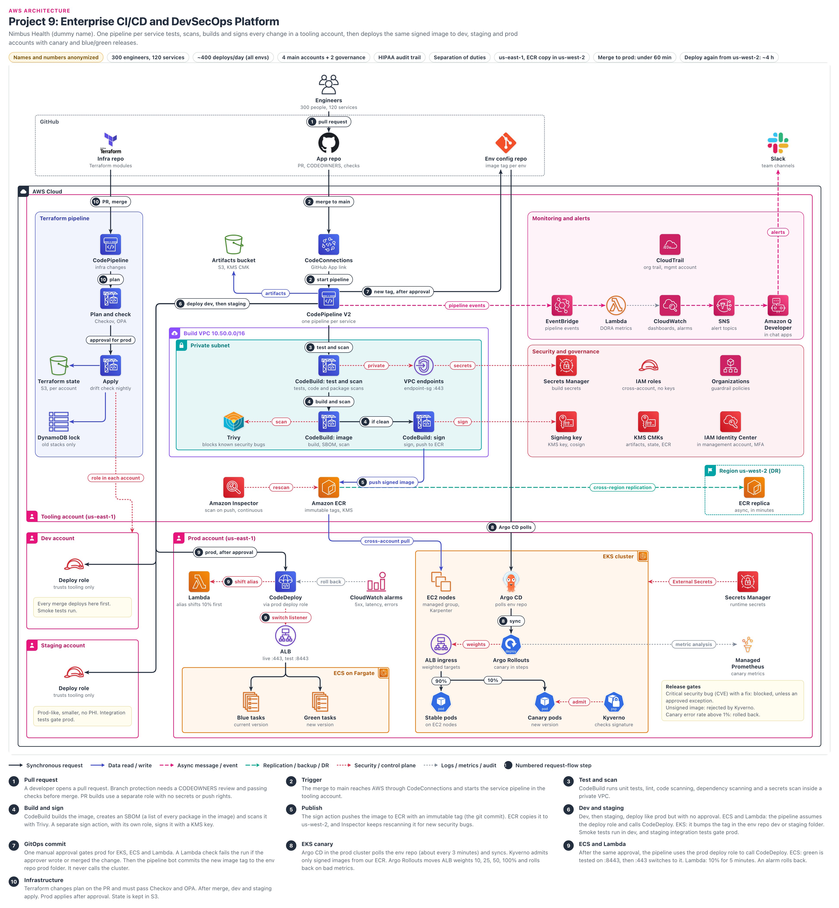

# Enterprise CI-CD and DevSecOps Platform

> **Confidentiality note:** Company names, domain names, IDs and all numbers in this document are dummy values. The architecture, the decisions and the trade-offs are what this document shares.
>
> Key figures (dummy values): 300 engineers, 120 services, about 400 deploys per day (all environments combined), 4 main accounts (tooling, dev, staging, prod) plus management and log archive accounts for governance (6 in total), us-east-1 (ECR copy in us-west-2), merge to prod in under 60 minutes.
>
> AWS limits and prices change over time, so treat these figures as approximate. This document is based on AWS features as of September 2026.

## Architecture diagram

### How to read the diagram
- **Top to bottom in the middle (main spine):** Engineers → GitHub App repo → CodeConnections → CodePipeline V2 → CodeBuild (test and scan) → CodeBuild (image: build, SBOM, Trivy scan). If the scan passes, a separate **CodeBuild (sign)** action on the right, with its own role, signs the image and pushes it to Amazon ECR. This is the path every code change takes. Here a "request" is not a user request, it is a code change.
- **Numbered badges (1 to 10):** these are the steps in section 4. Steps 1 to 5 are the build side (in step 4, scan and sign are separate actions), 6 is dev/staging, 7 and 8 are the EKS GitOps path (right side), 9 is the ECS/Lambda path (CodeDeploy), and 10 is the Terraform pipeline on the left.
- **Big box at the top = Tooling account:** pipelines, the build VPC and ECR all live here. Panels on the right: Monitoring and alerts (EventBridge → Lambda → CloudWatch → SNS → Slack), and Security and governance (Secrets Manager, IAM roles, Organizations, signing key, KMS, IAM Identity Center).
- **Accounts at the bottom:** Dev and Staging accounts on the left (one deploy role each). On the right, the big Prod account: ECS on Fargate blue/green, Lambda canary, and an EKS cluster with Argo CD, Argo Rollouts and Kyverno.
- **Line colors:** black line = main flow, blue = data (image push/pull), red dotted = security/control, green dashed = replication, pink dashed = events, grey dotted = logs/metrics/audit (for example: CloudWatch alarms → CodeDeploy "roll back", Argo Rollouts → Managed Prometheus "metric analysis").
- Organizations, Identity Center and the org trail actually live in the management account. They are drawn inside the tooling account only to save space.
- Not drawn in the diagram: NAT Gateway, the log archive account, the EKS path in dev/staging (env repo `dev/` and `staging/` folders, each with its own Argo CD), the state kept ready in us-west-2, and the signing key copies.

## 1. Project name
- **Nimbus Health Delivery Platform:** a CI/CD platform that builds and deploys 120 services in one consistent, secure way.
- In one line: we test, scan, build and sign every change in the tooling account. Then we deploy that same signed image to the dev, staging and prod accounts using canary or blue/green.
- **CI (Continuous Integration):** automatic test, scan and build on every merge.
- **CD (Continuous Delivery):** automatically moving the built image through the environments (with an approval for prod).
- **DevSecOps:** putting security checks (scans, signing, policies) into every step of the pipeline, not at the end.

## 2. Business problem

### Who is the company?
- Nimbus Health is a healthcare SaaS company.
- It sells software to hospitals and clinics for patient scheduling, billing, lab results and similar work. This means it handles patient data (PHI).
- 300 engineers, about 30 teams, 120 microservices. About 60 of these run on ECS on Fargate, 45 on EKS and 15 on Lambda.
- It must follow **HIPAA** (the US law that says patient data must be protected). Its Security Rule asks for access control, audit controls and integrity: there must be proof of who changed what.
- HIPAA does not directly say "the same person must not write code and ship it to prod alone" (separation of duties). Auditors (SOC 2, HITRUST) expect it, and we enforce it as company policy.

### What happened before (a short story)
1. One Friday evening, the orders team used a Jenkins job to send a new version to 100% of users at once. The billing page threw 500 errors, and for 40 minutes hospitals could not produce bills.
2. The next week an auditor asked: "Who approved this release?" There was no record. In the same month, prod AWS keys were found on the Jenkins server.
3. The CTO's decision: "Every deploy must be safe, fast and recorded. No keys anywhere." That became this project.

### What were the problems?
1. **A different pipeline for every team:** some used Jenkins, some ran scripts from laptops. 30 different processes, and nobody fully owned them.
2. **Long-lived keys:** the Jenkins server held prod AWS access keys. If that server was hacked, all of prod was exposed.
3. **Audit failure:** when the auditor asked "Who approved this version for prod?", there was no answer. Manual deploys had no record.
4. **Security bugs were reaching prod:** there was no image scanning. Old base images had critical CVEs (known security bugs).
5. **Fear of deploys:** every release was a big bang (100% of traffic at once). One bad release caused a 40-minute outage, and nobody really knew how to roll back.
6. **Slow:** about 2 weeks from code merge to prod (weekly release train, manual QA).

### What did the company need?
| Need | Target | In simple words |
|---|---|---|
| Deploy speed (lead time) | Under 60 minutes from merge to prod | If the approval comes quickly, a change should reach customers within an hour |
| Deploy volume (peak load) | About 400 deployments per day, about 60 per hour at peak | All environments combined, mostly during working hours |
| Platform availability | Pipeline 99.9% (during working hours) | If the pipeline is down, prod does not go down, but deploys stop |
| Release safety | Change failure rate under 5%. For canary services (EKS, Lambda), blast radius of 10% of traffic | In ECS blue/green it is 100% after the switch, so there we reduce impact time with test listener checks plus an alarm rollback within 2 to 3 minutes |
| Rollback time | Under about 5 minutes | Automatic rollback, no waiting for a human |
| RTO (if us-east-1 is lost, ability to deploy) | About 4 hours | Time needed to be able to deploy again from us-west-2 |
| RPO (images, code) | Code: 0, images: about minutes | Git is in GitHub, images are in the ECR replica |
| Security | No long-lived keys, only signed images in prod, critical CVEs blocked | Checked in two places: the pipeline and the cluster |
| Audit (HIPAA) | For every deploy: who wrote it, who reviewed it, who approved it | GitHub PR + CodePipeline approval + CloudTrail |

### Before vs now
| Before | Now |
|---|---|
| 30 kinds of pipelines | One golden pipeline |
| Prod keys in Jenkins | IAM roles, temporary credentials |
| No approval record | PR review + CodePipeline approval + CloudTrail |
| No scanning | Trivy + Inspector, only signed images |
| Big bang, 40-minute outage | Canary/blue-green, automatic rollback in about 5 minutes |
| 2 weeks from merge to prod | Under 60 minutes |

### Why this architecture?
- **One golden pipeline:** all 120 services use the same template pipeline. Change a security check in one place and everyone gets it.
- **Separate tooling account:** build and sign all happen in a separate account. The prod account has no build tools, so nobody can build in prod.
- **Build once, deploy many:** the same image (tagged with the git commit) moves dev → staging → prod. We never rebuild for each environment, so what we tested is exactly what goes to prod.
- **Progressive delivery:** with canary (10% → 100%) and blue/green, a bad release affects only a few users, and rollback is automatic.
- **Everything as code:** pipelines, infrastructure and environment config are all in Git. The Git history is the audit trail.

## 3. Architecture overview
- Each layer in one line. Each service is explained in detail in section 5, and ports/steps are in section 4.

| Layer | What is in it | Job in one line |
|---|---|---|
| Source (GitHub, outside AWS) | App repo, Env config repo, Infra repo | Code, which image version runs in which environment, and Terraform code. Humans cannot push directly to main, and a CODEOWNERS review is mandatory. In the env repo, only the pipeline bot changes the prod image tag (after the CodePipeline approval) |
| Trigger (tooling account) | CodeConnections (the service that connects GitHub to AWS), CodePipeline V2 (the service that runs steps in order), S3 artifacts bucket | On merge, that service's pipeline starts and the stages run in order |
| Network | Build VPC (our private network), private subnets in 2 AZs, VPC endpoints, NAT Gateway | Builds have no inbound path from the internet. Private path to AWS services, NAT only for GitHub/mirrors |
| Build | CodeBuild (a fresh container for every build), Trivy (image scanner), KMS signing key | Test, scan, image build, sign. PR builds and release builds use different roles |
| Storage | ECR (private image registry), Inspector (continuous CVE scan), us-west-2 replica | Signed images, rescanned later too, DR copy |
| Deploy | Deploy roles, CodeDeploy, Argo CD, Argo Rollouts, Kyverno | Dev → staging → approval → prod (canary/blue-green) |
| Infra | Terraform pipeline, S3 state, lock | Plan on the PR, policy check, approval, apply |
| Events, monitoring | EventBridge, Lambda, CloudWatch, SNS, Q Developer, CloudTrail | Slack alerts, DORA metrics, audit |
| Security | IAM roles, KMS, Secrets Manager, Organizations (SCPs), Identity Center | No long-lived keys, walls between accounts, guardrails |

### Disaster recovery at a glance
- If CodePipeline/CodeBuild goes down, only new deploys stop. Running tasks and pods keep running.
- But the images live only in the tooling ECR. In prod, scale out, task restarts and node replacements all need the tooling ECR, its repo policy and its KMS key. The Kyverno signature check also reads that same ECR.
- That is why we treat the tooling ECR as Tier 0: changes to the repo policy or the KMS key policy are blocked by an SCP deny and raise an alarm. Option: use ECR replication to keep a copy in the prod account, so prod nodes pull from there.
- ECR images are replicated to us-west-2. Pipelines are in Terraform code. Code is in GitHub (outside AWS), so code is never lost.

## 4. Request flow
- Here a "request" means one code change. The main path:
- `Engineer → GitHub PR → CodeConnections → CodePipeline V2 → CodeBuild (test, scan) → CodeBuild (build, SBOM, Trivy, sign) → ECR → Dev → Staging → Approval → EKS (Env repo → Argo CD → Argo Rollouts) / ECS, Lambda (CodeDeploy)`
- Infra path: `Engineer → Infra repo PR → CodePipeline → CodeBuild plan + Checkov/OPA → Approval → CodeBuild apply → Terraform state (S3)`
- Time budget: all steps together take about 53 minutes (stage-by-stage table in section 5A). For EKS, adding the Argo CD poll (about 3) gives about 56, still under 60.

### Step 1: Pull request (GitHub App repo)
- The developer opens a PR from a feature branch. Direct pushes to main are blocked (branch protection).
- Based on the CODEOWNERS file, one review from the team that owns that folder is mandatory. The author cannot approve their own PR (the first step of separation of duties).
- The same tests and scans also run on the PR as status checks. If the checks fail, the merge button does not work.
- **We do not trust PR code (Poisoned Pipeline Execution risk):** any engineer, or a hacked laptop, can open a PR and run their own code in the build.
- That is why PR builds use a different CodeBuild project with a different role: no secrets, no artifact write, no ECR push, no signing. Egress only to package mirrors. Builds are off for fork PRs (or run only after a maintainer approves).

### Step 2: Trigger (CodeConnections → CodePipeline V2)
- As soon as the merge to main happens, the GitHub App event reaches CodeConnections over HTTPS (443).
- CodeConnections starts that service's pipeline in the tooling account. The commit SHA is passed as a pipeline variable.
- V2 trigger filters: only the main branch, and if only docs change (for example `*.md`), the pipeline does not run.
- **Time:** a few seconds. **Security:** the GitHub App has access only to a limited set of repos, and there is no personal token.

### Step 3: Test and scan (CodeBuild in private VPC)
- CodeBuild starts a fresh container in a private subnet. Security group: no inbound at all, outbound 443 only.
- Unit tests, lint, SAST (bugs in the code such as SQL injection), SCA (CVEs in libraries), secrets scan (passwords/keys in the code).
- If there is a serious finding, the build fails and the pipeline stops right there. The team gets a Slack alert.
- ECR, S3 and Secrets Manager are reached through VPC endpoints (443). **Time:** about 7 minutes (with cache).

### Step 4: Build and sign (CodeBuild image, Trivy, CodeBuild sign, signing key)
- Docker build from an approved base image (a minimal image maintained by the platform team). We pull the base image from ECR, not from Docker Hub.
- We create an **SBOM** (a list of every package inside the image) and store it next to the image.
- **Trivy** (an open source image scanner) scans the image. If there is a critical CVE with a fix available and no approved exception, the release is blocked.
- **Scan and sign are separate actions with separate roles:** the scan role has neither ECR push nor `kms:Sign`. The sign step runs only cosign, pinned by checksum.
- Why: in March 2026 Trivy had a supply chain compromise (CVE-2026-33634, malicious v0.69.4, trivy-action tags). CI secrets were stolen. If the scanner had signing power, the "signed = scanned" guarantee would be gone.
- We pin the Trivy version by checksum/digest (a sha256 fingerprint computed from the file content) and fetch it from an internal mirror. We do not use mutable tags or `latest`. The vulnerability DB also comes from the mirror.
- If the scan passes, we sign. cosign (an open source tool that puts a digital signature on an image) signs with a KMS asymmetric key: permission `kms:Sign` (+ `kms:GetPublicKey`). The private key never leaves KMS.
- **Time:** about 6 minutes.

### Step 5: Publish (Amazon ECR, Inspector)
- The signed image is pushed to ECR. Tag = git commit SHA (for example `orders:3f9c2ab`). Tags are immutable, so nobody can overwrite that tag again.
- Only the tooling pipeline role has ECR push permission. Workload accounts can only pull (repository policy).
- Amazon Inspector scans the image when it is pushed, and rescans it later whenever new CVEs are published.
- ECR replication copies the image to us-west-2. **Time:** push takes about 1 minute.

### Step 6: Dev and staging (deploy roles)
- Dev and staging deploys happen exactly like prod, only without the approval.
- ECS and Lambda services: the pipeline takes that account's deploy role with STS AssumeRole (temporary keys that work for only about 1 hour by default). Then it calls CodeDeploy.
- EKS services: the pipeline changes the tag in the `dev/` or `staging/` folder of the env repo, and the Argo CD in that cluster syncs it.
- After the dev deploy, a **Lambda invoke action** runs smoke tests (health endpoint, one login, one API call).
- Staging is a small environment set up like prod (a copy of the infrastructure only). Data is synthetic or de-identified, with no PHI. If integration tests fail here, the change does not move to the prod stage.
- **Security:** the deploy role trust policy (the rule that says who can take this role) allows only the tooling pipeline role. **Time:** dev about 4, staging about 10 minutes.

### Step 7: GitOps commit (Env config repo)
- There is exactly one **manual approval** before prod. It applies to both EKS (steps 7-8) and ECS/Lambda (step 9). Someone from the release approvers group approves in CodePipeline. The request arrives in Slack through SNS → Slack.
- Right after the approval, a Lambda check runs: if the approver is the same person as the PR author/merger, the pipeline fails (section 5A).
- Then the pipeline's GitHub App (bot) changes only the image tag in `prod/orders/values.yaml` in the env config repo and commits it.
- Env repo main branch ruleset: humans can change it only through a PR with CODEOWNERS approval. Only the pipeline bot is on the bypass list. The second person's sign-off for prod happens in the CodePipeline approval, not in an env repo PR.
- If we want it even stricter (option): the bot opens a PR, and it auto-merges only after a required status check passes that checks "is there a CodePipeline approval record?".
- The pipeline never calls the EKS cluster directly. There are no cluster credentials in the tooling account.
- **Audit:** a Git commit = who, when, which version. The whole deploy history is in the Git history.

### Step 8: EKS canary (Argo CD, Kyverno, Argo Rollouts)
- Argo CD, running inside the prod cluster, polls the env repo (about once every 3 minutes). It sees the new tag and syncs.
- We do not use a GitHub webhook: GitHub.com can send webhooks only to a public URL, which would mean a public entry point into the prod cluster. It adds a few minutes to lead time, but the security of the pull model stays intact.
- (Option B: only the `/api/webhook` path on an ALB, an allow list of GitHub hook IP ranges in WAF, and webhook secret verification. The Argo CD UI/API stay private.)
- Before the new canary pods start, **Kyverno** (an admission controller) checks: is the signature valid, does the image come from our ECR, does it run as root. If any check fails, the pod is rejected.
- Nodes pull the image cross-account from the tooling account ECR (through prod VPC endpoints, 443).
- **Argo Rollouts** changes the ALB ingress target group weights in steps: 10% → 25% → 50% → 100%. Before each step it checks success rate and latency from Managed Prometheus.
- If the canary error rate is above 1%, it rolls back automatically: weights go back to 100% stable. **Time:** about 20 minutes.
- **Note:** on the EKS path, the pipeline's prod stage ends with the Git commit, so the pipeline does not know the canary result. How the result comes back is explained in section 5A (CI/CD flow).

### Step 9: ECS and Lambda (CodeDeploy)
- After the manual approval, the pipeline calls CodeDeploy in the prod account through the prod deploy role.
- **ECS blue/green:** green tasks are first checked through the test listener :8443. If they pass, the live listener :443 switches to green. Blue stays for 1 hour (steps in section 5A).
- **Lambda canary:** the alias sends 10% to the new version for 5 minutes. On both paths, if CloudWatch alarms (5xx, latency, errors) fire, CodeDeploy shifts traffic back.

### Step 10: Infrastructure (Terraform pipeline)
- When a PR is opened in the infra repo, the infra CodePipeline runs `terraform plan`. The plan output is posted as a comment on the PR.
- Checkov (ready-made security rules) and OPA (our company's own rules) check the plan: things like a public S3 bucket, an unencrypted volume or SSH open to `0.0.0.0/0` fail.
- After merge, apply runs automatically for dev/staging. For prod, apply runs after a manual approval, by assuming a role in the target account.
- State is in S3 (per account, per component), and the lock is in DynamoDB or an S3 lock file. Every night a plan runs and produces a drift report.

### Other flows
- **Events flow:** all pipeline, build and deploy events go to EventBridge. A Lambda calculates DORA metrics from them and writes them to CloudWatch. When an alarm fires: SNS → Amazon Q Developer → the team's Slack channel.
- **Continuous rescan:** when a new CVE is published, Inspector rescans the ECR images and creates a finding. Through EventBridge, the owner team gets a ticket and a Slack alert.
- **Replication:** ECR → us-west-2 replica (async, usually within minutes).
- **Secrets at runtime:** External Secrets Operator in EKS, and the task definition `secrets` field in ECS (section 5A).
- **Audit flow:** API calls from all accounts → organization CloudTrail → log archive account S3.

## 5. Why each AWS service

### AWS CodeConnections
**What it is:** a connection that links external Git providers such as GitHub, GitLab and Bitbucket to AWS services (based on a GitHub App).

**Why we used it:** to start CodePipeline on a merge-to-main event and to bring the code into the pipeline.

**Problem it solves:** in the old Jenkins setup, one engineer's personal GitHub token was used. If that person left, pipelines broke. Now there is an org-level GitHub App, and we store no token.

**Alternatives:** GitHub webhooks + API Gateway + Lambda, or starting the pipeline from GitHub Actions with OIDC.

**Why not the alternative:** we would have to maintain custom webhook code and verify signatures. CodeConnections is managed, and CodePipeline V2 triggers (branch and file path filters) work on it directly.

### AWS CodePipeline (V2)
**What it is:** the AWS service that runs pipeline steps one after another (source → test → build → deploy). V2 adds branch/file filters, variables, and execution modes (QUEUED, SUPERSEDED, PARALLEL) that decide what to do when many runs arrive at once.

**Why we used it:** one pipeline per service, all generated from the same Terraform module. Cross-account deploy actions, manual approval and the Lambda invoke action are all built in.

**Problem it solves:** one golden pipeline instead of 30 kinds of pipelines. Who gave each approval is recorded in CloudTrail, which is proof for the HIPAA audit.

**Alternatives:** GitHub Actions, Jenkins, GitLab CI.

**Why not the alternative:**
- Jenkins: patching, scaling and securing the servers is a full-time job for one person.
- GitHub Actions: the right to deploy to prod would have to sit with GitHub. For compliance we need approval and audit inside AWS (Q2).

### AWS CodeBuild
**What it is:** a managed build service. A fresh, isolated container for every build, billed by the minute.

**Why we used it:** tests, scans, Docker build, SBOM, signing and Terraform plan/apply are all CodeBuild projects. It runs inside the VPC and reaches private endpoints.

**Problem it solves:** no leftover files or secrets from old builds on build servers (ephemeral). At peak (60 deploys per hour) we do not need to buy extra servers.

**Alternatives:** self-hosted runners on EC2/EKS (for example Actions Runner Controller), Jenkins agents.

**Why not the alternative:** self-hosted runners must be patched, autoscaled and cleaned up. CodeBuild has none of that work. Trade-off: there is a concurrency quota that must be raised, and Docker builds need privileged mode (more rights for the container on the host).

### Amazon VPC and VPC endpoints
**What it is:** a VPC is our private network in AWS. VPC endpoints are a way to reach AWS services through private IPs without the internet (a gateway endpoint for S3, interface endpoints for the others).

**Why we used it:** we run CodeBuild in a private subnet of the Build VPC (10.50.0.0/16). Endpoints for ECR, S3, STS, Secrets Manager, KMS and CloudWatch Logs. endpoint-sg allows :443 only from codebuild-sg.

**Problem it solves:** build traffic and secrets calls do not go over the internet. With endpoint policies we can restrict access to "only our accounts' resources" (this makes it hard for anyone to copy data to an outside account).

**Alternatives:** CodeBuild default mode without a VPC (AWS managed network), or sending everything through a NAT Gateway.

**Why not the alternative:** in default mode we have no network control or egress filtering. Sending everything through NAT adds a data processing charge per GB, and ECR image pulls are many GBs. Trade-off: interface endpoints have an hourly charge.

### Amazon S3
**What it is:** AWS object storage. Storage with very high durability, versioning and encryption.

**Why we used it:** (1) the pipeline artifacts bucket, with a KMS CMK. (2) the Terraform state bucket, per account, with versioning on.

**Problem it solves:** a safe place for files passed between stages (build output, SBOM, imagedefinitions.json). With state versioning, a corrupted state can be restored to an older version.

**Alternatives:** Terraform Cloud/HCP for state, Artifactory/Nexus for artifacts.

**Why not the alternative:** another vendor inside the HIPAA scope means another audit. State can contain secrets, so we wanted it under our own KMS key, inside our own account.

### Amazon ECR
**What it is:** the AWS managed private container image registry.

**Why we used it:** all images are in the tooling account ECR. Immutable tags, KMS encryption, lifecycle rules, cross-account pull, us-west-2 replication and Inspector enhanced scanning.

**Problem it solves:** by looking at the tag, we can say which commit the image running in prod came from. Tags cannot be overwritten, so there is no "same tag, different code" problem.

**Alternatives:** Docker Hub, GitHub Container Registry, JFrog Artifactory, Harbor.

**Why not the alternative:** IAM-based access, VPC endpoints, Inspector integration and replication are all native in ECR. Docker Hub also has pull rate limits. With Harbor, we would have to run it ourselves.

### Amazon Inspector
**What it is:** the AWS vulnerability scanning service. It finds known CVEs in ECR images, EC2 and Lambda.

**Why we used it:** as ECR enhanced scanning: it scans on push, and later continuously rescans existing images when a new CVE is published.

**Problem it solves:** an image that was clean on build day can become vulnerable 3 weeks later because of a new CVE. Trivy looks only at build time, Inspector keeps looking afterwards.

**Alternatives:** ECR basic scanning (push time only), Snyk, Prisma Cloud, Wiz.

**Why not the alternative:** basic scanning is not continuous. Third-party tools are good, but they mean another vendor and another cost. Inspector findings go natively to Security Hub and EventBridge.

### AWS KMS and AWS Signer (signing key, KMS CMKs)
**What it is:** KMS is a managed service that keeps encryption keys in hardware security modules. AWS Signer is a code/image signing service run by AWS (used with the open source tool Notation, permission `signer:SignPayload`).

**Why we used it:** customer managed keys for the artifacts bucket, Terraform state and ECR. For image signing, a separate asymmetric KMS key (cosign), or a Signer signing profile.

**Problem it solves:** the artifact key policy gives decrypt to the dev, staging and prod deploy roles, so cross-account deploys work. An AWS managed key (`aws/s3`) cannot be shared with another account, which is why a CMK is mandatory.

**Alternatives:** keeping the signing key as a file in CodeBuild, or Sigstore keyless signing.

**Why not the alternative:** if a file key leaks, anyone can sign. In KMS the key never leaves, and every Sign call is recorded in CloudTrail. Keyless depends on a public transparency log, and the compliance team said no.

### AWS Secrets Manager
**What it is:** a vault that keeps passwords, API keys and tokens encrypted with KMS. It supports rotation.

**Why we used it:** build secrets in tooling (scanner license, private package registry token). Runtime secrets in prod (database passwords, third-party API keys).

**Problem it solves:** secrets are not in code, in the buildspec or in logs. CodeBuild reads them at run time. CloudTrail shows who read which secret.

**Alternatives:** SSM Parameter Store SecureString, HashiCorp Vault.

**Why not the alternative:** Parameter Store is cheaper and we use it for simple configs, but it has no built-in rotation. Vault we would have to run ourselves in HA, and for a 300-engineer platform that is one more system.

### AWS IAM (cross-account roles, OIDC)
**What it is:** the AWS service that decides who can do which action. Roles are identities that hand out temporary credentials.

**Why we used it:** the pipeline role (tooling) assumes a deploy role in each account. The deploy role trust policy trusts only the tooling pipeline role ARN (the unique address every AWS resource has). OIDC for GitHub Actions (section 7).

**Problem it solves:** we removed the prod access keys that were on Jenkins. Credentials are valid for only minutes/hours, so even if they leak they expire quickly.

**Alternatives:** IAM users + access keys stored as secrets in the CI tool.

**Why not the alternative:** nobody rotates long-lived keys properly, and if they leak they keep working for months. This is the first thing that fails in an audit.

### IAM Identity Center
**What it is:** a central SSO service for humans. Login through the corporate IdP (for example Okta, Entra ID), with permission sets for all accounts.

**Why we used it:** engineers log in with SSO + MFA. Prod is read-only by default. Emergency admin (break-glass) access is a separate permission set, and using it triggers an alert and a review. Multi-Region replication (GA since Feb 2026) is on to us-west-2, so SSO login works even if us-east-1 is lost.

**Problem it solves:** there are no IAM users in each account. When an employee leaves, disabling them in the IdP is enough, and access to all accounts is gone.

**Alternatives:** direct SAML federation in each account, or IAM users.

**Why not the alternative:** with more than 4 accounts (including management and log archive), managing federation separately in each one is hard. Identity Center keeps the assignments in one place.

### AWS Organizations
**What it is:** the service that manages all AWS accounts as one organization. With SCPs (Service Control Policies) it puts a ceiling on the maximum permissions in the accounts.

**Why we used it:** it runs in the management account. SCPs: deny stopping/deleting CloudTrail in prod, deny changes to deploy roles (except by the platform role), and deny anything outside the approved regions (us-east-1, us-west-2). In the region deny SCP we exempt global services with `NotAction` (IAM, Organizations, STS global, Route 53, CloudFront, Support), otherwise they would break.

**Problem it solves:** even someone with admin in the prod account cannot cross these guardrails. Note: SCPs do not apply to the management account, which is why it runs no workloads and very few people have access to it. In the HIPAA audit it is the proof that "nobody can turn off the audit log".

**Alternatives:** only IAM policies and permission boundaries inside a single account.

**Why not the alternative:** in a single account the blast radius is large, and one wrong IAM policy can expose prod. The account boundary is the strongest isolation in AWS.

### AWS CodeDeploy
**What it is:** a managed service that deploys to EC2, ECS and Lambda. It supports blue/green, canary, linear traffic shifting and alarm-based automatic rollback.

**Why we used it:** in prod, ECS blue/green (with a test listener) and Lambda canary (10% for 5 minutes). The pipeline calls it through the prod deploy role.

**Problem it solves:** big bang releases are gone. If a CloudWatch alarm fires, traffic goes back without a human. In lifecycle hooks (for example AfterAllowTestTraffic) we can test green with a Lambda.

**Alternatives:** ECS native blue/green, linear and canary (since 2025), ECS rolling update, SAM or our own alias scripts for Lambda.

**Why not the alternative:** CodeDeploy gives one model, one set of alarms and one runbook for both ECS and Lambda. ECS native is a good option and we are piloting it (Q20). A rolling update has no instant rollback.

### Amazon ECS on Fargate
**What it is:** ECS is AWS's own container orchestrator. Fargate is compute that runs containers without us managing EC2 servers.

**Why we used it:** simple stateless APIs and workers (about 60 services) run on ECS on Fargate. Both blue tasks and green tasks live here.

**Problem it solves:** no node patching and no AMI updates. Each task gets its own micro-VM isolation, which is good for HIPAA.

**Alternatives:** all services on EKS, or ECS on EC2.

**Why not the alternative:** for simple services that do not need Kubernetes, EKS adds too much operational burden. ECS on EC2 could be cheaper, but we would have to manage nodes. Trade-off: Fargate is slightly more expensive per vCPU.

### Application Load Balancer (ALB)
**What it is:** a load balancer that looks at the URL and headers of HTTP/HTTPS requests and spreads them across containers (this is called Layer 7). Listener = the port it listens on for requests (here :443). Target group = which tasks/pods the requests go to. Weights = what % of traffic each group gets.

**Why we used it:** for ECS, an internal ALB (ECS services are mostly internal APIs): a live listener, plus a test listener for blue/green. For EKS, an ALB ingress (created by the AWS Load Balancer Controller), whose weights Argo Rollouts changes.

**Problem it solves:** traffic switches in seconds without changing DNS. A DNS-based switch takes minutes or hours because of client caching.

**Alternatives:** NLB, service mesh (Istio) traffic splitting, Route 53 weighted records.

**Why not the alternative:** NLB is layer 4, with no HTTP path rules and no HTTP-level metrics (5xx), and canary analysis needs those. Istio is another big system to operate. Route 53 weights have the DNS caching problem, so rollback is slow.

### Amazon EKS and EC2 nodes
**What it is:** EKS is the AWS managed Kubernetes control plane. EC2 nodes are the worker servers where pods run (managed node group + Karpenter autoscaler).

**Why we used it:** about 45 complex services (those with sidecars, custom operators, Helm charts) run on EKS. Argo CD, Argo Rollouts, Kyverno and External Secrets Operator also run here.

**Problem it solves:** we can use Kubernetes ecosystem tools such as GitOps, admission control (Kyverno) and progressive delivery (Argo Rollouts). Karpenter adds only as much EC2 as the pods need.

**Alternatives:** moving everything to ECS, or self-managed Kubernetes on EC2.

**Why not the alternative:** these teams already have Kubernetes and Helm expertise, and the rewrite cost is high. A self-managed control plane (etcd backups, upgrades) is work we do not need.

### AWS Lambda
**What it is:** a service that runs code as functions without servers. Billed per request/event.

**Why we used it:** in three places: (1) event-driven services in prod (about 15), as the CodeDeploy canary target, (2) smoke tests through the Lambda invoke action in the pipeline, (3) calculating DORA metrics from EventBridge events.

**Problem it solves:** small glue code such as smoke tests and metrics does not need a server. For prod functions, canary is easy with alias weights.

**Alternatives:** a CodeBuild project for smoke tests, third-party tools for DORA (for example LinearB, Sleuth).

**Why not the alternative:** CodeBuild takes longer to start, which is too much for one HTTP check. DORA tools are good, but we would have to send pipeline data to an outside vendor.

### Amazon Managed Service for Prometheus
**What it is:** an AWS managed, Prometheus-compatible metrics store. It can be queried with PromQL (the Prometheus query language).

**Why we used it:** request success rate and p95 latency for canary pods and stable pods live here. The Argo Rollouts AnalysisTemplate (the Argo file where canary pass/fail rules are written) queries it before each step using SigV4 (a request signed with AWS IAM).

**Problem it solves:** comparing canary vs stable by pod label. In CloudWatch, pod-level high-cardinality metrics (a different label for every pod, which means thousands of metric series) are expensive and hard.

**Alternatives:** self-hosted Prometheus in the cluster, CloudWatch metrics, Datadog.

**Why not the alternative:** if a self-hosted Prometheus pod restarts, the canary analysis loses data, and we have to handle storage/HA ourselves. Datadog is good, but the cost is higher.

### Amazon DynamoDB (Terraform lock)
**What it is:** a NoSQL database run by AWS. You store data by key and read it back by key right away (in milliseconds). There are no servers for us to look after.

**Why we used it:** only for Terraform state locking. While an apply is running it puts a lock item, and a second run waits or fails.

**Problem it solves:** if two engineers or two pipeline runs change the same state at the same time, the state gets corrupted. The lock prevents that.

**Alternatives:** S3 native state locking (since Terraform 1.11, `use_lockfile = true`, a `.tflock` file in S3).

**Why not the alternative:** in fact, we are moving new stacks to the S3 lock file, because Terraform has deprecated DynamoDB locking. Old stacks are still on DynamoDB. During migration we keep both on for a while, then remove DynamoDB.

### Amazon EventBridge
**What it is:** a serverless event bus. It takes events from AWS services and sends them to targets based on rules.

**Why we used it:** CodePipeline, CodeBuild and CodeDeploy state changes and Inspector findings all come here. From the dev, staging and prod accounts they reach the tooling account through a cross-account event bus.

**Problem it solves:** we do not need to write notification logic in pipeline code. For a new consumer (for example a ticket system), we only add a new rule.

**Alternatives:** CodePipeline notification rules straight to SNS, or parsing CloudWatch Logs.

**Why not the alternative:** notification rules are enough for Slack, but for DORA metrics the Lambda needs the full event data. Parsing logs is fragile.

### Amazon CloudWatch
**What it is:** the AWS service for metrics, logs, alarms and dashboards.

**Why we used it:** build logs (CodeBuild), pipeline, DORA custom metrics, dashboards and alarms (for example, the pipeline failing 2 times in a row). In prod, release alarms (5xx, latency, Lambda errors) drive CodeDeploy rollback.

**Problem it solves:** an automatic decision on whether a release is safe or not. Platform health in one dashboard.

**Alternatives:** Datadog, Grafana + Loki, Splunk.

**Why not the alternative:** CodeDeploy alarms need CloudWatch alarms directly. Keeping logs inside AWS keeps the HIPAA scope simple. If we want Grafana dashboards, we can use CloudWatch as a data source.

### Amazon SNS
**What it is:** a pub/sub messaging service. A message sent to a topic goes to all subscribers.

**Why we used it:** alert topics (one per team) and an approval request topic. CloudWatch alarms and CodePipeline approval actions publish here.

**Problem it solves:** the same alarm can go to Slack, email and PagerDuty at once. The producer does not need to know about the consumers.

**Alternatives:** EventBridge API destinations straight to a Slack webhook.

**Why not the alternative:** CloudWatch alarm actions and CodePipeline approval notifications are native to SNS. We do not need to maintain a Slack webhook URL as a secret.

### Amazon Q Developer in chat applications
**What it is:** an AWS service that posts SNS messages into Slack and Microsoft Teams channels (old name: AWS Chatbot).

**Why we used it:** to show pipeline failures, approvals and alarms in that team's Slack channel.

**Problem it solves:** engineers miss email alerts. In Slack everyone sees them and reacts quickly.

**Alternatives:** calling the Slack API with a custom Lambda.

**Why not the alternative:** we would have to maintain custom Lambda code and a Slack token. This service is managed, and with channel guardrail IAM policies we control who can run which command from chat (we set it to read-only).

### AWS CloudTrail
**What it is:** an audit service that records every API call in AWS accounts (who, when, from which IP, what they did).

**Why we used it:** an organization trail in the management account that covers all accounts. Logs go to an S3 bucket in the log archive account (Object Lock: an S3 setting that means nobody can delete objects until the retention period ends, plus KMS). AssumeRole, ECR PutImage, KMS Sign and approvals are all recorded.

**Problem it solves:** when the HIPAA auditor asks "who made this prod change?", we show it with CloudTrail + Git history. Even a tooling or prod admin cannot delete the logs (different account, SCP).

**Alternatives:** a separate trail in each account, or only a third-party SIEM.

**Why not the alternative:** per-account trails can be turned off by that account's admin, and can be forgotten in a new account. The org trail applies automatically to every new account. Even a SIEM uses CloudTrail as its source.

### Argo CD and Argo Rollouts (open source, running in EKS)
**What it is:** Argo CD is a GitOps tool that syncs the desired state stored in Git to the cluster. Argo Rollouts is a Kubernetes controller that runs canary and blue/green steps and metric analysis.

**Why we used it:** they run inside the prod cluster and pull from the env repo. Rollouts changes the ALB weights through 10, 25, 50 and 100% while checking Managed Prometheus metrics.

**Problem it solves:** pull model: prod cluster credentials are not in any outside system. If someone changes something with `kubectl edit`, Argo CD self-heal brings it back to the Git state.

**Alternatives:** `helm upgrade` from CodeBuild (push model), Flux, the CodePipeline EKS deploy action.

**Why not the alternative:** in the push model, the tooling account needs admin access to the prod cluster, so if tooling is hacked, prod is too. Flux is also good, but the teams already know the Argo CD UI and the Rollouts integration well.

### Kyverno (open source admission controller)
**What it is:** a Kubernetes policy engine. Before a pod is created, it checks rules and allows or rejects it.

**Why we used it:** image verify policy: the image must verify against our signing key's public key and must come from our ECR registry. It also blocks pods that run as root.
- Since Kyverno 1.17 (Feb 2026), ClusterPolicy (and its `verifyImages`) is deprecated (planned for removal in v1.20). For new policies we use the CEL-based `ImageValidatingPolicy` (v1) (CEL is a small expression language used in Kubernetes), and we are gradually migrating the old ClusterPolicies.

**Problem it solves:** even if someone bypasses the pipeline and tries to run a random image with `kubectl run`, the cluster rejects it. Last line of defense.

**Alternatives:** OPA Gatekeeper + Ratify, the Kubernetes built-in ValidatingAdmissionPolicy.

**Why not the alternative:** Gatekeeper needs learning Rego, and Ratify is an extra piece for signature verification. The built-in policy has no signature verification. Kyverno is simple YAML, with image verification built in.

### Trivy (open source scanner)
**What it is:** a vulnerability and misconfiguration scanner for container images, file systems and IaC.

**Why we used it:** in the CodeBuild scan action, before push. If there is a critical CVE with a fix, the build fails (unless there is an exception).
- The scan role has no push/sign rights, and the version is pinned (see Step 4).

**Problem it solves:** stops a bad image before it reaches ECR (shift left). The developer gets feedback within minutes.

**Alternatives:** only Inspector (after push), Grype, Snyk Container.

**Why not the alternative:** Inspector scans after push, so the gate would have to wait for its result. Trivy is fast and free inside the build. We keep Inspector alongside for continuous rescan, and together they give defense in depth.

### Key decisions
| Decision | Chosen | Rejected | Why |
|---|---|---|---|
| CI/CD engine | CodePipeline V2 + CodeBuild | Jenkins, GitHub Actions only | No servers to manage, approvals and cross-account roles inside AWS, CloudTrail audit. Trade-off: developers like the GitHub Actions UX a lot |
| EKS deploy model | GitOps pull (Argo CD) | Pipeline push (`helm upgrade` from CodeBuild) | No prod cluster credentials outside, Git history = deploy history, drift self-heal |
| ECS/Lambda deploy | CodeDeploy blue/green, canary | ECS rolling update, ECS native blue/green/linear/canary | One rollback model for both, alarm rollback. We are piloting ECS native (in-place migration is documented) |
| Accounts | Separate tooling, dev, staging, prod accounts | One account, separated by IAM | Account = strongest blast radius boundary, HIPAA separation of duties, SCPs |
| Image signing | cosign + KMS asymmetric key | AWS Signer + Notation, ECR managed signing (Nov 2025), keyless | Simple to verify in Kyverno with a public key. ECR managed signing auto-signs with Signer at push time, but it is based on the pusher identity, so we would still have to build the "push only after the scan passes" gate ourselves |
| Scanning | Trivy (build gate) + Inspector (continuous) | A single scanner | Fast gate in the build, rescan for new CVEs after deploy |
| IaC tool | Terraform | CloudFormation/CDK | Teams already know Terraform, and it also manages non-AWS providers such as GitHub and Datadog. Trade-off: we have to manage the state file ourselves |
| State locking | S3 lock file (new), DynamoDB (old) | DynamoDB only | S3 native lock (5A IaC), one less resource, DynamoDB lock is deprecated |

## 5A. Key topics

### CI/CD flow end to end (from start to finish)
| Stage | What happens | Gate (it stops if this fails) | Time |
|---|---|---|---|
| PR | Review, PR checks | CODEOWNERS approval, tests, scans | Not counted in lead time |
| Source | Merge → CodeConnections → pipeline | Main branch only | Seconds |
| Test and scan | Unit, lint, SAST, SCA, secrets | Failed test, high/critical finding | About 7 minutes |
| Build and sign | Image, SBOM, Trivy, sign | Critical CVE with fix | About 6 minutes |
| Publish | ECR push, replication | Immutable tag conflict | About 1 minute |
| Dev | Deploy + Lambda smoke test | Smoke test fail | About 4 minutes |
| Staging | Deploy + integration tests | Integration test fail | About 10 minutes |
| Approval | Release approver (not the author) | Reject, or timeout if nobody approves (about 7 days) | About 5 minutes (target) |
| Prod | Canary (EKS, Lambda) / blue-green (ECS) | Alarms, metric analysis | About 20 minutes |

- **Build once:** the image is built only once. Dev, staging and prod all use the same digest (a sha256 fingerprint computed from the image content). Differences between environments live only in config/secrets.
- **Execution mode:** this is one setting for the whole pipeline, it cannot be set per stage. Every service release pipeline uses QUEUED mode: every merge goes in order from dev to prod, and no commit is skipped (simple for audit).
- In SUPERSEDED and QUEUED, only one run can be in a stage at a time (stage lock), so there is only one release in prod at a time. PARALLEL has no stage lock, runs go at the same time, and there is no stage rollback either, which is why we do not use it for release pipelines.
- In SUPERSEDED (the default), a new run can overtake an older run that is waiting, and commits in between can be skipped. That is why it is used only for PR/feature pipelines (separate pipelines).
- **QUEUED trade-off:** if an approval is pending, that stage is locked and later runs wait in the queue (up to the 7-day timeout). Every run needs its own approval. That is why we have an approval SLA and a runbook to stop stale runs.
- **Stage conditions and rollback:** in CodePipeline V2, if a stage fails there is an option to roll that stage back to the last successful execution. It is on for the prod stage. But on the EKS path the prod stage ends with a Git commit, so this does not see an EKS canary failure.
- **How the EKS canary result gets back to the pipeline:**
  - Argo Rollouts does not send events directly to EventBridge. The Argo notifications webhook cannot SigV4-sign requests, so it cannot call an IAM-auth function URL directly.
  - Our path: notifications webhook → a small forwarder pod inside the prod cluster (Pod Identity, only `events:PutEvents`, no public URL) → tooling event bus. (Option: an IAM-auth Lambda function URL through an aws-sigv4-proxy sidecar.)
  - For EKS services, the DORA Lambda counts the "rollout completed" or "rollout aborted" event as prod success/failure, not the pipeline success.
  - Option: a Lambda action at the end of the pipeline waits for that event (with a continuation token). Then the pipeline status also shows the real canary result.
- **Fast feedback:** the checks that fail most often (lint, unit tests) run first. The expensive checks (integration) run last.

### Infrastructure as Code (Terraform structure, state, modules, multi-account)
- **What IaC means:** writing servers, networks and roles as code instead of clicking in the console. Easy to review, keep history and repeat.
- **Repo structure:**
  - `modules/` : versioned shared modules (vpc, ecs-service, eks-addons, pipeline). Versioned with a Git tag (`v3.2.0`).
  - `live/<account>/<region>/<component>/` : for example `live/prod/us-east-1/network`, `live/prod/us-east-1/orders-db`.
- **State:** a separate state file for each account and each component. Stored in an S3 bucket in the account (or a central bucket in tooling with a per-account prefix), with versioning, a KMS CMK and public access block.
- **Why small states:** with one big state, a plan takes 15 minutes and one mistake affects everything. Small states mean a small blast radius and fast plans.
- **Locking:** since Terraform 1.11, `use_lockfile = true` (a lock file in S3). Old stacks use a DynamoDB table.
- **Multi-account:** the CodeBuild apply job assumes the `terraform-apply` role in the target account. PR plans use a separate read-only `terraform-plan` role. Only the main branch pipeline can assume the apply role.
- **A PR plan also runs developer code:** providers and the `external` data source run commands during plan itself. The plan role can read state, so if the state contains secrets, they could leak through a PR. We openly admit this.
  - Controls: a Checkov/OPA rule blocks the `external` and `http` data sources. Provider checksums are pinned with `.terraform.lock.hcl`. The plan CodeBuild has egress only to mirrors. No plan for fork PRs.
  - The real fix is keeping secrets out of state: `manage_master_user_password`, Terraform 1.10+ ephemeral values, 1.11+ write-only arguments (for example `password_wo`, check the provider version).
  - The plan role needs write access to the S3 lock file (`.tflock`), or the nightly drift plan uses `-lock=false`.
- **Policy as code:** the plan is converted to JSON and checked by Checkov (ready-made rules) and OPA/conftest (our company rules, for example a `data-class` tag on every resource).
- **Drift detection:** every night `terraform plan -detailed-exitcode`. Exit code 2 means something is different: it could be drift, or code that was merged but not applied.
  - For pure drift, `terraform plan -refresh-only -detailed-exitcode`. With a read-only role, use `-lock=false`. Slack alert, and the owner team fixes it.
- **Dangerous changes:** if the plan has a destroy/replace, it is highlighted clearly on the PR. Databases have `prevent_destroy` and deletion protection.

### Blue/green deployment (ECS, CodeDeploy)
- **Idea:** while the old version (blue) keeps running, we start the new version (green) fully alongside it. We test it and then switch the traffic in one go.
- **Steps in ECS:**
  1. CodeDeploy starts the new task set (green) in the second target group.
  2. The test listener :8443 points only to green. In the `AfterAllowTestTraffic` hook, a Lambda runs API tests.
  3. If they pass, the live listener :443 switches from the blue target group to green (in seconds).
  4. During bake time we watch CloudWatch alarms (5xx, latency). If an alarm fires, the listener goes back to blue.
  5. After the wait time (for example 1 hour), the blue tasks are terminated.
- **Benefit:** rollback is instant, because blue is still running.
- **Trade-offs:** during the switch there are two sets, so compute is doubled for that hour. 100% of users move to the new version at once, so the test listener checks must be strong.
- **Database care:** blue and green use the same database. So schema changes must be backward compatible (5A Rollback).
- **Test listener security:** our ECS ALBs are internal, so referencing `test-runner-sg` (the hook Lambda's SG) on :8443 is enough.
  - If the ALB were internet-facing, an SG reference would not work: even from inside the VPC, DNS returns public IPs, traffic goes through NAT, and the source IP becomes the NAT Elastic IP. In that case, allow only the NAT EIPs (/32) on :8443, otherwise the hook tests time out and every deploy rolls back.
  - Another layer: a secret header check in the :8443 listener rule, otherwise a fixed 403.

### Canary deployment (EKS Argo Rollouts, Lambda CodeDeploy)
- **Idea:** send only a little traffic (10%) to the new version first, and increase it gradually if the metrics look good.
- **EKS steps:** setWeight 10 → pause 5 min + analysis → 25 → analysis → 50 → analysis → 100.
- **Analysis (AnalysisRun = the check that runs at each step with the AnalysisTemplate rules, using Managed Prometheus):**
  - If the canary error rate is 1 percentage point higher than stable, abort and roll back (comparison with stable, see Q9). There is also an absolute floor for safety: error rate above 1%.
  - p95 latency 20% higher than stable → abort.
  - If a check does not have a minimum number of requests (for example 500), the result is "inconclusive" and a human decides.
- **Lambda:** CodeDeploy `LambdaCanary10Percent5Minutes`: the alias sends 10% to the new version for 5 minutes, then 100%. If the errors alarm fires, the alias goes back to the old version.
- **Blue/green vs canary:** canary has a small blast radius (10%), but the release takes longer. Blue/green is fast, but 100% at once. For low-traffic services, canary metrics are not enough, so blue/green + strong tests is better there.

### Rollback (application, infrastructure, database migrations)
- **Application rollback (automatic):**
  - EKS: Argo Rollouts abort → 100% of traffic to the stable pods (seconds). After the abort the Rollout is Degraded, and the spec still has the bad tag. For Argo CD it matches Git, so it does nothing on its own.
  - But if someone retries, or another change lands in that file, the bad version starts rolling out again. That is why we bring Git back to the stable tag with `git revert` in the env repo.
  - ECS: CodeDeploy moves the listener back to blue (seconds). Lambda: the alias goes back to the old version.
  - For any older version: re-run the pipeline with the old commit, or put the old tag in the env repo. The image is in ECR (images that went to prod get a `prod-<sha>` tag with its own lifecycle rule, section 12), so no rebuild is needed.
- **Infrastructure rollback:**
  - Terraform has no "undo" button. We revert in Git and run plan/apply again, which means roll forward.
  - Some changes cannot come back: a deleted database, a replaced resource. That is why destroy/replace in a plan needs an extra approval, plus `prevent_destroy` and snapshots.
  - If state gets corrupted, we restore an older state version from S3 versioning.
- **Database migrations (expand/contract):** if a change like a column rename is done in one go, the old code that we roll back to crashes on the new schema. That is why we do it in steps:

| Step | What we do | Rollback safe? |
|---|---|---|
| 1. Expand | Add the new column (nullable), keep the old column | Yes, no difference for old code |
| 2. Dual write | New code writes to both columns, reads the old one | Yes |
| 3. Backfill | Copy old data to the new column (batch job) | Yes |
| 4. Switch reads | New code reads the new column | Yes, the old column still exists |
| 5. Contract | Drop the old column after a few days | No, but by now old code is not running anywhere |

- The migration runs as a separate pipeline step (for example a Kubernetes Job or an ECS task), before the app deploy. A lint rule in CI blocks destructive SQL (DROP, RENAME), which is allowed only for the contract step, with approval.

### Container security (base images, non-root, scanning, signing, admission, runtime)
| Layer | What we do | Where it is enforced |
|---|---|---|
| Base images | Minimal/distroless images maintained by the platform team, rebuilt once a week | Dockerfile lint: only approved `FROM` |
| Build | Multi-stage build, no compilers in the final image, SBOM | CodeBuild image stage |
| Non-root | `USER 10001`, read-only root filesystem, capabilities dropped | Kyverno (EKS), task definition review (ECS) |
| Scanning | Trivy in the build, Inspector continuous in ECR | Release gate + findings alerts |
| Signing | cosign + KMS key, signing the digest | Separate sign action, `kms:Sign` only for the sign role (not the scan role) |
| Admission | Only signed, from our ECR, non-root | Kyverno `ImageValidatingPolicy` + validate policies |
| Runtime | Pod Security (restricted), network policies, least privilege pod roles | EKS, ECS task roles |

- **The digest matters:** the signature is on the image digest (`sha256:...`), not on the tag. Even if a tag changes, the digest does not, so a "same tag, different image" attack does not work.
- **ECS has no admission controller:** `RegisterTaskDefinition` has no IAM condition key for the image/registry. A Docker Hub pull does not even make an AWS API call, so an SCP cannot stop it. What we use:
  1. Only the prod deploy role can register task definitions.
  2. The task execution role has pull permission only on the tooling ECR repos.
  3. Prod task subnets have no egress to public registries (no NAT route, or a Network Firewall domain allow list), and the ECR endpoint policy allows only the tooling repos.
  4. CloudTrail `RegisterTaskDefinition` event → EventBridge → Lambda: if the image is not a digest from our ECR, alert + deregister (detective control).
  - To be honest about it: "ECS has no preventive admission, so we combine IAM + network + detective controls."
- **Runtime threat detection:** GuardDuty Runtime Monitoring is on org-wide from the security account (not drawn in the diagram, covered in P10). It detects things like crypto mining and reverse shells.
- **Pull-through cache:** public base images (for example from Docker Hub) come through the ECR pull-through cache instead of directly. This reduces rate limit and availability problems, and they get scanned too.

### Secrets management (in the pipeline, at runtime)
- **In the pipeline:**
  - No AWS access keys: CodeBuild service role, cross-account deploy roles, CodeConnections for GitHub, OIDC for GitHub Actions.
  - Build secrets (scanner license, private npm token) are in Secrets Manager. In the buildspec they appear as `env: secrets-manager:`, CodeBuild fetches them at run time, and they are masked in logs.
  - Secrets scan (for example Gitleaks) on the PR, and again after merge. If a secret is found, the build fails and that secret is rotated immediately (even if removed from Git history, it counts as leaked).
  - In Docker builds, secrets use a `--secret` mount, so nothing stays in the image layers.
- **At runtime:**
  - ECS: the task definition `secrets` field references a Secrets Manager ARN. The task execution role fetches it at start time and passes it as an env var.
  - EKS: External Secrets Operator (ESO) reads Secrets Manager with a pod role (IRSA or EKS Pod Identity: EKS features that give each pod its own IAM role) and creates a Kubernetes Secret. KMS envelope encryption (encrypting with a KMS key before storing) is on for Kubernetes secrets.
  - Secrets Manager rotation for database passwords (for example every 30 days). But the ECS `secrets` field value arrives as an env var only at task start. To get the new value after rotation, force a new deployment (new tasks).
  - To get it without a restart, the app must read Secrets Manager directly with the SDK caching library or the AWS Secrets Manager Agent. If auth fails, refresh the cache and retry.
  - EKS: if ESO mounts the secret as a volume, the file updates after some delay. If it is an env var, the pod needs a restart (for example with Reloader).
  - With alternating-users rotation for the DB, the old password also works during the rotation window, so there is no downtime. With single-user rotation (for example the RDS managed master password), the old credentials fail immediately.
- **Where secrets can leak:** build logs (`set -x`), Terraform state (DB password), crash dumps, debug endpoints that print env vars. To keep secrets out of state we use options like `manage_master_user_password`, and access to the state bucket is very limited.
- **Audit:** `GetSecretValue` is in CloudTrail. If an unexpected principal reads a secret, we alert.

### Image scanning (where, what blocks, CVE exceptions)
- **Where:** (1) SCA on the PR (dependencies), (2) Trivy in the build (full image), (3) Inspector in ECR, on push + continuous, (4) at admission, the "signed = scanned and approved" proof.
- **Release gate policy:**

| Severity | Fix available | Action |
|---|---|---|
| Critical | Yes | Block (unless there is an approved exception) |
| Critical | No | Warn, ticket, review within 7 days |
| High | Yes | Warn, ticket, fix within 14 days (SLA) |
| Medium/Low | Any | Report only, fix according to SLA |

- **Exceptions:** YAML in a central exceptions repo (CVE ID, service, reason, expiry date). Security team CODEOWNERS approval is mandatory. Maximum 30 days, after which it expires automatically and blocks again.
- **Not affected cases:** if our code does not use the vulnerable function, we document it with a VEX statement (a machine-readable document that says why this CVE does not apply to us), as proof for the audit.
- **New CVE in an already deployed image:** Inspector finding → EventBridge → owner team ticket + Slack. Fix: patch the base image, rebuild, and deploy through the normal pipeline (even a hotfix goes through the pipeline).

### Multi-account deployment model and separation of duties
| Account | What it holds | Who has access |
|---|---|---|
| Management | Organizations, SCPs, IAM Identity Center, org CloudTrail | Only the cloud governance team (2 to 3 people) |
| Log archive | CloudTrail logs, Object Lock | Security team read-only, nobody can delete |
| Tooling | Pipelines, CodeBuild, ECR, signing key, Terraform state | Platform team admin, developers read-only (to see logs) |
| Dev | Dev environment | Developers have write access (for experiments) |
| Staging | Only prod-like infrastructure, data synthetic/de-identified (no PHI) | Developers read-only, deploys only through the pipeline |
| Prod | Live PHI data | Read-only by default, write only through break-glass |

- **Who can do what (separation of duties):**
  - A developer writes code but cannot approve their own PR (GitHub rule: a reviewer other than the last pusher).
  - Prod approval comes from the release approvers group (on-call leads). In the IAM policy, the approval action is allowed only for that group.
  - CodePipeline has no native rule that says "the approver must not be the author". So right after the approval, a Lambda invoke action runs: it takes the approver (SSO user) from `ListActionExecutions` and compares it with the PR author and merger from the GitHub API (GitHub login → SSO mapping). If it is the same person, the action fails and the prod deploy stops.
  - We do not trust the Git commit author email (anyone can change it). Only the GitHub PR author/merger or signed commits.
  - Only the pipeline role can assume the deploy roles. Humans cannot assume the prod deploy role (trust policy).
  - `kms:Sign` with the signing key is allowed only for `codebuild-sign-role` (not the scan role). Even platform admins need a PR + approval to change the key policy.
- **Trust chain:** the trust policy has an `aws:PrincipalOrgID` condition (allow only if the call comes from accounts in our Organization). Because of an SCP, nobody except the platform role can change the deploy roles.
- **Break-glass:** there is a prod admin permission set, but using it triggers a Slack alert, an incident ticket is mandatory, and there is a review afterwards. We show this record to the HIPAA auditor.
- **Blast radius:** whatever happens in the dev account cannot reach prod. A tooling account compromise is a big risk, which is why its access is kept stricter than anything else (section 7, Q17).

## 6. High availability
- **Key point:** CodePipeline/CodeBuild are not in the customer request path. If they go down, only new deploys stop, and running tasks/pods keep running. So the pipeline target is 99.9%.
- **But the tooling ECR is in the prod path:** images for scale out, restarts and node replacement come from there, which is why it is Tier 0 (section 3).
- **Managed services are regional:** CodePipeline, CodeBuild, CodeDeploy, ECR, S3, KMS and Secrets Manager are all regional services run by AWS, and they handle AZ failures themselves.
- **Build VPC:** simplified as one private subnet in the diagram. In reality we give CodeBuild 2 private subnets in 2 AZs, interface endpoints in both AZs, and one NAT Gateway per AZ. If one AZ is lost, builds run in the other AZ.
- **Auto Scaling:** we do not run servers for CodeBuild. AWS gives a new container for every build, and the only limit is the concurrency quota. In prod, ECS service auto scaling. In EKS, HPA (Horizontal Pod Autoscaler: a Kubernetes feature that adds or removes pods based on CPU/requests) + Karpenter (nodes).
- **Capacity during deploy:** in ECS blue/green, the green task set starts with the same number of tasks as blue. Capacity does not drop after the switch.
- **Load balancing:** the ALB runs in at least 2 AZs. It sends no traffic to a task/pod that fails its health check. During a release the ALB (listener, weights) does the traffic switch, not DNS, so it finishes in seconds.
- **Database failover:** this platform has no database of its own. State is in S3 and the lock is in DynamoDB or S3, both multi-AZ managed services, so there is no failover work. App DB (Aurora) failover is covered in P1 and P6.
- **Prod HA during deploy:** we add the new version alongside without shrinking the old one, and send traffic only after it is healthy (section 5A Blue/green, Canary). EKS pods have PDBs and are spread across 3 AZs.
- **Argo CD HA:** Argo CD runs in HA mode (multiple repo-server and controller replicas). Even if Argo CD is down, running pods are not affected, only new syncs stop.
- **Kyverno HA (it is in the pod creation path):**
  - The Kyverno admission controller has 3 replicas. Because of the PDB, they do not all go down at once even during a node drain. Replicas are in different AZs (topology spread) and run in the system node group.
  - Image verify policies use failurePolicy Fail (for security). But `kube-system` and the Kyverno namespace are excluded, otherwise Kyverno itself could not start.
  - Kyverno has read permission on the tooling ECR (Pod Identity or IRSA), the verify result cache is on, and the webhook timeout is about 10 to 15 seconds. What happens if it is down is in Failure 9.
- **GitHub dependency:** if GitHub is down, new merges and Argo CD syncs stop. For emergencies, an env repo mirror (for example a read-only mirror in the tooling account) is an option, and it is in the runbook.

## 7. Security

### IAM (humans, workloads)
- **Humans:** log in through IAM Identity Center with SSO + MFA. There are no IAM users. In prod everyone starts with view-only access, and using break-glass is recorded.
- **Pipeline roles (least privilege):**
  - `codebuild-pr-role` (PR builds, untrusted code): can only write logs. No secrets, no artifact write, no ECR push, no signing.
  - `codebuild-test-role` (after a merge to main): artifacts bucket read/write, logs, and read access to only that service's secret. No ECR push.
  - `codebuild-scan-role`: image build, Trivy scan. Neither ECR push nor `kms:Sign`.
  - `codebuild-sign-role`: ECR push (only that service's repo), `kms:Sign` on the signing key. Runs only the pinned cosign.
  - `pipeline-role`: can do nothing except assume the dev, staging and prod deploy roles.
- **Deploy roles (in each account):** they trust only the tooling pipeline role. They can do only what a deploy needs (update the ECS service, create a CodeDeploy deployment, change the Lambda alias). They cannot create new IAM users or roles.
- **Permission boundaries:** the Terraform apply role can create new roles, but a permission boundary on them is mandatory (to stop privilege escalation).
- **GitHub OIDC:** if GitHub Actions is used, the trust policy has `token.actions.githubusercontent.com:sub` = `repo:nimbus/<repo>:ref:refs/heads/main`. Never use a wildcard `*` repo, otherwise any repo could take the role.
- **Workloads (runtime):** ECS task roles, EKS pod roles (IRSA or EKS Pod Identity), a separate role for each service.

### Security Groups chain
- Build side: `codebuild-sg`: no inbound at all, outbound 443 only → `endpoint-sg :443 from codebuild-sg` → AWS services. 443 to GitHub and package mirrors through NAT.
- Prod ECS side (internal ALB): `alb-sg :443 from internal clients, :8443 from test-runner-sg only` → `task-sg :8080 from alb-sg` → `db-sg :5432 from task-sg`. (For an internet-facing ALB, NAT EIPs /32 on :8443, section 5A.)
- Prod EKS side: ALB ingress `alb-sg :443` → pods (security groups for pods, or node SG) :8080 from alb-sg. Kubernetes network policies stop traffic between namespaces.

### Network ACLs
- We kept the default NACLs (allow all). The real protection comes from security groups. NACLs are stateless, which means ports must be opened separately for return traffic too. A mistake makes builds fail in confusing ways.
- The build subnet NACL has only a few deny rules: some bad IP ranges given by the security team. A security group cannot have deny rules, which is why we use the NACL.
- A NACL has a default of 20 rules per direction (max 40). For large threat lists, AWS Network Firewall (managed threat lists) or Route 53 Resolver DNS Firewall (bad domains).

### KMS (encryption keys)
- **Artifact CMK, cross-account needs three things:** (1) `kms:Decrypt` for the target deploy role in the KMS key policy, (2) `s3:GetObject` in the bucket policy, (3) in the target account, the deploy role's own IAM policy must allow `kms:Decrypt` on that key ARN and `s3:GetObject` on that bucket.
- Cross-account access needs an allow on both sides: the resource policy and the identity policy. Forget even one and you get `AccessDenied`.
- **Terraform state CMK, ECR CMK:** separate keys with separate key policies. If one key encrypted everything, one wrong policy would expose everything.
- **Signing key:** asymmetric (ECC), `kms:Sign` only for the sign role. We export the public key and put it in the Kyverno policy. In the key policy, `kms:GetPublicKey` is allowed only for verify roles inside the org (`aws:PrincipalOrgID`), never Principal `*`. Key deletion is blocked by an SCP deny, plus a 30-day waiting period.
- **Rotation:** automatic rotation is on for symmetric CMKs. Signing key rotation is manual: create a new key, and Kyverno trusts both public keys for a while.
  - The cosign signature is stored in the same repo as a `sha256-<digest>.sig` tag. In an immutable repo that tag cannot be written again, which means we cannot re-sign or add new attestations.
  - Fix: exclude `sha256-*` tags with ECR `IMMUTABLE_WITH_EXCLUSION` (July 2025), or use OCI 1.1 referrers mode.
  - Before removing the old key, re-sign the images needed for rollback with the new key, otherwise a rollback image fails in Kyverno.

### Secrets Manager
- Build secrets live in tooling, runtime secrets in each workload account (prod secrets are never in tooling).
- Resource policy: only that service's role can read. Rotation is on, and every read is in CloudTrail.

### WAF
- The pipeline has no public entry point (GitHub → CodeConnections is AWS managed, and Argo CD polls), so no WAF is needed. Only if Step 8 Option B (webhook ALB) is used does it get a WAF in front.
- WAF in front of prod ALBs lives in the respective app projects (for example P1, P2). The deploy process does not change it.

### Encryption
| Where | In transit | At rest |
|---|---|---|
| GitHub → AWS | HTTPS | - |
| CodeBuild → AWS services | TLS 443, through VPC endpoints | Build disk encrypted |
| Artifacts, Terraform state (S3) | TLS | Separate KMS CMKs |
| ECR images | TLS pulls | KMS |
| Secrets Manager, CloudWatch Logs | TLS | KMS |
| Prod ALB | :443 TLS (ACM certificate) | - |

### CloudTrail and detective controls
- The organization trail sends API calls from all accounts to an S3 bucket in the log archive account.
- Object Lock (compliance mode): until the retention time ends, not even the root user can delete the logs. Log file validation: we can check with a hash whether anyone changed a log file.
- **Alerts (EventBridge rules):** an immediate alert when any of these happen: someone other than the pipeline role pushes an image to ECR (`PutImage`), the ECR repo policy is changed (`SetRepositoryPolicy`), a KMS key is scheduled for deletion (`ScheduleKeyDeletion`), a deploy role trust policy changes, or anyone uses the break-glass role.
- **SCPs:** the list is in section 5 under Organizations. In addition, changes to the ECR repo policy and KMS key policy in tooling are denied (Tier 0).

## 8. Monitoring

### Key metrics
- **CodeBuild (native CloudWatch metrics):** `Builds`, `SucceededBuilds`, `FailedBuilds`, `Duration`, `QueuedDuration`. If QueuedDuration goes up, it means the concurrency quota is not enough.
- **CodePipeline:** we use the native CloudWatch metrics (`PipelineDuration`, `FailedPipelineExecutions`) for alarms. EventBridge → Lambda custom metrics (`Nimbus/Pipeline`) are only for per-stage time, DORA and team tags.
- **DORA metrics (`Nimbus/DORA`):**

| Metric | Meaning | How we calculate it | Current |
|---|---|---|---|
| Deployment frequency | How many prod deploys per day | ECS/Lambda: prod stage success. EKS: the "rollout completed" event (not pipeline success) | About 80 per day |
| Lead time for changes | From merge to prod | Commit time → prod success event (for EKS this includes canary time) | Median about 50 minutes |
| Change failure rate | Out of a hundred prod deploys, how many led to a rollback or an incident | (Rolled-back deploys + deploys linked to an incident/hotfix) ÷ total prod deploys | About 4% |
| Failed deployment recovery time | Time to get healthy again after a bad deploy | From the time the bad deploy started (or the first alarm) until healthy, not from rollback start | About 8 minutes |

- In DORA, "time to restore" is now called failed deployment recovery time. We also track rework rate (unplanned fix deploys).

- **Prod release metrics:** on the ALB, `HTTPCode_Target_5XX_Count` (how many 5xx errors), `TargetResponseTime` (how slow responses are), `UnHealthyHostCount` (how many targets are unhealthy). On Lambda, `Errors`, `Throttles`, `Duration`. For the EKS canary, success rate and p95 latency in Prometheus.
- **Security metrics:** how many critical findings are in images running in prod, how many CVE exceptions are active right now, and how many pods Kyverno rejected.

### Alarms (thresholds)
| Alarm | Threshold | Action |
|---|---|---|
| Pipeline failing repeatedly | The same pipeline fails 2 times in a row | Team Slack channel |
| CodeBuild queue | `QueuedDuration` p90 above 5 minutes, for 15 minutes | Platform on-call |
| Release 5xx | Target 5xx rate above 1%, 2 datapoints | CodeDeploy rollback + Slack |
| Release latency | p95 `TargetResponseTime` > 800 ms, 2 out of 3 datapoints, or a CloudWatch anomaly detection band alarm. A relative comparison like "20% above baseline" happens only in the Argo Rollouts AnalysisTemplate | CodeDeploy rollback |
| Lambda errors | Errors above 1% during canary | Alias rollback |
| Lead time | Median above 60 minutes, for one day | Platform team review |
| Critical CVE in prod | A critical finding (with a fix) in an in-use prod image open for more than 72 hours (matches the SLA) | Security on-call |

- **Inspector re-scan duration:** the default for new accounts is 14 days (based on push, pull and last in use dates). Images running in prod stay monitored because of "last in use". For old images kept for rollback, we increase the duration (for example 90 or 180 days).

### Logs
- CodeBuild logs → CloudWatch Logs (KMS, retention 90 days). Terraform plan/apply outputs too.
- Fluent Bit (a log collector) sends Argo CD, Argo Rollouts and Kyverno logs to CloudWatch Logs in the prod account.
- CloudTrail → log archive S3 (compliance retention, for example 6 years, decided by the compliance team). Queries run with Athena on the log archive S3, or with CloudWatch Logs Insights. CloudTrail Lake is not available to new customers since May 31, 2026, so we do not use it in a new design.

### Dashboards
- **Platform dashboard:** builds per hour, how many passed, how long they waited in the queue, total pipeline time (p50/p90), NAT/endpoint errors.
- **DORA dashboard:** the 4 DORA metrics per team, with a week-by-week trend. This is what we show leadership.
- **Release dashboard (prod):** deployments in progress right now, canary weight, 5xx, latency, rollbacks.

### Tracing and application monitoring
- Prod apps send traces with OpenTelemetry (ADOT: AWS Distro for OpenTelemetry) (in the respective app projects, not drawn in this diagram). During a canary, we filter the new version's traces by the `version` attribute and look at slow calls.
- We put deploy events on dashboards as annotations: if a spike appears on a graph, we immediately know which deploy it came after.

### Audit (CloudTrail)
- "Who made this prod change": Git commit (author) → PR (reviewer) → CodePipeline approval (approver, CloudTrail `PutApprovalResult`) → deploy role AssumeRole → ECS/CodeDeploy API calls. The whole chain is linked by one commit SHA.
- Access review every month: who used break-glass and when, what changed in the deploy roles, which CVE exceptions are still open.

## 9. Disaster recovery

### Backups and replication
- **Source code:** GitHub (outside AWS). Git is distributed, so every developer has a copy. In addition, a nightly repo backup to S3.
- **Images:** ECR cross-region replication to us-west-2, usually within minutes (async, no SLA). If the pipeline has to deploy from another region, the image is already there.
- **Terraform state:** S3 versioning (restore older versions). S3 replication of the state bucket to us-west-2 (not drawn in the diagram).
- **Pipelines, CodeBuild projects:** all Terraform code. To create them again in us-west-2, change one `region` variable and apply.
- **Things kept ready in us-west-2 during peace time:**
  - The CodeConnections connection (AVAILABLE status). If created with Terraform it stays PENDING, and a human must finish the GitHub handshake in the console.
  - All IAM roles. The IAM control plane is in us-east-1, so during a us-east-1 outage creating/updating roles may fail (the data plane keeps working).
  - Also kept ready: a signing key copy, a state bucket copy, the Identity Center us-west-2 replica, and break-glass IAM users sealed with hardware MFA. We use regional endpoints for STS.
- **Artifacts bucket:** can be rebuilt, no backup needed.
- **Signing key:** a KMS multi-Region key (or a second key created ahead of time in us-west-2, with Kyverno trusting both public keys). Without the key we cannot sign in DR, and deploys would stop.

### RTO / RPO (targets)
| Component | RPO | RTO | In simple words |
|---|---|---|---|
| Source code | 0 | Depends on GitHub | Code is never lost |
| Container images | About minutes | About 0 (replica ready) | Pull from us-west-2 right away |
| Terraform state | Last apply | About 1 hour | Bring the state from the replica and change the backend |
| Pipelines (ability to deploy) | 0 (in code) | About 4 hours | Recreate the pipelines in us-west-2 with Terraform. This time is possible only if the connection and IAM roles already exist |
| Audit logs | About minutes | When needed | Log archive account, a separate account |

### Region failure (us-east-1 down)
1. Prod apps are in us-east-1, so they are affected too. App DR (warm standby/failover) is designed in the respective app projects (for example P8). This platform's job: keep images and pipelines available for the DR environment.
2. The incident commander declares DR. Engineers log in from the us-west-2 SSO portal (Identity Center replica), or else use the break-glass users.
3. The platform team applies the `live/tooling/us-west-2` Terraform: only CodePipeline, CodeBuild and endpoints. This apply must not include IAM changes (the roles already exist). State comes from the us-west-2 replica bucket.
4. DR clusters/ECS services pull images from the us-west-2 ECR replica (the region changes in the ECR URI, which is why the registry is a variable in config).
5. For emergency fixes, change the tag in the `dr/` folder of the env repo, and the DR cluster's Argo CD syncs it.
6. After us-east-1 comes back: back-replicate the images built in us-west-2 in ECR, reconcile state, then return to normal.

### Database recovery (deploy related)
- If a bad migration corrupts data: point-in-time restore for app DBs (Aurora/RDS PITR) is in the respective projects. Our protection here: step-by-step migrations (5A Rollback), a snapshot before the migration, and blocking destructive SQL.
- The platform's own DynamoDB lock table has no permanent data. If it is lost, recreating it with Terraform is enough.

### DR testing
- Every quarter: a game day where we create the tooling pipelines from scratch in us-west-2 and deploy a sample service to the DR cluster. We measure the time (target 4 hours).
- Game day checklist: is the connection AVAILABLE, did the apply finish without needing to create IAM, did SSO login work from the us-west-2 portal.
- Once a month: an old Terraform state version restore drill and a pull test from the ECR replica.

## 10. Scaling (when traffic grows 10x)
- Here "traffic" means builds and deploys. Today there are about 400 deploys per day (split: dev 200, staging 120, prod 80). 10x means 4,000 per day, about 600 per hour at peak.

### Layer by layer
- **CodeBuild (the first bottleneck):** the limit = how many builds can run at the same time (concurrency quota).
  - At a 10x peak, about 300 merges per hour.
  - Each merge needs about 13 minutes of builds in total. No rebuild for staging and prod (build once).
  - Math: 300 x 13 ÷ 60 = about 65 builds at the same time. Adding PR check builds gives about 140.
  - If the quota is not raised ahead of time, builds wait in the queue and lead time goes past 60 minutes.
- **CodeBuild options:** reserved capacity fleets (warm machines, less queueing, but billed even when idle), Graviton (ARM) compute, strong caching (Docker layer cache, dependency cache in S3).
- **Build VPC IPs:** in a VPC, each CodeBuild container gets one ENI (private IP). For 140+ concurrent builds, the subnets need enough IPs. We gave /20 subnets inside 10.50.0.0/16, so there is no problem.
- **NAT Gateway:** package downloads increase, and so does the NAT data charge. That is why we reduce internet downloads with the ECR pull-through cache and an internal package mirror.
- **CodePipeline:** 120 pipelines, within the pipelines per region quota. If we move to a monorepo, V2 file path filters trigger only the pipeline of the service that changed.
- **Env config repo:** if many pipelines commit at the same time, there are Git push conflicts. Rebase + retry in the pipeline, or per-service files with Argo CD Image Updater/ApplicationSet.
- **Argo CD:** for thousands of applications, application controller sharding and more repo-server replicas.
- **Approvals:** human approval becomes the bottleneck. For low-risk services (for example tier 3), an automated approval policy (all gates green + business hours), if the compliance team agrees.

### Scaling items
| Item | What it is in this project | What we do at 10x |
|---|---|---|
| EC2 scaling | EKS nodes (Karpenter), CodeBuild reserved fleets | Karpenter adds nodes for canary pods and more app traffic. The EC2 On-Demand vCPU quota must be raised ahead of time |
| ECS/EKS scaling | Prod ECS service auto scaling, EKS HPA | In blue/green, tasks double for a while. The Fargate vCPU quota needs that much headroom |
| Database scaling | No DB: S3 state, DynamoDB lock (on-demand) | Even with 10x applies, the lock load stays small. We split states into small pieces |
| Caching | Docker layer cache, dependency cache, ECR pull-through cache | When build time drops, the number of builds needed at the same time also drops |
| Queue-based scaling | CodeBuild queue, CodePipeline QUEUED mode, EventBridge → Lambda | If the queue grows, the `QueuedDuration` alarm fires, and we raise the quota or the fleet |
| CDN caching | CloudFront not used: this platform has no public users | The "cache close by" job is done by the pull-through cache and the internal package mirror |

### Quotas to raise ahead of time
| Quota | Why it matters | What happens if it is hit |
|---|---|---|
| CodeBuild concurrent builds (per compute type) | The first bottleneck | Builds queue, lead time goes up |
| CodePipeline pipelines per region | One pipeline per service | Creating a new service pipeline fails |
| ECR API rate limits | During scale out, many nodes pull at once | Pulls are throttled and pods start late. Small images and SOCI (starting a container before the full download finishes) help |
| KMS request rate (asymmetric Sign) | Every image sign, every artifact decrypt | Sign/Decrypt throttled, builds fail |
| EventBridge PutEvents | Events from all accounts | Events delayed, DORA metrics wrong |
| Interface endpoints per VPC | Many endpoints in the Build VPC | Cannot add a new endpoint |
| Fargate, EC2 vCPU (prod) | Extra capacity for blue/green and canary | Green tasks do not start, deploy fails |

## 11. Failure scenarios

### Failure 1: Bad release in EKS canary
- **What happens:** the new `orders` version has a bug, and some requests get 500 errors. The canary is taking 10% of traffic.
- **How we detect it:** the Argo Rollouts AnalysisRun sees a canary success rate of 97% in Managed Prometheus (error rate 3%, threshold 1%).
- **What happens automatically:** the Rollout aborts, and ALB weights go back to 100% stable (seconds). Canary pods scale down. EventBridge → a "rollback" message in Slack.
- **What we do:** `git revert` in the env repo (Git back to the stable tag), fix the bug, and open a new PR. This counts toward the change failure rate.
- **Impact on users:** 10% of users see errors for a few minutes (about a 5-minute analysis window). 90% of users notice nothing.

### Failure 2: ECS green tasks fail after traffic switch
- **What happens:** the test listener checks passed, but a rare path in live traffic (for example an old mobile app version) crashes on green.
- **How we detect it:** CloudWatch alarm: ALB target 5xx rate above 1%, 2 datapoints.
- **What happens automatically:** CodeDeploy stops the deployment and moves the live listener back to the blue target group. Blue tasks are still running, so this takes seconds.
- **What we do:** add a test for the failed path (in the test listener hook), fix it, and release again.
- **Impact on users:** from the switch until the alarm (about 2 to 3 minutes), users of that path see errors. In blue/green, 100% switches at once, so the blast radius is bigger than with canary.

### Failure 3: Critical CVE published for images already in prod
- **What happens:** a critical CVE is published in a common library like OpenSSL. About 90 services that use our base image are affected.
- **How we detect it:** Inspector continuous scan creates a finding on the ECR images. EventBridge rule → security Slack channel + a ticket for each owner team. Trivy also starts blocking new builds.
- **What happens automatically:** nothing automatically stops the running pods (doing that would cause an outage). As soon as a patched base image is available, the platform team runs the base image rebuild pipeline.
- **What we do:** patch the base image → an automated PR for each service (base image digest bump) → normal pipeline. If there is no fix, a security team exception (with expiry) or a mitigation (WAF rule, feature turned off).
- **Impact on users:** no direct impact. Risk window = from CVE publication to rollout (target: within 72 hours for critical).

### Failure 4: CodeBuild can't reach ECR or Secrets Manager (endpoint/DNS problem)
- **What happens:** someone changed the endpoint security group in Terraform, or private DNS was turned off. In all builds, `docker push` times out and secrets fetch fails.
- **How we detect it:** a spike in `FailedBuilds`, and "pipeline failed 2 times in a row" alarms from many teams at once. Build logs show `i/o timeout` to `api.ecr...`.
- **What happens automatically:** nothing, the pipelines fail. No impact on prod.
- **What we do:** platform on-call checks the Terraform history and reverts the change. Runbook: check the codebuild-sg → endpoint-sg path with VPC Reachability Analyzer. The nightly drift check catches console changes like this.
- **Impact on users:** customers notice nothing. For engineers, deploys stop and lead time goes up.

### Failure 5: Terraform state lock stuck / concurrent apply
- **What happens:** CodeBuild timed out in the middle of an apply. The lock was not released. After that, every plan gets a "state locked" error.
- **How we detect it:** the infra pipeline fails, and the error shows the lock ID and who took the lock and when.
- **What happens automatically:** thanks to the lock, a second apply could not corrupt the state (this is exactly the lock's job). Nothing auto-unlocks.
- **What we do:** confirm that the run really stopped, then `terraform force-unlock <ID>` (platform team only). If there was a partial apply, run plan again and reconcile. If the state is corrupted, restore an older version from S3.
- **Impact on users:** none for customers. Infra changes for that component pause for a while.

### Failure 6: Someone tries to bypass the pipeline (compromised credential)
- **What happens:** a developer's laptop is hacked. The attacker uses that SSO session to try to run a malicious image in prod.
- **How we detect it:** Kyverno rejected-pod events, `AccessDenied` in CloudTrail (ECR PutImage, AssumeRole), GuardDuty findings. Security alerts.
- **What happens automatically:** many layers stop it: the developer has no ECR push permission, prod is read-only, humans cannot assume the deploy role, the image is unsigned so Kyverno rejects it, and humans can change the env repo main only through a PR + CODEOWNERS approval (bypass is only for the pipeline bot).
- Even if the attacker opens a PR and runs code in the build, the PR build role has no secrets, no write and no signing (Step 1).
- **What we do:** revoke the user's sessions in the IdP, remove access in Identity Center, investigate what they did with CloudTrail, and revoke GitHub tokens.
- **Impact on users:** none, the attack is blocked at every layer. This is the benefit of defense in depth.

### Failure 7: Migration breaks rollback (expand/contract not followed)
- **What happens:** a team renamed a column in a single release. The new version was fine in the canary, but it was rolled back because of a different bug. The old version looked for the old column name and crashed.
- **How we detect it:** 5xx errors did not stop even after the rollback. "column does not exist" errors in the stable pods.
- **What happens automatically:** automatic rollback does not help here, because the schema has already changed.
- **What we do:** roll forward: deploy a fixed new version right away, or add back a compatibility view/column. Afterwards we made the destructive SQL lint rule in CI stricter.
- **Impact on users:** that service was fully down for a while (for example 15 minutes). That is why step-by-step migrations are mandatory (5A Rollback).

### Failure 8: us-east-1 region outage
- **What happens:** a big problem in us-east-1. Both the tooling account pipelines and the prod apps are affected.
- **How we detect it:** AWS Health Dashboard, CloudWatch alarms, CloudWatch Synthetics (scripts in the app projects that test the website every minute; these are also called canaries, but they have nothing to do with canary deployment), and all pipelines failing.
- **What happens automatically:** the ECR replica is already in us-west-2. App DR (in the respective projects) follows its own failover plan. The pipeline does not move automatically.
- **What we do:** declare DR and follow the region failure steps in section 9 (apply pipelines in us-west-2, point the DR cluster to the `dr/` folder). Target about 4 hours.
- **Impact on users:** app availability depends on app DR. The ability to deploy is gone for a few hours, so even emergency fixes are delayed.

### Failure 9: Kyverno pods down (admission webhook fail)
- **What happens:** Kyverno pods crashed, or signature verification timed out because of ECR throttling. Because failurePolicy is Fail, no new pods can be created in prod. HPA scale out and node replacement also fail.
- **How we detect it:** API server webhook error/latency alarm, Kyverno pods not ready alarm, a gap between HPA desired and ready pods.
- **What happens automatically:** running pods are not affected. Because of the PDB and 3 replicas, if one pod is lost the others keep working. The problem happens only if all of them are lost.
- **What we do:** restart Kyverno, check the ECR read permission and throttling. In an emergency, use break-glass to switch the image policy to Audit mode, followed by a security review. We never set Ignore mode permanently, because then unsigned images would get in.
- **Impact on users:** if traffic grows, the service cannot scale, so it gets slow or throws errors. If traffic is normal, nobody notices for a while.

### Failure 10: CodeBuild queue backlog (quota hit)
- **What happens:** at peak, builds wait in the queue for 20+ minutes. The concurrency quota is used up.
- **How we detect it:** `QueuedDuration` p90 alarm, lead time alarm.
- **What happens automatically:** builds do not stop, they are only delayed. Because of QUEUED mode, no run is lost.
- **What we do:** raise the quota, add a reserved fleet for peak, cancel old PR builds with SUPERSEDED on PR pipelines, and reduce build time with caching.
- **Impact on users:** none for customers. For engineers, lead time goes up and even hotfixes are delayed.

## 12. Cost optimization
- **Reduce build minutes (the biggest cost):** Docker layer cache, dependency cache (S3/local cache), build only the service that changed (V2 file path filters). If build time drops from 12 to 7 minutes, the CodeBuild bill drops by about 40%.
- **Graviton (ARM) builds:** ARM compute is cheaper per minute, and most services have moved to ARM images. Two builds only for the ones that need multi-arch.
- **Right-size the compute type:** small for unit tests, medium/large for Docker builds. Do not use large for everything.
- **Superseded mode (PR/feature branch pipelines only):** if 3 pushes arrive in a row on the same branch, only the last one runs fully. No minutes are wasted on the runs in between. The main release pipeline stays QUEUED (the mode is a pipeline-level setting).
- **ECR lifecycle rules:** delete untagged images after 7 days, keep the last 50 SHA tags.
  - With a count rule, even a prod image could get deleted in a busy service. That is why an image promoted to prod gets an extra `prod-<sha>` tag, and the `prod-` prefix has a separate rule (a higher count).
  - ECR archive storage class (Nov 2025): with `sinceImagePulled`, images that are not pulled move to archive and are deleted later (minimum 90 days in archive).
  - For replica repos, a repository creation template (for REPLICATION): KMS key, immutability, lifecycle. KMS needs a `customRoleArn`. Without a template, replica repos are created with default AES256 and mutable tags.
- **Reduce NAT:** S3 gateway endpoint (free), ECR interface endpoints, ECR pull-through cache for base images, an internal mirror for packages. The NAT per-GB processing charge drops a lot.
- **Log retention:** build logs 90 days, debug logs 14 days. Audit logs keep the compliance retention (lifecycle to S3 Glacier tiers).
- **Short blue/green overlap:** blue wait time is 1 hour, not 1 day. In canary, we scale by weights instead of doubling all replicas.
- **Non-prod accounts:** dev/staging ECS and EKS scale down at night and on weekends (for example ECS scheduled scaling, Karpenter consolidation, Spot nodes).

### Monthly cost (rough, list-price order of magnitude, mostly the tooling account)
| Item | Rough monthly (USD) | Note |
|---|---|---|
| CodeBuild | 1,500 to 2,500 | About 150k-250k build minutes, mostly ARM |
| CodePipeline V2 | 300 to 600 | Based on action execution minutes |
| ECR storage + replication | 200 to 400 | After lifecycle, 2 regions |
| Inspector ECR scanning | 500 to 1,200 | About 4,000 to 6,000 new images per month x $0.09 + rescans ($0.01 each). The higher end if the replica region is also scanned |
| VPC endpoints + NAT | 300 to 500 | About 7 interface endpoints x 2 AZs, 2 NATs |
| CloudWatch logs, metrics, alarms | 300 to 500 | Build log ingestion is most of it |
| S3, KMS, DynamoDB, EventBridge, Lambda, SNS | 100 to 200 | Small items |
| Managed Prometheus (prod account) | 200 to 400 | Canary metrics samples |
| **Total** | **About 3,400 to 6,300** | For 300 engineers, about 11 to 21 USD per engineer per month |

- Prices change over time, so these are order-of-magnitude figures only. Compared with Jenkins servers plus one full-time admin, this is cheaper.

## 13. Two-minute project walkthrough
1. **Problem:** Nimbus Health is a healthcare SaaS with 300 engineers, 120 microservices and HIPAA. Before, every team had its own Jenkins pipeline, there were prod access keys in Jenkins, deploys were manual, and when the audit asked "who approved this?", there was no answer.
2. **Goal:** one secure golden pipeline, no long-lived keys, under 60 minutes from merge to prod, and a full audit trail for every deploy.
3. **Accounts:** tooling, dev, staging and prod accounts under Organizations. Audit logs are in a separate log archive account.
4. **Build:** every PR needs a CODEOWNERS review. As soon as it merges, CodePipeline starts. CodeBuild tests and scans in a private VPC and builds the image.
5. **Image:** I create an SBOM, run a Trivy scan, and sign with a KMS key in a separate step. In ECR the tag is the commit SHA, and nobody can change it. Inspector keeps rescanning afterwards.
6. **Deploy:** first dev, then staging. Prod only after a different person approves.
7. **Prod:** for EKS, Argo CD pulls and runs a canary starting at 10%, and Kyverno stops unsigned images. For ECS, blue/green, and for Lambda, a 10% canary. If an alarm fires, rollback happens without a human.
8. **Decision 1:** a pull model for EKS instead of push. There are no prod cluster credentials in the tooling account, so even if tooling is hacked, nobody can change the prod cluster directly.
9. **Decision 2:** CodePipeline vs GitHub Actions. Developers like Actions a lot, but compliance wanted approvals, cross-account roles and CloudTrail audit to stay inside AWS. Trade-off: the UX is a bit weaker.
10. **Decision 3:** scanning in two places: Trivy as the build gate, and Inspector after deploy for new CVEs. Exceptions have an expiry date and need security approval.
11. **Numbers:** about 400 deployments per day, median lead time about 50 minutes, change failure rate about 4%, and a bad canary rolls back in about 5 minutes.
12. **Lesson:** at first we thought rollback was easy. A column rename caused an outage even after rollback. Since then, expand/contract migrations and a CI lint rule for destructive SQL are mandatory.

## 14. Deep-dive questions and answers

### Q1. Walk me through what happens from a developer's commit to production.
- **Short answer:** to reach prod, a commit must pass 5 gates: PR review, scans, dev/staging tests, a human approval, and canary/blue-green. In total about 50 minutes.
- When a PR is opened: CODEOWNERS review and PR checks (with a PR build role that has no secrets). Right after the merge, CodeConnections starts that service's pipeline in the tooling account.
- CodeBuild tests, scans, builds and signs (scan and sign use separate roles), then pushes to ECR. Deploy + tests in dev and staging.
- After the approval: for EKS, env repo commit → Argo CD → canary. For ECS/Lambda, CodeDeploy. Details are in sections 4 and 5A.

### Q2. Why CodePipeline and CodeBuild instead of GitHub Actions or Jenkins?
- **Short answer:** managed, with approvals, cross-account roles and CloudTrail audit inside AWS. That is what HIPAA needs.
- Jenkins: patching servers and plugins, HA, the credentials store, all on us. In the old setup, having prod keys in Jenkins was the biggest risk.
- GitHub Actions: great developer UX and a big marketplace. But the right to deploy to prod would have to be given to GitHub runners. Approvals would be in GitHub environments, and audit would live in two places.
- Middle path: GitHub Actions can be used for PR checks, with OIDC (no keys), but the prod deploy path is only in CodePipeline.
- Trade-off: the CodePipeline UI and debugging are not as smooth. We reduced that gap by providing pipeline templates as a Terraform module, plus Slack notifications.
- If I had to do it differently: I would evaluate CodeBuild-hosted GitHub Actions runners, which give both the UX and the AWS network.

### Q3. Why GitOps with Argo CD for EKS, but CodeDeploy for ECS and Lambda? Why not one tool?
- **Short answer:** each platform gets the tool that works natively and well for it. But the pipeline, approval and audit are the same.
- EKS: Argo CD pulls from inside the cluster. There are no prod cluster credentials in tooling. Drift self-heal, Git history = deploy history.
- ECS and Lambda have no Kubernetes, so Argo CD does not work there. CodeDeploy gives both of them blue/green, canary and alarm rollback.
- Common parts: same image build, same signing, same approval step, same EventBridge events, same DORA metrics. For a developer, the only difference is one file in Git.
- Trade-off: two rollback models to learn, and two runbooks. We practice both in on-call training.

### Q4. How does the pipeline deploy into another AWS account? What IAM and KMS setup is needed?
- **Short answer:** there is a pipeline role in tooling and a deploy role in the target account. The deploy role trust policy trusts only the tooling pipeline role ARN, with an `aws:PrincipalOrgID` condition.
- The pipeline role has `sts:AssumeRole` only on those deploy roles.
- The artifacts bucket uses a customer managed KMS key. Three policies are needed (section 7 KMS).
- With the AWS managed key (`aws/s3`), cross-account decrypt is not possible. This is the mistake many people make first.
- ECR repository policy: workload accounts get only `BatchGetImage` and `GetDownloadUrlForLayer`. Their identity policy has `ecr:GetAuthorizationToken`.
- Debug tip: when you get `AccessDenied`, look in CloudTrail for which account and which API (KMS Decrypt or S3 GetObject) failed.

### Q5. How do you make sure only images built by your pipeline run in prod?
- **Short answer:** three layers: signing the image, an admission check in the cluster, and closing every other path with IAM/network.
- Only the sign role can call `kms:Sign` with the KMS signing key (not the scan role). The signature is on the image digest.
- In EKS, Kyverno `ImageValidatingPolicy` (since 1.17, the old `verifyImages` is deprecated): the signature must verify with our public key, and the registry must be our tooling ECR. Otherwise the pod is rejected.
- ECS has no admission controller: we combine IAM + network + detective controls (section 5A Container security).
- ECR push is allowed only for the pipeline role, and tags are immutable. Nobody can replace a signed tag with a different image.
- We first ran Kyverno in "audit" mode for a week (to see what would be blocked), then switched to "enforce". Going straight to enforce risks blocking even system pods.

### Q6. A critical CVE is published for an image that is already running in prod. What happens?
- **Short answer:** Inspector continuous scan rescans that image and creates a finding, even if it was clean on build day. EventBridge → owner team ticket + security Slack.
- We do not automatically kill running pods (that would be an outage). The SLA for critical is 72 hours.
- Fix: patched base image → bot digest bump PRs → normal pipeline. If there is no fix, an exception with expiry + mitigation (Failure 3).
- We query the SBOMs to find which services are affected within minutes.

### Q7. What exactly blocks a release, and how do you handle a CVE exception?
- **Blocks:** failed tests, high/critical SAST, a secret in the code, a critical CVE with a fix, an unsigned image, failing staging tests, no approval, a canary error rate above 1%.
- **Does not block:** critical with no fix, high/medium: warn + ticket + SLA (5A table). If we blocked everything, teams would look for ways to bypass.
- **Exception:** YAML in a central repo (CVE, service, reason, expiry), security CODEOWNERS approval, max 30 days, then it blocks again. The Git history is the audit, and VEX for "not affected".
- If I had to do it differently: I would add EPSS (a score for the chance that this CVE is actually exploited) and CISA KEV (a list of CVEs already used in attacks) to the gate, so the ones really being exploited come first.

### Q8. Blue/green or canary: when do you pick which?
- **Canary:** high-traffic services, when metrics can drive the decision. Blast radius 10%, but a release takes about 20 minutes.
- **Blue/green:** low-traffic services (not enough statistics for canary), or ones that need a full switch at once. Rollback is instant, but right after the switch it is 100% of users.
- Blue/green also has pre-traffic tests on the test listener, so it is not "100% without any test".
- Cost: blue/green doubles tasks for a while, canary adds only a few extra pods. In both, the DB is shared, so a backward compatible schema is mandatory.
- CodeDeploy also has canary/linear traffic shifting for ECS. We used test listener + all-at-once switch + alarms on ECS, because the ECS services are mostly internal (internal ALB) with low traffic. For an ECS service with high traffic, we use the CodeDeploy ECS canary config.

### Q9. How does Argo Rollouts decide to roll back? What if the service has low traffic?
- **Short answer:** between every step, an AnalysisRun runs PromQL queries in Managed Prometheus (thresholds in 5A Canary). One measurement per minute, and 2 failures means abort.
- On abort, weights go back to 100% stable. Git still has the new tag, though, which is why we revert the env repo.
- **Low traffic:** with 50 requests in 5 minutes, one error = 2%, a false rollback. That is why there is a minimum request count, otherwise the result is "inconclusive". Also synthetic traffic, longer pauses, or blue/green.
- Comparing with stable (canary vs baseline) is better than an absolute threshold, because if a downstream problem makes both return errors, we do not wrongly blame the canary.

### Q10. How do you roll back a database migration?
- **Short answer:** we do not "roll back" a migration. We design with expand/contract so that no rollback is needed (steps in the 5A Rollback table).
- In the expand phase, both old and new code work, so an app rollback is safe. Contract (dropping the old column) is a separate release, with approval, done only after confirming the old version is not running anywhere.
- We write down migrations but do not trust them (data loss). If data is corrupted, PITR (point-in-time restore) is the last option, with minutes of data loss.
- Lint rule in CI: blocks things like `DROP`, `RENAME`, or `NOT NULL` without a default in a single release. We added this after Failure 7.

### Q11. How do you structure Terraform state across accounts? DynamoDB lock or S3 lock file?
- One state per account, region and component: for example `prod/us-east-1/network`, `prod/us-east-1/orders-db`. The account name is in the key path.
- The state bucket has versioning, a KMS CMK and public access block. In the bucket policy, only the plan and apply roles get access.
- The plan role is read-only (for PRs), and the apply role can write (only for the main branch pipeline). Developers cannot read state directly.
- To be honest: a PR plan also runs developer code, and the plan role can read state, so there is a risk of secrets leaking from state. The controls and the real fix (not letting secrets into state) are in section 5A IaC.
- Data between components: SSM parameters or data sources are better than `terraform_remote_state`, because they reduce tight coupling.
- **Locking:** S3 lock file for new stacks, and old ones are migrating from DynamoDB (5A IaC, section 5 DynamoDB).

### Q12. How do you detect and handle infrastructure drift?
- **Detect:** every night `terraform plan -refresh-only -detailed-exitcode` (pure drift only, details in 5A IaC). Report to Slack, and a ticket for the owner team. In EKS, also Argo CD self-heal, and AWS Config rules (P10).
- **Fix:** if the change is correct, we add it to the code. If it is wrong, we apply and bring it back to the code state.
- **Prevention:** most drift comes from console "quick fixes". In prod, humans are read-only, with SCPs and break-glass alerts, so drift is rare.

### Q13. How do secrets flow at build time and at runtime? Where can they leak?
- **Build:** no AWS keys, only roles. Build secrets come from Secrets Manager through the buildspec (masked in logs), and a `--secret` mount in Docker builds (section 5A Secrets).
- **Runtime:** the ECS task definition `secrets` field, External Secrets Operator in EKS. Whether a restart is needed after rotation is explained in section 5A.
- **Leak points:** build logs (`set -x`), Terraform state, plan output in PR comments. `sensitive = true` hides values only in CLI output, they are plain text in state and in the `terraform show -json` plan. That is why plan JSON gets KMS and a short retention.
- **If it leaks:** removing it from Git history is not enough, rotate immediately. We check in CloudTrail who used that secret.

### Q14. Why run CodeBuild inside a VPC? What does it cost you?
- **Why:** egress control (outbound 443 only, to known destinations), ECR/S3/Secrets through private endpoints, and endpoint policies that allow only our accounts' resources. It can also reach private resources (for example integration tests against a staging DB).
- **Costs:** interface endpoints are charged per AZ per hour, plus NAT Gateways and per-GB processing. Roughly a few hundred USD per month.
- **Complexity:** DNS (private DNS on endpoints), subnet IPs (an ENI for every build), and build start can be a bit slower.
- Without a VPC it is simpler, but there is no network control. HIPAA asks for egress control, which is why we use a VPC. To reduce cost: pull-through cache and the S3 gateway endpoint (free).

### Q15. How do you enforce separation of duties for HIPAA? Can one person ship to prod alone?
- **Short answer:** no, at least two people are needed, and system rules block it. HIPAA does not say this directly, but auditors (SOC 2, HITRUST) expect it.
- **GitHub:** CODEOWNERS review, and a ruleset that requires "an approver other than the last pusher". In the env repo a PR is mandatory for humans, and the bypass is only for the pipeline bot (only the tag, only after approval).
- **CodePipeline:** approval only for the release approvers group. Then a Lambda check: if the approver and the PR author/merger are the same person, it fails (section 5A).
- **Everything else:** humans cannot assume deploy roles, prod is read-only, and break-glass triggers an alert + review. Evidence: PR reviewer + CloudTrail `PutApprovalResult`, linked by one commit SHA.

### Q16. How do you measure DORA metrics, and what are your numbers?
- All pipeline, CodeDeploy and Argo Rollouts events (from all accounts) go to EventBridge. A Lambda reads them, calculates the 4 DORA numbers and writes them to CloudWatch as `Nimbus/DORA` metrics. For EKS, the "rollout completed/aborted" event is the prod result (path in section 5A, formulas in the section 8 table).
- Numbers: about 80 prod deploys per day, median lead time about 50 minutes, change failure rate about 4%, recovery about 8 minutes (including detection).
- Caution: we use the metrics to improve the platform, not to compare teams. Otherwise teams game the numbers (lots of tiny deploys).
- For change failure rate, linking incidents to deploys is hard. We added a "caused by deploy" field in the incident tool.

### Q17. The tooling account is compromised. What is the blast radius?
- **Honest answer:** the tooling account is the most sensitive account in this design. If an attacker becomes admin there, they can sign, push to ECR and assume deploy roles.
- **Controls that reduce it:** very few people have human admin access to tooling (3 people on the platform team), MFA, break-glass alerts. SCPs deny changes to deploy roles and KMS key policies.
- EKS pull model: there are no prod cluster credentials in tooling. But the GitHub App credential that commits to the env repo and the signing key are both in tooling. So an attacker could sign and commit to the env repo, and Argo CD would deploy it.
- Deploy roles have no IAM changes and no PHI data read. But malicious code would run with the app task/pod role, and that role can read PHI. So "not PHI directly, but a PHI breach is possible through a deploy".
- Controls: the deploy role has `iam:PassRole` only for that service's task roles (`iam:PassedToService` condition), otherwise it could pass a role with more power. SCP deny for IAM/KMS policy changes in tooling.
- Detection: GuardDuty and CloudTrail alerts: ECR `PutImage` or KMS `Sign` from any principal other than the pipeline role, deploy role AssumeRole from an unusual IP, and a bot commit in the env repo with no matching CodePipeline approval (automatic second check).
- If I had to do it differently: move signing to a separate "signing account", and require two-person approval with hardware MFA for prod deploys.

### Q18. Why immutable tags? Why not use latest?
- **Short answer:** `latest` keeps changing. If a node restarts, a different image may be pulled, and you no longer know what code is running in prod.
- Immutable tag = git commit SHA: from the tag we know the commit, the PR and the reviewer. No rebuild is needed for rollback.
- Trade-off: more images, and the cosign `.sig` tags need an exclusion (section 7 KMS). Lifecycle and `prod-` tags are in section 12.

### Q19. How would this scale to 4,000 deployments a day? What breaks first?
- **What breaks first:** the CodeBuild concurrency quota. The queue grows and lead time goes past 60 minutes, and the `QueuedDuration` alarm warns us early. Fix: raise the quota ahead of time, reserved fleets for peak, caching.
- Second: many commits to the env repo at the same time, causing push conflicts. Rebase + retry, per-service files.
- Third: human approvals. Policy-based approval for low-risk services, only if compliance agrees.
- After that: Argo CD sharding, ECR pull rate, NAT cost (section 10). For EventBridge, Lambda and S3, this volume is still small.

### Q20. ECS now has built-in blue/green deployments. Why are you still on CodeDeploy?
- ECS native: blue/green (July 2025), and also linear and canary (Oct 2025), with lifecycle hooks, bake time and alarm rollback, all without CodeDeploy.
- AWS has documented an in-place migration from CodeDeploy to native, with no need to recreate the service. So the "migration cost is high" argument is weak, and we openly admit it.
- Why CodeDeploy still: Lambda canary needs CodeDeploy. Today we have one model, one set of alarms, one runbook and one set of EventBridge events (DORA).
- Plan: keep CodeDeploy for Lambda. Pilot native canary for ECS, compare DORA, and if it is good, gradually migrate all ECS services.
- Key point: "a new feature came out, so we must switch right away" is not the reasoning. We decide by looking at migration cost vs benefit, which is the mature engineering approach.

### Q21. Why separate AWS accounts for tooling, dev, staging and prod? Why not one account with IAM?
- **Short answer:** in AWS, the account boundary is the strongest wall of all. If something goes wrong in one account, the others stay safe.
- In a single account, one wrong IAM policy (for example a `*` resource) opens prod data to dev users. With separate accounts, SCPs can be applied at the account level.
- Separation of duties is easy to show the auditor. Quotas and billing are also separate: a dev load test does not eat the prod quota.
- Trade-off: more setup for cross-account roles, KMS key policies and ECR policies. We wrote it once as Terraform modules and used it for all accounts.

### Q22. Why Terraform and not CloudFormation or CDK?
- **Short answer:** the teams already know Terraform. We also manage non-AWS things such as GitHub and Datadog with the same tool.
- In CloudFormation we do not have to look after a state file, and drift detection is built in. That is a big plus.
- In Terraform we have to look after state ourselves: S3, KMS, lock, versioning, and care to keep secrets out of state. That is the trade-off.
- If I had to do it differently: for a small AWS-only team, I would pick CDK.

## Glossary
| Term | Simple meaning |
|---|---|
| CI (Continuous Integration) | Automatic test, scan and build on every merge |
| CD (Continuous Delivery) | Automatically moving what was built into the environments (with an approval for prod) |
| PR (Pull Request) | A request to merge code into main; the review happens here |
| CODEOWNERS | A GitHub file that says which team must review which folder |
| SAST | Finding security bugs by reading the code without running it |
| SCA | Finding known security bugs in the libraries we use |
| SBOM | A list of every package inside an image (like an ingredients list) |
| CVE | An ID given to a publicly known security bug |
| Immutable tag | Once an image tag is pushed, it cannot be overwritten |
| Image digest | A unique `sha256` hash computed from the image content; if the content changes, the digest changes |
| GitOps | What is in Git must be in the cluster; a tool pulls from Git and syncs |
| Canary | Send only a little traffic (10%) to the new version first, and increase it only if it looks good |
| Blue/green | Old (blue) and new (green) both run, traffic switches in one go, rollback is instant |
| Rollback | Going back to the old version after a bad release |
| Expand/contract | Changing a schema in steps, so both old and new code keep working |
| IaC | Writing infrastructure as code (here, Terraform) |
| State file | The file where Terraform remembers "what I created" |
| Drift | What is in the code and what really exists in AWS are different |
| Admission controller | A Kubernetes component that checks rules before a pod starts and allows or rejects it (here, Kyverno) |
| OIDC | An identity standard that gives short-lived credentials without keys (GitHub → AWS) |
| SCP | A policy set from Organizations. Even an admin in the account cannot cross this limit |
| Separation of duties | The same person must not write, approve and deploy |
| Least privilege | Only as much permission as the job needs |
| DORA metrics | Deploy frequency, lead time, change failure rate, failed deployment recovery time: measures of delivery performance |
| Blast radius | How much is affected when something goes wrong |
| Region / AZ | Region = a geographic area (for example us-east-1). AZ = a separate group of data centers inside a region |
| VPC endpoint | A private way to reach AWS services without the internet |
| RTO / RPO | RTO = time needed to work again. RPO = how much time of data can be lost |
| p95 latency | 95 out of 100 requests come back within this time |
| Break-glass | High access used only for emergencies; using it triggers an alert and a review |
| HIPAA | A US law that says patient health data must be protected. Audit trail and access control are mandatory |
| PHI | Patient health information: data like name, diagnosis, lab results |
| VPC | Our own private network in AWS |
| Subnet | A small part of a VPC that lives in one AZ |
| NAT Gateway | A way for private servers to go out to the internet only; nobody from outside can come in |
| Failover | When one thing fails, a backup automatically takes over its work |
| Stateless | The server keeps no data, so any copy can handle any request |
| Cache | Keeping things that are needed again and again close by (here, Docker layers and packages) |
| Trust policy | The rule that says who can assume an IAM role |
| ARN | The unique address every resource has in AWS |
| CMK | A KMS key that we create and whose policy we write ourselves |
| Fargate | AWS compute that runs containers without us looking after servers |
| Lead time | The time from code merge until it is live in prod |
| Permission boundary | An upper limit a role cannot cross, no matter how much permission it is given |
| Pull-through cache | Copying public images (like Docker Hub) into ECR and using them from there |
| Defense in depth | Security in many layers instead of relying on a single check |
| Poisoned Pipeline Execution | An attack where malicious code is put in a PR so it runs in the CI build and steals secrets |
