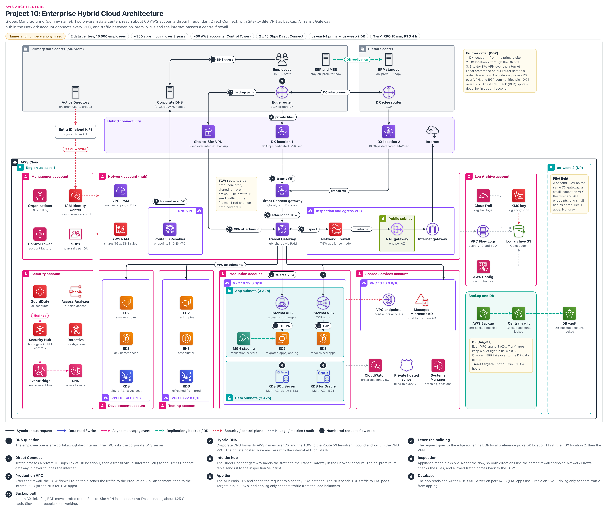

# Enterprise Hybrid Cloud Architecture

> **Confidentiality note:** Company names, domain names, IDs and all numbers in this document are dummy values. The architecture, the decisions and the trade-offs are what this document shares.
> Key figures (dummy values): Globex Manufacturing, 2 data centers (primary and DR), 15,000 employees, about 300 apps moved to AWS over 3 years, about 60 AWS accounts (Control Tower), 2 x 10 Gbps Direct Connect links (2 different DX locations), main region us-east-1, DR region us-west-2, DR targets RPO 15 minutes and RTO 4 hours. AWS limits and prices change over time, so treat them as "typical" or "approximate".

## Contents

- [Architecture diagram](#architecture-diagram)
- [1. Project name](#1-project-name)
- [2. Business problem](#2-business-problem)
- [3. Architecture overview](#3-architecture-overview)
- [4. Request flow](#4-request-flow)
- [5. Why each AWS service](#5-why-each-aws-service)
  - Services: [AWS Direct Connect (DX links, Direct Connect gateway)](#aws-direct-connect-dx-links-direct-connect-gateway) · [AWS Site-to-Site VPN](#aws-site-to-site-vpn) · [AWS Transit Gateway](#aws-transit-gateway) · [AWS Network Firewall](#aws-network-firewall) · [NAT Gateway and Internet Gateway (central egress)](#nat-gateway-and-internet-gateway-central-egress) · [Amazon VPC and VPC IPAM](#amazon-vpc-and-vpc-ipam) · [AWS RAM (Resource Access Manager)](#aws-ram-resource-access-manager) · [Amazon Route 53 Resolver (inbound, outbound endpoints)](#amazon-route-53-resolver-inbound-outbound-endpoints) · [Amazon Route 53 private hosted zones (PHZ)](#amazon-route-53-private-hosted-zones-phz) · [VPC endpoints (AWS PrivateLink, centralized)](#vpc-endpoints-aws-privatelink-centralized) · [AWS Organizations and SCPs](#aws-organizations-and-scps) · [AWS Control Tower](#aws-control-tower) · [AWS IAM Identity Center](#aws-iam-identity-center) · [IAM roles (cross-account access)](#iam-roles-cross-account-access) · [Amazon GuardDuty](#amazon-guardduty) · [AWS Security Hub (unified) and Security Hub CSPM](#aws-security-hub-unified-and-security-hub-cspm) · [Amazon Detective](#amazon-detective) · [IAM Access Analyzer](#iam-access-analyzer) · [Amazon EventBridge (central security event bus)](#amazon-eventbridge-central-security-event-bus) · [Amazon SNS](#amazon-sns) · [AWS CloudTrail (organization trail)](#aws-cloudtrail-organization-trail) · [AWS Config](#aws-config) · [VPC Flow Logs](#vpc-flow-logs) · [Amazon S3 (Log Archive bucket)](#amazon-s3-log-archive-bucket) · [AWS KMS](#aws-kms) · [AWS Secrets Manager](#aws-secrets-manager) · [Elastic Load Balancing (Internal ALB and Internal NLB)](#elastic-load-balancing-internal-alb-and-internal-nlb) · [Amazon EC2 and Auto Scaling](#amazon-ec2-and-auto-scaling) · [AWS Application Migration Service (MGN)](#aws-application-migration-service-mgn) · [Amazon EKS](#amazon-eks) · [Amazon RDS (SQL Server and Oracle)](#amazon-rds-sql-server-and-oracle) · [AWS Managed Microsoft AD](#aws-managed-microsoft-ad) · [Amazon CloudWatch (cross-account observability)](#amazon-cloudwatch-cross-account-observability) · [AWS Systems Manager](#aws-systems-manager) · [AWS Backup (central vault and DR vault)](#aws-backup-central-vault-and-dr-vault)
  - [Key decisions](#key-decisions)
- [5A. Key topics](#5a-key-topics)
  - [Hub-and-spoke architecture (one hub in the middle, spokes around it)](#hub-and-spoke-architecture-one-hub-in-the-middle-spokes-around-it)
  - [Network segmentation (TGW route tables, inspection)](#network-segmentation-tgw-route-tables-inspection)
  - [Centralized logging (all logs in one place)](#centralized-logging-all-logs-in-one-place)
  - [Security account (a separate account for security tools)](#security-account-a-separate-account-for-security-tools)
  - [Shared services (common services everyone uses)](#shared-services-common-services-everyone-uses)
  - [Cross-account access (access between accounts)](#cross-account-access-access-between-accounts)
  - [Hybrid connectivity (DX resiliency, BGP, VPN failover, MTU, bandwidth)](#hybrid-connectivity-dx-resiliency-bgp-vpn-failover-mtu-bandwidth)
  - [Private connectivity (PrivateLink, centralized endpoints, hybrid DNS)](#private-connectivity-privatelink-centralized-endpoints-hybrid-dns)
  - [Why multi-account and why Transit Gateway (vs peering, vs Cloud WAN)](#why-multi-account-and-why-transit-gateway-vs-peering-vs-cloud-wan)
- [6. High availability](#6-high-availability)
- [7. Security](#7-security)
- [8. Monitoring](#8-monitoring)
- [9. Disaster recovery](#9-disaster-recovery)
- [10. Scaling (when traffic grows 10x)](#10-scaling-when-traffic-grows-10x)
- [11. Failure scenarios](#11-failure-scenarios)
  - [Failure 1: DX location 1 link is down (fiber cut)](#failure-1-dx-location-1-link-is-down-fiber-cut)
  - [Failure 2: Both DX links are down](#failure-2-both-dx-links-are-down)
  - [Failure 3: One AZ in us-east-1 is down](#failure-3-one-az-in-us-east-1-is-down)
  - [Failure 4: On-prem advertised too many routes (BGP session down)](#failure-4-on-prem-advertised-too-many-routes-bgp-session-down)
  - [Failure 5: Hybrid DNS is not working](#failure-5-hybrid-dns-is-not-working)
  - [Failure 6: RDS SQL Server primary instance is down](#failure-6-rds-sql-server-primary-instance-is-down)
  - [Failure 7: Someone stole dev account credentials](#failure-7-someone-stole-dev-account-credentials)
  - [Failure 8: The whole us-east-1 region is not working](#failure-8-the-whole-us-east-1-region-is-not-working)
- [12. Cost optimization](#12-cost-optimization)
- [13. Two-minute project walkthrough](#13-two-minute-project-walkthrough)
- [14. Deep-dive questions and answers](#14-deep-dive-questions-and-answers)
  - [Q1. Walk me through how an employee in the office reaches an app in the production account.](#q1-walk-me-through-how-an-employee-in-the-office-reaches-an-app-in-the-production-account)
  - [Q2. Why Transit Gateway instead of VPC peering?](#q2-why-transit-gateway-instead-of-vpc-peering)
  - [Q3. Why multi-account? Why not one account with many VPCs?](#q3-why-multi-account-why-not-one-account-with-many-vpcs)
  - [Q4. How do you guarantee that prod and non-prod can never talk?](#q4-how-do-you-guarantee-that-prod-and-non-prod-can-never-talk)
  - [Q5. What is TGW appliance mode, and what breaks without it?](#q5-what-is-tgw-appliance-mode-and-what-breaks-without-it)
  - [Q6. Explain your Direct Connect resiliency model. Why not maximum resiliency?](#q6-explain-your-direct-connect-resiliency-model-why-not-maximum-resiliency)
  - [Q7. How does BGP choose between DX and VPN, in both directions?](#q7-how-does-bgp-choose-between-dx-and-vpn-in-both-directions)
  - [Q8. What happens to MTU when traffic fails over from DX to VPN?](#q8-what-happens-to-mtu-when-traffic-fails-over-from-dx-to-vpn)
  - [Q9. Direct Connect is not encrypted by default. How do you encrypt it?](#q9-direct-connect-is-not-encrypted-by-default-how-do-you-encrypt-it)
  - [Q10. How does hybrid DNS work in both directions?](#q10-how-does-hybrid-dns-work-in-both-directions)
  - [Q11. Why centralize interface endpoints, and when would you not?](#q11-why-centralize-interface-endpoints-and-when-would-you-not)
  - [Q12. How do people and tools get cross-account access? What is the confused deputy problem?](#q12-how-do-people-and-tools-get-cross-account-access-what-is-the-confused-deputy-problem)
  - [Q13. How do you make sure nobody can delete or change the audit logs?](#q13-how-do-you-make-sure-nobody-can-delete-or-change-the-audit-logs)
  - [Q14. How does a GuardDuty finding in a dev account reach the on-call engineer?](#q14-how-does-a-guardduty-finding-in-a-dev-account-reach-the-on-call-engineer)
  - [Q15. How do you stop teams from creating internet gateways or public resources?](#q15-how-do-you-stop-teams-from-creating-internet-gateways-or-public-resources)
  - [Q16. How did you migrate 300 applications?](#q16-how-did-you-migrate-300-applications)
  - [Q17. If us-east-1 goes down, how do on-prem users reach us-west-2?](#q17-if-us-east-1-goes-down-how-do-on-prem-users-reach-us-west-2)
  - [Q18. How did you plan IP addresses, and how do you avoid IP exhaustion in EKS?](#q18-how-did-you-plan-ip-addresses-and-how-do-you-avoid-ip-exhaustion-in-eks)
  - [Q19. Looking back, what would you do differently?](#q19-looking-back-what-would-you-do-differently)
- [Glossary](#glossary)

## Architecture diagram

### How to read the diagram
- **Center, top to bottom (main spine):** Employees → Edge router → DX location 1 → Direct Connect gateway → Transit Gateway → Internal ALB → EC2 → RDS SQL Server. This is the path from the office to an app in AWS.
- **Numbered badges (1 to 10):** these match the steps in section 4. Steps 1 and 2 are hybrid DNS, steps 3 to 5 are the Direct Connect path, step 6 is the firewall, steps 7 to 9 are the production VPC, and step 10 is the backup VPN.
- **Top:** the primary data center (ERP, MES, Active Directory, Corporate DNS), with the DR data center to its right. Below them is the purple "Hybrid connectivity" band (VPN, 2 DX links, Internet).
- **Accounts inside AWS:** at the top are Management, Network (hub) and Log Archive. Below are Security, Development, Testing, Production and Shared Services.
- **Accounts not drawn as boxes:** the Backup account and the DR-backup account. The vault labels in the Backup and DR panel on the right show their names: Central vault = Backup account (us-east-1), DR vault = DR-backup account (us-west-2). The Forensics account (used to copy evidence during security incidents, in the Security OU) is not in the diagram.
- **Far right, us-west-2 (DR):** only the DR vault is drawn. The pilot light (a second TGW, small VPCs, endpoints) appears only as a note (see section 9).

| Line | Meaning |
|---|---|
| Black line | Request traffic |
| Blue | Database read/write |
| Pink dashed | Security events |
| Green dashed | Replication, backup |
| Red dotted | Identity, guardrails (control) |
| Grey dotted | Logs, metrics |

- Not every connection is drawn: every VPC is attached to the TGW and spans 3 AZs (see the diagram footnote).

## 1. Project name
- **Globex Hybrid Landing Zone:** an enterprise hybrid platform that privately connects 2 on-prem data centers with about 60 AWS accounts.
- In one line: we connected the office to a single Transit Gateway hub using Direct Connect, and gave every team its own account and VPC. Traffic passes through a central firewall, and logs go to one locked account.
- **Hybrid cloud:** some systems stay on-prem (ERP, MES), some run in AWS, and both work like one company network.
- **Landing zone:** a base setup where network, logging, security and access are already in place the moment a new account is created.

## 2. Business problem

### Who is the company?
- Globex Manufacturing is a large manufacturing company.
- 15,000 employees work in offices and factories. There are 2 data centers: one primary and one DR (in a different city).
- **ERP** (finance, purchasing, inventory) and **MES** (the system that runs the factory machines) stay on-prem. They will not move any time soon.

### What were the problems?
1. **Old data center hardware:** 300 apps ran on old VMware servers. Instead of replacing the hardware, the board said "move to AWS in 3 years".
2. **AWS was already messy:** teams had opened their own accounts, and everyone used 10.0.0.0/16. When one team connected to the office with a VPN, the factory network routes got mixed up, and scanners in one plant stopped for 3 hours.
3. **Failed audit:** the auditor asked "who changed the prod database last month?". CloudTrail was off in some accounts, and everyone used old access keys. We could not answer.
4. **The factory must not stop:** even a small delay is a problem for MES. AWS apps must always talk to ERP, and the security team did not want that traffic on the internet.
5. **Small network team:** 6 people cannot manage 60 different kinds of networks.

### What did the company need?
| Need | Target | In simple words |
|---|---|---|
| Hybrid link availability | Above 99.9% (2 DX + VPN backup) | If one DX fails, or even both, AWS apps must still work from the office |
| Link failover | About 1 second to detect (BFD), a few seconds to switch paths | BFD = a check every 300 ms that asks "is the link still alive?" |
| Peak load | About 4 Gbps of hybrid traffic, 8,000 people at the same time | Only 40% of one DX link (10 Gbps) |
| Bandwidth | 2 x 10 Gbps, normal traffic under 10 Gbps (N+1) | If one link fails, the other link must carry everything |
| App speed | Tier-1 apps p95 under 800 ms | 95 out of 100 requests must come back in under a second |
| Latency (office ↔ us-east-1) | About 5 to 15 ms | Apps that talk to ERP must not become slow |
| App availability (prod) | 99.9% (3 AZs, Multi-AZ RDS) | Apps must keep working if one AZ fails |
| RTO / RPO (region loss, Tier-1) | RTO 4 hours, RPO 15 minutes | Back up and running in us-west-2 within 4 hours, losing at most the last 15 minutes of data |
| Segmentation | Prod and non-prod must never talk | Even if dev is hacked, there is no path to prod |
| Audit, access | Every API call recorded, logs cannot be deleted, no IAM users | Disabling someone in AD also removes their AWS access |
| Internet | No direct internet for workload VPCs | All outbound traffic goes through the central firewall |
| Migration pace | About 8 to 10 apps per month (300 / 36 months) | New accounts and VPCs every month |

- **Tier-1** = important apps where the business stops if they stop (about 20 of them).

### Why this architecture?
- **Multi-account:** a separate account per environment and function. If something goes wrong, the damage (blast radius) stops there.
- **Hub-and-spoke (Transit Gateway):** a peering mesh for 70 VPCs means thousands of connections. With a hub, each VPC attaches only once.
- **2 Direct Connect links + VPN backup:** a private path with steady latency, and an internet VPN as the last backup.
- **Central inspection, logging, security:** small teams can watch the whole company from one place.
- **Control Tower account factory:** the new accounts that arrive every month are all created with the same baseline.

## 3. Architecture overview

### Users, DNS (on-prem, hybrid DNS)
- All users are office employees. The apps are internal only, so there is no public edge (CloudFront, the AWS content delivery network, or WAF, the web application firewall).
- **Corporate DNS** sends AWS names to **Route 53 Resolver** (the service that answers DNS questions inside a VPC).
- **Private hosted zones (PHZ):** DNS zones that are not visible from outside, linked to each VPC (see Private connectivity in 5A).

### Hybrid connectivity (edge)
- **Edge router:** the router in the data center that speaks BGP (the routing language) with AWS.
- **Direct Connect (DX):** a private fiber link with no internet in the path. Two 10 Gbps links, in different DX locations, with MACsec. DX 2 comes from the DR site, and there is a DC interconnect between the sites.
- **Site-to-Site VPN:** encrypted IPsec tunnels over the internet. We use it only when both DX links are down.

### Network (Network account, hub)
- **Direct Connect gateway:** global (it does not belong to any region). Both DX links connect to it, and it connects to the us-east-1 TGW (and also to the us-west-2 TGW).
- **Transit Gateway (TGW):** the central router where all VPCs, DX and VPN meet. With 5 route tables we decide who can talk to whom.
- **Inspection and egress VPC:** Network Firewall (the AWS managed firewall), one NAT gateway per AZ, and a single Internet gateway. The **DNS VPC** holds the Resolver endpoints. **VPC IPAM** (IP address manager) hands out IP ranges from one plan.

### Application (workload accounts)
- **Production VPC (10.32.0.0/16):** app and data subnets across 3 AZs. There is no public subnet, NAT or Internet gateway.
- **Internal ALB** (Application Load Balancer) for web apps, **Internal NLB** (Network Load Balancer) for factory TCP apps. Apps brought over with MGN (Application Migration Service) run on **EC2** (virtual servers), and new apps run on **EKS** (managed Kubernetes).
- **Development (10.64.0.0/16), Testing (10.72.0.0/16):** the same design, with smaller instances.

### Data
- **RDS SQL Server** (port 1433) and **RDS for Oracle** (1521): RDS is the AWS managed database service. Both are Multi-AZ (a standby in another AZ) and encrypted with KMS (Key Management Service).
- In dev, RDS is single-AZ. Test databases are rebuilt from masked production snapshots.
- DB passwords live in **Secrets Manager** (a safe store for passwords and keys), not in code.

### Messaging (security alerts)
- Here, messaging does not mean business events, it means **security alerts**.
- GuardDuty finding → Security Hub → central **EventBridge** bus (an event router) in the Security account. A rule checks the severity, and if it is HIGH, it sends a page, email and chat message through **SNS** (Simple Notification Service).

### Security
- **Management account:** Organizations (groups accounts into folders called OUs, with one bill), Control Tower (one baseline for all), SCPs (lines no admin can cross), Identity Center (sign in to AWS with the Entra ID login).
- **Security account:** GuardDuty (threat detection), Security Hub, Detective, Access Analyzer. Alerts from all accounts come here.
- **Shared Services:** Managed Microsoft AD (with a trust to on-prem AD), central VPC endpoints. Every account has its own KMS keys.

### Monitoring
- **Log Archive account:** CloudTrail (API call history), Config (resource setting history) and VPC Flow Logs (network traffic records) all go into an S3 bucket with Object Lock, so nobody can delete them.
- **CloudWatch:** the Shared Services account is also the monitoring account. Metrics, logs and alarms from all accounts are in one place.
- **Systems Manager:** patching, and shell access without SSH keys (Session Manager).

### Disaster Recovery
- Every VPC spans 3 AZs. Tier-1 apps have a pilot light in us-west-2 (a small copy ready in advance, which we scale up when needed).
- **AWS Backup:** locked central vault in the Backup account (us-east-1) → locked DR vault in the DR-backup account (us-west-2).
- On-prem ERP fails over to its own DR data center. **Targets: RPO 15 minutes, RTO 4 hours.**

## 4. Request flow
- Scenario: an employee opens the ERP portal in AWS from an office PC.
- DNS path: `Employee PC → Corporate DNS → (DX, TGW) → Route 53 Resolver inbound endpoint → Private hosted zone`
- Request path: `Employee → Edge router → DX location 1 → Direct Connect gateway → Transit Gateway → Network Firewall → Transit Gateway → Internal ALB → EC2 → RDS SQL Server`
- Backup path: `Edge router → Site-to-Site VPN (internet) → Transit Gateway`

### Step 1: DNS question (Corporate DNS)
- The browser has `erp-portal.aws.globex.internal`. The PC asks the corporate DNS (UDP/TCP 53).
- The corporate DNS has a conditional forwarder: "ask AWS for `aws.globex.internal`". If the answer is in cache, it takes under 1 ms.

### Step 2: Hybrid DNS (Route 53 Resolver, private hosted zone)
- The question travels over DX and TGW to the Resolver **inbound endpoint**: 3 private IPs across 3 AZs in the DNS VPC (ENI = a virtual network card in a VPC). Its SG allows port 53 only from the on-prem DNS IPs.
- The PHZ returns the private IPs of the internal ALB (10.32.x.x). This takes about 10 to 20 ms, and then the answer is cached until the TTL expires.

### Step 3: Leave the building (Edge router, BGP)
- The PC opens HTTPS (TCP 443) to 10.32.x.x. The router has three paths: DX 1, DX 2 and VPN.
- AWS summaries (from the IPAM plan): for us-east-1, 10.16.0.0/12, 10.32.0.0/11 and 10.64.0.0/11. For us-west-2, 10.96.0.0/11.
- On our router, **local preference** (a number that says "which path do I like more") is highest for DX 1, middle for DX 2 and lowest for VPN. So DX 1 wins.
- On the AWS side, for the same prefix, the TGW always prefers DX gateway routes over VPN routes (attachment type order). So we do not need AS path prepend on the VPN (making a path look longer so it becomes less preferred).

### Step 4: Direct Connect (DX location 1, transit VIF)
- The traffic goes over the private 10 Gbps fiber to DX location 1. It never touches the internet. **MACsec** encrypts it between our router and the AWS device.
- **Transit VIF:** a VLAN plus a BGP session on the DX link, which goes to the Direct Connect gateway. About 2 to 10 ms.

### Step 5: Into the hub (Direct Connect gateway → Transit Gateway)
- The DX gateway hands the traffic to the TGW in the Network account. DX packets look up the **on-prem route table** (this is what "associate" means).
- That table has `0.0.0.0/0 → inspection VPC`, meaning "go to the firewall first". Under 1 ms.

### Step 6: Inspection (Network Firewall, TGW appliance mode)
- With **appliance mode**, the TGW picks one AZ using a flow hash (it may not be the source AZ), and both directions of that flow stay in the same AZ.
- The TGW subnet route table in that AZ sends the packet to the firewall endpoint in the same AZ.
- A sample rule: "office ranges → prod ALB, TCP 443 only". If allowed, the packet goes back to the TGW, in about 1 ms.

### Step 7: Production VPC (TGW firewall route table → ALB or NLB)
- Returning packets look up the **firewall route table**: it has paths to all VPCs and to on-prem (propagate: each attachment writes its own path here).
- 10.32.0.0/16 → Production VPC attachment → internal ALB (web) or NLB (TCP apps).
- alb-sg: TCP 443 only from company ranges (prefix list: one name for many IP ranges).

### Step 8: App tier (Internal ALB → EC2, Internal NLB → EKS)
- The ALB ends TLS (private CA certificate) and forwards to a healthy EC2 instance. The NLB forwards to EKS pods.
- app-sg: allows traffic only from the load balancer SG. App time is about 20 to 100 ms.

### Step 9: Database (RDS SQL Server)
- TCP 1433 to RDS SQL Server (EKS apps use 1521 to Oracle). db-sg: only from app-sg, with TLS and KMS.
- The app fetches its own DB user secret using its IAM role, or uses Windows auth. A query takes about 1 to 5 ms.

### Step 10: Backup path (Site-to-Site VPN)
- If both DX links fail, the BGP routes are withdrawn and the edge router uses the VPN path (within seconds).
- Two IPsec tunnels, a TGW VPN attachment, and a standard tunnel of about 1.25 Gbps. Slower, but work does not stop.

### Other flows
| Flow | Path | Key point |
|---|---|---|
| Return traffic | Back through the same firewall endpoint to DX | Appliance mode keeps the outgoing and return paths the same |
| AWS app → on-prem ERP | App VPC → TGW → Firewall → TGW → DX → on-prem | The ERP name resolves through the Resolver outbound endpoint |
| Outbound to internet | VPC → TGW → Firewall → NAT → Internet gateway | No NAT/IGW of its own, only allow-listed sites |
| AWS APIs (KMS, SSM, ECR) | VPC → TGW → Shared Services endpoints | S3 uses a free gateway endpoint in every VPC |
| Migration (MGN) | On-prem server → DX (TCP 1500) → MGN staging | The real EC2 instance launches on cutover day |
| Console login | AD → Entra ID → Identity Center → role | Credentials that work for only a few hours |
| Logs | Every account → Log Archive S3 | Object Lock: nobody can delete them |
| Security alert | GuardDuty → Security Hub → EventBridge → SNS | If HIGH, the on-call engineer gets paged |
| Backup | Workload account → central vault → DR vault (us-west-2) | Locked copies in separate accounts and a separate region |

## 5. Why each AWS service

- **Order:** hybrid link, network hub, DNS, accounts and access, security alerts, logs and encryption, apps and data, operations. Each service gets a short summary here, with the deeper detail in 5A.

### AWS Direct Connect (DX links, Direct Connect gateway)
**What it is:** a dedicated private fiber link from the office to AWS, which reaches the TGW through the global Direct Connect gateway.

**Why we used it:** 2 x 10 Gbps dedicated links, 2 DX locations, MACsec (details: Hybrid connectivity in 5A).

**Problem it solves:** steady latency, high bandwidth, and cheaper data transfer out.

**Alternatives:** VPN only, partner hosted connections, or 4 links.

**Why not the alternative:** hosted connections (up to 25 Gbps) give only one VIF and no MACsec. 4 links cost too much.

### AWS Site-to-Site VPN
**What it is:** two IPsec tunnels over the internet, with BGP, on a TGW VPN attachment.

**Why we used it:** the last backup if both DX links fail.

**Problem it solves:** work does not stop even if the whole DX provider goes down, and the cost is very low.

**Alternatives:** a third DX link, or TGW Connect with SD-WAN.

**Why not the alternative:** a third DX costs thousands of dollars per month, and the company has no SD-WAN.

### AWS Transit Gateway
**What it is:** a managed router in a region. VPCs, the DX gateway and VPNs attach to it, and route tables provide segmentation.

**Why we used it:** one TGW in the Network account, shared with all accounts through RAM.

**Problem it solves:** 70 attachments instead of 2,400 peerings for 70 VPCs.

**Alternatives:** VPC peering, Cloud WAN, EC2 router appliances.

**Why not the alternative:** peering does not scale, and Cloud WAN is not needed for 2 regions (details: Why Transit Gateway in 5A).

### AWS Network Firewall
**What it is:** a stateful firewall run by AWS. It looks for attack patterns and stops packets (IPS), using Suricata rules.

**Why we used it:** in the inspection VPC with appliance mode: east-west, office ↔ AWS and egress traffic, all three in one place.

**Problem it solves:** auditors asked for east-west inspection and egress domain filtering. Security Groups cannot do that.

**Alternatives:** Palo Alto behind a Gateway Load Balancer (a load balancer in front of third-party firewalls), or the native TGW attachment.

**Why not the alternative:** third-party licenses, and we would have to do the patching ourselves. Our inspection VPC also holds the central NAT, which is why we chose the VPC model.

### NAT Gateway and Internet Gateway (central egress)
**What it is:** NAT: an outbound-only path for private servers. IGW: the internet door of a VPC.

**Why we used it:** one NAT per AZ and a single IGW in the inspection VPC, for all VPCs.

**Problem it solves:** no need for 60 sets of NAT. Nobody can add their own IGW (SCP).

**Alternatives:** a NAT in every VPC, or an on-prem proxy.

**Why not the alternative:** per-VPC NAT has a high hourly cost. A proxy means going to the office and coming back (hairpin), which adds latency.

### Amazon VPC and VPC IPAM
**What it is:** VPC: our private network. IPAM: a service that hands out IP ranges from one plan.

**Why we used it:** every account gets its own /16 VPC across 3 AZs (IP plan: Network segmentation in 5A).

**Problem it solves:** the old 10.0.0.0/16 clash does not happen again.

**Alternatives:** a spreadsheet, or Infoblox.

**Why not the alternative:** with IPAM, AFT (Terraform) gets a CIDR from the pool automatically, and it syncs with Infoblox. The Control Tower built-in VPC settings do not work with IPAM (check the docs).

### AWS RAM (Resource Access Manager)
**What it is:** a service that shares one account's resources with the organization.

**Why we used it:** to share the TGW, Resolver rules and IPAM pools from the Network account.

**Problem it solves:** no copies, control from one place.

**Alternatives:** VPC sharing (splitting subnets of one VPC between accounts).

**Why not the alternative:** each account needs its own VPC boundary (blast radius, ownership).

### Amazon Route 53 Resolver (inbound, outbound endpoints)
**What it is:** the VPC DNS service. Inbound = the door for the office to ask about AWS names, outbound = the door for AWS to ask about office names.

**Why we used it:** in the DNS VPC across 3 AZs, with rules shared to all VPCs through RAM (flow: Private connectivity in 5A).

**Problem it solves:** nobody needs to hardcode IPs.

**Alternatives:** BIND / Windows DNS on EC2.

**Why not the alternative:** we would own the patching and HA ourselves.

### Amazon Route 53 private hosted zones (PHZ)
**What it is:** a DNS zone that is visible only in the VPCs linked to it.

**Why we used it:** `aws.globex.internal` and the central endpoint zones, associated cross-account with all VPCs.

**Problem it solves:** stable names for apps, and it is key to making the central endpoints work.

**Alternatives:** AWS records in on-prem DNS, or Route 53 Profiles.

**Why not the alternative:** on-prem DNS means a ticket for every change. Profiles are planned for a later phase.

### VPC endpoints (AWS PrivateLink, centralized)
**What it is:** interface endpoints that let us call AWS APIs (STS, SSM, KMS, Logs, ECR, Secrets Manager) using private IPs.

**Why we used it:** one set in Shared Services, reaching all VPCs through PHZs (Private connectivity in 5A).

**Problem it solves:** about 30 ENIs instead of 1,800, and no internet needed.

**Alternatives:** separate endpoints in every VPC.

**Why not the alternative:** the hourly cost is high. Only a VPC with very heavy traffic gets a local endpoint (Q11), and the S3 gateway endpoint is in every VPC.

### AWS Organizations and SCPs
**What it is:** puts accounts into OUs with one bill. SCP: the maximum permissions anyone in an account can have.

**Why we used it:** Security, Infrastructure, Prod and Non-prod OUs, with SCPs (list: Guardrails in section 7).

**Problem it solves:** even the account admin cannot cross these lines.

**Alternatives:** IAM policies only, or Config rules.

**Why not the alternative:** an admin can change IAM policies, and Config only tells us after the fact. SCPs do not apply to the management account, and there are no workloads there.

### AWS Control Tower
**What it is:** a service that builds and maintains the landing zone, with an account factory.

**Why we used it:** with AFT (Account Factory for Terraform), a new account comes with the trail, Config, an IPAM VPC, the TGW attachment and access already set up.

**Problem it solves:** a new account is ready in about an hour, and all accounts are the same.

**Alternatives:** our own Terraform / StackSets, or Landing Zone Accelerator.

**Why not the alternative:** we would have to maintain the guardrails and drift detection ourselves, while here the controls are ready.

### AWS IAM Identity Center
**What it is:** one sign-in for people: SAML (login) and SCIM (sync) with Entra ID, and a permission set = a short-lived role in each account.

**Why we used it:** access for about 1,500 people. Joining an AD group gives you the role. It is replicated to us-west-2 (section 9).

**Problem it solves:** IAM users and old keys are gone. Disabled in AD = AWS access is gone.

**Alternatives:** IAM users in every account, or per-account SAML.

**Why not the alternative:** keys in 60 places and 60 SAML setups, and we would forget offboarding. Break-glass users: section 7.

### IAM roles (cross-account access)
**What it is:** an identity without a password: trust policy = who can assume it, permission policy = what it can do.

**Why we used it:** a prod deploy role for CI runners, an instance profile for EC2, and Pod Identity for EKS (each pod gets its own role).

**Problem it solves:** no long-lived keys. Vendors get an external ID (Cross-account access in 5A).

**Alternatives:** resource policies only, or access keys.

**Why not the alternative:** not every service supports resource policies. Where they exist, we use them with `aws:PrincipalOrgID` (our organization only).

### Amazon GuardDuty
**What it is:** threat detection. It reads CloudTrail, Flow Logs and DNS logs and catches suspicious activity (stolen credentials, crypto mining).

**Why we used it:** delegated admin in the Security account (running the tool from the Security account instead of the management account), auto-enable for new accounts, with EKS, runtime and S3 protection turned on.

**Problem it solves:** a small team sees 60 accounts in one console.

**Alternatives:** our own rules in a SIEM (a tool that collects all logs in one place and hunts for attacks, for example Splunk).

**Why not the alternative:** the on-prem SOC (24x7 security team) has a SIEM, but writing AWS detections ourselves is hard. Findings also go to the SIEM.

### AWS Security Hub (unified) and Security Hub CSPM
**What it is:**
- **AWS Security Hub** (unified since 2025): combines GuardDuty, Inspector, Macie and CSPM findings into prioritized exposure findings, in OCSF format.
- **Security Hub CSPM** (the new name of the old Security Hub): FSBP and CIS best-practice checks, an account score, and ASFF findings (OCSF and ASFF are findings formats).

**Why we used it:** both have delegated admin in the Security account, and us-west-2 findings are aggregated into us-east-1.

**Problem it solves:** one console, and a "which account fails which control" report for audit.

**Alternatives:** send each service directly to the SIEM.

**Why not the alternative:** a separate integration for every source. Be careful: EventBridge rules and the SIEM parser depend on the format (OCSF or ASFF).

### Amazon Detective
**What it is:** after a finding, it builds a "behavior graph" from logs for investigation.

**Why we used it:** in the Security account: in a few clicks we see which IP a suspicious role came from and what it touched.

**Problem it solves:** no need for hours of Athena queries.

**Alternatives:** Athena, or the SIEM.

**Why not the alternative:** Athena is for deep audits, Detective is faster for first response.

### IAM Access Analyzer
**What it is:** finds resources shared outside the organization, and unused permissions.

**Why we used it:** admin in the Security account, with zone of trust = the organization.

**Problem it solves:** if a bucket is shared with an outside account, we get a finding right away, and we trim permissions unused for 90 days.

**Alternatives:** manual reviews, or CIEM tools (third-party tools that look for excess permissions).

**Why not the alternative:** manual reviews do not scale. Policy validation in CI also uses this same API.

### Amazon EventBridge (central security event bus)
**What it is:** a bus that sends events to targets based on rules, also across accounts.

**Why we used it:** findings and root login events go to the Security account bus, with `aws:PrincipalOrgID` in the bus policy.

**Problem it solves:** HIGH → SNS pager, MEDIUM → ticket, and Lambda auto-fix for some.

**Alternatives:** separate SNS in every account, or SIEM alerting.

**Why not the alternative:** we cannot maintain 60 alert setups.

### Amazon SNS
**What it is:** pub/sub: publish to a topic, and all subscribers get it.

**Why we used it:** a "security-critical" topic: pager webhook, email, chat (Amazon Q Developer in chat applications).

**Problem it solves:** sends one event to pager, email and chat at the same time.

**Alternatives:** EventBridge API destinations.

**Why not the alternative:** SNS fan-out to three channels is simpler.

### AWS CloudTrail (organization trail)
**What it is:** records every API call (who, when, what). Org trail = one trail for all accounts and regions.

**Why we used it:** to the Log Archive S3, with KMS and log file validation. Member accounts cannot change it.

**Problem it solves:** the "CloudTrail off" audit finding is gone.

**Alternatives:** a separate trail in each account, or CloudTrail Lake (only for existing customers).

**Why not the alternative:** an admin can stop account trails. CloudTrail Lake is not available to new customers from May 31, 2026 (check the docs), so we use S3 + Athena.

### AWS Config
**What it is:** records the history of resource settings and checks them with rules.

**Why we used it:** in every account, with history sent to Log Archive, and an aggregator in the Security account.

**Problem it solves:** answers questions like "what did this SG look like last Tuesday?".

**Alternatives:** Terraform state, or a third-party CSPM.

**Why not the alternative:** console changes do not show up in Terraform state.

### VPC Flow Logs
**What it is:** a summary of every connection (IPs, port, accept/reject), not the packet content.

**Why we used it:** for every VPC and the TGW, sent to the Log Archive S3 in Parquet.

**Problem it solves:** REJECT records show "who is blocking this".

**Alternatives:** CloudWatch Logs, or Traffic Mirroring.

**Why not the alternative:** CloudWatch ingestion is expensive. Mirroring is only for investigations.

### Amazon S3 (Log Archive bucket)
**What it is:** object storage. Object Lock: nobody can delete objects until the retention period ends.

**Why we used it:** all audit logs, compliance mode, 7 years, KMS.

**Problem it solves:** even if an attacker becomes admin, they cannot erase their tracks, not even with root.

**Alternatives:** governance mode, or keeping logs only in the on-prem SIEM.

**Why not the alternative:** governance mode can be bypassed. In compliance mode, even we cannot remove a wrong retention, so we verify it first in a test bucket.

### AWS KMS
**What it is:** encryption keys, with a key policy that controls who can use them.

**Why we used it:** every account has its own customer managed keys, with `aws:SourceArn` / `aws:SourceAccount` in the log key policy.

**Problem it solves:** if one account is compromised, another account's data still cannot be decrypted.

**Alternatives:** AWS managed keys, or CloudHSM.

**Why not the alternative:** AWS managed keys cannot be shared, so backups encrypted with them cannot be copied cross-account (section 7).

### AWS Secrets Manager
**What it is:** a service that stores passwords and API keys and rotates them automatically.

**Why we used it:** the master password is an RDS-managed secret (only for DBA break-glass). Every app has its own DB user secret (with rotation), or uses Windows auth (Kerberos, no password).

**Problem it solves:** plain text passwords in config files are gone.

**Alternatives:** Parameter Store, or on-prem HashiCorp Vault.

**Why not the alternative:** Parameter Store has no rotation, and with an on-prem Vault, apps cannot start if DX is down.

### Elastic Load Balancing (Internal ALB and Internal NLB)
**What it is:** ALB: HTTP/HTTPS. NLB: TCP/UDP, with static private IPs. Internal = no public IP.

**Why we used it:** ALB for web apps, NLB for factory TCP systems and EKS.

**Problem it solves:** traffic only goes to healthy targets, and NLB IPs stay stable for on-prem firewall rules.

**Alternatives:** HAProxy / F5 on EC2, DNS round robin.

**Why not the alternative:** we would patch the appliances ourselves, and round robin has no health checks.

### Amazon EC2 and Auto Scaling
**What it is:** EC2: virtual servers. ASG: a group that adds and removes instances based on health and load.

**Why we used it:** apps brought over with MGN, with ASGs across 3 AZs (single-server legacy apps: section 6).

**Problem it solves:** move to AWS without changing code, then right-size later.

**Alternatives:** rewrite into EKS, or VMware on AWS.

**Why not the alternative:** no time to rewrite 300 apps. VMware has licensing costs.

### AWS Application Migration Service (MGN)
**What it is:** lift and shift: an agent continuously copies disks at block level, and on cutover day (the day we switch to the new server) it launches EC2.

**Why we used it:** staging servers in the Prod VPC, TCP 1500 over DX (throttled), 10 to 20 servers per wave.

**Problem it solves:** cutover downtime of only minutes, with a test launch done in advance.

**Alternatives:** VM Import/Export, manual rebuild.

**Why not the alternative:** large images, more downtime, and 300 apps cannot be done by hand.

### Amazon EKS
**What it is:** the Kubernetes control plane, run by AWS.

**Why we used it:** refactored apps, private API endpoint, 100.64.0.0/16 for pods (Q18), Karpenter (a tool that adds and removes nodes quickly).

**Problem it solves:** one platform for small services, and each pod gets its own IAM role.

**Alternatives:** Amazon ECS.

**Why not the alternative:** teams already had OpenShift and Helm charts, so EKS is the standard. ECS is an exception for very small apps, with a review.

### Amazon RDS (SQL Server and Oracle)
**What it is:** a relational database run by AWS. Multi-AZ = a synchronous standby in another AZ.

**Why we used it:** without changing the engine (replatform): SQL Server, Oracle, Multi-AZ, KMS.

**Problem it solves:** a small DBA team, and automatic failover, typically in 1 to 2 minutes.

**Alternatives:** databases on EC2, Aurora PostgreSQL, RDS Custom.

**Why not the alternative:** EC2 means we own the clusters and backups. Aurora needs the stored procedures rewritten (Key decisions).

### AWS Managed Microsoft AD
**What it is:** Microsoft AD run by AWS (DCs in 2 AZs), with a forest trust to on-prem AD.

**Why we used it:** in Shared Services, shared with workload accounts through directory sharing.

**Problem it solves:** domain join, service accounts, GPOs and RDS SQL Server Windows auth inside AWS (AD Connector does not support this, check the docs).

**Alternatives:** AD Connector (a proxy to on-prem AD), or on-prem domain DCs on EC2.

**Why not the alternative:** if we need logins to work even when the link is down, we need on-prem domain DCs on EC2 in AWS (a separate AD site), with patching and replication costs.

### Amazon CloudWatch (cross-account observability)
**What it is:** metrics, logs, alarms, and cross-account: one monitoring account sees the data of all accounts.

**Why we used it:** the Shared Services account is the monitoring account (section 8).

**Problem it solves:** no need to keep switching logins across 60 accounts.

**Alternatives:** Datadog, Managed Grafana.

**Why not the alternative:** per-host licensing is expensive, and DX/TGW metrics are already in CloudWatch.

### AWS Systems Manager
**What it is:** Patch Manager, Session Manager (a shell without SSH), Run Command.

**Why we used it:** patching for all accounts (non-prod in the first week, prod in the second week).

**Problem it solves:** bastions, SSH keys and port 22 are all gone.

**Alternatives:** SCCM, bastion hosts.

**Why not the alternative:** SCCM depends on DX, and a bastion is attack surface.

### AWS Backup (central vault and DR vault)
**What it is:** a service that runs EBS, RDS and EFS backups with one policy. Vault Lock: no deletes until the retention ends.

**Why we used it:** org policy with tags: central vault (us-east-1) → DR vault (us-west-2), both locked.

**Problem it solves:** even if ransomware takes over a prod account, it cannot reach the backups.

**Alternatives:** RDS automated backups only, or Veeam.

**Why not the alternative:** service backups live in the same account and are lost along with the account.

### Key decisions
| Decision | Chosen | Rejected | Why |
|---|---|---|---|
| Connecting VPCs | Transit Gateway (hub-and-spoke) | VPC peering, Cloud WAN | Peering is not transitive. Cloud WAN is for many regions, we have only 2 |
| Account model | About 60 accounts | Many VPCs in one account | Blast radius, clear billing, SCPs work at account level |
| Hybrid link | 2 x 10 Gbps DX, 2 locations + VPN | 4 DX links (maximum resiliency) | Enough for the 99.9% target, 4 links are expensive |
| DX encryption | MACsec (layer 2) | IPsec VPN over DX | MACsec runs at line rate, IPsec has a bandwidth limit |
| Shared network services | One inspection VPC, central NAT, endpoints | Separate ones in every VPC | One rule set, lower hourly cost |
| Directory | Managed Microsoft AD + trust | AD Connector | RDS SQL Server Windows auth, domain join, GPOs. On-prem DCs for user logins |
| Modernized apps platform | EKS | ECS | Teams already had OpenShift and Helm charts |
| Migrated databases | RDS SQL Server / Oracle (no engine change) | Aurora PostgreSQL | No time to rewrite stored procedures. Trade-off: license cost. Aurora later (after a Babelfish test) |

## 5A. Key topics

### Hub-and-spoke architecture (one hub in the middle, spokes around it)
- **Idea:** like a bicycle wheel: the hub (TGW) is in the middle, each spoke is a VPC, and spokes connect only through the hub.
- **Hub (Network account):** TGW, DX gateway, VPN, inspection and egress VPC, DNS VPC, IPAM. Only the network team changes it.
- **Spokes:** Prod, Dev, Test, Shared Services, and every VPC that comes later. App teams change only their own subnets and SGs.
- **Benefit:** a new VPC needs just one attachment + the right route table.
- **Trade-off:** TGW has a per-GB processing charge. A pair with very heavy traffic can get a peering exception, but that traffic skips the firewall, so it needs security approval.
- **Isn't the hub a single point of failure?** TGW is a regional, multi-AZ managed service. But an attachment needs a subnet in every AZ, otherwise workloads in that AZ cannot reach it.

### Network segmentation (TGW route tables, inspection)
- **Associate:** each attachment is tied to one route table (which table its traffic looks up). **Propagate:** the attachment writes its routes into other tables.

| TGW route table | Who is associated | Key routes |
|---|---|---|
| prod | Production VPCs | `0.0.0.0/0 → inspection`, non-prod summary → blackhole |
| non-prod | Dev, Test VPCs | `0.0.0.0/0 → inspection`, prod summary → blackhole |
| shared | Shared Services, DNS VPC | `0.0.0.0/0 → inspection` |
| on-prem | DX gateway, VPN | `0.0.0.0/0 → inspection` |
| firewall | Inspection VPC | Routes from all VPCs, DX and VPN propagate here |

- **IP plan (IPAM):** the AWS top pool is 10.0.0.0/9.
  - 10.0.0.0/12 is reserved: the old 10.0.0.0/16 VPCs and the on-prem ranges that clashed sit here. We never allocate or advertise it. We re-IP'd / migrated the old VPCs and closed them.
  - us-east-1: Shared 10.16.0.0/12 (including the Network account VPCs), Prod 10.32.0.0/11, Non-prod 10.64.0.0/11. us-west-2: 10.96.0.0/11.
  - A single summary route is enough to set a blackhole.
- **Defense in depth:** prod ↔ non-prod is stopped by a blackhole route on one side and a firewall deny rule on the other.
- **Layers (from biggest to smallest):**
  1. TGW route tables: which network can see which network.
  2. Network Firewall: which flows are allowed (ports, domains, IPS).
  3. NACLs: subnet level, stateless, only broad deny rules.
  4. Security Groups: instance level, stateful. The alb-sg → app-sg → db-sg chain.
- **Be careful:** associating with the wrong table breaks segmentation. So auto-associate/propagate is off, only the pipeline associates, and a Config rule checks it.

### Centralized logging (all logs in one place)
- **Audit / security logs** (CloudTrail, Config, VPC/TGW Flow Logs, Network Firewall logs): go to the Log Archive S3, kept for a long time, in a way that cannot be changed.
- **Operational logs, metrics:** in the CloudWatch monitoring account (Shared Services), for 30 to 90 days.
- **Why Log Archive is a separate account:** no workloads, and very few people can log in. Even if a workload account is compromised, the logs are safe.
- **How it is locked:** S3 Object Lock in compliance mode. The bucket policy lets only services like CloudTrail and Config write (`aws:SourceOrgID`).
  - SCP: denies bucket delete, lifecycle changes and policy changes (even for the Log Archive admin). KMS key policy: only a few auditors can decrypt.
- **Query:** Athena (Glue catalog), with saved queries such as: "what did this role do in the last 24 hours".
- **To the SIEM:** only findings and selected logs (S3 event → SQS → collector). Sending everything would blow up the license cost.
- **Retention:** 7 years, then lifecycle expire.
- **Be careful:** CloudTrail and Config files are very small. Since September 2024, S3 lifecycle does not transition objects smaller than 128 KB by default.
  - Glacier has a metadata overhead per object, plus transition request charges. So small files stay in Standard-IA or expire, and only the large Parquet flow logs go to Glacier.

### Security account (a separate account for security tools)
- The "Audit" account in Control Tower. It is the delegated administrator for all security tools: GuardDuty, Security Hub, Detective, Access Analyzer, Config aggregator, the central EventBridge bus, SNS.
- **Why not in the management account:** if they lived there, more people would ask for management access, and that access must stay with very few people.
- **Access:** a "security-audit" read-only role in every account, and a "security-responder" role (during an incident, with approval). The responder isolates the instance with a quarantine SG and copies the EBS snapshot to the Forensics account.

### Shared services (common services everyone uses)
- **Idea:** instead of copies in every account, build them once in Shared Services (10.16.0.0/16) for everyone.
- **What is here:** central endpoints + PHZs, Managed Microsoft AD, CloudWatch monitoring, SSM patching, artifact repos, CI runners (not in the diagram).
- **Who can reach it:** both prod and non-prod, through the firewall, only on the ports they need.
- **Risk:** if Shared Services is compromised, it becomes a bridge to prod and non-prod. So we treat it like prod, and we plan to split the CI runners into prod / non-prod.

### Cross-account access (access between accounts)
- **For people:** Identity Center: Entra ID group → permission set → a short-lived role in each account.
- **Session, approval:** "Prod-ReadOnly" lasts 8 hours, "Prod-Admin" 1 hour. Identity Center has no built-in approval, so we use TEAM (Temporary Elevated Access Management, AWS open-source) or an ITSM ticket for a time-bound assignment, which goes away when the time is up.
- **For tools:** CI runner role (Shared Services) → prod `deploy-role`, with only that role ARN in the trust policy.
- **Resource policies:** give another account access to S3, KMS, the EventBridge bus and secrets, with `aws:PrincipalOrgID`. Both the caller's IAM policy and the resource policy must allow it (for KMS, the key policy too).
- **Confused deputy:** an attacker tricks a trusted service (the deputy) into acting on our resources.
  - **Third-party:** a vendor assumes roles for all its customers. If another customer gives our role ARN, the vendor would read our data. Fix: `sts:ExternalId` (unique per customer).
  - **AWS service:** we give CloudTrail write access to the bucket. `aws:SourceArn` / `aws:SourceAccount` stop another account's trail from writing to it.
- **Organization level:** RCPs (resource control policies) enforce "nobody outside the organization can use our resources" (data perimeter).

### Hybrid connectivity (DX resiliency, BGP, VPN failover, MTU, bandwidth)

#### DX resiliency models
| Model | What it looks like | SLA (approximate, check the docs) | Our choice |
|---|---|---|---|
| Maximum resiliency | 2 locations, 2 connections in each location (on different devices), 4 in total | 99.99% | No: too expensive |
| High resiliency | 2 locations, 1 connection in each location | 99.9% | **This one**, + VPN backup |
| Development and test | 1 location, 2 connections (on different devices) | Not eligible for the 99.9% / 99.99% tiers (check the docs) | Not enough for prod |

- **Our setup:** DX 1 from the primary site, DX 2 from the DR site. Thanks to the DC interconnect, primary site traffic can also use DX 2.
- **Active/passive:** DX 1 → DX 2 → VPN. Active/active is possible, but traffic is harder to predict and troubleshoot.
- **N+1:** normal traffic under 10 Gbps, alarm at 7 Gbps (70%).

#### BGP: how we choose the path (the two directions are different)
- **Office → AWS:** local preference on the edge router: DX 1 high, DX 2 medium, VPN low (this is checked before AS path).
- **AWS → office:** longest prefix match comes first. For the same prefix, the TGW prefers DX gateway routes over VPN (attachment type order). AS path matters only between routes of the same type.
- **DX 1 vs DX 2 (AWS side):** communities `7224:7300` (high) on DX 1 and `7224:7100` (low) on DX 2, or AS path prepend on DX 2.
- **Asymmetric routing:** if traffic goes out on DX 1 and comes back on DX 2, the on-prem stateful firewall may drop it. We use the same order on both sides.
- **VPN gotcha:** we do not advertise more specific prefixes over the VPN. If we did, the VPN would win because of longest match.

#### Failover speed (BFD)
- The BGP default hold timer is about 90 seconds: it does not notice a dead link for up to a minute and a half.
- **BFD:** detects it right away with small hello packets, 300 ms x 3 = about 1 second. The AWS side is ready, we need to turn it on on our router.
- VPN BGP is always up (standby). As soon as the DX routes disappear, the VPN routes are used.

#### MTU (packet size) problem
- DX transit VIF and TGW support jumbo frames (about 8,500 bytes), but the VPN tunnel allows only about 1,446 because of IPsec overhead.
- **Problem:** if we use jumbo frames on DX, large packets get dropped during failover: pings work, but file copies and TLS hang.
- TGW PMTUD (path MTU discovery) works only for traffic on VPC and Connect attachments. It is not available on DX and VPN attachments (docs), so office traffic cannot rely on ICMP.
- **Our decision:** 1,500 MTU on DX too, TCP MSS clamping on the edge router (1,379), and the TGW also clamps. We keep ICMP allowed (for VPC traffic).
- MSS clamping does not work for UDP apps (factory protocols), so their packet size must stay under 1,400.

#### Bandwidth
- DX: 2 x 10 Gbps, about 10 Gbps usable because of N+1.
- VPN: a standard tunnel is about 1.25 Gbps, and large bandwidth tunnels on TGW go up to 5 Gbps (check the docs). With ECMP (spreading traffic across equal paths), tunnels can be combined.
- VPN depends on internet quality, so it is not equal to DX. If we need more backup capacity, moving to large bandwidth tunnels is one option.

#### Route limits (these really cause outages)
- From the office over a transit VIF: default 100 prefixes per BGP session (IPv4 and IPv6 counted separately). With prefix controls it can go up to 1,000 (check the docs). If the configured limit is exceeded, the BGP session goes idle/DOWN.
- From AWS to the office: allowed prefixes per TGW association (the list of AWS ranges the DX gateway advertises to the office) are about 200 (IPv4 + IPv6 together).
- The allowed prefixes of two TGWs on the same DX gateway must not overlap (AWS returns an error). So summaries on both sides and max-prefix on the router are a must.

### Private connectivity (PrivateLink, centralized endpoints, hybrid DNS)
- **Goal:** AWS APIs, internal services and on-prem systems are all reached over private IPs (only things like OS repos go to the internet, through the firewall).
- **What PrivateLink means:** a service shows up in another VPC as an ENI (private IP). The connection starts only from the consumer side, the networks are not joined, and it works even if CIDRs overlap.
- **Three uses:** (1) interface endpoints for AWS services. (2) A team publishes a service behind an NLB as an endpoint service. (3) Partner SaaS over PrivateLink.

#### How the central endpoints work
1. In the Shared Services VPC, one interface endpoint per service, across 3 AZs, with "private DNS" **off**.
2. One PHZ per service (for example `ssm.us-east-1.amazonaws.com`), with a record that is an alias to the endpoint DNS name.
3. Those zones are associated cross-account with all spoke VPCs (through the account factory pipeline, or Route 53 Profiles).
4. When a spoke EC2 instance asks for that name, it gets the private IP of the Shared Services endpoint, and traffic flows through the TGW.
- **Endpoint policy:** `aws:PrincipalOrgID`, our organization only.
- **S3 exception:** a gateway endpoint is only a route table entry and cannot be shared through the TGW, so every VPC has its own (free).
- **Regional:** endpoints and PHZs are limited to a region, so us-west-2 has a separate set (section 9).

#### Hybrid DNS
| Direction | How | Sample lookup |
|---|---|---|
| Office → AWS names | On-prem DNS conditional forwarder → Resolver **inbound** endpoint → PHZ | `erp-portal.aws.globex.internal` → internal ALB IP |
| AWS → office names | VPC Resolver → forwarding rule (RAM share) → **outbound** endpoint → on-prem DNS | `erp.corp.globex.local` → ERP IP |

- There is also a forwarding rule for the Managed AD domain names (to the Managed AD DNS IPs).
- **Scale:** about 10,000 queries per second per Resolver ENI (check the docs), with an `InboundQueryVolume` alarm.
- **Watch for loops:** forwarding the same zone in both directions creates a DNS loop.

### Why multi-account and why Transit Gateway (vs peering, vs Cloud WAN)

#### Why multi-account
- **Blast radius:** an account is a strong security boundary. Even if someone becomes admin in dev, they cannot touch prod.
- **Separate quotas and billing:** if one team uses up the EC2 limit, other teams are not affected, and cost is clear even without tags.
- **Guardrails, compliance:** SCPs at OU level, stricter rules for the Prod OU, and the audit scope covers only some accounts.
- **Cost:** automation for network, logging and access is a must. We could not run 60 accounts without Control Tower, TGW and Identity Center.

#### Why Transit Gateway
| | VPC peering | Transit Gateway | Cloud WAN |
|---|---|---|---|
| Model | 1-to-1, not transitive | Regional hub, route tables | Global network, with a JSON policy |
| For 70 VPCs | About 2,400 connections | 70 attachments | With segments |
| Central inspection | Almost none | Inspection VPC + appliance mode | With service insertion |
| DX / VPN | Separate for each VPC | One DX gateway, one VPN | Yes |
| Cost | Very low | Attachment hours + per GB | More than TGW (core network edge hours) |
| Best fit | 2 to 5 VPCs | 1 to 3 regions, many VPCs | Many regions, global segments |

- **Why not Cloud WAN (for now):** only 2 regions, and the team already has TGW Terraform modules and experience.
- **When we would switch:** if we grow past 3 regions for factories in Europe and Asia, we would attach the TGW to Cloud WAN and move step by step (not big-bang).
- **For the DR region:** another TGW in us-west-2, attached to the same DX gateway, with no prefix overlap (Route limits in 5A).
  - us-east-1 association: 10.16.0.0/12, 10.32.0.0/11, 10.64.0.0/11. us-west-2: 10.96.0.0/11. 10.0.0.0/12 is never advertised anywhere.
  - Inter-region peering between the two TGWs (static routes).

## 6. High availability
- **Idea:** at least two of everything in every layer, so if one fails the other takes over automatically.

| Layer | What can fail | How we get HA |
|---|---|---|
| On-prem edge | Edge router | Separate routers at the primary and DR sites, DC interconnect |
| DX | One link, one DX location | 2 locations, BFD about 1 second, BGP failover |
| DX + DX | Both links | Site-to-Site VPN, 2 tunnels, within seconds |
| TGW, DX gateway | AWS managed | Multi-AZ, attachment subnets in 3 AZs |
| Network Firewall | One AZ endpoint | An endpoint in every AZ. If an AZ fails, TGW moves flows to the other AZs (existing ones reset). TGW does not check endpoint health, so we have an alarm and a runbook |
| NAT gateway | One AZ | One NAT per AZ, routed in the same AZ as the firewall endpoint |
| Resolver endpoints | One ENI / AZ | ENIs in 3 AZs, and on-prem DNS has all the IPs |
| Load balancers, EC2 | Instance, AZ | ALB, NLB, ASG across 3 AZs, replaced based on ELB health checks |
| EKS | Node, AZ | Managed control plane, nodes in 3 AZs, pod topology spread |
| RDS | Primary, AZ | Multi-AZ, typically 1 to 2 minutes, same endpoint DNS |
| Managed AD | One DC | 2 DCs, 2 AZs |

- **Stateful legacy apps (ASG min = max = 1):** the instance comes back, but EBS lives in only one AZ. It works again within minutes only if the data is in EFS, FSx or RDS.
  - With local EBS, we restore from a snapshot in a new AZ: RPO = snapshot interval (1 hour). Only for Tier-2, agreed with the business.
- **Hidden single points (things we watch carefully):**
  - On-prem DNS forwarders: more than two, across both sites.
  - Identity Center: us-east-1 primary, us-west-2 replica, break-glass as the last backup.
  - Managed AD: users stay in the on-prem forest, so logins need the on-prem DCs. If both DX and VPN fail, logins stop (except cached logon).
  - Certificates: if private CA certificates expire, the ALB goes down, so we have expiry alarms.
- **Capacity:** sized so that 2 AZs are enough if one AZ fails (ASG max, EKS nodes with 50% headroom).

## 7. Security

### Identity, IAM
- How people and machines get access: section 5 (Identity Center, IAM roles) and Cross-account access in 5A. No IAM users (except break-glass), no long-lived keys, and MFA is mandatory in Entra ID.
- **Least privilege:** job function permission sets (ReadOnly, Developer, NetworkAdmin), trimmed every quarter with Access Analyzer.
- **Break-glass:** 2 IAM users in the management account, with hardware MFA. If they are used, EventBridge → SNS sends an alert right away.

### Guardrails (SCPs, Control Tower controls)
- Deny stopping CloudTrail, Config or GuardDuty. Deny all regions except us-east-1 and us-west-2 (with exceptions for global services).
- In workload accounts, deny creating IGWs, outside peering, and DX/VPN (allowed only for the Network account).
- We removed the root credentials of member accounts with centralized root access management. For rare tasks like a bucket policy lock-out, we use a short-lived root session from the management account. On top of that, an SCP denies root actions, but with an `aws:AssumedRoot` exception (otherwise the centralized root session tasks would also be blocked, check the docs).
- Deny changes to the Log Archive bucket and the log KMS key. Deny `LeaveOrganization`.

### Network security
| Security Group | Inbound allow | From where |
|---|---|---|
| alb-sg | TCP 443 | Company IP ranges (managed prefix list) |
| nlb-sg | App TCP ports | Factory / office ranges |
| app-sg | App port (8080) | alb-sg and nlb-sg only |
| db-sg | TCP 1433, 1521 | app-sg only |
| resolver-inbound-sg | TCP/UDP 53 | On-prem DNS server IPs only |
| endpoint-sg | TCP 443 | AWS VPC ranges (IPAM pools), on-prem ranges |

- **NACLs (stateless, subnet level):** default allow, with only a few broad deny rules (for example, deny non-prod ranges to data subnets). Ephemeral ports (1024-65535) are allowed for return traffic.
- **Network Firewall:** checks east-west (VPC to VPC), office ↔ AWS, and egress (to the internet). Egress domain allow list, IPS signatures, and prod ↔ non-prod is always denied.
- **No public exposure:** no IGWs, no public IPs. Also enforced with VPC Block Public Access and a declarative policy (a policy that locks a setting at the organization level).

### Encryption (data in transit and at rest)
- **On DX:** not encrypted by default. On dedicated connections we use **MACsec** (layer 2, line rate), and where that is not available, private IP VPN (IPsec) is an option.
- **VPN:** IPsec, AES-256, weak algorithms removed.
- **Apps:** only TLS 1.2 and above on the internal ALB (private CA certificate). TLS is also mandatory for RDS (force SSL parameter turned on in SQL Server).
- **At rest (data on disk):** EBS, RDS, S3, Secrets Manager and SNS all use customer managed KMS keys. EBS default encryption is on in every new account.

### KMS
- **SNS topic key:** a customer managed key, whose key policy allows `kms:GenerateDataKey*` and `kms:Decrypt` for `events.amazonaws.com`.
- With the aws/sns key, EventBridge publishing fails and alerts are lost silently. So there is an alarm on the rule's `FailedInvocations`.
- **For backup copies:**
  - The source customer managed key is shared with the backup account (in the source key policy). The destination vault re-encrypts with its own key.
  - The destination vault policy allows `backup:CopyIntoBackupVault` only for our organization (`aws:PrincipalOrgID`).
  - Cross-account backup is enabled once in the management account. Backups encrypted with AWS managed keys (aws/rds) cannot be copied cross-account.
- Yearly automatic rotation, a 30-day waiting period before delete, and `kms:ScheduleKeyDeletion` and `kms:DisableKey` limited to a few people by SCP.

### Secrets Manager
- Master and app secrets: see Secrets Manager in section 5. For vendor API keys, the resource policy allows only that app's role.
- In EKS, the Secrets Store CSI driver (an add-on that mounts a secret as a file in the pod). We never put them in plain Kubernetes secrets.

### About WAF
- The apps are internal only and there is no public edge, so we do not use AWS WAF right now.
- If partners need to see an app, we would use CloudFront + WAF + ALB in a separate ingress account (the Project 1 pattern). WAF can also be added on internal ALBs.

### Audit, detection
- **CloudTrail org trail:** all API calls from every account and every region go to Log Archive. Object Lock, KMS and log file validation mean nobody can change them.
- **Config:** keeps the settings history of every resource. With Control Tower detective controls and conformance packs, a finding appears as soon as a rule is broken.
- **Alert:** GuardDuty → Security Hub → EventBridge → SNS → on-call page (Q14).
- **Session Manager logs:** every shell command goes to S3.

## 8. Monitoring
- **Where we look:** the Shared Services account (this is our CloudWatch monitoring account). One dashboard covers everything from the office link to the database.

### Key metrics and alarm thresholds
| Component | Metric | Alarm | Why |
|---|---|---|---|
| DX connection | `ConnectionState` | Page within 1 minute if it is 0 | Link is down |
| DX virtual interface | `VirtualInterfaceBpsIngress` / `Egress` | Page if zero for 5 minutes even though ConnectionState = 1 | Link up, BGP down (Failure 4) |
| DX connection | `ConnectionBpsEgress` / `Ingress` | Above 7 Gbps for 15 minutes | Going beyond N+1 capacity |
| DX connection | `ConnectionLightLevelRx`, `ConnectionErrorCount` | Outside the normal range | Fiber is degrading (early warning) |
| DX MACsec | `ConnectionEncryptionState` | Page if down | Encryption is lost |
| VPN | `TunnelState` | One tunnel for 5 minutes (ticket), both (page) | Backup path is not ready |
| TGW | `PacketDropCountBlackhole`, `PacketDropCountNoRoute` | Sudden increase | Routing mistake |
| Network Firewall | `DroppedPackets` | 3 times the baseline | Bad new rule or an attack |
| NAT gateway | `ErrorPortAllocation` | Greater than 0 | Too many connections to one destination |
| Resolver | `InboundQueryVolume` | 70% of ENI capacity, or a sudden drop to zero | Need more ENIs / DNS is broken |
| Internal ALB | `HTTPCode_Target_5XX_Count`, `TargetResponseTime` p95 | 5xx above 1%, p95 above 800 ms | App is slow / errors |
| RDS | `CPUUtilization`, `FreeStorageSpace` | CPU 80%, storage below 15% | DB bottleneck |

### Logs, dashboards
- Audit logs → Log Archive S3 (Athena). App logs → CloudWatch Logs, 30 to 90 days (Centralized logging in 5A).
- **Watching BGP:** Network Manager route events, router BGP state (SNMP/syslog), and an alert if the number of routes in the TGW on-prem route table drops.
- **Dashboards:** Hybrid network (DX bandwidth, light levels, BGP/VPN state, drops), one per Tier-1 app (latency, errors, health, RDS), and Security (Security Hub CSPM score, open critical exposure findings in unified Security Hub).

### Application monitoring (how we know the apps are healthy)
- **SLO:** for Tier-1 apps, 99.9% of requests succeed each month, with p95 under 800 ms. Paging alarms are based on the SLO, not on CPU.
- **Synthetic checks:** CloudWatch Synthetics canaries inside the VPC check the ERP portal login every 5 minutes, so we know before users complain.
- **Office to AWS path:** Network Synthetic Monitor measures latency and packet loss over DX to on-prem IPs, so we can tell right away whether "slow" is a DX problem or an app problem.
- **Migrated EC2 apps:** the CloudWatch agent collects memory, disk, Windows event logs and app logs. An alarm fires if there are more than 50 ERRORs in 5 minutes (metric filter).
- **EKS apps:** ADOT (the AWS OpenTelemetry agent) sends traces to X-Ray / Application Signals, showing which services a request passed through.

### Troubleshooting tools
- **Reachability Analyzer:** checks the path across SGs, NACLs, routes and the TGW for questions like "why can't the prod EC2 reach the ERP IP".
- **Network Manager (TGW):** topology view, BGP / route events.
- **CloudTrail:** the first place we look during an incident for "who changed this route table".

## 9. Disaster recovery

### RTO / RPO targets
| App tier | RPO | RTO | In simple words | Strategy |
|---|---|---|---|---|
| Tier-1 (about 20 apps) | 15 minutes | 4 hours | Up to 15 minutes of data can be lost, back in us-west-2 within 4 hours | Pilot light in us-west-2 |
| Tier-2 | 24 hours | 24 hours | One day of data loss and downtime is accepted | Backup and restore (DR vault) |
| Tier-3 | 24 hours | 72 hours | Can be handled later | Rebuild with IaC + restore |
| On-prem ERP, MES | On-prem plan | On-prem plan | Failover to the DR data center | On-prem DB replication |

- **RTO:** the time to get working again. **RPO:** how much time worth of data can be lost.

### Backups, replication
- **AWS Backup:** an org backup policy, automatic for resources with the `backup=tier1` tag. Every backup lives in three places: the workload account, the central vault (Backup account, us-east-1) and the DR vault (DR-backup account, us-west-2). Vault Lock means that even an attacker with admin access cannot delete them.
- The central vault → DR vault copy is both cross-account and cross-region. For some resource types this may not work in a single copy action, and then it takes two steps (check the docs).
- **RDS Tier-1:** cross-region automated backups (snapshots + transaction logs to us-west-2), with point-in-time restore there. The restore point is typically a few minutes behind, within the 15-minute RPO. Some DBs have a cross-region read replica (depends on the engine and edition, check the docs).
- **EC2:** app servers are stateless (data is in RDS). EC2 Image Builder also copies AMIs to us-west-2.

### What is already in us-west-2 in the pilot light
- The us-west-2 TGW on the same DX gateway (allowed prefixes 10.96.0.0/11), a small inspection VPC, and Resolver endpoints in the DNS VPC.
- The Shared Services us-west-2 VPC: central interface endpoints (STS, SSM, KMS, Secrets Manager, Logs, ECR) and us-west-2 PHZs, associated with the DR VPCs.
- Managed Microsoft AD multi-Region replication (Enterprise edition). Without it, Windows auth and domain join do not work in us-west-2.
- KMS: keys in us-west-2 (or multi-Region keys). A destination region key for RDS cross-region backups.
- Secrets Manager replica secrets, ECR replication, and Resolver forwarding rules associated with the us-west-2 VPCs.
- In Tier-1 accounts: VPCs, ALBs, ASGs (desired 0 or 1) and a small EKS cluster, applied with Terraform. PHZ failover records, and the us-west-2 inbound IPs as secondary in the on-prem forwarders.

### If the us-east-1 region is lost (steps)
1. **Declare (0 to 30 minutes):** the incident commander decides. There is no automatic region failover: a false failover is also costly (data split, hard rollback).
2. **Network check:** DX and the DX gateway keep working, and us-west-2 routes are already advertised. Verify BGP and firewall health.
3. **Database (30 minutes to 2 hours):** restore RDS in us-west-2 to the latest restorable time (or promote the replica). This takes the most time.
4. **App:** scale the ASGs to production size, deploy to EKS with GitOps, and Karpenter adds nodes.
5. **DNS:**
   - DNS answers (data plane) keep working, but the Route 53 API that changes records (control plane) is in us-east-1. Accelerated recovery is only for public zones.
   - So we set up failover records in the PHZ in advance (primary = us-east-1 internal ALB, secondary = us-west-2 internal ALB), and tied them to ARC (Amazon Application Recovery Controller: a service that flips failover like an on/off switch) routing control health checks (verify this setup with a private zone in the docs).
   - On failover day we flip the ARC routing control (the ARC data plane runs in 5 regions). Or, with an ARC Region switch plan (a feature where all region failover steps are written in advance as one plan and run together), we run all steps such as DNS and ASG scale-up from us-west-2.
   - The runbook must not contain a single Route 53 API call. On-prem DNS uses the us-west-2 inbound IPs as secondary.
6. **Verify, announce (within 4 hours):** smoke tests and sign-off from business users.
7. **Failback:** once us-east-1 is back, sync data in the reverse direction and move back in a planned window.

### Region-level dependencies (often forgotten)
- **IAM Identity Center:** replicated to us-west-2 (needs an organization instance, an external IdP and a multi-Region customer managed KMS key). Employees log in from the us-west-2 access portal, but new assignments wait until the primary region is back. Break-glass is the last resort.
- **Route 53 control plane:** it is in us-east-1, so the DR plan does not depend on record changes (step 5).
- **Control Tower home region, Security Hub aggregation:** us-east-1. Security visibility drops a little during DR, and we look at us-west-2 GuardDuty findings directly.
- **CI/CD, artifacts:** images and packages are replicated to us-west-2 (ECR replication).

### Database recovery (even without a region loss)
- **If the primary instance fails:** Multi-AZ automatic failover, typically 1 to 2 minutes.
- **Bad data (a deleted table):** point-in-time restore as a new instance (retention 14 days), and fix the data from there.
- **Ransomware / account compromise:** restore from the central or DR vault into a clean account.

### DR testing
- **Every quarter:** DX failover test: shut DX 1 BGP → DX 2 → VPN. Check bandwidth, MTU (large file transfer) and apps.
- **Every month:** AWS Backup restore testing (automatic restore + validate).
- **Twice a year:** Tier-1 DR game day, running in us-west-2 and measuring RTO. Fault Injection Service for AZ failure.

## 10. Scaling (when traffic grows 10x)
- **Starting point:** hybrid peak is about 4 Gbps, so 10x means 40 Gbps. Accounts grow from 60 into the hundreds.

### First bottleneck: Direct Connect
- With N+1, only 10 Gbps is usable, which is not enough for 40 Gbps.
- **Fix:** 100 Gbps dedicated connections (with MACsec), or LAG (bundling many links into one), and moving to the maximum resiliency model.
- **Lead time:** ports, cross-connects and fiber take weeks to months, so we start planning at about 60% utilization.

### Layer by layer
| Layer | What happens at 10x | What to do |
|---|---|---|
| Transit Gateway | Up to about 100 Gbps per VPC attachment (check the docs) | Processing cost grows 10x |
| Network Firewall | Endpoints auto scale | Watch rule capacity. Cost grows 10x |
| NAT gateway | Up to about 100 Gbps per NAT | Attach more IPs if there are many connections to one destination |
| Resolver endpoints | More queries | Add ENIs (about 10,000 QPS per ENI) |
| Internal ALB / NLB | Automatic scale | LCU reservation if we know about a big spike in advance |
| EC2 (ASG) | Target tracking (CPU 50%) | Raise ASG max and EC2 vCPU quotas in advance |
| EKS | HPA for pods, Karpenter for nodes | No IP shortage thanks to the 100.64.0.0/16 secondary CIDR |
| RDS | The first thing to struggle when writes grow | Bigger instance, read replicas, move some apps to Aurora |

### Caching, queues, CDN
- **Caching:** caching ERP master data in AWS reduces DX traffic and ERP load (ElastiCache Valkey is an option, not in the diagram).
- **Queue:** bulk updates to ERP go through SQS (Simple Queue Service), so ERP is not overloaded and DX spikes are smoothed. **CDN:** users are internal, so CloudFront is not needed.

### Quotas to raise in advance
- Organizations accounts, TGW attachments, routes, DX gateway allowed prefixes, transit VIF prefix limit.
- PHZ VPC associations, Resolver rules, interface endpoints per VPC, EC2 vCPU, RDS instances, NAT Elastic IPs, free IPAM ranges.

## 11. Failure scenarios

### Failure 1: DX location 1 link is down (fiber cut)
- **What happens:** the DX location 1 link from the primary site goes down.
- **How we detect it:** BFD in about 1 second, and the `ConnectionState` = 0 alarm.
- **What happens automatically:** BGP routes are withdrawn, and traffic in both directions moves to DX 2 (through the DC interconnect).
- **What we do:** open a provider ticket, watch DX 2 utilization, throttle bulk jobs.
- **Impact on users:** some TCP connections reset, and latency may go up a little.

### Failure 2: Both DX links are down
- **What happens:** while DX 1 is under repair, DX 2 also fails.
- **How we detect it:** two `ConnectionState` alarms, and VPN `TunnelDataIn/Out` jumps suddenly.
- **What happens automatically:** BGP switches to the VPN routes within seconds.
- **What we do:** pause MGN and bulk jobs, watch for VPN bandwidth and UDP packet size problems, and inform the business.
- **Impact on users:** apps are slow but they work. MES is on-prem, so the factory does not stop.

### Failure 3: One AZ in us-east-1 is down
- **What happens:** EC2, nodes, the RDS primary, the firewall endpoint and the NAT in that AZ are affected.
- **How we detect it:** `UnHealthyHostCount`, an RDS failover event, an AWS Health event.
- **What happens automatically:** load balancers send traffic to healthy AZs, ASG launches in the other AZs, RDS fails over, and TGW moves flows to the other firewall endpoints.
- **What we do:** check capacity, and check that single-instance Tier-2 apps came back with their data. For a gray failure (the AZ is half slow), we move away from that AZ with zonal shift.
- **Impact on users:** connections reset, and retries work. 1 to 2 minutes of errors during the DB failover.

### Failure 4: On-prem advertised too many routes (BGP session down)
- **What happens:** new factory subnets were advertised without a summary, the transit VIF prefix limit (default 100) was exceeded, and BGP went down.
- **How we detect it:** `ConnectionState` = 1, but the `VirtualInterfaceBpsIngress` zero alarm fires, the router BGP alarm fires, and TGW on-prem routes drop.
- **What happens automatically:** if the same change reaches DX 2 and the VPN, they go down too, and it becomes a full outage.
- **What we do:** roll back the router change. Afterwards: outbound prefix-list, max-prefix warning, peer review.
- **Impact on users:** small if only one link is affected, an outage if all are: a classic case of "outage while the link is fine".

### Failure 5: Hybrid DNS is not working
- **What happens:** someone removed the on-prem DNS IPs from the Resolver inbound SG, or the firewall blocks port 53.
- **How we detect it:** the network is fine, but "the site does not open". `InboundQueryVolume` is zero, and on-prem DNS returns SERVFAIL.
- **What happens automatically:** nothing. It keeps working for some people as long as the TTL cache lasts.
- **What we do:** find who changed it in CloudTrail and revert. Config alert, and changes only through the pipeline (SCP).
- **Impact on users:** from the office, all AWS apps look "down". Apps inside AWS keep working.

### Failure 6: RDS SQL Server primary instance is down
- **What happens:** a hardware / storage problem.
- **How we detect it:** RDS "Multi-AZ failover" event, app connection errors, ALB 5xx.
- **What happens automatically:** failover to the standby, and the endpoint DNS points to the new primary. Committed data is not lost.
- **What we do:** check the apps' DNS cache (JVM TTL) and retry logic, and restart some legacy apps.
- **Impact on users:** 1 to 2 minutes of errors, no data loss.

### Failure 7: Someone stole dev account credentials
- **What happens:** laptop malware, and the attacker starts crypto mining in dev and tries to reach other accounts.
- **How we detect it:** GuardDuty findings (unusual IP, DNS lookups for a mining domain) → SNS page.
- **What happens automatically:** the SCP stops the attacker from turning off CloudTrail, the blackhole + firewall leave no path to prod, and the egress allow list can block the mining pool.
- **What we do:**
  1. Revoke Identity Center sessions and reset the Entra ID password.
  2. Credentials already issued keep working until they expire, so we add an explicit deny for that user.
  3. Quarantine SG on the EC2 instance, EBS snapshot to the Forensics account. Use Detective to see what else the attacker touched.
- **Impact on users:** nothing on prod. This is exactly the benefit of multi-account.

### Failure 8: The whole us-east-1 region is not working
- **What happens:** very rare, a large outage in us-east-1.
- **How we detect it:** AWS Health, all Tier-1 alarms, synthetic checks failing.
- **What happens automatically:** very little, on purpose. DX keeps working, and on-prem DNS uses the us-west-2 Resolver IPs.
- **What we do:** the section 9 runbook: declare, restore RDS, scale up the ASGs, flip the ARC routing control.
- **Impact on users:** Tier-1 is back within 4 hours, and up to the last 15 minutes of data can be lost. ERP and MES are on-prem, so the factory keeps running.

## 12. Cost optimization

### Compute, databases (most of the cost is here)
- **Right-sizing:** MGN copies the on-prem size as is (a 16 vCPU server may use only 4). After cutover, we collect 2 to 4 weeks of metrics and downsize with Compute Optimizer.
- **Savings Plans / Reserved Instances:** Compute Savings Plans for EC2 and EKS. For RDS, Reserved Instances or Database Savings Plans (1 year, still applies if the instance family changes, up to about 35%, check the docs).
  - Be careful: for RDS SQL Server, Savings Plans cover only the instance price. Windows/SQL Server license charges stay at the on-demand rate.
  - We are in the middle of migration, so we do not commit 100% at once, just a bit more each quarter.
- **Licenses:** Optimize CPU (fewer vCPUs), move Enterprise DBs that do not need it to Standard, and later to Aurora PostgreSQL.
- **Non-prod:** stop Dev and Test at night and on weekends (on for only 60 hours a week). Dev RDS is single-AZ.
- **EKS:** Graviton, Spot (non-prod, stateless pods), Karpenter consolidation.

### Network
- **Central NAT, central endpoints:** much lower hourly cost than separate sets in 60 VPCs.
- **TGW double charge:** inspected traffic crosses the TGW twice. So trusted high-volume flows such as S3 backups go through the S3 gateway endpoint (free).
- **Network Firewall + NAT:** using the firewall waives some NAT charges (check the pricing page). DX data transfer out is cheaper than the internet.
- **Cross-AZ:** we route to the NAT in the same AZ as the firewall endpoint.

### Logging, security
- Flow Logs go to S3 (Parquet), not CloudWatch. Small files are not sent to Glacier (Centralized logging in 5A).
- CloudTrail data events only for a few sensitive buckets, and Config is periodic in non-prod.
- AWS Budgets for every account, and Cost Anomaly Detection at org level.

### Estimated monthly cost (rough, us-east-1, platform layer only)
- These are very rough numbers and should be verified with the pricing calculator.

| Item | Rough monthly (USD) | Note |
|---|---|---|
| DX 2 x 10 Gbps dedicated ports | About 3,300 | Port hours only |
| DX data transfer out (150 TB) | About 3,000 | Cheaper than internet egress |
| DX provider circuits, colocation (outside the AWS bill) | About 6,000 to 10,000 | Depends on the provider |
| Site-to-Site VPN | Under 100 | Very cheap for a backup |
| TGW attachments (about 70) | About 2,500 | Per attachment hour |
| TGW data processing (250 TB, including the double pass) | About 5,000 | Grows because of inspection |
| Network Firewall (3 endpoints + 150 TB) | About 10,000 | The biggest line item in the platform |
| NAT gateways (3) + egress | About 1,000 | Can drop with the firewall benefit |
| Central interface endpoints (about 30 ENIs) | About 300 | Over 10,000 if per VPC |
| Resolver endpoints (6 ENIs) + queries | About 700 | |
| Security, logging (GuardDuty, Security Hub, Config, log S3) | About 15,000 to 25,000 | Depends on accounts and data volume |
| **Platform total (rough)** | **About 50,000 to 60,000** | |
| Workloads (EC2, EKS, RDS + licenses) | Many times more than this | Savings come from right-sizing and licenses |

- **Key point:** the platform cost is a small part of the bill, but Firewall and TGW processing grow with traffic. "Which traffic should we inspect" is a security decision and also a cost decision.

## 13. Two-minute project walkthrough
1. **Problem:** Globex is a manufacturing company with 15,000 employees and 2 data centers. ERP and MES stay on-prem, but we had to move 300 apps to AWS in 3 years. AWS was already a mess, with overlapping IPs and IAM users.
2. **Foundation:** I built about 60 accounts with Control Tower: Management, Security, Log Archive, Network, Shared Services, the Backup accounts, Forensics, Prod, Dev and Test. The moment a new account is created, logging, guardrails, network and access are already in place.
3. **Connectivity:** we laid two 10 Gbps Direct Connect links from the office to AWS, in different DX locations, with MACsec. They reach the TGW in the Network account through a Direct Connect gateway. If both fail, Site-to-Site VPN is the last backup. If one link fails, BFD catches it in about 1 second, and BGP moves traffic to the other link.
4. **Segmentation:** I set up 5 route tables in the Transit Gateway: prod, non-prod, shared, on-prem and firewall. Every packet is first checked at the central Network Firewall. Between prod and non-prod there are two locks: a blackhole route and a firewall deny. There is one central NAT path to the internet.
5. **Key decision 1:** TGW instead of peering or Cloud WAN. A peering mesh for 70 VPCs is not practical, and Cloud WAN is not needed for 2 regions. The trade-off is per-GB processing, charged twice because of inspection.
6. **Key decision 2:** 2 DX links + VPN, not 4 links. That is enough for the 99.9% target, but because of N+1 we must keep normal traffic under 10 Gbps.
7. **Security:** there is not a single IAM user in the workload accounts. Everyone comes in through Identity Center with their Entra ID login and gets credentials that work for only a few hours. Logs from every account go to the Log Archive account, and Object Lock means nobody can delete them. If GuardDuty spots something suspicious, EventBridge and SNS page the on-call engineer.
8. **Reliability:** Tier-1 apps have a pilot light in us-west-2, with RPO 15 minutes and RTO 4 hours. We set up the DNS failover records in advance, so on DR day we do not depend on the Route 53 API.
9. **Lesson learned:** our first big outage was not caused by a fiber cut. Routes without a summary came from the office and exceeded the transit VIF prefix limit, so BGP went down even though the link was up. Since then, prefix filters and BGP alarms are mandatory.

## 14. Deep-dive questions and answers

### Q1. Walk me through how an employee in the office reaches an app in the production account.
- DNS: corporate DNS → DX → Resolver inbound endpoint → PHZ, which returns the ALB private IP.
- Packet: DX 1 → DX gateway → TGW → firewall → TGW → prod ALB (443) → EC2 → RDS (1433), and the return goes through the same firewall AZ.
- Network latency is about 10 to 20 ms + app time.
- Full steps: section 4.

### Q2. Why Transit Gateway instead of VPC peering?
- Peering is not transitive: about 2,400 peerings for 70 VPCs, and central inspection is almost impossible.
- With TGW, we attach DX and VPN once, and the office can reach every VPC.
- Trade-off: per-GB processing and one extra hop (same-AZ peering data is free). A peering exception only for very heavy traffic pairs, with security approval.
- Why not Cloud WAN: not needed for 2 regions. If we grow past 3 regions, we attach the TGW to Cloud WAN and migrate step by step (5A).

### Q3. Why multi-account? Why not one account with many VPCs?
- An account is a strong isolation boundary: in a single account, one IAM mistake can let a dev user touch prod.
- Separate quotas and billing.
- SCPs work only at account/OU level, and the Prod OU gets stricter guardrails.
- Trade-off: automation is a must (Control Tower, TGW + RAM, Identity Center). Details: Why multi-account in 5A.

### Q4. How do you guarantee that prod and non-prod can never talk?
- In the separate TGW route tables, the other side's summary goes to a blackhole (10.32.0.0/11, 10.64.0.0/11).
- A deny rule in Network Firewall as well: two locks.
- Auto-association is off, only the pipeline associates, and a Config rule catches a wrong association.
- After every release, Reachability Analyzer checks that there is no "dev EC2 → prod RDS" path.

### Q5. What is TGW appliance mode, and what breaks without it?
- Without it, the TGW keeps traffic in the source AZ: the outgoing packet goes to the firewall in one AZ and the reply to the firewall in another AZ, and the stateful firewall drops it. Some connections fail at random.
- When it is on, a flow hash sends both directions of a flow to the firewall in the same AZ.
- Trade-off: a little extra latency through a firewall in another AZ (there is no extra charge for this TGW cross-AZ hop, check the pricing page). A problem with the firewall in one AZ affects a share of the flows from all AZs.
- It is off by default on a VPC attachment, and our Terraform module turns it on. With the Network Firewall native TGW attachment, appliance mode is turned on automatically.

### Q6. Explain your Direct Connect resiliency model. Why not maximum resiliency?
- "High resiliency": 2 x 10 Gbps, 2 DX locations, SLA about 99.9%, VPN as the last backup.
- Maximum (4 connections, about 99.99%) costs twice as much.
- MES stays on-prem, so the factory does not stop even if both DX links fail. That is why 2 + VPN is enough.
- Condition: N+1, with a 7 Gbps alarm. If traffic grows, 4 links or 100 Gbps (DX resiliency models in 5A).

### Q7. How does BGP choose between DX and VPN, in both directions?
- **Office → AWS:** local preference on our router: DX 1 high, DX 2 medium, VPN low.
- **AWS → office:** longest prefix match, then the TGW attachment type order: DX gateway routes always come before VPN. AS path prepend on the VPN does not change this.
- DX 1 vs DX 2 communities and the VPN gotcha: BGP in 5A.

### Q8. What happens to MTU when traffic fails over from DX to VPN?
- DX and TGW support jumbo frames (about 8,500), but VPN allows only about 1,446. If we use jumbo frames on DX, large packets get dropped during failover.
- TGW PMTUD does not work on DX and VPN attachments, so we do not rely on ICMP. We use 1,500 MTU on DX too, MSS clamping at 1,379 on the edge router, and keep UDP app packets under 1,400 (details: MTU in 5A).
- A large file transfer over the VPN is mandatory in the DR test.

### Q9. Direct Connect is not encrypted by default. How do you encrypt it?
- **MACsec (our choice):** layer 2, from our router to the AWS device, at line rate, only on dedicated connections.
- **IPsec over DX:** works anywhere, but with a tunnel bandwidth limit and a lower MTU.
- Mode `must_encrypt`: no traffic flows without encryption. If the CAK/CKN (MACsec keys) do not match, the link goes down, so we rotate them one link at a time, in a maintenance window.
- MACsec must be requested when ordering the port (check the docs), and the carrier circuit must pass frames transparently. It is hop-by-hop only, so we also use TLS in the apps.

### Q10. How does hybrid DNS work in both directions?
- **Office → AWS:** conditional forwarder → Resolver inbound endpoint → PHZ. **AWS → office:** forwarding rule (RAM share) → outbound endpoint → on-prem DNS.
- The endpoints are in one DNS VPC: lower ENI cost, control in one place.
- Gotchas (inbound SG needs TCP + UDP 53, about 10,000 QPS per ENI, forwarding loops): Hybrid DNS in 5A.

### Q11. Why centralize interface endpoints, and when would you not?
- About 30 ENIs instead of 1,800 (60 VPCs x 10 x 3 AZs), which saves thousands of dollars per month.
- When not to: a VPC with very heavy traffic (CloudWatch Logs ingestion, high-volume Kinesis/SQS). There, a local endpoint is cheaper than TGW per-GB + firewall.
- Large ECR layers come free through the local S3 gateway endpoint, so the traffic on the ECR endpoints is small. How it works: Central endpoints in 5A.

### Q12. How do people and tools get cross-account access? What is the confused deputy problem?
- **People:** Identity Center → short-lived role, with admin access time-bound through TEAM. **Tools:** cross-account roles, and `aws:PrincipalOrgID` on resource policies.
- **Confused deputy:** someone else tricks a trusted service into acting on our resources. `sts:ExternalId` for vendors, `aws:SourceArn` / `aws:SourceAccount` for AWS services.
- Data perimeter with RCPs at organization level. Full details: Cross-account access in 5A.

### Q13. How do you make sure nobody can delete or change the audit logs?
- The org trail is in the management account (member accounts cannot change it), and the logs sit in Log Archive with S3 Object Lock in compliance mode: not even root can delete them.
- SCP: denies stopping CloudTrail and changing the bucket policy or lifecycle. Log file validation proves whether a file was changed.
- If the log KMS key is disabled or deleted, we cannot read the logs even with Object Lock.
- So an SCP denies `kms:ScheduleKeyDeletion`, `kms:DisableKey` and `kms:PutKeyPolicy`, and those calls trigger an EventBridge alert.

### Q14. How does a GuardDuty finding in a dev account reach the on-call engineer?
- The finding goes to the Security account (GuardDuty delegated admin), into unified Security Hub (OCSF), and from there to EventBridge.
- Bus rules: HIGH/CRITICAL → SNS → pager, email, chat. MEDIUM → ticket. Destructive auto-fix on prod only with human approval.
- Latency: a new finding reaches EventBridge in about 5 minutes. Updates are sent once every 6 hours by default, so we set the export frequency to 15 minutes.
- About 5 to 10 minutes from finding to page. There is an alarm on the rule's `FailedInvocations`.

### Q15. How do you stop teams from creating internet gateways or public resources?
- **Preventive:** SCP denies `ec2:CreateInternetGateway`, `ec2:AttachInternetGateway` and outside peering. S3 / VPC Block Public Access, declarative policies.
- **Detective:** Config rules and Security Hub CSPM controls → EventBridge → ticket or auto-fix.
- **Design:** no public subnets, central egress only.
- Trade-off: a public app needs an exception (ingress account, CloudFront + WAF). Slow, but controlled.

### Q16. How did you migrate 300 applications?
- **Discovery:** we mapped dependencies with Migration Evaluator, vCenter and network flow data, and put apps that talk to each other in the same wave.
- **7 Rs:** 60% rehost (MGN), 20% replatform (RDS), 10% refactor (EKS), and the rest retire / repurchase / retain (ERP, MES).
- **Waves:** 10 to 20 servers, throttled replication, test launch, cutover weekend, and the on-prem server kept for 2 weeks for rollback.
- Lesson: moving apps that are "chatty" with ERP too early makes them slow because of DX latency, so we set the order using dependency data.

### Q17. If us-east-1 goes down, how do on-prem users reach us-west-2?
- The DX gateway is global: the us-west-2 TGW is already associated with the same DX gateway (10.96.0.0/11, no overlap), over the same DX links.
- DNS: us-west-2 inbound IPs as secondary in the on-prem forwarders, and PHZ failover records switched by flipping the ARC routing control. We do not depend on the Route 53 API.
- Login through the Identity Center replica in us-west-2.
- RPO 15 minutes, RTO 4 hours, steps: section 9.

### Q18. How did you plan IP addresses, and how do you avoid IP exhaustion in EKS?
- IPAM top pool 10.0.0.0/9. 10.0.0.0/12 is reserved for the old clashing ranges, and we never allocate or advertise it. One summary per region and environment (full plan: Network segmentation in 5A).
- Every VPC gets a /16 from IPAM through AFT, and the summaries keep us within the prefix limits.
- EKS pods use 100.64.0.0/16 with VPC CNI custom networking. It is not advertised to the office, and pod traffic is SNAT'd to the node IP. On-prem apps are not ready for IPv6 yet.

### Q19. Looking back, what would you do differently?
- Use Route 53 Profiles from the start (easier PHZ and Resolver rule associations).
- Separate Shared Services accounts for prod and non-prod.
- Router prefix filters and BGP alarms from day 1 (that was our first outage).
- Plan the inspection scope with cost in mind from the start: TGW double processing + firewall per GB was a surprise in the first bill.

## Glossary
| Term | Simple meaning |
|---|---|
| Region | An area where AWS has data centers (us-east-1 = North Virginia) |
| AZ (Availability Zone) | A group of data centers in a region with separate power and network |
| VPC | Our own private network in AWS |
| Subnet | A small IP range inside a VPC, which lives in a single AZ |
| NAT gateway | The path private servers use to go out to the internet; nobody from outside can come in |
| Egress / East-west | Egress: traffic going to the internet. East-west: traffic from VPC to VPC |
| Blackhole route | A route that drops packets going to that destination |
| Stateful / Stateless (network) | Stateful: remembers the connection and allows the reply (SG, Network Firewall). Stateless: the reply also needs a rule (NACL) |
| Direct Connect (DX) | A private fiber link from the office to AWS, with no internet in the path |
| Direct Connect gateway | Global; connects DX links to TGWs in many regions |
| BGP | The routing protocol routers use to tell each other "I have these networks" |
| MACsec | Layer 2 encryption on the DX link, at line-rate speed |
| MTU / MSS clamping | MTU: the maximum packet size. MSS clamping: a router setting that keeps TCP segments small |
| PHZ (private hosted zone) | A DNS zone visible only in the VPCs linked to it |
| OU, SCP, RCP | OU: a folder of accounts. SCP: maximum permissions for principals. RCP: maximum permissions on resources (data perimeter) |
| SAML / SCIM | SAML: sign in to AWS with the company login. SCIM: automatic sync of users and groups |
| Object Lock / Vault Lock | Nobody can delete logs (S3) or backups (vault) until the retention ends |
| Break-glass | An emergency login kept in a safe for the day when nothing else works |
| Confused deputy | Tricking a trusted service into acting on someone else's resources |
| N+1 | Capacity where, if one part fails, the rest can carry the full load |
| Failover | Switching to the backup when something fails |
| Latency / p95 | Latency: the time for a request to get an answer. p95: 95 out of 100 requests are faster than this |
| RTO / RPO | RTO: the maximum time to get working again. RPO: how much time worth of data loss we accept |
| ARC | Amazon Application Recovery Controller: a service that flips failover like a switch, with its data plane in 5 regions |
| Rehost (lift and shift) | Moving an app to AWS as a server, without changing it |
